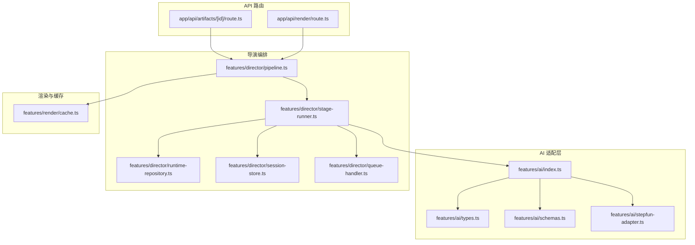
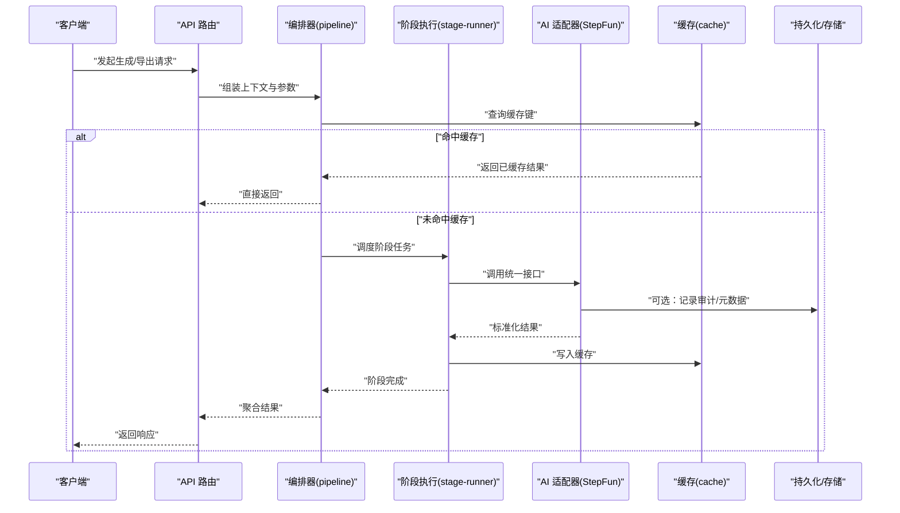
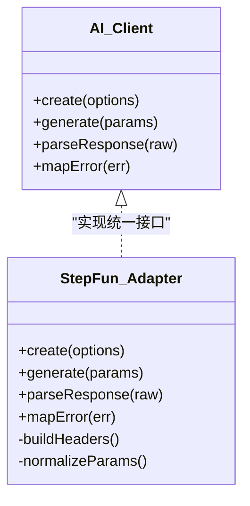
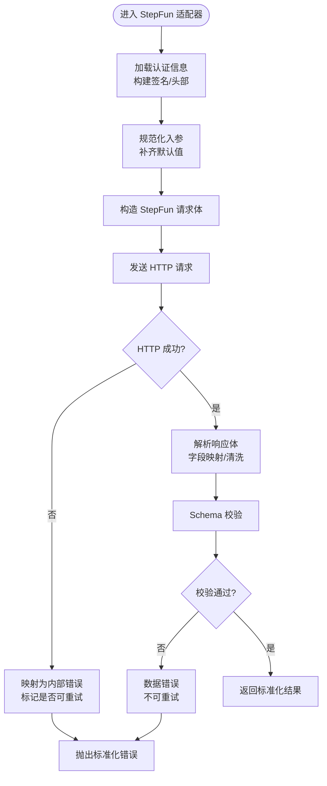
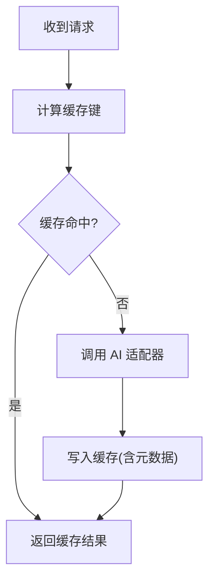
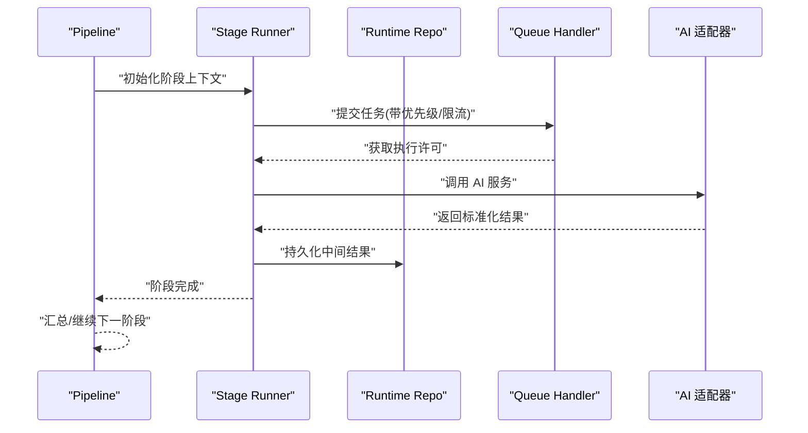
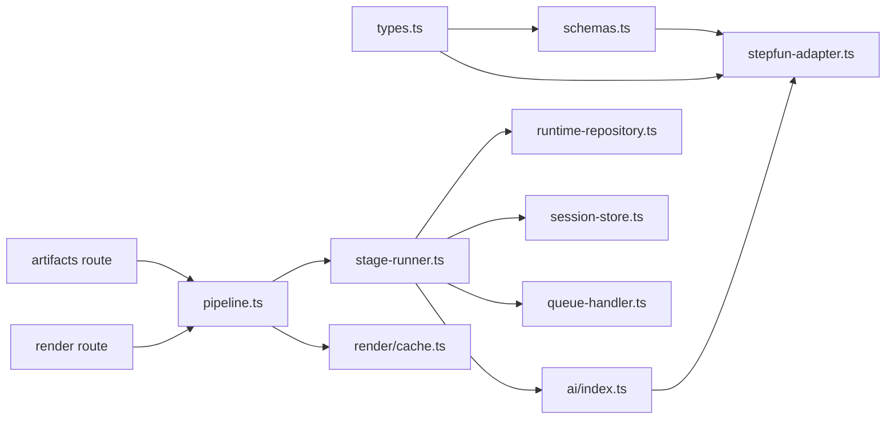

# AI 服务集成

<cite>
**本文引用的文件**   
- [src/features/ai/index.ts](file://src/features/ai/index.ts)
- [src/features/ai/types.ts](file://src/features/ai/types.ts)
- [src/features/ai/schemas.ts](file://src/features/ai/schemas.ts)
- [src/features/ai/stepfun-adapter.ts](file://src/features/ai/stepfun-adapter.ts)
- [src/features/ai/stepfun-adapter.test.ts](file://src/features/ai/stepfun-adapter.test.ts)
- [scripts/spikes/pi-stepfun-probe.mts](file://scripts/spikes/pi-stepfun-probe.mts)
- [scripts/spikes/pi-stepfun-probe.ts](file://scripts/spikes/pi-stepfun-probe.ts)
- [src/features/director/pipeline.ts](file://src/features/director/pipeline.ts)
- [src/features/director/stage-runner.ts](file://src/features/director/stage-runner.ts)
- [src/features/director/runtime-repository.ts](file://src/features/director/runtime-repository.ts)
- [src/features/director/session-store.ts](file://src/features/director/session-store.ts)
- [src/features/director/queue-handler.ts](file://src/features/director/queue-handler.ts)
- [src/features/render/cache.ts](file://src/features/render/cache.ts)
- [src/app/api/artifacts/[id]/route.ts](file://src/app/api/artifacts/[id]/route.ts)
- [src/app/api/render/route.ts](file://src/app/api/render/route.ts)
</cite>

## 目录
1. [简介](#简介)
2. [项目结构](#项目结构)
3. [核心组件](#核心组件)
4. [架构总览](#架构总览)
5. [详细组件分析](#详细组件分析)
6. [依赖关系分析](#依赖关系分析)
7. [性能与可靠性](#性能与可靠性)
8. [故障排查指南](#故障排查指南)
9. [结论](#结论)
10. [附录：扩展新 AI 提供商步骤](#附录扩展新-ai-提供商步骤)

## 简介
本指南面向希望在 CodeVideoCanvas 中集成新的 AI 服务提供商的开发者。文档围绕适配器模式展开，说明如何通过统一接口屏蔽不同 AI 服务的差异，涵盖认证、请求格式转换、响应解析与错误处理；并以 StepFun AI 为参考案例，给出端到端实现路径。同时介绍提示词模板系统、参数配置管理、结果缓存策略，以及性能优化、重试与降级方案，帮助你在保证稳定性的前提下快速接入第三方 AI 能力。

## 项目结构
AI 相关代码主要位于 features/ai 目录，StepFun 适配器作为首个具体实现；director 模块负责编排 AI 调用流程（管道、阶段执行、会话与队列）；render 模块提供渲染与缓存能力；API 路由将前端请求与后端处理逻辑解耦。

图表来源
- [src/features/ai/index.ts](file://src/features/ai/index.ts)
- [src/features/ai/types.ts](file://src/features/ai/types.ts)
- [src/features/ai/schemas.ts](file://src/features/ai/schemas.ts)
- [src/features/ai/stepfun-adapter.ts](file://src/features/ai/stepfun-adapter.ts)
- [src/features/director/pipeline.ts](file://src/features/director/pipeline.ts)
- [src/features/director/stage-runner.ts](file://src/features/director/stage-runner.ts)
- [src/features/director/runtime-repository.ts](file://src/features/director/runtime-repository.ts)
- [src/features/director/session-store.ts](file://src/features/director/session-store.ts)
- [src/features/director/queue-handler.ts](file://src/features/director/queue-handler.ts)
- [src/features/render/cache.ts](file://src/features/render/cache.ts)
- [src/app/api/artifacts/[id]/route.ts](file://src/app/api/artifacts/[id]/route.ts)
- [src/app/api/render/route.ts](file://src/app/api/render/route.ts)

章节来源
- [src/features/ai/index.ts](file://src/features/ai/index.ts)
- [src/features/ai/types.ts](file://src/features/ai/types.ts)
- [src/features/ai/schemas.ts](file://src/features/ai/schemas.ts)
- [src/features/ai/stepfun-adapter.ts](file://src/features/ai/stepfun-adapter.ts)
- [src/features/director/pipeline.ts](file://src/features/director/pipeline.ts)
- [src/features/director/stage-runner.ts](file://src/features/director/stage-runner.ts)
- [src/features/director/runtime-repository.ts](file://src/features/director/runtime-repository.ts)
- [src/features/director/session-store.ts](file://src/features/director/session-store.ts)
- [src/features/director/queue-handler.ts](file://src/features/director/queue-handler.ts)
- [src/features/render/cache.ts](file://src/features/render/cache.ts)
- [src/app/api/artifacts/[id]/route.ts](file://src/app/api/artifacts/[id]/route.ts)
- [src/app/api/render/route.ts](file://src/app/api/render/route.ts)

## 核心组件
- 适配器接口与类型定义：在 types.ts 中声明统一的 AI 客户端契约，包括方法签名、输入输出模型与错误类型，确保上层业务无需感知底层差异。
- Schema 校验：schemas.ts 提供对入参与出参的结构化校验，保障数据一致性并提升可观测性。
- StepFun 适配器：stepfun-adapter.ts 实现统一接口，封装 StepFun 的认证、请求构造、流式/非流式响应解析与错误映射。
- 导演编排：pipeline.ts 与 stage-runner.ts 组合多个阶段任务，按顺序或并行调度 AI 调用，并通过 runtime-repository.ts 与 session-store.ts 维护上下文与会话状态。
- 队列与异步：queue-handler.ts 提供任务排队与并发控制，避免瞬时峰值压垮下游服务。
- 渲染与缓存：cache.ts 提供结果缓存能力，减少重复调用与网络开销。
- API 路由：artifacts 与 render 路由将外部请求转交给编排层，完成鉴权、参数校验与结果返回。

章节来源
- [src/features/ai/types.ts](file://src/features/ai/types.ts)
- [src/features/ai/schemas.ts](file://src/features/ai/schemas.ts)
- [src/features/ai/stepfun-adapter.ts](file://src/features/ai/stepfun-adapter.ts)
- [src/features/director/pipeline.ts](file://src/features/director/pipeline.ts)
- [src/features/director/stage-runner.ts](file://src/features/director/stage-runner.ts)
- [src/features/director/runtime-repository.ts](file://src/features/director/runtime-repository.ts)
- [src/features/director/session-store.ts](file://src/features/director/session-store.ts)
- [src/features/director/queue-handler.ts](file://src/features/director/queue-handler.ts)
- [src/features/render/cache.ts](file://src/features/render/cache.ts)
- [src/app/api/artifacts/[id]/route.ts](file://src/app/api/artifacts/[id]/route.ts)
- [src/app/api/render/route.ts](file://src/app/api/render/route.ts)

## 架构总览
整体采用“适配器 + 编排”的分层架构：
- 适配层：对外暴露统一 AI 客户端接口，内部由具体适配器实现（如 StepFun）。
- 编排层：通过 pipeline 与 stage runner 组织多阶段任务，协调会话、运行时与队列。
- 基础设施：缓存、日志、监控、配置等横切关注点。
- 接入层：Next.js API 路由接收请求，委派给编排层，再经适配器调用第三方 AI。

图表来源
- [src/app/api/artifacts/[id]/route.ts](file://src/app/api/artifacts/[id]/route.ts)
- [src/app/api/render/route.ts](file://src/app/api/render/route.ts)
- [src/features/director/pipeline.ts](file://src/features/director/pipeline.ts)
- [src/features/director/stage-runner.ts](file://src/features/director/stage-runner.ts)
- [src/features/ai/stepfun-adapter.ts](file://src/features/ai/stepfun-adapter.ts)
- [src/features/render/cache.ts](file://src/features/render/cache.ts)

## 详细组件分析

### 适配器模式与统一接口
- 设计目标：以最小侵入方式替换或新增 AI 供应商，保持上层调用不变。
- 关键要素：
  - 统一接口：定义创建客户端、发送请求、解析响应、错误映射等方法。
  - 输入输出模型：使用 schemas 进行强约束，避免字段漂移导致的不一致。
  - 错误域：将各厂商异常归一化为内部错误类型，便于重试与降级决策。
- 扩展机制：新增供应商时仅需实现统一接口，并在工厂/注册表中注册即可被编排层发现与调用。

图表来源
- [src/features/ai/types.ts](file://src/features/ai/types.ts)
- [src/features/ai/stepfun-adapter.ts](file://src/features/ai/stepfun-adapter.ts)

章节来源
- [src/features/ai/types.ts](file://src/features/ai/types.ts)
- [src/features/ai/stepfun-adapter.ts](file://src/features/ai/stepfun-adapter.ts)

### StepFun AI 集成实现分析
- 认证：从配置中读取密钥并注入到请求头或签名参数中，支持环境变量与运行时覆盖。
- 请求构造：将统一参数转换为 StepFun 所需的 JSON 结构，包含模型、提示词、采样参数等。
- 响应解析：兼容文本/结构化输出，必要时进行二次清洗与字段映射。
- 错误处理：将 HTTP 状态码与业务错误码映射为内部错误，区分可重试与不可重试场景。
- 探针脚本：spikes 下的探针用于连通性与延迟探测，辅助定位问题。

图表来源
- [src/features/ai/stepfun-adapter.ts](file://src/features/ai/stepfun-adapter.ts)
- [src/features/ai/schemas.ts](file://src/features/ai/schemas.ts)
- [scripts/spikes/pi-stepfun-probe.mts](file://scripts/spikes/pi-stepfun-probe.mts)
- [scripts/spikes/pi-stepfun-probe.ts](file://scripts/spikes/pi-stepfun-probe.ts)

章节来源
- [src/features/ai/stepfun-adapter.ts](file://src/features/ai/stepfun-adapter.ts)
- [src/features/ai/schemas.ts](file://src/features/ai/schemas.ts)
- [scripts/spikes/pi-stepfun-probe.mts](file://scripts/spikes/pi-stepfun-probe.mts)
- [scripts/spikes/pi-stepfun-probe.ts](file://scripts/spikes/pi-stepfun-probe.ts)

### 提示词模板系统与参数配置管理
- 提示词模板：集中管理不同阶段的提示词，支持变量注入与条件分支，便于 A/B 测试与灰度发布。
- 参数配置：通过配置文件与环境变量分层管理，支持默认值、覆盖与热更新（若需要）。
- 建议实践：
  - 将提示词与业务逻辑解耦，置于独立模块或资源目录。
  - 对关键参数进行 schema 校验与范围检查，防止越界或非法值。
  - 为每次调用生成唯一 traceId，便于链路追踪。

章节来源
- [src/features/ai/schemas.ts](file://src/features/ai/schemas.ts)
- [src/features/director/pipeline.ts](file://src/features/director/pipeline.ts)

### 结果缓存策略
- 缓存键：基于输入参数哈希生成，确保相同语义的请求命中同一缓存。
- 失效策略：TTL 过期、版本变更或上游变更触发失效。
- 读写路径：先读后写，写回时附带元数据（模型、时间戳、质量分等），便于分析与回滚。
- 缓存穿透保护：对空结果或失败结果设置短 TTL，避免雪崩。

图表来源
- [src/features/render/cache.ts](file://src/features/render/cache.ts)

章节来源
- [src/features/render/cache.ts](file://src/features/render/cache.ts)

### 编排与阶段执行
- Pipeline：定义阶段序列与依赖关系，支持串行/并行执行与短路退出。
- Stage Runner：负责单个阶段的准备、执行、清理与结果合并。
- Runtime Repository：保存中间产物与运行时状态，供后续阶段复用。
- Session Store：维护会话级上下文（如用户偏好、历史对话片段）。
- Queue Handler：限制并发、背压与任务优先级，避免下游过载。

图表来源
- [src/features/director/pipeline.ts](file://src/features/director/pipeline.ts)
- [src/features/director/stage-runner.ts](file://src/features/director/stage-runner.ts)
- [src/features/director/runtime-repository.ts](file://src/features/director/runtime-repository.ts)
- [src/features/director/session-store.ts](file://src/features/director/session-store.ts)
- [src/features/director/queue-handler.ts](file://src/features/director/queue-handler.ts)

章节来源
- [src/features/director/pipeline.ts](file://src/features/director/pipeline.ts)
- [src/features/director/stage-runner.ts](file://src/features/director/stage-runner.ts)
- [src/features/director/runtime-repository.ts](file://src/features/director/runtime-repository.ts)
- [src/features/director/session-store.ts](file://src/features/director/session-store.ts)
- [src/features/director/queue-handler.ts](file://src/features/director/queue-handler.ts)

### API 路由与入口
- artifacts 路由：根据 ID 拉取或生成制品，可能触发 AI 管线。
- render 路由：触发渲染流程，结合缓存与队列，返回进度或最终结果。

章节来源
- [src/app/api/artifacts/[id]/route.ts](file://src/app/api/artifacts/[id]/route.ts)
- [src/app/api/render/route.ts](file://src/app/api/render/route.ts)

## 依赖关系分析
- 低耦合：适配器仅依赖统一接口与配置，不关心上层编排细节。
- 高内聚：每个适配器自包含认证、请求、解析与错误映射逻辑。
- 外部依赖：HTTP 客户端、加密库、序列化库等应抽象为可替换实现，便于测试与替换。
- 潜在循环：确保适配器不反向依赖编排层，避免循环引用。

图表来源
- [src/features/ai/types.ts](file://src/features/ai/types.ts)
- [src/features/ai/schemas.ts](file://src/features/ai/schemas.ts)
- [src/features/ai/stepfun-adapter.ts](file://src/features/ai/stepfun-adapter.ts)
- [src/features/ai/index.ts](file://src/features/ai/index.ts)
- [src/features/director/pipeline.ts](file://src/features/director/pipeline.ts)
- [src/features/director/stage-runner.ts](file://src/features/director/stage-runner.ts)
- [src/features/director/runtime-repository.ts](file://src/features/director/runtime-repository.ts)
- [src/features/director/session-store.ts](file://src/features/director/session-store.ts)
- [src/features/director/queue-handler.ts](file://src/features/director/queue-handler.ts)
- [src/features/render/cache.ts](file://src/features/render/cache.ts)
- [src/app/api/artifacts/[id]/route.ts](file://src/app/api/artifacts/[id]/route.ts)
- [src/app/api/render/route.ts](file://src/app/api/render/route.ts)

章节来源
- [src/features/ai/types.ts](file://src/features/ai/types.ts)
- [src/features/ai/schemas.ts](file://src/features/ai/schemas.ts)
- [src/features/ai/stepfun-adapter.ts](file://src/features/ai/stepfun-adapter.ts)
- [src/features/ai/index.ts](file://src/features/ai/index.ts)
- [src/features/director/pipeline.ts](file://src/features/director/pipeline.ts)
- [src/features/director/stage-runner.ts](file://src/features/director/stage-runner.ts)
- [src/features/director/runtime-repository.ts](file://src/features/director/runtime-repository.ts)
- [src/features/director/session-store.ts](file://src/features/director/session-store.ts)
- [src/features/director/queue-handler.ts](file://src/features/director/queue-handler.ts)
- [src/features/render/cache.ts](file://src/features/render/cache.ts)
- [src/app/api/artifacts/[id]/route.ts](file://src/app/api/artifacts/[id]/route.ts)
- [src/app/api/render/route.ts](file://src/app/api/render/route.ts)

## 性能与可靠性
- 连接池与超时：为 HTTP 客户端配置合理的连接池大小、请求与读取超时，避免资源耗尽。
- 重试与退避：对可重试错误（如 429、5xx）实施指数退避与抖动，限制最大重试次数。
- 熔断与降级：当错误率或延迟超过阈值时熔断，切换至降级策略（如返回缓存、占位内容或本地模型）。
- 并发控制：通过队列处理器限制并发度，配合流水线并行阶段，平衡吞吐与稳定性。
- 缓存命中率：优化缓存键粒度，避免过粗导致污染，过细导致命中率低。
- 可观测性：埋点统计耗时、成功率、错误分类与缓存命中情况，支撑容量规划与问题定位。

[本节为通用指导，不涉及具体文件]

## 故障排查指南
- 认证失败：检查密钥来源、签名算法与时钟同步；确认请求头/参数是否正确注入。
- 参数校验失败：核对 schema 定义与实际入参，关注必填字段与枚举值。
- 响应解析异常：打印原始响应片段，定位字段缺失或类型不一致。
- 超时与限流：观察下游状态码与速率限制提示，调整重试与退避策略。
- 缓存问题：验证缓存键生成逻辑与失效策略，检查脏数据与竞争写入。
- 探针与诊断：使用 spikes 中的探针脚本进行连通性与延迟探测，辅助定位网络或服务端问题。

章节来源
- [src/features/ai/stepfun-adapter.ts](file://src/features/ai/stepfun-adapter.ts)
- [src/features/ai/schemas.ts](file://src/features/ai/schemas.ts)
- [scripts/spikes/pi-stepfun-probe.mts](file://scripts/spikes/pi-stepfun-probe.mts)
- [scripts/spikes/pi-stepfun-probe.ts](file://scripts/spikes/pi-stepfun-probe.ts)

## 结论
通过适配器模式与编排层的解耦，CodeVideoCanvas 能够以较低成本接入多种 AI 服务。StepFun 适配器提供了完整的认证、请求构造、响应解析与错误处理范式；配合提示词模板、参数配置、缓存与队列机制，可在保证稳定性的同时获得良好的性能表现。遵循本文的扩展步骤与最佳实践，可快速引入新的 AI 提供商并平滑演进。

## 附录：扩展新 AI 提供商步骤
- 定义统一接口：在 types.ts 中补充或完善方法签名与错误类型。
- 实现适配器：新建 adapter 文件，实现认证、请求构造、响应解析与错误映射。
- 注册与发现：在 ai/index.ts 中注册新适配器，并提供工厂方法或选择策略。
- 配置与模板：在配置文件中添加新供应商的配置项，必要时新增提示词模板。
- 校验与测试：在 schemas.ts 中增加校验规则，编写单元测试与集成测试。
- 编排集成：在 pipeline 或 stage-runner 中引入新适配器，配置重试与降级策略。
- 缓存与可观测性：为新调用路径配置缓存键与埋点，监控指标与告警。
- 上线与回滚：灰度发布，逐步放量，保留快速回滚能力。

章节来源
- [src/features/ai/types.ts](file://src/features/ai/types.ts)
- [src/features/ai/index.ts](file://src/features/ai/index.ts)
- [src/features/ai/schemas.ts](file://src/features/ai/schemas.ts)
- [src/features/director/pipeline.ts](file://src/features/director/pipeline.ts)
- [src/features/director/stage-runner.ts](file://src/features/director/stage-runner.ts)