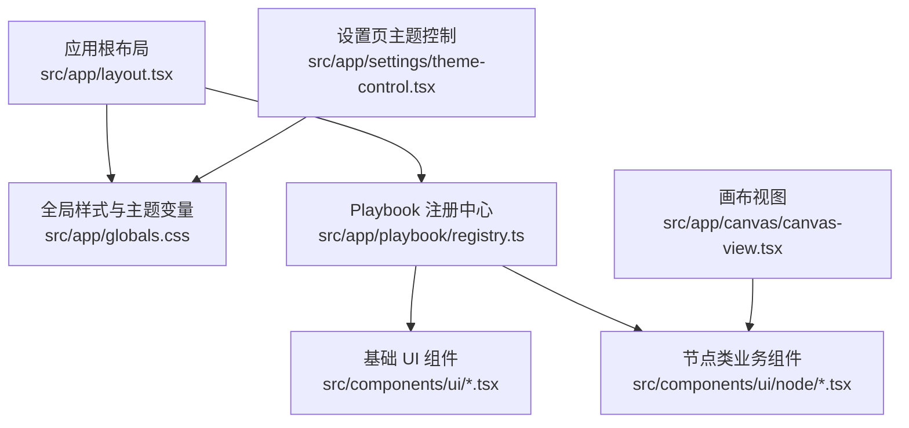
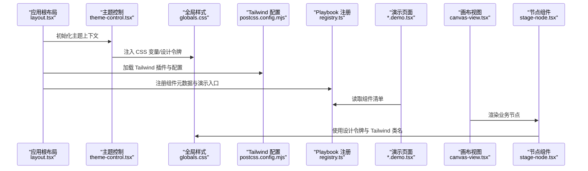
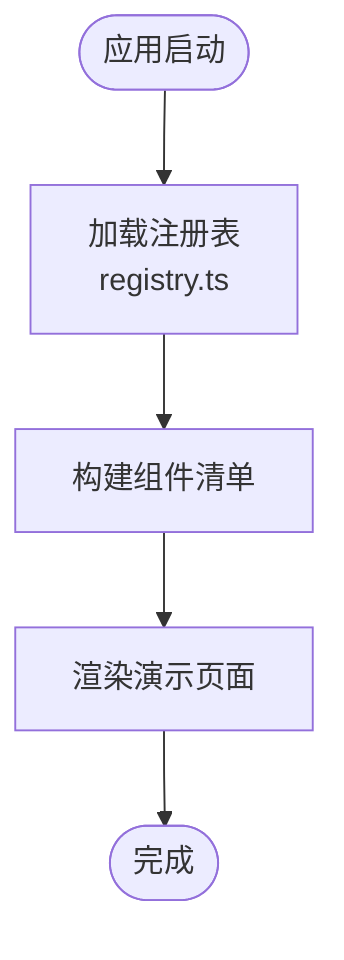
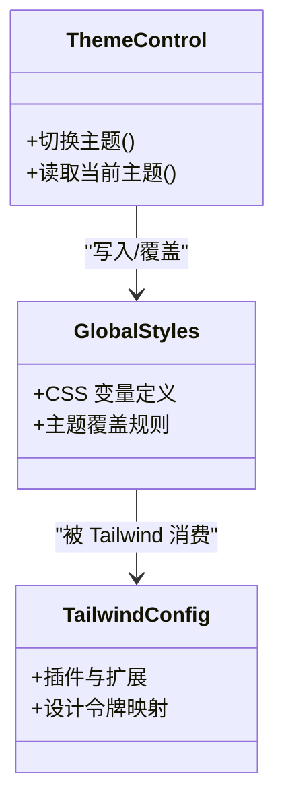
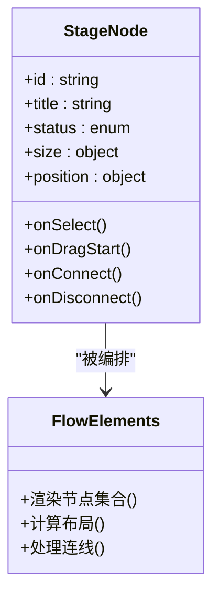
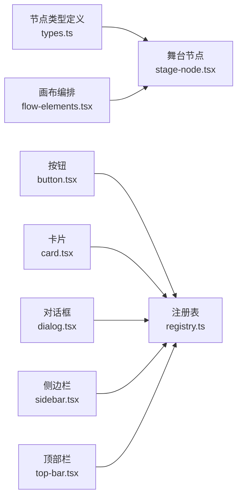

# UI 组件扩展

<cite>
**本文引用的文件**   
- [README.md](file://README.md)
- [next.config.ts](file://next.config.ts)
- [postcss.config.mjs](file://postcss.config.mjs)
- [globals.css](file://src/app/globals.css)
- [layout.tsx](file://src/app/layout.tsx)
- [theme-control.tsx](file://src/app/settings/theme-control.tsx)
- [theme-control.test.ts](file://src/app/settings/theme-control.test.ts)
- [registry.ts](file://src/app/playbook/registry.ts)
- [registry.test.ts](file://src/app/playbook/registry.test.ts)
- [button.tsx](file://src/components/ui/button.tsx)
- [button.demo.tsx](file://src/components/ui/button.demo.tsx)
- [card.tsx](file://src/components/ui/card.tsx)
- [card.demo.tsx](file://src/components/ui/card.demo.tsx)
- [dialog.tsx](file://src/components/ui/dialog.tsx)
- [dialog.demo.tsx](file://src/components/ui/dialog.demo.tsx)
- [sidebar.tsx](file://src/components/ui/sidebar.tsx)
- [sidebar.demo.tsx](file://src/components/ui/sidebar.demo.tsx)
- [top-bar.tsx](file://src/components/ui/top-bar.tsx)
- [top-bar.demo.tsx](file://src/components/ui/top-bar.demo.tsx)
- [node/stage-node.tsx](file://src/components/ui/node/stage-node.tsx)
- [node/stage-node.demo.tsx](file://src/components/ui/node/stage-node.demo.tsx)
- [node/types.ts](file://src/components/ui/node/types.ts)
- [canvas-view.tsx](file://src/app/canvas/canvas-view.tsx)
- [flow-elements.tsx](file://src/app/canvas/flow-elements.tsx)
</cite>

## 目录
1. [简介](#简介)
2. [项目结构](#项目结构)
3. [核心组件](#核心组件)
4. [架构总览](#架构总览)
5. [详细组件分析](#详细组件分析)
6. [依赖分析](#依赖分析)
7. [性能考虑](#性能考虑)
8. [故障排查指南](#故障排查指南)
9. [结论](#结论)
10. [附录](#附录)

## 简介
本指南面向希望为 CodeVideoCanvas 构建可复用 UI 组件的开发者，聚焦以下目标：
- 理解并扩展组件注册系统（Playbook Registry）
- 掌握主题定制机制与样式系统（CSS 变量、Tailwind、设计令牌）
- 学习创建业务组件的接口设计、属性配置与事件处理
- 了解组件组合模式、状态管理与性能优化最佳实践
- 学会生成组件文档与演示页面
- 提供自定义组件开发示例与集成步骤

## 项目结构
CodeVideoCanvas 采用 Next.js App Router 组织应用，UI 组件集中在 src/components/ui，业务节点在 src/components/ui/node，Playbook 注册与演示位于 src/app/playbook。全局样式与主题入口在 src/app/globals.css 与 src/app/layout.tsx，设置页包含主题控制组件。

图示来源
- [layout.tsx](file://src/app/layout.tsx)
- [globals.css](file://src/app/globals.css)
- [registry.ts](file://src/app/playbook/registry.ts)
- [button.tsx](file://src/components/ui/button.tsx)
- [stage-node.tsx](file://src/components/ui/node/stage-node.tsx)
- [theme-control.tsx](file://src/app/settings/theme-control.tsx)
- [canvas-view.tsx](file://src/app/canvas/canvas-view.tsx)

章节来源
- [README.md](file://README.md)
- [next.config.ts](file://next.config.ts)
- [postcss.config.mjs](file://postcss.config.mjs)
- [layout.tsx](file://src/app/layout.tsx)
- [globals.css](file://src/app/globals.css)
- [registry.ts](file://src/app/playbook/registry.ts)

## 核心组件
- 基础 UI 组件：按钮、卡片、对话框、侧边栏、顶部栏等，遵循一致的 props 约定与可访问性规范。
- 节点类业务组件：如 stage-node，用于画布中的可视化节点，具备拖拽、连接、状态展示等能力。
- Playbook 注册系统：集中管理组件元数据与演示入口，便于文档化与检索。

章节来源
- [button.tsx](file://src/components/ui/button.tsx)
- [card.tsx](file://src/components/ui/card.tsx)
- [dialog.tsx](file://src/components/ui/dialog.tsx)
- [sidebar.tsx](file://src/components/ui/sidebar.tsx)
- [top-bar.tsx](file://src/components/ui/top-bar.tsx)
- [stage-node.tsx](file://src/components/ui/node/stage-node.tsx)
- [types.ts](file://src/components/ui/node/types.ts)
- [registry.ts](file://src/app/playbook/registry.ts)

## 架构总览
下图展示了从应用启动到组件渲染与主题生效的关键路径，以及 Playbook 注册系统与演示页面的关系。

图示来源
- [layout.tsx](file://src/app/layout.tsx)
- [theme-control.tsx](file://src/app/settings/theme-control.tsx)
- [globals.css](file://src/app/globals.css)
- [postcss.config.mjs](file://postcss.config.mjs)
- [registry.ts](file://src/app/playbook/registry.ts)
- [stage-node.tsx](file://src/components/ui/node/stage-node.tsx)
- [canvas-view.tsx](file://src/app/canvas/canvas-view.tsx)

## 详细组件分析

### 组件注册系统（Playbook Registry）
- 职责：集中定义组件元信息（名称、分类、描述、演示入口），并提供查询 API 供演示页面与文档工具消费。
- 关键流程：
  - 注册阶段：在 registry.ts 中声明组件条目，指向对应的 .demo.tsx 或页面路由。
  - 消费阶段：演示页面通过 registry 获取列表并渲染预览。
  - 测试保障：registry.test.ts 验证注册表结构与导出完整性。

图示来源
- [registry.ts](file://src/app/playbook/registry.ts)
- [registry.test.ts](file://src/app/playbook/registry.test.ts)

章节来源
- [registry.ts](file://src/app/playbook/registry.ts)
- [registry.test.ts](file://src/app/playbook/registry.test.ts)

### 主题定制与样式系统
- 设计令牌：通过 CSS 变量在 globals.css 中集中定义颜色、间距、圆角、阴影等，确保跨组件一致性。
- Tailwind 集成：postcss.config.mjs 启用 Tailwind，结合 CSS 变量实现主题切换与覆盖。
- 运行时主题控制：theme-control.tsx 提供用户交互以切换主题，动态更新 CSS 变量。
- 最佳实践：
  - 将语义化令牌（如“主色”“背景”“边框”）映射到 CSS 变量。
  - 组件优先使用 Tailwind 原子类，必要时通过 CSS 变量进行覆盖。
  - 避免硬编码颜色值，统一从设计令牌读取。

图示来源
- [theme-control.tsx](file://src/app/settings/theme-control.tsx)
- [globals.css](file://src/app/globals.css)
- [postcss.config.mjs](file://postcss.config.mjs)

章节来源
- [theme-control.tsx](file://src/app/settings/theme-control.tsx)
- [theme-control.test.ts](file://src/app/settings/theme-control.test.ts)
- [globals.css](file://src/app/globals.css)
- [postcss.config.mjs](file://postcss.config.mjs)

### 可复用业务组件：节点组件（Stage Node）
- 职责：在画布中渲染舞台节点，支持属性面板、状态指示、交互反馈。
- 接口设计：
  - Props：节点 ID、标题、状态、尺寸、位置、回调事件（点击、拖拽、连接）。
  - 事件：onSelect、onDragStart、onConnect、onDisconnect 等。
  - 状态：内部仅维护必要本地状态，外部状态由父级或全局状态管理。
- 组合模式：与其他节点类型组合形成流程图；通过 flow-elements.tsx 编排节点布局与连线。

图示来源
- [stage-node.tsx](file://src/components/ui/node/stage-node.tsx)
- [types.ts](file://src/components/ui/node/types.ts)
- [flow-elements.tsx](file://src/app/canvas/flow-elements.tsx)

章节来源
- [stage-node.tsx](file://src/components/ui/node/stage-node.tsx)
- [stage-node.demo.tsx](file://src/components/ui/node/stage-node.demo.tsx)
- [types.ts](file://src/components/ui/node/types.ts)
- [flow-elements.tsx](file://src/app/canvas/flow-elements.tsx)
- [canvas-view.tsx](file://src/app/canvas/canvas-view.tsx)

### 基础 UI 组件示例（Button/Card/Dialog/Sidebar/TopBar）
- 共同约定：
  - 命名：组件文件与 demo 文件分离，便于独立测试与演示。
  - Props：明确可选与必填字段，提供默认值与类型约束。
  - 可访问性：键盘导航、ARIA 属性、焦点管理。
  - 主题适配：通过 Tailwind 与设计令牌保持一致外观。
- 演示与文档：每个组件附带 .demo.tsx，注册到 Playbook 以便浏览与复制用法。

章节来源
- [button.tsx](file://src/components/ui/button.tsx)
- [button.demo.tsx](file://src/components/ui/button.demo.tsx)
- [card.tsx](file://src/components/ui/card.tsx)
- [card.demo.tsx](file://src/components/ui/card.demo.tsx)
- [dialog.tsx](file://src/components/ui/dialog.tsx)
- [dialog.demo.tsx](file://src/components/ui/dialog.demo.tsx)
- [sidebar.tsx](file://src/components/ui/sidebar.tsx)
- [sidebar.demo.tsx](file://src/components/ui/sidebar.demo.tsx)
- [top-bar.tsx](file://src/components/ui/top-bar.tsx)
- [top-bar.demo.tsx](file://src/components/ui/top-bar.demo.tsx)

## 依赖分析
- 组件间耦合：
  - 节点组件依赖画布编排逻辑（flow-elements），并通过 types.ts 共享类型契约。
  - 基础 UI 组件尽量无外部业务依赖，保持高内聚与低耦合。
- 外部依赖：
  - Tailwind 通过 postcss.config.mjs 引入，配合 CSS 变量实现主题。
  - Next.js 应用布局与路由由 layout.tsx 与 app 目录组织。

图示来源
- [types.ts](file://src/components/ui/node/types.ts)
- [stage-node.tsx](file://src/components/ui/node/stage-node.tsx)
- [flow-elements.tsx](file://src/app/canvas/flow-elements.tsx)
- [button.tsx](file://src/components/ui/button.tsx)
- [card.tsx](file://src/components/ui/card.tsx)
- [dialog.tsx](file://src/components/ui/dialog.tsx)
- [sidebar.tsx](file://src/components/ui/sidebar.tsx)
- [top-bar.tsx](file://src/components/ui/top-bar.tsx)
- [registry.ts](file://src/app/playbook/registry.ts)

章节来源
- [types.ts](file://src/components/ui/node/types.ts)
- [stage-node.tsx](file://src/components/ui/node/stage-node.tsx)
- [flow-elements.tsx](file://src/app/canvas/flow-elements.tsx)
- [button.tsx](file://src/components/ui/button.tsx)
- [card.tsx](file://src/components/ui/card.tsx)
- [dialog.tsx](file://src/components/ui/dialog.tsx)
- [sidebar.tsx](file://src/components/ui/sidebar.tsx)
- [top-bar.tsx](file://src/components/ui/top-bar.tsx)
- [registry.ts](file://src/app/playbook/registry.ts)

## 性能考虑
- 组件粒度：将复杂 UI 拆分为小颗粒子组件，减少重渲染范围。
- 状态提升：将频繁变化的状态提升到最近的公共父级，避免深层传递。
- 惰性加载：对大型演示或复杂节点使用动态导入，降低首屏体积。
- 样式优化：优先使用 Tailwind 原子类，避免过度嵌套与重复样式。
- 主题切换：通过 CSS 变量批量更新，减少 DOM 操作与重排。

[本节为通用指导，不直接分析具体文件]

## 故障排查指南
- 主题未生效：
  - 检查 theme-control.tsx 是否正确写入 CSS 变量。
  - 确认 globals.css 中变量定义与 Tailwind 映射是否一致。
- 组件无法在 Playbook 显示：
  - 核对 registry.ts 中条目是否完整且路径正确。
  - 运行 registry.test.ts 验证注册表结构。
- 节点渲染异常：
  - 检查 types.ts 的类型定义是否与 stage-node.tsx 的 props 匹配。
  - 查看 flow-elements.tsx 的布局与连线逻辑是否有边界条件遗漏。

章节来源
- [theme-control.tsx](file://src/app/settings/theme-control.tsx)
- [globals.css](file://src/app/globals.css)
- [registry.ts](file://src/app/playbook/registry.ts)
- [registry.test.ts](file://src/app/playbook/registry.test.ts)
- [types.ts](file://src/components/ui/node/types.ts)
- [stage-node.tsx](file://src/components/ui/node/stage-node.tsx)
- [flow-elements.tsx](file://src/app/canvas/flow-elements.tsx)

## 结论
通过统一的注册系统、清晰的主题与样式体系、以及良好的组件接口与组合模式，CodeVideoCanvas 提供了可扩展的 UI 生态。遵循本文档的最佳实践，可以快速构建高质量、可维护的业务组件，并在演示与文档层面获得良好体验。

[本节为总结，不直接分析具体文件]

## 附录

### 自定义组件开发示例与集成指南
- 新建组件：
  - 在 src/components/ui 下创建 my-component.tsx，定义清晰的 props 与默认行为。
  - 创建 my-component.demo.tsx，提供常用用法与交互示例。
- 注册组件：
  - 在 registry.ts 中添加条目，指向演示文件或页面路由。
- 主题适配：
  - 在 globals.css 中新增或复用设计令牌，确保组件样式一致。
  - 如需覆盖，优先通过 Tailwind 类名或 CSS 变量调整。
- 集成到画布：
  - 若为节点类组件，参考 stage-node.tsx 的接口与事件模型。
  - 在 flow-elements.tsx 中编排新节点，确保布局与连线正常。
- 测试与文档：
  - 编写单元测试与演示用例，保证稳定性与可发现性。
  - 在 Playbook 中浏览与复制用法，完善说明文档。

章节来源
- [button.tsx](file://src/components/ui/button.tsx)
- [button.demo.tsx](file://src/components/ui/button.demo.tsx)
- [card.tsx](file://src/components/ui/card.tsx)
- [card.demo.tsx](file://src/components/ui/card.demo.tsx)
- [dialog.tsx](file://src/components/ui/dialog.tsx)
- [dialog.demo.tsx](file://src/components/ui/dialog.demo.tsx)
- [sidebar.tsx](file://src/components/ui/sidebar.tsx)
- [sidebar.demo.tsx](file://src/components/ui/sidebar.demo.tsx)
- [top-bar.tsx](file://src/components/ui/top-bar.tsx)
- [top-bar.demo.tsx](file://src/components/ui/top-bar.demo.tsx)
- [stage-node.tsx](file://src/components/ui/node/stage-node.tsx)
- [stage-node.demo.tsx](file://src/components/ui/node/stage-node.demo.tsx)
- [types.ts](file://src/components/ui/node/types.ts)
- [flow-elements.tsx](file://src/app/canvas/flow-elements.tsx)
- [registry.ts](file://src/app/playbook/registry.ts)
- [globals.css](file://src/app/globals.css)
- [postcss.config.mjs](file://postcss.config.mjs)
- [theme-control.tsx](file://src/app/settings/theme-control.tsx)