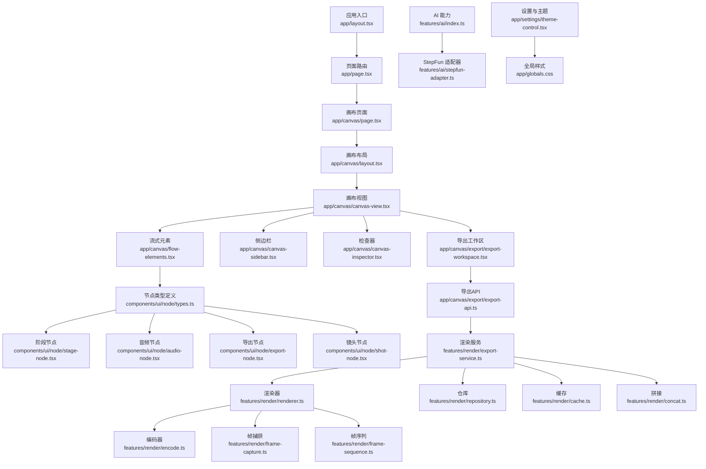
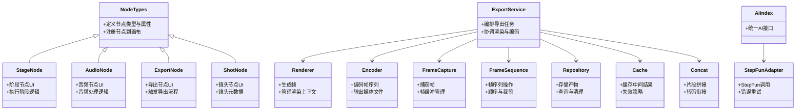
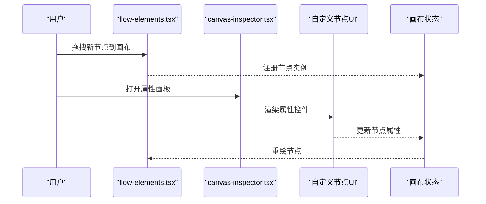
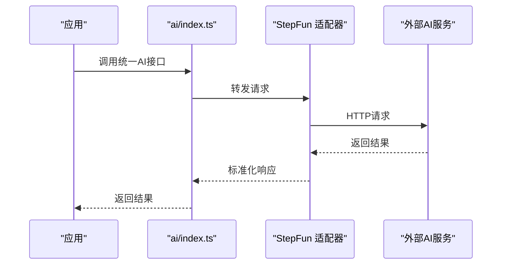
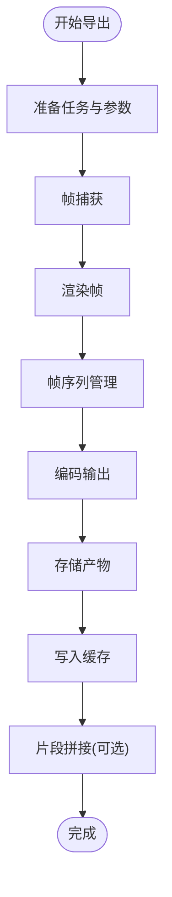
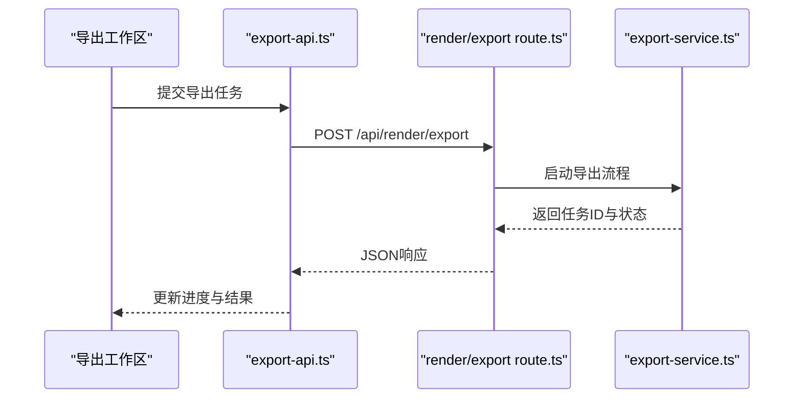
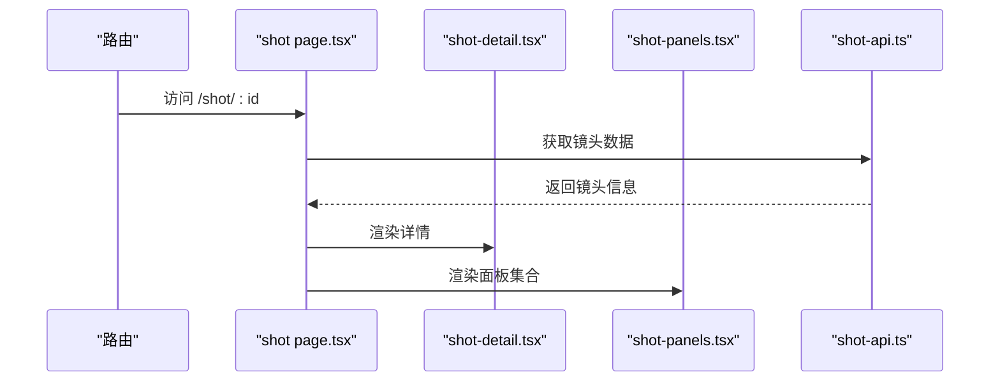
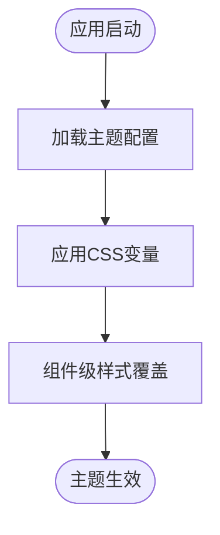
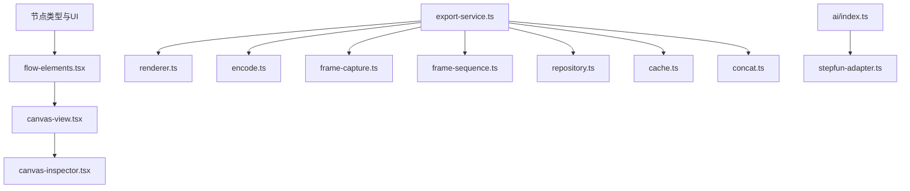

# 扩展开发

<cite>
**本文引用的文件**   
- [README.md](file://README.md)
- [package.json](file://package.json)
- [next.config.ts](file://next.config.ts)
- [src/app/layout.tsx](file://src/app/layout.tsx)
- [src/app/page.tsx](file://src/app/page.tsx)
- [src/app/canvas/page.tsx](file://src/app/canvas/page.tsx)
- [src/app/canvas/layout.tsx](file://src/app/canvas/layout.tsx)
- [src/app/canvas/canvas-view.tsx](file://src/app/canvas/canvas-view.tsx)
- [src/app/canvas/flow-elements.tsx](file://src/app/canvas/flow-elements.tsx)
- [src/app/canvas/canvas-sidebar.tsx](file://src/app/canvas/canvas-sidebar.tsx)
- [src/app/canvas/canvas-inspector.tsx](file://src/app/canvas/canvas-inspector.tsx)
- [src/app/canvas/export/page.tsx](file://src/app/canvas/export/page.tsx)
- [src/app/canvas/export/export-workspace.tsx](file://src/app/canvas/export/export-workspace.tsx)
- [src/app/canvas/export/export-api.ts](file://src/app/canvas/export/export-api.ts)
- [src/app/canvas/export/export-view-model.ts](file://src/app/canvas/export/export-view-model.ts)
- [src/app/canvas/shot/[id]/page.tsx](file://src/app/canvas/shot/[id]/page.tsx)
- [src/app/canvas/shot/[id]/shot-detail.tsx](file://src/app/canvas/shot/[id]/shot-detail.tsx)
- [src/app/canvas/shot/[id]/shot-panels.tsx](file://src/app/canvas/shot/[id]/shot-panels.tsx)
- [src/app/canvas/shot/[id]/shot-api.ts](file://src/app/canvas/shot/[id]/shot-api.ts)
- [src/components/ui/node/types.ts](file://src/components/ui/node/types.ts)
- [src/components/ui/node/stage-node.tsx](file://src/components/ui/node/stage-node.tsx)
- [src/components/ui/node/audio-node.tsx](file://src/components/ui/node/audio-node.tsx)
- [src/components/ui/node/export-node.tsx](file://src/components/ui/node/export-node.tsx)
- [src/components/ui/node/shot-node.tsx](file://src/components/ui/node/shot-node.tsx)
- [src/features/canvas/index.ts](file://src/features/canvas/index.ts)
- [src/features/canvas/types.ts](file://src/features/canvas/types.ts)
- [src/features/canvas/actions.ts](file://src/features/canvas/actions.ts)
- [src/features/canvas/schemas.ts](file://src/features/canvas/schemas.ts)
- [src/features/canvas/layout.ts](file://src/features/canvas/layout.ts)
- [src/features/canvas/queries.ts](file://src/features/canvas/queries.ts)
- [src/features/canvas/status.ts](file://src/features/canvas/status.ts)
- [src/features/render/index.ts](file://src/features/render/index.ts)
- [src/features/render/renderer.ts](file://src/features/render/renderer.ts)
- [src/features/render/encode.ts](file://src/features/render/encode.ts)
- [src/features/render/export-service.ts](file://src/features/render/export-service.ts)
- [src/features/render/frame-capture.ts](file://src/features/render/frame-capture.ts)
- [src/features/render/frame-sequence.ts](file://src/features/render/frame-sequence.ts)
- [src/features/render/repository.ts](file://src/features/render/repository.ts)
- [src/features/render/cache.ts](file://src/features/render/cache.ts)
- [src/features/render/concat.ts](file://src/features/render/concat.ts)
- [src/features/render/types.ts](file://src/features/render/types.ts)
- [src/features/ai/index.ts](file://src/features/ai/index.ts)
- [src/features/ai/types.ts](file://src/features/ai/types.ts)
- [src/features/ai/schemas.ts](file://src/features/ai/schemas.ts)
- [src/features/ai/stepfun-adapter.ts](file://src/features/ai/stepfun-adapter.ts)
- [src/app/api/render/route.ts](file://src/app/api/render/route.ts)
- [src/app/api/render/export/route.ts](file://src/app/api/render/export/route.ts)
- [src/app/settings/theme-control.tsx](file://src/app/settings/theme-control.tsx)
- [src/app/globals.css](file://src/app/globals.css)
</cite>

## 目录
1. [简介](#简介)
2. [项目结构](#项目结构)
3. [核心组件](#核心组件)
4. [架构总览](#架构总览)
5. [详细组件分析](#详细组件分析)
6. [依赖关系分析](#依赖关系分析)
7. [性能考虑](#性能考虑)
8. [故障排查指南](#故障排查指南)
9. [结论](#结论)
10. [附录](#附录)

## 简介
本指南面向希望为 CodeVideoCanvas 进行扩展开发的开发者，涵盖以下主题：
- 自定义节点类型开发与注册
- 集成新的 AI 服务提供商（适配器）
- 扩展渲染与编码器（导出格式、编码参数）
- 插件系统与扩展点说明
- 完整自定义组件教程（属性面板、时间轴集成）
- 添加新导出格式与编码参数的步骤
- 主题定制与样式覆盖方法
- 实际扩展示例与最佳实践

目标读者包括前端工程师、全栈工程师以及希望基于 CodeVideoCanvas 构建二次应用的开发者。

## 项目结构
CodeVideoCanvas 采用 Next.js 应用结构，结合 features 分层组织业务模块，UI 组件集中在 components/ui，节点相关 UI 位于 components/ui/node，渲染与导出逻辑在 features/render，AI 能力在 features/ai，画布与编辑界面在 app/canvas。

图表来源
- [src/app/layout.tsx:1-200](file://src/app/layout.tsx#L1-L200)
- [src/app/page.tsx:1-200](file://src/app/page.tsx#L1-L200)
- [src/app/canvas/page.tsx:1-200](file://src/app/canvas/page.tsx#L1-L200)
- [src/app/canvas/layout.tsx:1-200](file://src/app/canvas/layout.tsx#L1-L200)
- [src/app/canvas/canvas-view.tsx:1-200](file://src/app/canvas/canvas-view.tsx#L1-L200)
- [src/app/canvas/flow-elements.tsx:1-200](file://src/app/canvas/flow-elements.tsx#L1-L200)
- [src/app/canvas/canvas-sidebar.tsx:1-200](file://src/app/canvas/canvas-sidebar.tsx#L1-L200)
- [src/app/canvas/canvas-inspector.tsx:1-200](file://src/app/canvas/canvas-inspector.tsx#L1-L200)
- [src/components/ui/node/types.ts:1-200](file://src/components/ui/node/types.ts#L1-L200)
- [src/components/ui/node/stage-node.tsx:1-200](file://src/components/ui/node/stage-node.tsx#L1-L200)
- [src/components/ui/node/audio-node.tsx:1-200](file://src/components/ui/node/audio-node.tsx#L1-L200)
- [src/components/ui/node/export-node.tsx:1-200](file://src/components/ui/node/export-node.tsx#L1-L200)
- [src/components/ui/node/shot-node.tsx:1-200](file://src/components/ui/node/shot-node.tsx#L1-L200)
- [src/app/canvas/export/export-workspace.tsx:1-200](file://src/app/canvas/export/export-workspace.tsx#L1-L200)
- [src/app/canvas/export/export-api.ts:1-200](file://src/app/canvas/export/export-api.ts#L1-L200)
- [src/features/render/export-service.ts:1-200](file://src/features/render/export-service.ts#L1-L200)
- [src/features/render/renderer.ts:1-200](file://src/features/render/renderer.ts#L1-L200)
- [src/features/render/encode.ts:1-200](file://src/features/render/encode.ts#L1-L200)
- [src/features/render/frame-capture.ts:1-200](file://src/features/render/frame-capture.ts#L1-L200)
- [src/features/render/frame-sequence.ts:1-200](file://src/features/render/frame-sequence.ts#L1-L200)
- [src/features/render/repository.ts:1-200](file://src/features/render/repository.ts#L1-L200)
- [src/features/render/cache.ts:1-200](file://src/features/render/cache.ts#L1-L200)
- [src/features/render/concat.ts:1-200](file://src/features/render/concat.ts#L1-L200)
- [src/features/ai/index.ts:1-200](file://src/features/ai/index.ts#L1-L200)
- [src/features/ai/stepfun-adapter.ts:1-200](file://src/features/ai/stepfun-adapter.ts#L1-L200)
- [src/app/settings/theme-control.tsx:1-200](file://src/app/settings/theme-control.tsx#L1-L200)
- [src/app/globals.css:1-200](file://src/app/globals.css#L1-L200)

章节来源
- [README.md:1-200](file://README.md#L1-L200)
- [package.json:1-200](file://package.json#L1-L200)
- [next.config.ts:1-200](file://next.config.ts#L1-L200)

## 核心组件
- 画布与编辑器
  - 画布页面与布局负责挂载 Canvas 视图、侧边栏与检查器，提供节点拖拽、连线与状态管理的基础环境。
  - flow-elements 将节点类型映射到具体 UI 组件，是扩展节点类型的关键扩展点。
- 节点系统
  - node/types.ts 定义了节点类型、属性与行为契约；stage-node、audio-node、export-node、shot-node 是内置节点实现。
  - 新增节点需遵循类型契约并在 flow-elements 中注册。
- 渲染与导出
  - export-service 协调渲染流程，renderer 负责帧生成，encode 处理编码，frame-capture/frame-sequence 负责帧采集与序列管理，repository 持久化产物，cache 加速重复任务，concat 合并片段。
- AI 能力
  - ai/index.ts 暴露统一接口，stepfun-adapter 是 StepFun 的适配器实现，用于接入外部 AI 服务。
- 设置与主题
  - theme-control 提供主题切换与控制，globals.css 定义全局样式变量与覆盖点。

章节来源
- [src/app/canvas/canvas-view.tsx:1-200](file://src/app/canvas/canvas-view.tsx#L1-L200)
- [src/app/canvas/flow-elements.tsx:1-200](file://src/app/canvas/flow-elements.tsx#L1-L200)
- [src/components/ui/node/types.ts:1-200](file://src/components/ui/node/types.ts#L1-L200)
- [src/components/ui/node/stage-node.tsx:1-200](file://src/components/ui/node/stage-node.tsx#L1-L200)
- [src/components/ui/node/audio-node.tsx:1-200](file://src/components/ui/node/audio-node.tsx#L1-L200)
- [src/components/ui/node/export-node.tsx:1-200](file://src/components/ui/node/export-node.tsx#L1-L200)
- [src/components/ui/node/shot-node.tsx:1-200](file://src/components/ui/node/shot-node.tsx#L1-L200)
- [src/features/render/export-service.ts:1-200](file://src/features/render/export-service.ts#L1-L200)
- [src/features/render/renderer.ts:1-200](file://src/features/render/renderer.ts#L1-L200)
- [src/features/render/encode.ts:1-200](file://src/features/render/encode.ts#L1-L200)
- [src/features/render/frame-capture.ts:1-200](file://src/features/render/frame-capture.ts#L1-L200)
- [src/features/render/frame-sequence.ts:1-200](file://src/features/render/frame-sequence.ts#L1-L200)
- [src/features/render/repository.ts:1-200](file://src/features/render/repository.ts#L1-L200)
- [src/features/render/cache.ts:1-200](file://src/features/render/cache.ts#L1-L200)
- [src/features/render/concat.ts:1-200](file://src/features/render/concat.ts#L1-L200)
- [src/features/ai/index.ts:1-200](file://src/features/ai/index.ts#L1-L200)
- [src/features/ai/stepfun-adapter.ts:1-200](file://src/features/ai/stepfun-adapter.ts#L1-L200)
- [src/app/settings/theme-control.tsx:1-200](file://src/app/settings/theme-control.tsx#L1-L200)
- [src/app/globals.css:1-200](file://src/app/globals.css#L1-L200)

## 架构总览
CodeVideoCanvas 的扩展体系围绕“节点 + 渲染 + AI + 主题”四个维度展开：
- 节点层：通过类型契约与 UI 组件解耦，支持动态注册与渲染。
- 渲染层：以流水线方式组织帧捕获、渲染、编码与输出，便于扩展新格式与编码器。
- AI 层：通过适配器模式封装不同提供商，统一调用接口。
- 主题层：通过 CSS 变量与组件级样式覆盖实现外观定制。

图表来源
- [src/components/ui/node/types.ts:1-200](file://src/components/ui/node/types.ts#L1-L200)
- [src/components/ui/node/stage-node.tsx:1-200](file://src/components/ui/node/stage-node.tsx#L1-L200)
- [src/components/ui/node/audio-node.tsx:1-200](file://src/components/ui/node/audio-node.tsx#L1-L200)
- [src/components/ui/node/export-node.tsx:1-200](file://src/components/ui/node/export-node.tsx#L1-L200)
- [src/components/ui/node/shot-node.tsx:1-200](file://src/components/ui/node/shot-node.tsx#L1-L200)
- [src/features/render/export-service.ts:1-200](file://src/features/render/export-service.ts#L1-L200)
- [src/features/render/renderer.ts:1-200](file://src/features/render/renderer.ts#L1-L200)
- [src/features/render/encode.ts:1-200](file://src/features/render/encode.ts#L1-L200)
- [src/features/render/frame-capture.ts:1-200](file://src/features/render/frame-capture.ts#L1-L200)
- [src/features/render/frame-sequence.ts:1-200](file://src/features/render/frame-sequence.ts#L1-L200)
- [src/features/render/repository.ts:1-200](file://src/features/render/repository.ts#L1-L200)
- [src/features/render/cache.ts:1-200](file://src/features/render/cache.ts#L1-L200)
- [src/features/render/concat.ts:1-200](file://src/features/render/concat.ts#L1-L200)
- [src/features/ai/index.ts:1-200](file://src/features/ai/index.ts#L1-L200)
- [src/features/ai/stepfun-adapter.ts:1-200](file://src/features/ai/stepfun-adapter.ts#L1-L200)

## 详细组件分析

### 自定义节点类型开发
- 节点类型契约
  - 在 node/types.ts 中定义节点类型、属性结构与行为接口。新增节点需遵循该契约，确保画布与检查器能正确识别与编辑。
- 节点 UI 组件
  - 参考 stage-node、audio-node、export-node、shot-node 的实现，创建新节点的 UI 组件，包含输入控件、预览与交互逻辑。
- 节点注册
  - 在 flow-elements.tsx 中将新节点类型映射到对应 UI 组件，使画布能够渲染并允许用户拖拽使用。
- 属性面板与时间轴集成
  - 在 canvas-inspector.tsx 中为新节点添加属性编辑面板，支持实时修改与校验。
  - 若节点涉及时间轴轨道，需在 timeline-track 或相关区域注册轨道项，确保时间轴显示与播放同步。

图表来源
- [src/app/canvas/flow-elements.tsx:1-200](file://src/app/canvas/flow-elements.tsx#L1-L200)
- [src/app/canvas/canvas-inspector.tsx:1-200](file://src/app/canvas/canvas-inspector.tsx#L1-L200)
- [src/components/ui/node/types.ts:1-200](file://src/components/ui/node/types.ts#L1-L200)

章节来源
- [src/components/ui/node/types.ts:1-200](file://src/components/ui/node/types.ts#L1-L200)
- [src/app/canvas/flow-elements.tsx:1-200](file://src/app/canvas/flow-elements.tsx#L1-L200)
- [src/app/canvas/canvas-inspector.tsx:1-200](file://src/app/canvas/canvas-inspector.tsx#L1-L200)

### 集成新的 AI 服务提供商
- 适配器模式
  - 在 ai/index.ts 中定义统一的 AI 接口，stepfun-adapter.ts 作为 StepFun 的具体实现。新增提供商需实现相同接口，便于替换与扩展。
- 调用流程
  - 通过统一接口发起请求，处理认证、参数映射、错误重试与结果解析。
- 配置与开关
  - 在 settings 或环境变量中配置提供商密钥与端点，运行时选择启用哪个适配器。

图表来源
- [src/features/ai/index.ts:1-200](file://src/features/ai/index.ts#L1-L200)
- [src/features/ai/stepfun-adapter.ts:1-200](file://src/features/ai/stepfun-adapter.ts#L1-L200)

章节来源
- [src/features/ai/index.ts:1-200](file://src/features/ai/index.ts#L1-L200)
- [src/features/ai/stepfun-adapter.ts:1-200](file://src/features/ai/stepfun-adapter.ts#L1-L200)

### 扩展渲染与编码器
- 渲染流水线
  - export-service.ts 编排任务，renderer.ts 生成帧，encode.ts 编码输出，frame-capture.ts 与 frame-sequence.ts 管理帧数据，repository.ts 与 cache.ts 负责存储与缓存，concat.ts 处理片段拼接。
- 新增导出格式
  - 在 encode.ts 中添加新编码器实现，支持特定容器与编码参数。
  - 在 export-service.ts 中注册新格式，使其可在导出工作区中选择。
- 编码参数扩展
  - 在 types.ts 中扩展编码参数结构，确保 UI 与后端一致。

图表来源
- [src/features/render/export-service.ts:1-200](file://src/features/render/export-service.ts#L1-L200)
- [src/features/render/renderer.ts:1-200](file://src/features/render/renderer.ts#L1-L200)
- [src/features/render/encode.ts:1-200](file://src/features/render/encode.ts#L1-L200)
- [src/features/render/frame-capture.ts:1-200](file://src/features/render/frame-capture.ts#L1-L200)
- [src/features/render/frame-sequence.ts:1-200](file://src/features/render/frame-sequence.ts#L1-L200)
- [src/features/render/repository.ts:1-200](file://src/features/render/repository.ts#L1-L200)
- [src/features/render/cache.ts:1-200](file://src/features/render/cache.ts#L1-L200)
- [src/features/render/concat.ts:1-200](file://src/features/render/concat.ts#L1-L200)

章节来源
- [src/features/render/export-service.ts:1-200](file://src/features/render/export-service.ts#L1-L200)
- [src/features/render/renderer.ts:1-200](file://src/features/render/renderer.ts#L1-L200)
- [src/features/render/encode.ts:1-200](file://src/features/render/encode.ts#L1-L200)
- [src/features/render/types.ts:1-200](file://src/features/render/types.ts#L1-L200)

### 导出 API 与工作区
- 导出工作区
  - export-workspace.tsx 提供导出配置与进度展示，export-api.ts 封装与后端的交互。
- 后端路由
  - api/render/route.ts 与 api/render/export/route.ts 处理渲染与导出请求，协调队列与任务状态。

图表来源
- [src/app/canvas/export/export-workspace.tsx:1-200](file://src/app/canvas/export/export-workspace.tsx#L1-L200)
- [src/app/canvas/export/export-api.ts:1-200](file://src/app/canvas/export/export-api.ts#L1-L200)
- [src/app/api/render/export/route.ts:1-200](file://src/app/api/render/export/route.ts#L1-L200)
- [src/features/render/export-service.ts:1-200](file://src/features/render/export-service.ts#L1-L200)

章节来源
- [src/app/canvas/export/export-workspace.tsx:1-200](file://src/app/canvas/export/export-workspace.tsx#L1-L200)
- [src/app/canvas/export/export-api.ts:1-200](file://src/app/canvas/export/export-api.ts#L1-L200)
- [src/app/api/render/export/route.ts:1-200](file://src/app/api/render/export/route.ts#L1-L200)

### 镜头详情与面板
- 镜头页面
  - shot/[id]/page.tsx 加载镜头详情，shot-detail.tsx 展示详细信息，shot-panels.tsx 提供可插拔的面板。
- 镜头 API
  - shot-api.ts 封装镜头数据的获取与更新。

图表来源
- [src/app/canvas/shot/[id]/page.tsx:1-200](file://src/app/canvas/shot/[id]/page.tsx#L1-L200)
- [src/app/canvas/shot/[id]/shot-detail.tsx:1-200](file://src/app/canvas/shot/[id]/shot-detail.tsx#L1-L200)
- [src/app/canvas/shot/[id]/shot-panels.tsx:1-200](file://src/app/canvas/shot/[id]/shot-panels.tsx#L1-L200)
- [src/app/canvas/shot/[id]/shot-api.ts:1-200](file://src/app/canvas/shot/[id]/shot-api.ts#L1-L200)

章节来源
- [src/app/canvas/shot/[id]/page.tsx:1-200](file://src/app/canvas/shot/[id]/page.tsx#L1-L200)
- [src/app/canvas/shot/[id]/shot-detail.tsx:1-200](file://src/app/canvas/shot/[id]/shot-detail.tsx#L1-L200)
- [src/app/canvas/shot/[id]/shot-panels.tsx:1-200](file://src/app/canvas/shot/[id]/shot-panels.tsx#L1-L200)
- [src/app/canvas/shot/[id]/shot-api.ts:1-200](file://src/app/canvas/shot/[id]/shot-api.ts#L1-L200)

### 主题定制与样式覆盖
- 主题控制
  - theme-control.tsx 提供主题切换与配置，globals.css 定义全局 CSS 变量与覆盖点。
- 覆盖策略
  - 通过 CSS 变量与组件级样式类名进行覆盖，避免直接修改源码，便于升级与维护。

图表来源
- [src/app/settings/theme-control.tsx:1-200](file://src/app/settings/theme-control.tsx#L1-L200)
- [src/app/globals.css:1-200](file://src/app/globals.css#L1-L200)

章节来源
- [src/app/settings/theme-control.tsx:1-200](file://src/app/settings/theme-control.tsx#L1-L200)
- [src/app/globals.css:1-200](file://src/app/globals.css#L1-L200)

## 依赖关系分析
- 模块耦合
  - 节点类型与 UI 组件通过类型契约解耦，flow-elements 作为注册中心降低耦合度。
  - 渲染服务与编码器通过接口抽象，便于替换与扩展。
- 外部依赖
  - AI 适配器依赖外部服务，需处理网络异常与鉴权。
  - 存储与缓存依赖文件系统或对象存储，需关注容量与性能。

图表来源
- [src/app/canvas/flow-elements.tsx:1-200](file://src/app/canvas/flow-elements.tsx#L1-L200)
- [src/app/canvas/canvas-view.tsx:1-200](file://src/app/canvas/canvas-view.tsx#L1-L200)
- [src/app/canvas/canvas-inspector.tsx:1-200](file://src/app/canvas/canvas-inspector.tsx#L1-L200)
- [src/features/render/export-service.ts:1-200](file://src/features/render/export-service.ts#L1-L200)
- [src/features/render/renderer.ts:1-200](file://src/features/render/renderer.ts#L1-L200)
- [src/features/render/encode.ts:1-200](file://src/features/render/encode.ts#L1-L200)
- [src/features/render/frame-capture.ts:1-200](file://src/features/render/frame-capture.ts#L1-L200)
- [src/features/render/frame-sequence.ts:1-200](file://src/features/render/frame-sequence.ts#L1-L200)
- [src/features/render/repository.ts:1-200](file://src/features/render/repository.ts#L1-L200)
- [src/features/render/cache.ts:1-200](file://src/features/render/cache.ts#L1-L200)
- [src/features/render/concat.ts:1-200](file://src/features/render/concat.ts#L1-L200)
- [src/features/ai/index.ts:1-200](file://src/features/ai/index.ts#L1-L200)
- [src/features/ai/stepfun-adapter.ts:1-200](file://src/features/ai/stepfun-adapter.ts#L1-L200)

章节来源
- [src/features/canvas/index.ts:1-200](file://src/features/canvas/index.ts#L1-L200)
- [src/features/canvas/types.ts:1-200](file://src/features/canvas/types.ts#L1-L200)
- [src/features/canvas/actions.ts:1-200](file://src/features/canvas/actions.ts#L1-L200)
- [src/features/canvas/schemas.ts:1-200](file://src/features/canvas/schemas.ts#L1-L200)
- [src/features/canvas/layout.ts:1-200](file://src/features/canvas/layout.ts#L1-L200)
- [src/features/canvas/queries.ts:1-200](file://src/features/canvas/queries.ts#L1-L200)
- [src/features/canvas/status.ts:1-200](file://src/features/canvas/status.ts#L1-L200)

## 性能考虑
- 帧捕获与渲染
  - 使用离屏渲染与批处理减少主线程阻塞，合理设置帧率与分辨率。
- 缓存策略
  - 对中间结果与重复任务启用缓存，设置合理的失效策略与清理机制。
- 编码优化
  - 根据目标平台选择合适的编码器与参数，避免过度压缩导致质量下降。
- 存储与I/O
  - 使用异步写入与分块传输，避免大文件阻塞，监控磁盘空间与网络带宽。

[本节为通用指导，不直接分析具体文件]

## 故障排查指南
- 节点不显示或无法编辑
  - 检查 node/types.ts 中的类型定义与 flow-elements.tsx 中的注册是否匹配。
  - 确认 canvas-inspector.tsx 中属性面板是否正确绑定。
- AI 调用失败
  - 检查 stepfun-adapter.ts 中的认证与端点配置，查看错误日志与重试策略。
- 导出失败或卡顿
  - 检查 export-service.ts 的任务编排与 renderer.ts 的渲染上下文，确认 encode.ts 的参数与目标格式支持。
  - 查看 repository.ts 与 cache.ts 的存储状态与缓存命中率。

章节来源
- [src/components/ui/node/types.ts:1-200](file://src/components/ui/node/types.ts#L1-L200)
- [src/app/canvas/flow-elements.tsx:1-200](file://src/app/canvas/flow-elements.tsx#L1-L200)
- [src/app/canvas/canvas-inspector.tsx:1-200](file://src/app/canvas/canvas-inspector.tsx#L1-L200)
- [src/features/ai/stepfun-adapter.ts:1-200](file://src/features/ai/stepfun-adapter.ts#L1-L200)
- [src/features/render/export-service.ts:1-200](file://src/features/render/export-service.ts#L1-L200)
- [src/features/render/renderer.ts:1-200](file://src/features/render/renderer.ts#L1-L200)
- [src/features/render/encode.ts:1-200](file://src/features/render/encode.ts#L1-L200)
- [src/features/render/repository.ts:1-200](file://src/features/render/repository.ts#L1-L200)
- [src/features/render/cache.ts:1-200](file://src/features/render/cache.ts#L1-L200)

## 结论
CodeVideoCanvas 提供了清晰的扩展点与模块化架构，开发者可通过节点注册、AI 适配器与渲染编码器扩展功能。建议遵循类型契约与接口约定，保持组件解耦与可测试性，同时利用缓存与异步优化性能。主题与样式覆盖应优先使用 CSS 变量与组件级样式，确保可维护性与兼容性。

[本节为总结，不直接分析具体文件]

## 附录
- 快速上手清单
  - 新增节点：定义类型 -> 创建 UI -> 注册到 flow-elements -> 在 inspector 中添加属性面板。
  - 新增 AI 提供商：实现统一接口 -> 配置端点与密钥 -> 在设置中启用。
  - 新增导出格式：实现编码器 -> 注册到 export-service -> 在导出工作区选择。
  - 主题定制：定义 CSS 变量 -> 在 theme-control 中切换 -> 组件级覆盖样式。

[本节为补充信息，不直接分析具体文件]