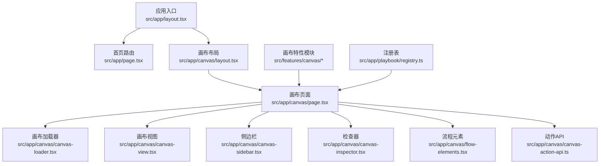
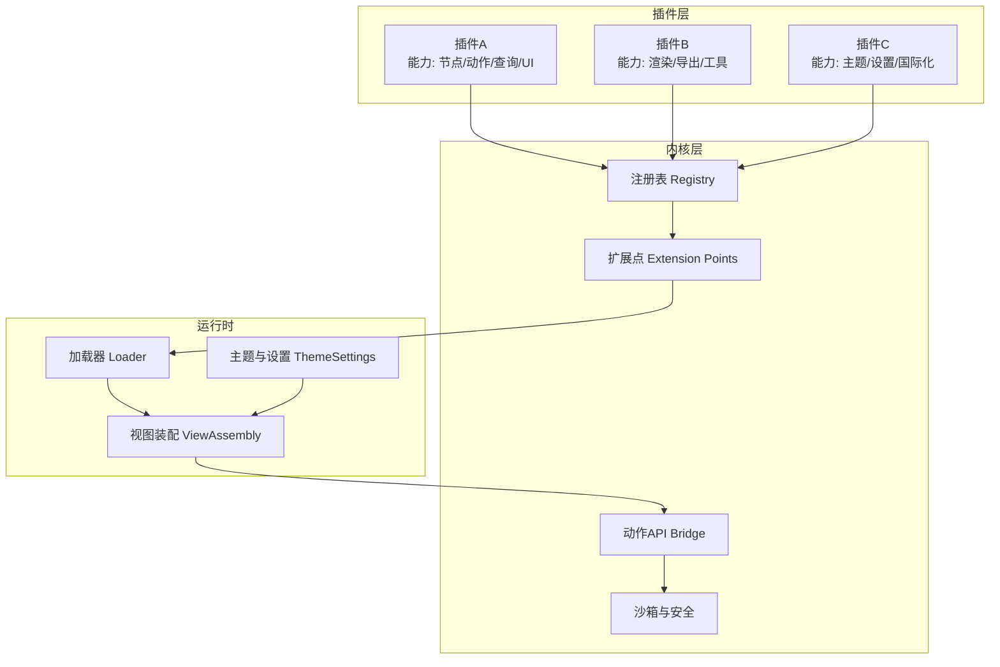
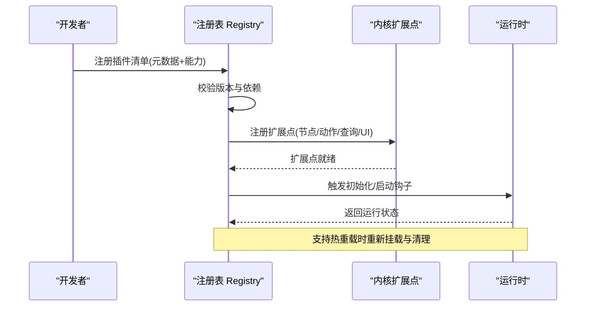
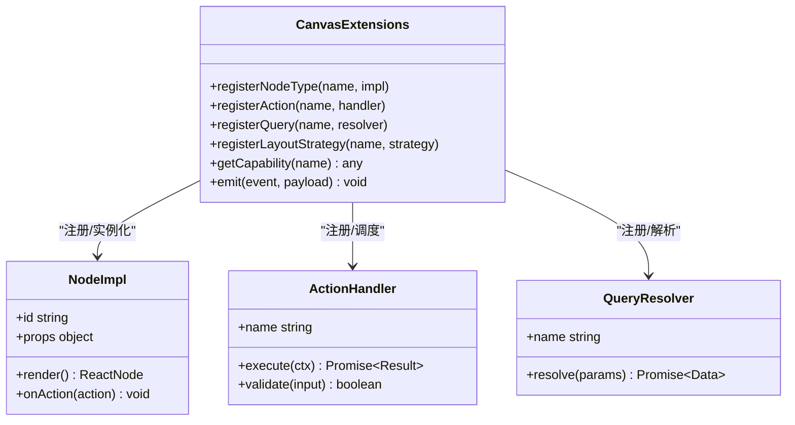
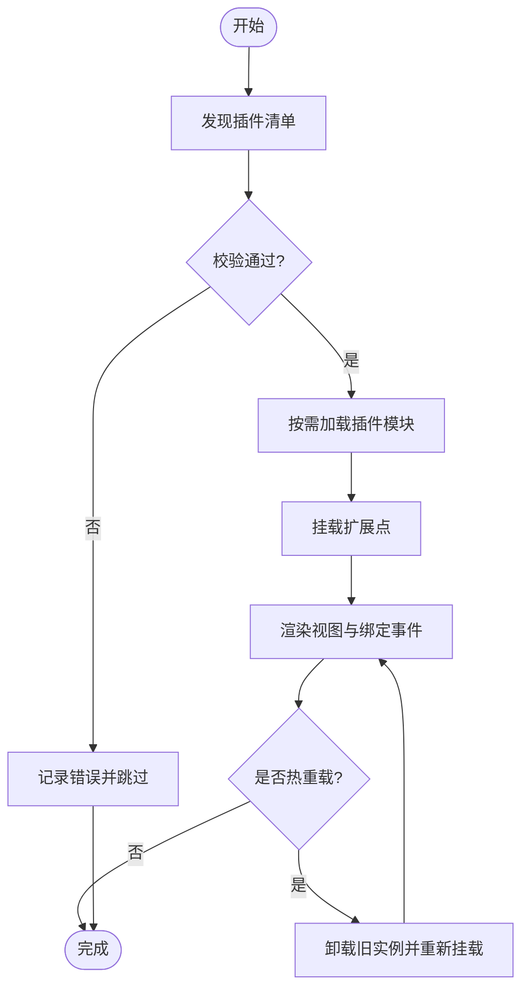
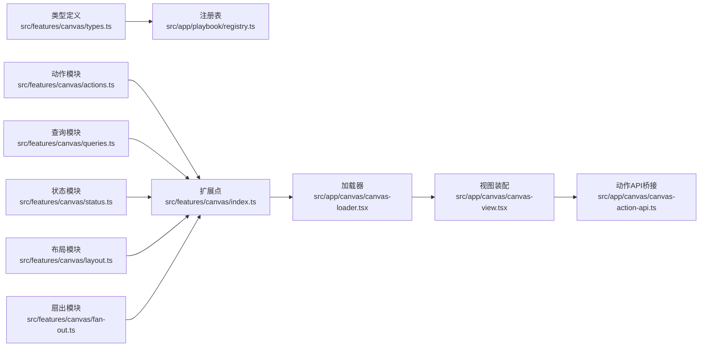

# 插件系统架构

<cite>
**本文引用的文件**   
- [README.md](file://README.md)
- [package.json](file://package.json)
- [next.config.ts](file://next.config.ts)
- [tsconfig.json](file://tsconfig.json)
- [vitest.config.ts](file://vitest.config.ts)
- [eslint.config.mjs](file://eslint.config.mjs)
- [drizzle.config.ts](file://drizzle.config.ts)
- [src/app/layout.tsx](file://src/app/layout.tsx)
- [src/app/page.tsx](file://src/app/page.tsx)
- [src/app/canvas/layout.tsx](file://src/app/canvas/layout.tsx)
- [src/app/canvas/page.tsx](file://src/app/canvas/page.tsx)
- [src/app/canvas/canvas-loader.tsx](file://src/app/canvas/canvas-loader.tsx)
- [src/app/canvas/canvas-view.tsx](file://src/app/canvas/canvas-view.tsx)
- [src/app/canvas/canvas-sidebar.tsx](file://src/app/canvas/canvas-sidebar.tsx)
- [src/app/canvas/canvas-inspector.tsx](file://src/app/canvas/canvas-inspector.tsx)
- [src/app/canvas/flow-elements.tsx](file://src/app/canvas/flow-elements.tsx)
- [src/app/canvas/canvas-action-api.ts](file://src/app/canvas/canvas-action-api.ts)
- [src/features/canvas/index.ts](file://src/features/canvas/index.ts)
- [src/features/canvas/types.ts](file://src/features/canvas/types.ts)
- [src/features/canvas/actions.ts](file://src/features/canvas/actions.ts)
- [src/features/canvas/queries.ts](file://src/features/canvas/queries.ts)
- [src/features/canvas/status.ts](file://src/features/canvas/status.ts)
- [src/features/canvas/layout.ts](file://src/features/canvas/layout.ts)
- [src/features/canvas/fan-out.ts](file://src/features/canvas/fan-out.ts)
- [src/app/playbook/registry.ts](file://src/app/playbook/registry.ts)
- [src/app/playbook/registry.test.ts](file://src/app/playbook/registry.test.ts)
- [src/app/settings/theme-control.tsx](file://src/app/settings/theme-control.tsx)
- [src/lib/utils.ts](file://src/lib/utils.ts)
</cite>

## 目录
1. [简介](#简介)
2. [项目结构](#项目结构)
3. [核心组件](#核心组件)
4. [架构总览](#架构总览)
5. [详细组件分析](#详细组件分析)
6. [依赖关系分析](#依赖关系分析)
7. [性能考量](#性能考量)
8. [故障排查指南](#故障排查指南)
9. [结论](#结论)
10. [附录](#附录)

## 简介
本文件为 CodeVideoCanvas 的“插件系统架构”设计文档。基于当前仓库结构与代码组织，我们提出一套可扩展、可插拔、可热重载的插件体系，用于扩展画布能力、渲染管线、工具与 UI 面板等。该架构强调：
- 清晰的扩展点与生命周期管理
- 稳定的依赖注入与模块化加载
- 安全的沙箱与权限控制
- 版本兼容与热重载支持
- 完善的开发工具链与调试环境
- 明确的插件通信协议与数据共享机制

## 项目结构
CodeVideoCanvas 采用 Next.js App Router 与功能域（features）分层组织。与插件系统相关的关键位置包括：
- 应用入口与布局：src/app/layout.tsx、src/app/page.tsx
- 画布子系统：src/app/canvas/* 与 src/features/canvas/*
- 注册表与编排：src/app/playbook/registry.ts
- 配置与构建：next.config.ts、tsconfig.json、package.json
- 测试与质量：vitest.config.ts、eslint.config.mjs

图表来源
- [src/app/layout.tsx](file://src/app/layout.tsx)
- [src/app/page.tsx](file://src/app/page.tsx)
- [src/app/canvas/layout.tsx](file://src/app/canvas/layout.tsx)
- [src/app/canvas/page.tsx](file://src/app/canvas/page.tsx)
- [src/app/canvas/canvas-loader.tsx](file://src/app/canvas/canvas-loader.tsx)
- [src/app/canvas/canvas-view.tsx](file://src/app/canvas/canvas-view.tsx)
- [src/app/canvas/canvas-sidebar.tsx](file://src/app/canvas/canvas-sidebar.tsx)
- [src/app/canvas/canvas-inspector.tsx](file://src/app/canvas/canvas-inspector.tsx)
- [src/app/canvas/flow-elements.tsx](file://src/app/canvas/flow-elements.tsx)
- [src/app/canvas/canvas-action-api.ts](file://src/app/canvas/canvas-action-api.ts)
- [src/features/canvas/index.ts](file://src/features/canvas/index.ts)
- [src/app/playbook/registry.ts](file://src/app/playbook/registry.ts)

章节来源
- [README.md](file://README.md)
- [package.json](file://package.json)
- [next.config.ts](file://next.config.ts)
- [tsconfig.json](file://tsconfig.json)
- [vitest.config.ts](file://vitest.config.ts)
- [eslint.config.mjs](file://eslint.config.mjs)
- [drizzle.config.ts](file://drizzle.config.ts)

## 核心组件
- 插件注册表（Registry）：集中管理插件元信息、版本约束、依赖声明与生命周期钩子。参考路径：[src/app/playbook/registry.ts](file://src/app/playbook/registry.ts)、[src/app/playbook/registry.test.ts](file://src/app/playbook/registry.test.ts)
- 画布扩展点（Canvas Extensions）：在画布中暴露节点类型、动作、查询、状态机与布局策略等扩展点。参考路径：[src/features/canvas/index.ts](file://src/features/canvas/index.ts)、[src/features/canvas/types.ts](file://src/features/canvas/types.ts)、[src/features/canvas/actions.ts](file://src/features/canvas/actions.ts)、[src/features/canvas/queries.ts](file://src/features/canvas/queries.ts)、[src/features/canvas/status.ts](file://src/features/canvas/status.ts)、[src/features/canvas/layout.ts](file://src/features/canvas/layout.ts)、[src/features/canvas/fan-out.ts](file://src/features/canvas/fan-out.ts)
- 运行时装配（Runtime Assembly）：通过加载器与视图组合，将插件提供的能力注入到画布界面与逻辑中。参考路径：[src/app/canvas/canvas-loader.tsx](file://src/app/canvas/canvas-loader.tsx)、[src/app/canvas/canvas-view.tsx](file://src/app/canvas/canvas-view.tsx)、[src/app/canvas/canvas-sidebar.tsx](file://src/app/canvas/canvas-sidebar.tsx)、[src/app/canvas/canvas-inspector.tsx](file://src/app/canvas/canvas-inspector.tsx)、[src/app/canvas/flow-elements.tsx](file://src/app/canvas/flow-elements.tsx)
- 动作与API桥接（Action API Bridge）：统一封装插件可调用的动作接口，提供安全校验与权限控制。参考路径：[src/app/canvas/canvas-action-api.ts](file://src/app/canvas/canvas-action-api.ts)
- 主题与设置（Theme & Settings）：作为插件可订阅的配置源，支持动态切换与持久化。参考路径：[src/app/settings/theme-control.tsx](file://src/app/settings/theme-control.tsx)

章节来源
- [src/app/playbook/registry.ts](file://src/app/playbook/registry.ts)
- [src/app/playbook/registry.test.ts](file://src/app/playbook/registry.test.ts)
- [src/features/canvas/index.ts](file://src/features/canvas/index.ts)
- [src/features/canvas/types.ts](file://src/features/canvas/types.ts)
- [src/features/canvas/actions.ts](file://src/features/canvas/actions.ts)
- [src/features/canvas/queries.ts](file://src/features/canvas/queries.ts)
- [src/features/canvas/status.ts](file://src/features/canvas/status.ts)
- [src/features/canvas/layout.ts](file://src/features/canvas/layout.ts)
- [src/features/canvas/fan-out.ts](file://src/features/canvas/fan-out.ts)
- [src/app/canvas/canvas-loader.tsx](file://src/app/canvas/canvas-loader.tsx)
- [src/app/canvas/canvas-view.tsx](file://src/app/canvas/canvas-view.tsx)
- [src/app/canvas/canvas-sidebar.tsx](file://src/app/canvas/canvas-sidebar.tsx)
- [src/app/canvas/canvas-inspector.tsx](file://src/app/canvas/canvas-inspector.tsx)
- [src/app/canvas/flow-elements.tsx](file://src/app/canvas/flow-elements.tsx)
- [src/app/canvas/canvas-action-api.ts](file://src/app/canvas/canvas-action-api.ts)
- [src/app/settings/theme-control.tsx](file://src/app/settings/theme-control.tsx)

## 架构总览
插件系统围绕“注册表 + 扩展点 + 运行时装配 + 安全边界”展开。核心思想：
- 插件以模块形式存在，声明元数据与能力；
- 注册表负责解析、校验、排序与依赖注入；
- 运行时根据扩展点将插件能力装配到画布与工具链；
- 所有外部调用通过动作API桥接进行权限校验与沙箱隔离；
- 支持版本兼容与热重载，保证开发体验与稳定性。

图表来源
- [src/app/playbook/registry.ts](file://src/app/playbook/registry.ts)
- [src/features/canvas/index.ts](file://src/features/canvas/index.ts)
- [src/app/canvas/canvas-loader.tsx](file://src/app/canvas/canvas-loader.tsx)
- [src/app/canvas/canvas-view.tsx](file://src/app/canvas/canvas-view.tsx)
- [src/app/canvas/canvas-action-api.ts](file://src/app/canvas/canvas-action-api.ts)
- [src/app/settings/theme-control.tsx](file://src/app/settings/theme-control.tsx)

## 详细组件分析

### 插件注册表（Registry）
职责：
- 解析插件清单（名称、版本、依赖、能力声明）
- 校验版本兼容性与依赖图无环
- 维护插件生命周期钩子（初始化、启动、停止、销毁）
- 提供能力查询与订阅接口

关键流程：
- 插件发现与加载
- 依赖解析与拓扑排序
- 生命周期事件分发
- 错误恢复与降级策略

图表来源
- [src/app/playbook/registry.ts](file://src/app/playbook/registry.ts)
- [src/app/playbook/registry.test.ts](file://src/app/playbook/registry.test.ts)

章节来源
- [src/app/playbook/registry.ts](file://src/app/playbook/registry.ts)
- [src/app/playbook/registry.test.ts](file://src/app/playbook/registry.test.ts)

### 画布扩展点（Canvas Extensions）
职责：
- 定义统一的扩展点契约（节点类型、动作、查询、状态机、布局策略）
- 提供默认实现与扩展模板
- 确保扩展点之间的解耦与可替换性

关键数据结构与复杂度：
- 节点类型映射：O(1) 查找
- 动作调度：O(n) 遍历匹配
- 查询管道：可组合，时间复杂度取决于管道长度
- 状态机：状态转换 O(1)，事件分发 O(k)

图表来源
- [src/features/canvas/index.ts](file://src/features/canvas/index.ts)
- [src/features/canvas/types.ts](file://src/features/canvas/types.ts)
- [src/features/canvas/actions.ts](file://src/features/canvas/actions.ts)
- [src/features/canvas/queries.ts](file://src/features/canvas/queries.ts)
- [src/features/canvas/status.ts](file://src/features/canvas/status.ts)
- [src/features/canvas/layout.ts](file://src/features/canvas/layout.ts)
- [src/features/canvas/fan-out.ts](file://src/features/canvas/fan-out.ts)

章节来源
- [src/features/canvas/index.ts](file://src/features/canvas/index.ts)
- [src/features/canvas/types.ts](file://src/features/canvas/types.ts)
- [src/features/canvas/actions.ts](file://src/features/canvas/actions.ts)
- [src/features/canvas/queries.ts](file://src/features/canvas/queries.ts)
- [src/features/canvas/status.ts](file://src/features/canvas/status.ts)
- [src/features/canvas/layout.ts](file://src/features/canvas/layout.ts)
- [src/features/canvas/fan-out.ts](file://src/features/canvas/fan-out.ts)

### 运行时装配（Loader & ViewAssembly）
职责：
- 按需加载插件资源（懒加载、预取、缓存）
- 将插件能力注入到画布视图与交互流程
- 处理插件卸载与内存回收

图表来源
- [src/app/canvas/canvas-loader.tsx](file://src/app/canvas/canvas-loader.tsx)
- [src/app/canvas/canvas-view.tsx](file://src/app/canvas/canvas-view.tsx)
- [src/app/canvas/canvas-sidebar.tsx](file://src/app/canvas/canvas-sidebar.tsx)
- [src/app/canvas/canvas-inspector.tsx](file://src/app/canvas/canvas-inspector.tsx)
- [src/app/canvas/flow-elements.tsx](file://src/app/canvas/flow-elements.tsx)

章节来源
- [src/app/canvas/canvas-loader.tsx](file://src/app/canvas/canvas-loader.tsx)
- [src/app/canvas/canvas-view.tsx](file://src/app/canvas/canvas-view.tsx)
- [src/app/canvas/canvas-sidebar.tsx](file://src/app/canvas/canvas-sidebar.tsx)
- [src/app/canvas/canvas-inspector.tsx](file://src/app/canvas/canvas-inspector.tsx)
- [src/app/canvas/flow-elements.tsx](file://src/app/canvas/flow-elements.tsx)

### 动作API桥接（Action API Bridge）
职责：
- 统一暴露插件可调用的动作接口
- 执行前进行权限校验与参数验证
- 提供错误码与重试策略

```mermaid
sequenceDiagram
participant UI as "画布UI"
participant Bridge as "动作API桥接"
participant Plugin as "插件动作处理器"
participant Sandbox as "沙箱与安全"
UI->>Bridge : 调用动作(name, params)
Bridge->>Sandbox : 校验权限与上下文
Sandbox-->>Bridge : 允许/拒绝
Bridge->>Plugin : 执行动作处理器
Plugin-->>Bridge : 返回结果或异常
Bridge-->>UI : 标准化响应
```

图表来源
- [src/app/canvas/canvas-action-api.ts](file://src/app/canvas/canvas-action-api.ts)

章节来源
- [src/app/canvas/canvas-action-api.ts](file://src/app/canvas/canvas-action-api.ts)

### 主题与设置（Theme & Settings）
职责：
- 提供全局主题与设置的可订阅源
- 支持插件读取与监听配置变更
- 持久化与回滚机制

章节来源
- [src/app/settings/theme-control.tsx](file://src/app/settings/theme-control.tsx)

## 依赖关系分析
插件系统与核心模块的依赖关系如下：
- 注册表依赖类型定义与校验工具
- 画布扩展点依赖动作、查询、状态与布局模块
- 运行时装配依赖加载器与视图组件
- 动作API桥接依赖沙箱与安全模块

图表来源
- [src/features/canvas/types.ts](file://src/features/canvas/types.ts)
- [src/app/playbook/registry.ts](file://src/app/playbook/registry.ts)
- [src/features/canvas/actions.ts](file://src/features/canvas/actions.ts)
- [src/features/canvas/queries.ts](file://src/features/canvas/queries.ts)
- [src/features/canvas/status.ts](file://src/features/canvas/status.ts)
- [src/features/canvas/layout.ts](file://src/features/canvas/layout.ts)
- [src/features/canvas/fan-out.ts](file://src/features/canvas/fan-out.ts)
- [src/app/canvas/canvas-loader.tsx](file://src/app/canvas/canvas-loader.tsx)
- [src/app/canvas/canvas-view.tsx](file://src/app/canvas/canvas-view.tsx)
- [src/app/canvas/canvas-action-api.ts](file://src/app/canvas/canvas-action-api.ts)

章节来源
- [src/features/canvas/types.ts](file://src/features/canvas/types.ts)
- [src/app/playbook/registry.ts](file://src/app/playbook/registry.ts)
- [src/features/canvas/actions.ts](file://src/features/canvas/actions.ts)
- [src/features/canvas/queries.ts](file://src/features/canvas/queries.ts)
- [src/features/canvas/status.ts](file://src/features/canvas/status.ts)
- [src/features/canvas/layout.ts](file://src/features/canvas/layout.ts)
- [src/features/canvas/fan-out.ts](file://src/features/canvas/fan-out.ts)
- [src/app/canvas/canvas-loader.tsx](file://src/app/canvas/canvas-loader.tsx)
- [src/app/canvas/canvas-view.tsx](file://src/app/canvas/canvas-view.tsx)
- [src/app/canvas/canvas-action-api.ts](file://src/app/canvas/canvas-action-api.ts)

## 性能考量
- 懒加载与预取：对插件模块按需加载，减少首屏体积
- 缓存策略：对查询结果与渲染产物进行缓存，避免重复计算
- 事件驱动：使用轻量事件总线降低耦合，提升扩展点响应速度
- 内存管理：插件卸载时释放引用，防止内存泄漏
- 并行执行：对独立动作与查询进行并发调度，提高吞吐

## 故障排查指南
常见问题与定位方法：
- 插件未加载：检查注册表日志与依赖解析结果
- 动作执行失败：查看动作API桥接的错误码与参数校验
- 视图不更新：确认扩展点是否正确挂载与事件是否触发
- 热重载异常：检查插件生命周期钩子的清理逻辑
- 权限拒绝：核对动作权限配置与上下文信息

建议的调试手段：
- 启用详细日志与追踪标识
- 使用单元测试覆盖扩展点与动作处理器
- 使用集成测试模拟插件加载与卸载流程
- 使用浏览器开发者工具监控网络与内存占用

章节来源
- [src/app/playbook/registry.test.ts](file://src/app/playbook/registry.test.ts)
- [src/app/canvas/canvas-action-api.ts](file://src/app/canvas/canvas-action-api.ts)

## 结论
本插件系统架构以注册表为核心，结合扩展点与运行时装配，实现了高内聚、低耦合的模块化设计。通过动作API桥接与沙箱机制保障安全性，借助版本兼容与热重载提升开发效率。未来可进一步引入插件市场、在线更新与更细粒度的权限模型，以满足更复杂的业务场景。

## 附录
- 插件开发工作流建议：
  - 定义插件清单与能力声明
  - 实现扩展点处理器与UI组件
  - 编写单元测试与集成测试
  - 本地调试与热重载验证
  - 发布与版本管理

- 调试环境搭建建议：
  - 使用本地开发服务器与热重载
  - 启用详细日志与错误上报
  - 使用浏览器开发者工具与性能分析
  - 使用测试框架进行自动化验证