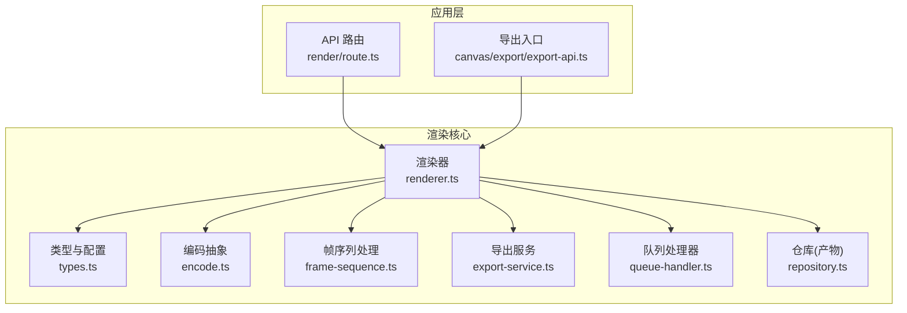
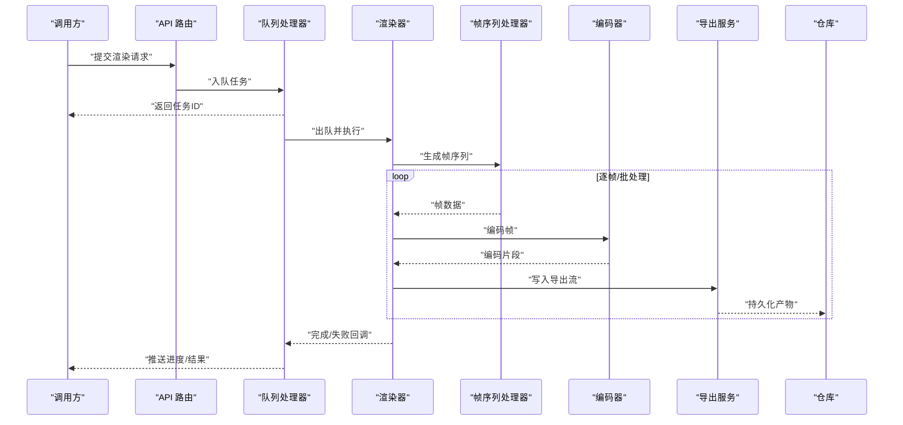
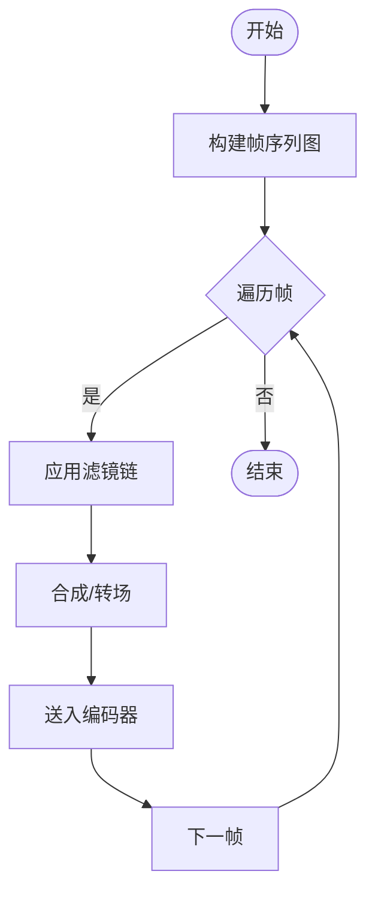
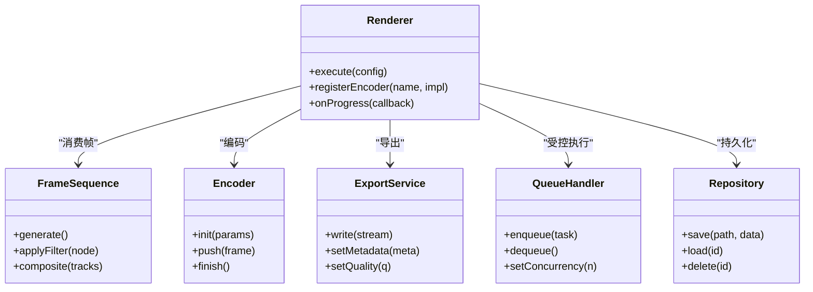

# 渲染器扩展

<cite>
**本文引用的文件**
- [src/features/render/renderer.ts](file://src/features/render/renderer.ts)
- [src/features/render/types.ts](file://src/features/render/types.ts)
- [src/features/render/encode.ts](file://src/features/render/encode.ts)
- [src/features/render/frame-sequence.ts](file://src/features/render/frame-sequence.ts)
- [src/features/render/export-service.ts](file://src/features/render/export-service.ts)
- [src/features/render/queue-handler.ts](file://src/features/render/queue-handler.ts)
- [src/features/render/repository.ts](file://src/features/render/repository.ts)
- [src/app/api/render/route.ts](file://src/app/api/render/route.ts)
- [src/app/canvas/export/export-api.ts](file://src/app/canvas/export/export-api.ts)
</cite>

## 目录
1. [简介](#简介)
2. [项目结构](#项目结构)
3. [核心组件](#核心组件)
4. [架构总览](#架构总览)
5. [详细组件分析](#详细组件分析)
6. [依赖关系分析](#依赖关系分析)
7. [性能考虑](#性能考虑)
8. [故障排查指南](#故障排查指南)
9. [结论](#结论)
10. [附录](#附录)

## 简介
本指南面向希望为 CodeVideoCanvas 的渲染子系统添加新能力的开发者，重点覆盖：
- 渲染管线与扩展点设计
- 新增视频编码格式支持（编码器接口、参数配置、性能优化）
- 帧序列处理器扩展（自定义帧操作、特效处理、合成算法）
- 导出格式扩展（封装、元数据、质量控制）
- 渲染队列扩展与并行处理优化
- 实际编码器实现示例与调优建议

## 项目结构
渲染相关代码集中在 features/render 模块，并通过 API 路由与前端导出入口对接。关键文件职责如下：
- renderer.ts：编排渲染流程，协调帧序列、编码与导出
- types.ts：定义渲染类型、配置与事件契约
- encode.ts：编码抽象与具体编码器调度
- frame-sequence.ts：帧序列生成、变换与合成
- export-service.ts：导出封装与质量策略
- queue-handler.ts：渲染任务队列与并发控制
- repository.ts：渲染产物持久化与检索
- app/api/render/route.ts：服务端渲染 API
- app/canvas/export/export-api.ts：前端导出入口

图表来源
- [src/app/api/render/route.ts](file://src/app/api/render/route.ts)
- [src/app/canvas/export/export-api.ts](file://src/app/canvas/export/export-api.ts)
- [src/features/render/renderer.ts](file://src/features/render/renderer.ts)
- [src/features/render/types.ts](file://src/features/render/types.ts)
- [src/features/render/encode.ts](file://src/features/render/encode.ts)
- [src/features/render/frame-sequence.ts](file://src/features/render/frame-sequence.ts)
- [src/features/render/export-service.ts](file://src/features/render/export-service.ts)
- [src/features/render/queue-handler.ts](file://src/features/render/queue-handler.ts)
- [src/features/render/repository.ts](file://src/features/render/repository.ts)

章节来源
- [src/features/render/renderer.ts](file://src/features/render/renderer.ts)
- [src/features/render/types.ts](file://src/features/render/types.ts)
- [src/features/render/encode.ts](file://src/features/render/encode.ts)
- [src/features/render/frame-sequence.ts](file://src/features/render/frame-sequence.ts)
- [src/features/render/export-service.ts](file://src/features/render/export-service.ts)
- [src/features/render/queue-handler.ts](file://src/features/render/queue-handler.ts)
- [src/features/render/repository.ts](file://src/features/render/repository.ts)
- [src/app/api/render/route.ts](file://src/app/api/render/route.ts)
- [src/app/canvas/export/export-api.ts](file://src/app/canvas/export/export-api.ts)

## 核心组件
- 渲染器（Renderer）：负责将“帧序列”转换为“编码流”，并驱动导出与持久化。提供可插拔的编码器与导出策略。
- 编码抽象（Encoder）：统一编码器接口，屏蔽不同后端差异；支持按目标格式选择编码器实例。
- 帧序列处理器（FrameSequence）：从时间线或节点图产出帧序列，支持滤镜、转场、合成等扩展点。
- 导出服务（ExportService）：封装最终文件输出，管理元数据、质量参数与分片写入。
- 队列处理器（QueueHandler）：管理渲染任务的入队、出队、重试与并发度控制。
- 仓库（Repository）：渲染产物（中间帧、最终文件、元数据）的存取接口。
- 类型与配置（Types）：统一的配置对象、事件与错误模型。

章节来源
- [src/features/render/renderer.ts](file://src/features/render/renderer.ts)
- [src/features/render/encode.ts](file://src/features/render/encode.ts)
- [src/features/render/frame-sequence.ts](file://src/features/render/frame-sequence.ts)
- [src/features/render/export-service.ts](file://src/features/render/export-service.ts)
- [src/features/render/queue-handler.ts](file://src/features/render/queue-handler.ts)
- [src/features/render/repository.ts](file://src/features/render/repository.ts)
- [src/features/render/types.ts](file://src/features/render/types.ts)

## 架构总览
渲染管线采用“生产者-消费者”模式：帧序列作为上游生产者，编码与导出作为下游消费者，队列在两者之间解耦并提供背压与并发控制。

图表来源
- [src/app/api/render/route.ts](file://src/app/api/render/route.ts)
- [src/features/render/queue-handler.ts](file://src/features/render/queue-handler.ts)
- [src/features/render/renderer.ts](file://src/features/render/renderer.ts)
- [src/features/render/frame-sequence.ts](file://src/features/render/frame-sequence.ts)
- [src/features/render/encode.ts](file://src/features/render/encode.ts)
- [src/features/render/export-service.ts](file://src/features/render/export-service.ts)
- [src/features/render/repository.ts](file://src/features/render/repository.ts)

## 详细组件分析

### 渲染器（Renderer）
- 职责：编排帧序列到编码再到导出的完整流程；暴露扩展点以注入自定义编码器与导出策略。
- 关键扩展点：
  - 编码器注册表：根据目标格式选择编码器实例
  - 帧处理钩子：在编码前对帧进行预处理（缩放、色彩空间转换、降噪等）
  - 导出策略：按目标容器/码率/质量策略写入
- 典型流程：初始化 -> 构建帧序列 -> 循环编码 -> 合并导出 -> 持久化 -> 上报状态

章节来源
- [src/features/render/renderer.ts](file://src/features/render/renderer.ts)
- [src/features/render/types.ts](file://src/features/render/types.ts)

### 编码抽象（Encoder）
- 接口约定：
  - 能力声明：支持的格式、分辨率范围、是否支持硬件加速
  - 生命周期：初始化、输入帧、结束并输出文件
  - 配置项：码率、帧率、质量档位、线程数、缓冲大小
- 扩展方式：
  - 新增编码器实现类，注册到渲染器的编码器工厂
  - 通过配置对象切换不同编码器实例
- 性能要点：
  - 批量输入减少系统调用
  - 合理设置缓冲与线程数
  - 避免每帧重复创建上下文

章节来源
- [src/features/render/encode.ts](file://src/features/render/encode.ts)
- [src/features/render/types.ts](file://src/features/render/types.ts)

### 帧序列处理器（FrameSequence）
- 职责：基于时间线与节点图产出有序帧序列；支持滤镜链、转场、叠加合成。
- 扩展点：
  - 滤镜插件：在帧进入编码器前插入处理节点
  - 合成器：多轨道混合、遮罩、关键帧动画
  - 采样策略：按需跳帧、插值、去抖
- 数据结构：
  - 帧描述：时间戳、尺寸、像素格式、附加元数据
  - 处理图：有向无环图，节点为滤镜/合成器，边为数据流

图表来源
- [src/features/render/frame-sequence.ts](file://src/features/render/frame-sequence.ts)
- [src/features/render/renderer.ts](file://src/features/render/renderer.ts)

章节来源
- [src/features/render/frame-sequence.ts](file://src/features/render/frame-sequence.ts)

### 导出服务（ExportService）
- 职责：将编码后的片段组装为目标容器格式，写入文件系统或流式传输。
- 扩展点：
  - 容器封装器：针对不同封装格式（如 MP4/MKV/WebM）实现写入逻辑
  - 元数据处理：标题、作者、时长、分辨率、码率、字幕轨道等
  - 质量控制：VBR/CBR、目标文件大小、峰值信噪比阈值
- 最佳实践：
  - 使用分段写入降低内存占用
  - 校验写入完整性与一致性
  - 记录导出日志便于回溯

章节来源
- [src/features/render/export-service.ts](file://src/features/render/export-service.ts)
- [src/features/render/types.ts](file://src/features/render/types.ts)

### 队列处理器（QueueHandler）
- 职责：管理渲染任务的生命周期，提供并发控制、重试、超时与进度上报。
- 扩展点：
  - 调度策略：FIFO/LIFO/优先级队列
  - 资源隔离：按项目/用户隔离工作进程
  - 监控指标：吞吐、延迟、失败率
- 并行优化：
  - 动态调整并发度
  - 背压机制防止内存溢出
  - 失败重试与幂等性保证

章节来源
- [src/features/render/queue-handler.ts](file://src/features/render/queue-handler.ts)

### 仓库（Repository）
- 职责：读写渲染产物（中间帧缓存、最终文件、元数据）。
- 扩展点：
  - 存储后端：本地磁盘、对象存储、分布式存储
  - 索引与检索：按任务ID、时间范围、标签查询
  - 清理策略：TTL、配额限制、冷热分层

章节来源
- [src/features/render/repository.ts](file://src/features/render/repository.ts)

### API 与前端入口
- API 路由：接收渲染请求，构造任务并交由队列处理；返回任务ID与进度订阅通道。
- 前端导出：触发渲染、展示进度、下载产物。

章节来源
- [src/app/api/render/route.ts](file://src/app/api/render/route.ts)
- [src/app/canvas/export/export-api.ts](file://src/app/canvas/export/export-api.ts)

## 依赖关系分析

图表来源
- [src/features/render/renderer.ts](file://src/features/render/renderer.ts)
- [src/features/render/frame-sequence.ts](file://src/features/render/frame-sequence.ts)
- [src/features/render/encode.ts](file://src/features/render/encode.ts)
- [src/features/render/export-service.ts](file://src/features/render/export-service.ts)
- [src/features/render/queue-handler.ts](file://src/features/render/queue-handler.ts)
- [src/features/render/repository.ts](file://src/features/render/repository.ts)

章节来源
- [src/features/render/renderer.ts](file://src/features/render/renderer.ts)
- [src/features/render/encode.ts](file://src/features/render/encode.ts)
- [src/features/render/frame-sequence.ts](file://src/features/render/frame-sequence.ts)
- [src/features/render/export-service.ts](file://src/features/render/export-service.ts)
- [src/features/render/queue-handler.ts](file://src/features/render/queue-handler.ts)
- [src/features/render/repository.ts](file://src/features/render/repository.ts)

## 性能考虑
- 编码器侧
  - 优先批量输入，减少上下文切换
  - 合理设置线程数与缓冲大小，避免 CPU/IO 争用
  - 启用硬件加速（若可用），注意热启动开销
- 帧序列侧
  - 使用懒加载与按需计算，避免全量预取
  - 滤镜链尽量就地修改，减少拷贝
  - 对重复区域使用增量更新
- 导出侧
  - 分段写入，控制内存峰值
  - 自适应码率，结合内容复杂度动态调节
- 队列侧
  - 动态并发度，依据系统负载自动伸缩
  - 背压与限流，保护下游存储与网络

[本节为通用指导，不直接分析具体文件]

## 故障排查指南
- 常见问题定位
  - 编码器初始化失败：检查格式支持、参数合法性、权限与环境依赖
  - 帧处理异常：核对滤镜链顺序、输入分辨率与像素格式
  - 导出失败：确认容器封装器兼容性、路径权限与磁盘空间
  - 队列堆积：观察并发度、重试次数与失败率
- 诊断手段
  - 开启详细日志，记录关键阶段耗时与错误堆栈
  - 采集指标：吞吐、延迟、CPU/内存占用、IO 等待
  - 最小复现：剥离非必要滤镜与轨道，逐步回归

章节来源
- [src/features/render/queue-handler.ts](file://src/features/render/queue-handler.ts)
- [src/features/render/encode.ts](file://src/features/render/encode.ts)
- [src/features/render/export-service.ts](file://src/features/render/export-service.ts)

## 结论
通过清晰的扩展点设计与模块化架构，CodeVideoCanvas 的渲染子系统能够灵活地接入新的编码格式、帧处理算法与导出封装。配合队列与仓库的解耦，可实现高吞吐、可扩展且易于维护的视频渲染平台。

[本节为总结性内容，不直接分析具体文件]

## 附录

### 如何添加新的视频编码格式支持
- 步骤概览
  - 在编码抽象中新增编码器实现，声明能力与默认参数
  - 在渲染器中注册该编码器，绑定到目标格式
  - 在导出服务中确保容器封装器兼容该编码
  - 编写单元测试验证端到端流程
- 关键配置项
  - 码率模式（CBR/VBR）、目标码率、质量档位
  - 线程数、缓冲大小、是否启用硬件加速
  - 输出容器与封装选项
- 性能调优建议
  - 预热编码器上下文，避免首帧抖动
  - 根据内容复杂度动态调整码率
  - 使用批处理与零拷贝减少开销

章节来源
- [src/features/render/encode.ts](file://src/features/render/encode.ts)
- [src/features/render/renderer.ts](file://src/features/render/renderer.ts)
- [src/features/render/export-service.ts](file://src/features/render/export-service.ts)
- [src/features/render/types.ts](file://src/features/render/types.ts)

### 帧序列处理器扩展机制
- 自定义帧操作
  - 实现滤镜节点接口，注册到滤镜链
  - 支持关键帧与参数渐变
- 特效处理
  - 转场、遮罩、叠加、调色等效果以节点形式组合
- 合成算法
  - 多轨道混合策略（Alpha、权重、混合模式）
  - 时间轴对齐与插值

章节来源
- [src/features/render/frame-sequence.ts](file://src/features/render/frame-sequence.ts)

### 导出格式扩展方法
- 文件格式封装
  - 实现容器封装器，适配不同后缀与媒体轨道
- 元数据处理
  - 写入标题、作者、时长、分辨率、码率、字幕轨道等
- 质量控制
  - 目标文件大小、峰值信噪比、视觉质量评估

章节来源
- [src/features/render/export-service.ts](file://src/features/render/export-service.ts)

### 渲染队列扩展与并行处理优化
- 扩展点
  - 自定义调度策略（优先级、公平性）
  - 资源池与工作进程隔离
- 并行优化
  - 动态并发度、背压、失败重试与幂等
  - 指标采集与告警

章节来源
- [src/features/render/queue-handler.ts](file://src/features/render/queue-handler.ts)

### 实际编码器实现示例（参考路径）
- 编码器接口与工厂
  - [src/features/render/encode.ts](file://src/features/render/encode.ts)
- 渲染器集成
  - [src/features/render/renderer.ts](file://src/features/render/renderer.ts)
- 导出封装
  - [src/features/render/export-service.ts](file://src/features/render/export-service.ts)
- 类型与配置
  - [src/features/render/types.ts](file://src/features/render/types.ts)

章节来源
- [src/features/render/encode.ts](file://src/features/render/encode.ts)
- [src/features/render/renderer.ts](file://src/features/render/renderer.ts)
- [src/features/render/export-service.ts](file://src/features/render/export-service.ts)
- [src/features/render/types.ts](file://src/features/render/types.ts)