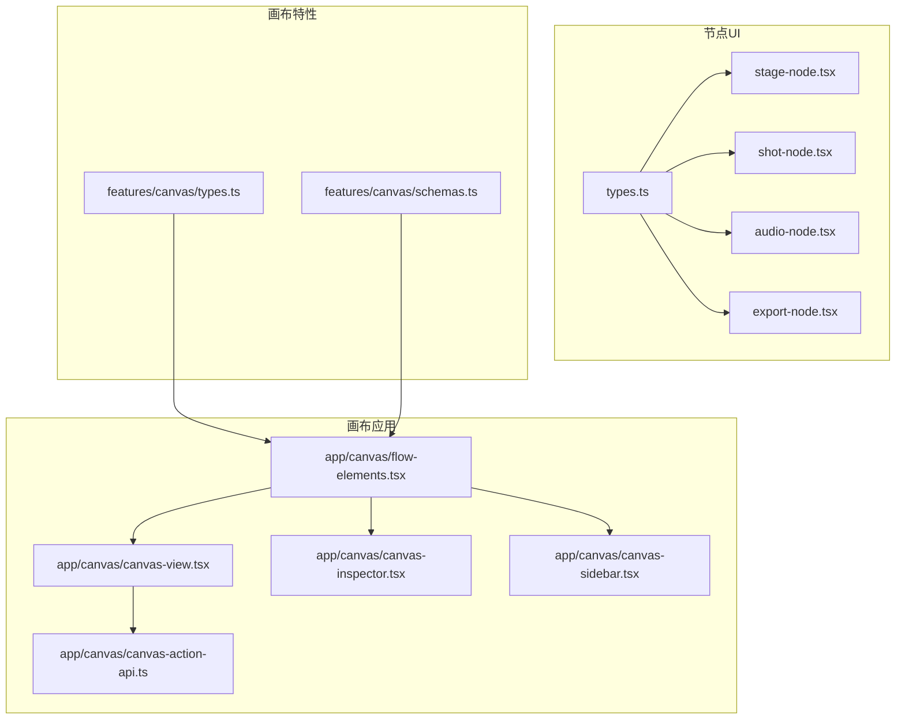
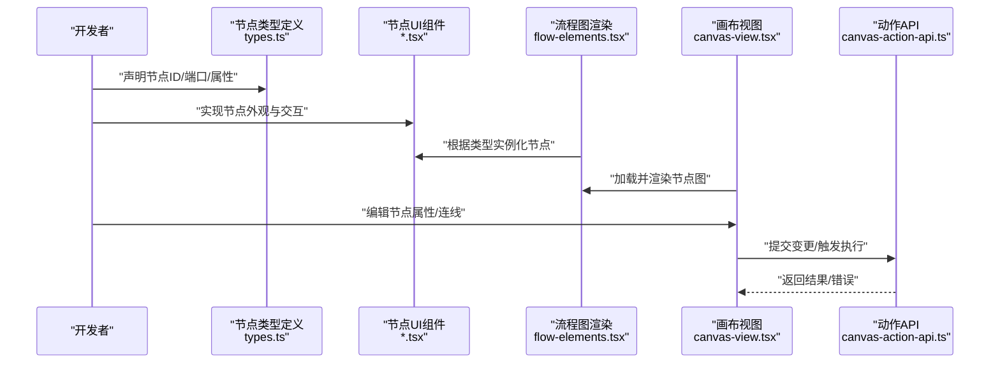
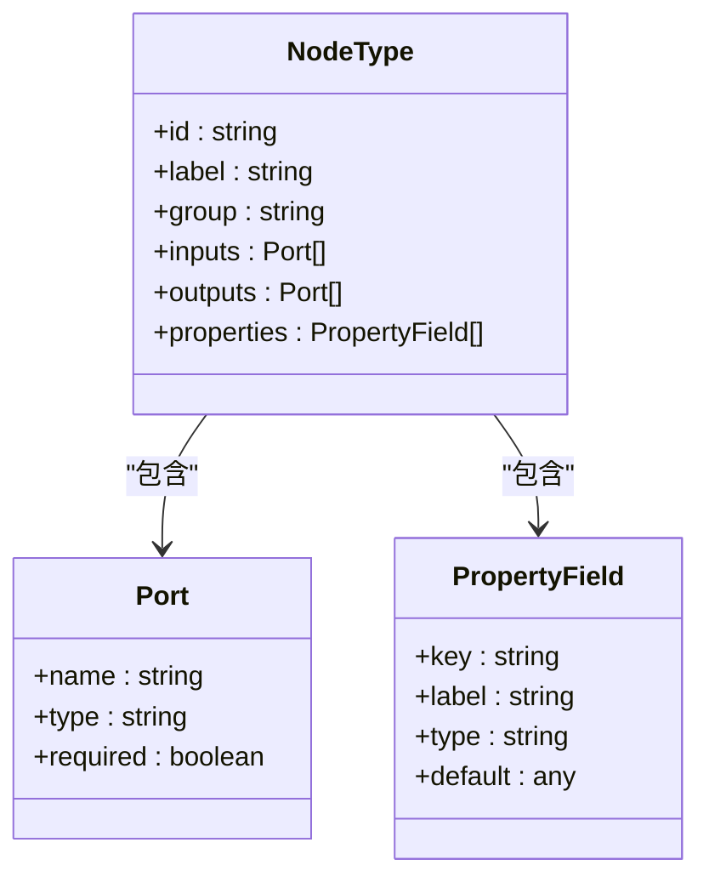
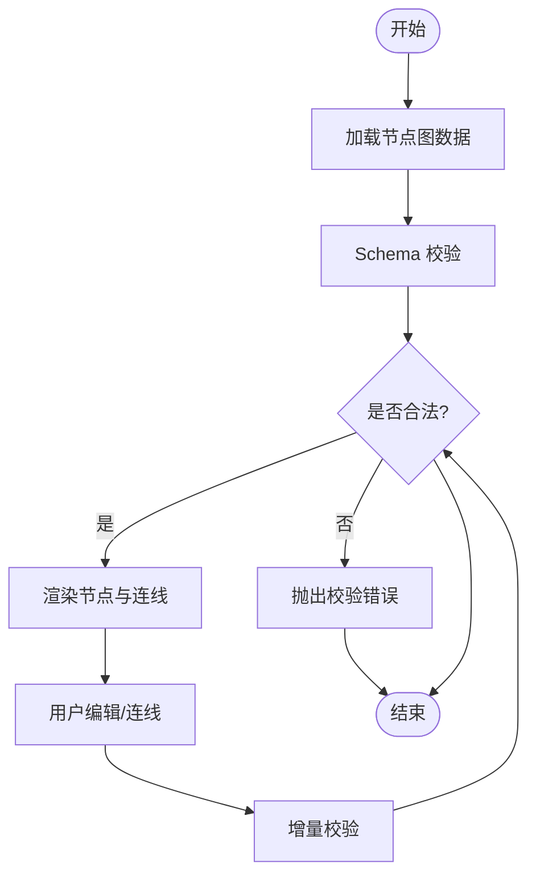
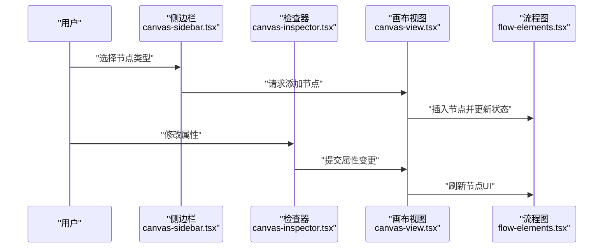
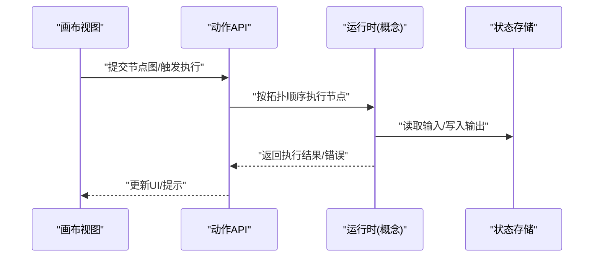
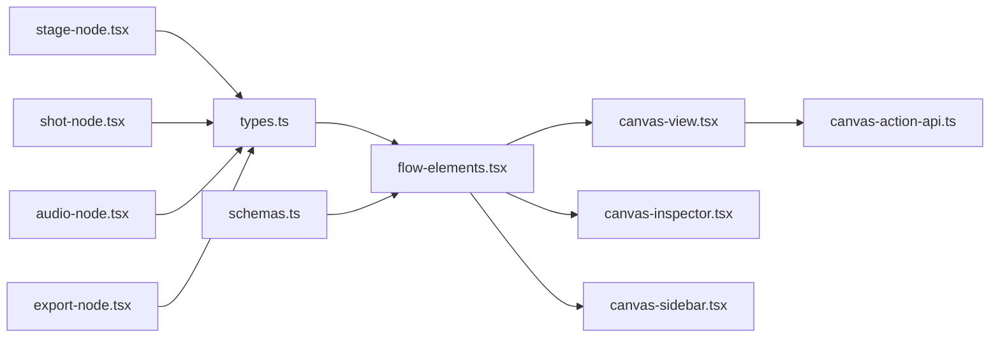

# 自定义节点开发

<cite>
**本文引用的文件**   
- [src/components/ui/node/types.ts](file://src/components/ui/node/types.ts)
- [src/components/ui/node/stage-node.tsx](file://src/components/ui/node/stage-node.tsx)
- [src/components/ui/node/shot-node.tsx](file://src/components/ui/node/shot-node.tsx)
- [src/components/ui/node/audio-node.tsx](file://src/components/ui/node/audio-node.tsx)
- [src/components/ui/node/export-node.tsx](file://src/components/ui/node/export-node.tsx)
- [src/features/canvas/types.ts](file://src/features/canvas/types.ts)
- [src/features/canvas/schemas.ts](file://src/features/canvas/schemas.ts)
- [src/app/canvas/flow-elements.tsx](file://src/app/canvas/flow-elements.tsx)
- [src/app/canvas/canvas-view.tsx](file://src/app/canvas/canvas-view.tsx)
- [src/app/canvas/canvas-action-api.ts](file://src/app/canvas/canvas-action-api.ts)
- [src/app/canvas/canvas-inspector.tsx](file://src/app/canvas/canvas-inspector.tsx)
- [src/app/canvas/canvas-sidebar.tsx](file://src/app/canvas/canvas-sidebar.tsx)
</cite>

## 目录
1. [简介](#简介)
2. [项目结构](#项目结构)
3. [核心组件](#核心组件)
4. [架构总览](#架构总览)
5. [详细组件分析](#详细组件分析)
6. [依赖分析](#依赖分析)
7. [性能考虑](#性能考虑)
8. [故障排查指南](#故障排查指南)
9. [结论](#结论)
10. [附录](#附录)

## 简介
本指南面向希望在 CodeVideoCanvas 中开发“自定义节点”的工程师。内容覆盖节点类型系统、接口定义、属性面板、连接端口与事件处理机制，并给出从简单文本节点到复杂视频处理节点的完整开发路径。同时涵盖节点注册、生命周期管理、错误处理策略以及测试与调试技巧。

## 项目结构
CodeVideoCanvas 的节点体系位于前端 UI 层与画布特性层之间：
- 节点 UI 组件与类型定义集中在 src/components/ui/node 下，提供可复用的节点外观与交互。
- 画布数据模型、Schema 校验与运行时类型在 src/features/canvas 下定义。
- 画布视图、侧边栏、检查器与动作 API 在 src/app/canvas 下组织，负责渲染、编辑与执行。

图表来源
- [src/components/ui/node/types.ts](file://src/components/ui/node/types.ts)
- [src/components/ui/node/stage-node.tsx](file://src/components/ui/node/stage-node.tsx)
- [src/components/ui/node/shot-node.tsx](file://src/components/ui/node/shot-node.tsx)
- [src/components/ui/node/audio-node.tsx](file://src/components/ui/node/audio-node.tsx)
- [src/components/ui/node/export-node.tsx](file://src/components/ui/node/export-node.tsx)
- [src/features/canvas/types.ts](file://src/features/canvas/types.ts)
- [src/features/canvas/schemas.ts](file://src/features/canvas/schemas.ts)
- [src/app/canvas/flow-elements.tsx](file://src/app/canvas/flow-elements.tsx)
- [src/app/canvas/canvas-view.tsx](file://src/app/canvas/canvas-view.tsx)
- [src/app/canvas/canvas-action-api.ts](file://src/app/canvas/canvas-action-api.ts)
- [src/app/canvas/canvas-inspector.tsx](file://src/app/canvas/canvas-inspector.tsx)
- [src/app/canvas/canvas-sidebar.tsx](file://src/app/canvas/canvas-sidebar.tsx)

章节来源
- [src/components/ui/node/types.ts](file://src/components/ui/node/types.ts)
- [src/features/canvas/types.ts](file://src/features/canvas/types.ts)
- [src/features/canvas/schemas.ts](file://src/features/canvas/schemas.ts)
- [src/app/canvas/flow-elements.tsx](file://src/app/canvas/flow-elements.tsx)
- [src/app/canvas/canvas-view.tsx](file://src/app/canvas/canvas-view.tsx)
- [src/app/canvas/canvas-action-api.ts](file://src/app/canvas/canvas-action-api.ts)
- [src/app/canvas/canvas-inspector.tsx](file://src/app/canvas/canvas-inspector.tsx)
- [src/app/canvas/canvas-sidebar.tsx](file://src/app/canvas/canvas-sidebar.tsx)

## 核心组件
- 节点类型与元数据：通过统一的类型定义描述节点 ID、名称、分组、端口（输入/输出）及属性面板字段。
- 节点 UI 组件：实现具体节点的可视化呈现与用户交互（拖拽、连线、属性编辑）。
- 画布数据模型：定义节点图的结构、连接关系、状态机与 Schema 校验规则。
- 画布视图与编辑器：负责渲染节点图、处理用户操作、调用动作 API 进行持久化与执行。

章节来源
- [src/components/ui/node/types.ts](file://src/components/ui/node/types.ts)
- [src/components/ui/node/stage-node.tsx](file://src/components/ui/node/stage-node.tsx)
- [src/components/ui/node/shot-node.tsx](file://src/components/ui/node/shot-node.tsx)
- [src/components/ui/node/audio-node.tsx](file://src/components/ui/node/audio-node.tsx)
- [src/components/ui/node/export-node.tsx](file://src/components/ui/node/export-node.tsx)
- [src/features/canvas/types.ts](file://src/features/canvas/types.ts)
- [src/features/canvas/schemas.ts](file://src/features/canvas/schemas.ts)
- [src/app/canvas/flow-elements.tsx](file://src/app/canvas/flow-elements.tsx)
- [src/app/canvas/canvas-view.tsx](file://src/app/canvas/canvas-view.tsx)
- [src/app/canvas/canvas-action-api.ts](file://src/app/canvas/canvas-action-api.ts)
- [src/app/canvas/canvas-inspector.tsx](file://src/app/canvas/canvas-inspector.tsx)
- [src/app/canvas/canvas-sidebar.tsx](file://src/app/canvas/canvas-sidebar.tsx)

## 架构总览
下图展示了自定义节点从“类型定义 → UI 组件 → 画布渲染 → 动作执行”的整体流程。

图表来源
- [src/components/ui/node/types.ts](file://src/components/ui/node/types.ts)
- [src/app/canvas/flow-elements.tsx](file://src/app/canvas/flow-elements.tsx)
- [src/app/canvas/canvas-view.tsx](file://src/app/canvas/canvas-view.tsx)
- [src/app/canvas/canvas-action-api.ts](file://src/app/canvas/canvas-action-api.ts)

## 详细组件分析

### 节点类型系统与接口
- 节点类型定义包含：唯一标识、显示名、分组、端口集合（输入/输出）、属性面板字段等。
- 端口类型需明确数据类型与约束，确保连线时类型匹配。
- 属性面板字段用于生成 UI 控件，驱动节点运行期参数。

图表来源
- [src/components/ui/node/types.ts](file://src/components/ui/node/types.ts)

章节来源
- [src/components/ui/node/types.ts](file://src/components/ui/node/types.ts)

### 节点 UI 组件与属性面板
- 每个节点对应一个 React 组件，负责：
  - 渲染节点标题、端口、预览区。
  - 响应拖拽、连线、属性编辑等交互。
  - 将属性变化同步至画布状态。
- 属性面板由属性字段定义自动生成，支持文本、数值、布尔、枚举等常见控件。

示例节点（参考路径）
- 舞台节点：[src/components/ui/node/stage-node.tsx](file://src/components/ui/node/stage-node.tsx)
- 镜头节点：[src/components/ui/node/shot-node.tsx](file://src/components/ui/node/shot-node.tsx)
- 音频节点：[src/components/ui/node/audio-node.tsx](file://src/components/ui/node/audio-node.tsx)
- 导出节点：[src/components/ui/node/export-node.tsx](file://src/components/ui/node/export-node.tsx)

章节来源
- [src/components/ui/node/stage-node.tsx](file://src/components/ui/node/stage-node.tsx)
- [src/components/ui/node/shot-node.tsx](file://src/components/ui/node/shot-node.tsx)
- [src/components/ui/node/audio-node.tsx](file://src/components/ui/node/audio-node.tsx)
- [src/components/ui/node/export-node.tsx](file://src/components/ui/node/export-node.tsx)

### 画布数据模型与 Schema 校验
- 节点图数据结构包括节点列表、连接关系、布局信息等。
- Schema 用于校验节点属性与连接合法性，防止非法状态进入运行时。

图表来源
- [src/features/canvas/schemas.ts](file://src/features/canvas/schemas.ts)
- [src/features/canvas/types.ts](file://src/features/canvas/types.ts)

章节来源
- [src/features/canvas/types.ts](file://src/features/canvas/types.ts)
- [src/features/canvas/schemas.ts](file://src/features/canvas/schemas.ts)

### 画布视图、侧边栏与检查器
- 画布视图负责整体渲染与交互调度。
- 侧边栏提供节点库与添加入口。
- 检查器展示选中节点的属性，并与属性面板双向绑定。

图表来源
- [src/app/canvas/canvas-sidebar.tsx](file://src/app/canvas/canvas-sidebar.tsx)
- [src/app/canvas/canvas-inspector.tsx](file://src/app/canvas/canvas-inspector.tsx)
- [src/app/canvas/canvas-view.tsx](file://src/app/canvas/canvas-view.tsx)
- [src/app/canvas/flow-elements.tsx](file://src/app/canvas/flow-elements.tsx)

章节来源
- [src/app/canvas/canvas-sidebar.tsx](file://src/app/canvas/canvas-sidebar.tsx)
- [src/app/canvas/canvas-inspector.tsx](file://src/app/canvas/canvas-inspector.tsx)
- [src/app/canvas/canvas-view.tsx](file://src/app/canvas/canvas-view.tsx)
- [src/app/canvas/flow-elements.tsx](file://src/app/canvas/flow-elements.tsx)

### 动作 API 与执行流程
- 动作 API 封装了保存、执行、导出等操作。
- 节点执行通常遵循“读取输入 → 计算 → 写入输出 → 触发事件”的模式。

图表来源
- [src/app/canvas/canvas-action-api.ts](file://src/app/canvas/canvas-action-api.ts)

章节来源
- [src/app/canvas/canvas-action-api.ts](file://src/app/canvas/canvas-action-api.ts)

### 创建新节点类型的步骤
- 定义节点类型：在类型文件中声明节点 ID、名称、分组、端口与属性字段。
- 实现节点 UI：新建节点组件，接入属性面板与端口渲染逻辑。
- 集成到流程图：确保流程图能识别并渲染新节点类型。
- 编写校验规则：在 Schema 中为新节点属性与连接增加校验。
- 暴露动作能力：如需执行逻辑，通过动作 API 或运行时扩展接入。
- 编写测试与文档：为节点属性、连线与执行路径补充单测与用例。

章节来源
- [src/components/ui/node/types.ts](file://src/components/ui/node/types.ts)
- [src/app/canvas/flow-elements.tsx](file://src/app/canvas/flow-elements.tsx)
- [src/features/canvas/schemas.ts](file://src/features/canvas/schemas.ts)
- [src/app/canvas/canvas-action-api.ts](file://src/app/canvas/canvas-action-api.ts)

### 节点注册机制与发现
- 节点类型集中声明后，流程图组件依据类型映射表动态渲染对应 UI 组件。
- 新增节点后，需在类型映射处注册，使画布能够识别并实例化。

章节来源
- [src/components/ui/node/types.ts](file://src/components/ui/node/types.ts)
- [src/app/canvas/flow-elements.tsx](file://src/app/canvas/flow-elements.tsx)

### 生命周期管理与事件处理
- 节点生命周期建议分为：初始化 → 属性更新 → 输入就绪 → 执行 → 完成/失败。
- 事件处理：
  - 属性变更事件：驱动重算或 UI 刷新。
  - 输入就绪事件：当所有必需输入可用时触发执行。
  - 完成/失败事件：通知上层更新状态与日志。

章节来源
- [src/app/canvas/canvas-action-api.ts](file://src/app/canvas/canvas-action-api.ts)
- [src/features/canvas/types.ts](file://src/features/canvas/types.ts)

### 错误处理策略
- 输入校验失败：在 Schema 层拦截并提示具体字段问题。
- 运行时异常：捕获并转换为用户可读的错误消息，记录上下文。
- 网络/IO 错误：重试与降级策略，避免阻塞主线程。

章节来源
- [src/features/canvas/schemas.ts](file://src/features/canvas/schemas.ts)
- [src/app/canvas/canvas-action-api.ts](file://src/app/canvas/canvas-action-api.ts)

### 节点测试方法与调试技巧
- 单元测试：
  - 针对节点属性校验与默认值。
  - 针对端口类型匹配与连线合法性。
  - 针对执行路径的输入输出断言。
- 集成测试：
  - 模拟画布操作（添加节点、连线、修改属性），验证最终状态。
- 调试技巧：
  - 使用检查器查看节点当前属性与连接状态。
  - 在关键路径打印中间结果，定位数据流问题。
  - 对耗时操作加入计时与日志，辅助性能分析。

章节来源
- [src/app/canvas/canvas-inspector.tsx](file://src/app/canvas/canvas-inspector.tsx)
- [src/app/canvas/canvas-view.tsx](file://src/app/canvas/canvas-view.tsx)

## 依赖分析
节点相关模块之间的依赖关系如下：

图表来源
- [src/components/ui/node/types.ts](file://src/components/ui/node/types.ts)
- [src/features/canvas/schemas.ts](file://src/features/canvas/schemas.ts)
- [src/app/canvas/flow-elements.tsx](file://src/app/canvas/flow-elements.tsx)
- [src/app/canvas/canvas-view.tsx](file://src/app/canvas/canvas-view.tsx)
- [src/app/canvas/canvas-inspector.tsx](file://src/app/canvas/canvas-inspector.tsx)
- [src/app/canvas/canvas-sidebar.tsx](file://src/app/canvas/canvas-sidebar.tsx)
- [src/app/canvas/canvas-action-api.ts](file://src/app/canvas/canvas-action-api.ts)
- [src/components/ui/node/stage-node.tsx](file://src/components/ui/node/stage-node.tsx)
- [src/components/ui/node/shot-node.tsx](file://src/components/ui/node/shot-node.tsx)
- [src/components/ui/node/audio-node.tsx](file://src/components/ui/node/audio-node.tsx)
- [src/components/ui/node/export-node.tsx](file://src/components/ui/node/export-node.tsx)

章节来源
- [src/components/ui/node/types.ts](file://src/components/ui/node/types.ts)
- [src/features/canvas/schemas.ts](file://src/features/canvas/schemas.ts)
- [src/app/canvas/flow-elements.tsx](file://src/app/canvas/flow-elements.tsx)
- [src/app/canvas/canvas-view.tsx](file://src/app/canvas/canvas-view.tsx)
- [src/app/canvas/canvas-inspector.tsx](file://src/app/canvas/canvas-inspector.tsx)
- [src/app/canvas/canvas-sidebar.tsx](file://src/app/canvas/canvas-sidebar.tsx)
- [src/app/canvas/canvas-action-api.ts](file://src/app/canvas/canvas-action-api.ts)

## 性能考虑
- 延迟计算：仅在输入就绪且属性稳定后触发执行，避免频繁重算。
- 增量更新：属性变更仅影响受影响子树，减少不必要的重渲染。
- 大对象传输：尽量传递引用或分块数据，避免在主线程复制大数据。
- 异步任务：将耗时操作放入 Web Worker 或后台队列，保持 UI 流畅。

## 故障排查指南
- 节点未渲染：检查类型映射是否注册、节点 ID 是否正确。
- 连线失败：确认端口类型匹配与必填约束。
- 属性不生效：检查属性键名与 Schema 定义是否一致。
- 执行报错：查看动作 API 返回的错误信息，结合检查器定位输入缺失或类型不符。

章节来源
- [src/app/canvas/canvas-action-api.ts](file://src/app/canvas/canvas-action-api.ts)
- [src/features/canvas/schemas.ts](file://src/features/canvas/schemas.ts)
- [src/app/canvas/canvas-inspector.tsx](file://src/app/canvas/canvas-inspector.tsx)

## 结论
通过统一节点类型定义、清晰的 UI 组件边界、严格的 Schema 校验与完善的动作 API，CodeVideoCanvas 提供了可扩展的自定义节点体系。遵循本文档的步骤与最佳实践，可以快速构建从简单到复杂的各类节点，并确保稳定性与可维护性。

## 附录
- 快速参考
  - 节点类型定义位置：[src/components/ui/node/types.ts](file://src/components/ui/node/types.ts)
  - 节点 UI 示例：[src/components/ui/node/stage-node.tsx](file://src/components/ui/node/stage-node.tsx)、[src/components/ui/node/shot-node.tsx](file://src/components/ui/node/shot-node.tsx)、[src/components/ui/node/audio-node.tsx](file://src/components/ui/node/audio-node.tsx)、[src/components/ui/node/export-node.tsx](file://src/components/ui/node/export-node.tsx)
  - 画布数据与校验：[src/features/canvas/types.ts](file://src/features/canvas/types.ts)、[src/features/canvas/schemas.ts](file://src/features/canvas/schemas.ts)
  - 画布渲染与交互：[src/app/canvas/flow-elements.tsx](file://src/app/canvas/flow-elements.tsx)、[src/app/canvas/canvas-view.tsx](file://src/app/canvas/canvas-view.tsx)
  - 动作 API：[src/app/canvas/canvas-action-api.ts](file://src/app/canvas/canvas-action-api.ts)
  - 检查器与侧边栏：[src/app/canvas/canvas-inspector.tsx](file://src/app/canvas/canvas-inspector.tsx)、[src/app/canvas/canvas-sidebar.tsx](file://src/app/canvas/canvas-sidebar.tsx)