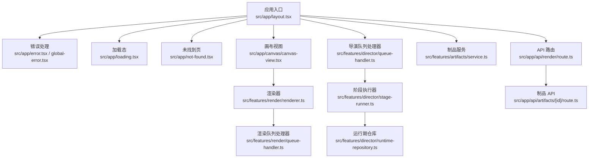
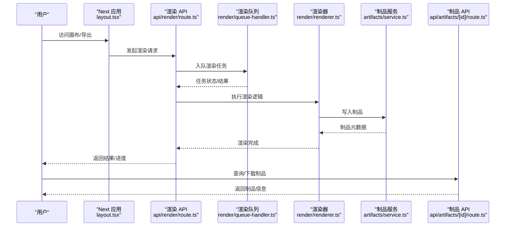
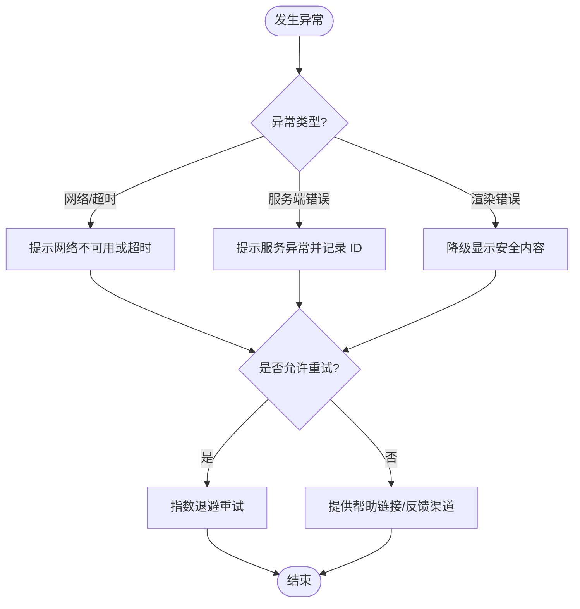
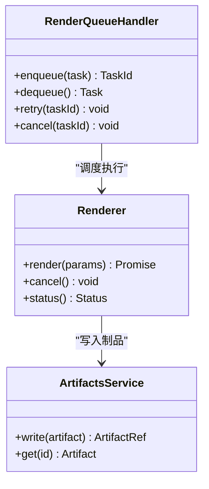
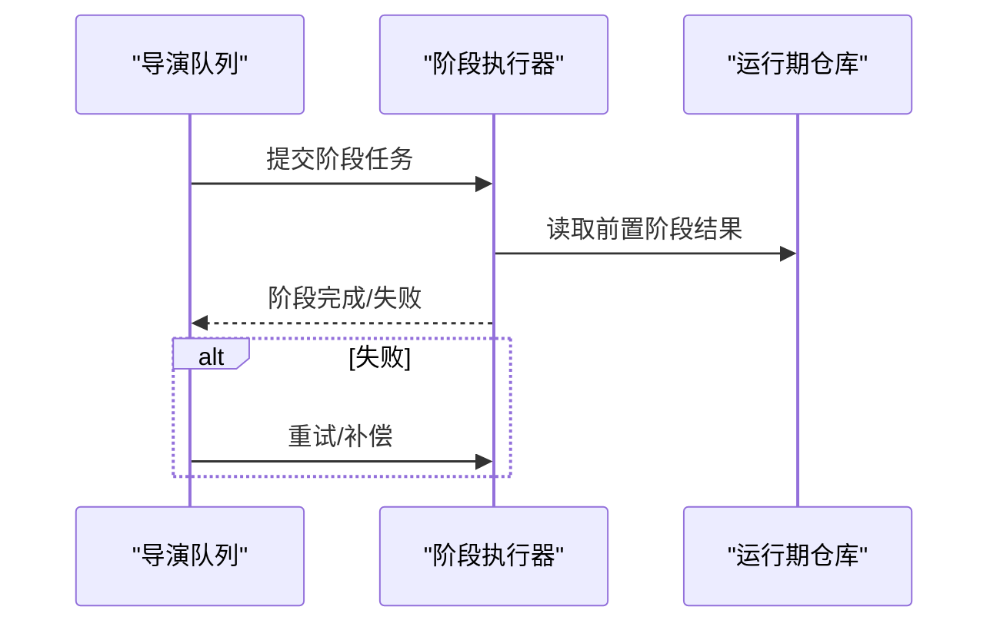
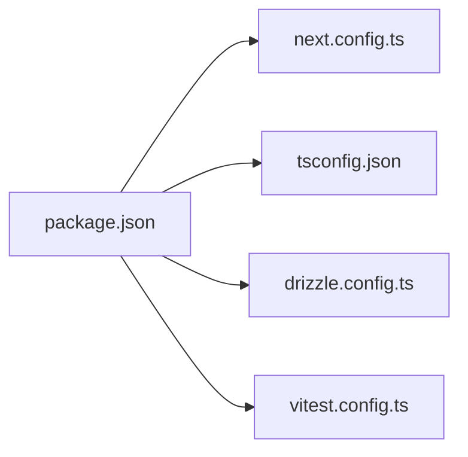

# 故障排除

<cite>
**本文引用的文件**   
- [README.md](file://README.md)
- [package.json](file://package.json)
- [next.config.ts](file://next.config.ts)
- [tsconfig.json](file://tsconfig.json)
- [drizzle.config.ts](file://drizzle.config.ts)
- [vitest.config.ts](file://vitest.config.ts)
- [src/app/error.tsx](file://src/app/error.tsx)
- [src/app/global-error.tsx](file://src/app/global-error.tsx)
- [src/app/loading.tsx](file://src/app/loading.tsx)
- [src/app/not-found.tsx](file://src/app/not-found.tsx)
- [src/app/layout.tsx](file://src/app/layout.tsx)
- [src/instrumentation.ts](file://src/instrumentation.ts)
- [src/features/render/renderer.ts](file://src/features/render/renderer.ts)
- [src/features/render/queue-handler.ts](file://src/features/render/queue-handler.ts)
- [src/features/director/queue-handler.ts](file://src/features/director/queue-handler.ts)
- [src/features/director/stage-runner.ts](file://src/features/director/stage-runner.ts)
- [src/features/director/runtime-repository.ts](file://src/features/director/runtime-repository.ts)
- [src/features/artifacts/service.ts](file://src/features/artifacts/service.ts)
- [src/app/api/render/route.ts](file://src/app/api/render/route.ts)
- [src/app/api/artifacts/[id]/route.ts](file://src/app/api/artifacts/[id]/route.ts)
- [src/app/canvas/canvas-view.tsx](file://src/app/canvas/canvas-view.tsx)
- [src/app/canvas/canvas-loader.tsx](file://src/app/canvas/canvas-loader.tsx)
</cite>

## 目录
1. [简介](#简介)
2. [项目结构](#项目结构)
3. [核心组件](#核心组件)
4. [架构总览](#架构总览)
5. [详细组件分析](#详细组件分析)
6. [依赖分析](#依赖分析)
7. [性能考虑](#性能考虑)
8. [故障排除指南](#故障排除指南)
9. [结论](#结论)
10. [附录](#附录)

## 简介
本指南面向 CodeVideoCanvas 的开发者与运维人员，聚焦于环境问题、构建错误、运行时异常的诊断与修复；提供日志分析、性能监控、内存泄漏检测等调试技巧；说明错误页面自定义与错误信息友好化处理；并给出性能优化建议、瓶颈识别方法与社区支持资源。

## 项目结构
CodeVideoCanvas 基于 Next.js 应用，包含前端 UI、渲染管线、导演编排、API 路由以及测试与配置。关键目录：
- src/app：Next.js 应用层（页面、布局、错误页、全局错误、加载态）
- src/features：业务特性模块（渲染、导演、制品、AI、导航等）
- src/components：通用 UI 组件
- scripts：部署、开发、数据库迁移脚本
- docs：设计、规范、审计与更新文档

图表来源
- [src/app/layout.tsx](file://src/app/layout.tsx)
- [src/app/error.tsx](file://src/app/error.tsx)
- [src/app/global-error.tsx](file://src/app/global-error.tsx)
- [src/app/loading.tsx](file://src/app/loading.tsx)
- [src/app/not-found.tsx](file://src/app/not-found.tsx)
- [src/app/canvas/canvas-view.tsx](file://src/app/canvas/canvas-view.tsx)
- [src/features/render/renderer.ts](file://src/features/render/renderer.ts)
- [src/features/render/queue-handler.ts](file://src/features/render/queue-handler.ts)
- [src/features/director/queue-handler.ts](file://src/features/director/queue-handler.ts)
- [src/features/director/stage-runner.ts](file://src/features/director/stage-runner.ts)
- [src/features/director/runtime-repository.ts](file://src/features/director/runtime-repository.ts)
- [src/features/artifacts/service.ts](file://src/features/artifacts/service.ts)
- [src/app/api/render/route.ts](file://src/app/api/render/route.ts)
- [src/app/api/artifacts/[id]/route.ts](file://src/app/api/artifacts/[id]/route.ts)

章节来源
- [README.md](file://README.md)
- [package.json](file://package.json)

## 核心组件
- 错误与全局错误处理：用于捕获渲染期与全局异常，统一返回友好错误页。
- 加载与未找到页：为长耗时任务与无效路径提供用户友好的反馈。
- 渲染器与队列：负责帧序列生成、编码与导出，具备队列化能力以控制并发与重试。
- 导演编排与阶段执行：将复杂流程拆分为阶段，按序或并行执行，管理运行期状态。
- 制品服务与 API：对外暴露制品查询与导出接口，支撑前端展示与下载。

章节来源
- [src/app/error.tsx](file://src/app/error.tsx)
- [src/app/global-error.tsx](file://src/app/global-error.tsx)
- [src/app/loading.tsx](file://src/app/loading.tsx)
- [src/app/not-found.tsx](file://src/app/not-found.tsx)
- [src/features/render/renderer.ts](file://src/features/render/renderer.ts)
- [src/features/render/queue-handler.ts](file://src/features/render/queue-handler.ts)
- [src/features/director/queue-handler.ts](file://src/features/director/queue-handler.ts)
- [src/features/director/stage-runner.ts](file://src/features/director/stage-runner.ts)
- [src/features/director/runtime-repository.ts](file://src/features/director/runtime-repository.ts)
- [src/features/artifacts/service.ts](file://src/features/artifacts/service.ts)
- [src/app/api/render/route.ts](file://src/app/api/render/route.ts)
- [src/app/api/artifacts/[id]/route.ts](file://src/app/api/artifacts/[id]/route.ts)

## 架构总览
下图展示了从请求到渲染、再到制品产出的关键路径，以及错误与加载态在何处介入。

图表来源
- [src/app/layout.tsx](file://src/app/layout.tsx)
- [src/app/api/render/route.ts](file://src/app/api/render/route.ts)
- [src/features/render/queue-handler.ts](file://src/features/render/queue-handler.ts)
- [src/features/render/renderer.ts](file://src/features/render/renderer.ts)
- [src/features/artifacts/service.ts](file://src/features/artifacts/service.ts)
- [src/app/api/artifacts/[id]/route.ts](file://src/app/api/artifacts/[id]/route.ts)

## 详细组件分析

### 错误与全局错误处理
- 作用：捕获页面级与全局级异常，避免白屏，提供可操作的错误信息与回退路径。
- 关键点：
  - 区分网络错误、服务端错误与客户端渲染错误。
  - 记录必要上下文（如当前路由、操作类型），便于定位问题。
  - 提供“重试”、“返回首页”等用户引导。

图表来源
- [src/app/error.tsx](file://src/app/error.tsx)
- [src/app/global-error.tsx](file://src/app/global-error.tsx)

章节来源
- [src/app/error.tsx](file://src/app/error.tsx)
- [src/app/global-error.tsx](file://src/app/global-error.tsx)

### 加载与未找到页
- 加载态：在长耗时任务（如渲染、导入）期间展示进度与取消选项，避免误以为卡死。
- 未找到页：对非法路由进行友好提示，并提供导航回首页或最近访问项。

章节来源
- [src/app/loading.tsx](file://src/app/loading.tsx)
- [src/app/not-found.tsx](file://src/app/not-found.tsx)

### 渲染器与渲染队列
- 渲染器：负责帧序列生成、转码与合成，需关注内存占用与 CPU/GPU 使用率。
- 渲染队列：控制并发、失败重试、任务优先级与取消。

图表来源
- [src/features/render/renderer.ts](file://src/features/render/renderer.ts)
- [src/features/render/queue-handler.ts](file://src/features/render/queue-handler.ts)
- [src/features/artifacts/service.ts](file://src/features/artifacts/service.ts)

章节来源
- [src/features/render/renderer.ts](file://src/features/render/renderer.ts)
- [src/features/render/queue-handler.ts](file://src/features/render/queue-handler.ts)
- [src/features/artifacts/service.ts](file://src/features/artifacts/service.ts)

### 导演编排与阶段执行
- 导演队列：协调多阶段任务（如素材解析、分镜计划、合成）。
- 阶段执行器：按顺序或条件分支执行阶段，维护运行期状态与中间产物。
- 运行期仓库：持久化/缓存阶段中间结果，支持断点续跑与幂等性。

图表来源
- [src/features/director/queue-handler.ts](file://src/features/director/queue-handler.ts)
- [src/features/director/stage-runner.ts](file://src/features/director/stage-runner.ts)
- [src/features/director/runtime-repository.ts](file://src/features/director/runtime-repository.ts)

章节来源
- [src/features/director/queue-handler.ts](file://src/features/director/queue-handler.ts)
- [src/features/director/stage-runner.ts](file://src/features/director/stage-runner.ts)
- [src/features/director/runtime-repository.ts](file://src/features/director/runtime-repository.ts)

### 制品服务与制品 API
- 制品服务：封装制品的创建、查询与清理策略。
- 制品 API：提供按 ID 获取制品元数据与下载入口，需校验权限与存在性。

章节来源
- [src/features/artifacts/service.ts](file://src/features/artifacts/service.ts)
- [src/app/api/artifacts/[id]/route.ts](file://src/app/api/artifacts/[id]/route.ts)

## 依赖分析
- 外部依赖与工具链：通过包管理与配置文件声明版本与约束，确保环境一致性。
- 关键配置：
  - 包清单与脚本：定义依赖、启动与构建命令。
  - Next 配置：环境变量、构建行为与运行时限制。
  - TypeScript 配置：严格性与路径映射。
  - 数据库配置：Drizzle ORM 连接与迁移。
  - 测试配置：Vitest 运行参数与覆盖率。

图表来源
- [package.json](file://package.json)
- [next.config.ts](file://next.config.ts)
- [tsconfig.json](file://tsconfig.json)
- [drizzle.config.ts](file://drizzle.config.ts)
- [vitest.config.ts](file://vitest.config.ts)

章节来源
- [package.json](file://package.json)
- [next.config.ts](file://next.config.ts)
- [tsconfig.json](file://tsconfig.json)
- [drizzle.config.ts](file://drizzle.config.ts)
- [vitest.config.ts](file://vitest.config.ts)

## 性能考虑
- 渲染管线
  - 控制并发：合理设置渲染队列并发度，避免 OOM 与 CPU 抖动。
  - 增量渲染：复用中间产物，减少重复计算。
  - 流式输出：大文件采用分块传输与断点续传。
- 内存管理
  - 及时释放帧缓冲与临时文件。
  - 监控堆增长，必要时触发 GC 并记录快照。
- 存储与 I/O
  - 制品落盘策略：本地磁盘 vs 对象存储，权衡延迟与成本。
  - 读写合并与预取，降低热点 I/O。
- 前端交互
  - 长任务下保持 UI 响应，使用 Web Worker 或后台任务。
  - 进度与取消机制，提升用户体验。

[本节为通用指导，不直接分析具体文件]

## 故障排除指南

### 环境与安装问题
- Node 版本不匹配
  - 现象：构建报错、语法不支持、依赖解析失败。
  - 排查：检查 Node 版本与包管理器锁定文件一致性。
  - 解决：切换至指定版本，重新安装依赖。
- 端口冲突或服务未启动
  - 现象：本地无法访问、API 超时。
  - 排查：确认端口占用与服务进程状态。
  - 解决：更换端口或终止占用进程。
- 数据库连接失败
  - 现象：迁移失败、查询报错。
  - 排查：核对数据库地址、凭据与网络连通性。
  - 解决：修正连接串，重启数据库服务。

章节来源
- [package.json](file://package.json)
- [drizzle.config.ts](file://drizzle.config.ts)

### 构建与编译错误
- TypeScript 类型错误
  - 现象：编译中断、类型不匹配。
  - 排查：查看错误位置与严格模式规则。
  - 解决：修正类型定义或放宽必要处的类型约束。
- Next 配置错误
  - 现象：构建失败、运行时行为异常。
  - 排查：检查环境变量与构建选项。
  - 解决：修正配置项并重启开发服务器。

章节来源
- [tsconfig.json](file://tsconfig.json)
- [next.config.ts](file://next.config.ts)

### 运行时异常与错误页
- 页面级错误
  - 现象：局部白屏或错误弹窗。
  - 排查：查看 error.tsx 中的错误分类与上下文。
  - 解决：增加重试、降级与用户提示。
- 全局错误
  - 现象：整站白屏。
  - 排查：检查 global-error.tsx 的全局捕获逻辑。
  - 解决：确保兜底 UI 与上报通道可用。
- 未找到路由
  - 现象：404 页面。
  - 排查：确认路由注册与动态路由参数。
  - 解决：修正路由或提供跳转建议。

章节来源
- [src/app/error.tsx](file://src/app/error.tsx)
- [src/app/global-error.tsx](file://src/app/global-error.tsx)
- [src/app/not-found.tsx](file://src/app/not-found.tsx)

### 渲染与导出问题
- 渲染失败
  - 现象：导出中断、结果为空。
  - 排查：检查 renderer.ts 的错误分支与状态机。
  - 解决：增加重试与更详细的错误码。
- 队列堆积
  - 现象：任务长时间排队。
  - 排查：观察 queue-handler.ts 的并发与消费速率。
  - 解决：调整并发上限、扩容实例或优化任务粒度。
- 制品缺失或损坏
  - 现象：下载失败、文件不完整。
  - 排查：核对 artifacts service 的写入与校验逻辑。
  - 解决：引入完整性校验与自动修复。

章节来源
- [src/features/render/renderer.ts](file://src/features/render/renderer.ts)
- [src/features/render/queue-handler.ts](file://src/features/render/queue-handler.ts)
- [src/features/artifacts/service.ts](file://src/features/artifacts/service.ts)

### 导演编排与阶段执行问题
- 阶段失败
  - 现象：某阶段反复失败。
  - 排查：查看 stage-runner.ts 的错误恢复与重试策略。
  - 解决：隔离失败阶段、补充补偿逻辑。
- 运行期状态不一致
  - 现象：断点续跑后状态错乱。
  - 排查：检查 runtime-repository.ts 的状态序列化与幂等性。
  - 解决：引入版本号与校验和。

章节来源
- [src/features/director/stage-runner.ts](file://src/features/director/stage-runner.ts)
- [src/features/director/runtime-repository.ts](file://src/features/director/runtime-repository.ts)

### API 与集成问题
- 渲染 API 超时
  - 现象：请求超时或无响应。
  - 排查：检查 api/render/route.ts 的超时与限流设置。
  - 解决：异步任务+轮询或 WebSocket 推送进度。
- 制品 API 鉴权失败
  - 现象：401/403。
  - 排查：核对鉴权中间件与令牌有效性。
  - 解决：刷新令牌或扩大最小权限范围。

章节来源
- [src/app/api/render/route.ts](file://src/app/api/render/route.ts)
- [src/app/api/artifacts/[id]/route.ts](file://src/app/api/artifacts/[id]/route.ts)

### 前端交互与画布问题
- 画布卡顿或崩溃
  - 现象：拖拽卡顿、内存飙升。
  - 排查：结合 canvas-view.tsx 与 canvas-loader.tsx 的加载与卸载逻辑。
  - 解决：懒加载重型组件、回收事件监听与定时器。
- 加载态误导
  - 现象：长时间 loading 无反馈。
  - 排查：检查 loading.tsx 的进度与取消逻辑。
  - 解决：细化进度节点与错误提示。

章节来源
- [src/app/canvas/canvas-view.tsx](file://src/app/canvas/canvas-view.tsx)
- [src/app/canvas/canvas-loader.tsx](file://src/app/canvas/canvas-loader.tsx)
- [src/app/loading.tsx](file://src/app/loading.tsx)

### 调试技巧与诊断方法
- 日志分析
  - 建议：结构化日志（时间戳、级别、上下文、TraceID），集中收集与检索。
  - 重点：渲染任务生命周期、阶段执行、制品写入与 API 调用。
- 性能监控
  - 指标：CPU/内存/磁盘 I/O、队列长度、任务耗时分布、错误率。
  - 工具：内置探针或第三方 APM，结合 instrumentation.ts 埋点。
- 内存泄漏检测
  - 方法：定期采集堆快照，对比差异；关注未释放的事件监听、定时器与缓存。
  - 场景：画布组件、渲染器内部缓冲、队列任务回调。
- 错误上报
  - 建议：统一错误上报通道，附带用户会话、设备与步骤复现信息。

章节来源
- [src/instrumentation.ts](file://src/instrumentation.ts)

### 错误页面的自定义与友好化
- 页面级错误
  - 目标：保留上下文、提供重试与回退。
  - 做法：根据错误类型选择不同 UI 与文案。
- 全局错误
  - 目标：兜底体验、快速恢复。
  - 做法：最小化 UI、一键返回首页、上报错误 ID。
- 未找到页
  - 目标：引导用户回到有效路径。
  - 做法：搜索框、热门入口、最近访问。

章节来源
- [src/app/error.tsx](file://src/app/error.tsx)
- [src/app/global-error.tsx](file://src/app/global-error.tsx)
- [src/app/not-found.tsx](file://src/app/not-found.tsx)

### 性能优化建议与瓶颈识别
- 瓶颈识别
  - 方法：端到端链路追踪、热点函数火焰图、队列积压分析。
  - 指标：P95/P99 延迟、吞吐、错误率、资源利用率。
- 优化方向
  - 渲染：批处理、去重、增量更新、GPU 加速。
  - 队列：优先级、背压、弹性扩缩容。
  - 存储：冷热分层、压缩与去重。
  - 前端：虚拟列表、按需加载、Web Worker。

[本节为通用指导，不直接分析具体文件]

### 社区支持与反馈渠道
- 文档与规范：参考 docs 下的设计与约定文档，了解架构与最佳实践。
- 问题反馈：提交 Issue 时附上环境信息、复现步骤、日志与截图。
- 贡献指南：遵循 git-workflow 与代码约定，提高协作效率。

章节来源
- [docs/conventions/README.md](file://docs/conventions/README.md)
- [docs/conventions/architecture-conventions.md](file://docs/conventions/architecture-conventions.md)
- [docs/conventions/git-workflow.md](file://docs/conventions/git-workflow.md)
- [docs/audits/README.md](file://docs/audits/README.md)
- [docs/issues/README.md](file://docs/issues/README.md)

## 结论
通过系统化的错误处理、完善的日志与监控、合理的队列与渲染策略，以及友好的错误页面与加载态，CodeVideoCanvas 能够在复杂生产环境中保持稳定与高效。建议持续完善错误上报、性能基线与自动化回归，以提升整体可观测性与可维护性。

## 附录
- 常用命令与脚本：参见 package.json 中定义的脚本。
- 配置参考：next.config.ts、tsconfig.json、drizzle.config.ts、vitest.config.ts。
- 应用入口与布局：src/app/layout.tsx。

章节来源
- [package.json](file://package.json)
- [next.config.ts](file://next.config.ts)
- [tsconfig.json](file://tsconfig.json)
- [drizzle.config.ts](file://drizzle.config.ts)
- [vitest.config.ts](file://vitest.config.ts)
- [src/app/layout.tsx](file://src/app/layout.tsx)