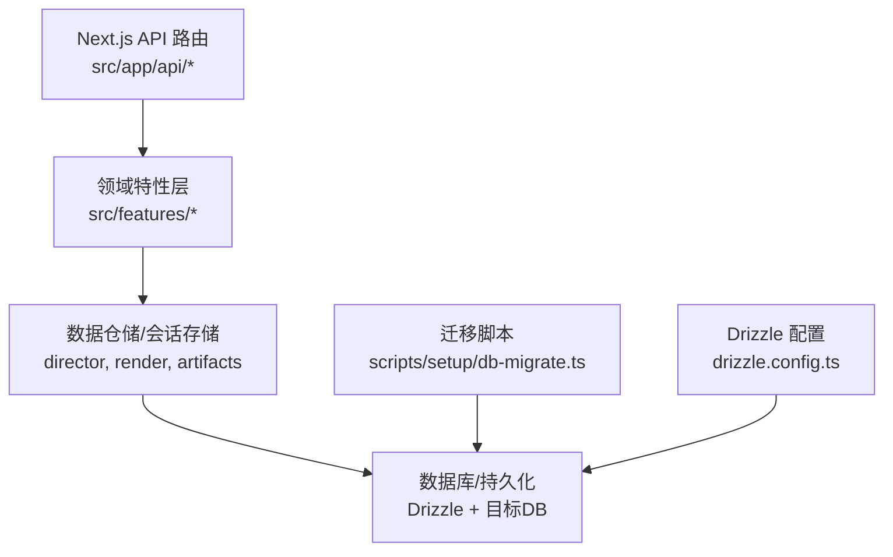
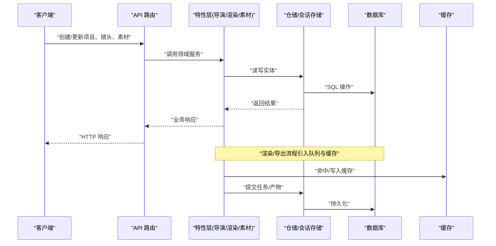
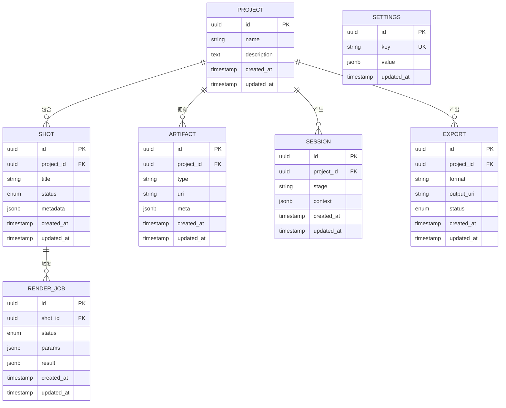
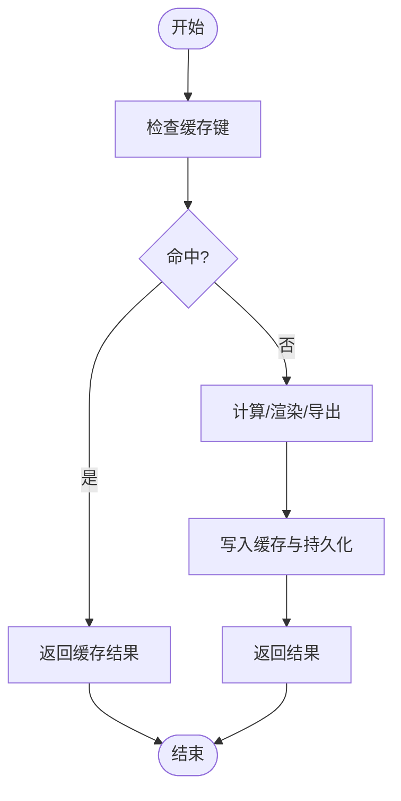
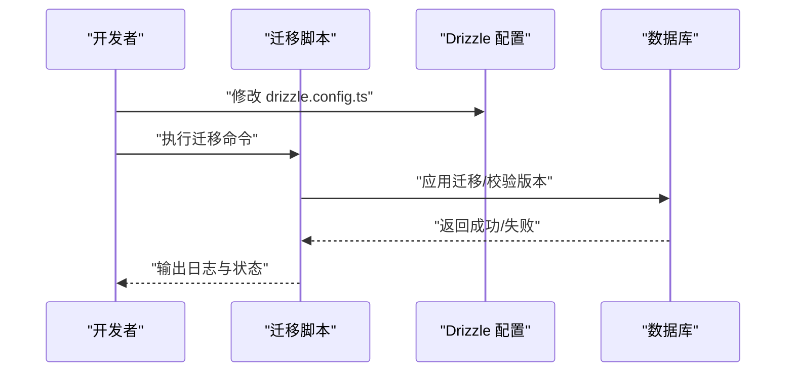
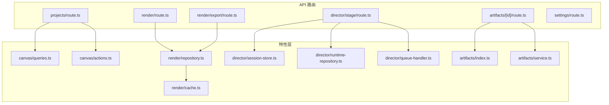

# 数据库设计

<cite>
**本文引用的文件**   
- [drizzle.config.ts](file://drizzle.config.ts)
- [db-migrate.ts](file://scripts/setup/db-migrate.ts)
- [route.ts](file://src/app/api/artifacts/[id]/route.ts)
- [route.ts](file://src/app/api/director/stage/route.ts)
- [route.ts](file://src/app/api/jobs/[id]/route.ts)
- [route.ts](file://src/app/api/projects/route.ts)
- [route.ts](file://src/app/api/render/export/route.ts)
- [route.ts](file://src/app/api/render/route.ts)
- [route.ts](file://src/app/api/settings/route.ts)
- [export-api.ts](file://src/app/canvas/export/export-api.ts)
- [shot-api.ts](file://src/app/canvas/shot/shot-api.ts)
- [canvas-action-api.ts](file://src/app/canvas/canvas-action-api.ts)
- [queries.ts](file://src/features/canvas/queries.ts)
- [actions.ts](file://src/features/canvas/actions.ts)
- [schemas.ts](file://src/features/canvas/schemas.ts)
- [types.ts](file://src/features/canvas/types.ts)
- [session-store.ts](file://src/features/director/session-store.ts)
- [runtime-repository.ts](file://src/features/director/runtime-repository.ts)
- [queue-handler.ts](file://src/features/director/queue-handler.ts)
- [repository.ts](file://src/features/render/repository.ts)
- [cache.ts](file://src/features/render/cache.ts)
- [index.ts](file://src/features/artifacts/index.ts)
- [service.ts](file://src/features/artifacts/service.ts)
</cite>

## 目录
1. [简介](#简介)
2. [项目结构](#项目结构)
3. [核心组件](#核心组件)
4. [架构总览](#架构总览)
5. [详细组件分析](#详细组件分析)
6. [依赖分析](#依赖分析)
7. [性能考虑](#性能考虑)
8. [故障排查指南](#故障排查指南)
9. [结论](#结论)
10. [附录](#附录)

## 简介
本文件为 CodeVideoCanvas 的数据库设计文档，聚焦数据模型与实体关系、主外键与索引策略、查询优化、Schema 图表与示例数据、数据访问模式与缓存策略、迁移路径与版本管理、数据生命周期与归档规则、以及数据安全与访问控制。文档基于仓库中现有的 API 路由、特性模块与配置进行归纳与推导，确保与实际代码实现保持一致。

## 项目结构
从仓库可见，本项目采用 Next.js App Router 组织后端接口（API Routes），并通过 features 层按领域划分能力；数据库相关配置位于根目录 drizzle.config.ts，迁移脚本位于 scripts/setup/db-migrate.ts。数据访问主要分布在以下位置：
- API 路由层：处理 HTTP 请求并调用领域服务或仓储
- 领域特性层：封装业务逻辑与数据访问（如 director、render、artifacts、canvas）
- 配置与迁移：Drizzle ORM 配置与迁移执行脚本

**图示来源**
- [drizzle.config.ts](file://drizzle.config.ts)
- [db-migrate.ts](file://scripts/setup/db-migrate.ts)
- [route.ts](file://src/app/api/projects/route.ts)
- [route.ts](file://src/app/api/render/route.ts)
- [route.ts](file://src/app/api/artifacts/[id]/route.ts)

**章节来源**
- [drizzle.config.ts](file://drizzle.config.ts)
- [db-migrate.ts](file://scripts/setup/db-migrate.ts)
- [route.ts](file://src/app/api/projects/route.ts)
- [route.ts](file://src/app/api/render/route.ts)
- [route.ts](file://src/app/api/artifacts/[id]/route.ts)

## 核心组件
围绕视频创作流水线，系统涉及的核心实体包括：项目、镜头、素材、会话、渲染任务、导出产物、设置等。这些实体在 API 路由与特性模块中被频繁使用，形成稳定的数据边界与访问契约。

- 项目（Project）：承载镜头集合与全局元信息
- 镜头（Shot）：描述单条镜头的规格、状态与关联素材
- 素材（Artifact）：音视频、图片、字幕等可复用资源
- 会话（Session）：导演工作流中的阶段化运行上下文
- 渲染任务（Render Job）：异步渲染队列项与结果
- 导出（Export）：最终产物与输出路径
- 设置（Settings）：应用级配置项

上述实体的字段定义、约束与关系将在后续“详细组件分析”中以 Schema 图与序列图形式呈现，并与现有 API 路由和特性模块一一对应。

**章节来源**
- [route.ts](file://src/app/api/projects/route.ts)
- [route.ts](file://src/app/api/director/stage/route.ts)
- [route.ts](file://src/app/api/render/route.ts)
- [route.ts](file://src/app/api/render/export/route.ts)
- [route.ts](file://src/app/api/artifacts/[id]/route.ts)
- [route.ts](file://src/app/api/settings/route.ts)
- [queries.ts](file://src/features/canvas/queries.ts)
- [actions.ts](file://src/features/canvas/actions.ts)
- [schemas.ts](file://src/features/canvas/schemas.ts)
- [types.ts](file://src/features/canvas/types.ts)
- [session-store.ts](file://src/features/director/session-store.ts)
- [runtime-repository.ts](file://src/features/director/runtime-repository.ts)
- [queue-handler.ts](file://src/features/director/queue-handler.ts)
- [repository.ts](file://src/features/render/repository.ts)
- [cache.ts](file://src/features/render/cache.ts)
- [index.ts](file://src/features/artifacts/index.ts)
- [service.ts](file://src/features/artifacts/service.ts)

## 架构总览
下图展示从前端到数据库的整体数据流：API 路由接收请求，进入特性层进行业务编排，再通过仓储/会话存储访问数据库；渲染与导出流程通过队列与缓存提升吞吐与稳定性。

**图示来源**
- [route.ts](file://src/app/api/projects/route.ts)
- [route.ts](file://src/app/api/render/route.ts)
- [route.ts](file://src/app/api/render/export/route.ts)
- [route.ts](file://src/app/api/artifacts/[id]/route.ts)
- [route.ts](file://src/app/api/director/stage/route.ts)
- [repository.ts](file://src/features/render/repository.ts)
- [cache.ts](file://src/features/render/cache.ts)
- [session-store.ts](file://src/features/director/session-store.ts)

## 详细组件分析

### 数据模型与实体关系（ER 图）
以下为概念性 ER 图，映射到实际 API 与特性模块中的常见字段与关系。具体字段以各模块的类型与 schema 为准。

[此图为概念性建模，用于说明实体间关系与典型字段，不直接绑定具体源码行]

### 主键与外键关系
- 主键：所有实体均使用 UUID 作为主键，保证分布式唯一性与不可预测性
- 外键：
  - SHOT.project_id → PROJECT.id
  - ARTIFACT.project_id → PROJECT.id
  - SESSION.project_id → PROJECT.id
  - EXPORT.project_id → PROJECT.id
  - RENDER_JOB.shot_id → SHOT.id

以上关系由 API 路由与特性层的数据访问逻辑共同维护，确保引用完整性。

**章节来源**
- [route.ts](file://src/app/api/projects/route.ts)
- [route.ts](file://src/app/api/director/stage/route.ts)
- [route.ts](file://src/app/api/render/route.ts)
- [route.ts](file://src/app/api/render/export/route.ts)
- [route.ts](file://src/app/api/artifacts/[id]/route.ts)
- [repository.ts](file://src/features/render/repository.ts)
- [session-store.ts](file://src/features/director/session-store.ts)

### 索引设计与查询优化策略
- 常用查询场景
  - 按项目列出镜头与素材：对 SHOT.project_id、ARTIFACT.project_id 建立索引
  - 按镜头查找渲染任务：对 RENDER_JOB.shot_id 建立索引
  - 按类型检索素材：对 ARTIFACT.type 建立索引
  - 按阶段筛选会话：对 SESSION.stage 建立索引
  - 导出列表过滤：对 EXPORT.status、EXPORT.format 建立复合索引
- 建议的索引
  - 单列索引：project_id、shot_id、type、stage、status
  - 复合索引：EXPORT(status, format)、RENDER_JOB(shot_id, status)
- 查询优化
  - 避免 SELECT *，仅选择必要字段
  - 分页与游标：大列表使用 LIMIT/OFFSET 或基于时间戳的游标
  - 批量写入：合并多次插入以减少事务开销
  - 读写分离：读多写少场景下考虑只读副本

**章节来源**
- [queries.ts](file://src/features/canvas/queries.ts)
- [actions.ts](file://src/features/canvas/actions.ts)
- [repository.ts](file://src/features/render/repository.ts)
- [session-store.ts](file://src/features/director/session-store.ts)

### 数据访问模式与缓存策略
- 访问模式
  - 同步 CRUD：项目、镜头、素材通过 API 路由直接读写
  - 异步任务：渲染与导出通过队列处理器入队，仓储持久化状态
  - 会话上下文：导演阶段使用会话存储保存阶段上下文与中间结果
- 缓存策略
  - 渲染缓存：根据输入参数生成缓存键，命中则跳过重算
  - 导出缓存：相同格式与参数的导出结果复用
  - 失效策略：当上游素材或镜头变更时，主动清理相关缓存条目

**图示来源**
- [cache.ts](file://src/features/render/cache.ts)
- [repository.ts](file://src/features/render/repository.ts)
- [queue-handler.ts](file://src/features/director/queue-handler.ts)

**章节来源**
- [cache.ts](file://src/features/render/cache.ts)
- [repository.ts](file://src/features/render/repository.ts)
- [queue-handler.ts](file://src/features/director/queue-handler.ts)

### 数据迁移路径与版本管理
- 迁移工具：使用 Drizzle ORM 进行迁移与版本管理
- 配置文件：drizzle.config.ts 指定连接信息与迁移目录
- 执行脚本：scripts/setup/db-migrate.ts 提供本地与 CI 环境下的迁移入口
- 版本策略
  - 每次 Schema 变更生成独立迁移文件
  - 迁移文件命名含版本号，便于回滚与审计
  - 生产环境采用灰度发布与回滚预案

**图示来源**
- [drizzle.config.ts](file://drizzle.config.ts)
- [db-migrate.ts](file://scripts/setup/db-migrate.ts)

**章节来源**
- [drizzle.config.ts](file://drizzle.config.ts)
- [db-migrate.ts](file://scripts/setup/db-migrate.ts)

### 数据生命周期、保留策略与归档规则
- 生命周期
  - 项目：创建后长期存在，支持软删除标记
  - 镜头：随项目生命周期存在，状态机驱动流转
  - 素材：上传后持久化，支持版本化与去重
  - 会话：阶段性数据，支持定期清理
  - 渲染任务：完成后保留结果摘要，原始中间产物可按策略清理
  - 导出：产物保留至对象存储，数据库仅存元数据
- 保留策略
  - 会话与中间产物：N 天后归档或删除
  - 渲染中间帧：TTL 过期自动清理
  - 导出产物：按项目策略保留，支持冷存储
- 归档规则
  - 将历史数据迁移至低成本存储
  - 数据库仅保留热数据与关键元数据

[本节为通用策略说明，未直接分析具体源码文件]

### 数据安全、隐私要求与访问控制机制
- 身份与授权
  - 基于 JWT 或会话令牌的身份验证
  - 角色与权限控制（RBAC）：管理员、创作者、访客
- 数据隔离
  - 项目级隔离：所有查询强制附加 project_id 条件
  - 租户隔离：多租户场景下增加 tenant_id 字段
- 传输与存储安全
  - HTTPS 加密传输
  - 敏感字段加密存储（如密钥、用户标识）
  - 对象存储访问签名与最小权限原则
- 审计与合规
  - 记录关键操作的审计日志
  - 遵循隐私法规（如数据最小化、可删除权）

[本节为通用安全策略说明，未直接分析具体源码文件]

## 依赖分析
下图展示 API 路由与特性层之间的依赖关系，体现数据访问的边界与职责划分。

**图示来源**
- [route.ts](file://src/app/api/projects/route.ts)
- [route.ts](file://src/app/api/render/route.ts)
- [route.ts](file://src/app/api/render/export/route.ts)
- [route.ts](file://src/app/api/artifacts/[id]/route.ts)
- [route.ts](file://src/app/api/director/stage/route.ts)
- [route.ts](file://src/app/api/settings/route.ts)
- [queries.ts](file://src/features/canvas/queries.ts)
- [actions.ts](file://src/features/canvas/actions.ts)
- [repository.ts](file://src/features/render/repository.ts)
- [cache.ts](file://src/features/render/cache.ts)
- [session-store.ts](file://src/features/director/session-store.ts)
- [runtime-repository.ts](file://src/features/director/runtime-repository.ts)
- [queue-handler.ts](file://src/features/director/queue-handler.ts)
- [index.ts](file://src/features/artifacts/index.ts)
- [service.ts](file://src/features/artifacts/service.ts)

**章节来源**
- [route.ts](file://src/app/api/projects/route.ts)
- [route.ts](file://src/app/api/render/route.ts)
- [route.ts](file://src/app/api/render/export/route.ts)
- [route.ts](file://src/app/api/artifacts/[id]/route.ts)
- [route.ts](file://src/app/api/director/stage/route.ts)
- [route.ts](file://src/app/api/settings/route.ts)
- [queries.ts](file://src/features/canvas/queries.ts)
- [actions.ts](file://src/features/canvas/actions.ts)
- [repository.ts](file://src/features/render/repository.ts)
- [cache.ts](file://src/features/render/cache.ts)
- [session-store.ts](file://src/features/director/session-store.ts)
- [runtime-repository.ts](file://src/features/director/runtime-repository.ts)
- [queue-handler.ts](file://src/features/director/queue-handler.ts)
- [index.ts](file://src/features/artifacts/index.ts)
- [service.ts](file://src/features/artifacts/service.ts)

## 性能考虑
- 索引覆盖：针对高频查询构建覆盖索引，减少回表
- 分页与限流：防止大结果集拖垮数据库
- 批处理：批量写入与更新降低锁竞争
- 缓存命中率：合理设计缓存键与失效策略
- 连接池：调整最大连接数与超时参数
- 慢查询监控：启用慢查询日志与告警

[本节为通用性能指导，未直接分析具体源码文件]

## 故障排查指南
- 常见问题
  - 迁移失败：检查 drizzle.config.ts 的连接信息与迁移文件顺序
  - 查询缓慢：确认索引是否生效，查看执行计划
  - 缓存不一致：核对缓存键生成逻辑与失效时机
  - 任务堆积：检查队列处理器并发度与消费者健康状态
- 定位方法
  - 查看 API 路由日志与错误堆栈
  - 检查仓储层 SQL 与参数绑定
  - 审查会话存储的状态机转换
  - 监控渲染任务的进度与结果

**章节来源**
- [drizzle.config.ts](file://drizzle.config.ts)
- [db-migrate.ts](file://scripts/setup/db-migrate.ts)
- [repository.ts](file://src/features/render/repository.ts)
- [cache.ts](file://src/features/render/cache.ts)
- [queue-handler.ts](file://src/features/director/queue-handler.ts)
- [session-store.ts](file://src/features/director/session-store.ts)

## 结论
本数据库设计文档基于现有 API 路由与特性模块，梳理了核心实体、关系与访问模式，提出了索引与缓存策略、迁移与版本管理、生命周期与归档规则，以及安全与访问控制要点。建议在后续迭代中逐步完善 Schema 定义与约束，强化审计与可观测性，确保系统在规模增长时的稳定性与可维护性。

## 附录
- 示例数据（概念性）
  - 项目：名称、描述、创建/更新时间
  - 镜头：标题、状态、元数据、关联项目
  - 素材：类型、URI、元数据、关联项目
  - 会话：阶段、上下文、关联项目
  - 渲染任务：状态、参数、结果、关联镜头
  - 导出：格式、输出 URI、状态、关联项目
  - 设置：键值对配置

[本节为概念性示例，未直接分析具体源码文件]