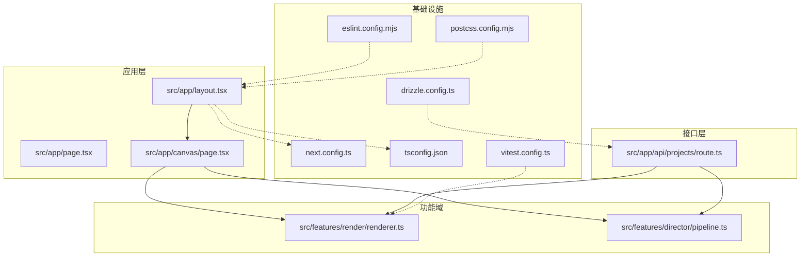
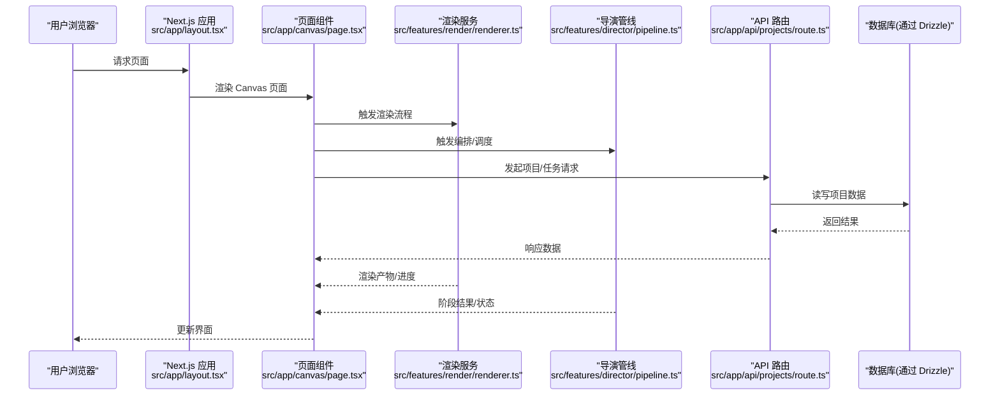
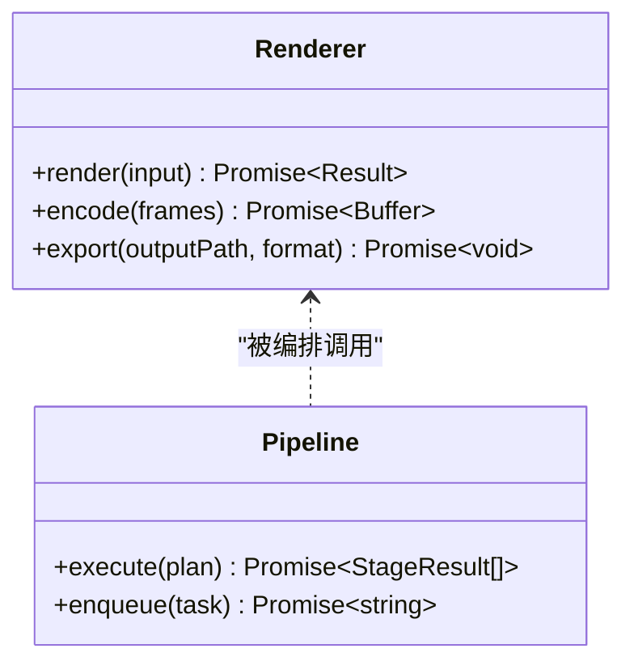
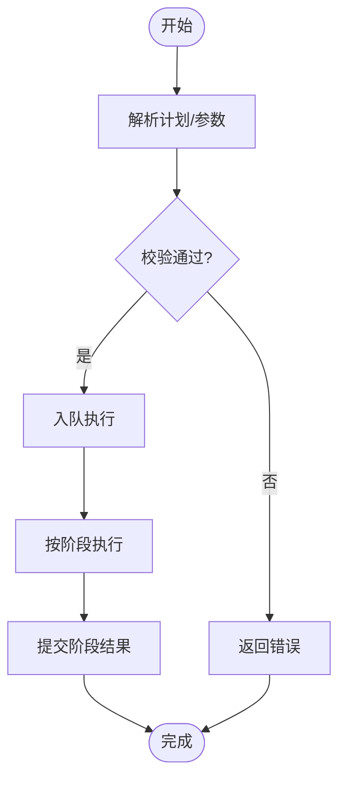
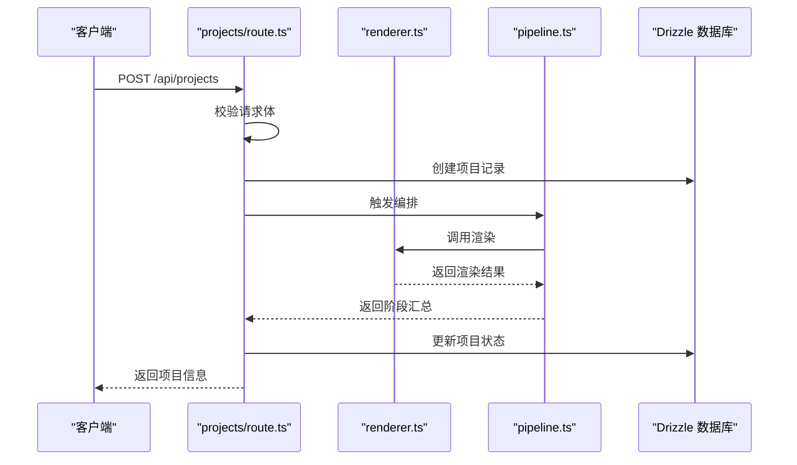
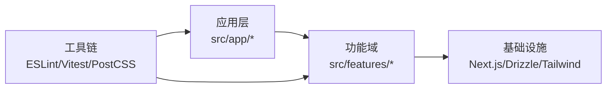

# 技术选型

<cite>
**本文引用的文件**   
- [package.json](file://package.json)
- [next.config.ts](file://next.config.ts)
- [tsconfig.json](file://tsconfig.json)
- [eslint.config.mjs](file://eslint.config.mjs)
- [vitest.config.ts](file://vitest.config.ts)
- [postcss.config.mjs](file://postcss.config.mjs)
- [drizzle.config.ts](file://drizzle.config.ts)
- [src/app/layout.tsx](file://src/app/layout.tsx)
- [src/app/page.tsx](file://src/app/page.tsx)
- [src/app/canvas/page.tsx](file://src/app/canvas/page.tsx)
- [src/app/api/projects/route.ts](file://src/app/api/projects/route.ts)
- [src/features/render/renderer.ts](file://src/features/render/renderer.ts)
- [src/features/director/pipeline.ts](file://src/features/director/pipeline.ts)
</cite>

## 目录
1. [简介](#简介)
2. [项目结构](#项目结构)
3. [核心组件](#核心组件)
4. [架构总览](#架构总览)
5. [详细组件分析](#详细组件分析)
6. [依赖分析](#依赖分析)
7. [性能考虑](#性能考虑)
8. [故障排查指南](#故障排查指南)
9. [结论](#结论)
10. [附录](#附录)

## 简介
本技术选型文档面向 CodeVideoCanvas 项目，系统阐述前端与全栈技术栈的选择依据、版本考量与兼容性要求，并给出开发工具链集成策略（ESLint、Vitest、PostCSS）、性能优化与监控方案。文档同时提供架构图与依赖关系图，帮助读者快速理解整体布局与关键路径。

## 项目结构
本项目采用 Next.js App Router 组织应用路由与页面，结合 features 分层将业务域能力解耦；UI 组件位于 components/ui，领域逻辑集中于 src/features，API 路由位于 src/app/api，数据库配置与迁移脚本通过 drizzle.config.ts 管理。

图表来源
- [src/app/layout.tsx](file://src/app/layout.tsx)
- [src/app/page.tsx](file://src/app/page.tsx)
- [src/app/canvas/page.tsx](file://src/app/canvas/page.tsx)
- [src/app/api/projects/route.ts](file://src/app/api/projects/route.ts)
- [src/features/render/renderer.ts](file://src/features/render/renderer.ts)
- [src/features/director/pipeline.ts](file://src/features/director/pipeline.ts)
- [next.config.ts](file://next.config.ts)
- [tsconfig.json](file://tsconfig.json)
- [eslint.config.mjs](file://eslint.config.mjs)
- [vitest.config.ts](file://vitest.config.ts)
- [postcss.config.mjs](file://postcss.config.mjs)
- [drizzle.config.ts](file://drizzle.config.ts)

章节来源
- [next.config.ts](file://next.config.ts)
- [src/app/layout.tsx](file://src/app/layout.tsx)
- [src/app/page.tsx](file://src/app/page.tsx)
- [src/app/canvas/page.tsx](file://src/app/canvas/page.tsx)
- [src/app/api/projects/route.ts](file://src/app/api/projects/route.ts)
- [src/features/render/renderer.ts](file://src/features/render/renderer.ts)
- [src/features/director/pipeline.ts](file://src/features/director/pipeline.ts)

## 核心组件
本节聚焦于技术栈选择与理由：Next.js、React、TypeScript、Tailwind CSS、Drizzle ORM，以及配套工具链 ESLint、Vitest、PostCSS。

- Next.js
  - 选择原因：App Router 提供基于文件系统的路由与数据流，内置服务端渲染/静态生成、中间件、API 路由等能力，适合视频创作类复杂交互应用的构建与部署。
  - 版本与兼容：遵循 package.json 中声明的 next 版本约束；确保 Node 版本满足运行环境要求。
  - 参考配置：[next.config.ts](file://next.config.ts)

- React
  - 选择原因：生态成熟、组件化模型与状态管理范式完善，配合 Next.js 可高效实现富交互界面。
  - 版本与兼容：与 Next.js 版本绑定，避免不兼容升级。
  - 入口示例：[src/app/layout.tsx](file://src/app/layout.tsx)、[src/app/page.tsx](file://src/app/page.tsx)

- TypeScript
  - 选择原因：强类型提升大型工程的可维护性与协作效率，利于重构与自动化检查。
  - 版本与兼容：以 tsconfig.json 中的 target/moduleResolution 为准，确保与 Next.js 和第三方库兼容。
  - 参考配置：[tsconfig.json](file://tsconfig.json)

- Tailwind CSS
  - 选择原因：原子化样式体系加速 UI 迭代，配合 PostCSS 与 Next.js 可实现按需编译与主题定制。
  - 版本与兼容：遵循 postcss.config.mjs 与 package.json 中 tailwindcss 版本约束。
  - 参考配置：[postcss.config.mjs](file://postcss.config.mjs)

- Drizzle ORM
  - 选择原因：类型安全、轻量且与 Node/Edge 运行时良好兼容，便于在 API 路由中直接访问数据库。
  - 版本与兼容：drizzle.config.ts 定义连接与迁移策略；需与所选数据库驱动版本匹配。
  - 参考配置：[drizzle.config.ts](file://drizzle.config.ts)

- 开发工具链
  - ESLint：统一代码风格与质量规则，建议启用 Next.js 官方插件与 TypeScript 规则集。
    - 参考配置：[eslint.config.mjs](file://eslint.config.mjs)
  - Vitest：与 Vite 生态一致的高性能测试框架，适合单元测试与部分集成测试。
    - 参考配置：[vitest.config.ts](file://vitest.config.ts)
  - PostCSS：为 Tailwind 提供处理管线，支持自定义插件与浏览器兼容目标。
    - 参考配置：[postcss.config.mjs](file://postcss.config.mjs)

章节来源
- [package.json](file://package.json)
- [next.config.ts](file://next.config.ts)
- [tsconfig.json](file://tsconfig.json)
- [postcss.config.mjs](file://postcss.config.mjs)
- [drizzle.config.ts](file://drizzle.config.ts)
- [eslint.config.mjs](file://eslint.config.mjs)
- [vitest.config.ts](file://vitest.config.ts)
- [src/app/layout.tsx](file://src/app/layout.tsx)
- [src/app/page.tsx](file://src/app/page.tsx)

## 架构总览
下图展示从浏览器到服务端 API 与渲染/编排能力的调用链路，体现 Next.js App Router、React 组件、功能域与数据库之间的交互。

图表来源
- [src/app/layout.tsx](file://src/app/layout.tsx)
- [src/app/canvas/page.tsx](file://src/app/canvas/page.tsx)
- [src/features/render/renderer.ts](file://src/features/render/renderer.ts)
- [src/features/director/pipeline.ts](file://src/features/director/pipeline.ts)
- [src/app/api/projects/route.ts](file://src/app/api/projects/route.ts)

## 详细组件分析

### 渲染子系统（Render）
职责：封装帧序列处理、编码与导出等渲染相关能力，供页面与 API 调用。

图表来源
- [src/features/render/renderer.ts](file://src/features/render/renderer.ts)
- [src/features/director/pipeline.ts](file://src/features/director/pipeline.ts)

章节来源
- [src/features/render/renderer.ts](file://src/features/render/renderer.ts)
- [src/features/director/pipeline.ts](file://src/features/director/pipeline.ts)

### 导演管线（Director）
职责：将复杂的视频制作流程拆分为多个阶段，提供编排、队列与结果提交能力。

图表来源
- [src/features/director/pipeline.ts](file://src/features/director/pipeline.ts)

章节来源
- [src/features/director/pipeline.ts](file://src/features/director/pipeline.ts)

### API 路由（Projects）
职责：暴露项目相关的 RESTful 接口，负责鉴权、参数校验、持久化与错误处理。

图表来源
- [src/app/api/projects/route.ts](file://src/app/api/projects/route.ts)
- [src/features/render/renderer.ts](file://src/features/render/renderer.ts)
- [src/features/director/pipeline.ts](file://src/features/director/pipeline.ts)

章节来源
- [src/app/api/projects/route.ts](file://src/app/api/projects/route.ts)

## 依赖分析
下图展示主要依赖关系与边界：应用层依赖功能域，功能域依赖基础设施（Next.js、Drizzle），工具链贯穿开发与构建。

图表来源
- [src/app/layout.tsx](file://src/app/layout.tsx)
- [src/app/canvas/page.tsx](file://src/app/canvas/page.tsx)
- [src/features/render/renderer.ts](file://src/features/render/renderer.ts)
- [src/features/director/pipeline.ts](file://src/features/director/pipeline.ts)
- [eslint.config.mjs](file://eslint.config.mjs)
- [vitest.config.ts](file://vitest.config.ts)
- [postcss.config.mjs](file://postcss.config.mjs)

章节来源
- [package.json](file://package.json)
- [next.config.ts](file://next.config.ts)
- [tsconfig.json](file://tsconfig.json)
- [eslint.config.mjs](file://eslint.config.mjs)
- [vitest.config.ts](file://vitest.config.ts)
- [postcss.config.mjs](file://postcss.config.mjs)
- [drizzle.config.ts](file://drizzle.config.ts)

## 性能考虑
- 构建与打包
  - 使用 Next.js 的增量静态再生成（ISR）与预渲染策略，减少首屏时间。
  - 合理拆分路由与组件，利用动态导入降低包体积。
- 样式与资源
  - 借助 Tailwind 的按需编译与 Purge 策略，减少无用样式。
  - 图片/媒体资源采用懒加载与合适的格式压缩。
- 运行时
  - 对长耗时任务（渲染、导出）采用后台队列与分片处理，避免阻塞主线程。
  - 缓存热点数据（如项目元信息、模板）以减少重复计算与 IO。
- 监控与观测
  - 接入前端性能指标采集（FCP/LCP/CLS），并结合后端日志与错误上报形成闭环。
  - 对关键路径（API 路由、渲染流水线）埋点统计耗时与失败率。

## 故障排查指南
- 常见问题定位
  - 构建失败：优先检查 next.config.ts、tsconfig.json 与依赖版本冲突。
  - 样式异常：确认 postcss.config.mjs 与 Tailwind 配置是否正确加载。
  - 数据库连接：核对 drizzle.config.ts 的连接信息与权限。
- 调试与测试
  - 使用 ESLint 规则提前发现潜在问题。
  - 针对核心模块编写单测与集成测试（Vitest），覆盖边界条件与错误分支。
- 日志与告警
  - 在服务端 API 与渲染管线增加结构化日志，便于追踪问题根因。
  - 设置关键错误阈值告警，缩短平均恢复时间。

章节来源
- [next.config.ts](file://next.config.ts)
- [tsconfig.json](file://tsconfig.json)
- [postcss.config.mjs](file://postcss.config.mjs)
- [drizzle.config.ts](file://drizzle.config.ts)
- [eslint.config.mjs](file://eslint.config.mjs)
- [vitest.config.ts](file://vitest.config.ts)

## 结论
CodeVideoCanvas 的技术选型以 Next.js 为核心，结合 React 与 TypeScript 构建高可用、可维护的前端与全栈应用；Tailwind CSS 提升 UI 迭代效率；Drizzle ORM 保障类型安全的数据库访问；ESLint、Vitest、PostCSS 构成完整的开发与质量保障工具链。该组合在性能、可观测性与团队协作方面具备显著优势，适合视频创作类复杂交互场景。

## 附录
- 版本与兼容性建议
  - 锁定 major/minor 版本，变更前进行回归测试与兼容性评估。
  - 关注 Next.js、React、TypeScript、Tailwind、Drizzle 的发布说明与安全公告。
- 最佳实践
  - 严格遵循 ESLint 与 TypeScript 规则，保持代码一致性。
  - 对关键路径编写测试用例，持续集成与自动化验证。
  - 建立统一的错误码与日志规范，便于跨团队排障。