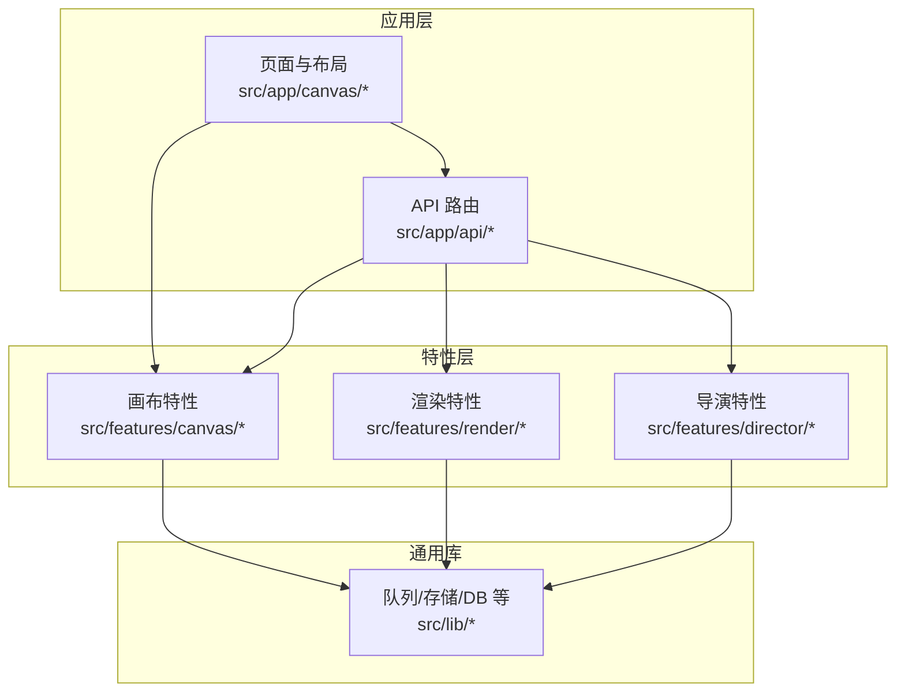
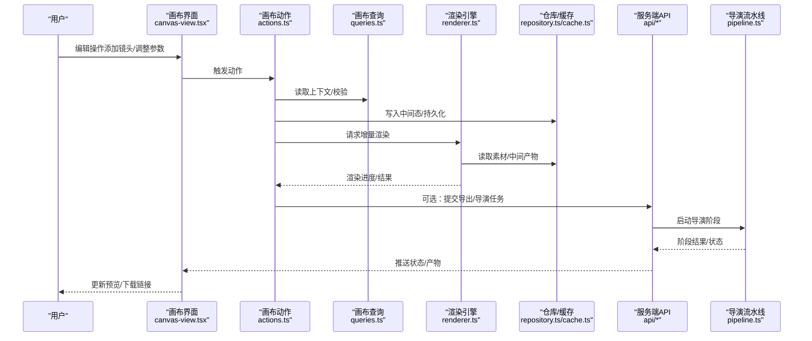
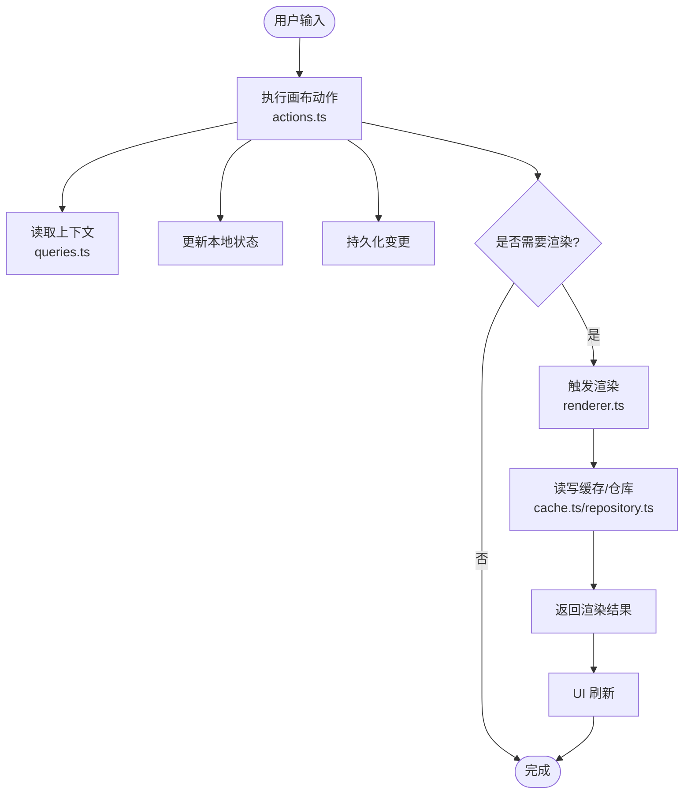
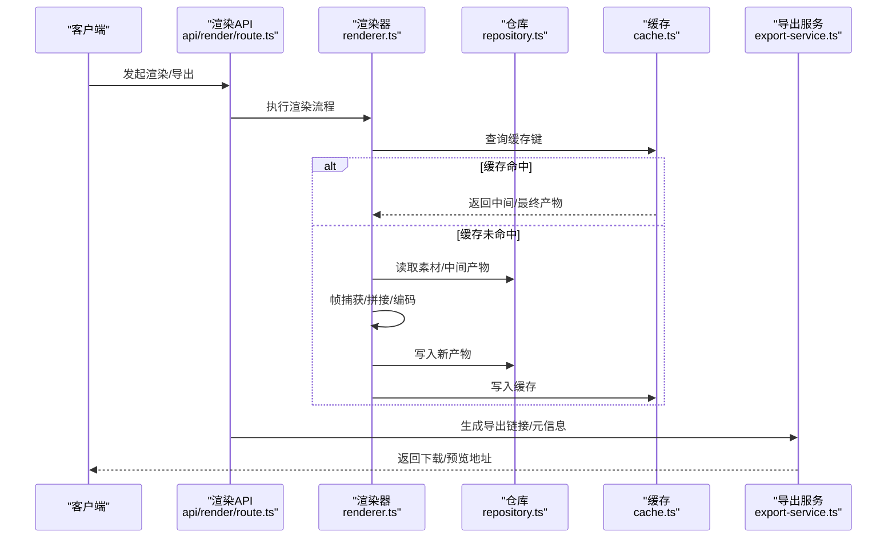
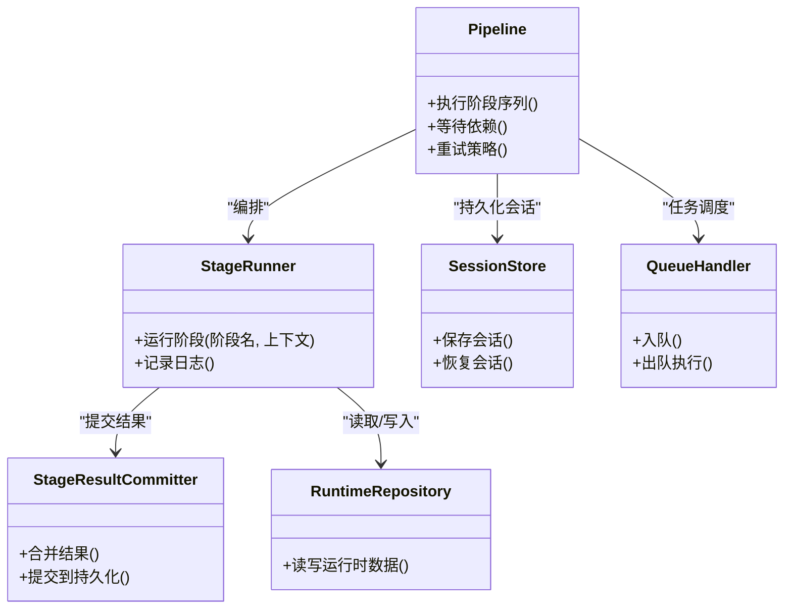
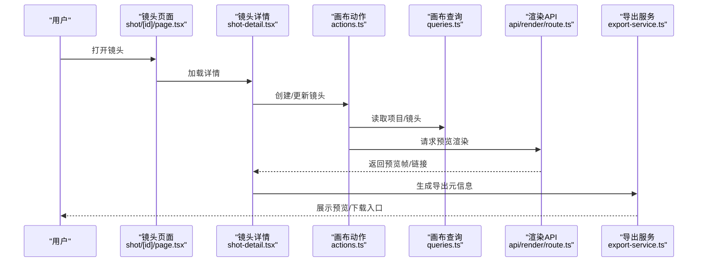
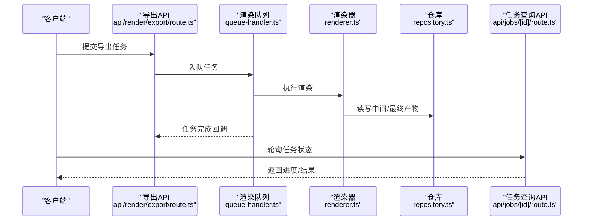
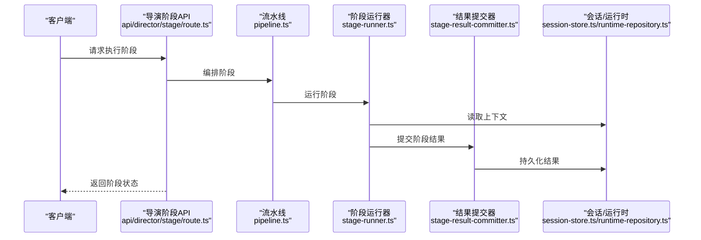
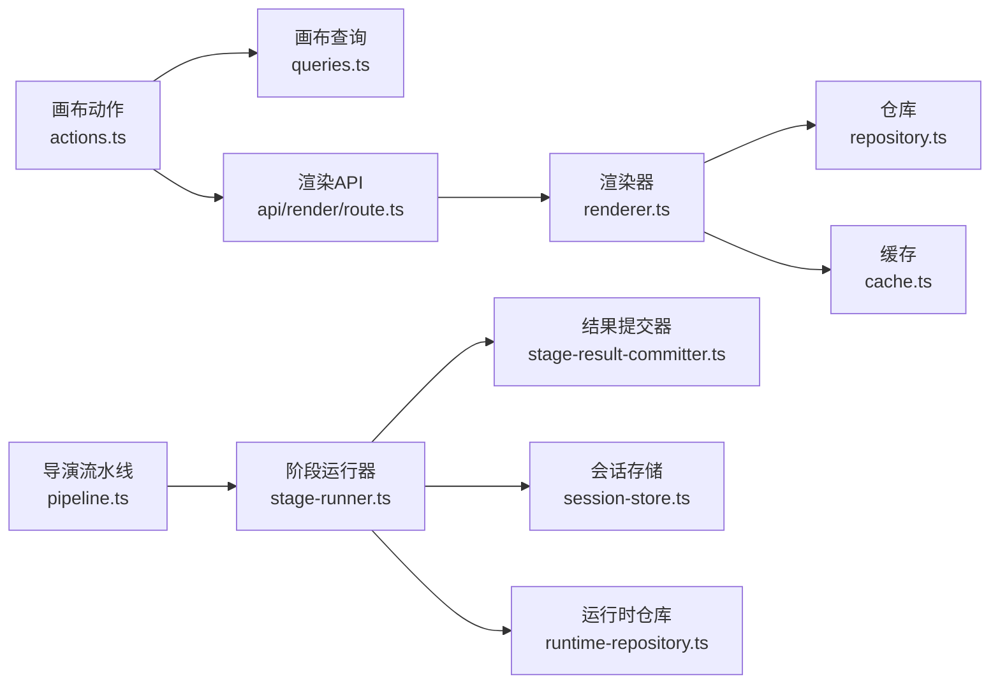
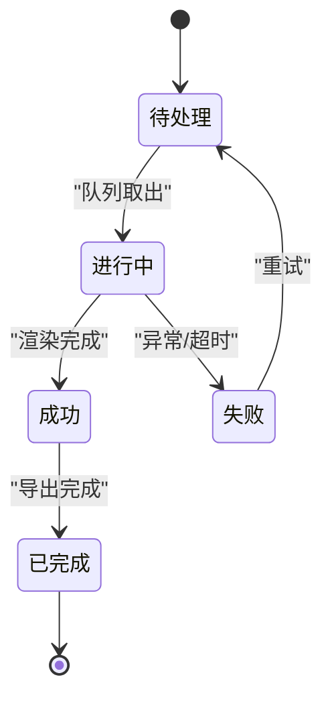

# 数据流设计

<cite>
**本文引用的文件**
- [src/app/canvas/page.tsx](file://src/app/canvas/page.tsx)
- [src/app/canvas/layout.tsx](file://src/app/canvas/layout.tsx)
- [src/app/canvas/canvas-view.tsx](file://src/app/canvas/canvas-view.tsx)
- [src/app/canvas/shot/[id]/page.tsx](file://src/app/canvas/shot/[id]/page.tsx)
- [src/app/canvas/shot/[id]/shot-detail.tsx](file://src/app/canvas/shot/[id]/shot-detail.tsx)
- [src/app/canvas/shot/[id]/shot-api.ts](file://src/app/canvas/shot/[id]/shot-api.ts)
- [src/app/canvas/canvas-action-api.ts](file://src/app/canvas/canvas-action-api.ts)
- [src/app/api/projects/route.ts](file://src/app/api/projects/route.ts)
- [src/app/api/artifacts/[id]/route.ts](file://src/app/api/artifacts/[id]/route.ts)
- [src/app/api/render/route.ts](file://src/app/api/render/route.ts)
- [src/app/api/render/export/route.ts](file://src/app/api/render/export/route.ts)
- [src/app/api/director/stage/route.ts](file://src/app/api/director/stage/route.ts)
- [src/app/api/jobs/[id]/route.ts](file://src/app/api/jobs/[id]/route.ts)
- [src/features/canvas/actions.ts](file://src/features/canvas/actions.ts)
- [src/features/canvas/queries.ts](file://src/features/canvas/queries.ts)
- [src/features/canvas/types.ts](file://src/features/canvas/types.ts)
- [src/features/canvas/status.ts](file://src/features/canvas/status.ts)
- [src/features/canvas/fan-out.ts](file://src/features/canvas/fan-out.ts)
- [src/features/canvas/layout.ts](file://src/features/canvas/layout.ts)
- [src/features/render/renderer.ts](file://src/features/render/renderer.ts)
- [src/features/render/repository.ts](file://src/features/render/repository.ts)
- [src/features/render/cache.ts](file://src/features/render/cache.ts)
- [src/features/render/queue-handler.ts](file://src/features/render/queue-handler.ts)
- [src/features/render/frame-capture.ts](file://src/features/render/frame-capture.ts)
- [src/features/render/concat.ts](file://src/features/render/concat.ts)
- [src/features/render/encode.ts](file://src/features/render/encode.ts)
- [src/features/render/export-service.ts](file://src/features/render/export-service.ts)
- [src/features/director/pipeline.ts](file://src/features/director/pipeline.ts)
- [src/features/director/queue-handler.ts](file://src/features/director/queue-handler.ts)
- [src/features/director/session-store.ts](file://src/features/director/session-store.ts)
- [src/features/director/runtime-repository.ts](file://src/features/director/runtime-repository.ts)
- [src/features/director/stage-runner.ts](file://src/features/director/stage-runner.ts)
- [src/features/director/stage-result-committer.ts](file://src/features/director/stage-result-committer.ts)
- [src/features/director/stage-result.ts](file://src/features/director/stage-result.ts)
- [src/features/director/types.ts](file://src/features/director/types.ts)
</cite>

## 目录
1. [引言](#引言)
2. [项目结构](#项目结构)
3. [核心组件](#核心组件)
4. [架构总览](#架构总览)
5. [详细组件分析](#详细组件分析)
6. [依赖分析](#依赖分析)
7. [性能考虑](#性能考虑)
8. [故障排查指南](#故障排查指南)
9. [结论](#结论)
10. [附录](#附录)

## 引言
本文件面向 CodeVideoCanvas 的数据流设计，聚焦从用户输入到最终渲染输出的完整链路，覆盖客户端状态、服务器状态与持久化状态的同步策略；解释缓存与一致性保证；说明异步任务处理与变更追踪；并通过数据流图与状态转换图展示关键业务场景。

## 项目结构
CodeVideoCanvas 采用 Next.js App Router 的“按功能域 + 分层”组织方式：
- 应用层（app）：路由、页面、API 路由、布局与视图容器
- 特性层（features）：领域能力（canvas、render、director、artifacts、audio 等）
- 通用库（lib）：配置、数据库、队列、存储、工具等
- 组件（components）：UI 与节点组件

图表来源
- [src/app/canvas/page.tsx:1-200](file://src/app/canvas/page.tsx#L1-L200)
- [src/app/api/projects/route.ts:1-200](file://src/app/api/projects/route.ts#L1-L200)
- [src/features/canvas/actions.ts:1-200](file://src/features/canvas/actions.ts#L1-L200)
- [src/features/render/renderer.ts:1-200](file://src/features/render/renderer.ts#L1-L200)
- [src/features/director/pipeline.ts:1-200](file://src/features/director/pipeline.ts#L1-L200)

章节来源
- [src/app/canvas/page.tsx:1-200](file://src/app/canvas/page.tsx#L1-L200)
- [src/app/canvas/layout.tsx:1-200](file://src/app/canvas/layout.tsx#L1-L200)
- [src/app/canvas/canvas-view.tsx:1-200](file://src/app/canvas/canvas-view.tsx#L1-L200)
- [src/app/api/projects/route.ts:1-200](file://src/app/api/projects/route.ts#L1-L200)
- [src/features/canvas/actions.ts:1-200](file://src/features/canvas/actions.ts#L1-L200)
- [src/features/render/renderer.ts:1-200](file://src/features/render/renderer.ts#L1-L200)
- [src/features/director/pipeline.ts:1-200](file://src/features/director/pipeline.ts#L1-L200)

## 核心组件
- 画布特性（features/canvas）
  - actions.ts：定义并执行画布操作（如创建镜头、更新属性），负责将变更写入本地状态与持久化
  - queries.ts：提供查询接口，用于读取项目、镜头、素材等
  - types.ts / status.ts：类型与状态机定义，驱动 UI 与流程控制
  - fan-out.ts / layout.ts：布局与分发逻辑，支撑多镜头编排与输出
- 渲染特性（features/render）
  - renderer.ts：帧渲染主流程，协调捕获、合成、编码
  - repository.ts：渲染产物与中间数据的读写
  - cache.ts：渲染结果与中间态缓存
  - queue-handler.ts：渲染任务队列处理器
  - frame-capture.ts / concat.ts / encode.ts：帧捕获、拼接、编码子流程
  - export-service.ts：导出服务，封装导出 API 调用与结果聚合
- 导演特性（features/director）
  - pipeline.ts：导演流水线编排（阶段顺序、依赖、重试）
  - stage-runner.ts：阶段运行器，驱动单个阶段执行
  - session-store.ts / runtime-repository.ts：会话与运行时数据存取
  - stage-result-committer.ts / stage-result.ts：阶段结果合并与提交
  - queue-handler.ts：导演任务队列处理器
  - types.ts：导演相关类型

章节来源
- [src/features/canvas/actions.ts:1-200](file://src/features/canvas/actions.ts#L1-L200)
- [src/features/canvas/queries.ts:1-200](file://src/features/canvas/queries.ts#L1-L200)
- [src/features/canvas/types.ts:1-200](file://src/features/canvas/types.ts#L1-L200)
- [src/features/canvas/status.ts:1-200](file://src/features/canvas/status.ts#L1-L200)
- [src/features/canvas/fan-out.ts:1-200](file://src/features/canvas/fan-out.ts#L1-L200)
- [src/features/canvas/layout.ts:1-200](file://src/features/canvas/layout.ts#L1-L200)
- [src/features/render/renderer.ts:1-200](file://src/features/render/renderer.ts#L1-L200)
- [src/features/render/repository.ts:1-200](file://src/features/render/repository.ts#L1-L200)
- [src/features/render/cache.ts:1-200](file://src/features/render/cache.ts#L1-L200)
- [src/features/render/queue-handler.ts:1-200](file://src/features/render/queue-handler.ts#L1-L200)
- [src/features/render/frame-capture.ts:1-200](file://src/features/render/frame-capture.ts#L1-L200)
- [src/features/render/concat.ts:1-200](file://src/features/render/concat.ts#L1-L200)
- [src/features/render/encode.ts:1-200](file://src/features/render/encode.ts#L1-L200)
- [src/features/render/export-service.ts:1-200](file://src/features/render/export-service.ts#L1-L200)
- [src/features/director/pipeline.ts:1-200](file://src/features/director/pipeline.ts#L1-L200)
- [src/features/director/queue-handler.ts:1-200](file://src/features/director/queue-handler.ts#L1-L200)
- [src/features/director/session-store.ts:1-200](file://src/features/director/session-store.ts#L1-L200)
- [src/features/director/runtime-repository.ts:1-200](file://src/features/director/runtime-repository.ts#L1-L200)
- [src/features/director/stage-runner.ts:1-200](file://src/features/director/stage-runner.ts#L1-L200)
- [src/features/director/stage-result-committer.ts:1-200](file://src/features/director/stage-result-committer.ts#L1-L200)
- [src/features/director/stage-result.ts:1-200](file://src/features/director/stage-result.ts#L1-L200)
- [src/features/director/types.ts:1-200](file://src/features/director/types.ts#L1-L200)

## 架构总览
整体数据流分为三条主线：
- 编辑数据流：用户在画布上的交互通过 actions 产生变更，经 queries 读取最新状态，必要时触发渲染或导出
- 渲染数据流：渲染管线从仓库读取素材与中间产物，经过帧捕获、拼接、编码，产出可导出的媒体
- 导演数据流：导演流水线按阶段推进，使用阶段运行器与结果提交器，结合队列与持久化实现可靠执行

图表来源
- [src/app/canvas/canvas-view.tsx:1-200](file://src/app/canvas/canvas-view.tsx#L1-L200)
- [src/features/canvas/actions.ts:1-200](file://src/features/canvas/actions.ts#L1-L200)
- [src/features/canvas/queries.ts:1-200](file://src/features/canvas/queries.ts#L1-L200)
- [src/features/render/renderer.ts:1-200](file://src/features/render/renderer.ts#L1-L200)
- [src/features/render/repository.ts:1-200](file://src/features/render/repository.ts#L1-L200)
- [src/features/render/cache.ts:1-200](file://src/features/render/cache.ts#L1-L200)
- [src/app/api/render/route.ts:1-200](file://src/app/api/render/route.ts#L1-L200)
- [src/features/director/pipeline.ts:1-200](file://src/features/director/pipeline.ts#L1-L200)

## 详细组件分析

### 画布数据流与状态管理
- 用户输入进入 canvas-view，触发 actions 中的具体操作
- actions 先通过 queries 获取必要上下文，再对本地状态进行乐观更新，随后持久化变更
- 若涉及重排或重新生成，actions 会调度渲染或导出任务
- 状态机 status.ts 驱动 UI 显示不同阶段（如“计算中/就绪/失败”）

图表来源
- [src/app/canvas/canvas-view.tsx:1-200](file://src/app/canvas/canvas-view.tsx#L1-L200)
- [src/features/canvas/actions.ts:1-200](file://src/features/canvas/actions.ts#L1-L200)
- [src/features/canvas/queries.ts:1-200](file://src/features/canvas/queries.ts#L1-L200)
- [src/features/render/renderer.ts:1-200](file://src/features/render/renderer.ts#L1-L200)
- [src/features/render/cache.ts:1-200](file://src/features/render/cache.ts#L1-L200)
- [src/features/render/repository.ts:1-200](file://src/features/render/repository.ts#L1-L200)

章节来源
- [src/app/canvas/canvas-view.tsx:1-200](file://src/app/canvas/canvas-view.tsx#L1-L200)
- [src/features/canvas/actions.ts:1-200](file://src/features/canvas/actions.ts#L1-L200)
- [src/features/canvas/queries.ts:1-200](file://src/features/canvas/queries.ts#L1-L200)
- [src/features/canvas/status.ts:1-200](file://src/features/canvas/status.ts#L1-L200)

### 渲染数据流与缓存一致性
- 渲染入口由 render API 路由触发，内部调用 renderer 主流程
- renderer 从 repository 读取素材与中间产物，利用 cache 做命中加速
- 帧捕获、拼接、编码依次执行，结果写回仓库并更新缓存
- 导出服务 export-service 聚合产物并提供下载

图表来源
- [src/app/api/render/route.ts:1-200](file://src/app/api/render/route.ts#L1-L200)
- [src/features/render/renderer.ts:1-200](file://src/features/render/renderer.ts#L1-L200)
- [src/features/render/repository.ts:1-200](file://src/features/render/repository.ts#L1-L200)
- [src/features/render/cache.ts:1-200](file://src/features/render/cache.ts#L1-L200)
- [src/features/render/export-service.ts:1-200](file://src/features/render/export-service.ts#L1-L200)

章节来源
- [src/app/api/render/route.ts:1-200](file://src/app/api/render/route.ts#L1-L200)
- [src/features/render/renderer.ts:1-200](file://src/features/render/renderer.ts#L1-L200)
- [src/features/render/repository.ts:1-200](file://src/features/render/repository.ts#L1-L200)
- [src/features/render/cache.ts:1-200](file://src/features/render/cache.ts#L1-L200)
- [src/features/render/export-service.ts:1-200](file://src/features/render/export-service.ts#L1-L200)

### 导演流水线与阶段状态
- 导演流水线 pipeline 定义阶段序列与依赖
- stage-runner 驱动单阶段执行，stage-result-committer 合并结果
- session-store 与 runtime-repository 分别维护会话与运行时数据
- queue-handler 负责任务的入队与出队执行

图表来源
- [src/features/director/pipeline.ts:1-200](file://src/features/director/pipeline.ts#L1-L200)
- [src/features/director/stage-runner.ts:1-200](file://src/features/director/stage-runner.ts#L1-L200)
- [src/features/director/stage-result-committer.ts:1-200](file://src/features/director/stage-result-committer.ts#L1-L200)
- [src/features/director/session-store.ts:1-200](file://src/features/director/session-store.ts#L1-L200)
- [src/features/director/runtime-repository.ts:1-200](file://src/features/director/runtime-repository.ts#L1-L200)
- [src/features/director/queue-handler.ts:1-200](file://src/features/director/queue-handler.ts#L1-L200)

章节来源
- [src/features/director/pipeline.ts:1-200](file://src/features/director/pipeline.ts#L1-L200)
- [src/features/director/stage-runner.ts:1-200](file://src/features/director/stage-runner.ts#L1-L200)
- [src/features/director/stage-result-committer.ts:1-200](file://src/features/director/stage-result-committer.ts#L1-L200)
- [src/features/director/session-store.ts:1-200](file://src/features/director/session-store.ts#L1-L200)
- [src/features/director/runtime-repository.ts:1-200](file://src/features/director/runtime-repository.ts#L1-L200)
- [src/features/director/queue-handler.ts:1-200](file://src/features/director/queue-handler.ts#L1-L200)

### 关键业务场景数据流

#### 场景一：创建镜头并预览
- 用户在 shot 页面创建镜头，actions 写入项目与镜头数据
- 查询接口拉取镜头详情，渲染器根据镜头配置生成预览帧
- 导出服务提供预览链接

图表来源
- [src/app/canvas/shot/[id]/page.tsx:1-200](file://src/app/canvas/shot/[id]/page.tsx#L1-L200)
- [src/app/canvas/shot/[id]/shot-detail.tsx:1-200](file://src/app/canvas/shot/[id]/shot-detail.tsx#L1-L200)
- [src/app/canvas/shot/[id]/shot-api.ts:1-200](file://src/app/canvas/shot/[id]/shot-api.ts#L1-L200)
- [src/features/canvas/actions.ts:1-200](file://src/features/canvas/actions.ts#L1-L200)
- [src/features/canvas/queries.ts:1-200](file://src/features/canvas/queries.ts#L1-L200)
- [src/app/api/render/route.ts:1-200](file://src/app/api/render/route.ts#L1-L200)
- [src/features/render/export-service.ts:1-200](file://src/features/render/export-service.ts#L1-L200)

章节来源
- [src/app/canvas/shot/[id]/page.tsx:1-200](file://src/app/canvas/shot/[id]/page.tsx#L1-L200)
- [src/app/canvas/shot/[id]/shot-detail.tsx:1-200](file://src/app/canvas/shot/[id]/shot-detail.tsx#L1-L200)
- [src/app/canvas/shot/[id]/shot-api.ts:1-200](file://src/app/canvas/shot/[id]/shot-api.ts#L1-L200)
- [src/features/canvas/actions.ts:1-200](file://src/features/canvas/actions.ts#L1-L200)
- [src/features/canvas/queries.ts:1-200](file://src/features/canvas/queries.ts#L1-L200)
- [src/app/api/render/route.ts:1-200](file://src/app/api/render/route.ts#L1-L200)
- [src/features/render/export-service.ts:1-200](file://src/features/render/export-service.ts#L1-L200)

#### 场景二：批量导出与任务队列
- 用户触发导出，API 路由将任务入队
- 渲染队列处理器取出任务，执行渲染与导出
- 完成后更新任务状态并返回结果

图表来源
- [src/app/api/render/export/route.ts:1-200](file://src/app/api/render/export/route.ts#L1-L200)
- [src/features/render/queue-handler.ts:1-200](file://src/features/render/queue-handler.ts#L1-L200)
- [src/features/render/renderer.ts:1-200](file://src/features/render/renderer.ts#L1-L200)
- [src/features/render/repository.ts:1-200](file://src/features/render/repository.ts#L1-L200)
- [src/app/api/jobs/[id]/route.ts:1-200](file://src/app/api/jobs/[id]/route.ts#L1-L200)

章节来源
- [src/app/api/render/export/route.ts:1-200](file://src/app/api/render/export/route.ts#L1-L200)
- [src/features/render/queue-handler.ts:1-200](file://src/features/render/queue-handler.ts#L1-L200)
- [src/features/render/renderer.ts:1-200](file://src/features/render/renderer.ts#L1-L200)
- [src/features/render/repository.ts:1-200](file://src/features/render/repository.ts#L1-L200)
- [src/app/api/jobs/[id]/route.ts:1-200](file://src/app/api/jobs/[id]/route.ts#L1-L200)

#### 场景三：导演阶段执行
- 通过 director/stage API 触发阶段执行
- 流水线编排阶段，阶段运行器执行并写入结果
- 结果提交器合并并持久化

图表来源
- [src/app/api/director/stage/route.ts:1-200](file://src/app/api/director/stage/route.ts#L1-L200)
- [src/features/director/pipeline.ts:1-200](file://src/features/director/pipeline.ts#L1-L200)
- [src/features/director/stage-runner.ts:1-200](file://src/features/director/stage-runner.ts#L1-L200)
- [src/features/director/stage-result-committer.ts:1-200](file://src/features/director/stage-result-committer.ts#L1-L200)
- [src/features/director/session-store.ts:1-200](file://src/features/director/session-store.ts#L1-L200)
- [src/features/director/runtime-repository.ts:1-200](file://src/features/director/runtime-repository.ts#L1-L200)

章节来源
- [src/app/api/director/stage/route.ts:1-200](file://src/app/api/director/stage/route.ts#L1-L200)
- [src/features/director/pipeline.ts:1-200](file://src/features/director/pipeline.ts#L1-L200)
- [src/features/director/stage-runner.ts:1-200](file://src/features/director/stage-runner.ts#L1-L200)
- [src/features/director/stage-result-committer.ts:1-200](file://src/features/director/stage-result-committer.ts#L1-L200)
- [src/features/director/session-store.ts:1-200](file://src/features/director/session-store.ts#L1-L200)
- [src/features/director/runtime-repository.ts:1-200](file://src/features/director/runtime-repository.ts#L1-L200)

## 依赖分析
- 耦合关系
  - 画布 actions 依赖 queries 与渲染/导出服务，形成“编辑→渲染→导出”的主链
  - 渲染模块依赖仓库与缓存，确保幂等与可重复性
  - 导演模块依赖流水线、阶段运行器与结果提交器，形成“编排→执行→持久化”的闭环
- 外部集成点
  - API 路由作为前端与后端特性的边界
  - 队列处理器作为异步任务入口
  - 仓库/缓存作为数据一致性与性能的关键点

图表来源
- [src/features/canvas/actions.ts:1-200](file://src/features/canvas/actions.ts#L1-L200)
- [src/features/canvas/queries.ts:1-200](file://src/features/canvas/queries.ts#L1-L200)
- [src/app/api/render/route.ts:1-200](file://src/app/api/render/route.ts#L1-L200)
- [src/features/render/renderer.ts:1-200](file://src/features/render/renderer.ts#L1-L200)
- [src/features/render/repository.ts:1-200](file://src/features/render/repository.ts#L1-L200)
- [src/features/render/cache.ts:1-200](file://src/features/render/cache.ts#L1-L200)
- [src/features/director/pipeline.ts:1-200](file://src/features/director/pipeline.ts#L1-L200)
- [src/features/director/stage-runner.ts:1-200](file://src/features/director/stage-runner.ts#L1-L200)
- [src/features/director/stage-result-committer.ts:1-200](file://src/features/director/stage-result-committer.ts#L1-L200)
- [src/features/director/session-store.ts:1-200](file://src/features/director/session-store.ts#L1-L200)
- [src/features/director/runtime-repository.ts:1-200](file://src/features/director/runtime-repository.ts#L1-L200)

章节来源
- [src/features/canvas/actions.ts:1-200](file://src/features/canvas/actions.ts#L1-L200)
- [src/features/canvas/queries.ts:1-200](file://src/features/canvas/queries.ts#L1-L200)
- [src/app/api/render/route.ts:1-200](file://src/app/api/render/route.ts#L1-L200)
- [src/features/render/renderer.ts:1-200](file://src/features/render/renderer.ts#L1-L200)
- [src/features/render/repository.ts:1-200](file://src/features/render/repository.ts#L1-L200)
- [src/features/render/cache.ts:1-200](file://src/features/render/cache.ts#L1-L200)
- [src/features/director/pipeline.ts:1-200](file://src/features/director/pipeline.ts#L1-L200)
- [src/features/director/stage-runner.ts:1-200](file://src/features/director/stage-runner.ts#L1-L200)
- [src/features/director/stage-result-committer.ts:1-200](file://src/features/director/stage-result-committer.ts#L1-L200)
- [src/features/director/session-store.ts:1-200](file://src/features/director/session-store.ts#L1-L200)
- [src/features/director/runtime-repository.ts:1-200](file://src/features/director/runtime-repository.ts#L1-L200)

## 性能考虑
- 渲染缓存：以稳定的键空间（基于输入参数哈希）命中中间与最终产物，避免重复计算
- 增量渲染：仅对受影响的镜头或片段重算，减少全量渲染开销
- 队列限流：通过队列处理器限制并发，保护后端资源
- 分片与并行：在帧捕获与编码阶段尽可能并行，提升吞吐
- 结果复用：导出服务复用已生成的中间产物，缩短端到端延迟

[本节为通用指导，不直接分析具体文件]

## 故障排查指南
- 渲染失败
  - 检查仓库是否包含所需素材与中间产物
  - 确认缓存键是否与输入一致，避免脏读
  - 查看队列处理器日志，定位阻塞任务
- 导演阶段异常
  - 核对阶段依赖是否满足
  - 检查会话与运行时数据完整性
  - 关注结果提交器的幂等性，防止重复提交
- 导出不可用
  - 验证导出 API 返回的链接有效性
  - 检查任务状态查询接口是否返回完成状态

章节来源
- [src/features/render/queue-handler.ts:1-200](file://src/features/render/queue-handler.ts#L1-L200)
- [src/features/render/repository.ts:1-200](file://src/features/render/repository.ts#L1-L200)
- [src/features/render/cache.ts:1-200](file://src/features/render/cache.ts#L1-L200)
- [src/features/director/queue-handler.ts:1-200](file://src/features/director/queue-handler.ts#L1-L200)
- [src/features/director/stage-result-committer.ts:1-200](file://src/features/director/stage-result-committer.ts#L1-L200)
- [src/app/api/jobs/[id]/route.ts:1-200](file://src/app/api/jobs/[id]/route.ts#L1-L200)

## 结论
CodeVideoCanvas 的数据流围绕“编辑→渲染→导出”与“导演流水线”两条主线构建，通过清晰的职责划分与可靠的持久化机制，实现了高可用与可扩展的数据处理。缓存与队列策略保障了性能与稳定性，状态机与结果提交器确保了数据一致性。

[本节为总结，不直接分析具体文件]

## 附录

### 状态转换图（渲染任务）

[此图为概念性状态图，无需源码映射]