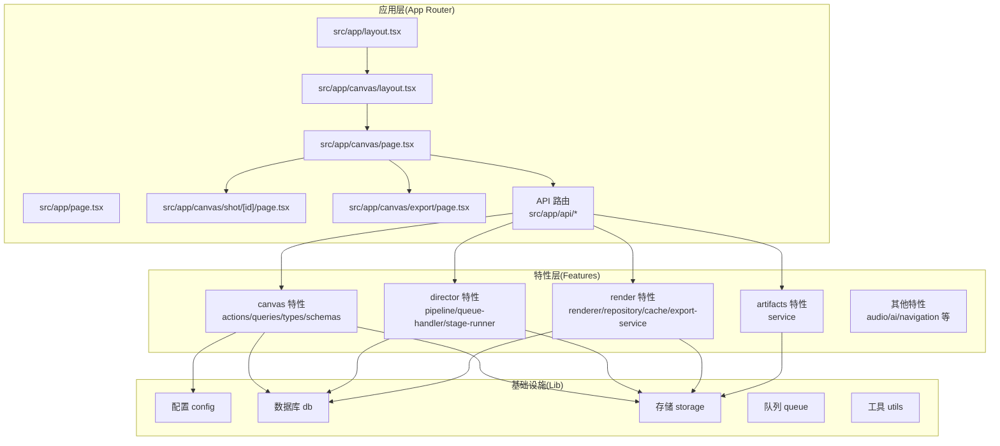
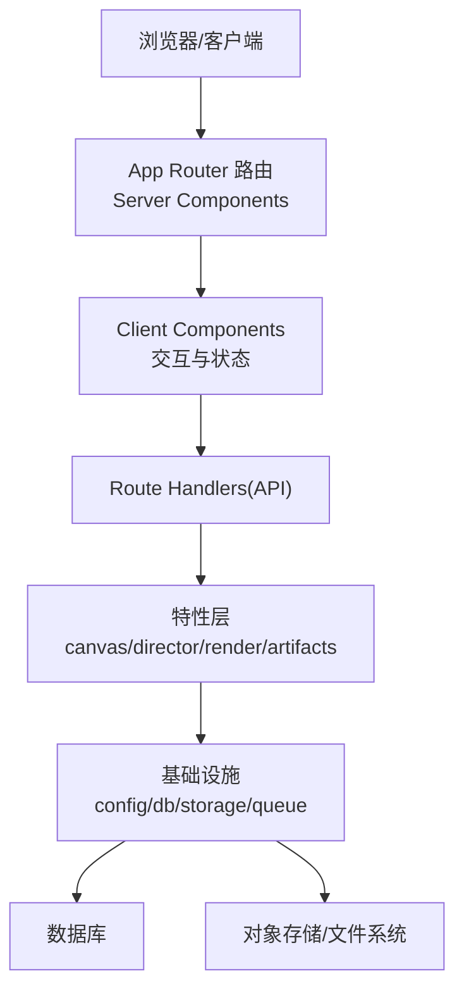
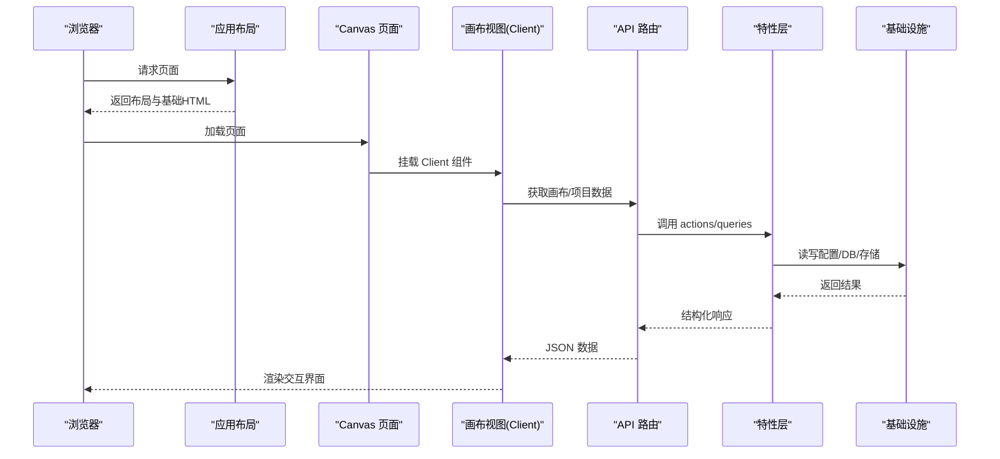
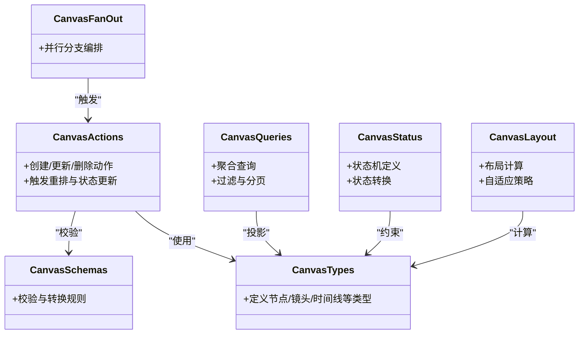
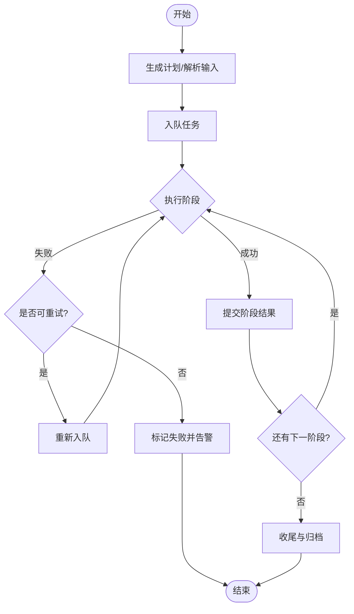
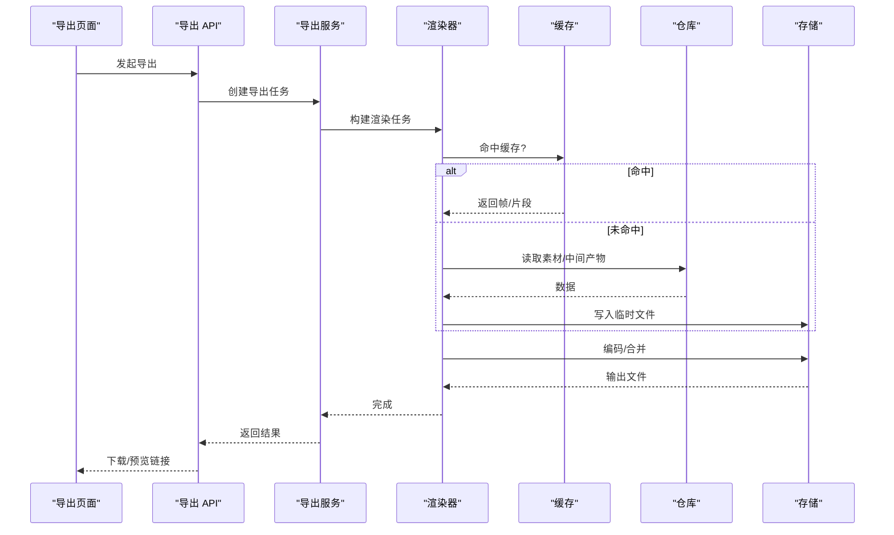
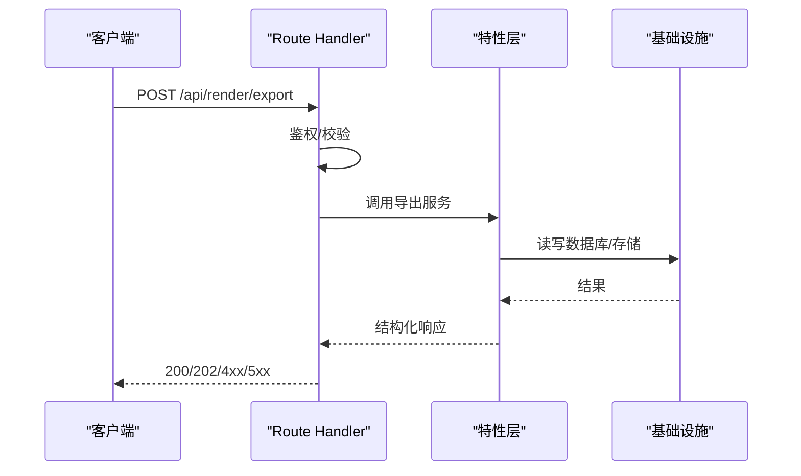
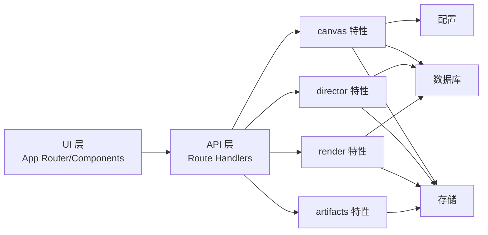

# 整体架构模式

<cite>
**本文引用的文件**   
- [src/app/layout.tsx](file://src/app/layout.tsx)
- [src/app/page.tsx](file://src/app/page.tsx)
- [src/app/canvas/layout.tsx](file://src/app/canvas/layout.tsx)
- [src/app/canvas/page.tsx](file://src/app/canvas/page.tsx)
- [src/app/canvas/canvas-view.tsx](file://src/app/canvas/canvas-view.tsx)
- [src/app/canvas/canvas-sidebar.tsx](file://src/app/canvas/canvas-sidebar.tsx)
- [src/app/canvas/canvas-inspector.tsx](file://src/app/canvas/canvas-inspector.tsx)
- [src/app/canvas/shot/[id]/page.tsx](file://src/app/canvas/shot/[id]/page.tsx)
- [src/app/canvas/export/page.tsx](file://src/app/canvas/export/page.tsx)
- [src/app/api/projects/route.ts](file://src/app/api/projects/route.ts)
- [src/app/api/artifacts/[id]/route.ts](file://src/app/api/artifacts/[id]/route.ts)
- [src/app/api/render/route.ts](file://src/app/api/render/route.ts)
- [src/app/api/render/export/route.ts](file://src/app/api/render/export/route.ts)
- [src/app/api/director/stage/route.ts](file://src/app/api/director/stage/route.ts)
- [src/app/api/jobs/[id]/route.ts](file://src/app/api/jobs/[id]/route.ts)
- [src/app/api/settings/route.ts](file://src/app/api/settings/route.ts)
- [src/features/canvas/actions.ts](file://src/features/canvas/actions.ts)
- [src/features/canvas/queries.ts](file://src/features/canvas/queries.ts)
- [src/features/canvas/types.ts](file://src/features/canvas/types.ts)
- [src/features/canvas/schemas.ts](file://src/features/canvas/schemas.ts)
- [src/features/canvas/status.ts](file://src/features/canvas/status.ts)
- [src/features/canvas/fan-out.ts](file://src/features/canvas/fan-out.ts)
- [src/features/canvas/layout.ts](file://src/features/canvas/layout.ts)
- [src/features/director/pipeline.ts](file://src/features/director/pipeline.ts)
- [src/features/director/queue-handler.ts](file://src/features/director/queue-handler.ts)
- [src/features/director/runtime-repository.ts](file://src/features/director/runtime-repository.ts)
- [src/features/director/session-store.ts](file://src/features/director/session-store.ts)
- [src/features/director/stage-runner.ts](file://src/features/director/stage-runner.ts)
- [src/features/director/stage-result-committer.ts](file://src/features/director/stage-result-committer.ts)
- [src/features/render/renderer.ts](file://src/features/render/renderer.ts)
- [src/features/render/repository.ts](file://src/features/render/repository.ts)
- [src/features/render/cache.ts](file://src/features/render/cache.ts)
- [src/features/render/export-service.ts](file://src/features/render/export-service.ts)
- [src/features/render/frame-sequence.ts](file://src/features/render/frame-sequence.ts)
- [src/features/render/concat.ts](file://src/features/render/concat.ts)
- [src/features/render/encode.ts](file://src/features/render/encode.ts)
- [src/features/render/queue-handler.ts](file://src/features/render/queue-handler.ts)
- [src/features/artifacts/service.ts](file://src/features/artifacts/service.ts)
- [src/lib/storage/index.ts](file://src/lib/storage/index.ts)
- [src/lib/db/index.ts](file://src/lib/db/index.ts)
- [src/lib/config/index.ts](file://src/lib/config/index.ts)
- [src/instrumentation.ts](file://src/instrumentation.ts)
</cite>

## 目录
1. [简介](#简介)
2. [项目结构](#项目结构)
3. [核心组件](#核心组件)
4. [架构总览](#架构总览)
5. [详细组件分析](#详细组件分析)
6. [依赖关系分析](#依赖关系分析)
7. [性能考量](#性能考量)
8. [故障排查指南](#故障排查指南)
9. [结论](#结论)
10. [附录](#附录)

## 简介
本文件面向 CodeVideoCanvas 的整体架构模式，聚焦模块化、分层与组件化设计；阐述 Next.js App Router 的架构优势以及 Server Components 与 Client Components 的职责划分；说明前后端分离策略与 API 驱动原则；并提供系统上下文图，展示用户界面、业务逻辑层、数据访问层的交互关系。同时给出微前端架构考虑与可扩展性设计建议，帮助团队在演进中保持高内聚、低耦合与可测试性。

## 项目结构
仓库采用“按领域特性 + 应用路由 + 共享 UI”的组织方式：
- src/app：Next.js App Router 路由与页面布局，包含服务端渲染的页面、布局与 API 路由（Route Handlers）。
- src/features：按领域划分的特性模块（如 canvas、director、render、artifacts、audio、ai 等），承载业务逻辑、类型与工具函数。
- src/components：跨特性的通用 UI 组件库，遵循 demo.test 组合验证模式。
- src/lib：横切能力（配置、数据库、存储、队列、布局、动画等）与公共工具。
- scripts：部署、开发、迁移与探索脚本。
- docs：规范、设计与运维文档。

图表来源
- [src/app/layout.tsx](file://src/app/layout.tsx)
- [src/app/canvas/layout.tsx](file://src/app/canvas/layout.tsx)
- [src/app/canvas/page.tsx](file://src/app/canvas/page.tsx)
- [src/app/canvas/shot/[id]/page.tsx](file://src/app/canvas/shot/[id]/page.tsx)
- [src/app/canvas/export/page.tsx](file://src/app/canvas/export/page.tsx)
- [src/app/api/projects/route.ts](file://src/app/api/projects/route.ts)
- [src/app/api/artifacts/[id]/route.ts](file://src/app/api/artifacts/[id]/route.ts)
- [src/app/api/render/route.ts](file://src/app/api/render/route.ts)
- [src/app/api/render/export/route.ts](file://src/app/api/render/export/route.ts)
- [src/app/api/director/stage/route.ts](file://src/app/api/director/stage/route.ts)
- [src/app/api/jobs/[id]/route.ts](file://src/app/api/jobs/[id]/route.ts)
- [src/app/api/settings/route.ts](file://src/app/api/settings/route.ts)
- [src/features/canvas/actions.ts](file://src/features/canvas/actions.ts)
- [src/features/canvas/queries.ts](file://src/features/canvas/queries.ts)
- [src/features/director/pipeline.ts](file://src/features/director/pipeline.ts)
- [src/features/director/queue-handler.ts](file://src/features/director/queue-handler.ts)
- [src/features/render/renderer.ts](file://src/features/render/renderer.ts)
- [src/features/render/repository.ts](file://src/features/render/repository.ts)
- [src/features/artifacts/service.ts](file://src/features/artifacts/service.ts)
- [src/lib/config/index.ts](file://src/lib/config/index.ts)
- [src/lib/db/index.ts](file://src/lib/db/index.ts)
- [src/lib/storage/index.ts](file://src/lib/storage/index.ts)

章节来源
- [src/app/layout.tsx](file://src/app/layout.tsx)
- [src/app/page.tsx](file://src/app/page.tsx)
- [src/app/canvas/layout.tsx](file://src/app/canvas/layout.tsx)
- [src/app/canvas/page.tsx](file://src/app/canvas/page.tsx)
- [src/app/canvas/shot/[id]/page.tsx](file://src/app/canvas/shot/[id]/page.tsx)
- [src/app/canvas/export/page.tsx](file://src/app/canvas/export/page.tsx)
- [src/app/api/projects/route.ts](file://src/app/api/projects/route.ts)
- [src/app/api/artifacts/[id]/route.ts](file://src/app/api/artifacts/[id]/route.ts)
- [src/app/api/render/route.ts](file://src/app/api/render/route.ts)
- [src/app/api/render/export/route.ts](file://src/app/api/render/export/route.ts)
- [src/app/api/director/stage/route.ts](file://src/app/api/director/stage/route.ts)
- [src/app/api/jobs/[id]/route.ts](file://src/app/api/jobs/[id]/route.ts)
- [src/app/api/settings/route.ts](file://src/app/api/settings/route.ts)
- [src/features/canvas/actions.ts](file://src/features/canvas/actions.ts)
- [src/features/canvas/queries.ts](file://src/features/canvas/queries.ts)
- [src/features/director/pipeline.ts](file://src/features/director/pipeline.ts)
- [src/features/director/queue-handler.ts](file://src/features/director/queue-handler.ts)
- [src/features/render/renderer.ts](file://src/features/render/renderer.ts)
- [src/features/render/repository.ts](file://src/features/render/repository.ts)
- [src/features/artifacts/service.ts](file://src/features/artifacts/service.ts)
- [src/lib/config/index.ts](file://src/lib/config/index.ts)
- [src/lib/db/index.ts](file://src/lib/db/index.ts)
- [src/lib/storage/index.ts](file://src/lib/storage/index.ts)

## 核心组件
- 应用壳与布局
  - 根布局与全局样式、错误边界、加载态由应用级 layout 管理，确保一致的导航与主题。
  - Canvas 子域提供独立布局，组织画布视图、侧边栏与检查器面板。
- 页面与路由
  - 首页、项目页、设置页、导出页、分镜详情页等通过 App Router 声明式路由组织。
  - 动态路由支持按 id 访问具体资源（如分镜详情）。
- API 路由
  - 基于 Route Handlers 暴露 RESTful 接口，统一鉴权、校验与错误处理。
  - 覆盖项目、制品、渲染、导演编排、任务状态与设置等能力。
- 特性模块
  - canvas：动作、查询、类型与模式定义，支撑画布交互与状态。
  - director：流水线、阶段执行、会话与运行时仓储、队列处理器。
  - render：渲染器、帧序列、编码、合并、缓存、导出服务与队列。
  - artifacts：制品生命周期与服务封装。
- 基础设施
  - 配置、数据库、存储、队列与工具函数为上层特性提供稳定契约。

章节来源
- [src/app/layout.tsx](file://src/app/layout.tsx)
- [src/app/canvas/layout.tsx](file://src/app/canvas/layout.tsx)
- [src/app/canvas/page.tsx](file://src/app/canvas/page.tsx)
- [src/app/canvas/shot/[id]/page.tsx](file://src/app/canvas/shot/[id]/page.tsx)
- [src/app/canvas/export/page.tsx](file://src/app/canvas/export/page.tsx)
- [src/app/api/projects/route.ts](file://src/app/api/projects/route.ts)
- [src/app/api/artifacts/[id]/route.ts](file://src/app/api/artifacts/[id]/route.ts)
- [src/app/api/render/route.ts](file://src/app/api/render/route.ts)
- [src/app/api/render/export/route.ts](file://src/app/api/render/export/route.ts)
- [src/app/api/director/stage/route.ts](file://src/app/api/director/stage/route.ts)
- [src/app/api/jobs/[id]/route.ts](file://src/app/api/jobs/[id]/route.ts)
- [src/app/api/settings/route.ts](file://src/app/api/settings/route.ts)
- [src/features/canvas/actions.ts](file://src/features/canvas/actions.ts)
- [src/features/canvas/queries.ts](file://src/features/canvas/queries.ts)
- [src/features/director/pipeline.ts](file://src/features/director/pipeline.ts)
- [src/features/director/queue-handler.ts](file://src/features/director/queue-handler.ts)
- [src/features/render/renderer.ts](file://src/features/render/renderer.ts)
- [src/features/render/repository.ts](file://src/features/render/repository.ts)
- [src/features/artifacts/service.ts](file://src/features/artifacts/service.ts)

## 架构总览
CodeVideoCanvas 采用“模块化 + 分层 + 组件化”的混合架构：
- 模块化：以 features 为边界，每个特性自包含类型、逻辑与测试，降低跨域耦合。
- 分层：UI 层（App Router 页面/组件）→ 特性层（业务编排）→ 基础设施层（配置/DB/存储/队列）。
- 组件化：通用 UI 组件位于 components，配合 demo 用例进行组合验证。
- API 驱动：所有持久化与外部调用均通过 API 路由暴露，客户端仅消费契约。

图表来源
- [src/app/layout.tsx](file://src/app/layout.tsx)
- [src/app/canvas/layout.tsx](file://src/app/canvas/layout.tsx)
- [src/app/canvas/page.tsx](file://src/app/canvas/page.tsx)
- [src/app/api/projects/route.ts](file://src/app/api/projects/route.ts)
- [src/app/api/render/route.ts](file://src/app/api/render/route.ts)
- [src/features/canvas/actions.ts](file://src/features/canvas/actions.ts)
- [src/features/director/pipeline.ts](file://src/features/director/pipeline.ts)
- [src/features/render/renderer.ts](file://src/features/render/renderer.ts)
- [src/lib/db/index.ts](file://src/lib/db/index.ts)
- [src/lib/storage/index.ts](file://src/lib/storage/index.ts)

## 详细组件分析

### 应用层与路由（App Router）
- 职责
  - 根布局负责全局样式、错误边界与加载态。
  - Canvas 子域布局组织画布视图、侧边栏与检查器，形成稳定的工作区骨架。
  - 页面组件作为入口，按需引入 Client Components 处理交互。
- Server vs Client
  - 页面与布局默认作为 Server Components，优先在服务端渲染数据与模板，减少首屏体积。
  - 需要事件、状态或浏览器 API 的部分下沉到 Client Components，并通过 props 与 API 路由通信。
- 路由与参数
  - 静态路由用于功能入口（首页、设置、导出等）。
  - 动态路由用于资源级页面（如分镜详情），结合 API 路由拉取数据。

图表来源
- [src/app/layout.tsx](file://src/app/layout.tsx)
- [src/app/canvas/layout.tsx](file://src/app/canvas/layout.tsx)
- [src/app/canvas/page.tsx](file://src/app/canvas/page.tsx)
- [src/app/canvas/canvas-view.tsx](file://src/app/canvas/canvas-view.tsx)
- [src/app/canvas/canvas-sidebar.tsx](file://src/app/canvas/canvas-sidebar.tsx)
- [src/app/canvas/canvas-inspector.tsx](file://src/app/canvas/canvas-inspector.tsx)
- [src/app/api/projects/route.ts](file://src/app/api/projects/route.ts)
- [src/features/canvas/actions.ts](file://src/features/canvas/actions.ts)
- [src/features/canvas/queries.ts](file://src/features/canvas/queries.ts)

章节来源
- [src/app/layout.tsx](file://src/app/layout.tsx)
- [src/app/canvas/layout.tsx](file://src/app/canvas/layout.tsx)
- [src/app/canvas/page.tsx](file://src/app/canvas/page.tsx)
- [src/app/canvas/canvas-view.tsx](file://src/app/canvas/canvas-view.tsx)
- [src/app/canvas/canvas-sidebar.tsx](file://src/app/canvas/canvas-sidebar.tsx)
- [src/app/canvas/canvas-inspector.tsx](file://src/app/canvas/canvas-inspector.tsx)

### 特性层：Canvas 领域
- 职责
  - 定义类型与模式（types/schemas），保证前后端数据结构一致。
  - 提供 actions（变更）与 queries（读取），将 UI 操作映射为领域行为。
  - 状态机与布局算法（status/layout/fan-out）解耦于 UI，便于测试与复用。
- 关键文件
  - 类型与模式：types.ts、schemas.ts
  - 动作与查询：actions.ts、queries.ts
  - 状态与布局：status.ts、layout.ts、fan-out.ts

图表来源
- [src/features/canvas/types.ts](file://src/features/canvas/types.ts)
- [src/features/canvas/schemas.ts](file://src/features/canvas/schemas.ts)
- [src/features/canvas/actions.ts](file://src/features/canvas/actions.ts)
- [src/features/canvas/queries.ts](file://src/features/canvas/queries.ts)
- [src/features/canvas/status.ts](file://src/features/canvas/status.ts)
- [src/features/canvas/layout.ts](file://src/features/canvas/layout.ts)
- [src/features/canvas/fan-out.ts](file://src/features/canvas/fan-out.ts)

章节来源
- [src/features/canvas/types.ts](file://src/features/canvas/types.ts)
- [src/features/canvas/schemas.ts](file://src/features/canvas/schemas.ts)
- [src/features/canvas/actions.ts](file://src/features/canvas/actions.ts)
- [src/features/canvas/queries.ts](file://src/features/canvas/queries.ts)
- [src/features/canvas/status.ts](file://src/features/canvas/status.ts)
- [src/features/canvas/layout.ts](file://src/features/canvas/layout.ts)
- [src/features/canvas/fan-out.ts](file://src/features/canvas/fan-out.ts)

### 特性层：Director 编排
- 职责
  - 定义导演流水线（pipeline），将多阶段任务编排为有序步骤。
  - 阶段运行器（stage-runner）与结果提交器（stage-result-committer）解耦阶段实现与持久化。
  - 会话存储（session-store）与运行时仓储（runtime-repository）管理中间态与产物。
  - 队列处理器（queue-handler）保障并发与重试。
- 关键文件
  - pipeline.ts、stage-runner.ts、stage-result-committer.ts
  - session-store.ts、runtime-repository.ts
  - queue-handler.ts

图表来源
- [src/features/director/pipeline.ts](file://src/features/director/pipeline.ts)
- [src/features/director/stage-runner.ts](file://src/features/director/stage-runner.ts)
- [src/features/director/stage-result-committer.ts](file://src/features/director/stage-result-committer.ts)
- [src/features/director/session-store.ts](file://src/features/director/session-store.ts)
- [src/features/director/runtime-repository.ts](file://src/features/director/runtime-repository.ts)
- [src/features/director/queue-handler.ts](file://src/features/director/queue-handler.ts)

章节来源
- [src/features/director/pipeline.ts](file://src/features/director/pipeline.ts)
- [src/features/director/stage-runner.ts](file://src/features/director/stage-runner.ts)
- [src/features/director/stage-result-committer.ts](file://src/features/director/stage-result-committer.ts)
- [src/features/director/session-store.ts](file://src/features/director/session-store.ts)
- [src/features/director/runtime-repository.ts](file://src/features/director/runtime-repository.ts)
- [src/features/director/queue-handler.ts](file://src/features/director/queue-handler.ts)

### 特性层：Render 渲染管线
- 职责
  - 渲染器（renderer）协调帧序列、编码与合并，输出最终媒体。
  - 仓库（repository）与缓存（cache）提升吞吐与稳定性。
  - 导出服务（export-service）对外暴露导出流程，队列处理器（queue-handler）管理并发。
- 关键文件
  - renderer.ts、repository.ts、cache.ts、export-service.ts
  - frame-sequence.ts、concat.ts、encode.ts、queue-handler.ts

图表来源
- [src/app/api/render/export/route.ts](file://src/app/api/render/export/route.ts)
- [src/features/render/export-service.ts](file://src/features/render/export-service.ts)
- [src/features/render/renderer.ts](file://src/features/render/renderer.ts)
- [src/features/render/cache.ts](file://src/features/render/cache.ts)
- [src/features/render/repository.ts](file://src/features/render/repository.ts)
- [src/features/render/frame-sequence.ts](file://src/features/render/frame-sequence.ts)
- [src/features/render/concat.ts](file://src/features/render/concat.ts)
- [src/features/render/encode.ts](file://src/features/render/encode.ts)
- [src/features/render/queue-handler.ts](file://src/features/render/queue-handler.ts)

章节来源
- [src/app/api/render/export/route.ts](file://src/app/api/render/export/route.ts)
- [src/features/render/export-service.ts](file://src/features/render/export-service.ts)
- [src/features/render/renderer.ts](file://src/features/render/renderer.ts)
- [src/features/render/cache.ts](file://src/features/render/cache.ts)
- [src/features/render/repository.ts](file://src/features/render/repository.ts)
- [src/features/render/frame-sequence.ts](file://src/features/render/frame-sequence.ts)
- [src/features/render/concat.ts](file://src/features/render/concat.ts)
- [src/features/render/encode.ts](file://src/features/render/encode.ts)
- [src/features/render/queue-handler.ts](file://src/features/render/queue-handler.ts)

### 特性层：Artifacts 制品
- 职责
  - 封装制品的生命周期（创建、查询、更新、删除），屏蔽底层存储细节。
- 关键文件
  - service.ts

章节来源
- [src/features/artifacts/service.ts](file://src/features/artifacts/service.ts)

### API 层（Route Handlers）
- 职责
  - 统一鉴权、参数校验、错误码与日志记录。
  - 将 HTTP 请求映射到特性层 actions/queries，返回结构化 JSON。
- 关键文件
  - projects、artifacts、render、director、jobs、settings 等路由。

图表来源
- [src/app/api/render/export/route.ts](file://src/app/api/render/export/route.ts)
- [src/app/api/projects/route.ts](file://src/app/api/projects/route.ts)
- [src/app/api/artifacts/[id]/route.ts](file://src/app/api/artifacts/[id]/route.ts)
- [src/app/api/render/route.ts](file://src/app/api/render/route.ts)
- [src/app/api/director/stage/route.ts](file://src/app/api/director/stage/route.ts)
- [src/app/api/jobs/[id]/route.ts](file://src/app/api/jobs/[id]/route.ts)
- [src/app/api/settings/route.ts](file://src/app/api/settings/route.ts)

章节来源
- [src/app/api/projects/route.ts](file://src/app/api/projects/route.ts)
- [src/app/api/artifacts/[id]/route.ts](file://src/app/api/artifacts/[id]/route.ts)
- [src/app/api/render/route.ts](file://src/app/api/render/route.ts)
- [src/app/api/render/export/route.ts](file://src/app/api/render/export/route.ts)
- [src/app/api/director/stage/route.ts](file://src/app/api/director/stage/route.ts)
- [src/app/api/jobs/[id]/route.ts](file://src/app/api/jobs/[id]/route.ts)
- [src/app/api/settings/route.ts](file://src/app/api/settings/route.ts)

### 基础设施层
- 配置：集中管理环境变量与默认值。
- 数据库：连接池、事务与迁移。
- 存储：对象存储/本地磁盘抽象。
- 队列：任务调度、重试与幂等。
- 工具：通用函数与格式化。

章节来源
- [src/lib/config/index.ts](file://src/lib/config/index.ts)
- [src/lib/db/index.ts](file://src/lib/db/index.ts)
- [src/lib/storage/index.ts](file://src/lib/storage/index.ts)

## 依赖关系分析
- 松耦合
  - 特性层不直接依赖 UI 层，UI 通过 API 路由与特性交互。
  - 特性之间通过明确的类型与模式契约协作，避免循环依赖。
- 内聚性
  - 每个特性自包含类型、逻辑与测试，便于独立演进。
- 外部依赖
  - 数据库与对象存储通过 lib 抽象，替换成本低。
  - 队列与缓存可插拔，便于横向扩展。

图表来源
- [src/app/canvas/page.tsx](file://src/app/canvas/page.tsx)
- [src/app/api/projects/route.ts](file://src/app/api/projects/route.ts)
- [src/features/canvas/actions.ts](file://src/features/canvas/actions.ts)
- [src/features/director/pipeline.ts](file://src/features/director/pipeline.ts)
- [src/features/render/renderer.ts](file://src/features/render/renderer.ts)
- [src/features/artifacts/service.ts](file://src/features/artifacts/service.ts)
- [src/lib/config/index.ts](file://src/lib/config/index.ts)
- [src/lib/db/index.ts](file://src/lib/db/index.ts)
- [src/lib/storage/index.ts](file://src/lib/storage/index.ts)

章节来源
- [src/app/canvas/page.tsx](file://src/app/canvas/page.tsx)
- [src/app/api/projects/route.ts](file://src/app/api/projects/route.ts)
- [src/features/canvas/actions.ts](file://src/features/canvas/actions.ts)
- [src/features/director/pipeline.ts](file://src/features/director/pipeline.ts)
- [src/features/render/renderer.ts](file://src/features/render/renderer.ts)
- [src/features/artifacts/service.ts](file://src/features/artifacts/service.ts)
- [src/lib/config/index.ts](file://src/lib/config/index.ts)
- [src/lib/db/index.ts](file://src/lib/db/index.ts)
- [src/lib/storage/index.ts](file://src/lib/storage/index.ts)

## 性能考量
- 渲染策略
  - 优先使用 Server Components 减少客户端体积，仅在必要时启用 Client Components。
  - 对大列表与复杂画布区域采用虚拟滚动与增量更新。
- 缓存与去重
  - 利用渲染缓存与制品缓存减少重复计算与 IO。
  - 对热点数据实施短 TTL 缓存与失效策略。
- 并发与背压
  - 队列处理器限制并发度，避免资源争用。
  - 长耗时任务异步化，返回任务 ID 供轮询或推送。
- 传输优化
  - 压缩与分块传输，按需加载资源。
  - 图片/视频采用流式传输与懒加载。

[本节为通用指导，无需特定文件引用]

## 故障排查指南
- 常见问题定位
  - API 层：检查鉴权、参数校验与错误码；查看请求体与响应体差异。
  - 特性层：核对类型与模式一致性；关注状态机非法转换。
  - 基础设施：确认数据库连接、存储权限与队列消费者健康。
- 诊断手段
  - 使用 instrumentation 注入链路追踪与指标上报。
  - 针对关键路径添加结构化日志与采样率控制。
  - 对导出与渲染任务增加断点续传与中间产物校验。

章节来源
- [src/instrumentation.ts](file://src/instrumentation.ts)

## 结论
CodeVideoCanvas 通过模块化、分层与组件化设计，结合 Next.js App Router 的服务端渲染与 API 驱动原则，实现了清晰的职责边界与良好的可扩展性。未来可在以下方向持续演进：
- 微前端：将大型特性拆分为独立子应用，通过路由网关集成。
- 可观测性：完善指标、日志与追踪，建立容量与质量基线。
- 弹性与容错：增强重试、熔断与降级策略，提高系统韧性。

[本节为总结性内容，无需特定文件引用]

## 附录
- 术语
  - Server Components：在服务端执行的 React 组件，适合数据获取与模板渲染。
  - Client Components：在浏览器执行的 React 组件，适合交互与状态管理。
  - Route Handlers：Next.js 提供的服务端 API 路由实现。
  - 特性（Feature）：围绕单一业务能力组织的代码集合。

[本节为概念性内容，无需特定文件引用]