# 架构设计

<cite>
**本文引用的文件**   
- [README.md](file://README.md)
- [package.json](file://package.json)
- [next.config.ts](file://next.config.ts)
- [src/app/layout.tsx](file://src/app/layout.tsx)
- [src/app/page.tsx](file://src/app/page.tsx)
- [src/app/canvas/layout.tsx](file://src/app/canvas/layout.tsx)
- [src/app/canvas/page.tsx](file://src/app/canvas/page.tsx)
- [src/app/canvas/canvas-view.tsx](file://src/app/canvas/canvas-view.tsx)
- [src/app/canvas/canvas-sidebar.tsx](file://src/app/canvas/canvas-sidebar.tsx)
- [src/app/canvas/canvas-inspector.tsx](file://src/app/canvas/canvas-inspector.tsx)
- [src/app/canvas/flow-elements.tsx](file://src/app/canvas/flow-elements.tsx)
- [src/app/canvas/export/page.tsx](file://src/app/canvas/export/page.tsx)
- [src/app/canvas/export/export-api.ts](file://src/app/canvas/export/export-api.ts)
- [src/app/canvas/export/export-workspace.tsx](file://src/app/canvas/export/export-workspace.tsx)
- [src/app/canvas/shot/[id]/page.tsx](file://src/app/canvas/shot/[id]/page.tsx)
- [src/app/canvas/shot/[id]/shot-detail.tsx](file://src/app/canvas/shot/[id]/shot-detail.tsx)
- [src/app/canvas/shot/[id]/shot-panels.tsx](file://src/app/canvas/shot/[id]/shot-panels.tsx)
- [src/app/api/director/stage/route.ts](file://src/app/api/director/stage/route.ts)
- [src/app/api/render/route.ts](file://src/app/api/render/route.ts)
- [src/app/api/render/export/route.ts](file://src/app/api/render/export/route.ts)
- [src/app/api/artifacts/[id]/route.ts](file://src/app/api/artifacts/[id]/route.ts)
- [src/app/api/projects/route.ts](file://src/app/api/projects/route.ts)
- [src/app/api/settings/route.ts](file://src/app/api/settings/route.ts)
- [src/features/director/index.ts](file://src/features/director/index.ts)
- [src/features/director/pipeline.ts](file://src/features/director/pipeline.ts)
- [src/features/director/pi-session.ts](file://src/features/director/pi-session.ts)
- [src/features/director/stage-runner.ts](file://src/features/director/stage-runner.ts)
- [src/features/director/session-store.ts](file://src/features/director/session-store.ts)
- [src/features/director/runtime-repository.ts](file://src/features/director/runtime-repository.ts)
- [src/features/director/stage-result.ts](file://src/features/director/stage-result.ts)
- [src/features/director/stage-prompt.ts](file://src/features/director/stage-prompt.ts)
- [src/features/director/tools/write-artifact.ts](file://src/features/director/tools/write-artifact.ts)
- [src/features/director/tools/validate-shot-plan.ts](file://src/features/director/tools/validate-shot-plan.ts)
- [src/features/director/tools/check-determinism.ts](file://src/features/director/tools/check-determinism.ts)
- [src/features/director/schemas/ingest.ts](file://src/features/director/schemas/ingest.ts)
- [src/features/director/schemas/shot-plan.ts](file://src/features/director/schemas/shot-plan.ts)
- [src/features/director/prompts/direct.ts](file://src/features/director/prompts/direct.ts)
- [src/features/director/prompts/fabricate.ts](file://src/features/director/prompts/fabricate.ts)
- [src/features/director/prompts/assemble.ts](file://src/features/director/prompts/assemble.ts)
- [src/features/director/prompts/finalize.ts](file://src/features/director/prompts/finalize.ts)
- [src/features/director/prompts/ingest.ts](file://src/features/director/prompts/ingest.ts)
- [src/features/director/prompts/shot-spec.ts](file://src/features/director/prompts/shot-spec.ts)
- [src/features/render/renderer.ts](file://src/features/render/renderer.ts)
- [src/features/render/repository.ts](file://src/features/render/repository.ts)
- [src/features/render/cache.ts](file://src/features/render/cache.ts)
- [src/features/render/encode.ts](file://src/features/render/encode.ts)
- [src/features/render/frame-capture.ts](file://src/features/render/frame-capture.ts)
- [src/features/render/frame-sequence.ts](file://src/features/render/frame-sequence.ts)
- [src/features/render/concat.ts](file://src/features/render/concat.ts)
- [src/features/render/export-service.ts](file://src/features/render/export-service.ts)
- [src/features/render/types.ts](file://src/features/render/types.ts)
- [src/features/render/queue-handler.ts](file://src/features/render/queue-handler.ts)
- [src/features/ai/index.ts](file://src/features/ai/index.ts)
- [src/features/ai/stepfun-adapter.ts](file://src/features/ai/stepfun-adapter.ts)
- [src/features/ai/types.ts](file://src/features/ai/types.ts)
- [src/features/ai/schemas.ts](file://src/features/ai/schemas.ts)
- [src/features/artifacts/service.ts](file://src/features/artifacts/service.ts)
- [src/features/audio/index.ts](file://src/features/audio/index.ts)
- [src/features/audio/types.ts](file://src/features/audio/types.ts)
- [src/features/audio/score.ts](file://src/features/audio/score.ts)
- [src/features/audio/sfx.ts](file://src/features/audio/sfx.ts)
- [src/features/audio/subtitle.ts](file://src/features/audio/subtitle.ts)
- [src/features/audio/voiceover.ts](file://src/features/audio/voiceover.ts)
- [src/features/canvas/actions.ts](file://src/features/canvas/actions.ts)
- [src/features/canvas/queries.ts](file://src/features/canvas/queries.ts)
- [src/features/canvas/layout.ts](file://src/features/canvas/layout.ts)
- [src/features/canvas/status.ts](file://src/features/canvas/status.ts)
- [src/features/canvas/types.ts](file://src/features/canvas/types.ts)
- [src/features/canvas/fan-out.ts](file://src/features/canvas/fan-out.ts)
- [src/components/ui/node/stage-node.tsx](file://src/components/ui/node/stage-node.tsx)
- [src/components/ui/node/shot-node.tsx](file://src/components/ui/node/shot-node.tsx)
- [src/components/ui/node/audio-node.tsx](file://src/components/ui/node/audio-node.tsx)
- [src/components/ui/node/export-node.tsx](file://src/components/ui/node/export-node.tsx)
- [src/components/ui/node/types.ts](file://src/components/ui/node/types.ts)
- [src/lib/motion](file://src/lib/motion)
</cite>

## 更新摘要
**所做更改**
- 新增 MASTER-GOAL-CONTRACT 统一目标框架章节，说明 N0-N7 任务整合的架构意义
- 更新项目结构部分，反映统一架构方向的变更
- 增强核心组件分析，强调统一目标框架对系统设计的指导作用
- 完善技术决策与权衡章节，包含统一目标框架的设计考量

## 目录
1. [简介](#简介)
2. [项目结构](#项目结构)
3. [MASTER-GOAL-CONTRACT 统一目标框架](#master-goal-contract-统一目标框架)
4. [核心组件](#核心组件)
5. [架构总览](#架构总览)
6. [详细组件分析](#详细组件分析)
7. [React UI 层动画规范](#react-ui-层动画规范)
8. [依赖关系分析](#依赖关系分析)
9. [性能考量](#性能考量)
10. [故障排查指南](#故障排查指南)
11. [结论](#结论)
12. [附录](#附录)

## 简介
本架构设计文档面向 CodeVideoCanvas，围绕模块化、分层与组件化设计模式，系统阐述导演系统、渲染引擎与 AI 服务集成的职责边界与交互关系。文档同时覆盖数据流设计与状态管理策略，解释关键的技术决策与权衡，并提供系统上下文图与组件分解图，帮助读者快速理解整体结构与关键集成点。

**更新** 新增 MASTER-GOAL-CONTRACT 统一目标框架，将原有的 N0-N7 分散任务整合为统一的架构指导原则，为 CodeVideoCanvas 平台建立一致的发展方向和设计标准。

## 项目结构
CodeVideoCanvas 基于 Next.js 应用组织代码，采用"功能域 + 共享 UI + API 路由"的分层与模块化结构，并遵循 MASTER-GOAL-CONTRACT 统一目标框架的指导：
- 应用层（app）：页面、布局与 API 路由，负责用户界面与外部请求入口。
- 功能域（features）：按业务领域划分模块，如 director（导演）、render（渲染）、ai（AI 适配）、artifacts（制品）、audio（音频）、canvas（画布）。
- 共享 UI（components）：通用 UI 组件与节点类型，支撑画布可视化与交互。
- 工具库（lib）：配置、数据库、确定性校验、GSAP 动画、队列、存储等横切能力。
- 脚本（scripts）：部署、开发、设置与实验性脚本。

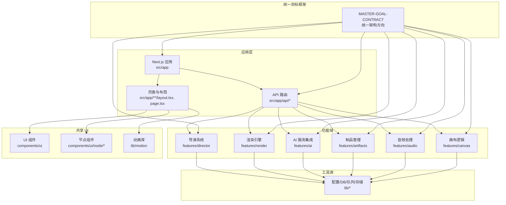

**图表来源**
- [src/app/layout.tsx](file://src/app/layout.tsx)
- [src/app/page.tsx](file://src/app/page.tsx)
- [src/app/canvas/layout.tsx](file://src/app/canvas/layout.tsx)
- [src/app/canvas/page.tsx](file://src/app/canvas/page.tsx)
- [src/app/api/director/stage/route.ts](file://src/app/api/director/stage/route.ts)
- [src/app/api/render/route.ts](file://src/app/api/render/route.ts)
- [src/app/api/render/export/route.ts](file://src/app/api/render/export/route.ts)
- [src/app/api/artifacts/[id]/route.ts](file://src/app/api/artifacts/[id]/route.ts)
- [src/app/api/projects/route.ts](file://src/app/api/projects/route.ts)
- [src/app/api/settings/route.ts](file://src/app/api/settings/route.ts)
- [src/features/director/index.ts](file://src/features/director/index.ts)
- [src/features/render/renderer.ts](file://src/features/render/renderer.ts)
- [src/features/ai/index.ts](file://src/features/ai/index.ts)
- [src/features/artifacts/service.ts](file://src/features/artifacts/service.ts)
- [src/features/audio/index.ts](file://src/features/audio/index.ts)
- [src/features/canvas/actions.ts](file://src/features/canvas/actions.ts)
- [src/components/ui/node/stage-node.tsx](file://src/components/ui/node/stage-node.tsx)
- [src/components/ui/node/shot-node.tsx](file://src/components/ui/node/shot-node.tsx)
- [src/components/ui/node/audio-node.tsx](file://src/components/ui/node/audio-node.tsx)
- [src/components/ui/node/export-node.tsx](file://src/components/ui/node/export-node.tsx)

**章节来源**
- [README.md](file://README.md)
- [package.json](file://package.json)
- [next.config.ts](file://next.config.ts)
- [src/app/layout.tsx](file://src/app/layout.tsx)
- [src/app/page.tsx](file://src/app/page.tsx)
- [src/app/canvas/layout.tsx](file://src/app/canvas/layout.tsx)
- [src/app/canvas/page.tsx](file://src/app/canvas/page.tsx)

## MASTER-GOAL-CONTRACT 统一目标框架

### 框架概述
MASTER-GOAL-CONTRACT 是 CodeVideoCanvas 平台的统一架构指导框架，将原本分散的 N0-N7 任务整合为一个协调一致的架构方向。该框架确保所有功能模块在统一的目标和契约下协同工作，提供一致的开发体验和系统集成标准。

### 核心原则
- **统一目标导向**：所有功能模块围绕共同的业务目标进行设计和实现
- **契约驱动开发**：通过明确的接口契约确保模块间的松耦合和高内聚
- **渐进式演进**：支持从基础功能到高级特性的平滑升级路径
- **质量内建**：将可测试性、可维护性和可扩展性融入架构设计

### 任务整合映射
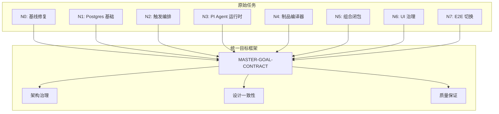

**图表来源**
- [docs/issues/refactor-v3/issue-n0-baseline-and-bleeding-fixes.md](file://docs/issues/refactor-v3/issue-n0-baseline-and-bleeding-fixes.md)
- [docs/issues/refactor-v3/issue-n1-postgres-foundation-and-spikes.md](file://docs/issues/refactor-v3/issue-n1-postgres-foundation-and-spikes.md)
- [docs/issues/refactor-v3/issue-n2-trigger-orchestration.md](file://docs/issues/refactor-v3/issue-n2-trigger-orchestration.md)
- [docs/issues/refactor-v3/issue-n3-pi-agent-runtime.md](file://docs/issues/refactor-v3/issue-n3-pi-agent-runtime.md)
- [docs/issues/refactor-v3/issue-n4-artifact-compiler-hyperframes.md](file://docs/issues/refactor-v3/issue-n4-artifact-compiler-hyperframes.md)
- [docs/issues/refactor-v3/issue-n5-compose-closure.md](file://docs/issues/refactor-v3/issue-n5-compose-closure.md)
- [docs/issues/refactor-v3/issue-n6-ui-truth-and-governance.md](file://docs/issues/refactor-v3/issue-n6-ui-truth-and-governance.md)
- [docs/issues/refactor-v3/issue-n7-e2e-and-cutover.md](file://docs/issues/refactor-v3/issue-n7-e2e-and-cutover.md)

### 架构影响
统一目标框架对现有架构产生了以下重要影响：
- **标准化接口**：所有功能模块遵循统一的 API 设计规范
- **一致性状态管理**：跨模块的状态同步和数据一致性得到保障
- **统一错误处理**：标准化的错误传播和恢复机制
- **可观测性增强**：统一的日志、监控和调试接口

**更新** 新增 MASTER-GOAL-CONTRACT 统一目标框架章节，详细说明 N0-N7 任务整合的架构意义和对系统设计的影响。

## 核心组件
- 导演系统（Director）
  - 职责：编排多阶段流水线（摄入、规划、制作、组装、收尾），维护会话与运行时仓库，驱动提示词生成与结果提交，提供队列处理器以异步执行任务。
  - 关键文件：pipeline、stage-runner、session-store、runtime-repository、stage-result、stage-prompt、tools/*、schemas/*、prompts/*。
- 渲染引擎（Render）
  - 职责：将镜头序列渲染为帧序列，进行编码与拼接，提供缓存与导出服务，支持队列化处理。
  - 关键文件：renderer、repository、cache、encode、frame-capture、frame-sequence、concat、export-service、types、queue-handler。
- AI 服务集成（AI）
  - 职责：封装第三方 AI 适配器（如 StepFun），定义输入输出 schema，统一调用接口。
  - 关键文件：index、stepfun-adapter、types、schemas。
- 制品与音频（Artifacts & Audio）
  - 职责：管理中间产物与最终制品；提供音频评分、音效、字幕、配音等处理能力。
  - 关键文件：artifacts/service、audio/*。
- 画布与 UI（Canvas & UI）
  - 职责：提供画布视图、侧边栏、检查器、流程元素与节点组件，承载用户交互与可视化。
  - 关键文件：canvas-view、canvas-sidebar、canvas-inspector、flow-elements、node/*。
- 动画库（Motion）
  - 职责：提供统一的动画抽象层，封装 motion/react 使用规范，确保动画的一致性和可访问性。
  - 关键文件：lib/motion 目录下的动画工具函数和配置。

**更新** 所有核心组件现在都遵循 MASTER-GOAL-CONTRACT 统一目标框架的设计原则，确保架构一致性和可维护性。

**章节来源**
- [src/features/director/index.ts](file://src/features/director/index.ts)
- [src/features/director/pipeline.ts](file://src/features/director/pipeline.ts)
- [src/features/director/stage-runner.ts](file://src/features/director/stage-runner.ts)
- [src/features/director/session-store.ts](file://src/features/director/session-store.ts)
- [src/features/director/runtime-repository.ts](file://src/features/director/runtime-repository.ts)
- [src/features/director/stage-result.ts](file://src/features/director/stage-result.ts)
- [src/features/director/stage-prompt.ts](file://src/features/director/stage-prompt.ts)
- [src/features/director/tools/write-artifact.ts](file://src/features/director/tools/write-artifact.ts)
- [src/features/director/tools/validate-shot-plan.ts](file://src/features/director/tools/validate-shot-plan.ts)
- [src/features/director/tools/check-determinism.ts](file://src/features/director/tools/check-determinism.ts)
- [src/features/director/schemas/ingest.ts](file://src/features/director/schemas/ingest.ts)
- [src/features/director/schemas/shot-plan.ts](file://src/features/director/schemas/shot-plan.ts)
- [src/features/director/prompts/direct.ts](file://src/features/director/prompts/direct.ts)
- [src/features/director/prompts/fabricate.ts](file://src/features/director/prompts/fabricate.ts)
- [src/features/director/prompts/assemble.ts](file://src/features/director/prompts/assemble.ts)
- [src/features/director/prompts/finalize.ts](file://src/features/director/prompts/finalize.ts)
- [src/features/director/prompts/ingest.ts](file://src/features/director/prompts/ingest.ts)
- [src/features/director/prompts/shot-spec.ts](file://src/features/director/prompts/shot-spec.ts)
- [src/features/render/renderer.ts](file://src/features/render/renderer.ts)
- [src/features/render/repository.ts](file://src/features/render/repository.ts)
- [src/features/render/cache.ts](file://src/features/render/cache.ts)
- [src/features/render/encode.ts](file://src/features/render/encode.ts)
- [src/features/render/frame-capture.ts](file://src/features/render/frame-capture.ts)
- [src/features/render/frame-sequence.ts](file://src/features/render/frame-sequence.ts)
- [src/features/render/concat.ts](file://src/features/render/concat.ts)
- [src/features/render/export-service.ts](file://src/features/render/export-service.ts)
- [src/features/render/types.ts](file://src/features/render/types.ts)
- [src/features/render/queue-handler.ts](file://src/features/render/queue-handler.ts)
- [src/features/ai/index.ts](file://src/features/ai/index.ts)
- [src/features/ai/stepfun-adapter.ts](file://src/features/ai/stepfun-adapter.ts)
- [src/features/ai/types.ts](file://src/features/ai/types.ts)
- [src/features/ai/schemas.ts](file://src/features/ai/schemas.ts)
- [src/features/artifacts/service.ts](file://src/features/artifacts/service.ts)
- [src/features/audio/index.ts](file://src/features/audio/index.ts)
- [src/features/audio/types.ts](file://src/features/audio/types.ts)
- [src/features/audio/score.ts](file://src/features/audio/score.ts)
- [src/features/audio/sfx.ts](file://src/features/audio/sfx.ts)
- [src/features/audio/subtitle.ts](file://src/features/audio/subtitle.ts)
- [src/features/audio/voiceover.ts](file://src/features/audio/voiceover.ts)
- [src/features/canvas/actions.ts](file://src/features/canvas/actions.ts)
- [src/features/canvas/queries.ts](file://src/features/canvas/queries.ts)
- [src/features/canvas/layout.ts](file://src/features/canvas/layout.ts)
- [src/features/canvas/status.ts](file://src/features/canvas/status.ts)
- [src/features/canvas/types.ts](file://src/features/canvas/types.ts)
- [src/features/canvas/fan-out.ts](file://src/features/canvas/fan-out.ts)
- [src/app/canvas/canvas-view.tsx](file://src/app/canvas/canvas-view.tsx)
- [src/app/canvas/canvas-sidebar.tsx](file://src/app/canvas/canvas-sidebar.tsx)
- [src/app/canvas/canvas-inspector.tsx](file://src/app/canvas/canvas-inspector.tsx)
- [src/app/canvas/flow-elements.tsx](file://src/app/canvas/flow-elements.tsx)
- [src/components/ui/node/stage-node.tsx](file://src/components/ui/node/stage-node.tsx)
- [src/components/ui/node/shot-node.tsx](file://src/components/ui/node/shot-node.tsx)
- [src/components/ui/node/audio-node.tsx](file://src/components/ui/node/audio-node.tsx)
- [src/components/ui/node/export-node.tsx](file://src/components/ui/node/export-node.tsx)

## 架构总览
系统采用分层与模块化结合的设计，并遵循 MASTER-GOAL-CONTRACT 统一目标框架的指导原则：
- 表现层（App）：Next.js 页面与布局，承载画布、导出、项目与设置等界面。
- 控制层（API 路由）：暴露 REST 风格接口，协调各功能域完成业务操作。
- 领域层（Features）：导演、渲染、AI、制品、音频、画布等功能域实现核心逻辑。
- 基础设施层（Lib）：配置、数据库、队列、存储、确定性校验、动画等横切能力。
- 统一目标框架（Master Goal）：贯穿所有层次的架构指导和契约约束。

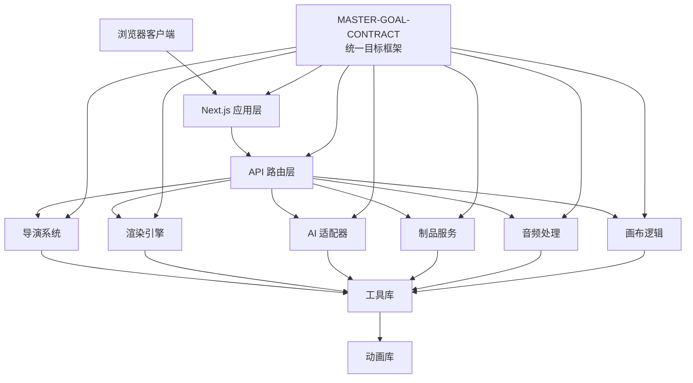

**图表来源**
- [src/app/api/director/stage/route.ts](file://src/app/api/director/stage/route.ts)
- [src/app/api/render/route.ts](file://src/app/api/render/route.ts)
- [src/app/api/render/export/route.ts](file://src/app/api/render/export/route.ts)
- [src/app/api/artifacts/[id]/route.ts](file://src/app/api/artifacts/[id]/route.ts)
- [src/app/api/projects/route.ts](file://src/app/api/projects/route.ts)
- [src/app/api/settings/route.ts](file://src/app/api/settings/route.ts)
- [src/features/director/index.ts](file://src/features/director/index.ts)
- [src/features/render/renderer.ts](file://src/features/render/renderer.ts)
- [src/features/ai/index.ts](file://src/features/ai/index.ts)
- [src/features/artifacts/service.ts](file://src/features/artifacts/service.ts)
- [src/features/audio/index.ts](file://src/features/audio/index.ts)
- [src/features/canvas/actions.ts](file://src/features/canvas/actions.ts)

## 详细组件分析

### 导演系统（Director）
导演系统是多阶段 AI 驱动的流水线编排器，负责从素材摄入到成片产出的全流程控制，并遵循统一目标框架的契约规范。

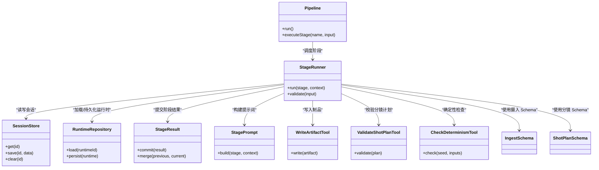

**图表来源**
- [src/features/director/pipeline.ts](file://src/features/director/pipeline.ts)
- [src/features/director/stage-runner.ts](file://src/features/director/stage-runner.ts)
- [src/features/director/session-store.ts](file://src/features/director/session-store.ts)
- [src/features/director/runtime-repository.ts](file://src/features/director/runtime-repository.ts)
- [src/features/director/stage-result.ts](file://src/features/director/stage-result.ts)
- [src/features/director/stage-prompt.ts](file://src/features/director/stage-prompt.ts)
- [src/features/director/tools/write-artifact.ts](file://src/features/director/tools/write-artifact.ts)
- [src/features/director/tools/validate-shot-plan.ts](file://src/features/director/tools/validate-shot-plan.ts)
- [src/features/director/tools/check-determinism.ts](file://src/features/director/tools/check-determinism.ts)
- [src/features/director/schemas/ingest.ts](file://src/features/director/schemas/ingest.ts)
- [src/features/director/schemas/shot-plan.ts](file://src/features/director/schemas/shot-plan.ts)

**章节来源**
- [src/features/director/index.ts](file://src/features/director/index.ts)
- [src/features/director/pipeline.ts](file://src/features/director/pipeline.ts)
- [src/features/director/stage-runner.ts](file://src/features/director/stage-runner.ts)
- [src/features/director/session-store.ts](file://src/features/director/session-store.ts)
- [src/features/director/runtime-repository.ts](file://src/features/director/runtime-repository.ts)
- [src/features/director/stage-result.ts](file://src/features/director/stage-result.ts)
- [src/features/director/stage-prompt.ts](file://src/features/director/stage-prompt.ts)
- [src/features/director/tools/write-artifact.ts](file://src/features/director/tools/write-artifact.ts)
- [src/features/director/tools/validate-shot-plan.ts](file://src/features/director/tools/validate-shot-plan.ts)
- [src/features/director/tools/check-determinism.ts](file://src/features/director/tools/check-determinism.ts)
- [src/features/director/schemas/ingest.ts](file://src/features/director/schemas/ingest.ts)
- [src/features/director/schemas/shot-plan.ts](file://src/features/director/schemas/shot-plan.ts)
- [src/features/director/prompts/direct.ts](file://src/features/director/prompts/direct.ts)
- [src/features/director/prompts/fabricate.ts](file://src/features/director/prompts/fabricate.ts)
- [src/features/director/prompts/assemble.ts](file://src/features/director/prompts/assemble.ts)
- [src/features/director/prompts/finalize.ts](file://src/features/director/prompts/finalize.ts)
- [src/features/director/prompts/ingest.ts](file://src/features/director/prompts/ingest.ts)
- [src/features/director/prompts/shot-spec.ts](file://src/features/director/prompts/shot-spec.ts)

#### 导演阶段执行时序
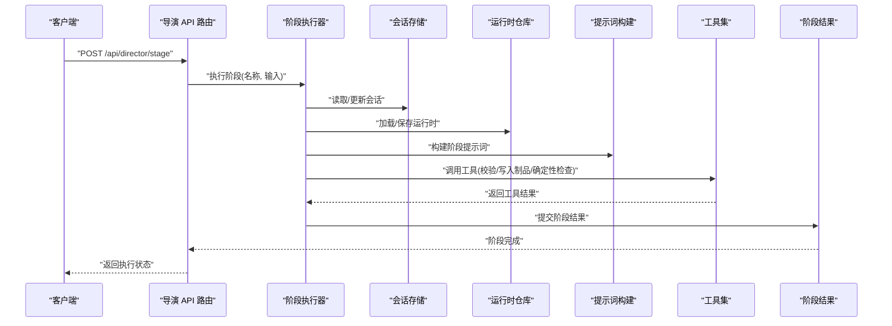

**图表来源**
- [src/app/api/director/stage/route.ts](file://src/app/api/director/stage/route.ts)
- [src/features/director/stage-runner.ts](file://src/features/director/stage-runner.ts)
- [src/features/director/session-store.ts](file://src/features/director/session-store.ts)
- [src/features/director/runtime-repository.ts](file://src/features/director/runtime-repository.ts)
- [src/features/director/stage-prompt.ts](file://src/features/director/stage-prompt.ts)
- [src/features/director/tools/write-artifact.ts](file://src/features/director/tools/write-artifact.ts)
- [src/features/director/tools/validate-shot-plan.ts](file://src/features/director/tools/validate-shot-plan.ts)
- [src/features/director/tools/check-determinism.ts](file://src/features/director/tools/check-determinism.ts)
- [src/features/director/stage-result.ts](file://src/features/director/stage-result.ts)

### 渲染引擎（Render）
渲染引擎负责将镜头序列转换为可导出的媒体内容，包含帧捕获、编码、拼接与缓存策略，遵循统一目标框架的性能和质量要求。

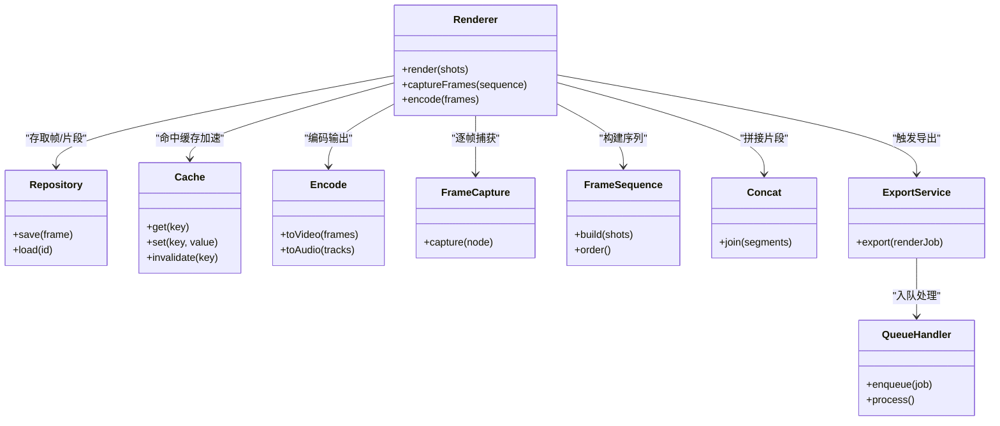

**图表来源**
- [src/features/render/renderer.ts](file://src/features/render/renderer.ts)
- [src/features/render/repository.ts](file://src/features/render/repository.ts)
- [src/features/render/cache.ts](file://src/features/render/cache.ts)
- [src/features/render/encode.ts](file://src/features/render/encode.ts)
- [src/features/render/frame-capture.ts](file://src/features/render/frame-capture.ts)
- [src/features/render/frame-sequence.ts](file://src/features/render/frame-sequence.ts)
- [src/features/render/concat.ts](file://src/features/render/concat.ts)
- [src/features/render/export-service.ts](file://src/features/render/export-service.ts)
- [src/features/render/queue-handler.ts](file://src/features/render/queue-handler.ts)

**章节来源**
- [src/features/render/renderer.ts](file://src/features/render/renderer.ts)
- [src/features/render/repository.ts](file://src/features/render/repository.ts)
- [src/features/render/cache.ts](file://src/features/render/cache.ts)
- [src/features/render/encode.ts](file://src/features/render/encode.ts)
- [src/features/render/frame-capture.ts](file://src/features/render/frame-capture.ts)
- [src/features/render/frame-sequence.ts](file://src/features/render/frame-sequence.ts)
- [src/features/render/concat.ts](file://src/features/render/concat.ts)
- [src/features/render/export-service.ts](file://src/features/render/export-service.ts)
- [src/features/render/types.ts](file://src/features/render/types.ts)
- [src/features/render/queue-handler.ts](file://src/features/render/queue-handler.ts)

#### 渲染导出时序
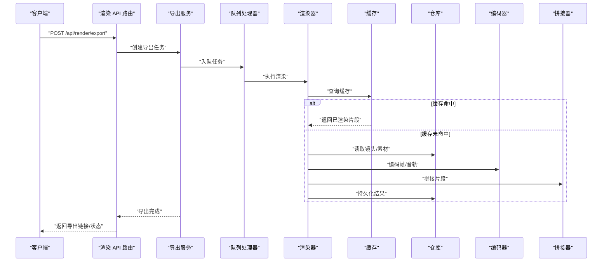

**图表来源**
- [src/app/api/render/export/route.ts](file://src/app/api/render/export/route.ts)
- [src/features/render/export-service.ts](file://src/features/render/export-service.ts)
- [src/features/render/queue-handler.ts](file://src/features/render/queue-handler.ts)
- [src/features/render/renderer.ts](file://src/features/render/renderer.ts)
- [src/features/render/cache.ts](file://src/features/render/cache.ts)
- [src/features/render/repository.ts](file://src/features/render/repository.ts)
- [src/features/render/encode.ts](file://src/features/render/encode.ts)
- [src/features/render/concat.ts](file://src/features/render/concat.ts)

### AI 服务集成（AI）
AI 模块通过适配器抽象第三方服务，统一输入输出 schema，便于替换与扩展，遵循统一目标框架的接口规范。

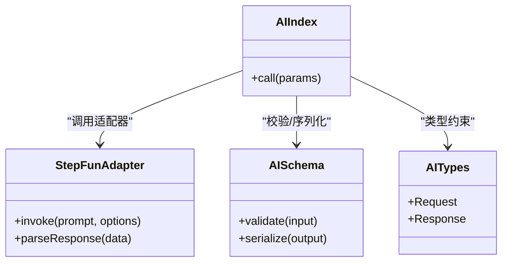

**图表来源**
- [src/features/ai/index.ts](file://src/features/ai/index.ts)
- [src/features/ai/stepfun-adapter.ts](file://src/features/ai/stepfun-adapter.ts)
- [src/features/ai/schemas.ts](file://src/features/ai/schemas.ts)
- [src/features/ai/types.ts](file://src/features/ai/types.ts)

**章节来源**
- [src/features/ai/index.ts](file://src/features/ai/index.ts)
- [src/features/ai/stepfun-adapter.ts](file://src/features/ai/stepfun-adapter.ts)
- [src/features/ai/types.ts](file://src/features/ai/types.ts)
- [src/features/ai/schemas.ts](file://src/features/ai/schemas.ts)

### 制品与音频（Artifacts & Audio）
制品服务负责中间产物与最终产物的生命周期管理；音频模块提供评分、音效、字幕、配音等能力，供导演与渲染阶段复用，遵循统一目标框架的数据契约。

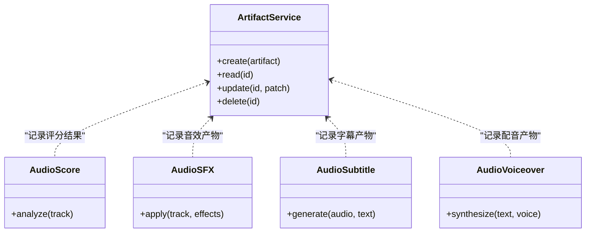

**图表来源**
- [src/features/artifacts/service.ts](file://src/features/artifacts/service.ts)
- [src/features/audio/score.ts](file://src/features/audio/score.ts)
- [src/features/audio/sfx.ts](file://src/features/audio/sfx.ts)
- [src/features/audio/subtitle.ts](file://src/features/audio/subtitle.ts)
- [src/features/audio/voiceover.ts](file://src/features/audio/voiceover.ts)
- [src/features/audio/types.ts](file://src/features/audio/types.ts)

**章节来源**
- [src/features/artifacts/service.ts](file://src/features/artifacts/service.ts)
- [src/features/audio/index.ts](file://src/features/audio/index.ts)
- [src/features/audio/types.ts](file://src/features/audio/types.ts)
- [src/features/audio/score.ts](file://src/features/audio/score.ts)
- [src/features/audio/sfx.ts](file://src/features/audio/sfx.ts)
- [src/features/audio/subtitle.ts](file://src/features/audio/subtitle.ts)
- [src/features/audio/voiceover.ts](file://src/features/audio/voiceover.ts)

### 画布与 UI（Canvas & UI）
画布层提供可视化编辑与交互，节点组件表达舞台、镜头、音频与导出等概念，遵循统一目标框架的用户体验标准。

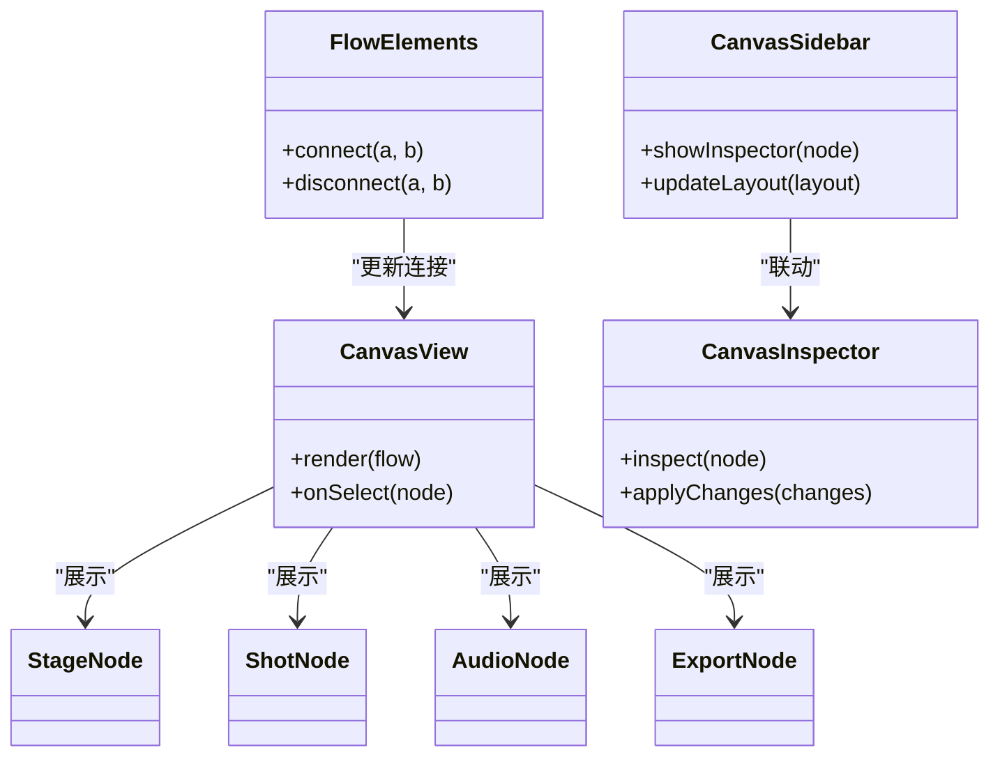

**图表来源**
- [src/app/canvas/canvas-view.tsx](file://src/app/canvas/canvas-view.tsx)
- [src/app/canvas/canvas-sidebar.tsx](file://src/app/canvas/canvas-sidebar.tsx)
- [src/app/canvas/canvas-inspector.tsx](file://src/app/canvas/canvas-inspector.tsx)
- [src/app/canvas/flow-elements.tsx](file://src/app/canvas/flow-elements.tsx)
- [src/components/ui/node/stage-node.tsx](file://src/components/ui/node/stage-node.tsx)
- [src/components/ui/node/shot-node.tsx](file://src/components/ui/node/shot-node.tsx)
- [src/components/ui/node/audio-node.tsx](file://src/components/ui/node/audio-node.tsx)
- [src/components/ui/node/export-node.tsx](file://src/components/ui/node/export-node.tsx)

**章节来源**
- [src/app/canvas/canvas-view.tsx](file://src/app/canvas/canvas-view.tsx)
- [src/app/canvas/canvas-sidebar.tsx](file://src/app/canvas/canvas-sidebar.tsx)
- [src/app/canvas/canvas-inspector.tsx](file://src/app/canvas/canvas-inspector.tsx)
- [src/app/canvas/flow-elements.tsx](file://src/app/canvas/flow-elements.tsx)
- [src/components/ui/node/stage-node.tsx](file://src/components/ui/node/stage-node.tsx)
- [src/components/ui/node/shot-node.tsx](file://src/components/ui/node/shot-node.tsx)
- [src/components/ui/node/audio-node.tsx](file://src/components/ui/node/audio-node.tsx)
- [src/components/ui/node/export-node.tsx](file://src/components/ui/node/export-node.tsx)

## React UI 层动画规范

### 动画架构设计
React UI 层采用统一的动画抽象层，基于 motion/react 库提供一致的动画体验。动画库位于 `lib/motion` 目录，负责封装底层动画实现，向上层组件提供简洁的 API。

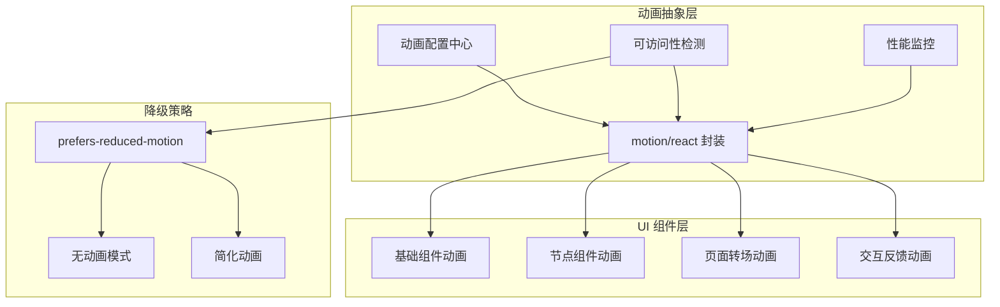

**图表来源**
- [src/lib/motion](file://src/lib/motion)

### 动画使用指南
- **标准化动画时长**：所有动画遵循统一的时长标准（短动画 150ms，中等动画 300ms，长动画 500ms）
- **缓动函数规范**：使用预定义的缓动曲线，避免自定义复杂缓动函数
- **硬件加速优先**：优先使用 transform 和 opacity 属性，确保 GPU 加速
- **内存管理**：动画完成后及时清理监听器和引用，防止内存泄漏

### 责任边界划分
- **动画库层**：负责 motion/react 的具体实现、配置管理和性能优化
- **组件层**：只关注动画的业务逻辑，不关心具体实现细节
- **样式层**：通过 CSS 变量控制动画主题，支持动态切换
- **可访问性层**：自动检测用户偏好并应用相应的降级策略

### 可访问性考虑
- **自动检测**：通过 `prefers-reduced-motion` 媒体查询自动检测用户动画偏好
- **降级策略**：为需要减少动画的用户提供简化的过渡效果或完全禁用动画
- **键盘导航**：确保动画不影响键盘导航和屏幕阅读器体验
- **焦点管理**：动画过程中保持正确的焦点顺序和可见性

## 依赖关系分析
- 耦合与内聚
  - 导演系统与 AI 适配器松耦合：通过提示词与工具集解耦具体模型调用。
  - 渲染引擎与存储/缓存分离：通过仓库与缓存接口降低对外部实现的依赖。
  - UI 与业务逻辑解耦：节点组件仅负责展示与事件转发，状态由 features/canvas 管理。
  - 动画层与 UI 组件解耦：通过 lib/motion 抽象层隔离动画实现细节。
  - 统一目标框架贯穿所有层次：确保架构一致性和契约遵守。
- 直接/间接依赖
  - API 路由作为控制层，直接依赖各功能域入口；功能域内部再依赖工具库。
  - UI 组件通过动画库间接依赖 motion/react，但保持对上层接口的稳定性。
  - 所有模块都依赖统一目标框架提供的架构指导。
- 潜在循环依赖
  - 通过明确接口与单向依赖（UI→Features→Lib）避免循环。
  - 动画库作为纯工具库，不反向依赖任何业务逻辑。
  - 统一目标框架作为顶层指导，不产生循环依赖。
- 外部集成点
  - AI 适配器对接第三方服务；导出与队列可能对接外部存储或消息队列。
  - 动画库依赖浏览器 API 和 CSS 特性，提供适当的降级方案。

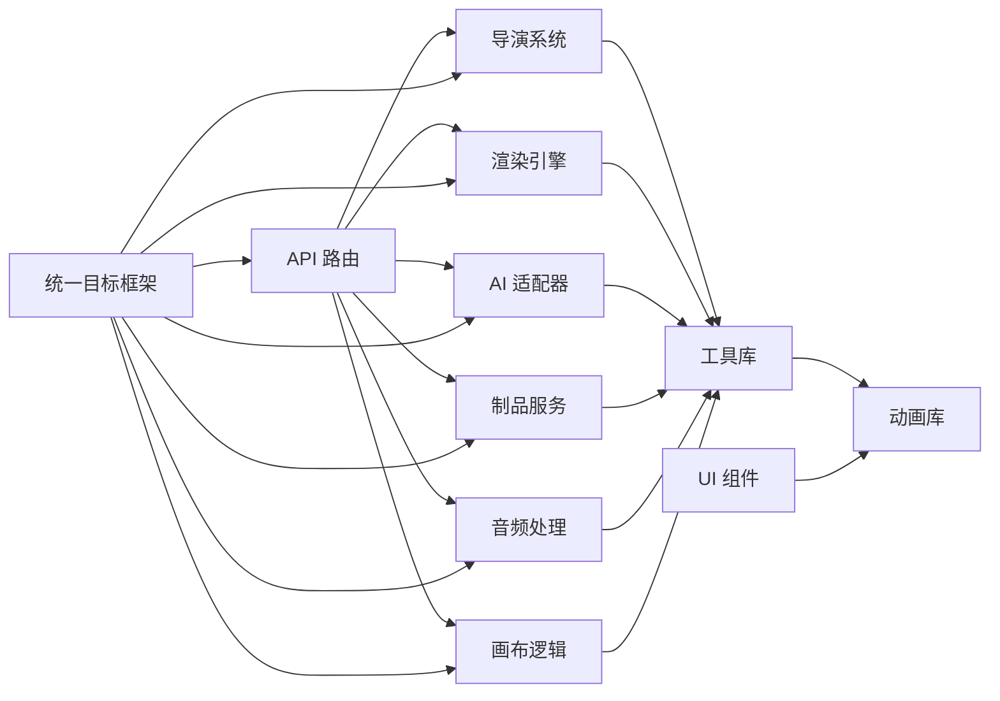

**图表来源**
- [src/app/api/director/stage/route.ts](file://src/app/api/director/stage/route.ts)
- [src/app/api/render/route.ts](file://src/app/api/render/route.ts)
- [src/app/api/render/export/route.ts](file://src/app/api/render/export/route.ts)
- [src/app/api/artifacts/[id]/route.ts](file://src/app/api/artifacts/[id]/route.ts)
- [src/app/api/projects/route.ts](file://src/app/api/projects/route.ts)
- [src/app/api/settings/route.ts](file://src/app/api/settings/route.ts)
- [src/features/director/index.ts](file://src/features/director/index.ts)
- [src/features/render/renderer.ts](file://src/features/render/renderer.ts)
- [src/features/ai/index.ts](file://src/features/ai/index.ts)
- [src/features/artifacts/service.ts](file://src/features/artifacts/service.ts)
- [src/features/audio/index.ts](file://src/features/audio/index.ts)
- [src/features/canvas/actions.ts](file://src/features/canvas/actions.ts)

**章节来源**
- [src/app/api/director/stage/route.ts](file://src/app/api/director/stage/route.ts)
- [src/app/api/render/route.ts](file://src/app/api/render/route.ts)
- [src/app/api/render/export/route.ts](file://src/app/api/render/export/route.ts)
- [src/app/api/artifacts/[id]/route.ts](file://src/app/api/artifacts/[id]/route.ts)
- [src/app/api/projects/route.ts](file://src/app/api/projects/route.ts)
- [src/app/api/settings/route.ts](file://src/app/api/settings/route.ts)
- [src/features/director/index.ts](file://src/features/director/index.ts)
- [src/features/render/renderer.ts](file://src/features/render/renderer.ts)
- [src/features/ai/index.ts](file://src/features/ai/index.ts)
- [src/features/artifacts/service.ts](file://src/features/artifacts/service.ts)
- [src/features/audio/index.ts](file://src/features/audio/index.ts)
- [src/features/canvas/actions.ts](file://src/features/canvas/actions.ts)

## 性能考量
- 渲染缓存：对重复镜头与片段进行缓存，减少重复计算与 IO。
- 队列处理：长耗时任务（导出、编码）入队异步执行，提升响应性与吞吐。
- 增量更新：画布状态变更局部重绘，避免全量刷新。
- 确定性校验：在导演阶段引入确定性检查，保障可复现与可测试性。
- 资源隔离：AI 调用与渲染过程隔离，避免阻塞主线程。
- **动画性能优化**：使用硬件加速属性（transform、opacity），避免重排重绘，合理设置动画优先级。
- **可访问性优化**：根据用户偏好自动调整动画复杂度，减少不必要的计算开销。
- **统一目标框架优化**：通过标准化的架构模式减少重复实现和优化机会。

**更新** 新增统一目标框架对性能优化的贡献，强调标准化架构模式带来的性能收益。

## 故障排查指南
- 导演阶段失败
  - 检查阶段提示词构建与工具调用日志；确认会话与运行时数据一致性。
  - 参考路径：stage-runner、stage-prompt、tools/*、session-store、runtime-repository。
- 渲染导出异常
  - 验证缓存键与失效策略；检查仓库读写权限与编码参数；查看队列任务状态。
  - 参考路径：export-service、queue-handler、renderer、cache、repository、encode。
- AI 调用错误
  - 核对输入 schema 与适配器返回格式；关注网络与鉴权问题。
  - 参考路径：ai/index、stepfun-adapter、ai/schemas、ai/types。
- 画布交互问题
  - 检查节点类型与连接规则；确认 actions/queries 的状态同步。
  - 参考路径：canvas/actions、canvas/queries、canvas/types、node/*。
- **动画相关问题**
  - 检查 motion/react 版本兼容性；验证动画配置是否正确；确认 prefers-reduced-motion 检测逻辑。
  - 参考路径：lib/motion、组件中的动画使用方式、CSS 动画变量定义。
- **统一目标框架相关问题**
  - 检查模块间契约是否一致；验证架构指导原则是否被正确遵循；确认接口规范是否符合统一标准。

**更新** 新增统一目标框架相关问题的故障排查指南，包括契约一致性检查和架构指导原则遵循情况。

**章节来源**
- [src/features/director/stage-runner.ts](file://src/features/director/stage-runner.ts)
- [src/features/director/stage-prompt.ts](file://src/features/director/stage-prompt.ts)
- [src/features/director/tools/write-artifact.ts](file://src/features/director/tools/write-artifact.ts)
- [src/features/director/tools/validate-shot-plan.ts](file://src/features/director/tools/validate-shot-plan.ts)
- [src/features/director/tools/check-determinism.ts](file://src/features/director/tools/check-determinism.ts)
- [src/features/director/session-store.ts](file://src/features/director/session-store.ts)
- [src/features/director/runtime-repository.ts](file://src/features/director/runtime-repository.ts)
- [src/features/render/export-service.ts](file://src/features/render/export-service.ts)
- [src/features/render/queue-handler.ts](file://src/features/render/queue-handler.ts)
- [src/features/render/renderer.ts](file://src/features/render/renderer.ts)
- [src/features/render/cache.ts](file://src/features/render/cache.ts)
- [src/features/render/repository.ts](file://src/features/render/repository.ts)
- [src/features/render/encode.ts](file://src/features/render/encode.ts)
- [src/features/ai/index.ts](file://src/features/ai/index.ts)
- [src/features/ai/stepfun-adapter.ts](file://src/features/ai/stepfun-adapter.ts)
- [src/features/ai/schemas.ts](file://src/features/ai/schemas.ts)
- [src/features/ai/types.ts](file://src/features/ai/types.ts)
- [src/features/canvas/actions.ts](file://src/features/canvas/actions.ts)
- [src/features/canvas/queries.ts](file://src/features/canvas/queries.ts)
- [src/components/ui/node/stage-node.tsx](file://src/components/ui/node/stage-node.tsx)
- [src/components/ui/node/shot-node.tsx](file://src/components/ui/node/shot-node.tsx)
- [src/components/ui/node/audio-node.tsx](file://src/components/ui/node/audio-node.tsx)
- [src/components/ui/node/export-node.tsx](file://src/components/ui/node/export-node.tsx)

## 结论
CodeVideoCanvas 通过模块化与分层架构，将导演系统、渲染引擎与 AI 服务清晰解耦，并以 API 路由作为统一控制面。借助缓存与队列机制提升性能与稳定性，配合确定性校验与 schema 约束增强可靠性。UI 层与业务逻辑分离，使画布交互与可视化易于扩展与维护。**新增的 MASTER-GOAL-CONTRACT 统一目标框架进一步提升了系统的架构一致性和可维护性，通过将 N0-N7 分散任务整合为统一的架构指导原则，为平台的持续演进奠定了坚实基础**。该设计在灵活性与可维护性之间取得良好平衡，适合团队协作和长期发展。

**更新** 强调 MASTER-GOAL-CONTRACT 统一目标框架对系统架构一致性和可维护性的贡献，以及其对平台长期发展的积极影响。

## 附录

### 技术决策与权衡
- 选择 Next.js 作为应用框架：利用其内置路由、SSR/CSR 混合能力与 API 路由，简化前后端一体化开发。
- 采用功能域划分：将导演、渲染、AI、制品、音频、画布独立成域，提升内聚与可测试性。
- 使用适配器模式集成 AI：屏蔽第三方差异，便于替换与扩展。
- 引入队列与缓存：将长耗时任务异步化并复用结果，提高吞吐与用户体验。
- 强化 schema 与确定性：在导演阶段引入严格的数据校验与确定性检查，保障流程稳定与可复现。
- **采用动画抽象层**：通过 lib/motion 统一封装 motion/react 使用，确保动画的一致性和可维护性，同时提供良好的可访问性支持。
- **实施统一目标框架**：通过 MASTER-GOAL-CONTRACT 整合分散任务，建立一致的架构方向和开发标准，提升团队协作效率和系统可维护性。

**更新** 新增统一目标框架的技术决策说明，强调其在架构一致性、团队协作和系统可维护性方面的优势。

### 统一目标框架实施指南
- **架构指导原则**：所有新功能开发必须遵循统一目标框架的设计原则
- **契约规范**：模块间接口必须符合统一契约标准
- **质量标准**：代码质量、测试覆盖率、性能指标必须符合框架要求
- **演进策略**：支持渐进式重构和迁移，确保向后兼容性

**章节来源**
- [docs/issues/refactor-v3/README.md](file://docs/issues/refactor-v3/README.md)
- [docs/specs/2026-07-24-refactor-v3-architecture-spec.md](file://docs/specs/2026-07-24-refactor-v3-architecture-spec.md)
- [docs/plans/2026-07-24-refactor-blueprint-03-tracks.md](file://docs/plans/2026-07-24-refactor-blueprint-03-tracks.md)