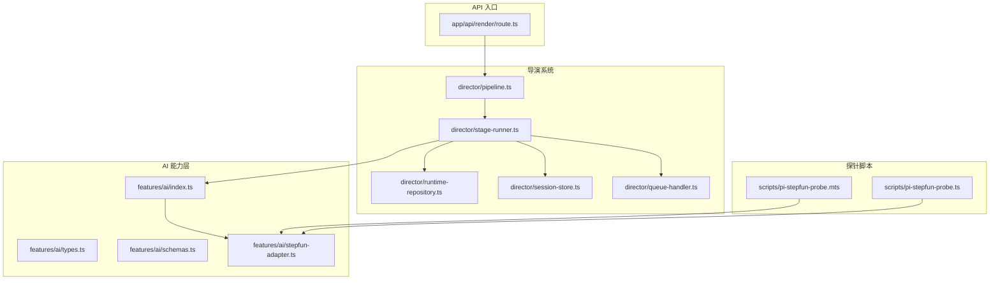
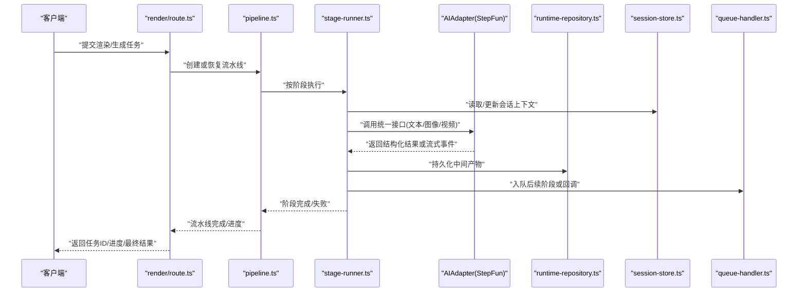
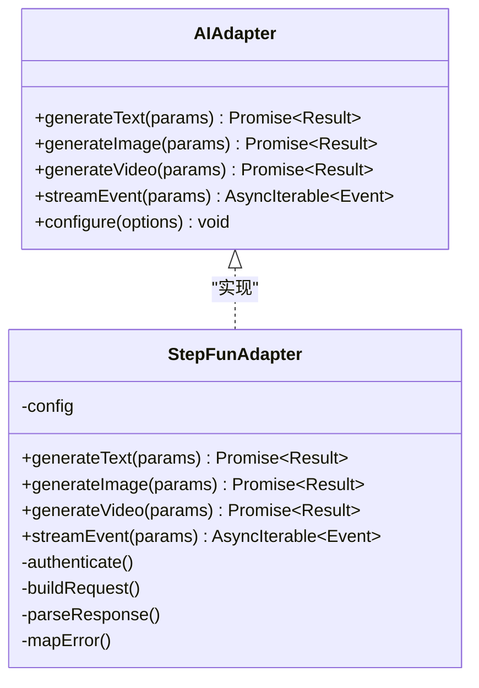
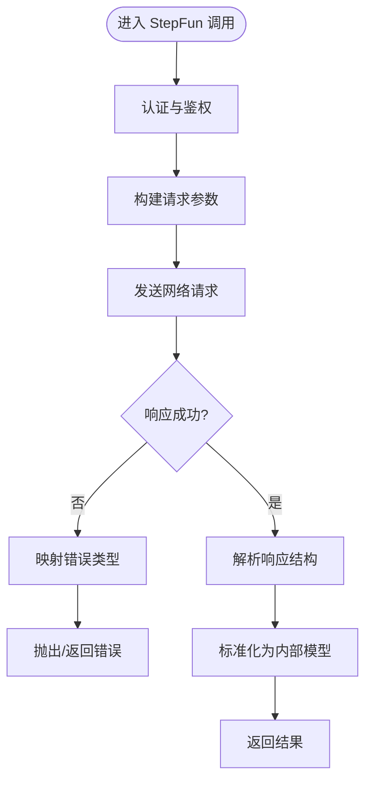
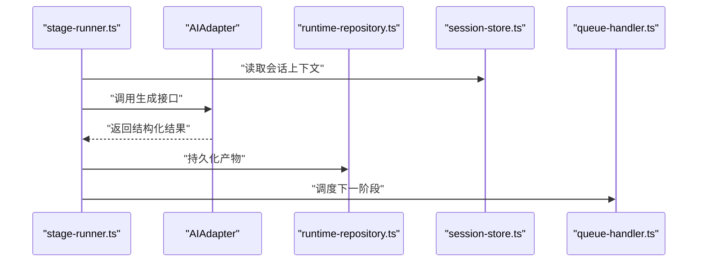
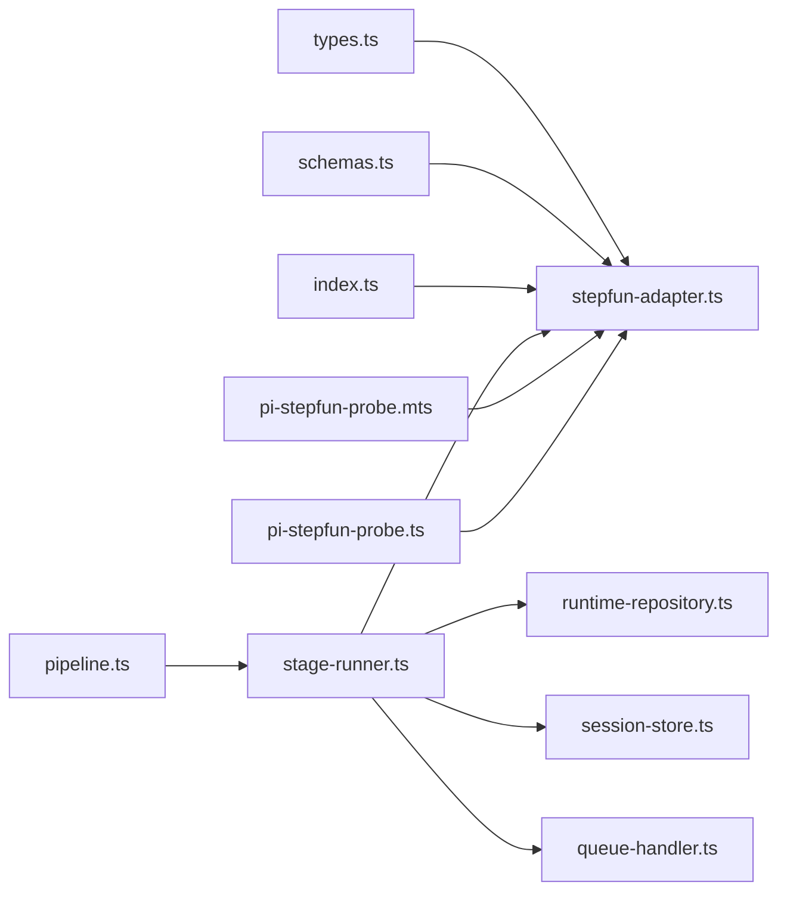

# AI 服务集成设计

<cite>
**本文引用的文件**   
- [src/features/ai/index.ts](file://src/features/ai/index.ts)
- [src/features/ai/types.ts](file://src/features/ai/types.ts)
- [src/features/ai/schemas.ts](file://src/features/ai/schemas.ts)
- [src/features/ai/stepfun-adapter.ts](file://src/features/ai/stepfun-adapter.ts)
- [src/features/ai/stepfun-adapter.test.ts](file://src/features/ai/stepfun-adapter.test.ts)
- [scripts/pi-stepfun-probe.mts](file://scripts/pi-stepfun-probe.mts)
- [scripts/pi-stepfun-probe.ts](file://scripts/pi-stepfun-probe.ts)
- [src/features/director/pipeline.ts](file://src/features/director/pipeline.ts)
- [src/features/director/stage-runner.ts](file://src/features/director/stage-runner.ts)
- [src/features/director/runtime-repository.ts](file://src/features/director/runtime-repository.ts)
- [src/features/director/session-store.ts](file://src/features/director/session-store.ts)
- [src/features/director/queue-handler.ts](file://src/features/director/queue-handler.ts)
- [src/app/api/render/route.ts](file://src/app/api/render/route.ts)
</cite>

## 目录
1. [简介](#简介)
2. [项目结构](#项目结构)
3. [核心组件](#核心组件)
4. [架构总览](#架构总览)
5. [详细组件分析](#详细组件分析)
6. [依赖关系分析](#依赖关系分析)
7. [性能与可靠性](#性能与可靠性)
8. [故障排查指南](#故障排查指南)
9. [结论](#结论)
10. [附录](#附录)

## 简介
本设计文档面向 CodeVideoCanvas 的 AI 服务集成，重点阐述适配器模式在统一多厂商 AI 能力接入中的应用。文档覆盖以下主题：
- AIAdapter 抽象接口设计与 StepFun 适配器的具体实现
- 统一的服务调用接口、提示词管理、响应解析与错误处理机制
- AI 服务的配置管理、认证授权与限流控制
- 如何扩展支持新的 AI 服务提供商
- 与导演系统的集成方式与数据流转过程
- 异步响应的处理方式与示例路径

## 项目结构
AI 相关代码主要位于 features/ai 目录，并通过脚本探针进行连通性验证；导演系统通过 pipeline、stage-runner、runtime-repository、session-store、queue-handler 等模块协同工作；渲染 API 作为外部入口触发任务编排。

图表来源
- [src/features/ai/index.ts](file://src/features/ai/index.ts)
- [src/features/ai/types.ts](file://src/features/ai/types.ts)
- [src/features/ai/schemas.ts](file://src/features/ai/schemas.ts)
- [src/features/ai/stepfun-adapter.ts](file://src/features/ai/stepfun-adapter.ts)
- [src/features/director/pipeline.ts](file://src/features/director/pipeline.ts)
- [src/features/director/stage-runner.ts](file://src/features/director/stage-runner.ts)
- [src/features/director/runtime-repository.ts](file://src/features/director/runtime-repository.ts)
- [src/features/director/session-store.ts](file://src/features/director/session-store.ts)
- [src/features/director/queue-handler.ts](file://src/features/director/queue-handler.ts)
- [src/app/api/render/route.ts](file://src/app/api/render/route.ts)
- [scripts/pi-stepfun-probe.mts](file://scripts/pi-stepfun-probe.mts)
- [scripts/pi-stepfun-probe.ts](file://scripts/pi-stepfun-probe.ts)

章节来源
- [src/features/ai/index.ts](file://src/features/ai/index.ts)
- [src/features/ai/types.ts](file://src/features/ai/types.ts)
- [src/features/ai/schemas.ts](file://src/features/ai/schemas.ts)
- [src/features/ai/stepfun-adapter.ts](file://src/features/ai/stepfun-adapter.ts)
- [src/features/director/pipeline.ts](file://src/features/director/pipeline.ts)
- [src/features/director/stage-runner.ts](file://src/features/director/stage-runner.ts)
- [src/features/director/runtime-repository.ts](file://src/features/director/runtime-repository.ts)
- [src/features/director/session-store.ts](file://src/features/director/session-store.ts)
- [src/features/director/queue-handler.ts](file://src/features/director/queue-handler.ts)
- [src/app/api/render/route.ts](file://src/app/api/render/route.ts)
- [scripts/pi-stepfun-probe.mts](file://scripts/pi-stepfun-probe.mts)
- [scripts/pi-stepfun-probe.ts](file://scripts/pi-stepfun-probe.ts)

## 核心组件
- AIAdapter 抽象接口：定义统一的 AI 调用契约（如生成文本/图像/视频、流式输出、重试与超时控制），屏蔽底层厂商差异。
- StepFun 适配器：基于 StepFun 平台的具体实现，负责鉴权、请求构造、响应解析与错误映射。
- 类型与模式：types.ts 提供跨模块共享的类型定义；schemas.ts 提供输入/输出的校验模式。
- 探针脚本：pi-stepfun-probe.* 用于快速验证 StepFun 连通性与基本能力。

章节来源
- [src/features/ai/types.ts](file://src/features/ai/types.ts)
- [src/features/ai/schemas.ts](file://src/features/ai/schemas.ts)
- [src/features/ai/stepfun-adapter.ts](file://src/features/ai/stepfun-adapter.ts)
- [scripts/pi-stepfun-probe.mts](file://scripts/pi-stepfun-probe.mts)
- [scripts/pi-stepfun-probe.ts](file://scripts/pi-stepfun-probe.ts)

## 架构总览
整体采用“适配器 + 工厂”的统一接入方案：上层仅依赖 AIAdapter 抽象，运行时根据配置选择具体适配器（当前为 StepFun）。导演系统通过 pipeline 编排阶段，stage-runner 执行阶段逻辑并调用 AI 能力，结果持久化到 runtime-repository，会话状态由 session-store 维护，队列由 queue-handler 调度。

图表来源
- [src/app/api/render/route.ts](file://src/app/api/render/route.ts)
- [src/features/director/pipeline.ts](file://src/features/director/pipeline.ts)
- [src/features/director/stage-runner.ts](file://src/features/director/stage-runner.ts)
- [src/features/director/runtime-repository.ts](file://src/features/director/runtime-repository.ts)
- [src/features/director/session-store.ts](file://src/features/director/session-store.ts)
- [src/features/director/queue-handler.ts](file://src/features/director/queue-handler.ts)
- [src/features/ai/stepfun-adapter.ts](file://src/features/ai/stepfun-adapter.ts)

## 详细组件分析

### AIAdapter 抽象接口设计
- 目标：为不同 AI 提供商提供一致的调用契约，包括同步/异步、流式输出、重试、超时、速率限制等。
- 关键职责：
  - 统一方法签名：如 generateText、generateImage、generateVideo、streamEvent
  - 标准化错误模型：将各厂商错误码映射为内部错误类型
  - 可插拔策略：重试、退避、熔断、限流
  - 配置注入：密钥、端点、模型参数、并发度等

图表来源
- [src/features/ai/types.ts](file://src/features/ai/types.ts)
- [src/features/ai/stepfun-adapter.ts](file://src/features/ai/stepfun-adapter.ts)

章节来源
- [src/features/ai/types.ts](file://src/features/ai/types.ts)
- [src/features/ai/stepfun-adapter.ts](file://src/features/ai/stepfun-adapter.ts)

### StepFun 适配器实现要点
- 认证授权：从配置中获取凭据，构造请求头或令牌刷新策略。
- 请求构建：将统一参数转换为 StepFun 所需的请求体与查询参数。
- 响应解析：将 StepFun 的响应结构映射为内部 Result 模型，确保字段一致。
- 错误映射：将 HTTP 状态码、业务错误码映射为内部错误类型，便于上层统一处理。
- 流式处理：若支持 SSE/WS，则封装为 AsyncIterable 供上层消费。

图表来源
- [src/features/ai/stepfun-adapter.ts](file://src/features/ai/stepfun-adapter.ts)

章节来源
- [src/features/ai/stepfun-adapter.ts](file://src/features/ai/stepfun-adapter.ts)

### 提示词管理系统
- 职责：集中管理导演流程中的提示词模板、变量替换、版本控制与回滚。
- 关键点：
  - 模板与变量分离：模板存放于独立模块，运行时注入上下文变量
  - 校验与兜底：对缺失变量进行校验并提供默认值
  - 可观测性：记录每次提示词组装的快照，便于调试与回溯

章节来源
- [src/features/director/stage-prompt.ts](file://src/features/director/stage-prompt.ts)
- [src/features/director/prompts/direct.ts](file://src/features/director/prompts/direct.ts)
- [src/features/director/prompts/fabricate.ts](file://src/features/director/prompts/fabricate.ts)
- [src/features/director/prompts/assemble.ts](file://src/features/director/prompts/assemble.ts)
- [src/features/director/prompts/finalize.ts](file://src/features/director/prompts/finalize.ts)
- [src/features/director/prompts/ingest.ts](file://src/features/director/prompts/ingest.ts)
- [src/features/director/prompts/shot-spec.ts](file://src/features/director/prompts/shot-spec.ts)

### 响应解析器与错误处理机制
- 响应解析器：将不同厂商的响应结构归一化为内部模型，保证下游稳定消费。
- 错误处理：
  - 分类：网络错误、认证失败、配额/限流、业务校验失败、服务端异常
  - 策略：重试（指数退避）、熔断、降级（切换备用模型或跳过非关键步骤）
  - 上报：结构化日志与指标采集，便于定位问题

章节来源
- [src/features/ai/schemas.ts](file://src/features/ai/schemas.ts)
- [src/features/ai/stepfun-adapter.ts](file://src/features/ai/stepfun-adapter.ts)

### AI 服务配置管理、认证授权与限流控制
- 配置管理：集中加载环境变量与配置文件，提供类型安全的访问器。
- 认证授权：
  - 支持多种认证方式（API Key、OAuth、JWT）
  - 自动刷新令牌与缓存
- 限流控制：
  - 令牌桶/漏桶算法
  - 每租户/每模型维度限流
  - 动态调整并发度与重试间隔

章节来源
- [src/lib/config](file://src/lib/config)
- [src/features/ai/stepfun-adapter.ts](file://src/features/ai/stepfun-adapter.ts)

### 扩展新的 AI 服务提供商
- 步骤概览：
  1) 新增适配器类，实现 AIAdapter 接口
  2) 在工厂或注册表中注册新适配器
  3) 添加配置项与鉴权逻辑
  4) 编写单元测试与探针脚本
  5) 在导演系统中按需启用
- 建议：
  - 保持适配器无状态，避免全局可变状态
  - 使用 schemas 做输入输出校验
  - 提供最小可用探针以快速验证

章节来源
- [src/features/ai/index.ts](file://src/features/ai/index.ts)
- [src/features/ai/stepfun-adapter.ts](file://src/features/ai/stepfun-adapter.ts)
- [scripts/pi-stepfun-probe.mts](file://scripts/pi-stepfun-probe.mts)
- [scripts/pi-stepfun-probe.ts](file://scripts/pi-stepfun-probe.ts)

### 与导演系统的集成与数据流转
- 集成点：
  - stage-runner 在执行阶段时调用 AIAdapter 提供的统一接口
  - runtime-repository 保存中间产物与元数据
  - session-store 维护会话上下文（如历史消息、临时变量）
  - queue-handler 协调阶段间依赖与并行度
- 数据流转：
  - 输入：用户任务、阶段计划、上下文
  - 处理：提示词组装 → AI 调用 → 结果解析 → 产物落盘
  - 输出：阶段结果、进度事件、最终产物

图表来源
- [src/features/director/stage-runner.ts](file://src/features/director/stage-runner.ts)
- [src/features/director/runtime-repository.ts](file://src/features/director/runtime-repository.ts)
- [src/features/director/session-store.ts](file://src/features/director/session-store.ts)
- [src/features/director/queue-handler.ts](file://src/features/director/queue-handler.ts)
- [src/features/ai/stepfun-adapter.ts](file://src/features/ai/stepfun-adapter.ts)

章节来源
- [src/features/director/stage-runner.ts](file://src/features/director/stage-runner.ts)
- [src/features/director/runtime-repository.ts](file://src/features/director/runtime-repository.ts)
- [src/features/director/session-store.ts](file://src/features/director/session-store.ts)
- [src/features/director/queue-handler.ts](file://src/features/director/queue-handler.ts)

### 调用示例与异步响应处理
- 同步调用示例路径：在 stage-runner 中直接 await AIAdapter 的生成方法，捕获错误并写入产物。
- 异步/流式处理示例路径：
  - 使用 AsyncIterable 消费流式事件，逐步更新进度
  - 在 queue-handler 中将阶段性事件持久化，供前端轮询或推送
- 参考路径：
  - 同步调用：[src/features/director/stage-runner.ts](file://src/features/director/stage-runner.ts)
  - 流式处理：[src/features/ai/stepfun-adapter.ts](file://src/features/ai/stepfun-adapter.ts)
  - 探针脚本：[scripts/pi-stepfun-probe.mts](file://scripts/pi-stepfun-probe.mts)、[scripts/pi-stepfun-probe.ts](file://scripts/pi-stepfun-probe.ts)

章节来源
- [src/features/director/stage-runner.ts](file://src/features/director/stage-runner.ts)
- [src/features/ai/stepfun-adapter.ts](file://src/features/ai/stepfun-adapter.ts)
- [scripts/pi-stepfun-probe.mts](file://scripts/pi-stepfun-probe.mts)
- [scripts/pi-stepfun-probe.ts](file://scripts/pi-stepfun-probe.ts)

## 依赖关系分析
- 内聚与耦合：
  - AI 层与导演系统通过 AIAdapter 解耦，降低厂商绑定
  - 配置、存储与会话分别由独立模块管理，提升可测试性
- 外部依赖：
  - StepFun 平台 API
  - 队列与存储后端（由 runtime-repository 与 session-store 抽象）

图表来源
- [src/features/ai/types.ts](file://src/features/ai/types.ts)
- [src/features/ai/schemas.ts](file://src/features/ai/schemas.ts)
- [src/features/ai/index.ts](file://src/features/ai/index.ts)
- [src/features/ai/stepfun-adapter.ts](file://src/features/ai/stepfun-adapter.ts)
- [src/features/director/pipeline.ts](file://src/features/director/pipeline.ts)
- [src/features/director/stage-runner.ts](file://src/features/director/stage-runner.ts)
- [src/features/director/runtime-repository.ts](file://src/features/director/runtime-repository.ts)
- [src/features/director/session-store.ts](file://src/features/director/session-store.ts)
- [src/features/director/queue-handler.ts](file://src/features/director/queue-handler.ts)
- [scripts/pi-stepfun-probe.mts](file://scripts/pi-stepfun-probe.mts)
- [scripts/pi-stepfun-probe.ts](file://scripts/pi-stepfun-probe.ts)

章节来源
- [src/features/ai/index.ts](file://src/features/ai/index.ts)
- [src/features/ai/types.ts](file://src/features/ai/types.ts)
- [src/features/ai/schemas.ts](file://src/features/ai/schemas.ts)
- [src/features/ai/stepfun-adapter.ts](file://src/features/ai/stepfun-adapter.ts)
- [src/features/director/pipeline.ts](file://src/features/director/pipeline.ts)
- [src/features/director/stage-runner.ts](file://src/features/director/stage-runner.ts)
- [src/features/director/runtime-repository.ts](file://src/features/director/runtime-repository.ts)
- [src/features/director/session-store.ts](file://src/features/director/session-store.ts)
- [src/features/director/queue-handler.ts](file://src/features/director/queue-handler.ts)
- [scripts/pi-stepfun-probe.mts](file://scripts/pi-stepfun-probe.mts)
- [scripts/pi-stepfun-probe.ts](file://scripts/pi-stepfun-probe.ts)

## 性能与可靠性
- 并发与吞吐：
  - 通过 queue-handler 控制阶段并发度，避免过载
  - 针对大模型长耗时任务，优先使用流式接口与增量持久化
- 容错与稳定性：
  - 指数退避重试与熔断，防止雪崩
  - 幂等写入与去重，保障重复调用的安全性
- 资源优化：
  - 合理设置超时与取消令牌，及时释放资源
  - 缓存热点提示词与中间产物，减少重复计算

## 故障排查指南
- 常见问题定位：
  - 认证失败：检查凭据与令牌刷新逻辑
  - 限流/配额不足：查看限流策略与重试间隔
  - 响应格式不一致：核对 schemas 与解析器映射
  - 流式中断：确认连接保活与断线重连
- 诊断手段：
  - 启用结构化日志与链路追踪
  - 使用探针脚本快速复现问题
  - 回放阶段产物与提示词快照

章节来源
- [src/features/ai/stepfun-adapter.ts](file://src/features/ai/stepfun-adapter.ts)
- [src/features/ai/schemas.ts](file://src/features/ai/schemas.ts)
- [scripts/pi-stepfun-probe.mts](file://scripts/pi-stepfun-probe.mts)
- [scripts/pi-stepfun-probe.ts](file://scripts/pi-stepfun-probe.ts)

## 结论
通过 AIAdapter 抽象与 StepFun 适配器的落地，CodeVideoCanvas 实现了与 AI 能力的松耦合集成。配合提示词管理、响应解析、错误处理、配置与限流机制，系统在可扩展性、稳定性与可观测性方面具备良好基础。未来可按相同模式接入更多 AI 提供商，并在导演系统中灵活编排。

## 附录
- 关键路径参考：
  - 统一入口与类型定义：[src/features/ai/index.ts](file://src/features/ai/index.ts)、[src/features/ai/types.ts](file://src/features/ai/types.ts)
  - StepFun 适配器实现：[src/features/ai/stepfun-adapter.ts](file://src/features/ai/stepfun-adapter.ts)
  - 探针脚本：[scripts/pi-stepfun-probe.mts](file://scripts/pi-stepfun-probe.mts)、[scripts/pi-stepfun-probe.ts](file://scripts/pi-stepfun-probe.ts)
  - 导演系统核心：[src/features/director/pipeline.ts](file://src/features/director/pipeline.ts)、[src/features/director/stage-runner.ts](file://src/features/director/stage-runner.ts)
  - 运行期存储与会话：[src/features/director/runtime-repository.ts](file://src/features/director/runtime-repository.ts)、[src/features/director/session-store.ts](file://src/features/director/session-store.ts)
  - 队列调度：[src/features/director/queue-handler.ts](file://src/features/director/queue-handler.ts)
  - 渲染 API 入口：[src/app/api/render/route.ts](file://src/app/api/render/route.ts)