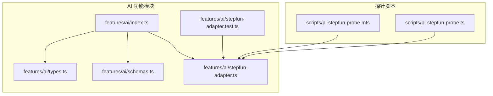
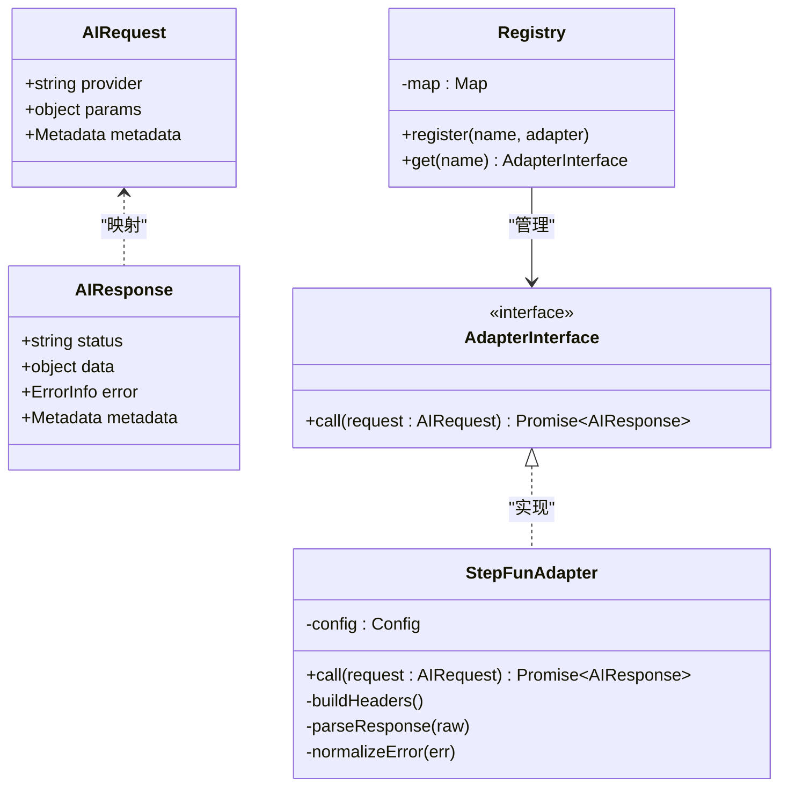
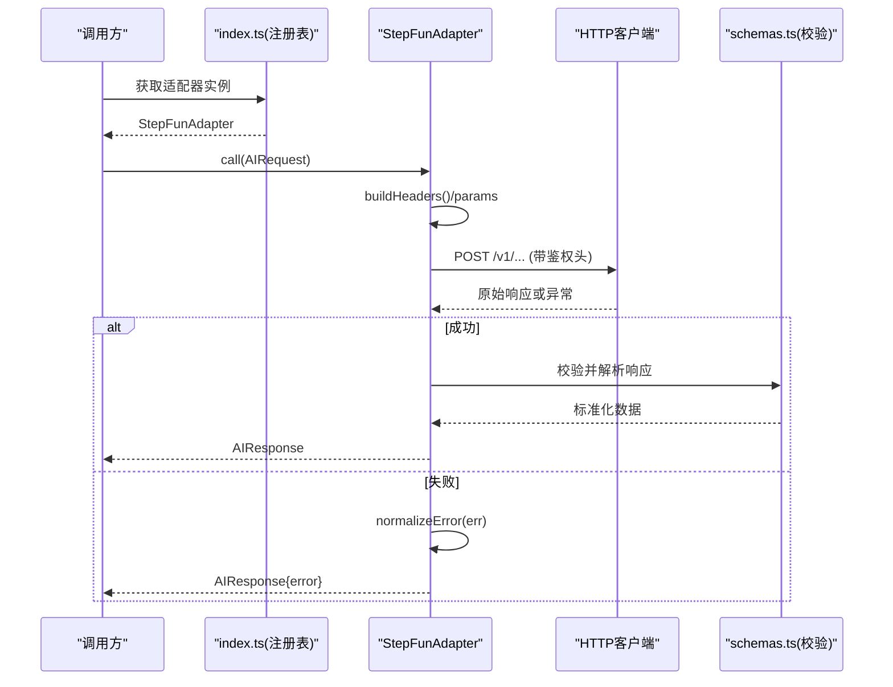
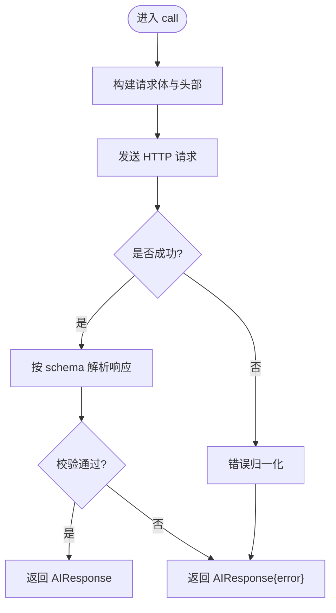
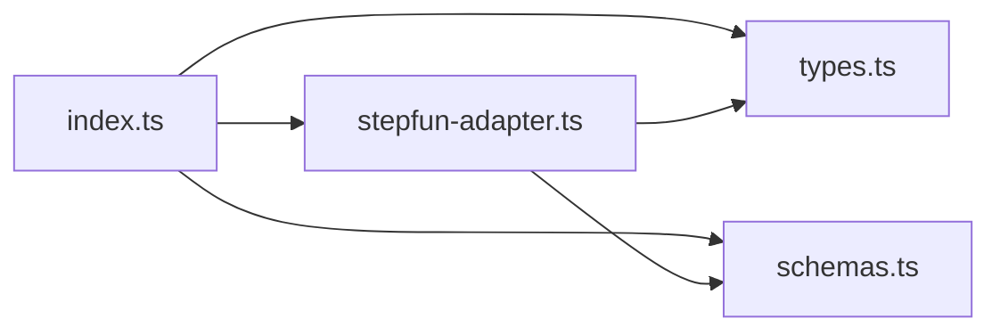

# AI服务集成

<cite>
**本文引用的文件**   
- [src/features/ai/index.ts](file://src/features/ai/index.ts)
- [src/features/ai/types.ts](file://src/features/ai/types.ts)
- [src/features/ai/schemas.ts](file://src/features/ai/schemas.ts)
- [src/features/ai/stepfun-adapter.ts](file://src/features/ai/stepfun-adapter.ts)
- [src/features/ai/stepfun-adapter.test.ts](file://src/features/ai/stepfun-adapter.test.ts)
- [scripts/pi-stepfun-probe.mts](file://scripts/pi-stepfun-probe.mts)
- [scripts/pi-stepfun-probe.ts](file://scripts/pi-stepfun-probe.ts)
</cite>

## 目录
1. [简介](#简介)
2. [项目结构](#项目结构)
3. [核心组件](#核心组件)
4. [架构总览](#架构总览)
5. [详细组件分析](#详细组件分析)
6. [依赖分析](#依赖分析)
7. [性能考虑](#性能考虑)
8. [故障排查指南](#故障排查指南)
9. [结论](#结论)
10. [附录](#附录)

## 简介
本技术文档聚焦于导演系统的 AI 服务集成，重点解析 StepFun 适配器的实现架构与扩展方法。内容涵盖：
- API 调用封装、响应解析与错误处理机制
- AI 请求数据结构定义、响应格式校验与异常处理策略
- 适配器模式的设计原理与新增 AI 服务提供商的接入流程
- 限流、重试与降级策略的实现建议
- 性能监控、日志记录与调试工具的使用指南

## 项目结构
AI 相关能力集中在 features/ai 模块中，并提供脚本探针用于连通性验证。

图表来源
- [src/features/ai/index.ts](file://src/features/ai/index.ts)
- [src/features/ai/types.ts](file://src/features/ai/types.ts)
- [src/features/ai/schemas.ts](file://src/features/ai/schemas.ts)
- [src/features/ai/stepfun-adapter.ts](file://src/features/ai/stepfun-adapter.ts)
- [src/features/ai/stepfun-adapter.test.ts](file://src/features/ai/stepfun-adapter.test.ts)
- [scripts/pi-stepfun-probe.mts](file://scripts/pi-stepfun-probe.mts)
- [scripts/pi-stepfun-probe.ts](file://scripts/pi-stepfun-probe.ts)

章节来源
- [src/features/ai/index.ts](file://src/features/ai/index.ts)
- [src/features/ai/types.ts](file://src/features/ai/types.ts)
- [src/features/ai/schemas.ts](file://src/features/ai/schemas.ts)
- [src/features/ai/stepfun-adapter.ts](file://src/features/ai/stepfun-adapter.ts)
- [src/features/ai/stepfun-adapter.test.ts](file://src/features/ai/stepfun-adapter.test.ts)
- [scripts/pi-stepfun-probe.mts](file://scripts/pi-stepfun-probe.mts)
- [scripts/pi-stepfun-probe.ts](file://scripts/pi-stepfun-probe.ts)

## 核心组件
- 类型与契约
  - types.ts：定义统一的 AI 请求/响应抽象、适配器接口与通用字段，确保上层业务与具体厂商解耦。
  - index.ts：聚合导出统一入口，暴露适配器注册、选择与调用方法，屏蔽底层差异。
- 数据校验
  - schemas.ts：使用结构化校验规则对入参与出参进行强约束，保障数据一致性。
- 适配器实现
  - stepfun-adapter.ts：StepFun 的具体实现，负责构建请求、发送 HTTP 调用、解析响应与错误归一化。
- 测试与探针
  - stepfun-adapter.test.ts：覆盖关键路径与边界条件，保障行为稳定。
  - pi-stepfun-probe.*：轻量探针脚本，用于快速验证 StepFun 连通性与基本能力。

章节来源
- [src/features/ai/types.ts](file://src/features/ai/types.ts)
- [src/features/ai/index.ts](file://src/features/ai/index.ts)
- [src/features/ai/schemas.ts](file://src/features/ai/schemas.ts)
- [src/features/ai/stepfun-adapter.ts](file://src/features/ai/stepfun-adapter.ts)
- [src/features/ai/stepfun-adapter.test.ts](file://src/features/ai/stepfun-adapter.test.ts)
- [scripts/pi-stepfun-probe.mts](file://scripts/pi-stepfun-probe.mts)
- [scripts/pi-stepfun-probe.ts](file://scripts/pi-stepfun-probe.ts)

## 架构总览
整体采用“适配器模式 + 工厂注册”的方式，将不同 AI 提供商的差异收敛到统一接口之下。上层通过 index.ts 提供的注册表选择并调用具体适配器；schemas.ts 提供强类型校验；stepfun-adapter.ts 完成 StepFun 的协议适配。

图表来源
- [src/features/ai/types.ts](file://src/features/ai/types.ts)
- [src/features/ai/stepfun-adapter.ts](file://src/features/ai/stepfun-adapter.ts)
- [src/features/ai/index.ts](file://src/features/ai/index.ts)

## 详细组件分析

### StepFun 适配器（stepfun-adapter.ts）
- 职责
  - 构造 StepFun 所需的请求头与参数体
  - 发起网络请求并处理超时、连接失败等异常
  - 解析 StepFun 返回结构，转换为内部统一响应
  - 将外部错误码映射为内部错误模型
- 关键点
  - 请求构建：根据 AIRequest 中的 provider 与 params 组装 StepFun 特定字段
  - 响应解析：按 schemas.ts 定义的规则校验并提取有效载荷
  - 错误处理：区分网络层错误与服务端业务错误，统一包装为 ErrorInfo
  - 可观测性：在关键路径埋点日志与指标（如耗时、状态码）

图表来源
- [src/features/ai/stepfun-adapter.ts](file://src/features/ai/stepfun-adapter.ts)
- [src/features/ai/schemas.ts](file://src/features/ai/schemas.ts)
- [src/features/ai/index.ts](file://src/features/ai/index.ts)

章节来源
- [src/features/ai/stepfun-adapter.ts](file://src/features/ai/stepfun-adapter.ts)
- [src/features/ai/schemas.ts](file://src/features/ai/schemas.ts)
- [src/features/ai/index.ts](file://src/features/ai/index.ts)

### 类型与校验（types.ts、schemas.ts）
- types.ts
  - 定义 AIRequest/AIResponse 的统一结构，包含 provider、params、metadata、status、data、error 等字段
  - 定义 AdapterInterface 接口，要求所有适配器实现一致的 call 方法签名
- schemas.ts
  - 定义入参与出参的结构化校验规则，确保上游输入合法、下游输出可被安全消费
  - 提供 parse/validate 函数，集中处理字段存在性、类型与取值范围检查

图表来源
- [src/features/ai/types.ts](file://src/features/ai/types.ts)
- [src/features/ai/schemas.ts](file://src/features/ai/schemas.ts)
- [src/features/ai/stepfun-adapter.ts](file://src/features/ai/stepfun-adapter.ts)

章节来源
- [src/features/ai/types.ts](file://src/features/ai/types.ts)
- [src/features/ai/schemas.ts](file://src/features/ai/schemas.ts)

### 注册与调用入口（index.ts）
- 职责
  - 维护适配器名称到实现的映射
  - 提供 register/get 方法以动态加载适配器
  - 对外暴露统一的调用入口，隐藏多厂商差异
- 设计要点
  - 单例式注册表，避免重复创建
  - 支持运行时注册新适配器，便于扩展
  - 可选地提供默认适配器与回退逻辑

章节来源
- [src/features/ai/index.ts](file://src/features/ai/index.ts)

### 测试与探针（stepfun-adapter.test.ts、pi-stepfun-probe.*）
- stepfun-adapter.test.ts
  - 覆盖正常路径、错误分支与边界条件
  - 断言响应结构与错误信息符合预期
- pi-stepfun-probe.*
  - 提供最小化的连通性探测脚本，便于部署前验证
  - 分别提供 .mts 与 .ts 版本以适应不同运行环境

章节来源
- [src/features/ai/stepfun-adapter.test.ts](file://src/features/ai/stepfun-adapter.test.ts)
- [scripts/pi-stepfun-probe.mts](file://scripts/pi-stepfun-probe.mts)
- [scripts/pi-stepfun-probe.ts](file://scripts/pi-stepfun-probe.ts)

## 依赖分析
- 模块内依赖
  - index.ts 依赖 types.ts、schemas.ts 与具体适配器实现
  - stepfun-adapter.ts 依赖 types.ts 与 schemas.ts
- 外部依赖
  - HTTP 客户端（由适配器内部使用）
  - 校验库（由 schemas.ts 使用）
- 耦合与内聚
  - 适配器与上层通过 AdapterInterface 解耦，提升可替换性
  - 校验逻辑集中于 schemas.ts，提高复用与一致性

图表来源
- [src/features/ai/index.ts](file://src/features/ai/index.ts)
- [src/features/ai/types.ts](file://src/features/ai/types.ts)
- [src/features/ai/schemas.ts](file://src/features/ai/schemas.ts)
- [src/features/ai/stepfun-adapter.ts](file://src/features/ai/stepfun-adapter.ts)

章节来源
- [src/features/ai/index.ts](file://src/features/ai/index.ts)
- [src/features/ai/types.ts](file://src/features/ai/types.ts)
- [src/features/ai/schemas.ts](file://src/features/ai/schemas.ts)
- [src/features/ai/stepfun-adapter.ts](file://src/features/ai/stepfun-adapter.ts)

## 性能考虑
- 连接池与并发
  - 复用 HTTP 连接，限制最大并发数，避免雪崩
- 超时与重试
  - 设置合理的请求超时与重试上限，结合指数退避与抖动
- 缓存与幂等
  - 对可缓存的请求结果做短期缓存，减少重复计算
- 背压与队列
  - 在高负载时引入队列与令牌桶限流，保护下游服务
- 可观测性
  - 采集延迟分位、错误率、吞吐等指标，配合告警阈值

[本节为通用指导，不直接分析具体文件]

## 故障排查指南
- 常见问题定位
  - 鉴权失败：检查请求头与密钥配置
  - 参数校验失败：对照 schemas.ts 的字段约束
  - 超时/限流：查看重试与限流配置，必要时扩容或降速
- 日志与调试
  - 在适配器关键路径打印入参摘要与耗时
  - 使用探针脚本快速复现问题
- 回归与验证
  - 运行 stepfun-adapter.test.ts 用例集，确保改动未破坏既有契约

章节来源
- [src/features/ai/stepfun-adapter.test.ts](file://src/features/ai/stepfun-adapter.test.ts)
- [scripts/pi-stepfun-probe.mts](file://scripts/pi-stepfun-probe.mts)
- [scripts/pi-stepfun-probe.ts](file://scripts/pi-stepfun-probe.ts)

## 结论
通过适配器模式与统一类型/校验体系，系统实现了与 StepFun 的稳定对接，并为后续接入更多 AI 服务商提供了清晰的扩展路径。建议在现有基础上完善限流、重试与降级策略，并持续增强可观测性与自动化测试覆盖率。

[本节为总结性内容，不直接分析具体文件]

## 附录

### 如何添加新的 AI 服务提供商（步骤清单）
- 新建适配器文件
  - 在 features/ai 下新增 xxx-adapter.ts，实现 AdapterInterface
  - 在 types.ts 中补充必要的枚举或字段（如需）
- 实现请求构建与响应解析
  - 参考 stepfun-adapter.ts 的模式，封装鉴权、参数映射与错误归一化
- 注册适配器
  - 在 index.ts 中注册新适配器名称与实现
- 编写校验规则
  - 在 schemas.ts 中为新服务的入/出参增加校验规则
- 补充测试与探针
  - 新增 xxx-adapter.test.ts 覆盖关键路径
  - 可选：新增探针脚本用于连通性验证

章节来源
- [src/features/ai/types.ts](file://src/features/ai/types.ts)
- [src/features/ai/schemas.ts](file://src/features/ai/schemas.ts)
- [src/features/ai/stepfun-adapter.ts](file://src/features/ai/stepfun-adapter.ts)
- [src/features/ai/index.ts](file://src/features/ai/index.ts)

### 自定义请求处理逻辑（示例思路）
- 在适配器中增加预处理钩子
  - 在 call 方法入口处插入自定义逻辑（如注入追踪 ID、改写参数）
- 在响应解析阶段加入后处理
  - 对返回数据进行二次清洗或合并
- 在错误处理阶段统一上报
  - 将外部错误码映射为内部错误码，附带上下文信息

章节来源
- [src/features/ai/stepfun-adapter.ts](file://src/features/ai/stepfun-adapter.ts)
- [src/features/ai/schemas.ts](file://src/features/ai/schemas.ts)

### 请求限流、重试与降级（实现建议）
- 限流
  - 基于令牌桶或滑动窗口控制并发与 QPS
- 重试
  - 仅对幂等且可恢复的错误进行重试，设置最大次数与退避策略
- 降级
  - 当连续失败超过阈值时，切换到备用适配器或返回兜底结果

[本节为通用指导，不直接分析具体文件]

### 性能监控、日志与调试
- 指标采集
  - 记录请求耗时、成功率、错误分类、下游状态码分布
- 日志规范
  - 结构化日志，包含 request_id、provider、duration_ms、status_code
- 调试工具
  - 使用探针脚本快速验证连通性
  - 在本地开启详细日志级别，捕获完整请求/响应摘要

章节来源
- [scripts/pi-stepfun-probe.mts](file://scripts/pi-stepfun-probe.mts)
- [scripts/pi-stepfun-probe.ts](file://scripts/pi-stepfun-probe.ts)