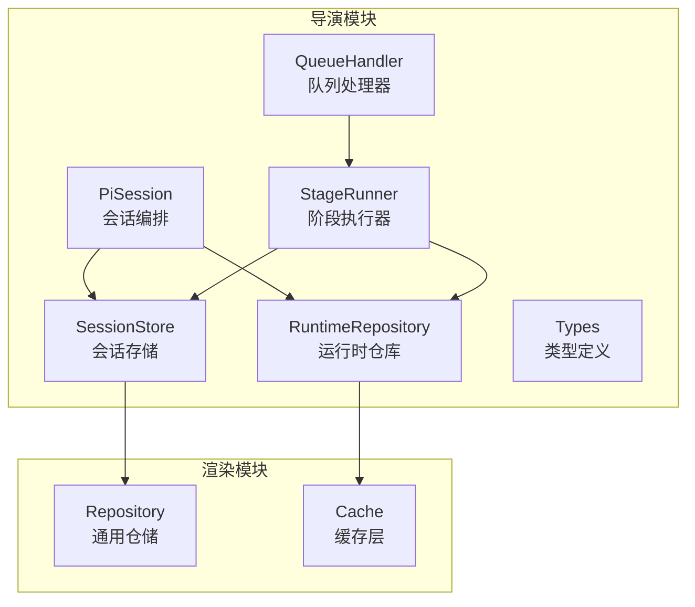
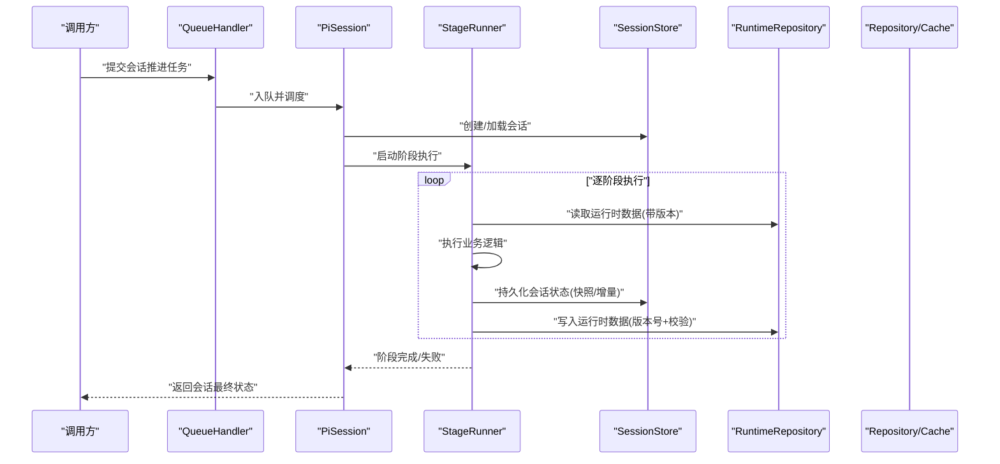
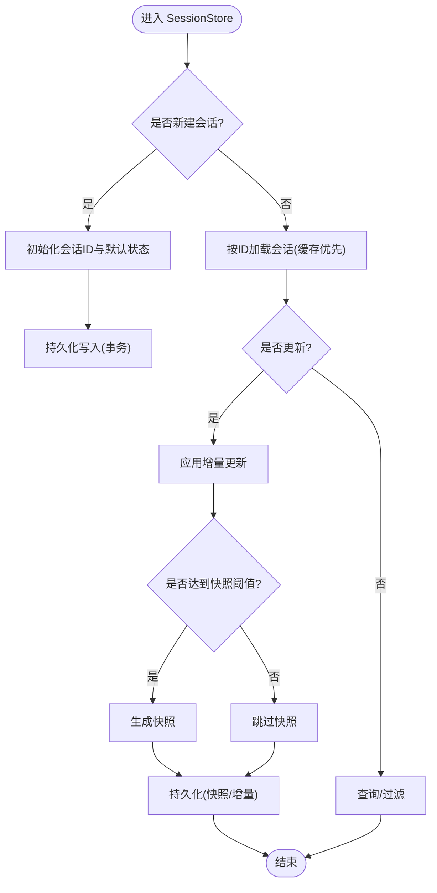
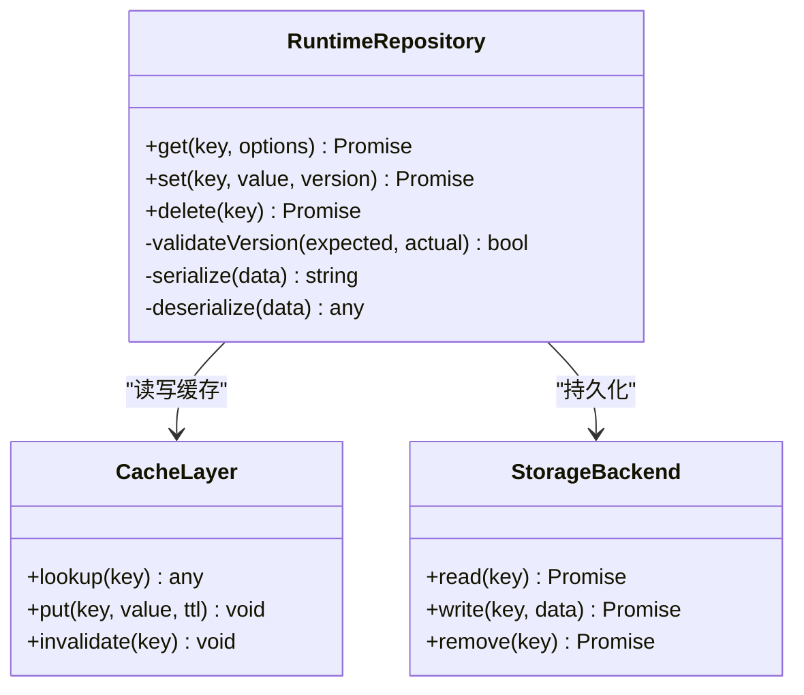
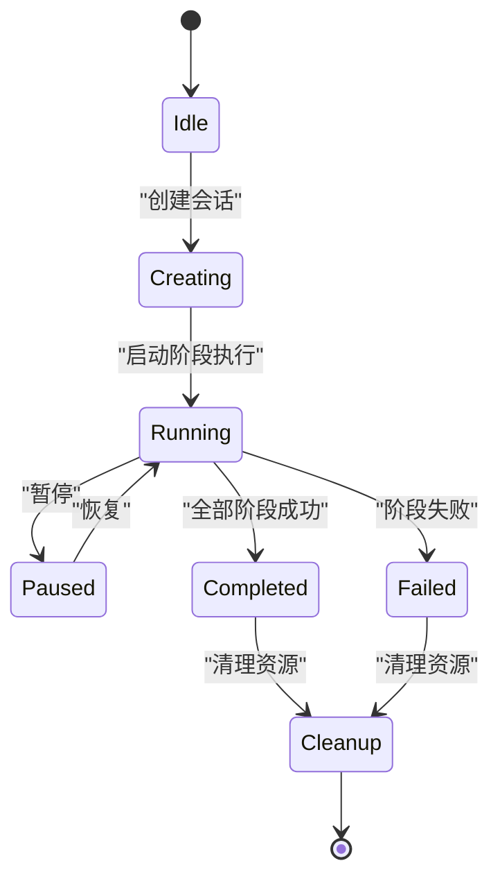
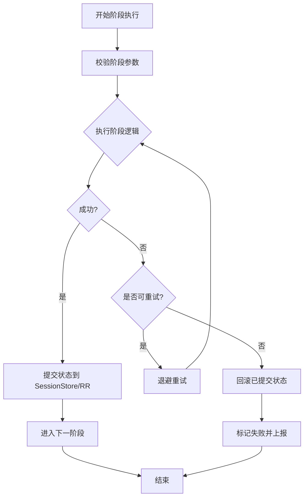
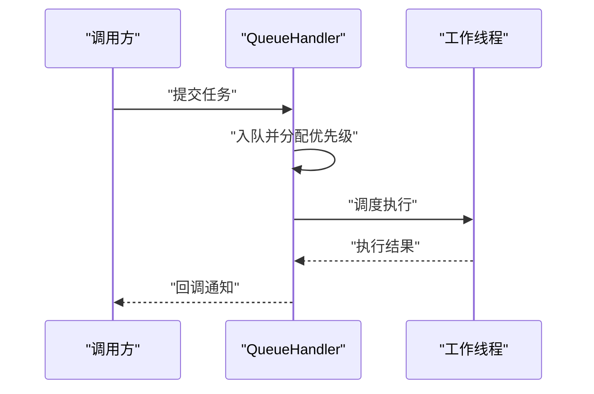
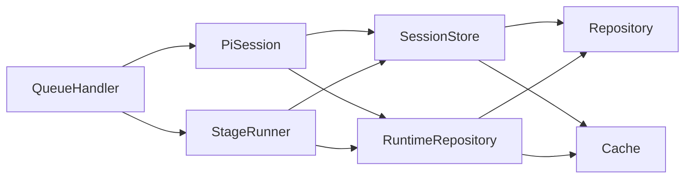

# 会话状态管理

<cite>
**本文引用的文件**   
- [session-store.ts](file://src/features/director/session-store.ts)
- [runtime-repository.ts](file://src/features/director/runtime-repository.ts)
- [pi-session.ts](file://src/features/director/pi-session.ts)
- [stage-runner.ts](file://src/features/director/stage-runner.ts)
- [queue-handler.ts](file://src/features/director/queue-handler.ts)
- [types.ts](file://src/features/director/types.ts)
- [repository.ts](file://src/features/render/repository.ts)
- [cache.ts](file://src/features/render/cache.ts)
</cite>

## 目录
1. [简介](#简介)
2. [项目结构](#项目结构)
3. [核心组件](#核心组件)
4. [架构总览](#架构总览)
5. [详细组件分析](#详细组件分析)
6. [依赖关系分析](#依赖关系分析)
7. [性能考量](#性能考量)
8. [故障排查指南](#故障排查指南)
9. [结论](#结论)
10. [附录](#附录) 

## 简介
本技术文档聚焦导演系统的会话状态管理，围绕 SessionStore 的状态持久化机制与 RuntimeRepository 的运行时数据管理模式展开。内容涵盖会话创建、更新、查询与清理策略；运行时数据的缓存、版本控制与一致性保证；会话生命周期管理、内存优化与存储策略选择；以及扩展数据存储与自定义持久化后端的实践方法。同时提供数据迁移、备份恢复与故障恢复机制说明，并给出状态同步与并发访问的安全保障方案。

## 项目结构
与“会话状态管理”直接相关的代码位于 features/director 模块中，核心包括：
- session-store.ts：会话状态存储与持久化接口实现
- runtime-repository.ts：运行时数据仓库（缓存、版本、一致性）
- pi-session.ts：会话生命周期编排（创建、推进、收尾）
- stage-runner.ts：阶段执行器（驱动会话推进）
- queue-handler.ts：队列处理器（并发与调度）
- types.ts：类型定义（会话、运行时数据等）

此外，渲染模块中的 repository.ts 与 cache.ts 为通用仓储与缓存能力，可作为持久化与缓存扩展的参考实现。

**图示来源** 
- [session-store.ts:1-200](file://src/features/director/session-store.ts#L1-L200)
- [runtime-repository.ts:1-200](file://src/features/director/runtime-repository.ts#L1-L200)
- [pi-session.ts:1-200](file://src/features/director/pi-session.ts#L1-L200)
- [stage-runner.ts:1-200](file://src/features/director/stage-runner.ts#L1-L200)
- [queue-handler.ts:1-200](file://src/features/director/queue-handler.ts#L1-L200)
- [types.ts:1-200](file://src/features/director/types.ts#L1-L200)
- [repository.ts:1-200](file://src/features/render/repository.ts#L1-L200)
- [cache.ts:1-200](file://src/features/render/cache.ts#L1-L200)

**章节来源**
- [session-store.ts:1-200](file://src/features/director/session-store.ts#L1-L200)
- [runtime-repository.ts:1-200](file://src/features/director/runtime-repository.ts#L1-L200)
- [pi-session.ts:1-200](file://src/features/director/pi-session.ts#L1-L200)
- [stage-runner.ts:1-200](file://src/features/director/stage-runner.ts#L1-L200)
- [queue-handler.ts:1-200](file://src/features/director/queue-handler.ts#L1-L200)
- [types.ts:1-200](file://src/features/director/types.ts#L1-L200)
- [repository.ts:1-200](file://src/features/render/repository.ts#L1-L200)
- [cache.ts:1-200](file://src/features/render/cache.ts#L1-L200)

## 核心组件
- SessionStore：负责会话状态的创建、更新、查询与清理，提供事务性写入与快照能力，支持多后端（内存、文件系统、数据库）。
- RuntimeRepository：管理运行时数据（如中间产物、指标、上下文），具备缓存、版本控制与一致性校验，确保读取一致性与写时幂等。
- PiSession：会话编排器，协调 StageRunner 推进各阶段，维护会话生命周期状态机。
- StageRunner：按阶段顺序执行任务，处理错误回滚与重试，与 SessionStore/RR 交互以持久化中间结果。
- QueueHandler：对会话推进进行排队与限流，避免并发冲突，保证同一会话串行化执行。
- Types：统一会话、运行时数据、阶段结果等类型契约，便于扩展与校验。

**章节来源**
- [session-store.ts:1-200](file://src/features/director/session-store.ts#L1-L200)
- [runtime-repository.ts:1-200](file://src/features/director/runtime-repository.ts#L1-L200)
- [pi-session.ts:1-200](file://src/features/director/pi-session.ts#L1-L200)
- [stage-runner.ts:1-200](file://src/features/director/stage-runner.ts#L1-L200)
- [queue-handler.ts:1-200](file://src/features/director/queue-handler.ts#L1-L200)
- [types.ts:1-200](file://src/features/director/types.ts#L1-L200)

## 架构总览
下图展示了会话推进过程中各组件的交互关系与数据流向。

**图示来源** 
- [queue-handler.ts:1-200](file://src/features/director/queue-handler.ts#L1-L200)
- [pi-session.ts:1-200](file://src/features/director/pi-session.ts#L1-L200)
- [stage-runner.ts:1-200](file://src/features/director/stage-runner.ts#L1-L200)
- [session-store.ts:1-200](file://src/features/director/session-store.ts#L1-L200)
- [runtime-repository.ts:1-200](file://src/features/director/runtime-repository.ts#L1-L200)
- [repository.ts:1-200](file://src/features/render/repository.ts#L1-L200)
- [cache.ts:1-200](file://src/features/render/cache.ts#L1-L200)

## 详细组件分析

### SessionStore 会话持久化机制
- 会话创建：生成唯一会话ID，初始化默认状态与元数据，写入持久化后端（支持内存/文件/DB）。
- 会话更新：采用增量更新与快照结合的策略，关键节点生成快照，减少后续恢复成本。
- 会话查询：提供按ID、状态、时间范围等条件查询，支持分页与索引优化。
- 清理策略：基于过期时间与引用计数，定期清理无用会话与中间产物，释放资源。
- 事务与一致性：写入操作封装为事务，失败回滚；快照与增量日志配合保证可恢复性。
- 扩展点：通过抽象后端接口，替换或新增持久化实现（如对象存储、分布式KV）。

**图示来源** 
- [session-store.ts:1-200](file://src/features/director/session-store.ts#L1-L200)

**章节来源**
- [session-store.ts:1-200](file://src/features/director/session-store.ts#L1-L200)

### RuntimeRepository 运行时数据管理
- 数据缓存：读路径优先命中缓存，未命中则回源并回填；支持TTL与失效策略。
- 版本控制：每个键值附带版本号，写操作需携带期望版本，避免覆盖冲突。
- 一致性保证：读一致性通过版本号校验；写幂等通过版本号与哈希校验。
- 数据模型：结构化存储中间产物、指标与上下文，支持序列化与反序列化。
- 扩展点：可替换底层存储（内存、文件、数据库），并提供迁移工具。

**图示来源** 
- [runtime-repository.ts:1-200](file://src/features/director/runtime-repository.ts#L1-L200)
- [cache.ts:1-200](file://src/features/render/cache.ts#L1-L200)
- [repository.ts:1-200](file://src/features/render/repository.ts#L1-L200)

**章节来源**
- [runtime-repository.ts:1-200](file://src/features/director/runtime-repository.ts#L1-L200)
- [cache.ts:1-200](file://src/features/render/cache.ts#L1-L200)
- [repository.ts:1-200](file://src/features/render/repository.ts#L1-L200)

### PiSession 会话生命周期管理
- 状态机：Idle → Creating → Running → Paused → Completed/Failed → Cleanup。
- 编排流程：创建会话 → 启动阶段执行器 → 监听阶段结果 → 异常处理与重试 → 收尾清理。
- 并发控制：同一会话串行化执行，跨会话并行；队列限流防止过载。
- 资源管理：阶段间共享上下文，完成后释放临时资源，避免泄漏。

**图示来源** 
- [pi-session.ts:1-200](file://src/features/director/pi-session.ts#L1-L200)

**章节来源**
- [pi-session.ts:1-200](file://src/features/director/pi-session.ts#L1-L200)

### StageRunner 阶段执行与回滚
- 阶段顺序：按配置顺序执行，支持分支与条件执行。
- 错误处理：捕获异常，记录错误上下文，支持重试与补偿。
- 状态同步：每阶段完成后更新会话状态与运行时数据，确保一致性。
- 资源隔离：阶段内临时数据隔离，失败不影响其他阶段。

**图示来源** 
- [stage-runner.ts:1-200](file://src/features/director/stage-runner.ts#L1-L200)

**章节来源**
- [stage-runner.ts:1-200](file://src/features/director/stage-runner.ts#L1-L200)

### QueueHandler 并发与调度
- 队列模型：FIFO 队列，支持优先级与超时。
- 并发控制：限制并发数，避免资源争用。
- 任务生命周期：入队 → 调度 → 执行 → 完成/失败 → 清理。
- 监控与告警：统计队列长度、延迟、失败率。

**图示来源** 
- [queue-handler.ts:1-200](file://src/features/director/queue-handler.ts#L1-L200)

**章节来源**
- [queue-handler.ts:1-200](file://src/features/director/queue-handler.ts#L1-L200)

### Types 类型契约
- 会话类型：包含ID、状态、元数据、阶段进度等。
- 运行时数据类型：中间产物、指标、上下文结构。
- 阶段结果类型：成功/失败、错误信息、耗时等。
- 扩展建议：新增字段时保持向后兼容，使用可选字段与默认值。

**章节来源**
- [types.ts:1-200](file://src/features/director/types.ts#L1-L200)

## 依赖关系分析
- SessionStore 依赖 Repository/Cache 作为持久化与缓存后端。
- RuntimeRepository 依赖 Cache 与 StorageBackend 实现读写分离与一致性。
- PiSession 依赖 SessionStore 与 RuntimeRepository 进行状态与数据管理。
- StageRunner 依赖 SessionStore 与 RuntimeRepository 进行状态同步与数据写入。
- QueueHandler 依赖 StageRunner 与 PiSession 进行任务调度与执行。

**图示来源** 
- [session-store.ts:1-200](file://src/features/director/session-store.ts#L1-L200)
- [runtime-repository.ts:1-200](file://src/features/director/runtime-repository.ts#L1-L200)
- [pi-session.ts:1-200](file://src/features/director/pi-session.ts#L1-L200)
- [stage-runner.ts:1-200](file://src/features/director/stage-runner.ts#L1-L200)
- [queue-handler.ts:1-200](file://src/features/director/queue-handler.ts#L1-L200)
- [repository.ts:1-200](file://src/features/render/repository.ts#L1-L200)
- [cache.ts:1-200](file://src/features/render/cache.ts#L1-L200)

**章节来源**
- [session-store.ts:1-200](file://src/features/director/session-store.ts#L1-L200)
- [runtime-repository.ts:1-200](file://src/features/director/runtime-repository.ts#L1-L200)
- [pi-session.ts:1-200](file://src/features/director/pi-session.ts#L1-L200)
- [stage-runner.ts:1-200](file://src/features/director/stage-runner.ts#L1-L200)
- [queue-handler.ts:1-200](file://src/features/director/queue-handler.ts#L1-L200)
- [repository.ts:1-200](file://src/features/render/repository.ts#L1-L200)
- [cache.ts:1-200](file://src/features/render/cache.ts#L1-L200)

## 性能考量
- 缓存命中率：合理设置 TTL 与失效策略，提升读性能。
- 快照频率：根据会话大小与更新频率调整快照阈值，平衡恢复时间与写入开销。
- 并发限流：限制队列并发数，避免资源争用与OOM。
- 内存优化：及时释放阶段临时数据，避免长会话内存增长。
- I/O 优化：批量写入与异步持久化，降低阻塞。

[本节为通用指导，不直接分析具体文件]

## 故障排查指南
- 会话卡住：检查队列长度与并发限制，确认是否有死锁或长时间运行阶段。
- 数据不一致：核对版本号与哈希校验，查看快照与增量日志是否完整。
- 持久化失败：检查后端连接与权限，确认事务回滚是否正确。
- 内存溢出：监控内存使用，定位大对象与未释放资源。
- 日志与监控：启用详细日志与指标采集，快速定位问题根因。

**章节来源**
- [session-store.ts:1-200](file://src/features/director/session-store.ts#L1-L200)
- [runtime-repository.ts:1-200](file://src/features/director/runtime-repository.ts#L1-L200)
- [queue-handler.ts:1-200](file://src/features/director/queue-handler.ts#L1-L200)

## 结论
SessionStore 与 RuntimeRepository 共同构建了导演系统会话状态管理的核心能力。通过合理的持久化策略、缓存与版本控制、并发与一致性保障，系统能够在高并发与复杂场景下保持稳定与高效。扩展自定义持久化后端与数据模型时，应遵循类型契约与一致性原则，确保系统可扩展与可维护。

[本节为总结，不直接分析具体文件]

## 附录
- 扩展会话数据存储：在 SessionStore 抽象后端接口中新增实现，适配目标存储（如对象存储、分布式KV），并在初始化时注入。
- 自定义持久化后端：实现 read/write/remove 接口，确保事务性与幂等性；提供迁移工具以支持数据格式演进。
- 数据迁移：使用版本化迁移脚本，逐步升级数据结构，保持向后兼容。
- 备份恢复：定期生成会话快照与运行时数据快照，支持按时间点恢复。
- 故障恢复：基于快照与增量日志重建状态，确保服务可用性。
- 状态同步与并发安全：通过版本号与CAS操作保证一致性；使用队列串行化同一会话的写入。

**章节来源**
- [session-store.ts:1-200](file://src/features/director/session-store.ts#L1-L200)
- [runtime-repository.ts:1-200](file://src/features/director/runtime-repository.ts#L1-L200)
- [repository.ts:1-200](file://src/features/render/repository.ts#L1-L200)
- [cache.ts:1-200](file://src/features/render/cache.ts#L1-L200)