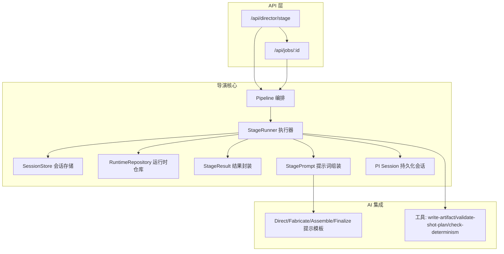
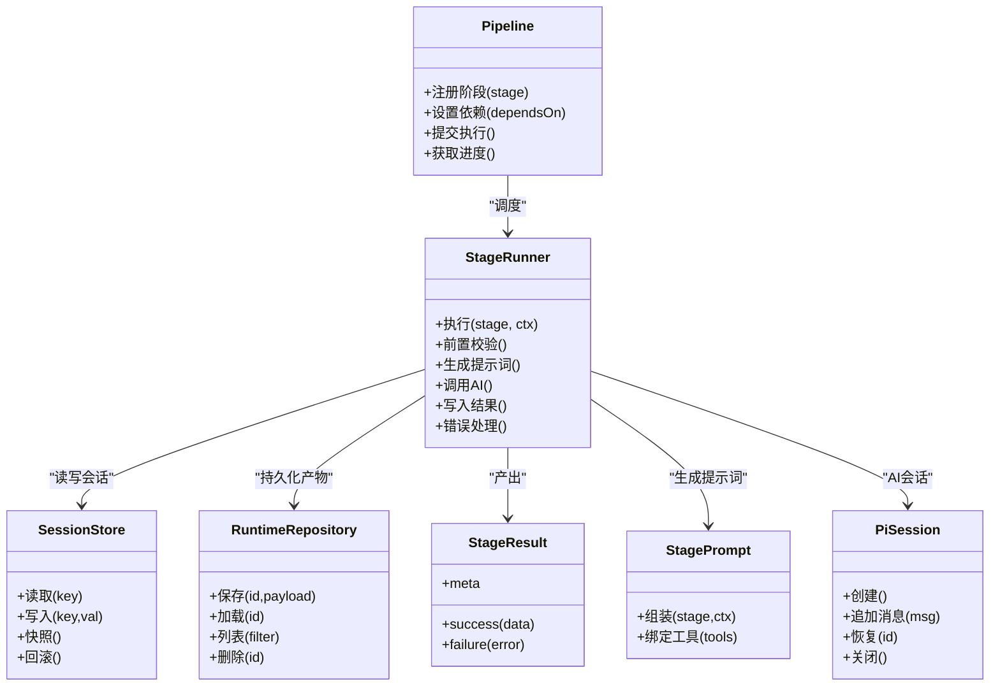
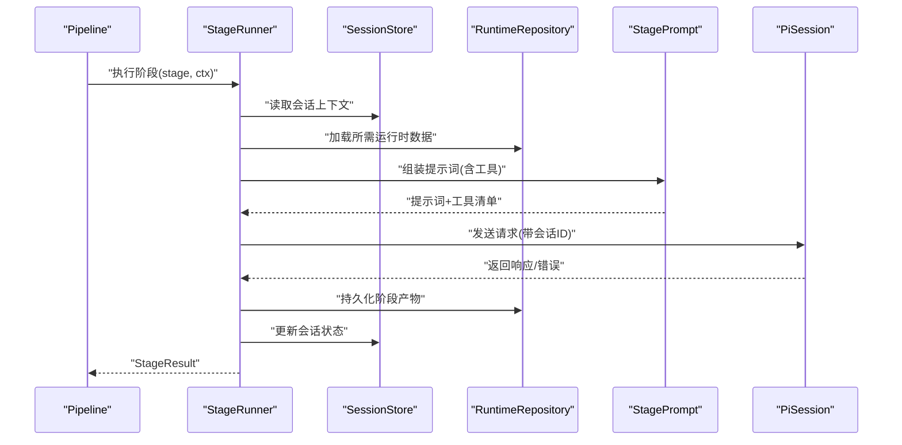
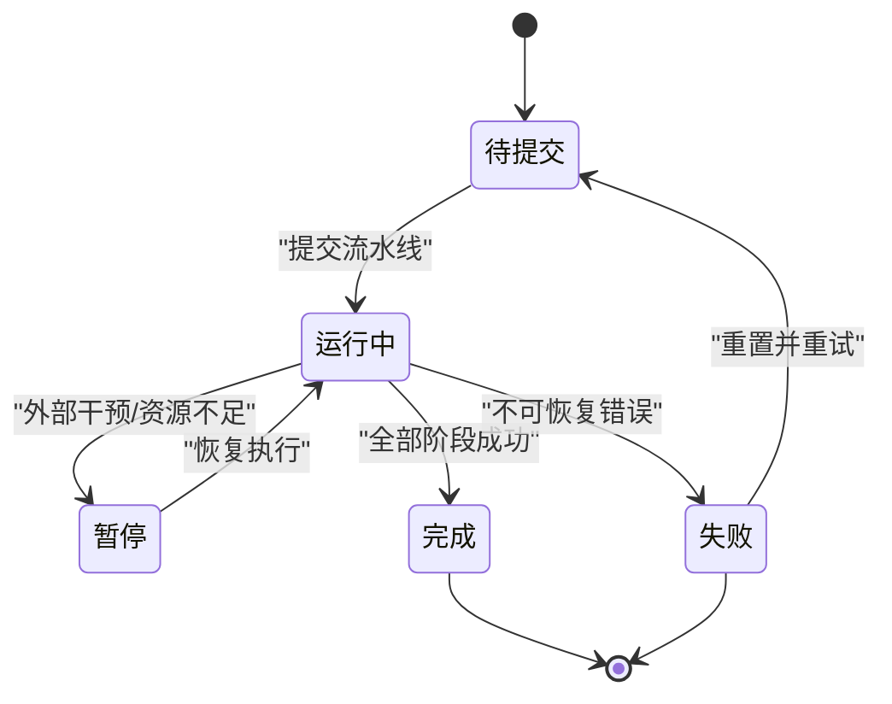
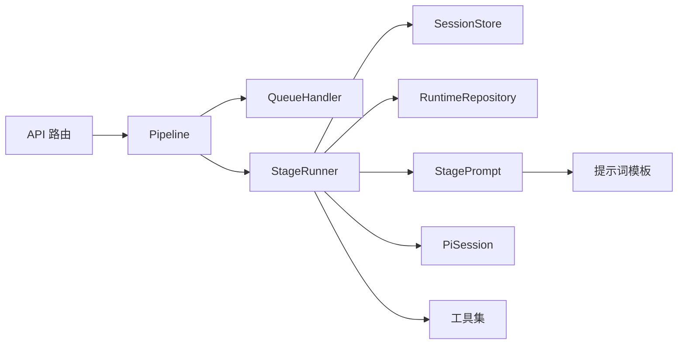

# 导演系统设计

<cite>
**本文引用的文件**   
- [src/features/director/pipeline.ts](file://src/features/director/pipeline.ts)
- [src/features/director/stage-runner.ts](file://src/features/director/stage-runner.ts)
- [src/features/director/session-store.ts](file://src/features/director/session-store.ts)
- [src/features/director/runtime-repository.ts](file://src/features/director/runtime-repository.ts)
- [src/features/director/types.ts](file://src/features/director/types.ts)
- [src/features/director/index.ts](file://src/features/director/index.ts)
- [src/features/director/stage-result.ts](file://src/features/director/stage-result.ts)
- [src/features/director/stage-prompt.ts](file://src/features/director/stage-prompt.ts)
- [src/features/director/pi-session.ts](file://src/features/director/pi-session.ts)
- [src/features/director/queue-handler.ts](file://src/features/director/queue-handler.ts)
- [src/app/api/director/stage/route.ts](file://src/app/api/director/stage/route.ts)
- [src/app/api/jobs/[id]/route.ts](file://src/app/api/jobs/[id]/route.ts)
- [src/features/director/prompts/direct.ts](file://src/features/director/prompts/direct.ts)
- [src/features/director/prompts/fabricate.ts](file://src/features/director/prompts/fabricate.ts)
- [src/features/director/prompts/assemble.ts](file://src/features/director/prompts/assemble.ts)
- [src/features/director/prompts/finalize.ts](file://src/features/director/prompts/finalize.ts)
- [src/features/director/prompts/ingest.ts](file://src/features/director/prompts/ingest.ts)
- [src/features/director/tools/write-artifact.ts](file://src/features/director/tools/write-artifact.ts)
- [src/features/director/tools/validate-shot-plan.ts](file://src/features/director/tools/validate-shot-plan.ts)
- [src/features/director/tools/check-determinism.ts](file://src/features/director/tools/check-determinism.ts)
</cite>

## 目录
1. [简介](#简介)
2. [项目结构](#项目结构)
3. [核心组件](#核心组件)
4. [架构总览](#架构总览)
5. [详细组件分析](#详细组件分析)
6. [依赖关系分析](#依赖关系分析)
7. [性能考量](#性能考量)
8. [故障排查指南](#故障排查指南)
9. [结论](#结论)
10. [附录](#附录)

## 简介
本设计文档面向 CodeVideoCanvas 的“导演系统”，聚焦于导演工作流编排引擎的架构与实现。内容涵盖：
- Pipeline 模式的工作流编排机制
- StageRunner 阶段执行器的工作原理
- SessionStore 会话状态管理机制
- RuntimeRepository 运行时数据管理
- 阶段定义、执行顺序与依赖关系
- 导演系统的状态机模型、错误处理策略与重试机制
- 如何定义新的制作阶段与执行自定义工作流
- 与 AI 服务集成的接口设计与数据流转过程

## 项目结构
导演系统位于 features/director 模块，围绕“阶段（Stage）—执行器（StageRunner）—流水线（Pipeline）—会话（Session）—运行时（Runtime）”展开。API 层通过 Next.js Route Handlers 暴露导演能力，供前端或外部系统调用。

图表来源
- [src/app/api/director/stage/route.ts](file://src/app/api/director/stage/route.ts)
- [src/app/api/jobs/[id]/route.ts](file://src/app/api/jobs/[id]/route.ts)
- [src/features/director/pipeline.ts](file://src/features/director/pipeline.ts)
- [src/features/director/stage-runner.ts](file://src/features/director/stage-runner.ts)
- [src/features/director/session-store.ts](file://src/features/director/session-store.ts)
- [src/features/director/runtime-repository.ts](file://src/features/director/runtime-repository.ts)
- [src/features/director/stage-result.ts](file://src/features/director/stage-result.ts)
- [src/features/director/stage-prompt.ts](file://src/features/director/stage-prompt.ts)
- [src/features/director/pi-session.ts](file://src/features/director/pi-session.ts)
- [src/features/director/prompts/direct.ts](file://src/features/director/prompts/direct.ts)
- [src/features/director/prompts/fabricate.ts](file://src/features/director/prompts/fabricate.ts)
- [src/features/director/prompts/assemble.ts](file://src/features/director/prompts/assemble.ts)
- [src/features/director/prompts/finalize.ts](file://src/features/director/prompts/finalize.ts)
- [src/features/director/prompts/ingest.ts](file://src/features/director/prompts/ingest.ts)
- [src/features/director/tools/write-artifact.ts](file://src/features/director/tools/write-artifact.ts)
- [src/features/director/tools/validate-shot-plan.ts](file://src/features/director/tools/validate-shot-plan.ts)
- [src/features/director/tools/check-determinism.ts](file://src/features/director/tools/check-determinism.ts)

章节来源
- [src/features/director/index.ts](file://src/features/director/index.ts)
- [src/app/api/director/stage/route.ts](file://src/app/api/director/stage/route.ts)
- [src/app/api/jobs/[id]/route.ts](file://src/app/api/jobs/[id]/route.ts)

## 核心组件
- Pipeline 编排：负责将多个 Stage 按拓扑顺序组织、调度与执行，支持并行与依赖约束。
- StageRunner 执行器：对单个 Stage 进行生命周期管理，包括前置校验、上下文注入、提示词生成、AI 调用、结果落盘与错误处理。
- SessionStore 会话存储：维护一次导演任务的全局会话状态，提供读写隔离与一致性保障。
- RuntimeRepository 运行时仓库：持久化与查询运行时产物（如分镜计划、中间产物、最终制品），保证可追溯与幂等。
- StageResult 结果封装：统一阶段输出结构，包含成功/失败分支、副作用记录与元数据。
- StagePrompt 提示词组装：根据当前阶段与上下文动态拼装提示词，并绑定可用工具。
- PI Session 持久化会话：对外部 AI 服务的长会话抽象，支持断点续跑与上下文恢复。

章节来源
- [src/features/director/pipeline.ts](file://src/features/director/pipeline.ts)
- [src/features/director/stage-runner.ts](file://src/features/director/stage-runner.ts)
- [src/features/director/session-store.ts](file://src/features/director/session-store.ts)
- [src/features/director/runtime-repository.ts](file://src/features/director/runtime-repository.ts)
- [src/features/director/stage-result.ts](file://src/features/director/stage-result.ts)
- [src/features/director/stage-prompt.ts](file://src/features/director/stage-prompt.ts)
- [src/features/director/pi-session.ts](file://src/features/director/pi-session.ts)

## 架构总览
导演系统采用“阶段化 + 流水线”的编排范式，结合“会话 + 运行时”的状态管理，形成高内聚、低耦合的可扩展架构。

图表来源
- [src/features/director/pipeline.ts](file://src/features/director/pipeline.ts)
- [src/features/director/stage-runner.ts](file://src/features/director/stage-runner.ts)
- [src/features/director/session-store.ts](file://src/features/director/session-store.ts)
- [src/features/director/runtime-repository.ts](file://src/features/director/runtime-repository.ts)
- [src/features/director/stage-result.ts](file://src/features/director/stage-result.ts)
- [src/features/director/stage-prompt.ts](file://src/features/director/stage-prompt.ts)
- [src/features/director/pi-session.ts](file://src/features/director/pi-session.ts)

## 详细组件分析

### Pipeline 编排引擎
- 职责
  - 声明式注册阶段与依赖关系
  - 构建有向无环图（DAG）并校验拓扑合法性
  - 按拓扑序调度 StageRunner，支持并发度控制
  - 聚合各阶段结果，提供进度与状态查询
- 关键流程
  - 初始化：收集所有已注册阶段，解析依赖，生成执行序列
  - 执行：按阶段就绪条件触发 StageRunner；失败时短路或按策略继续
  - 收尾：汇总结果、清理资源、更新全局状态
- 并发与容错
  - 基于队列与信号量控制并发
  - 支持阶段级重试与整体超时
  - 失败传播与部分成功报告

章节来源
- [src/features/director/pipeline.ts](file://src/features/director/pipeline.ts)
- [src/features/director/queue-handler.ts](file://src/features/director/queue-handler.ts)

### StageRunner 阶段执行器
- 职责
  - 单阶段生命周期管理：准备→执行→落盘→上报
  - 上下文装配：从 SessionStore 与 RuntimeRepository 拉取输入
  - 提示词生成：使用 StagePrompt 组合指令与工具
  - AI 调用：通过 PiSession 与外部服务交互
  - 结果封装：以 StageResult 返回成功/失败路径
- 执行时序

图表来源
- [src/features/director/stage-runner.ts](file://src/features/director/stage-runner.ts)
- [src/features/director/session-store.ts](file://src/features/director/session-store.ts)
- [src/features/director/runtime-repository.ts](file://src/features/director/runtime-repository.ts)
- [src/features/director/stage-prompt.ts](file://src/features/director/stage-prompt.ts)
- [src/features/director/pi-session.ts](file://src/features/director/pi-session.ts)
- [src/features/director/stage-result.ts](file://src/features/director/stage-result.ts)

章节来源
- [src/features/director/stage-runner.ts](file://src/features/director/stage-runner.ts)
- [src/features/director/stage-result.ts](file://src/features/director/stage-result.ts)

### SessionStore 会话状态管理
- 职责
  - 维护单次导演任务的会话键值空间
  - 提供原子写入、快照与回滚能力
  - 支持跨阶段共享上下文（如用户意图、中间摘要）
- 特性
  - 内存优先、可选持久化桥接
  - 版本化键名，避免覆盖冲突
  - 事务性批量更新（在 StageRunner 中协调）

章节来源
- [src/features/director/session-store.ts](file://src/features/director/session-store.ts)

### RuntimeRepository 运行时数据管理
- 职责
  - 持久化导演过程中的结构化产物（如分镜计划、素材清单、渲染配置）
  - 提供按 ID 的增删改查与过滤列表能力
  - 保证幂等写入（相同输入产生相同输出时可复用）
- 特性
  - 与 StageResult 对接，自动归档成功产物
  - 支持增量更新与差异对比
  - 与确定性检查工具联动，确保可复现

章节来源
- [src/features/director/runtime-repository.ts](file://src/features/director/runtime-repository.ts)
- [src/features/director/tools/check-determinism.ts](file://src/features/director/tools/check-determinism.ts)

### 阶段定义与执行顺序
- 阶段类型
  - 摄入（Ingest）：采集素材、解析元信息、生成初始清单
  - 指导（Direct）：依据意图生成高层创作决策
  - 制作（Fabricate）：细化到镜头/片段的生产计划
  - 组装（Assemble）：将多源产物整合为可渲染工件
  - 收尾（Finalize）：导出、校验与归档
- 依赖关系
  - Direct 依赖 Ingest 的输出
  - Fabricate 依赖 Direct 的决策
  - Assemble 依赖 Fabricate 的计划
  - Finalize 依赖 Assemble 的产物
- 执行顺序
  - 线性主链：Ingest → Direct → Fabricate → Assemble → Finalize
  - 可在特定阶段旁路插入验证/修复阶段（由 Pipeline 拓扑决定）

章节来源
- [src/features/director/prompts/ingest.ts](file://src/features/director/prompts/ingest.ts)
- [src/features/director/prompts/direct.ts](file://src/features/director/prompts/direct.ts)
- [src/features/director/prompts/fabricate.ts](file://src/features/director/prompts/fabricate.ts)
- [src/features/director/prompts/assemble.ts](file://src/features/director/prompts/assemble.ts)
- [src/features/director/prompts/finalize.ts](file://src/features/director/prompts/finalize.ts)

### 状态机模型
导演任务的生命周期采用有限状态机驱动，便于可视化与恢复。

[此图为概念性状态机，不直接映射具体源码文件]

### 错误处理与重试机制
- 错误分类
  - 可重试错误：网络抖动、限流、临时资源不可用
  - 不可重试错误：参数非法、阶段逻辑异常、数据不一致
- 策略
  - 指数退避 + 最大重试次数
  - 阶段级熔断：连续失败超过阈值则短路
  - 幂等保护：同一阶段多次执行需保证结果一致
- 观测
  - 记录错误码、上下文快照与堆栈摘要
  - 暴露进度与失败原因给 API 层

章节来源
- [src/features/director/stage-runner.ts](file://src/features/director/stage-runner.ts)
- [src/features/director/queue-handler.ts](file://src/features/director/queue-handler.ts)

### 与 AI 服务集成的接口设计与数据流转
- 接口边界
  - StagePrompt 负责将业务语义转换为 AI 可读的提示词
  - PiSession 负责与外部 AI 服务建立/维持会话
  - 工具层（Tools）作为 AI 可调用的函数集合，用于读写产物、校验计划等
- 数据流转
  - 上游阶段产物 → RuntimeRepository → StageRunner 读取
  - StagePrompt 拼接上下文与工具清单 → 发送给 AI
  - AI 返回结构化结果 → StageRunner 落盘并更新会话
- 典型工具
  - write-artifact：写入阶段产物
  - validate-shot-plan：校验分镜计划完整性
  - check-determinism：比对两次执行是否确定

章节来源
- [src/features/director/stage-prompt.ts](file://src/features/director/stage-prompt.ts)
- [src/features/director/pi-session.ts](file://src/features/director/pi-session.ts)
- [src/features/director/tools/write-artifact.ts](file://src/features/director/tools/write-artifact.ts)
- [src/features/director/tools/validate-shot-plan.ts](file://src/features/director/tools/validate-shot-plan.ts)
- [src/features/director/tools/check-determinism.ts](file://src/features/director/tools/check-determinism.ts)

### 如何定义新的制作阶段
- 步骤概览
  - 定义阶段元数据：名称、描述、依赖列表、输入/输出契约
  - 实现阶段处理器：继承 StageRunner 的执行约定，返回 StageResult
  - 注册到 Pipeline：声明依赖与执行顺序
  - 编写提示词模板：在 prompts 下新增对应模板
  - 如需 AI 工具：在 tools 下新增工具并在 StagePrompt 中绑定
- 参考路径
  - 阶段执行器约定：[src/features/director/stage-runner.ts](file://src/features/director/stage-runner.ts)
  - 结果封装：[src/features/director/stage-result.ts](file://src/features/director/stage-result.ts)
  - 提示词模板示例：[src/features/director/prompts/direct.ts](file://src/features/director/prompts/direct.ts)
  - 工具示例：[src/features/director/tools/write-artifact.ts](file://src/features/director/tools/write-artifact.ts)

章节来源
- [src/features/director/stage-runner.ts](file://src/features/director/stage-runner.ts)
- [src/features/director/stage-result.ts](file://src/features/director/stage-result.ts)
- [src/features/director/prompts/direct.ts](file://src/features/director/prompts/direct.ts)
- [src/features/director/tools/write-artifact.ts](file://src/features/director/tools/write-artifact.ts)

### 如何执行自定义工作流
- 步骤概览
  - 实例化 Pipeline，注册自定义阶段与依赖
  - 设置并发度、超时与重试策略
  - 提交执行并监听进度/结果
  - 通过 API 层发起任务与查询状态
- 参考路径
  - 流水线入口：[src/features/director/pipeline.ts](file://src/features/director/pipeline.ts)
  - 队列与调度：[src/features/director/queue-handler.ts](file://src/features/director/queue-handler.ts)
  - 阶段 API：[src/app/api/director/stage/route.ts](file://src/app/api/director/stage/route.ts)
  - 作业查询：[src/app/api/jobs/[id]/route.ts](file://src/app/api/jobs/[id]/route.ts)

章节来源
- [src/features/director/pipeline.ts](file://src/features/director/pipeline.ts)
- [src/features/director/queue-handler.ts](file://src/features/director/queue-handler.ts)
- [src/app/api/director/stage/route.ts](file://src/app/api/director/stage/route.ts)
- [src/app/api/jobs/[id]/route.ts](file://src/app/api/jobs/[id]/route.ts)

## 依赖关系分析
- 内部依赖
  - StageRunner 强依赖 SessionStore、RuntimeRepository、StagePrompt、PiSession
  - Pipeline 依赖 QueueHandler 进行并发调度
  - API 路由仅依赖 Pipeline 与 Job 查询，保持薄边界
- 外部依赖
  - AI 服务通过 PiSession 抽象，屏蔽底层协议差异
  - 工具层可访问文件系统/对象存储（由 RuntimeRepository 抽象）

图表来源
- [src/app/api/director/stage/route.ts](file://src/app/api/director/stage/route.ts)
- [src/app/api/jobs/[id]/route.ts](file://src/app/api/jobs/[id]/route.ts)
- [src/features/director/pipeline.ts](file://src/features/director/pipeline.ts)
- [src/features/director/queue-handler.ts](file://src/features/director/queue-handler.ts)
- [src/features/director/stage-runner.ts](file://src/features/director/stage-runner.ts)
- [src/features/director/session-store.ts](file://src/features/director/session-store.ts)
- [src/features/director/runtime-repository.ts](file://src/features/director/runtime-repository.ts)
- [src/features/director/stage-prompt.ts](file://src/features/director/stage-prompt.ts)
- [src/features/director/pi-session.ts](file://src/features/director/pi-session.ts)
- [src/features/director/prompts/direct.ts](file://src/features/director/prompts/direct.ts)
- [src/features/director/tools/write-artifact.ts](file://src/features/director/tools/write-artifact.ts)

章节来源
- [src/features/director/index.ts](file://src/features/director/index.ts)

## 性能考量
- 并发控制
  - 合理设置 Pipeline 并发度，避免 IO/AI 调用拥塞
  - 对 CPU 密集阶段限制并行，IO 密集阶段提高并行
- 缓存与幂等
  - 利用 RuntimeRepository 的幂等写入减少重复计算
  - 对确定性阶段启用缓存命中跳过
- 批处理与流式
  - 大产物采用分块写入与流式传输
  - 对 AI 响应采用增量消费，降低内存峰值
- 监控与可观测性
  - 记录阶段耗时、错误率与重试次数
  - 暴露关键指标以便容量规划与告警

[本节为通用性能建议，不直接分析具体文件]

## 故障排查指南
- 常见问题定位
  - 阶段失败：查看 StageResult 的错误分支与上下文快照
  - 会话不一致：核对 SessionStore 的版本键与快照时间戳
  - 运行时缺失：确认 RuntimeRepository 的产物是否存在且完整
  - AI 调用异常：检查 PiSession 的会话 ID 与消息历史
- 诊断手段
  - 开启调试日志，记录提示词与工具调用轨迹
  - 使用 check-determinism 工具对比两次执行差异
  - 通过 /api/jobs/:id 查询作业状态与阶段明细
- 恢复策略
  - 针对可重试错误执行自动重试
  - 针对不可恢复错误提供人工介入入口与回滚选项

章节来源
- [src/features/director/stage-result.ts](file://src/features/director/stage-result.ts)
- [src/features/director/session-store.ts](file://src/features/director/session-store.ts)
- [src/features/director/runtime-repository.ts](file://src/features/director/runtime-repository.ts)
- [src/features/director/pi-session.ts](file://src/features/director/pi-session.ts)
- [src/features/director/tools/check-determinism.ts](file://src/features/director/tools/check-determinism.ts)
- [src/app/api/jobs/[id]/route.ts](file://src/app/api/jobs/[id]/route.ts)

## 结论
导演系统以 Pipeline 为核心编排器，结合 StageRunner、SessionStore 与 RuntimeRepository 形成稳定可扩展的工作流引擎。通过明确的阶段契约、幂等产物与健壮的错误/重试机制，系统能够可靠地驱动复杂的多阶段制作流程，并与 AI 服务无缝集成。未来可在可观测性、弹性伸缩与更丰富的工具生态上持续演进。

## 附录
- 术语
  - 阶段（Stage）：工作流中的最小可执行单元
  - 流水线（Pipeline）：阶段的编排与调度容器
  - 会话（Session）：单次任务的全局上下文
  - 运行时（Runtime）：任务执行过程中产生的结构化数据
- 参考入口
  - 功能索引：[src/features/director/index.ts](file://src/features/director/index.ts)
  - 阶段 API：[src/app/api/director/stage/route.ts](file://src/app/api/director/stage/route.ts)
  - 作业查询：[src/app/api/jobs/[id]/route.ts](file://src/app/api/jobs/[id]/route.ts)