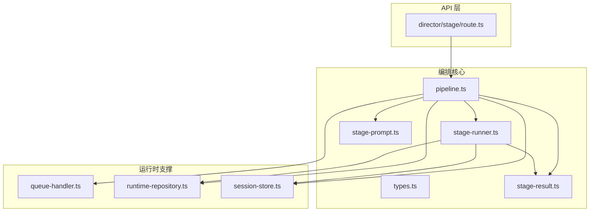
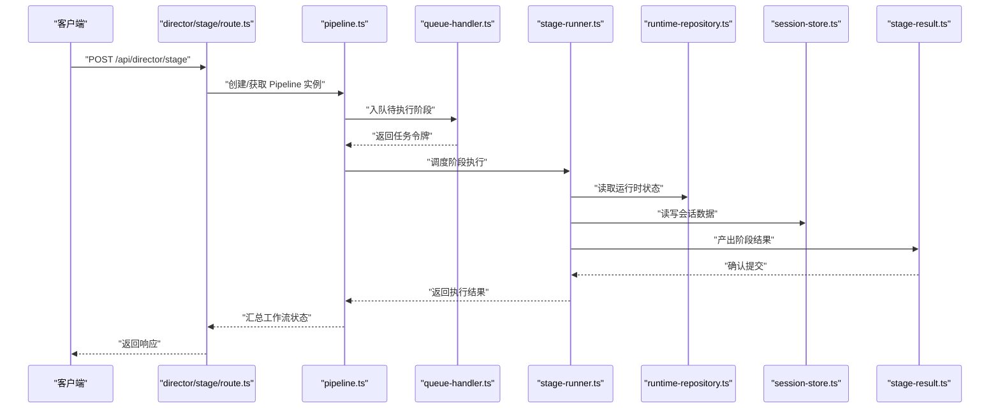
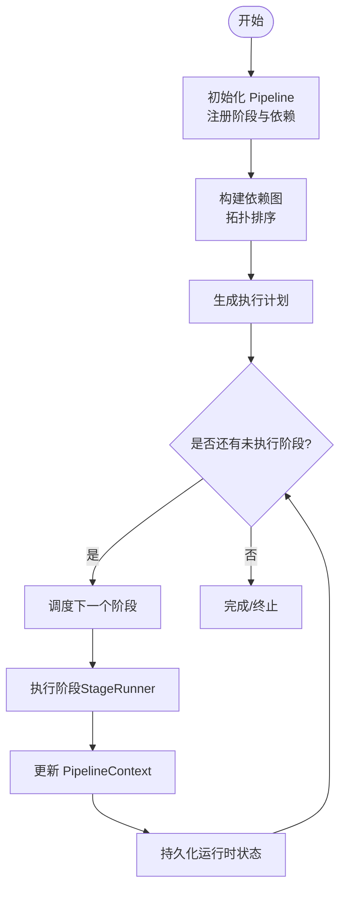
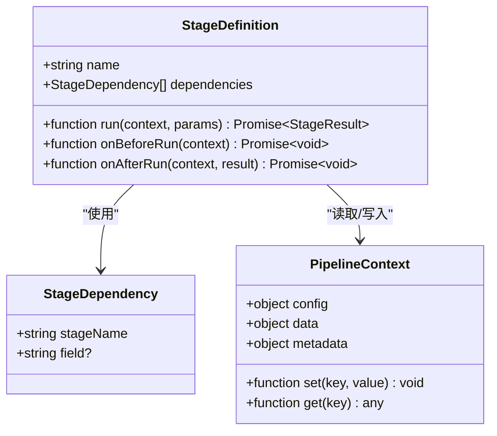
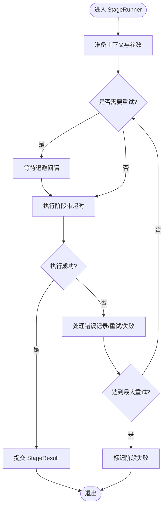
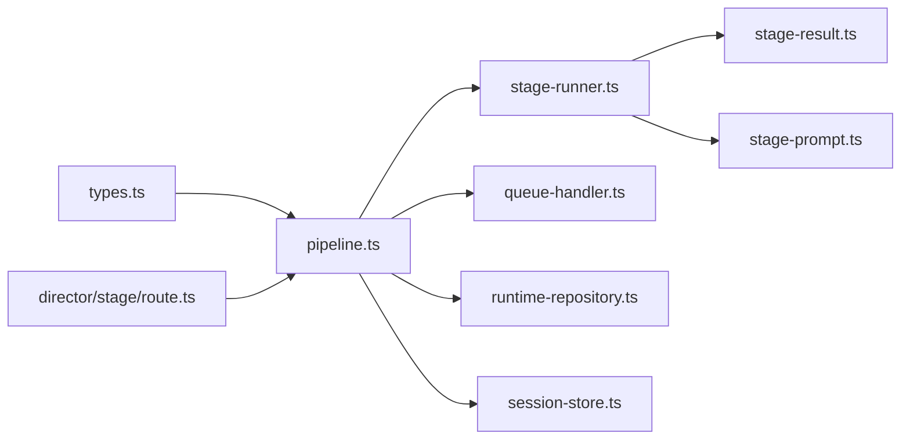

# 工作流编排引擎

<cite>
**本文引用的文件**   
- [src/features/director/pipeline.ts](file://src/features/director/pipeline.ts)
- [src/features/director/stage-runner.ts](file://src/features/director/stage-runner.ts)
- [src/features/director/types.ts](file://src/features/director/types.ts)
- [src/features/director/queue-handler.ts](file://src/features/director/queue-handler.ts)
- [src/features/director/runtime-repository.ts](file://src/features/director/runtime-repository.ts)
- [src/features/director/session-store.ts](file://src/features/director/session-store.ts)
- [src/features/director/stage-result.ts](file://src/features/director/stage-result.ts)
- [src/features/director/stage-prompt.ts](file://src/features/director/stage-prompt.ts)
- [src/app/api/director/stage/route.ts](file://src/app/api/director/stage/route.ts)
</cite>

## 目录
1. [简介](#简介)
2. [项目结构](#项目结构)
3. [核心组件](#核心组件)
4. [架构总览](#架构总览)
5. [详细组件分析](#详细组件分析)
6. [依赖关系分析](#依赖关系分析)
7. [性能考量](#性能考量)
8. [故障排查指南](#故障排查指南)
9. [结论](#结论)
10. [附录](#附录)

## 简介
本技术文档面向导演系统的工作流编排引擎，聚焦于 Pipeline 模式的核心实现与扩展方式。文档将深入解释：
- 工作流的定义、阶段注册机制与执行流程控制
- StageDefinition 接口设计、StageDependency 依赖管理与 PipelineContext 上下文传递
- 工作流的生命周期状态管理（启动、暂停、恢复、终止）
- 错误处理策略、重试机制与超时控制
- 如何定义新的工作流类型与配置执行参数
- 性能优化建议与最佳实践

## 项目结构
导演系统的工作流编排相关代码集中在 features/director 模块中，并通过 API 路由暴露给上层调用。关键目录与职责如下：
- src/features/director/pipeline.ts：Pipeline 编排器，负责阶段注册、依赖解析、执行调度与上下文传播
- src/features/director/stage-runner.ts：阶段运行器，封装单个阶段的执行、错误处理、重试与超时
- src/features/director/types.ts：类型定义，包含 StageDefinition、StageDependency、PipelineContext 等核心类型
- src/features/director/queue-handler.ts：队列处理器，负责任务入队、出队与并发控制
- src/features/director/runtime-repository.ts：运行时仓库，持久化或缓存运行时状态（如会话、进度）
- src/features/director/session-store.ts：会话存储，维护会话级数据与生命周期
- src/features/director/stage-result.ts：阶段结果模型与提交逻辑
- src/features/director/stage-prompt.ts：阶段提示生成与注入（用于 AI 驱动的阶段）
- src/app/api/director/stage/route.ts：HTTP 入口，接收外部请求并触发编排流程

图表来源
- [src/app/api/director/stage/route.ts](file://src/app/api/director/stage/route.ts)
- [src/features/director/pipeline.ts](file://src/features/director/pipeline.ts)
- [src/features/director/stage-runner.ts](file://src/features/director/stage-runner.ts)
- [src/features/director/types.ts](file://src/features/director/types.ts)
- [src/features/director/stage-result.ts](file://src/features/director/stage-result.ts)
- [src/features/director/stage-prompt.ts](file://src/features/director/stage-prompt.ts)
- [src/features/director/queue-handler.ts](file://src/features/director/queue-handler.ts)
- [src/features/director/runtime-repository.ts](file://src/features/director/runtime-repository.ts)
- [src/features/director/session-store.ts](file://src/features/director/session-store.ts)

章节来源
- [src/features/director/pipeline.ts](file://src/features/director/pipeline.ts)
- [src/features/director/stage-runner.ts](file://src/features/director/stage-runner.ts)
- [src/features/director/types.ts](file://src/features/director/types.ts)
- [src/features/director/queue-handler.ts](file://src/features/director/queue-handler.ts)
- [src/features/director/runtime-repository.ts](file://src/features/director/runtime-repository.ts)
- [src/features/director/session-store.ts](file://src/features/director/session-store.ts)
- [src/features/director/stage-result.ts](file://src/features/director/stage-result.ts)
- [src/features/director/stage-prompt.ts](file://src/features/director/stage-prompt.ts)
- [src/app/api/director/stage/route.ts](file://src/app/api/director/stage/route.ts)

## 核心组件
本节概述各核心组件的职责与交互关系，为后续深入分析奠定基础。

- Pipeline（编排器）
  - 负责阶段注册、依赖图构建、拓扑排序与执行调度
  - 维护 PipelineContext，贯穿整个工作流的数据与元信息
  - 协调 StageRunner、QueueHandler、RuntimeRepository、SessionStore 等子系统

- StageRunner（阶段运行器）
  - 执行具体 StageDefinition 的 run 方法
  - 统一处理错误、重试、超时与日志
  - 产出 StageResult 并提交到结果管理器

- Types（类型定义）
  - StageDefinition：阶段契约，定义输入输出、依赖、执行函数与可选钩子
  - StageDependency：声明阶段间的依赖关系
  - PipelineContext：工作流上下文，承载共享数据、配置与状态

- QueueHandler（队列处理器）
  - 提供任务入队/出队能力，支持并发度限制与背压
  - 与 Pipeline 协作，按依赖顺序调度阶段执行

- RuntimeRepository（运行时仓库）
  - 持久化或缓存运行时状态（例如进度、中间产物位置）
  - 保证工作流可恢复性

- SessionStore（会话存储）
  - 维护会话级数据，隔离不同工作流实例的状态

- StageResult（阶段结果）
  - 标准化阶段输出，支持成功/失败语义与附加元数据

- StagePrompt（阶段提示）
  - 为 AI 驱动的阶段生成提示词，注入上下文变量

章节来源
- [src/features/director/pipeline.ts](file://src/features/director/pipeline.ts)
- [src/features/director/stage-runner.ts](file://src/features/director/stage-runner.ts)
- [src/features/director/types.ts](file://src/features/director/types.ts)
- [src/features/director/queue-handler.ts](file://src/features/director/queue-handler.ts)
- [src/features/director/runtime-repository.ts](file://src/features/director/runtime-repository.ts)
- [src/features/director/session-store.ts](file://src/features/director/session-store.ts)
- [src/features/director/stage-result.ts](file://src/features/director/stage-result.ts)
- [src/features/director/stage-prompt.ts](file://src/features/director/stage-prompt.ts)

## 架构总览
下图展示了从 HTTP 请求到阶段执行的端到端流程，以及各组件之间的依赖关系。

图表来源
- [src/app/api/director/stage/route.ts](file://src/app/api/director/stage/route.ts)
- [src/features/director/pipeline.ts](file://src/features/director/pipeline.ts)
- [src/features/director/queue-handler.ts](file://src/features/director/queue-handler.ts)
- [src/features/director/stage-runner.ts](file://src/features/director/stage-runner.ts)
- [src/features/director/runtime-repository.ts](file://src/features/director/runtime-repository.ts)
- [src/features/director/session-store.ts](file://src/features/director/session-store.ts)
- [src/features/director/stage-result.ts](file://src/features/director/stage-result.ts)

## 详细组件分析

### Pipeline 编排器（pipeline.ts）
- 职责
  - 阶段注册：收集所有 StageDefinition 并建立依赖图
  - 依赖解析：进行拓扑排序，确保阶段按依赖顺序执行
  - 执行调度：结合 QueueHandler 控制并发与顺序
  - 上下文管理：维护 PipelineContext，向各阶段注入必要数据
  - 生命周期：管理工作流状态（启动、暂停、恢复、终止）

- 关键流程
  - 初始化：加载配置、注册阶段、构建依赖图
  - 启动：根据依赖图生成执行计划，依次调度阶段
  - 暂停/恢复：保存当前执行点与上下文，允许中断后继续
  - 终止：清理资源、提交最终结果、更新持久化状态

图表来源
- [src/features/director/pipeline.ts](file://src/features/director/pipeline.ts)
- [src/features/director/queue-handler.ts](file://src/features/director/queue-handler.ts)
- [src/features/director/stage-runner.ts](file://src/features/director/stage-runner.ts)
- [src/features/director/runtime-repository.ts](file://src/features/director/runtime-repository.ts)

章节来源
- [src/features/director/pipeline.ts](file://src/features/director/pipeline.ts)

### StageDefinition 接口设计与 StageDependency 管理（types.ts）
- StageDefinition
  - 定义阶段名称、输入输出类型、依赖列表、执行函数与可选钩子（如前置校验、后置清理）
  - 支持声明式配置，便于扩展新工作流类型

- StageDependency
  - 描述阶段间依赖关系，支持单依赖与多依赖
  - 用于构建 DAG（有向无环图），避免循环依赖

- PipelineContext
  - 贯穿工作流的共享上下文，包含配置、中间数据、状态标记与元信息
  - 由 Pipeline 在阶段执行前注入，并在阶段完成后合并更新

图表来源
- [src/features/director/types.ts](file://src/features/director/types.ts)

章节来源
- [src/features/director/types.ts](file://src/features/director/types.ts)

### StageRunner 阶段运行器（stage-runner.ts）
- 职责
  - 执行 StageDefinition.run，统一捕获异常
  - 实现重试与退避策略，支持最大重试次数与间隔
  - 支持超时控制，防止阶段长时间挂起
  - 产出 StageResult 并交由结果管理器提交

- 关键流程
  - 准备：加载上下文、校验参数、计算重试策略
  - 执行：带超时的阶段执行
  - 容错：捕获错误、记录日志、触发重试或失败分支
  - 提交：将结果写入 StageResult 并持久化

图表来源
- [src/features/director/stage-runner.ts](file://src/features/director/stage-runner.ts)
- [src/features/director/stage-result.ts](file://src/features/director/stage-result.ts)

章节来源
- [src/features/director/stage-runner.ts](file://src/features/director/stage-runner.ts)
- [src/features/director/stage-result.ts](file://src/features/director/stage-result.ts)

### 队列处理器（queue-handler.ts）
- 职责
  - 提供任务入队/出队接口
  - 控制并发度，避免过载
  - 与 Pipeline 协作，按依赖顺序调度阶段

- 特性
  - 支持优先级队列与背压
  - 提供任务令牌，便于追踪与取消

章节来源
- [src/features/director/queue-handler.ts](file://src/features/director/queue-handler.ts)

### 运行时仓库与会话存储（runtime-repository.ts、session-store.ts）
- RuntimeRepository
  - 持久化工作流进度、中间产物路径、阶段结果摘要
  - 支持断点续跑与状态回滚

- SessionStore
  - 维护会话级数据，隔离不同工作流实例
  - 提供快速读写的内存或持久化存储

章节来源
- [src/features/director/runtime-repository.ts](file://src/features/director/runtime-repository.ts)
- [src/features/director/session-store.ts](file://src/features/director/session-store.ts)

### 阶段结果与提示（stage-result.ts、stage-prompt.ts）
- StageResult
  - 标准化阶段输出，包括成功/失败状态、错误信息与元数据
  - 支持批量结果聚合与版本化

- StagePrompt
  - 为 AI 驱动的阶段生成提示词
  - 注入上下文变量，确保提示的可控性与一致性

章节来源
- [src/features/director/stage-result.ts](file://src/features/director/stage-result.ts)
- [src/features/director/stage-prompt.ts](file://src/features/director/stage-prompt.ts)

### API 入口（route.ts）
- 职责
  - 接收外部请求，解析参数
  - 创建或复用 Pipeline 实例
  - 触发编排流程并返回状态

- 安全与限流
  - 鉴权与权限校验
  - 请求体校验与速率限制

章节来源
- [src/app/api/director/stage/route.ts](file://src/app/api/director/stage/route.ts)

## 依赖关系分析
下图展示核心模块之间的依赖关系，帮助理解耦合与内聚程度。

图表来源
- [src/features/director/types.ts](file://src/features/director/types.ts)
- [src/features/director/pipeline.ts](file://src/features/director/pipeline.ts)
- [src/features/director/stage-runner.ts](file://src/features/director/stage-runner.ts)
- [src/features/director/queue-handler.ts](file://src/features/director/queue-handler.ts)
- [src/features/director/runtime-repository.ts](file://src/features/director/runtime-repository.ts)
- [src/features/director/session-store.ts](file://src/features/director/session-store.ts)
- [src/features/director/stage-result.ts](file://src/features/director/stage-result.ts)
- [src/features/director/stage-prompt.ts](file://src/features/director/stage-prompt.ts)
- [src/app/api/director/stage/route.ts](file://src/app/api/director/stage/route.ts)

章节来源
- [src/features/director/pipeline.ts](file://src/features/director/pipeline.ts)
- [src/features/director/stage-runner.ts](file://src/features/director/stage-runner.ts)
- [src/features/director/types.ts](file://src/features/director/types.ts)
- [src/features/director/queue-handler.ts](file://src/features/director/queue-handler.ts)
- [src/features/director/runtime-repository.ts](file://src/features/director/runtime-repository.ts)
- [src/features/director/session-store.ts](file://src/features/director/session-store.ts)
- [src/features/director/stage-result.ts](file://src/features/director/stage-result.ts)
- [src/features/director/stage-prompt.ts](file://src/features/director/stage-prompt.ts)
- [src/app/api/director/stage/route.ts](file://src/app/api/director/stage/route.ts)

## 性能考量
- 并发控制
  - 通过 QueueHandler 限制并发度，避免资源争用
  - 对 CPU 密集与 IO 密集阶段采用不同的调度策略

- 依赖图优化
  - 预计算拓扑序，减少运行时开销
  - 识别独立子图并行执行

- 上下文传递
  - 使用不可变数据结构，降低拷贝成本
  - 按需注入字段，避免大对象广播

- 重试与退避
  - 指数退避与抖动，避免雪崩效应
  - 区分可重试与不可重试错误

- 超时控制
  - 为每个阶段设置合理超时阈值
  - 支持全局与局部超时覆盖

- 持久化与缓存
  - 增量持久化，仅保存变更部分
  - 缓存热点数据，减少重复计算

[本节为通用指导，不直接分析具体文件]

## 故障排查指南
- 常见问题
  - 阶段执行超时：检查阶段耗时与超时配置
  - 重试风暴：调整退避策略与最大重试次数
  - 依赖死锁：验证依赖图是否存在环
  - 上下文缺失：确认 PipelineContext 注入顺序与字段名

- 诊断手段
  - 启用详细日志，记录阶段开始/结束时间与错误堆栈
  - 导出运行时快照，定位失败阶段与上下文状态
  - 使用队列监控工具，观察任务排队与执行分布

章节来源
- [src/features/director/stage-runner.ts](file://src/features/director/stage-runner.ts)
- [src/features/director/pipeline.ts](file://src/features/director/pipeline.ts)
- [src/features/director/queue-handler.ts](file://src/features/director/queue-handler.ts)

## 结论
本工作流编排引擎基于 Pipeline 模式，提供了可扩展的阶段定义、严格的依赖管理与健壮的运行时控制。通过统一的上下文传递、完善的错误处理与重试机制，以及灵活的并发与超时控制，能够满足复杂导演系统的需求。建议在新增工作流类型时遵循类型契约与最佳实践，确保系统的稳定性与可维护性。

[本节为总结性内容，不直接分析具体文件]

## 附录

### 如何定义新的工作流类型
- 步骤概览
  - 在 types.ts 中扩展 StageDefinition 与 StageDependency 的使用方式
  - 在 pipeline.ts 中注册新阶段，声明依赖关系
  - 在 stage-runner.ts 中配置重试与超时策略
  - 在 queue-handler.ts 中调整并发度与优先级
  - 在 runtime-repository.ts 与 session-store.ts 中持久化与隔离状态
  - 在 route.ts 中暴露新的 API 入口

- 参考路径
  - [src/features/director/types.ts](file://src/features/director/types.ts)
  - [src/features/director/pipeline.ts](file://src/features/director/pipeline.ts)
  - [src/features/director/stage-runner.ts](file://src/features/director/stage-runner.ts)
  - [src/features/director/queue-handler.ts](file://src/features/director/queue-handler.ts)
  - [src/features/director/runtime-repository.ts](file://src/features/director/runtime-repository.ts)
  - [src/features/director/session-store.ts](file://src/features/director/session-store.ts)
  - [src/app/api/director/stage/route.ts](file://src/app/api/director/stage/route.ts)

### 配置执行参数示例（路径指引）
- 阶段参数
  - 参考：[src/features/director/types.ts](file://src/features/director/types.ts)
- 重试与超时
  - 参考：[src/features/director/stage-runner.ts](file://src/features/director/stage-runner.ts)
- 并发与队列
  - 参考：[src/features/director/queue-handler.ts](file://src/features/director/queue-handler.ts)
- 上下文注入
  - 参考：[src/features/director/pipeline.ts](file://src/features/director/pipeline.ts)

### 错误处理策略与最佳实践
- 错误分类
  - 可重试错误（网络抖动、临时资源不可用）
  - 不可重试错误（参数非法、依赖缺失）
- 最佳实践
  - 明确错误码与消息，便于前端展示与后端诊断
  - 使用幂等设计，避免重复执行导致副作用
  - 保留审计日志，满足合规要求

章节来源
- [src/features/director/stage-runner.ts](file://src/features/director/stage-runner.ts)
- [src/features/director/pipeline.ts](file://src/features/director/pipeline.ts)
- [src/features/director/types.ts](file://src/features/director/types.ts)