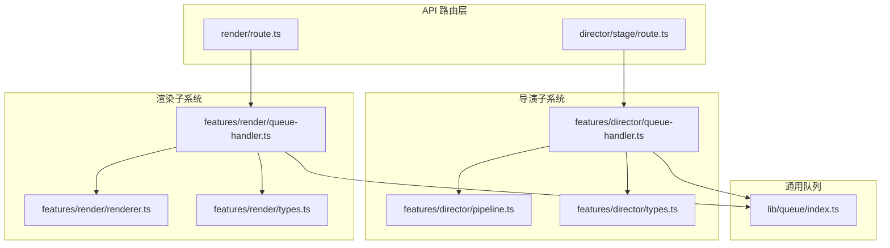
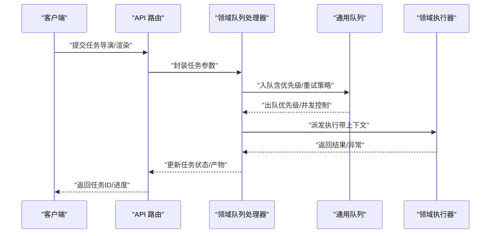
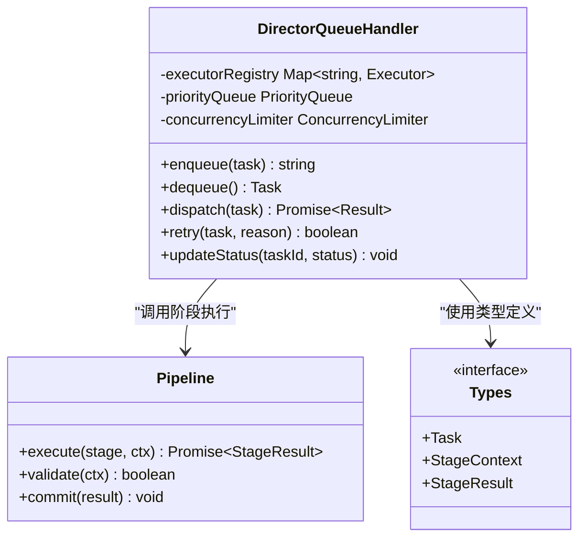
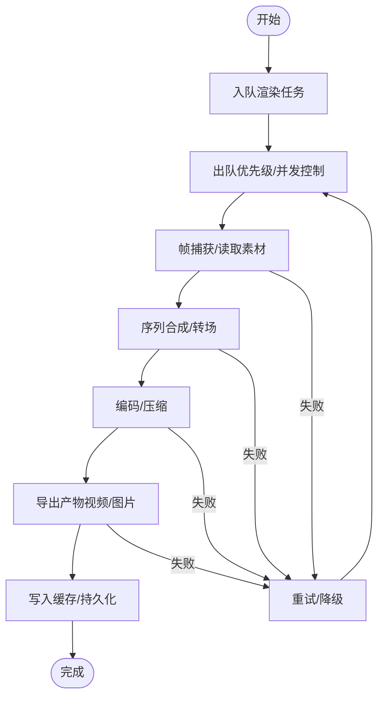
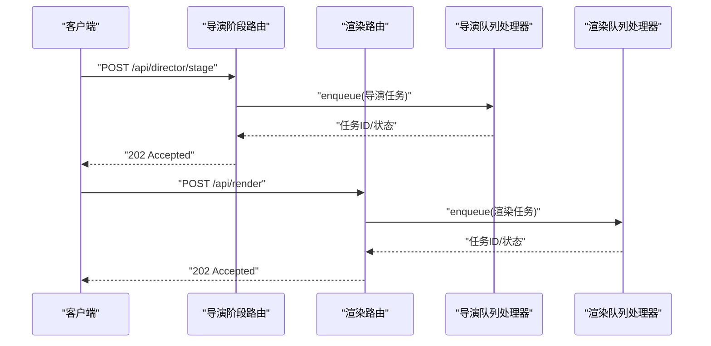
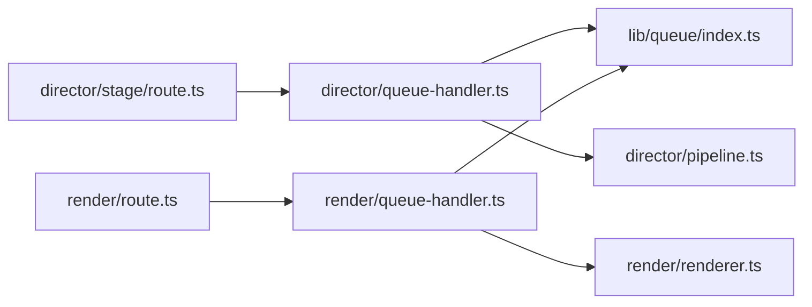

# 队列处理系统

<cite>
**本文档引用的文件**   
- [src/features/director/queue-handler.ts](file://src/features/director/queue-handler.ts)
- [src/features/render/queue-handler.ts](file://src/features/render/queue-handler.ts)
- [src/lib/queue/index.ts](file://src/lib/queue/index.ts)
- [src/app/api/director/stage/route.ts](file://src/app/api/director/stage/route.ts)
- [src/app/api/render/route.ts](file://src/app/api/render/route.ts)
- [src/features/director/pipeline.ts](file://src/features/director/pipeline.ts)
- [src/features/director/types.ts](file://src/features/director/types.ts)
- [src/features/render/renderer.ts](file://src/features/render/renderer.ts)
- [src/features/render/types.ts](file://src/features/render/types.ts)
</cite>

## 目录
1. [简介](#简介)
2. [项目结构](#项目结构)
3. [核心组件](#核心组件)
4. [架构总览](#架构总览)
5. [详细组件分析](#详细组件分析)
6. [依赖关系分析](#依赖关系分析)
7. [性能考量](#性能考量)
8. [故障排查指南](#故障排查指南)
9. [结论](#结论)
10. [附录](#附录)

## 简介
本技术文档聚焦于导演系统的队列处理机制，围绕任务队列的设计模式与实现进行深入解析。内容涵盖任务的入队、出队、优先级调度与并发控制；详解 QueueHandler 的实现原理（任务分发、负载均衡、失败重试）；阐述渲染队列与导演队列的协作关系与数据流转；提供扩展新任务类型与处理逻辑的实践方法；并给出队列监控、性能调优、容量规划以及分布式部署与水平扩展的配置建议。

## 项目结构
本项目采用按功能域划分的模块组织方式，队列相关能力分布在以下位置：
- 通用队列基础设施位于 lib/queue
- 导演子系统队列与处理器位于 features/director
- 渲染子系统队列与处理器位于 features/render
- API 路由层暴露入队接口，分别对应导演阶段与渲染任务

图表来源
- [src/app/api/director/stage/route.ts](file://src/app/api/director/stage/route.ts)
- [src/app/api/render/route.ts](file://src/app/api/render/route.ts)
- [src/features/director/queue-handler.ts](file://src/features/director/queue-handler.ts)
- [src/features/render/queue-handler.ts](file://src/features/render/queue-handler.ts)
- [src/lib/queue/index.ts](file://src/lib/queue/index.ts)
- [src/features/director/pipeline.ts](file://src/features/director/pipeline.ts)
- [src/features/render/renderer.ts](file://src/features/render/renderer.ts)

章节来源
- [src/app/api/director/stage/route.ts](file://src/app/api/director/stage/route.ts)
- [src/app/api/render/route.ts](file://src/app/api/render/route.ts)
- [src/features/director/queue-handler.ts](file://src/features/director/queue-handler.ts)
- [src/features/render/queue-handler.ts](file://src/features/render/queue-handler.ts)
- [src/lib/queue/index.ts](file://src/lib/queue/index.ts)

## 核心组件
- 通用队列抽象（lib/queue）：定义任务模型、优先级、执行器接口、并发限制、重试策略等基础能力，供导演与渲染子系统复用。
- 导演队列处理器（features/director/queue-handler.ts）：负责导演阶段任务的入队、出队、优先级调度、并发控制、失败重试与结果回写。
- 渲染队列处理器（features/render/queue-handler.ts）：负责渲染任务的生命周期管理，包括帧序列处理、编码、导出与缓存。
- 管道与类型（features/director/pipeline.ts, types.ts, features/render/renderer.ts, types.ts）：定义任务类型、状态机、执行上下文与产物结构。

章节来源
- [src/lib/queue/index.ts](file://src/lib/queue/index.ts)
- [src/features/director/queue-handler.ts](file://src/features/director/queue-handler.ts)
- [src/features/render/queue-handler.ts](file://src/features/render/queue-handler.ts)
- [src/features/director/pipeline.ts](file://src/features/director/pipeline.ts)
- [src/features/director/types.ts](file://src/features/director/types.ts)
- [src/features/render/renderer.ts](file://src/features/render/renderer.ts)
- [src/features/render/types.ts](file://src/features/render/types.ts)

## 架构总览
整体架构遵循“API 路由 -> 领域队列处理器 -> 通用队列 -> 具体执行器”的分层设计。API 路由接收外部请求，将任务提交至对应领域的队列处理器；队列处理器基于通用队列进行任务编排、调度与执行；最终由领域执行器完成业务逻辑（导演阶段或渲染）。

图表来源
- [src/app/api/director/stage/route.ts](file://src/app/api/director/stage/route.ts)
- [src/app/api/render/route.ts](file://src/app/api/render/route.ts)
- [src/features/director/queue-handler.ts](file://src/features/director/queue-handler.ts)
- [src/features/render/queue-handler.ts](file://src/features/render/queue-handler.ts)
- [src/lib/queue/index.ts](file://src/lib/queue/index.ts)

## 详细组件分析

### 通用队列抽象（lib/queue）
- 任务模型：包含任务标识、类型、优先级、负载数据、重试次数、超时时间、状态等字段。
- 执行器接口：定义 execute(task, context) 契约，支持异步执行与错误传播。
- 调度策略：支持优先级队列（高优先先出）、公平队列（FIFO）与加权轮询。
- 并发控制：通过信号量或工作池限制同时执行的任务数，避免资源争用。
- 重试与退避：指数退避、固定间隔、最大重试次数与死信队列（DLQ）兜底。
- 监控指标：入队/出队速率、平均等待时间、执行耗时、失败率、队列长度分布。

章节来源
- [src/lib/queue/index.ts](file://src/lib/queue/index.ts)

### 导演队列处理器（features/director/queue-handler.ts）
- 任务分发：根据任务类型路由到对应的阶段处理器（如 ingest、direct、assemble、finalize）。
- 负载均衡：在多实例或多线程环境下，依据处理器能力与当前负载动态分配任务。
- 失败重试：对可重试错误（网络抖动、临时资源不可用）进行自动重试，记录失败原因与堆栈。
- 状态推进：维护任务状态机（排队中、执行中、成功、失败、重试中），保证幂等性与一致性。
- 上下文传递：携带项目、镜头、阶段产物等信息，确保下游处理器可用。

图表来源
- [src/features/director/queue-handler.ts](file://src/features/director/queue-handler.ts)
- [src/features/director/pipeline.ts](file://src/features/director/pipeline.ts)
- [src/features/director/types.ts](file://src/features/director/types.ts)

章节来源
- [src/features/director/queue-handler.ts](file://src/features/director/queue-handler.ts)
- [src/features/director/pipeline.ts](file://src/features/director/pipeline.ts)
- [src/features/director/types.ts](file://src/features/director/types.ts)

### 渲染队列处理器（features/render/queue-handler.ts）
- 任务生命周期：从帧捕获、序列合成、编码到导出的全链路管理。
- 资源协调：与渲染引擎交互，管理 GPU/CPU 资源与内存占用。
- 缓存策略：命中中间产物缓存以减少重复计算，提升吞吐。
- 失败恢复：断点续传、分片重算、增量渲染。

图表来源
- [src/features/render/queue-handler.ts](file://src/features/render/queue-handler.ts)
- [src/features/render/renderer.ts](file://src/features/render/renderer.ts)
- [src/features/render/types.ts](file://src/features/render/types.ts)

章节来源
- [src/features/render/queue-handler.ts](file://src/features/render/queue-handler.ts)
- [src/features/render/renderer.ts](file://src/features/render/renderer.ts)
- [src/features/render/types.ts](file://src/features/render/types.ts)

### API 路由与入队流程
- 导演阶段路由：接收导演阶段任务，校验参数后入队至导演队列处理器。
- 渲染路由：接收渲染任务，校验参数后入队至渲染队列处理器。
- 统一响应：返回任务 ID、预计完成时间与查询端点。

图表来源
- [src/app/api/director/stage/route.ts](file://src/app/api/director/stage/route.ts)
- [src/app/api/render/route.ts](file://src/app/api/render/route.ts)
- [src/features/director/queue-handler.ts](file://src/features/director/queue-handler.ts)
- [src/features/render/queue-handler.ts](file://src/features/render/queue-handler.ts)

章节来源
- [src/app/api/director/stage/route.ts](file://src/app/api/director/stage/route.ts)
- [src/app/api/render/route.ts](file://src/app/api/render/route.ts)

## 依赖关系分析
- 低耦合：API 路由仅依赖队列处理器，不直接操作底层队列实现。
- 高内聚：各领域处理器封装自身任务类型与执行细节。
- 可扩展：新增任务类型只需在处理器注册表与类型定义中扩展。
- 无循环依赖：通用队列被上层模块引用，不被下层反向依赖。

图表来源
- [src/app/api/director/stage/route.ts](file://src/app/api/director/stage/route.ts)
- [src/app/api/render/route.ts](file://src/app/api/render/route.ts)
- [src/features/director/queue-handler.ts](file://src/features/director/queue-handler.ts)
- [src/features/render/queue-handler.ts](file://src/features/render/queue-handler.ts)
- [src/lib/queue/index.ts](file://src/lib/queue/index.ts)
- [src/features/director/pipeline.ts](file://src/features/director/pipeline.ts)
- [src/features/render/renderer.ts](file://src/features/render/renderer.ts)

章节来源
- [src/app/api/director/stage/route.ts](file://src/app/api/director/stage/route.ts)
- [src/app/api/render/route.ts](file://src/app/api/render/route.ts)
- [src/features/director/queue-handler.ts](file://src/features/director/queue-handler.ts)
- [src/features/render/queue-handler.ts](file://src/features/render/queue-handler.ts)
- [src/lib/queue/index.ts](file://src/lib/queue/index.ts)
- [src/features/director/pipeline.ts](file://src/features/director/pipeline.ts)
- [src/features/render/renderer.ts](file://src/features/render/renderer.ts)

## 性能考量
- 优先级调度：为紧急任务设置更高优先级，缩短关键路径时延。
- 并发控制：根据 CPU/GPU 资源上限配置工作池大小，避免过载。
- 批处理：合并小任务为批次，减少调度开销与锁竞争。
- 缓存命中：利用中间产物缓存降低重复计算，提高吞吐。
- 背压与限流：当后端资源紧张时，限制入队速率，防止雪崩。
- 监控告警：跟踪队列长度、P95/P99 延迟、失败率与重试率，及时扩容或降载。

[本节为通用指导，不直接分析具体文件]

## 故障排查指南
- 常见错误分类：
  - 输入校验失败：检查任务参数与类型约束。
  - 执行超时：调整超时阈值或优化执行逻辑。
  - 资源不足：扩容工作池或增加实例。
  - 依赖服务异常：重试或切换备用服务。
- 定位步骤：
  - 查看任务状态与日志，确认失败阶段。
  - 检查重试计数与退避策略是否合理。
  - 观察队列长度与执行耗时趋势。
- 恢复策略：
  - 自动重试与降级执行。
  - 死信队列人工干预。
  - 增量重算与断点续传。

章节来源
- [src/features/director/queue-handler.ts](file://src/features/director/queue-handler.ts)
- [src/features/render/queue-handler.ts](file://src/features/render/queue-handler.ts)
- [src/lib/queue/index.ts](file://src/lib/queue/index.ts)

## 结论
本队列处理系统以通用队列为基础，结合导演与渲染两大领域的专用处理器，实现了高内聚、低耦合、可扩展的任务编排与执行框架。通过优先级调度、并发控制、失败重试与缓存策略，系统在稳定性与性能之间取得平衡。配合完善的监控与容量规划，可有效支撑大规模分布式部署与水平扩展。

[本节为总结性内容，不直接分析具体文件]

## 附录

### 如何添加新的任务类型与处理逻辑
- 定义任务类型与上下文：在类型文件中新增任务结构与上下文字段。
- 注册处理器：在处理器注册表中映射任务类型到具体执行函数。
- 实现执行逻辑：遵循 execute(task, context) 契约，返回结果或抛出异常。
- 配置优先级与重试：为新任务设定合适的优先级与重试策略。
- 单元测试与集成测试：覆盖正常路径与异常路径，确保健壮性。

章节来源
- [src/features/director/types.ts](file://src/features/director/types.ts)
- [src/features/render/types.ts](file://src/features/render/types.ts)
- [src/features/director/queue-handler.ts](file://src/features/director/queue-handler.ts)
- [src/features/render/queue-handler.ts](file://src/features/render/queue-handler.ts)

### 队列监控与性能调优
- 关键指标：
  - 入队/出队速率、队列长度分布
  - 平均等待时间、执行耗时（P50/P95/P99）
  - 失败率、重试率、超时率
  - 资源利用率（CPU/GPU/内存）
- 调优手段：
  - 调整并发度与工作池大小
  - 优化任务粒度与批处理大小
  - 启用缓存与增量计算
  - 合理设置优先级与权重
- 容量规划：
  - 基于峰值流量与 SLA 目标估算所需实例数
  - 预留弹性扩容空间应对突发流量
  - 定期压测与回归验证

[本节为通用指导，不直接分析具体文件]

### 分布式部署与水平扩展配置指南
- 多实例部署：每个实例独立运行队列处理器，共享持久化队列存储。
- 任务分区：按任务 ID 哈希或业务键分区，避免重复消费。
- 一致性保障：使用分布式锁或事务保证任务幂等与顺序性。
- 配置项建议：
  - 并发度：根据资源上限与任务特性配置
  - 重试策略：最大重试次数、退避间隔、死信队列
  - 超时阈值：区分 IO 密集与计算密集型任务
  - 监控上报：指标采集频率与告警阈值
- 扩缩容策略：
  - 基于队列长度与延迟指标的自动扩缩容
  - 灰度发布与滚动升级，保证零停机

[本节为通用指导，不直接分析具体文件]