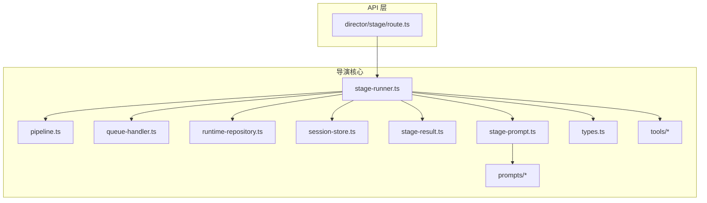
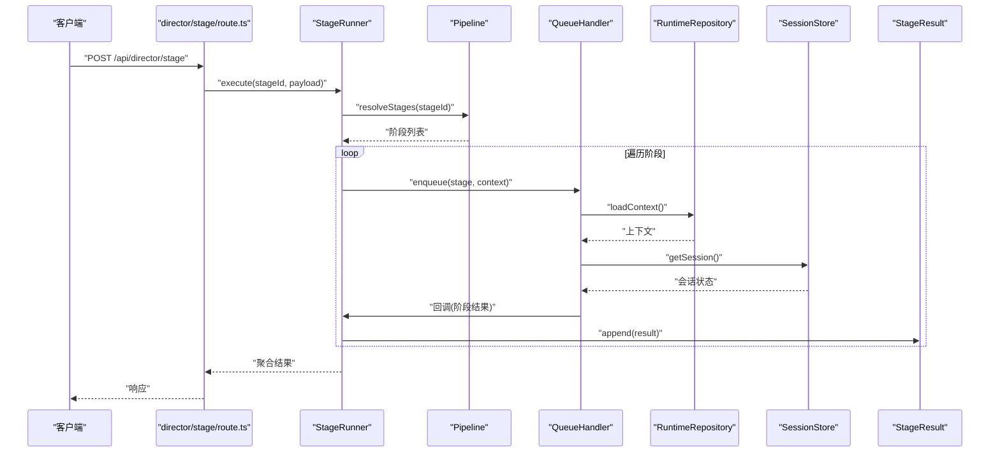
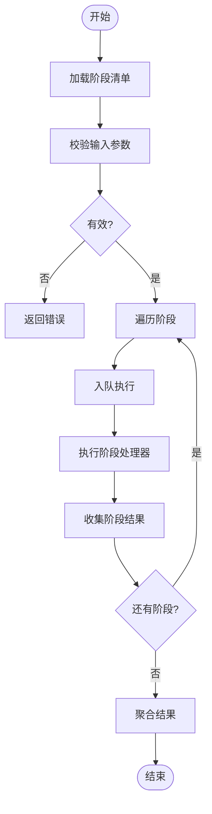
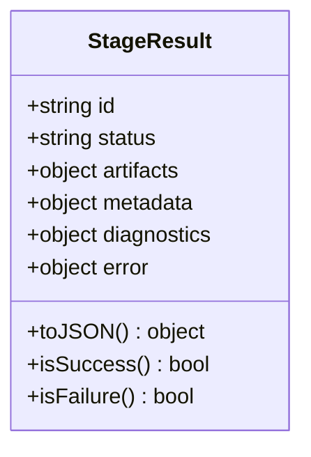
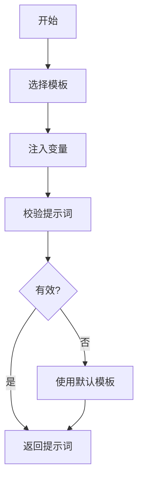
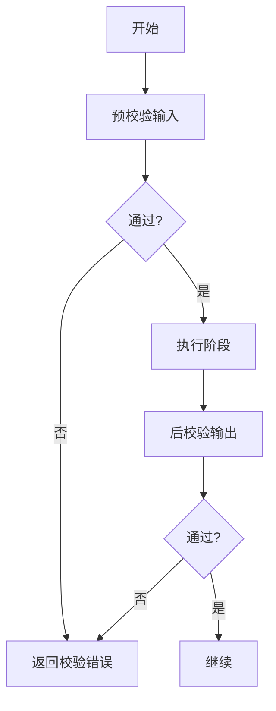
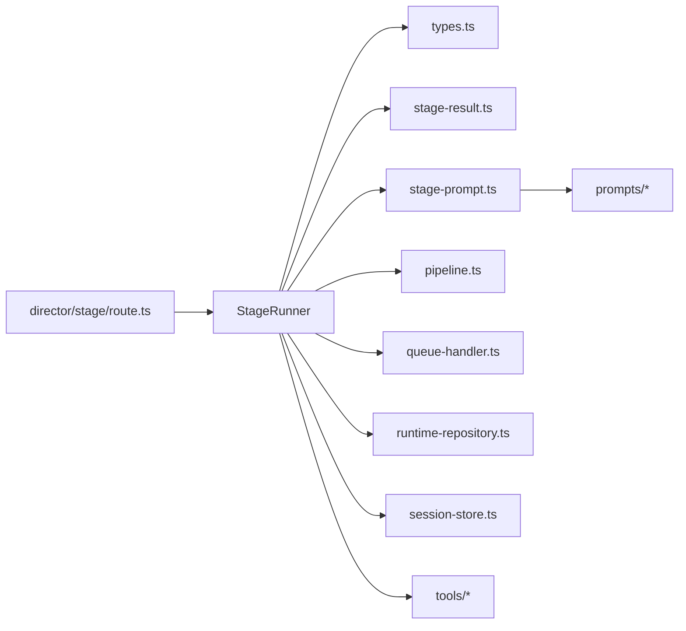

# 阶段执行器

<cite>
**本文引用的文件**   
- [src/features/director/stage-runner.ts](file://src/features/director/stage-runner.ts)
- [src/features/director/stage-result.ts](file://src/features/director/stage-result.ts)
- [src/features/director/stage-prompt.ts](file://src/features/director/stage-prompt.ts)
- [src/features/director/types.ts](file://src/features/director/types.ts)
- [src/features/director/pipeline.ts](file://src/features/director/pipeline.ts)
- [src/features/director/queue-handler.ts](file://src/features/director/queue-handler.ts)
- [src/features/director/runtime-repository.ts](file://src/features/director/runtime-repository.ts)
- [src/features/director/session-store.ts](file://src/features/director/session-store.ts)
- [src/features/director/tools/write-artifact.ts](file://src/features/director/tools/write-artifact.ts)
- [src/features/director/tools/validate-shot-plan.ts](file://src/features/director/tools/validate-shot-plan.ts)
- [src/features/director/tools/check-determinism.ts](file://src/features/director/tools/check-determinism.ts)
- [src/features/director/prompts/direct.ts](file://src/features/director/prompts/direct.ts)
- [src/features/director/prompts/fabricate.ts](file://src/features/director/prompts/fabricate.ts)
- [src/features/director/prompts/assemble.ts](file://src/features/director/prompts/assemble.ts)
- [src/features/director/prompts/finalize.ts](file://src/features/director/prompts/finalize.ts)
- [src/features/director/prompts/ingest.ts](file://src/features/director/prompts/ingest.ts)
- [src/features/director/prompts/shot-spec.ts](file://src/features/director/prompts/shot-spec.ts)
- [src/app/api/director/stage/route.ts](file://src/app/api/director/stage/route.ts)
</cite>

## 目录
1. [简介](#简介)
2. [项目结构](#项目结构)
3. [核心组件](#核心组件)
4. [架构总览](#架构总览)
5. [详细组件分析](#详细组件分析)
6. [依赖关系分析](#依赖关系分析)
7. [性能考量](#性能考量)
8. [故障排查指南](#故障排查指南)
9. [结论](#结论)
10. [附录](#附录)

## 简介
本技术文档聚焦于导演系统的“阶段执行器”，围绕 StageRunner 的执行机制展开，涵盖阶段的加载、验证、执行与结果处理；深入解析 StageResult 数据结构设计、StagePrompt 提示词生成与 StageValidation 验证逻辑；解释异步执行模型、并发控制与资源管理；并提供自定义阶段处理器实现示例、错误传播与日志调试策略，以及阶段开发最佳实践与性能优化建议。

## 项目结构
与阶段执行器相关的代码主要位于 features/director 模块中，API 层通过 Next.js Route Handler 暴露阶段执行入口。关键文件组织如下：
- 执行引擎：stage-runner.ts
- 结果模型与提交：stage-result.ts、stage-result-committer.ts（若存在）
- 提示词模板：stage-prompt.ts 及 prompts/*
- 类型定义：types.ts
- 流水线编排：pipeline.ts
- 队列与调度：queue-handler.ts
- 运行时上下文：runtime-repository.ts、session-store.ts
- 工具集：tools/*
- API 路由：app/api/director/stage/route.ts

图表来源
- [src/app/api/director/stage/route.ts](file://src/app/api/director/stage/route.ts)
- [src/features/director/stage-runner.ts](file://src/features/director/stage-runner.ts)
- [src/features/director/pipeline.ts](file://src/features/director/pipeline.ts)
- [src/features/director/queue-handler.ts](file://src/features/director/queue-handler.ts)
- [src/features/director/runtime-repository.ts](file://src/features/director/runtime-repository.ts)
- [src/features/director/session-store.ts](file://src/features/director/session-store.ts)
- [src/features/director/stage-result.ts](file://src/features/director/stage-result.ts)
- [src/features/director/stage-prompt.ts](file://src/features/director/stage-prompt.ts)
- [src/features/director/types.ts](file://src/features/director/types.ts)

章节来源
- [src/app/api/director/stage/route.ts](file://src/app/api/director/stage/route.ts)
- [src/features/director/stage-runner.ts](file://src/features/director/stage-runner.ts)
- [src/features/director/pipeline.ts](file://src/features/director/pipeline.ts)
- [src/features/director/queue-handler.ts](file://src/features/director/queue-handler.ts)
- [src/features/director/runtime-repository.ts](file://src/features/director/runtime-repository.ts)
- [src/features/director/session-store.ts](file://src/features/director/session-store.ts)
- [src/features/director/stage-result.ts](file://src/features/director/stage-result.ts)
- [src/features/director/stage-prompt.ts](file://src/features/director/stage-prompt.ts)
- [src/features/director/types.ts](file://src/features/director/types.ts)

## 核心组件
- 阶段执行器（StageRunner）
  - 负责阶段生命周期管理：加载、校验、执行、结果持久化与错误传播。
  - 提供统一的执行接口，支持同步/异步阶段处理器，具备超时、重试与取消能力。
- 阶段结果（StageResult）
  - 标准化阶段输出结构，包含状态、产物、元数据、诊断信息与错误上下文。
- 阶段提示词（StagePrompt）
  - 基于阶段配置与上下文动态生成提示词，驱动 AI 或外部服务调用。
- 阶段验证（StageValidation）
  - 在阶段执行前后进行输入/输出校验，确保契约一致性与可追溯性。
- 流水线（Pipeline）
  - 编排多个阶段，定义顺序、分支与合并策略。
- 队列处理器（QueueHandler）
  - 将阶段任务入队，控制并发度，协调资源使用。
- 运行时仓库（RuntimeRepository）
  - 提供阶段运行所需的上下文、工件与配置访问。
- 会话存储（SessionStore）
  - 维护会话级状态，跨阶段共享上下文。

章节来源
- [src/features/director/stage-runner.ts](file://src/features/director/stage-runner.ts)
- [src/features/director/stage-result.ts](file://src/features/director/stage-result.ts)
- [src/features/director/stage-prompt.ts](file://src/features/director/stage-prompt.ts)
- [src/features/director/types.ts](file://src/features/director/types.ts)
- [src/features/director/pipeline.ts](file://src/features/director/pipeline.ts)
- [src/features/director/queue-handler.ts](file://src/features/director/queue-handler.ts)
- [src/features/director/runtime-repository.ts](file://src/features/director/runtime-repository.ts)
- [src/features/director/session-store.ts](file://src/features/director/session-store.ts)

## 架构总览
阶段执行器的整体流程从 API 路由进入，交由 StageRunner 编排执行，期间通过 Pipeline 定义阶段序列，借助 QueueHandler 控制并发，使用 RuntimeRepository 和 SessionStore 获取上下文，最终通过 StageResult 汇总结果并持久化。

图表来源
- [src/app/api/director/stage/route.ts](file://src/app/api/director/stage/route.ts)
- [src/features/director/stage-runner.ts](file://src/features/director/stage-runner.ts)
- [src/features/director/pipeline.ts](file://src/features/director/pipeline.ts)
- [src/features/director/queue-handler.ts](file://src/features/director/queue-handler.ts)
- [src/features/director/runtime-repository.ts](file://src/features/director/runtime-repository.ts)
- [src/features/director/session-store.ts](file://src/features/director/session-store.ts)
- [src/features/director/stage-result.ts](file://src/features/director/stage-result.ts)

## 详细组件分析

### 阶段执行器（StageRunner）
- 职责
  - 加载阶段：根据 stageId 解析阶段清单与依赖。
  - 验证阶段：对输入参数、上下文与阶段契约进行校验。
  - 执行阶段：按顺序或并行执行阶段处理器，支持超时、重试与取消。
  - 结果处理：收集每个阶段的 StageResult，聚合为最终输出。
- 关键行为
  - 并发控制：通过队列限制同时运行的阶段数，避免资源耗尽。
  - 错误传播：捕获异常并包装为结构化错误，附带上下文与堆栈摘要。
  - 日志记录：在每个阶段边界记录开始、结束、耗时与关键指标。
  - 资源管理：在进入阶段前申请资源，退出时释放，确保无泄漏。

图表来源
- [src/features/director/stage-runner.ts](file://src/features/director/stage-runner.ts)
- [src/features/director/queue-handler.ts](file://src/features/director/queue-handler.ts)

章节来源
- [src/features/director/stage-runner.ts](file://src/features/director/stage-runner.ts)
- [src/features/director/queue-handler.ts](file://src/features/director/queue-handler.ts)

### 阶段结果（StageResult）
- 设计目标
  - 统一阶段输出格式，便于下游消费与可视化。
  - 携带状态码、产物引用、元数据、诊断信息与错误上下文。
- 关键字段
  - 状态：成功、失败、进行中、已取消等。
  - 产物：指向工件的标识或内容摘要。
  - 元数据：阶段耗时、版本、标签等。
  - 诊断：日志片段、指标、追踪 ID。
  - 错误：错误码、消息、堆栈摘要、恢复建议。

图表来源
- [src/features/director/stage-result.ts](file://src/features/director/stage-result.ts)

章节来源
- [src/features/director/stage-result.ts](file://src/features/director/stage-result.ts)

### 阶段提示词（StagePrompt）
- 功能
  - 根据阶段配置、上下文与会话状态生成提示词，驱动 AI 或外部服务。
  - 支持多模板组合与变量注入，保证提示词的可维护性与一致性。
- 关键点
  - 模板选择：依据阶段类型与输入特征选择合适模板。
  - 变量注入：从运行时上下文填充占位符。
  - 校验与回退：提示词生成失败时提供默认模板或降级策略。

图表来源
- [src/features/director/stage-prompt.ts](file://src/features/director/stage-prompt.ts)
- [src/features/director/prompts/direct.ts](file://src/features/director/prompts/direct.ts)
- [src/features/director/prompts/fabricate.ts](file://src/features/director/prompts/fabricate.ts)
- [src/features/director/prompts/assemble.ts](file://src/features/director/prompts/assemble.ts)
- [src/features/director/prompts/finalize.ts](file://src/features/director/prompts/finalize.ts)
- [src/features/director/prompts/ingest.ts](file://src/features/director/prompts/ingest.ts)
- [src/features/director/prompts/shot-spec.ts](file://src/features/director/prompts/shot-spec.ts)

章节来源
- [src/features/director/stage-prompt.ts](file://src/features/director/stage-prompt.ts)
- [src/features/director/prompts/direct.ts](file://src/features/director/prompts/direct.ts)
- [src/features/director/prompts/fabricate.ts](file://src/features/director/prompts/fabricate.ts)
- [src/features/director/prompts/assemble.ts](file://src/features/director/prompts/assemble.ts)
- [src/features/director/prompts/finalize.ts](file://src/features/director/prompts/finalize.ts)
- [src/features/director/prompts/ingest.ts](file://src/features/director/prompts/ingest.ts)
- [src/features/director/prompts/shot-spec.ts](file://src/features/director/prompts/shot-spec.ts)

### 阶段验证（StageValidation）
- 职责
  - 在阶段执行前校验输入契约，在执行后校验输出契约。
  - 提供详细的错误信息，帮助快速定位问题。
- 策略
  - 静态校验：类型、必填字段、取值范围。
  - 动态校验：依赖工件存在性、版本兼容性。
  - 幂等校验：确保重复执行不会产生副作用。

图表来源
- [src/features/director/stage-runner.ts](file://src/features/director/stage-runner.ts)
- [src/features/director/tools/validate-shot-plan.ts](file://src/features/director/tools/validate-shot-plan.ts)

章节来源
- [src/features/director/stage-runner.ts](file://src/features/director/stage-runner.ts)
- [src/features/director/tools/validate-shot-plan.ts](file://src/features/director/tools/validate-shot-plan.ts)

### 流水线（Pipeline）
- 职责
  - 定义阶段序列、分支与合并策略。
  - 提供阶段依赖解析与拓扑排序。
- 特性
  - 条件执行：根据上下文决定是否跳过某阶段。
  - 并行执行：对无依赖的阶段进行并发执行。
  - 回滚策略：在失败时可选择部分回滚或全部回滚。

章节来源
- [src/features/director/pipeline.ts](file://src/features/director/pipeline.ts)

### 队列处理器（QueueHandler）
- 职责
  - 将阶段任务入队，限制并发度，协调资源使用。
  - 提供任务优先级、重试与取消机制。
- 特性
  - 背压控制：当队列满时拒绝新任务或等待。
  - 健康检查：监控队列长度与任务延迟。

章节来源
- [src/features/director/queue-handler.ts](file://src/features/director/queue-handler.ts)

### 运行时仓库（RuntimeRepository）与会话存储（SessionStore）
- 运行时仓库
  - 提供阶段运行所需的上下文、工件与配置访问。
  - 支持缓存与懒加载，减少 IO 开销。
- 会话存储
  - 维护会话级状态，跨阶段共享上下文。
  - 提供原子更新与快照能力。

章节来源
- [src/features/director/runtime-repository.ts](file://src/features/director/runtime-repository.ts)
- [src/features/director/session-store.ts](file://src/features/director/session-store.ts)

### 工具集（Tools）
- write-artifact
  - 将阶段产物写入持久化存储，返回工件标识。
- validate-shot-plan
  - 校验分镜计划的结构与约束。
- check-determinism
  - 检查阶段执行的确定性，辅助调试与回归测试。

章节来源
- [src/features/director/tools/write-artifact.ts](file://src/features/director/tools/write-artifact.ts)
- [src/features/director/tools/validate-shot-plan.ts](file://src/features/director/tools/validate-shot-plan.ts)
- [src/features/director/tools/check-determinism.ts](file://src/features/director/tools/check-determinism.ts)

### API 路由（director/stage/route.ts）
- 职责
  - 接收客户端请求，解析参数，调用 StageRunner 执行阶段。
  - 返回标准化的响应体，包含阶段执行结果与诊断信息。
- 安全与限流
  - 鉴权校验、参数白名单、速率限制。

章节来源
- [src/app/api/director/stage/route.ts](file://src/app/api/director/stage/route.ts)

## 依赖关系分析
阶段执行器与各组件之间的依赖关系如下：

图表来源
- [src/features/director/stage-runner.ts](file://src/features/director/stage-runner.ts)
- [src/features/director/types.ts](file://src/features/director/types.ts)
- [src/features/director/stage-result.ts](file://src/features/director/stage-result.ts)
- [src/features/director/stage-prompt.ts](file://src/features/director/stage-prompt.ts)
- [src/features/director/pipeline.ts](file://src/features/director/pipeline.ts)
- [src/features/director/queue-handler.ts](file://src/features/director/queue-handler.ts)
- [src/features/director/runtime-repository.ts](file://src/features/director/runtime-repository.ts)
- [src/features/director/session-store.ts](file://src/features/director/session-store.ts)
- [src/app/api/director/stage/route.ts](file://src/app/api/director/stage/route.ts)

章节来源
- [src/features/director/stage-runner.ts](file://src/features/director/stage-runner.ts)
- [src/features/director/types.ts](file://src/features/director/types.ts)
- [src/features/director/stage-result.ts](file://src/features/director/stage-result.ts)
- [src/features/director/stage-prompt.ts](file://src/features/director/stage-prompt.ts)
- [src/features/director/pipeline.ts](file://src/features/director/pipeline.ts)
- [src/features/director/queue-handler.ts](file://src/features/director/queue-handler.ts)
- [src/features/director/runtime-repository.ts](file://src/features/director/runtime-repository.ts)
- [src/features/director/session-store.ts](file://src/features/director/session-store.ts)
- [src/app/api/director/stage/route.ts](file://src/app/api/director/stage/route.ts)

## 性能考量
- 并发控制
  - 合理设置队列并发度，避免 CPU 与 IO 争用。
  - 对长耗时阶段采用批处理与分页读取。
- 缓存与惰性加载
  - 利用运行时仓库缓存热点数据，减少重复 IO。
  - 会话存储按需快照，降低内存占用。
- 超时与重试
  - 为外部依赖设置超时与指数退避重试，提升鲁棒性。
- 资源回收
  - 阶段结束后及时释放临时文件、网络连接与句柄。
- 可观测性
  - 记录关键指标（耗时、吞吐、错误率），便于容量规划与调优。

[本节为通用指导，不直接分析具体文件]

## 故障排查指南
- 常见错误
  - 输入校验失败：检查参数结构与必填字段。
  - 阶段执行超时：确认外部依赖可用性与网络状况。
  - 资源不足：调整并发度与内存配额。
- 日志与诊断
  - 查看阶段边界日志，定位失败阶段。
  - 使用诊断信息中的追踪 ID 关联上下游日志。
- 复现与回归
  - 使用确定性检查工具验证阶段输出的稳定性。
  - 保留最小复现场景与输入样本。

章节来源
- [src/features/director/stage-runner.ts](file://src/features/director/stage-runner.ts)
- [src/features/director/tools/check-determinism.ts](file://src/features/director/tools/check-determinism.ts)

## 结论
阶段执行器通过清晰的职责划分与良好的抽象，实现了高内聚、低耦合的阶段编排与执行。结合 StageResult 的统一输出、StagePrompt 的灵活提示词生成与 StageValidation 的严格校验，系统具备良好的可扩展性与可维护性。配合并发控制、资源管理与完善的可观测性，能够在复杂业务场景下稳定运行。

[本节为总结性内容，不直接分析具体文件]

## 附录

### 自定义阶段处理器实现要点
- 定义阶段处理器函数，接受上下文与输入，返回 StageResult。
- 在处理器内部完成输入校验、业务逻辑与产物写入。
- 记录必要的日志与诊断信息，确保可追溯。
- 处理异常并转换为结构化错误，包含错误码与建议。

章节来源
- [src/features/director/stage-runner.ts](file://src/features/director/stage-runner.ts)
- [src/features/director/stage-result.ts](file://src/features/director/stage-result.ts)
- [src/features/director/tools/write-artifact.ts](file://src/features/director/tools/write-artifact.ts)

### 处理不同类型输入输出数据的最佳实践
- 输入
  - 使用强类型定义与校验规则，避免隐式转换。
  - 对大对象采用流式处理与分块传输。
- 输出
  - 标准化产物结构，提供版本兼容策略。
  - 对敏感信息进行脱敏与加密存储。

章节来源
- [src/features/director/types.ts](file://src/features/director/types.ts)
- [src/features/director/stage-result.ts](file://src/features/director/stage-result.ts)

### 错误传播与日志记录
- 错误传播
  - 在阶段边界捕获异常，包装为结构化错误并向上抛出。
  - 提供错误分类与恢复建议，便于上层决策。
- 日志记录
  - 结构化日志，包含时间戳、级别、上下文与追踪 ID。
  - 分级输出，避免在生产环境泄露敏感信息。

章节来源
- [src/features/director/stage-runner.ts](file://src/features/director/stage-runner.ts)

### 调试信息收集
- 启用调试模式，收集阶段执行轨迹与中间状态。
- 导出会话快照，用于离线分析与回放。
- 使用确定性检查工具对比不同次执行的结果差异。

章节来源
- [src/features/director/session-store.ts](file://src/features/director/session-store.ts)
- [src/features/director/tools/check-determinism.ts](file://src/features/director/tools/check-determinism.ts)