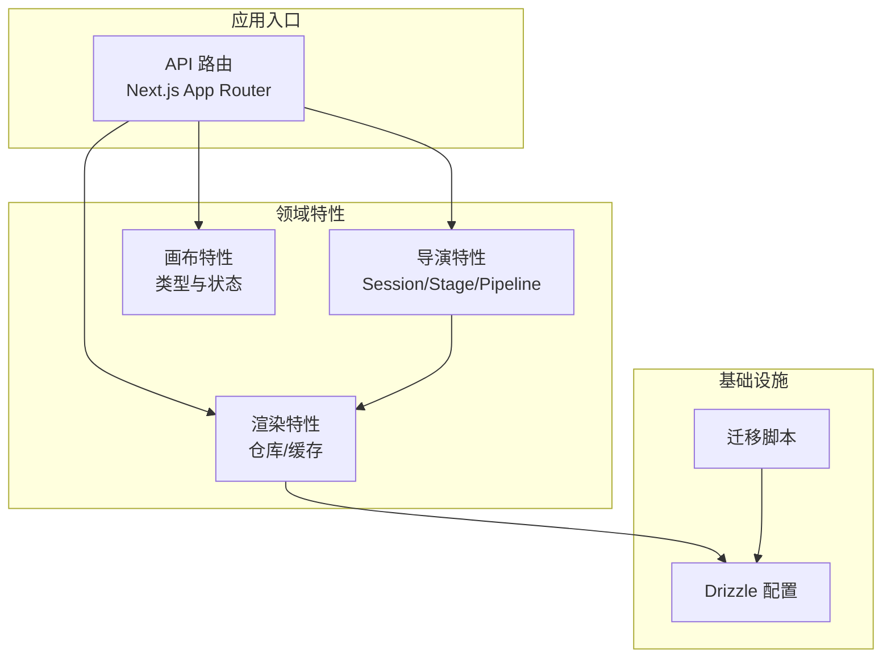
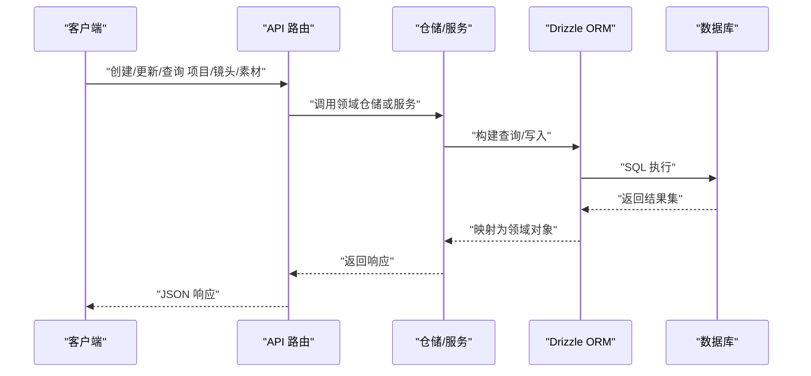
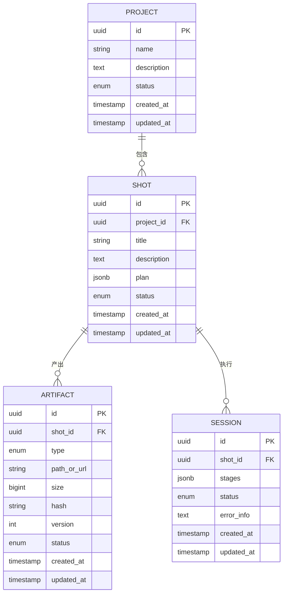
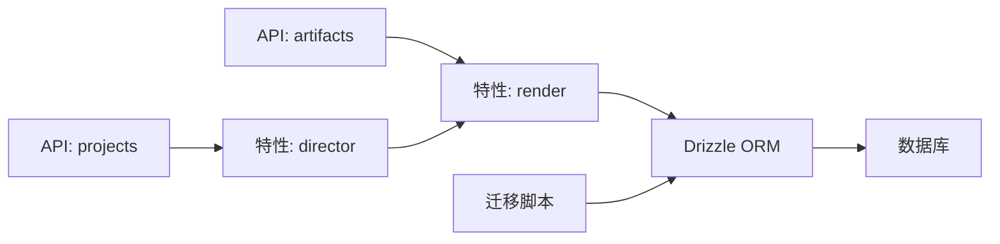

# 数据模型设计

<cite>
**本文引用的文件**   
- [drizzle.config.ts](file://drizzle.config.ts)
- [scripts/setup/db-migrate.ts](file://scripts/setup/db-migrate.ts)
- [src/app/api/projects/route.ts](file://src/app/api/projects/route.ts)
- [src/app/api/artifacts/[id]/route.ts](file://src/app/api/artifacts/[id]/route.ts)
- [src/features/director/session-store.ts](file://src/features/director/session-store.ts)
- [src/features/director/runtime-repository.ts](file://src/features/director/runtime-repository.ts)
- [src/features/director/pipeline.ts](file://src/features/director/pipeline.ts)
- [src/features/director/types.ts](file://src/features/director/types.ts)
- [src/features/canvas/types.ts](file://src/features/canvas/types.ts)
- [src/features/render/repository.ts](file://src/features/render/repository.ts)
- [src/features/render/cache.ts](file://src/features/render/cache.ts)
</cite>

## 目录
1. [引言](#引言)
2. [项目结构](#项目结构)
3. [核心组件](#核心组件)
4. [架构总览](#架构总览)
5. [详细组件分析](#详细组件分析)
6. [依赖分析](#依赖分析)
7. [性能考虑](#性能考虑)
8. [故障排查指南](#故障排查指南)
9. [结论](#结论)
10. [附录](#附录)

## 引言
本文件为 CodeVideoCanvas 的数据模型设计文档，聚焦于以下核心实体：Project（项目）、Shot（镜头）、Artifact（素材）与 Session（会话）。文档从数据库表结构设计、字段约束与索引策略、数据验证规则与业务约束、持久化与迁移管理、数据访问模式、缓存策略与性能优化等方面展开，并提供基于 ORM 的查询与操作示例路径，帮助读者快速理解并正确使用系统的数据层。

## 项目结构
本项目采用 Next.js App Router 与 Drizzle ORM 的组合。数据模型定义与迁移脚本位于配置与脚本目录中；API 路由负责对外暴露数据操作接口；特性模块（features）封装领域逻辑与仓储/缓存实现。

图表来源
- [drizzle.config.ts](file://drizzle.config.ts)
- [scripts/setup/db-migrate.ts](file://scripts/setup/db-migrate.ts)
- [src/app/api/projects/route.ts](file://src/app/api/projects/route.ts)
- [src/features/director/pipeline.ts](file://src/features/director/pipeline.ts)
- [src/features/render/repository.ts](file://src/features/render/repository.ts)

章节来源
- [drizzle.config.ts](file://drizzle.config.ts)
- [scripts/setup/db-migrate.ts](file://scripts/setup/db-migrate.ts)
- [src/app/api/projects/route.ts](file://src/app/api/projects/route.ts)

## 核心组件
本节概述四大核心实体的职责与关系：
- Project（项目）：承载一组镜头与相关元信息，作为资源组织边界。
- Shot（镜头）：描述一段可独立编排与渲染的视频片段，包含阶段计划、输入输出等。
- Artifact（素材）：表示由镜头或流程产出的具体产物（如视频帧序列、音频、字幕等），具备版本与状态。
- Session（会话）：记录一次导演工作流执行上下文，关联 Stage 运行结果与中间态。

它们之间的主要关系如下：
- 一个 Project 包含多个 Shot。
- 一个 Shot 在运行过程中产生多个 Artifact。
- 一次 Pipeline 执行对应一个 Session，Session 聚合 Stage 的结果与运行时上下文。

章节来源
- [src/features/director/types.ts](file://src/features/director/types.ts)
- [src/features/canvas/types.ts](file://src/features/canvas/types.ts)
- [src/features/director/pipeline.ts](file://src/features/director/pipeline.ts)

## 架构总览
下图展示数据模型在系统中的交互方式：API 路由接收请求，调用特性层的仓储或服务，最终通过 Drizzle ORM 访问数据库。Session 与 Runtime Repository 用于维护导演流程的执行上下文与中间结果。

图表来源
- [src/app/api/projects/route.ts](file://src/app/api/projects/route.ts)
- [src/app/api/artifacts/[id]/route.ts](file://src/app/api/artifacts/[id]/route.ts)
- [src/features/render/repository.ts](file://src/features/render/repository.ts)
- [drizzle.config.ts](file://drizzle.config.ts)

## 详细组件分析

### Project 项目模型
- 职责：作为资源容器，组织多个镜头与相关元数据。
- 关键属性（概念性）：唯一标识、名称、描述、创建/更新时间、状态等。
- 关系：一对多关联到 Shot。
- 约束与索引：
  - 主键：唯一标识。
  - 唯一索引：项目名称（可选，视业务需求）。
  - 时间戳索引：便于按创建/更新时间排序与筛选。
- 验证规则：
  - 名称非空且长度限制。
  - 描述允许为空但需满足最大长度。
- 持久化与迁移：
  - 使用 Drizzle Schema 定义表结构。
  - 通过迁移脚本生成并应用 DDL。
- 数据访问模式：
  - 列表分页查询（按时间倒序）。
  - 详情查询（含镜头计数）。
- 查询优化建议：
  - 对常用过滤字段建立索引。
  - 避免 N+1 查询，必要时使用 JOIN 或预加载。

章节来源
- [src/app/api/projects/route.ts](file://src/app/api/projects/route.ts)
- [drizzle.config.ts](file://drizzle.config.ts)
- [scripts/setup/db-migrate.ts](file://scripts/setup/db-migrate.ts)

### Shot 镜头模型
- 职责：描述一段可独立编排与渲染的视频片段，包含导演计划、阶段状态与输入输出引用。
- 关键属性（概念性）：唯一标识、所属项目 ID、标题、描述、阶段计划 JSON、状态、时间戳等。
- 关系：
  - 多对一关联到 Project。
  - 一对多关联到 Artifact（产出物）。
- 约束与索引：
  - 外键约束：project_id 引用 Project。
  - 状态枚举约束。
  - 索引：project_id、status、updated_at。
- 验证规则：
  - 阶段计划需符合导演规范（见导演特性 schemas）。
  - 状态转换遵循有限状态机（如待处理→进行中→完成/失败）。
- 持久化与迁移：
  - 表结构与 Project 保持一致的命名与时间戳约定。
- 数据访问模式：
  - 按项目分页列出镜头。
  - 获取镜头详情时附带最近一次 Stage 结果摘要。
- 查询优化建议：
  - 针对 project_id + status 组合索引提升筛选效率。
  - 大字段（如阶段计划）按需加载。

章节来源
- [src/features/director/types.ts](file://src/features/director/types.ts)
- [src/features/director/schemas/shot-plan.ts](file://src/features/director/schemas/shot-plan.ts)
- [src/features/director/tools/validate-shot-plan.ts](file://src/features/director/tools/validate-shot-plan.ts)

### Artifact 素材模型
- 职责：记录由镜头或流程产出的具体产物，包括媒体文件、字幕、音频等。
- 关键属性（概念性）：唯一标识、所属镜头 ID、类型、存储路径/URL、大小、哈希校验、版本、状态、时间戳等。
- 关系：
  - 多对一关联到 Shot。
- 约束与索引：
  - 外键约束：shot_id 引用 Shot。
  - 唯一索引：(shot_id, type, version)。
  - 状态枚举约束。
- 验证规则：
  - 类型需在白名单内。
  - 哈希校验用于完整性验证。
- 持久化与迁移：
  - 支持增量版本化，保留历史产物。
- 数据访问模式：
  - 按镜头列出素材。
  - 根据类型与版本检索最新可用产物。
- 查询优化建议：
  - 针对 shot_id + type + version 组合索引。
  - 大字段（如存储路径）单独列存，避免频繁扫描。

章节来源
- [src/app/api/artifacts/[id]/route.ts](file://src/app/api/artifacts/[id]/route.ts)
- [src/features/render/repository.ts](file://src/features/render/repository.ts)

### Session 会话模型
- 职责：记录一次导演工作流执行的上下文，聚合 Stage 运行结果与中间态。
- 关键属性（概念性）：唯一标识、关联镜头 ID、阶段列表、当前阶段、状态、错误信息、时间戳等。
- 关系：
  - 多对一关联到 Shot。
- 约束与索引：
  - 外键约束：shot_id 引用 Shot。
  - 状态枚举约束。
  - 索引：shot_id、status、created_at。
- 验证规则：
  - 阶段顺序与依赖关系需满足导演流水线约束。
- 持久化与迁移：
  - 支持断点续跑，保存中间结果。
- 数据访问模式：
  - 按镜头查询最近会话。
  - 读取阶段结果以驱动 UI 进度。
- 查询优化建议：
  - 针对 shot_id + status 组合索引。
  - 大字段（如阶段结果）按需加载。

章节来源
- [src/features/director/session-store.ts](file://src/features/director/session-store.ts)
- [src/features/director/runtime-repository.ts](file://src/features/director/runtime-repository.ts)
- [src/features/director/pipeline.ts](file://src/features/director/pipeline.ts)

### 实体关系图（ERD）

图表来源
- [src/features/director/types.ts](file://src/features/director/types.ts)
- [src/features/canvas/types.ts](file://src/features/canvas/types.ts)
- [src/features/director/session-store.ts](file://src/features/director/session-store.ts)
- [src/features/render/repository.ts](file://src/features/render/repository.ts)

## 依赖分析
- 直接依赖：
  - API 路由依赖特性层仓储与服务。
  - 特性层依赖 Drizzle ORM 与数据库配置。
  - 渲染特性依赖仓储与缓存。
- 间接依赖：
  - 迁移脚本依赖 Drizzle CLI 与数据库连接。
- 潜在循环依赖：
  - 确保特性层之间通过接口或仓储解耦，避免直接互相引用。
- 外部集成点：
  - 对象存储（用于 Artifact 路径/URL）。
  - 队列系统（用于异步任务）。

图表来源
- [src/app/api/projects/route.ts](file://src/app/api/projects/route.ts)
- [src/app/api/artifacts/[id]/route.ts](file://src/app/api/artifacts/[id]/route.ts)
- [src/features/director/pipeline.ts](file://src/features/director/pipeline.ts)
- [src/features/render/repository.ts](file://src/features/render/repository.ts)
- [drizzle.config.ts](file://drizzle.config.ts)
- [scripts/setup/db-migrate.ts](file://scripts/setup/db-migrate.ts)

章节来源
- [src/app/api/projects/route.ts](file://src/app/api/projects/route.ts)
- [src/app/api/artifacts/[id]/route.ts](file://src/app/api/artifacts/[id]/route.ts)
- [src/features/director/pipeline.ts](file://src/features/director/pipeline.ts)
- [src/features/render/repository.ts](file://src/features/render/repository.ts)
- [drizzle.config.ts](file://drizzle.config.ts)
- [scripts/setup/db-migrate.ts](file://scripts/setup/db-migrate.ts)

## 性能考虑
- 索引策略：
  - 为高频过滤字段建立单列或组合索引（如 project_id、status、updated_at）。
  - 对唯一性约束字段建立唯一索引（如 (shot_id, type, version)）。
- 查询优化：
  - 使用分页与投影减少数据传输量。
  - 避免 N+1 查询，采用 JOIN 或批量加载。
- 缓存策略：
  - 热点数据（如项目列表、镜头概览）使用内存缓存或 Redis。
  - 渲染产物缓存（见渲染特性 cache）以减少重复计算。
- 事务与一致性：
  - 复杂写入使用事务保证一致性。
  - 分片写入与异步任务结合，降低主链路延迟。

[本节提供通用指导，不直接分析具体文件]

## 故障排查指南
- 常见问题：
  - 外键约束冲突：检查删除/更新级联策略。
  - 索引缺失导致慢查询：使用 EXPLAIN 分析执行计划。
  - 状态不一致：核对状态机转换与幂等性。
- 调试建议：
  - 开启 SQL 日志定位慢查询。
  - 使用迁移回滚恢复异常状态。
  - 增加审计字段（如错误信息）辅助排障。

章节来源
- [scripts/setup/db-migrate.ts](file://scripts/setup/db-migrate.ts)
- [src/features/director/session-store.ts](file://src/features/director/session-store.ts)

## 结论
CodeVideoCanvas 的数据模型围绕 Project、Shot、Artifact 与 Session 四个核心实体构建，采用 Drizzle ORM 进行持久化，并通过迁移脚本管理版本演进。合理的索引与查询优化、完善的验证与约束、以及清晰的缓存策略共同保障了系统的可扩展性与性能。建议在后续迭代中持续完善状态机与幂等性保障，并引入更细粒度的权限控制与审计机制。

[本节总结性内容，不直接分析具体文件]

## 附录

### 数据验证规则与业务约束（示例路径）
- 镜头计划验证：
  - [src/features/director/schemas/shot-plan.ts](file://src/features/director/schemas/shot-plan.ts)
  - [src/features/director/tools/validate-shot-plan.ts](file://src/features/director/tools/validate-shot-plan.ts)
- 素材类型与版本约束：
  - [src/features/render/repository.ts](file://src/features/render/repository.ts)
- 会话状态与阶段依赖：
  - [src/features/director/session-store.ts](file://src/features/director/session-store.ts)
  - [src/features/director/pipeline.ts](file://src/features/director/pipeline.ts)

### ORM 使用与查询优化（示例路径）
- 项目 CRUD 与分页：
  - [src/app/api/projects/route.ts](file://src/app/api/projects/route.ts)
- 素材检索与版本选择：
  - [src/app/api/artifacts/[id]/route.ts](file://src/app/api/artifacts/[id]/route.ts)
- 渲染仓库与缓存：
  - [src/features/render/repository.ts](file://src/features/render/repository.ts)
  - [src/features/render/cache.ts](file://src/features/render/cache.ts)

### 迁移与版本控制（示例路径）
- Drizzle 配置：
  - [drizzle.config.ts](file://drizzle.config.ts)
- 迁移脚本：
  - [scripts/setup/db-migrate.ts](file://scripts/setup/db-migrate.ts)