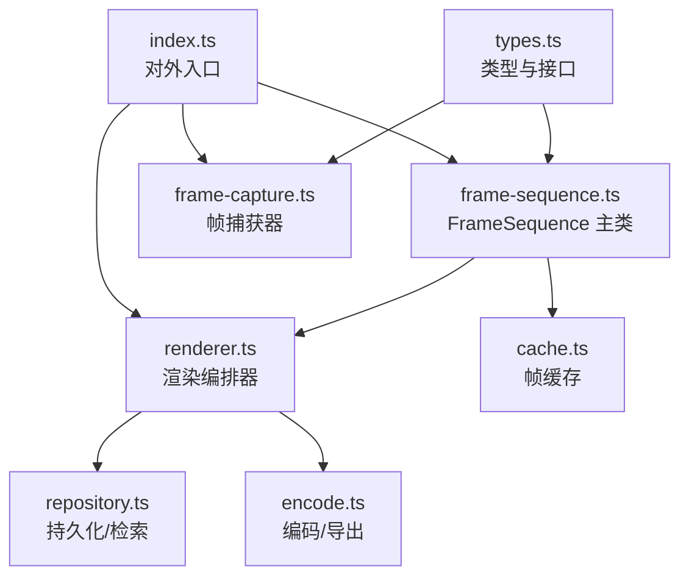
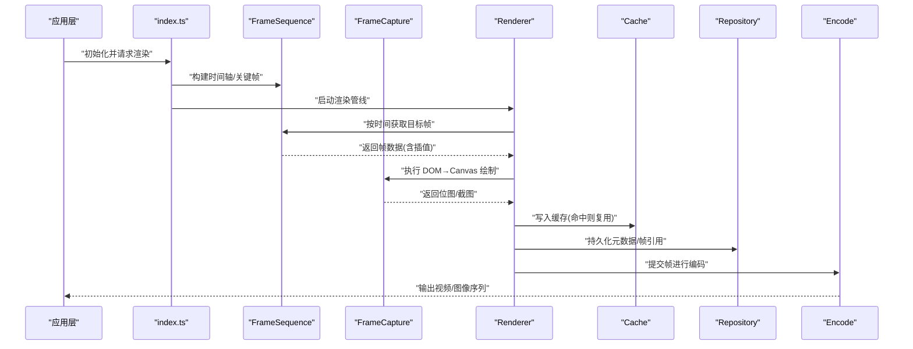
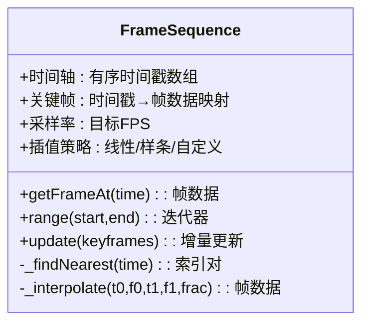
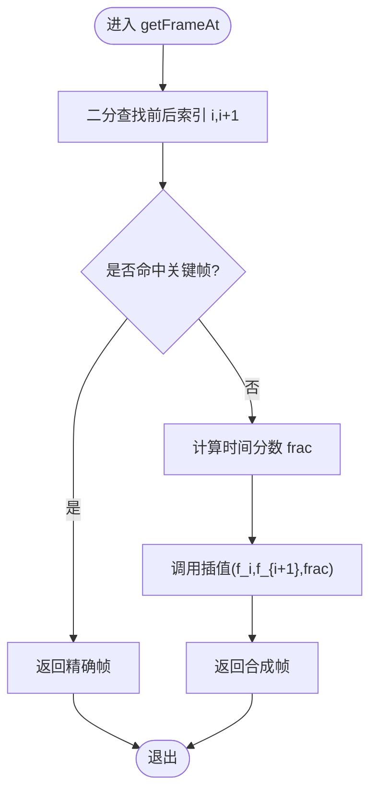
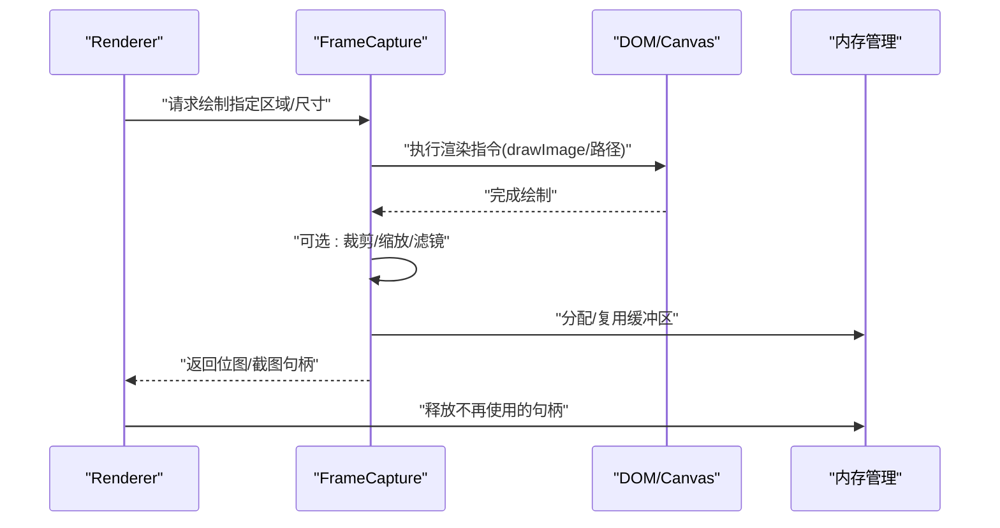
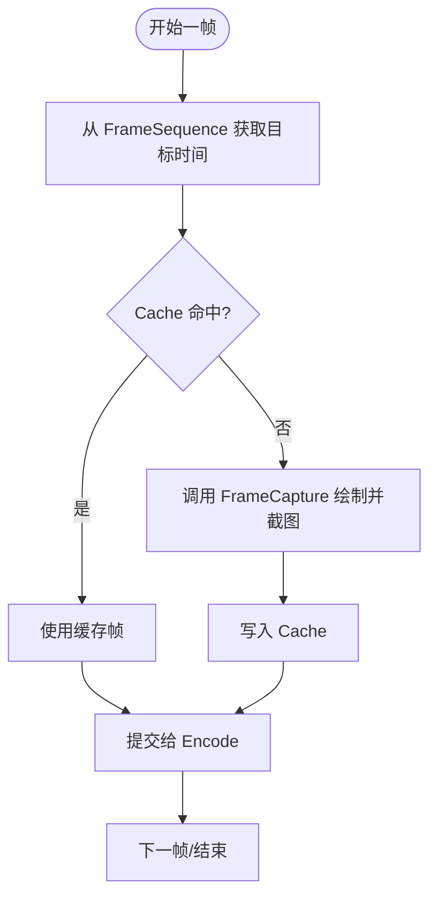
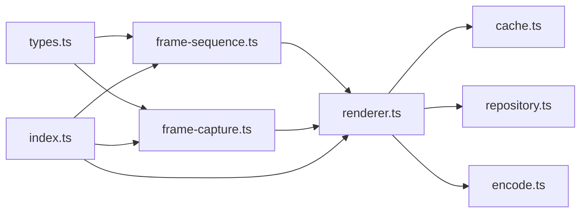

# 帧序列处理

<cite>
**本文引用的文件**   
- [src/features/render/frame-sequence.ts](file://src/features/render/frame-sequence.ts)
- [src/features/render/frame-capture.ts](file://src/features/render/frame-capture.ts)
- [src/features/render/renderer.ts](file://src/features/render/renderer.ts)
- [src/features/render/cache.ts](file://src/features/render/cache.ts)
- [src/features/render/repository.ts](file://src/features/render/repository.ts)
- [src/features/render/encode.ts](file://src/features/render/encode.ts)
- [src/features/render/types.ts](file://src/features/render/types.ts)
- [src/features/render/index.ts](file://src/features/render/index.ts)
</cite>

## 目录
1. [简介](#简介)
2. [项目结构](#项目结构)
3. [核心组件](#核心组件)
4. [架构总览](#架构总览)
5. [详细组件分析](#详细组件分析)
6. [依赖关系分析](#依赖关系分析)
7. [性能考虑](#性能考虑)
8. [故障排查指南](#故障排查指南)
9. [结论](#结论)
10. [附录](#附录)

## 简介
本技术文档聚焦于 CodeVideoCanvas 的“帧序列处理”模块，围绕 FrameSequence 类的设计与实现展开，系统阐述：
- 帧数据的组织结构、时间轴映射算法与帧间插值计算
- 帧捕获机制（屏幕截图获取、DOM 元素渲染、Canvas 绘制优化）
- 帧序列缓存策略、内存管理与垃圾回收
- 帧数据处理管道、格式转换流程与性能优化技巧
- 使用示例：如何创建帧序列、处理帧数据与优化渲染性能

## 项目结构
帧序列处理相关代码位于 features/render 子系统中，采用分层与职责分离的组织方式：
- types.ts：类型定义与接口契约
- frame-sequence.ts：FrameSequence 主类，负责时间轴、索引、插值与访问语义
- frame-capture.ts：帧捕获器，封装 DOM 到 Canvas 的绘制与截图
- renderer.ts：渲染编排器，协调帧生成、捕获与输出
- cache.ts：帧级缓存，提供 LRU 等策略与内存控制
- repository.ts：持久化与检索，对接后端或本地存储
- encode.ts：编码与导出，将帧序列转换为视频或图像流
- index.ts：对外统一入口



图表来源
- [src/features/render/types.ts](file://src/features/render/types.ts)
- [src/features/render/frame-sequence.ts](file://src/features/render/frame-sequence.ts)
- [src/features/render/frame-capture.ts](file://src/features/render/frame-capture.ts)
- [src/features/render/renderer.ts](file://src/features/render/renderer.ts)
- [src/features/render/cache.ts](file://src/features/render/cache.ts)
- [src/features/render/repository.ts](file://src/features/render/repository.ts)
- [src/features/render/encode.ts](file://src/features/render/encode.ts)
- [src/features/render/index.ts](file://src/features/render/index.ts)

章节来源
- [src/features/render/index.ts](file://src/features/render/index.ts)
- [src/features/render/types.ts](file://src/features/render/types.ts)

## 核心组件
- FrameSequence：维护时间轴、关键帧集合、采样率与插值策略；提供按时间戳访问、范围查询与增量更新能力。
- FrameCapture：封装 DOM 渲染到 Canvas 的过程，支持离屏渲染、批量绘制与截图压缩。
- Renderer：驱动渲染循环，协调 FrameSequence 的时间推进、FrameCapture 的绘制与结果落盘或编码。
- Cache：LRU 或容量受限的帧缓存，避免重复计算与内存膨胀。
- Repository：帧元数据与二进制数据的持久化与检索。
- Encode：将帧序列编码为媒体容器或图像序列。

章节来源
- [src/features/render/frame-sequence.ts](file://src/features/render/frame-sequence.ts)
- [src/features/render/frame-capture.ts](file://src/features/render/frame-capture.ts)
- [src/features/render/renderer.ts](file://src/features/render/renderer.ts)
- [src/features/render/cache.ts](file://src/features/render/cache.ts)
- [src/features/render/repository.ts](file://src/features/render/repository.ts)
- [src/features/render/encode.ts](file://src/features/render/encode.ts)

## 架构总览
下图展示了从应用调用到最终输出的端到端流程，以及各组件间的协作关系。



图表来源
- [src/features/render/index.ts](file://src/features/render/index.ts)
- [src/features/render/frame-sequence.ts](file://src/features/render/frame-sequence.ts)
- [src/features/render/frame-capture.ts](file://src/features/render/frame-capture.ts)
- [src/features/render/renderer.ts](file://src/features/render/renderer.ts)
- [src/features/render/cache.ts](file://src/features/render/cache.ts)
- [src/features/render/repository.ts](file://src/features/render/repository.ts)
- [src/features/render/encode.ts](file://src/features/render/encode.ts)

## 详细组件分析

### FrameSequence 设计与实现
FrameSequence 是帧序列处理的核心，承担以下职责：
- 时间轴组织：以时间戳为键，维护有序的关键帧集合与采样间隔
- 时间到索引映射：通过二分查找快速定位相邻关键帧，用于线性插值
- 帧间插值：在相邻关键帧之间根据时间比例计算中间帧像素或属性
- 访问语义：支持按时间戳精确访问、范围遍历与增量更新



图表来源
- [src/features/render/frame-sequence.ts](file://src/features/render/frame-sequence.ts)
- [src/features/render/types.ts](file://src/features/render/types.ts)

章节来源
- [src/features/render/frame-sequence.ts](file://src/features/render/frame-sequence.ts)
- [src/features/render/types.ts](file://src/features/render/types.ts)

#### 时间轴映射算法
- 输入：目标时间戳 t
- 步骤：
  1) 在有序时间戳数组中二分查找 t 的前后边界索引 i、i+1
  2) 若命中关键帧直接返回；否则计算分数 frac = (t - t_i)/(t_{i+1} - t_i)
  3) 调用插值函数基于 f_i 与 f_{i+1} 合成中间帧
- 复杂度：O(log N) 查找 + O(K) 插值（K 为像素规模或特征维度）



图表来源
- [src/features/render/frame-sequence.ts](file://src/features/render/frame-sequence.ts)

#### 帧间插值计算
- 线性插值：对像素通道或属性做加权平均
- 高级插值：可替换为样条或物理模型驱动的插值
- 注意事项：保持色彩空间一致、避免溢出与抖动

章节来源
- [src/features/render/frame-sequence.ts](file://src/features/render/frame-sequence.ts)

### 帧捕获机制
帧捕获器负责将 DOM 渲染结果高效地绘制到 Canvas 并提取位图：
- 离屏渲染：使用独立 Canvas 隔离 UI 线程
- 批量绘制：合并多次 drawImage 减少状态切换
- 截图压缩：按需启用有损/无损压缩，平衡质量与体积
- 资源清理：及时释放 ImageBitmap/OffscreenCanvas 引用



图表来源
- [src/features/render/frame-capture.ts](file://src/features/render/frame-capture.ts)
- [src/features/render/renderer.ts](file://src/features/render/renderer.ts)

章节来源
- [src/features/render/frame-capture.ts](file://src/features/render/frame-capture.ts)
- [src/features/render/renderer.ts](file://src/features/render/renderer.ts)

### 渲染编排器（Renderer）
Renderer 串联 FrameSequence 与 FrameCapture，并管理缓存与编码：
- 驱动渲染循环：按 FPS 推进时间，触发逐帧绘制
- 缓存命中：优先从 Cache 取帧，未命中再走捕获流程
- 编码集成：将帧送入 Encode 进行打包或转码
- 错误恢复：捕获异常并降级（如跳过帧、回退到较低分辨率）



图表来源
- [src/features/render/renderer.ts](file://src/features/render/renderer.ts)
- [src/features/render/cache.ts](file://src/features/render/cache.ts)
- [src/features/render/encode.ts](file://src/features/render/encode.ts)

章节来源
- [src/features/render/renderer.ts](file://src/features/render/renderer.ts)
- [src/features/render/cache.ts](file://src/features/render/cache.ts)
- [src/features/render/encode.ts](file://src/features/render/encode.ts)

### 缓存策略与内存管理
- 策略：LRU 或容量上限 + 最近最少使用淘汰
- 键设计：包含分辨率、时间戳、样式指纹等，确保一致性
- 内存控制：限制最大字节数与条目数，定期触发 GC 友好释放
- 失效：当关键帧变更或配置变化时，选择性清空相关缓存

```mermaid
classDiagram
class Cache {
+容量 : 字节/条目
+命中率 : 统计
+put(key,value) : void
+get(key) : value?
+invalidate(pattern) : void
-evict() : void
}
class FrameSequence
class Renderer
Cache <.. Renderer : "读写帧缓存"
Cache <.. FrameSequence : "可选 : 插值结果缓存"
```

图表来源
- [src/features/render/cache.ts](file://src/features/render/cache.ts)
- [src/features/render/renderer.ts](file://src/features/render/renderer.ts)
- [src/features/render/frame-sequence.ts](file://src/features/render/frame-sequence.ts)

章节来源
- [src/features/render/cache.ts](file://src/features/render/cache.ts)
- [src/features/render/renderer.ts](file://src/features/render/renderer.ts)
- [src/features/render/frame-sequence.ts](file://src/features/render/frame-sequence.ts)

### 持久化与检索（Repository）
- 作用：保存帧元数据（时间戳、尺寸、哈希）、索引与二进制片段
- 接口：按时间范围查询、按 ID 获取、批量写入
- 用途：断点续渲、回放预览、离线导出

章节来源
- [src/features/render/repository.ts](file://src/features/render/repository.ts)

### 编码与导出（Encode）
- 功能：将帧序列编码为视频容器或图像序列
- 选项：比特率、编码器、关键帧间隔、质量等级
- 流式处理：边渲染边编码，降低峰值内存

章节来源
- [src/features/render/encode.ts](file://src/features/render/encode.ts)

### 对外入口（index.ts）
- 聚合 API：暴露创建帧序列、启动渲染、导出等高层方法
- 默认配置：提供常用参数预设与最佳实践

章节来源
- [src/features/render/index.ts](file://src/features/render/index.ts)

## 依赖关系分析
- 低耦合：FrameSequence 仅依赖类型定义与基础工具
- 明确边界：Renderer 作为编排者，不侵入具体绘制细节
- 可扩展：插值策略、缓存策略、编码后端均可替换



图表来源
- [src/features/render/types.ts](file://src/features/render/types.ts)
- [src/features/render/frame-sequence.ts](file://src/features/render/frame-sequence.ts)
- [src/features/render/frame-capture.ts](file://src/features/render/frame-capture.ts)
- [src/features/render/renderer.ts](file://src/features/render/renderer.ts)
- [src/features/render/cache.ts](file://src/features/render/cache.ts)
- [src/features/render/repository.ts](file://src/features/render/repository.ts)
- [src/features/render/encode.ts](file://src/features/render/encode.ts)
- [src/features/render/index.ts](file://src/features/render/index.ts)

章节来源
- [src/features/render/index.ts](file://src/features/render/index.ts)
- [src/features/render/types.ts](file://src/features/render/types.ts)

## 性能考虑
- 时间轴与插值
  - 使用二分查找保证 O(log N) 定位
  - 插值尽量在 GPU 或 WebAssembly 加速路径上执行
- 捕获与绘制
  - 离屏 Canvas 与 OffscreenCanvas 并行绘制
  - 合并绘制批次，减少状态切换与重绘
  - 按需裁剪与缩放，避免全量拷贝
- 缓存与内存
  - 合理设置缓存容量与淘汰策略
  - 及时释放 ImageBitmap/ArrayBuffer，避免内存泄漏
- 编码与 I/O
  - 流式编码，降低峰值内存
  - 选择合适的编码器与关键帧间隔，平衡质量与体积

[本节为通用指导，无需源码引用]

## 故障排查指南
- 常见症状
  - 画面闪烁或跳帧：检查插值区间与时间对齐
  - 内存持续增长：确认缓存淘汰与句柄释放
  - 导出失败：核对编码器参数与可用特性
- 诊断要点
  - 记录缓存命中率与淘汰次数
  - 监控每帧耗时与绘制批次数量
  - 校验时间戳单调性与去重
- 修复建议
  - 调整采样率与关键帧密度
  - 增大缓存容量或细化失效粒度
  - 降级分辨率或关闭非必要滤镜

章节来源
- [src/features/render/cache.ts](file://src/features/render/cache.ts)
- [src/features/render/renderer.ts](file://src/features/render/renderer.ts)
- [src/features/render/encode.ts](file://src/features/render/encode.ts)

## 结论
FrameSequence 通过清晰的时间轴与高效的映射/插值算法，为帧序列处理提供了稳定内核；配合帧捕获、缓存、编码与持久化组件，形成高内聚、低耦合的渲染管线。遵循本文的性能与排障建议，可在保证画质的前提下获得更优的吞吐与稳定性。

[本节为总结性内容，无需源码引用]

## 附录

### 使用示例（概念性步骤）
- 创建帧序列
  - 定义关键帧集合与时间戳
  - 选择采样率与插值策略
  - 初始化 FrameSequence 实例
- 处理帧数据
  - 按时间获取帧，必要时启用缓存
  - 对帧进行裁剪、缩放或滤镜处理
- 优化渲染性能
  - 使用离屏 Canvas 与批绘制
  - 调整缓存大小与淘汰策略
  - 流式编码，避免一次性加载全部帧

[本节为概念性说明，无需源码引用]