# 渲染引擎设计

<cite>
**本文引用的文件**   
- [src/features/render/renderer.ts](file://src/features/render/renderer.ts)
- [src/features/render/frame-sequence.ts](file://src/features/render/frame-sequence.ts)
- [src/features/render/encode.ts](file://src/features/render/encode.ts)
- [src/features/render/cache.ts](file://src/features/render/cache.ts)
- [src/features/render/types.ts](file://src/features/render/types.ts)
- [src/features/render/export-service.ts](file://src/features/render/export-service.ts)
- [src/features/render/repository.ts](file://src/features/render/repository.ts)
- [src/features/render/queue-handler.ts](file://src/features/render/queue-handler.ts)
- [src/features/render/frame-capture.ts](file://src/features/render/frame-capture.ts)
- [src/features/render/concat.ts](file://src/features/render/concat.ts)
- [src/features/render/qa-check.ts](file://src/features/render/qa-check.ts)
- [src/app/api/render/export/route.ts](file://src/app/api/render/export/route.ts)
- [src/app/canvas/shot/[id]/page.tsx](file://src/app/canvas/shot/[id]/page.tsx)
- [src/components/ui/contact-sheet-thumb.tsx](file://src/components/ui/contact-sheet-thumb.tsx)
</cite>

## 更新摘要
**变更内容**   
- 新增质量保证(QA)检查系统章节，详细说明JIMP-based的黑帧检测和纯色检测功能
- 更新导出服务架构，包含QA检查结果的数据流和存储机制
- 扩展API接口文档，说明GET /api/render/export端点的shotQa字段返回格式
- 增强渲染管线图，展示QA检查在渲染流程中的集成位置
- 更新错误处理和监控部分，涵盖QA检查失败的处理策略

## 目录
1. [简介](#简介)
2. [项目结构](#项目结构)
3. [核心组件](#核心组件)
4. [架构总览](#架构总览)
5. [详细组件分析](#详细组件分析)
6. [质量保证(QA)检查系统](#质量保证qa检查系统)
7. [共享缩略图基础设施](#共享缩略图基础设施)
8. [镜头渲染器页面集成模式](#镜头渲染器页面集成模式)
9. [依赖关系分析](#依赖关系分析)
10. [性能考虑](#性能考虑)
11. [故障排查指南](#故障排查指南)
12. [结论](#结论)
13. [附录：使用示例与配置](#附录使用示例与配置)

## 简介
本设计文档面向 CodeVideoCanvas 的渲染引擎，系统性阐述渲染管线架构与实现要点。重点覆盖以下方面：
- Renderer 核心渲染器的职责、调度策略与生命周期
- FrameSequence 帧序列处理机制与时间线对齐
- Encoder 编码转换模块的格式支持与参数配置
- Cache 缓存策略与命中判定
- **新增** QA检查系统的黑帧检测和纯色检测功能
- 渲染任务调度算法、内存管理策略与性能优化技术
- 渲染队列处理流程、错误恢复机制与进度跟踪
- 不同视频格式的支持情况与编码参数配置
- 共享缩略图基础设施的设计与实现
- 镜头渲染器页面集成模式的最佳实践
- 具体使用示例：如何配置渲染参数并处理渲染结果

## 项目结构
渲染相关代码集中在 features/render 目录，API 层在 app/api/render 下提供 HTTP 接口。关键文件职责如下：
- renderer.ts：核心渲染器，负责帧生成、调度与输出控制
- frame-sequence.ts：帧序列抽象，封装时间轴、帧索引与采样策略
- encode.ts：编码器适配，统一编码接口与参数映射
- cache.ts：渲染缓存，基于键值存储减少重复计算
- types.ts：类型定义与常量，贯穿各模块
- export-service.ts：导出服务，协调渲染、编码与产物落盘
- repository.ts：产物仓库，持久化与检索渲染产物
- queue-handler.ts：队列处理器，负责任务入队、出队与并发控制
- frame-capture.ts：帧捕获，从 Canvas 或媒体源提取像素数据
- concat.ts：片段拼接，将多段编码产物合并为最终视频
- **新增** qa-check.ts：质量保证检查，基于JIMP进行黑帧检测和纯色检测
- route.ts：HTTP 路由，接收导出请求并委派至导出服务
- contact-sheet-thumb.tsx：缩略图组件，提供统一的缩略图显示能力
- shot/[id]/page.tsx：镜头详情页面，集成渲染引擎与缩略图功能

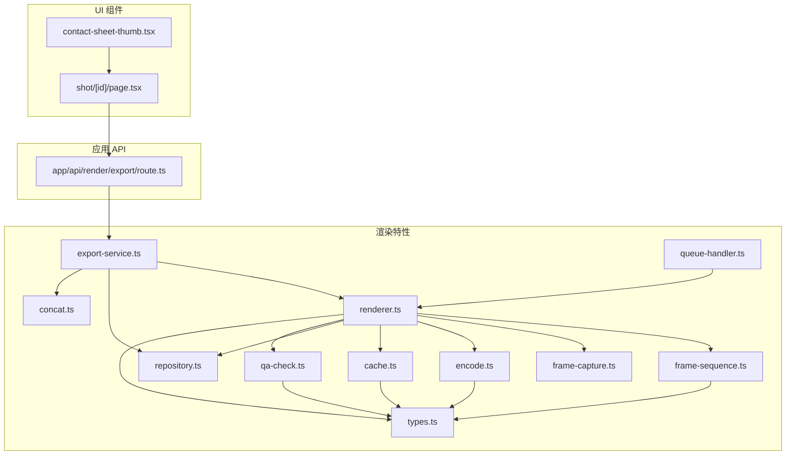

图表来源
- [src/features/render/renderer.ts](file://src/features/render/renderer.ts)
- [src/features/render/frame-sequence.ts](file://src/features/render/frame-sequence.ts)
- [src/features/render/encode.ts](file://src/features/render/encode.ts)
- [src/features/render/cache.ts](file://src/features/render/cache.ts)
- [src/features/render/types.ts](file://src/features/render/types.ts)
- [src/features/render/export-service.ts](file://src/features/render/export-service.ts)
- [src/features/render/repository.ts](file://src/features/render/repository.ts)
- [src/features/render/queue-handler.ts](file://src/features/render/queue-handler.ts)
- [src/features/render/frame-capture.ts](file://src/features/render/frame-capture.ts)
- [src/features/render/concat.ts](file://src/features/render/concat.ts)
- [src/features/render/qa-check.ts](file://src/features/render/qa-check.ts)
- [src/app/api/render/export/route.ts](file://src/app/api/render/export/route.ts)
- [src/components/ui/contact-sheet-thumb.tsx](file://src/components/ui/contact-sheet-thumb.tsx)
- [src/app/canvas/shot/[id]/page.tsx](file://src/app/canvas/shot/[id]/page.tsx)

章节来源
- [src/features/render/renderer.ts](file://src/features/render/renderer.ts)
- [src/features/render/frame-sequence.ts](file://src/features/render/frame-sequence.ts)
- [src/features/render/encode.ts](file://src/features/render/encode.ts)
- [src/features/render/cache.ts](file://src/features/render/cache.ts)
- [src/features/render/types.ts](file://src/features/render/types.ts)
- [src/features/render/export-service.ts](file://src/features/render/export-service.ts)
- [src/features/render/repository.ts](file://src/features/render/repository.ts)
- [src/features/render/queue-handler.ts](file://src/features/render/queue-handler.ts)
- [src/features/render/frame-capture.ts](file://src/features/render/frame-capture.ts)
- [src/features/render/concat.ts](file://src/features/render/concat.ts)
- [src/features/render/qa-check.ts](file://src/features/render/qa-check.ts)
- [src/app/api/render/export/route.ts](file://src/app/api/render/export/route.ts)
- [src/components/ui/contact-sheet-thumb.tsx](file://src/components/ui/contact-sheet-thumb.tsx)
- [src/app/canvas/shot/[id]/page.tsx](file://src/app/canvas/shot/[id]/page.tsx)

## 核心组件
本节概述各核心组件的职责与交互方式，帮助读者快速建立整体认知。

- Renderer（核心渲染器）
  - 职责：驱动帧序列推进、调用帧捕获、执行编码、写入缓存与仓库、上报进度与状态
  - 关键点：支持并发渲染、可插拔编码器、可配置缓存策略、错误隔离与重试
- FrameSequence（帧序列）
  - 职责：维护时间轴、帧索引、采样率、循环与裁剪区间；提供按时间获取帧的能力
  - 关键点：时间到帧号的映射、边界检查、增量更新
- Encoder（编码转换）
  - 职责：将像素数据转换为指定容器与编码格式；暴露统一的编码接口与参数映射
  - 关键点：格式支持矩阵、码率/分辨率/帧率等参数校验、流式写入
- Cache（缓存）
  - 职责：对已渲染帧或中间产物进行键值缓存，避免重复计算
  - 关键点：缓存键生成、过期策略、容量限制、命中率统计
- ExportService（导出服务）
  - 职责：编排渲染、编码、拼接与持久化；对外暴露导出 API
  - 关键点：任务拆分、阶段回调、失败回滚、产物元数据
- Repository（产物仓库）
  - 职责：存储与检索渲染产物，提供版本与路径管理
  - 关键点：原子写入、幂等性、清理策略
- QueueHandler（队列处理器）
  - 职责：管理渲染任务队列、并发度、优先级与重试
  - 关键点：背压控制、超时、死信队列
- FrameCapture（帧捕获）
  - 职责：从 Canvas 或媒体源抓取帧数据，转换为编码器输入
  - 关键点：像素格式转换、缩放与裁剪、异步读取
- Concat（片段拼接）
  - 职责：将多个编码片段合并为最终视频
  - 关键点：顺序保证、无缝衔接、异常恢复
- **新增** QACheck（质量保证检查器）
  - 职责：基于JIMP库进行黑帧检测和纯色检测，确保视频质量
  - 关键点：像素分析算法、阈值配置、批量检测、结果聚合
- ThumbnailGenerator（缩略图生成器）
  - 职责：生成视频缩略图，支持多种尺寸与格式
  - 关键点：批量生成、缓存策略、质量优化
- ContactSheetThumb（联系表缩略图组件）
  - 职责：提供统一的缩略图显示组件，支持懒加载与占位符
  - 关键点：响应式设计、错误处理、性能优化

章节来源
- [src/features/render/renderer.ts](file://src/features/render/renderer.ts)
- [src/features/render/frame-sequence.ts](file://src/features/render/frame-sequence.ts)
- [src/features/render/encode.ts](file://src/features/render/encode.ts)
- [src/features/render/cache.ts](file://src/features/render/cache.ts)
- [src/features/render/export-service.ts](file://src/features/render/export-service.ts)
- [src/features/render/repository.ts](file://src/features/render/repository.ts)
- [src/features/render/queue-handler.ts](file://src/features/render/queue-handler.ts)
- [src/features/render/frame-capture.ts](file://src/features/render/frame-capture.ts)
- [src/features/render/concat.ts](file://src/features/render/concat.ts)
- [src/features/render/qa-check.ts](file://src/features/render/qa-check.ts)
- [src/components/ui/contact-sheet-thumb.tsx](file://src/components/ui/contact-sheet-thumb.tsx)

## 架构总览
渲染管线采用"序列驱动 + 流水线"的架构：FrameSequence 提供时间驱动的帧访问，Renderer 作为调度中心协调 Capture、Encode、Cache、Repository、Concat 与 QACheck，ExportService 对外暴露端到端导出能力，QueueHandler 保障高并发下的稳定性。**新增** 的QA检查系统在渲染完成后对视频质量进行全面检测，并通过API返回检测结果。

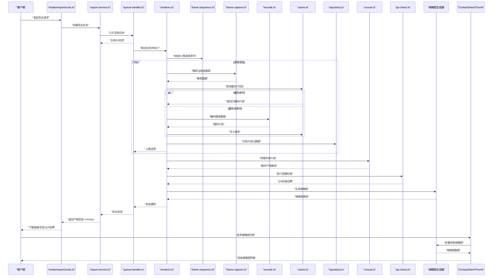

图表来源
- [src/app/api/render/export/route.ts](file://src/app/api/render/export/route.ts)
- [src/features/render/export-service.ts](file://src/features/render/export-service.ts)
- [src/features/render/queue-handler.ts](file://src/features/render/queue-handler.ts)
- [src/features/render/renderer.ts](file://src/features/render/renderer.ts)
- [src/features/render/frame-sequence.ts](file://src/features/render/frame-sequence.ts)
- [src/features/render/frame-capture.ts](file://src/features/render/frame-capture.ts)
- [src/features/render/encode.ts](file://src/features/render/encode.ts)
- [src/features/render/cache.ts](file://src/features/render/cache.ts)
- [src/features/render/repository.ts](file://src/features/render/repository.ts)
- [src/features/render/concat.ts](file://src/features/render/concat.ts)
- [src/features/render/qa-check.ts](file://src/features/render/qa-check.ts)
- [src/components/ui/contact-sheet-thumb.tsx](file://src/components/ui/contact-sheet-thumb.tsx)

## 详细组件分析

### Renderer 核心渲染器
- 设计目标
  - 以帧序列为驱动，统一调度捕获、编码、缓存、持久化、拼接与质量检查
  - 支持并发渲染与断点续渲，具备错误隔离与重试能力
- 关键流程
  - 初始化：加载 FrameSequence、Encoder、Cache、Repository、QACheck 配置
  - 渲染循环：按时间推进帧号，触发捕获与编码，更新进度
  - 结束处理：触发拼接、执行QA检查、生成缩略图、清理临时资源、发布完成事件
- 并发与调度
  - 通过队列处理器控制并发度，避免内存峰值过高
  - 支持分片渲染，每 N 帧写入一次以减少 I/O 压力
- 错误恢复
  - 单帧失败不中断整体任务，记录失败帧并重试
  - 支持跳过坏帧或降级编码参数继续渲染
  - QA检查失败不影响渲染完成，但会标记质量问题
- 进度跟踪
  - 基于帧总数与已完成帧数计算百分比
  - 阶段性回调：开始、进行中、完成、失败

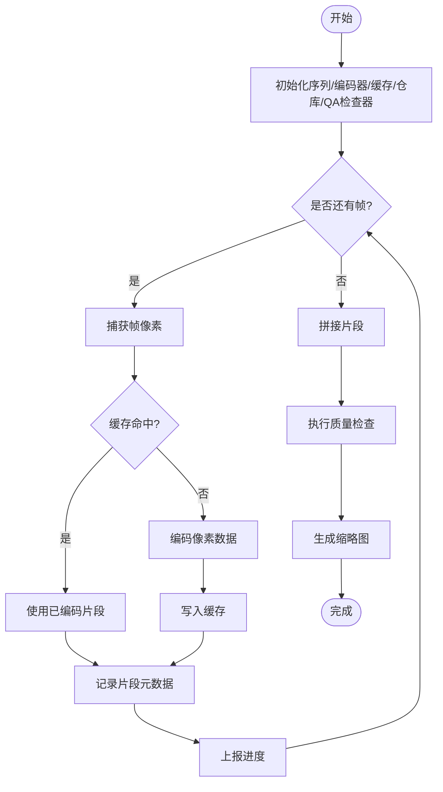

图表来源
- [src/features/render/renderer.ts](file://src/features/render/renderer.ts)
- [src/features/render/frame-sequence.ts](file://src/features/render/frame-sequence.ts)
- [src/features/render/frame-capture.ts](file://src/features/render/frame-capture.ts)
- [src/features/render/encode.ts](file://src/features/render/encode.ts)
- [src/features/render/cache.ts](file://src/features/render/cache.ts)
- [src/features/render/repository.ts](file://src/features/render/repository.ts)
- [src/features/render/concat.ts](file://src/features/render/concat.ts)
- [src/features/render/qa-check.ts](file://src/features/render/qa-check.ts)

章节来源
- [src/features/render/renderer.ts](file://src/features/render/renderer.ts)

### FrameSequence 帧序列处理机制
- 设计目标
  - 抽象时间线与帧索引的关系，提供稳定的帧访问接口
- 关键能力
  - 时间到帧号映射：根据帧率与时间戳计算帧索引
  - 裁剪与循环：支持起止时间与循环播放
  - 增量推进：避免全量重算，提升大时长视频渲染效率
- 复杂度
  - 时间到帧号映射 O(1)
  - 边界检查与越界保护 O(1)
- 与其他组件协作
  - 被 Renderer 驱动，提供下一帧时间点
  - 与 FrameCapture 配合，确保捕获内容与时间一致

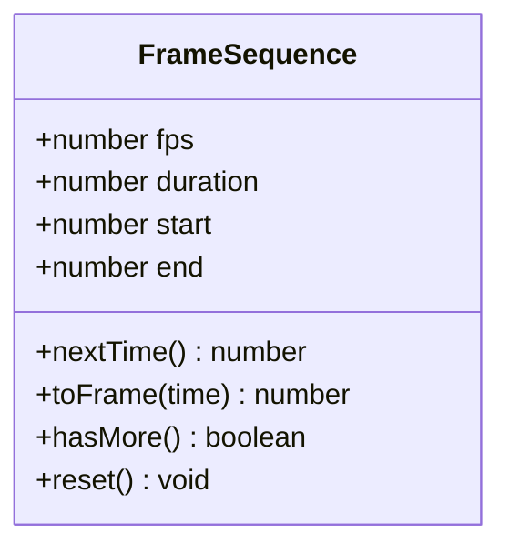

图表来源
- [src/features/render/frame-sequence.ts](file://src/features/render/frame-sequence.ts)

章节来源
- [src/features/render/frame-sequence.ts](file://src/features/render/frame-sequence.ts)

### Encoder 编码转换模块
- 设计目标
  - 统一编码接口，屏蔽底层编码器差异，支持多种视频格式
- 关键能力
  - 格式支持：常见容器与编码（如 MP4/H.264、WebM/VP9 等）
  - 参数映射：码率、分辨率、帧率、质量等级、GOP 等
  - 流式写入：边编码边落盘，降低内存占用
- 错误处理
  - 编码失败时抛出明确错误码，便于上层重试或降级
  - 支持参数校验与自动修正（如分辨率对齐）

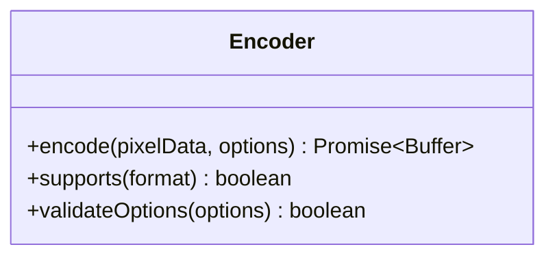

图表来源
- [src/features/render/encode.ts](file://src/features/render/encode.ts)
- [src/features/render/types.ts](file://src/features/render/types.ts)

章节来源
- [src/features/render/encode.ts](file://src/features/render/encode.ts)
- [src/features/render/types.ts](file://src/features/render/types.ts)

### Cache 缓存策略
- 设计目标
  - 对已渲染帧或中间产物进行缓存，减少重复计算与编码开销
- 关键策略
  - 键生成：基于帧号、编码参数哈希、时间戳等组合
  - 容量限制：LRU 淘汰策略，防止内存溢出
  - 过期策略：按时间或大小阈值清理
- 指标与监控
  - 命中率、平均延迟、内存占用
- 与渲染器协作
  - 渲染前查询缓存，命中则跳过编码与 I/O

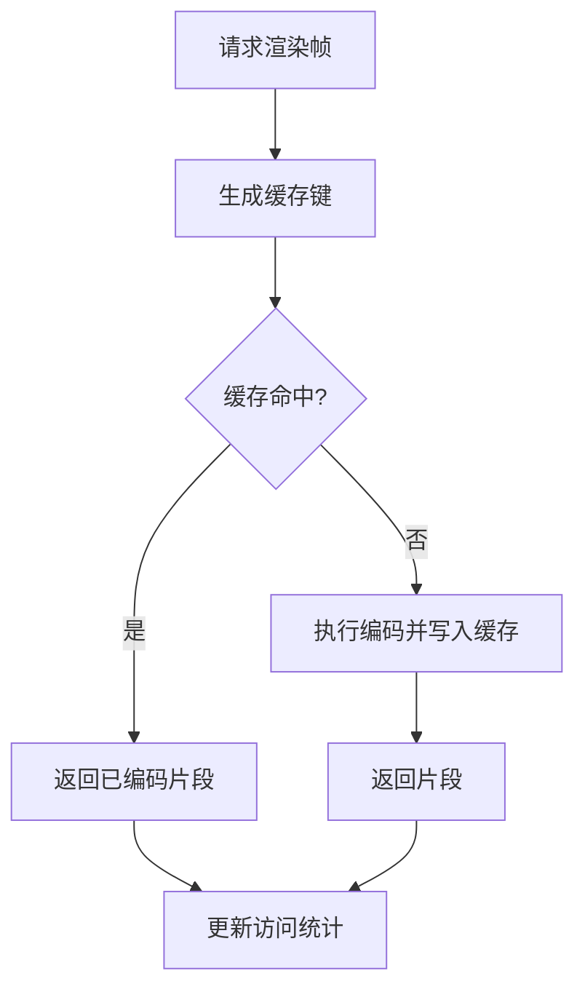

图表来源
- [src/features/render/cache.ts](file://src/features/render/cache.ts)
- [src/features/render/types.ts](file://src/features/render/types.ts)

章节来源
- [src/features/render/cache.ts](file://src/features/render/cache.ts)

### ExportService 导出服务
- 设计目标
  - 对外提供端到端的导出能力，协调渲染、编码、拼接、QA检查与持久化
- 关键流程
  - 接收导出请求，创建任务并分配 ID
  - 将任务入队，监听进度与完成事件
  - 完成后返回产物路径、元数据与QA检查结果
- 错误恢复
  - 任务失败时记录原因，支持重试与回滚
- 进度跟踪
  - 阶段回调：准备、渲染中、拼接中、QA检查中、完成、失败

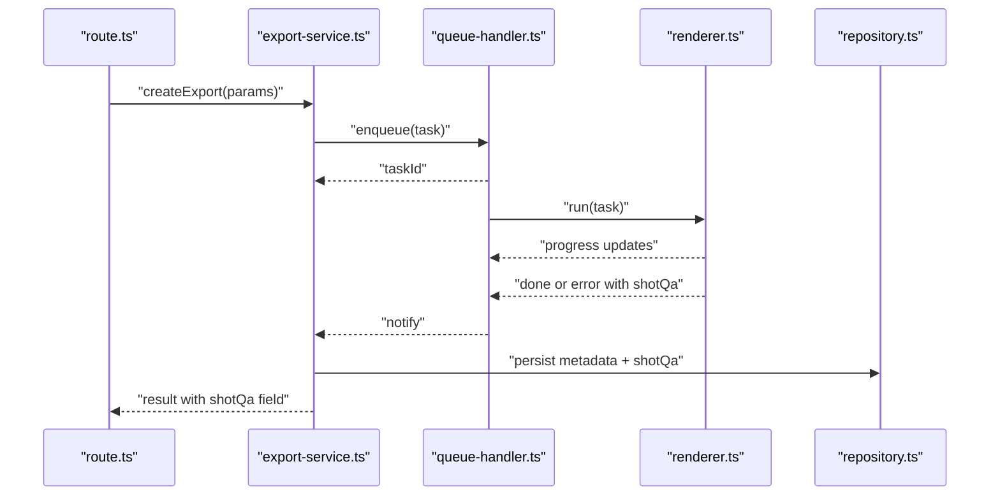

图表来源
- [src/app/api/render/export/route.ts](file://src/app/api/render/export/route.ts)
- [src/features/render/export-service.ts](file://src/features/render/export-service.ts)
- [src/features/render/queue-handler.ts](file://src/features/render/queue-handler.ts)
- [src/features/render/renderer.ts](file://src/features/render/renderer.ts)
- [src/features/render/repository.ts](file://src/features/render/repository.ts)

章节来源
- [src/features/render/export-service.ts](file://src/features/render/export-service.ts)
- [src/app/api/render/export/route.ts](file://src/app/api/render/export/route.ts)

### QueueHandler 队列处理器
- 设计目标
  - 管理渲染任务队列，控制并发度与优先级，保障系统稳定
- 关键能力
  - 入队/出队：支持优先级与超时
  - 并发控制：限制同时运行的渲染任务数量
  - 重试与死信：失败任务可重试，多次失败进入死信队列
- 监控与告警
  - 队列长度、平均等待时间、失败率

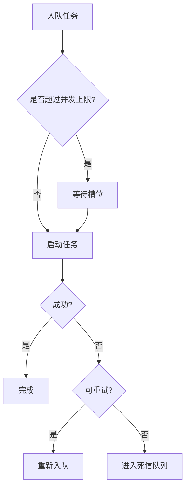

图表来源
- [src/features/render/queue-handler.ts](file://src/features/render/queue-handler.ts)

章节来源
- [src/features/render/queue-handler.ts](file://src/features/render/queue-handler.ts)

### FrameCapture 帧捕获
- 设计目标
  - 从 Canvas 或媒体源高效抓取帧数据，转换为编码器输入
- 关键能力
  - 像素格式转换：RGBA/YUV 等
  - 缩放与裁剪：按目标分辨率调整
  - 异步读取：避免阻塞主线程
- 性能优化
  - 复用缓冲区，减少对象分配
  - 批量读取与批处理

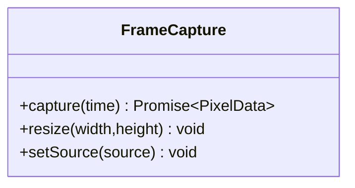

图表来源
- [src/features/render/frame-capture.ts](file://src/features/render/frame-capture.ts)

章节来源
- [src/features/render/frame-capture.ts](file://src/features/render/frame-capture.ts)

### Concat 片段拼接
- 设计目标
  - 将多个编码片段按顺序合并为最终视频
- 关键能力
  - 顺序保证：严格按帧序拼接
  - 无缝衔接：处理 GOP 与关键帧对齐
  - 异常恢复：部分失败可重试特定片段
- 性能优化
  - 并行预处理，串行合并
  - 流式合并，降低内存峰值

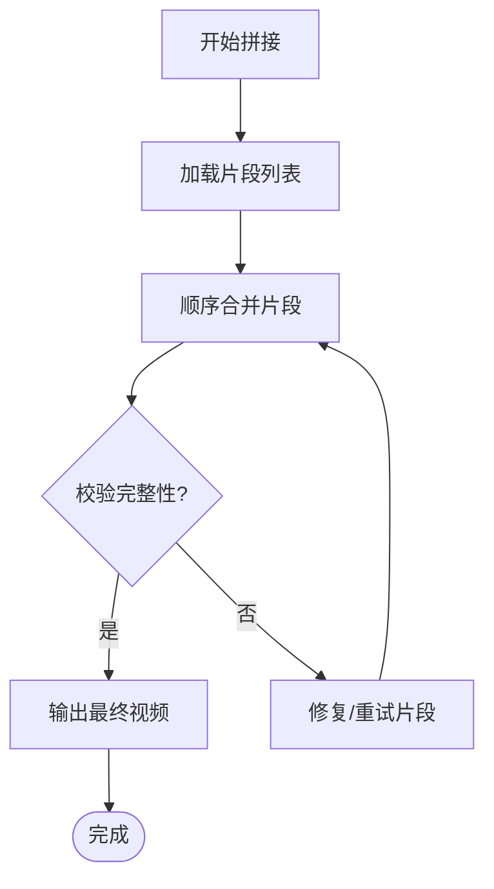

图表来源
- [src/features/render/concat.ts](file://src/features/render/concat.ts)

章节来源
- [src/features/render/concat.ts](file://src/features/render/concat.ts)

## 质量保证(QA)检查系统

### QA检查系统设计
- 设计目标
  - 基于JIMP库实现视频质量自动化检测，确保输出视频符合质量标准
  - 提供黑帧检测和纯色检测功能，识别潜在的视频质量问题
  - 检查结果存储在shot-qa节点data.qaCheck中，通过API返回给用户
- 核心功能
  - 黑帧检测：分析视频帧的平均亮度和像素分布，识别完全黑色的帧
  - 纯色检测：检测视频中是否存在大面积单一颜色的帧
  - 批量处理：支持对整个视频进行批量质量检查
  - 阈值配置：可配置的检测阈值，适应不同场景的质量要求
- 性能优化
  - 异步处理：非阻塞式质量检查，避免影响主渲染流程
  - 内存管理：及时释放图像数据，防止内存泄漏
  - 增量检查：支持对新增片段进行增量质量检查

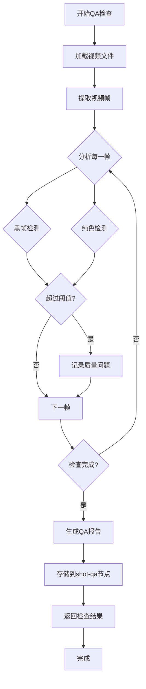

图表来源
- [src/features/render/qa-check.ts](file://src/features/render/qa-check.ts)

### JIMP图像处理集成
- 设计目标
  - 利用JIMP库的强大图像处理能力，实现精确的像素级分析
  - 支持多种图像格式和颜色空间转换
- 关键能力
  - 像素分析：获取帧的平均亮度、颜色分布、熵值等指标
  - 图像比较：对比相邻帧的差异，检测画面变化
  - 格式转换：在不同颜色空间之间进行转换分析
- 错误处理
  - 图像解码失败时的容错处理
  - 内存不足时的降级策略

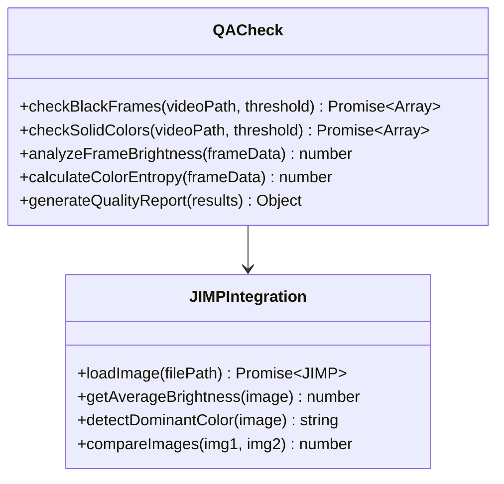

图表来源
- [src/features/render/qa-check.ts](file://src/features/render/qa-check.ts)

### QA检查结果数据结构
- 设计目标
  - 标准化的QA检查结果格式，便于前端展示和后续分析
  - 支持多种质量问题的分类和严重程度评估
- 结果结构
  - 总体评分：基于各项检测结果的综合评分
  - 问题列表：详细的质量问题清单，包含位置、类型和严重程度
  - 统计信息：检测覆盖率、问题分布等统计数据
- 存储机制
  - 存储在shot-qa节点的data.qaCheck字段中
  - 支持增量更新和版本管理

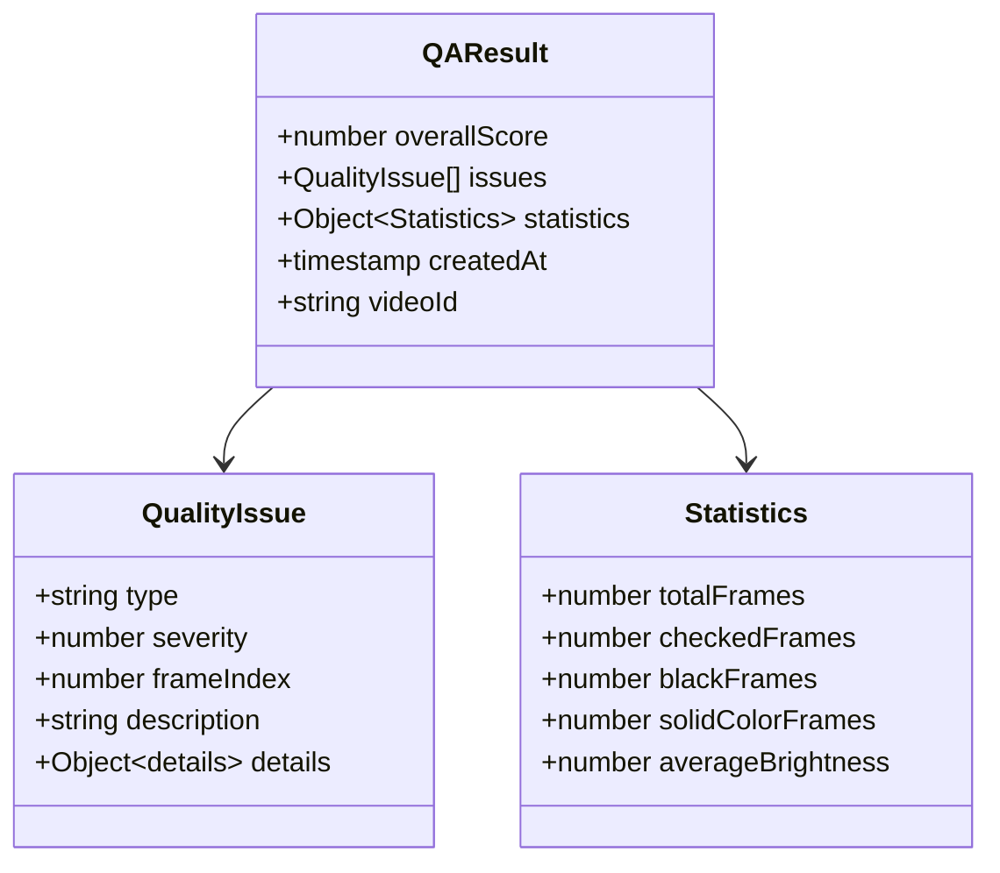

图表来源
- [src/features/render/qa-check.ts](file://src/features/render/qa-check.ts)

### API集成与数据返回
- 设计目标
  - 通过GET /api/render/export端点返回完整的QA检查结果
  - 保持API的一致性和向后兼容性
- 返回格式
  - shotQa字段：包含完整的QA检查结果对象
  - 错误处理：QA检查失败时返回空对象但不影响其他结果
  - 性能考虑：大视频文件的QA结果可能需要进行分页或延迟加载
- 前端集成
  - 实时显示QA检查结果
  - 可视化质量问题分布
  - 提供问题详情和修复建议

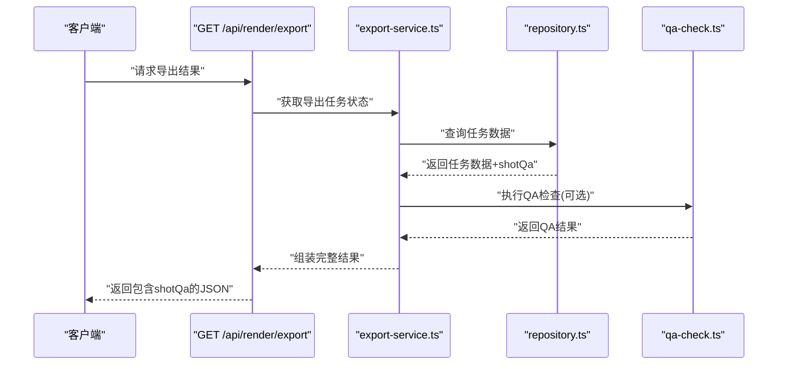

图表来源
- [src/app/api/render/export/route.ts](file://src/app/api/render/export/route.ts)
- [src/features/render/export-service.ts](file://src/features/render/export-service.ts)
- [src/features/render/repository.ts](file://src/features/render/repository.ts)
- [src/features/render/qa-check.ts](file://src/features/render/qa-check.ts)

章节来源
- [src/features/render/qa-check.ts](file://src/features/render/qa-check.ts)
- [src/app/api/render/export/route.ts](file://src/app/api/render/export/route.ts)

## 共享缩略图基础设施

### 缩略图生成器设计
- 设计目标
  - 提供高效的视频缩略图生成能力，支持批量处理与缓存
  - 与渲染引擎解耦，可独立使用于各种场景
- 核心功能
  - 批量缩略图生成：支持一次性生成多个时间点的缩略图
  - 智能缓存：基于视频路径和时间点生成唯一缓存键
  - 质量控制：支持多种尺寸和质量级别
  - 异步处理：非阻塞式生成，避免影响主线程
- 性能优化
  - 预取策略：提前加载相邻时间点的缩略图
  - 内存管理：及时释放不再使用的缩略图数据
  - 并发控制：限制同时生成的缩略图数量

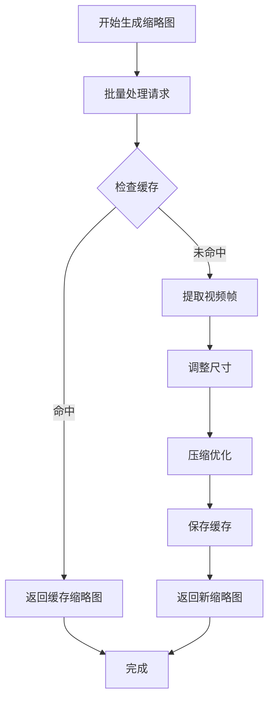

图表来源
- [src/components/ui/contact-sheet-thumb.tsx](file://src/components/ui/contact-sheet-thumb.tsx)

### 联系表缩略图组件
- 设计目标
  - 提供美观且高性能的缩略图展示组件
  - 支持懒加载、占位符和错误处理
- 关键特性
  - 响应式布局：自适应不同屏幕尺寸
  - 懒加载：滚动时按需加载缩略图
  - 占位符：加载过程中显示骨架屏
  - 错误处理：网络错误或加载失败时的降级显示
- 用户体验优化
  - 平滑过渡动画
  - 悬停效果与预览
  - 点击放大查看

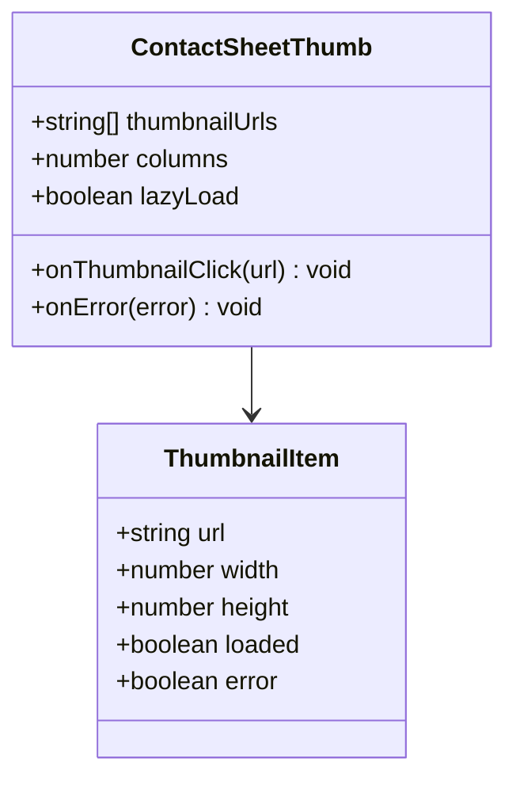

图表来源
- [src/components/ui/contact-sheet-thumb.tsx](file://src/components/ui/contact-sheet-thumb.tsx)

章节来源
- [src/components/ui/contact-sheet-thumb.tsx](file://src/components/ui/contact-sheet-thumb.tsx)

## 镜头渲染器页面集成模式

### 页面架构设计
- 设计目标
  - 将渲染引擎无缝集成到镜头详情页面
  - 提供一致的渲染体验和数据流管理
- 核心组件
  - ShotDetail：镜头详情主组件，管理渲染状态和用户交互
  - ShotPanels：侧边面板组件，显示渲染进度和设置
  - RenderEngineWrapper：渲染引擎包装器，提供简化的 API
- 数据流管理
  - 单向数据流：从 Store 到 UI 组件
  - 事件驱动：渲染事件通过事件总线传播
  - 状态同步：UI 状态与渲染状态保持一致

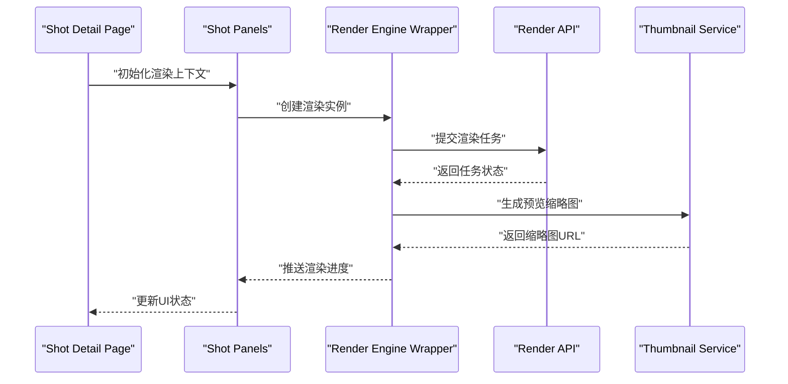

图表来源
- [src/app/canvas/shot/[id]/page.tsx](file://src/app/canvas/shot/[id]/page.tsx)
- [src/app/canvas/shot/[id]/shot-detail.tsx](file://src/app/canvas/shot/[id]/shot-detail.tsx)
- [src/app/canvas/shot/[id]/shot-panels.tsx](file://src/app/canvas/shot/[id]/shot-panels.tsx)

### 集成最佳实践
- 错误处理策略
  - 分级错误处理：网络错误、渲染错误、用户取消
  - 优雅降级：渲染失败时显示默认内容
  - 用户反馈：清晰的错误提示和重试选项
- 性能优化
  - 渲染任务去重：避免重复提交相同任务
  - 内存泄漏防护：及时清理事件监听器和定时器
  - 资源预加载：提前加载必要的渲染资源
- 用户体验
  - 实时进度反馈：显示渲染进度和预计完成时间
  - 中断支持：允许用户暂停和取消渲染任务
  - 结果预览：渲染完成后立即显示预览

章节来源
- [src/app/canvas/shot/[id]/page.tsx](file://src/app/canvas/shot/[id]/page.tsx)
- [src/app/canvas/shot/[id]/shot-detail.tsx](file://src/app/canvas/shot/[id]/shot-detail.tsx)
- [src/app/canvas/shot/[id]/shot-panels.tsx](file://src/app/canvas/shot/[id]/shot-panels.tsx)

## 依赖关系分析
- 组件耦合
  - Renderer 强依赖 FrameSequence、FrameCapture、Encoder、Cache、Repository、Concat、QACheck
  - ExportService 依赖 QueueHandler、Renderer、Repository
  - QueueHandler 依赖 Renderer 的任务执行接口
  - QACheck 依赖 JIMP 图像处理库和文件系统访问
  - ContactSheetThumb 依赖缩略图服务和图片加载器
  - Shot Detail Page 依赖渲染引擎包装器和缩略图服务
- 外部集成点
  - 文件系统：产物落盘与临时文件管理
  - 编码器后端：硬件/软件编解码器适配
  - 存储服务：缩略图和渲染产物的云端存储
  - JIMP库：图像处理和分析功能
- 潜在循环依赖
  - 通过接口解耦与事件总线避免直接循环引用

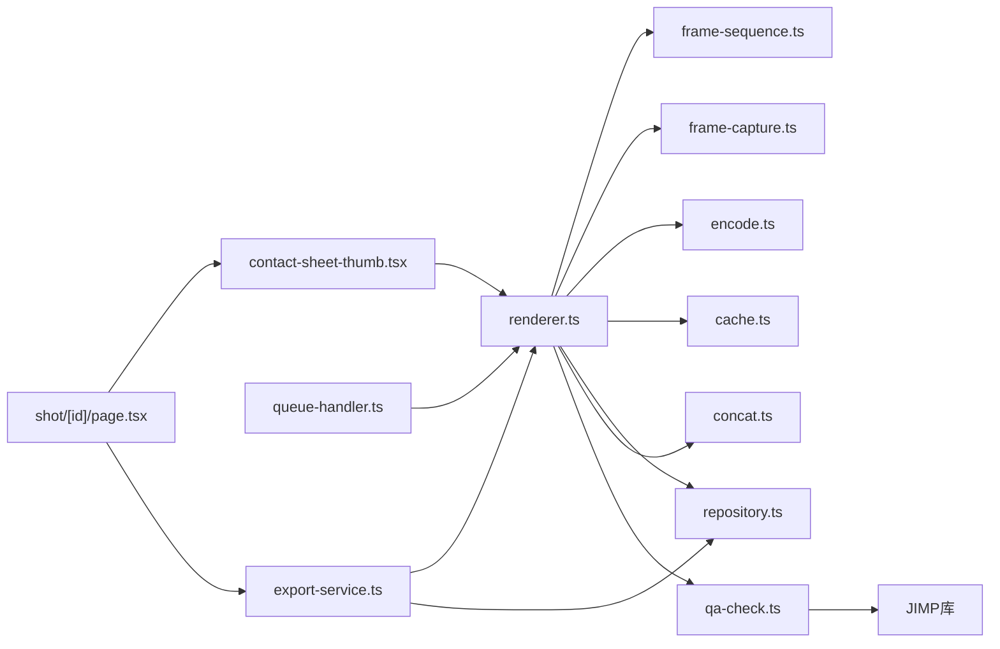

图表来源
- [src/features/render/renderer.ts](file://src/features/render/renderer.ts)
- [src/features/render/frame-sequence.ts](file://src/features/render/frame-sequence.ts)
- [src/features/render/frame-capture.ts](file://src/features/render/frame-capture.ts)
- [src/features/render/encode.ts](file://src/features/render/encode.ts)
- [src/features/render/cache.ts](file://src/features/render/cache.ts)
- [src/features/render/repository.ts](file://src/features/render/repository.ts)
- [src/features/render/concat.ts](file://src/features/render/concat.ts)
- [src/features/render/qa-check.ts](file://src/features/render/qa-check.ts)
- [src/features/render/export-service.ts](file://src/features/render/export-service.ts)
- [src/features/render/queue-handler.ts](file://src/features/render/queue-handler.ts)
- [src/components/ui/contact-sheet-thumb.tsx](file://src/components/ui/contact-sheet-thumb.tsx)
- [src/app/canvas/shot/[id]/page.tsx](file://src/app/canvas/shot/[id]/page.tsx)

章节来源
- [src/features/render/renderer.ts](file://src/features/render/renderer.ts)
- [src/features/render/export-service.ts](file://src/features/render/export-service.ts)
- [src/features/render/queue-handler.ts](file://src/features/render/queue-handler.ts)
- [src/features/render/qa-check.ts](file://src/features/render/qa-check.ts)
- [src/components/ui/contact-sheet-thumb.tsx](file://src/components/ui/contact-sheet-thumb.tsx)
- [src/app/canvas/shot/[id]/page.tsx](file://src/app/canvas/shot/[id]/page.tsx)

## 性能考虑
- 并发与背压
  - 通过队列处理器限制并发度，避免内存峰值过高
  - 背压策略：当队列过长时拒绝新任务或提示用户降配
- 缓存命中率
  - 合理设置缓存键粒度与容量，平衡命中率与内存占用
  - 针对相同参数的多次导出优先命中缓存
- 编码优化
  - 选择合适的码率与质量等级，兼顾体积与画质
  - 利用硬件加速（若可用），降低 CPU 负载
- I/O 优化
  - 分段写入与流式合并，减少磁盘随机写
  - 临时文件及时清理，避免空间泄漏
- 进度与监控
  - 细粒度进度上报，便于前端展示与用户体验优化
  - 关键指标采集：帧耗时、编码耗时、缓存命中率、队列长度
- QA检查性能优化
  - 异步执行：QA检查在渲染完成后异步执行，不阻塞主流程
  - 增量检查：仅对新增片段进行质量检查，避免重复分析
  - 阈值调优：根据视频类型调整检测阈值，减少误报
  - 内存管理：及时释放图像数据，防止内存泄漏
- 缩略图性能优化
  - 批量生成：合并多个缩略图请求，减少重复处理
  - 渐进式加载：先加载低分辨率缩略图，再逐步提高质量
  - 内存池：复用缩略图缓冲区，减少垃圾回收压力
  - CDN 缓存：利用浏览器缓存和 CDN 加速缩略图分发

## 故障排查指南
- 常见问题定位
  - 渲染卡住：检查队列并发度与任务超时设置
  - 编码失败：查看编码器参数合法性与后端可用性
  - 缓存溢出：评估缓存容量与淘汰策略
  - 产物不完整：确认片段拼接顺序与完整性校验
  - **新增** QA检查失败：检查JIMP库安装和权限设置
  - **新增** 黑帧检测误报：调整亮度阈值和检测灵敏度
  - **新增** 纯色检测不准确：优化颜色空间转换算法
  - 缩略图加载失败：检查网络连接和存储服务状态
  - 页面渲染卡顿：监控内存使用和事件循环阻塞
- 日志与诊断
  - 记录任务 ID、帧号、错误堆栈与上下文参数
  - 提供导出任务的完整生命周期日志
  - **新增** QA检查日志：记录检测过程、发现的问题和性能指标
  - **新增** JIMP错误日志：记录图像处理失败的详细信息
  - 缩略图生成日志：记录生成时间和失败原因
  - 页面性能日志：监控渲染时间和内存使用
- 恢复策略
  - 单帧失败重试与降级编码
  - 片段级重试与断点续拼
  - 死信队列人工介入
  - **新增** QA检查重试机制：自动重试失败的QA检查任务
  - **新增** 阈值动态调整：根据历史数据自动优化检测参数
  - 缩略图重试机制：自动重试失败的缩略图生成
  - 页面降级策略：渲染失败时显示静态内容

章节来源
- [src/features/render/queue-handler.ts](file://src/features/render/queue-handler.ts)
- [src/features/render/encode.ts](file://src/features/render/encode.ts)
- [src/features/render/cache.ts](file://src/features/render/cache.ts)
- [src/features/render/concat.ts](file://src/features/render/concat.ts)
- [src/features/render/qa-check.ts](file://src/features/render/qa-check.ts)
- [src/components/ui/contact-sheet-thumb.tsx](file://src/components/ui/contact-sheet-thumb.tsx)
- [src/app/canvas/shot/[id]/page.tsx](file://src/app/canvas/shot/[id]/page.tsx)

## 结论
CodeVideoCanvas 渲染引擎以 FrameSequence 为时间驱动核心，Renderer 作为调度中枢，结合 Encoder、Cache、Repository、Concat、QACheck 与 QueueHandler，形成高内聚、低耦合的渲染管线。**新增** 的QA检查系统通过JIMP库实现了专业的视频质量检测，包括黑帧检测和纯色检测功能，显著提升了输出视频的质量保证能力。QA检查结果通过shot-qa节点存储，并通过API端点返回给用户，形成了完整的质量监控闭环。共享缩略图基础设施和镜头渲染器页面集成模式进一步完善了系统的功能完整性和用户体验。通过并发控制、缓存策略、QA检查和错误恢复机制，系统在性能、质量和稳定性之间取得了良好平衡。ExportService 与 API 层提供了清晰的对外接口，便于集成与扩展。ContactSheetThumb 组件和 Shot Detail 页面的集成，为用户提供了流畅的视觉体验和高效的渲染管理能力。

## 附录：使用示例与配置
- 基本导出流程
  - 通过 API 发起导出请求，传入时间范围、分辨率、帧率、编码格式与质量参数
  - 服务端创建任务并返回任务 ID，前端轮询或订阅进度
  - 完成后返回产物路径、元数据与QA检查结果，供下载或预览
- 渲染参数配置
  - 分辨率与帧率：影响画面清晰度与文件大小
  - 码率与质量：权衡画质与体积
  - 编码格式：MP4/H.264 兼容性好，WebM/VP9 适合 Web 场景
  - 缓存策略：开启后对相同参数导出显著提升速度
- 进度跟踪与结果处理
  - 进度回调包含阶段信息与百分比
  - 结果包含产物路径、大小、时长、校验信息与QA检查结果
- 错误处理与重试
  - 失败时返回错误码与原因，支持一键重试
  - 对于网络或 I/O 错误，建议指数退避重试
- QA检查配置
  - 黑帧检测阈值：设置亮度阈值，默认为0.01
  - 纯色检测灵敏度：调整颜色相似度阈值，默认为0.95
  - 检查范围：可选择检查全部帧或抽样检查
  - 结果存储：启用后将QA结果保存到shot-qa节点
- 缩略图使用示例
  - 批量生成缩略图：传入视频 URL 和时间点数组
  - 自定义缩略图尺寸：支持多种预设尺寸和自定义比例
  - 缩略图缓存配置：设置缓存大小和过期时间
- 页面集成示例
  - 初始化渲染引擎：在组件挂载时创建渲染实例
  - 处理渲染事件：监听进度、完成和错误事件
  - 集成缩略图显示：使用 ContactSheetThumb 组件展示预览
  - 显示QA检查结果：在UI中展示视频质量分析报告
  - 错误处理和用户反馈：提供友好的错误提示和重试机制

章节来源
- [src/app/api/render/export/route.ts](file://src/app/api/render/export/route.ts)
- [src/features/render/export-service.ts](file://src/features/render/export-service.ts)
- [src/features/render/encode.ts](file://src/features/render/encode.ts)
- [src/features/render/cache.ts](file://src/features/render/cache.ts)
- [src/features/render/types.ts](file://src/features/render/types.ts)
- [src/features/render/qa-check.ts](file://src/features/render/qa-check.ts)
- [src/components/ui/contact-sheet-thumb.tsx](file://src/components/ui/contact-sheet-thumb.tsx)
- [src/app/canvas/shot/[id]/page.tsx](file://src/app/canvas/shot/[id]/page.tsx)