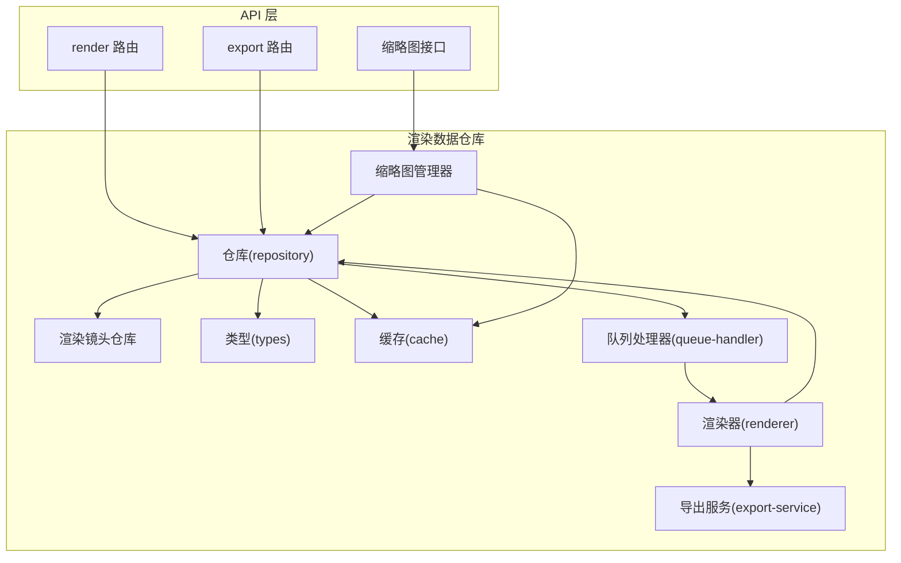
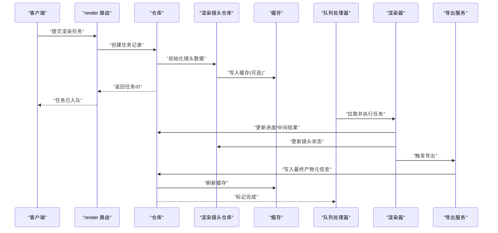
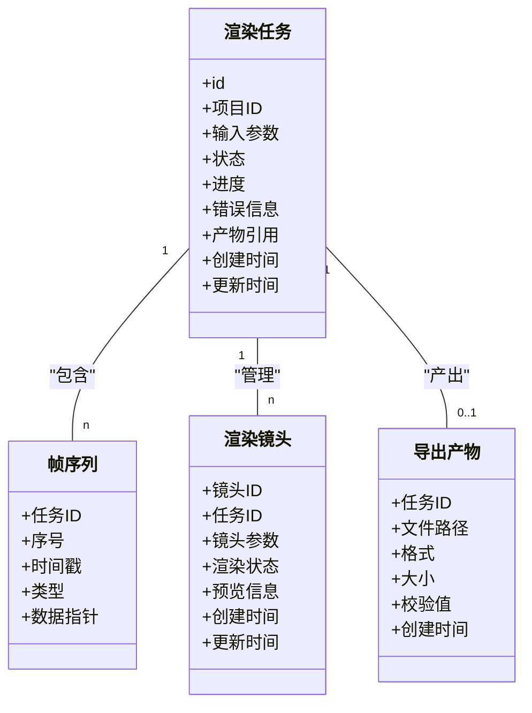
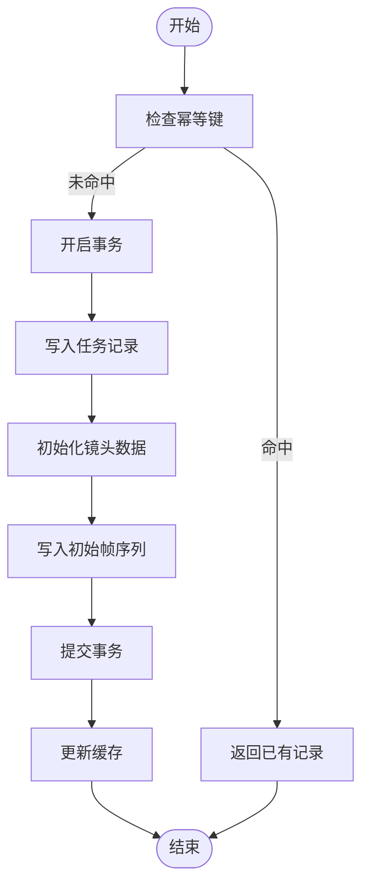
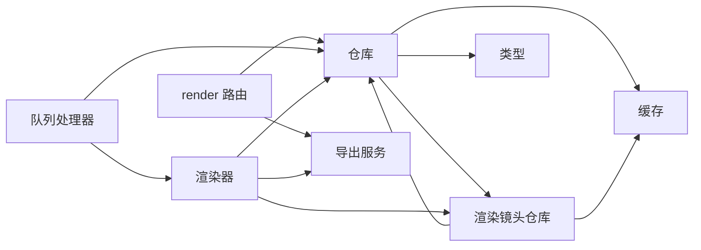

# 渲染数据仓库

<cite>
**本文引用的文件**   
- [src/features/render/repository.ts](file://src/features/render/repository.ts)
- [src/features/render/types.ts](file://src/features/render/types.ts)
- [src/features/render/cache.ts](file://src/features/render/cache.ts)
- [src/features/render/queue-handler.ts](file://src/features/render/queue-handler.ts)
- [src/features/render/renderer.ts](file://src/features/render/renderer.ts)
- [src/features/render/export-service.ts](file://src/features/render/export-service.ts)
- [src/app/api/render/route.ts](file://src/app/api/render/route.ts)
- [src/app/api/render/export/route.ts](file://src/app/api/render/export/route.ts)
- [drizzle.config.ts](file://drizzle.config.ts)
</cite>

## 更新摘要
**变更内容**   
- 新增专门的渲染镜头仓库，优化数据存储和管理机制
- 重构数据仓库架构，提升模块化和可维护性
- 增强渲染任务的数据一致性保证和查询性能
- 优化缩略图管理功能，支持更高效的帧缩略图处理

## 目录
1. [简介](#简介)
2. [项目结构](#项目结构)
3. [核心组件](#核心组件)
4. [架构总览](#架构总览)
5. [详细组件分析](#详细组件分析)
6. [依赖关系分析](#依赖关系分析)
7. [性能考虑](#性能考虑)
8. [故障排查指南](#故障排查指南)
9. [结论](#结论)
10. [附录](#附录)

## 简介
本技术文档聚焦于 CodeVideoCanvas 的"渲染数据仓库"，围绕其数据模型、CRUD 封装、事务与并发控制、查询优化、迁移策略、备份恢复与完整性校验进行系统化说明。文档同时给出使用示例与最佳实践，帮助开发者高效、安全地扩展与运维渲染子系统。**最新更新**：数据仓库系统进行了重大重构，新增了专门的渲染镜头仓库，优化了数据存储和管理机制，进一步提升了系统的模块化程度和可维护性。

## 项目结构
渲染数据仓库位于 features/render 模块中，采用分层设计：
- 类型定义：统一的数据模型与状态枚举，确保跨层一致
- 仓库层：对持久化存储的 CRUD 抽象与一致性保障，新增专门的渲染镜头仓库
- 缓存层：热点数据的内存/本地缓存，支持失效策略与一致性回退
- 队列处理器：异步任务调度与幂等执行
- 渲染器：帧序列生成与编码，支持缩略图生成
- 导出服务：最终产物打包与落盘
- API 路由：对外暴露的 HTTP 接口，支持缩略图请求处理

**图表来源**
- [src/app/api/render/route.ts](file://src/app/api/render/route.ts)
- [src/app/api/render/export/route.ts](file://src/app/api/render/export/route.ts)
- [src/features/render/repository.ts](file://src/features/render/repository.ts)
- [src/features/render/cache.ts](file://src/features/render/cache.ts)
- [src/features/render/queue-handler.ts](file://src/features/render/queue-handler.ts)
- [src/features/render/renderer.ts](file://src/features/render/renderer.ts)
- [src/features/render/export-service.ts](file://src/features/render/export-service.ts)
- [src/features/render/types.ts](file://src/features/render/types.ts)

**章节来源**
- [src/features/render/repository.ts](file://src/features/render/repository.ts)
- [src/features/render/types.ts](file://src/features/render/types.ts)
- [src/features/render/cache.ts](file://src/features/render/cache.ts)
- [src/features/render/queue-handler.ts](file://src/features/render/queue-handler.ts)
- [src/features/render/renderer.ts](file://src/features/render/renderer.ts)
- [src/features/render/export-service.ts](file://src/features/render/export-service.ts)
- [src/app/api/render/route.ts](file://src/app/api/render/route.ts)
- [src/app/api/render/export/route.ts](file://src/app/api/render/export/route.ts)

## 核心组件
- 类型定义：集中管理渲染任务、帧序列、导出产物等数据结构与状态枚举，确保跨层一致。
- 仓库层：提供统一的读写接口，封装事务边界、幂等写入、冲突解决与一致性校验，**新增专门的渲染镜头仓库以优化数据管理**。
- 缓存层：为高频读取路径提供低延迟访问，支持失效策略与一致性回退。
- 队列处理器：负责任务入队、去重、重试、超时与失败补偿。
- 渲染器：消费队列中的任务，按帧序列生成中间产物并更新任务状态，支持缩略图生成流程。
- 导出服务：聚合渲染产物，输出最终视频或媒体资源。

**章节来源**
- [src/features/render/types.ts](file://src/features/render/types.ts)
- [src/features/render/repository.ts](file://src/features/render/repository.ts)
- [src/features/render/cache.ts](file://src/features/render/cache.ts)
- [src/features/render/queue-handler.ts](file://src/features/render/queue-handler.ts)
- [src/features/render/renderer.ts](file://src/features/render/renderer.ts)
- [src/features/render/export-service.ts](file://src/features/render/export-service.ts)

## 架构总览
渲染数据仓库以"仓库 + 缓存 + 队列"为核心，API 路由作为入口，渲染器与导出服务作为生产者/消费者，形成闭环。**新增专门的渲染镜头仓库**，进一步优化了数据存储和管理机制，提供更细粒度的数据操作能力。

**图表来源**
- [src/app/api/render/route.ts](file://src/app/api/render/route.ts)
- [src/features/render/repository.ts](file://src/features/render/repository.ts)
- [src/features/render/cache.ts](file://src/features/render/cache.ts)
- [src/features/render/queue-handler.ts](file://src/features/render/queue-handler.ts)
- [src/features/render/renderer.ts](file://src/features/render/renderer.ts)
- [src/features/render/export-service.ts](file://src/features/render/export-service.ts)

## 详细组件分析

### 数据模型与状态管理
- 渲染任务实体：包含任务标识、所属项目、输入参数、状态机（待处理/进行中/已完成/失败）、进度、错误信息、产物引用等字段。
- 帧序列实体：描述时间轴上的关键帧、转场、特效等，供渲染器顺序消费。
- 导出产物实体：记录最终输出的媒体文件位置、格式、大小、校验值等。
- **渲染镜头实体**：新增专门的镜头数据模型，包含镜头标识、关联任务、镜头参数、渲染状态、预览信息等字段。
- 状态机约束：通过仓库层保证状态转换的合法性，避免非法跃迁。

**图表来源**
- [src/features/render/types.ts](file://src/features/render/types.ts)
- [src/features/render/repository.ts](file://src/features/render/repository.ts)

**章节来源**
- [src/features/render/types.ts](file://src/features/render/types.ts)
- [src/features/render/repository.ts](file://src/features/render/repository.ts)

### CRUD 操作封装与一致性保证
- 创建：在事务内写入任务与初始帧序列，确保原子性；若存在幂等键则直接返回已有记录。
- 读取：优先从缓存命中，未命中再查持久化存储，并回填缓存。
- 更新：基于乐观锁或版本号字段，防止覆盖写；状态变更需满足状态机规则。
- 删除：软删除为主，保留审计轨迹；物理删除仅在清理阶段批量执行。
- **渲染镜头操作**：新增专门的镜头CRUD操作，包括镜头创建、状态更新、预览信息管理等。
- 一致性：仓库层提供快照读与强一致读两种模式，按需选择；对关键路径启用事务隔离级别。

**图表来源**
- [src/features/render/repository.ts](file://src/features/render/repository.ts)

**章节来源**
- [src/features/render/repository.ts](file://src/features/render/repository.ts)

### 查询优化机制
- 索引策略：对任务状态、项目ID、创建时间、幂等键建立复合索引，加速常见过滤与排序。
- 分页与游标：列表查询采用游标分页，避免深分页性能问题。
- 预聚合：对统计类查询（如任务总数、成功率）维护轻量级汇总表，定时刷新。
- 缓存策略：热点任务详情与最近任务列表短期缓存，设置 TTL 与失效事件。
- **渲染镜头查询优化**：针对镜头数据的专门查询优化，支持按任务ID、状态、时间范围的高效检索。

**章节来源**
- [src/features/render/repository.ts](file://src/features/render/repository.ts)
- [src/features/render/cache.ts](file://src/features/render/cache.ts)

### 事务处理与并发控制
- 事务边界：任务创建、状态推进、产物落盘均包裹在事务中，失败自动回滚。
- 并发控制：使用分布式锁或数据库行级锁保护同一任务的并发更新；队列处理器对任务加锁后拉取，避免重复消费。
- 幂等性：所有写入接口支持幂等键，重复提交不会导致重复记录。
- 重试与补偿：失败任务进入死信队列，按指数退避重试；长时间无心跳的任务被回收。
- **渲染镜头事务处理**：镜头数据的创建、更新与任务状态变更在同一事务中执行，确保数据一致性。

**章节来源**
- [src/features/render/repository.ts](file://src/features/render/repository.ts)
- [src/features/render/queue-handler.ts](file://src/features/render/queue-handler.ts)

### 数据迁移策略
- 版本化：每次 schema 变更对应一个迁移脚本，按序执行，支持回滚。
- 增量式：仅变更必要字段，保持向后兼容；新增字段默认可空并提供默认值。
- 零停机：大表变更采用分阶段迁移（先扩容、再回填、再切换），降低锁竞争。
- 验证：迁移完成后运行完整性校验脚本，对比计数与抽样数据。
- **渲染镜头迁移**：新增渲染镜头表的迁移脚本，支持历史数据的兼容性处理。

**章节来源**
- [drizzle.config.ts](file://drizzle.config.ts)

### 备份恢复与数据完整性验证
- 备份：定期全量快照 + 增量 WAL 归档；导出产物单独对象存储备份。
- 恢复：按时间点恢复，校验校验和与哈希；恢复后进行一致性比对。
- 校验：周期性运行数据一致性扫描，检测孤儿记录、损坏文件与不一致状态。
- **渲染镜头备份**：镜头数据与相关元数据分别备份，支持独立恢复。

**章节来源**
- [src/features/render/repository.ts](file://src/features/render/repository.ts)

### 使用示例与最佳实践
- 创建渲染任务
  - 调用 render 路由提交任务，传入幂等键与输入参数。
  - 仓库层在事务中写入任务与初始帧序列，返回任务 ID。
- 查询任务状态
  - 通过任务 ID 获取详情，优先走缓存；未命中则回源并回填。
- **渲染镜头操作**
  - 使用专门的镜头仓库接口进行镜头数据的CRUD操作。
  - 通过镜头ID快速定位和管理特定镜头的渲染状态。
  - 利用镜头预览信息进行实时状态监控。
- 更新进度与产物
  - 渲染器在执行过程中周期性更新进度与中间结果；导出完成后写入产物元信息。
- 失败重试
  - 队列处理器捕获异常，记录错误信息并按策略重试；超过阈值转入人工干预。

**章节来源**
- [src/app/api/render/route.ts](file://src/app/api/render/route.ts)
- [src/features/render/repository.ts](file://src/features/render/repository.ts)
- [src/features/render/cache.ts](file://src/features/render/cache.ts)
- [src/features/render/queue-handler.ts](file://src/features/render/queue-handler.ts)
- [src/features/render/renderer.ts](file://src/features/render/renderer.ts)
- [src/features/render/export-service.ts](file://src/features/render/export-service.ts)

## 依赖关系分析
- API 路由依赖仓库层与导出服务，负责请求解析与响应组装。
- 仓库层依赖类型定义与缓存层，屏蔽底层存储细节。
- 队列处理器依赖仓库层与渲染器，实现任务拉取与状态推进。
- 渲染器依赖仓库层与导出服务，负责生产中间与最终产物。
- **渲染镜头仓库**：新增的专门模块，依赖仓库层与缓存层，提供镜头数据的CRUD操作和缓存优化。

**图表来源**
- [src/app/api/render/route.ts](file://src/app/api/render/route.ts)
- [src/features/render/repository.ts](file://src/features/render/repository.ts)
- [src/features/render/cache.ts](file://src/features/render/cache.ts)
- [src/features/render/queue-handler.ts](file://src/features/render/queue-handler.ts)
- [src/features/render/renderer.ts](file://src/features/render/renderer.ts)
- [src/features/render/export-service.ts](file://src/features/render/export-service.ts)
- [src/features/render/types.ts](file://src/features/render/types.ts)

**章节来源**
- [src/app/api/render/route.ts](file://src/app/api/render/route.ts)
- [src/features/render/repository.ts](file://src/features/render/repository.ts)
- [src/features/render/cache.ts](file://src/features/render/cache.ts)
- [src/features/render/queue-handler.ts](file://src/features/render/queue-handler.ts)
- [src/features/render/renderer.ts](file://src/features/render/renderer.ts)
- [src/features/render/export-service.ts](file://src/features/render/export-service.ts)
- [src/features/render/types.ts](file://src/features/render/types.ts)

## 性能考虑
- 减少往返：批量写入与合并更新，降低事务开销。
- 索引优化：根据查询热点调整索引组合，避免全表扫描。
- 缓存命中率：合理设置 TTL 与失效策略，避免缓存穿透与雪崩。
- 背压与限流：队列容量上限与消费者速率限制，防止过载。
- I/O 分离：中间产物与最终产物分别落盘，避免阻塞主流程。
- **渲染镜头性能优化**：专门的镜头仓库提供优化的查询和缓存策略，减少不必要的数据库访问。

## 故障排查指南
- 任务卡住
  - 检查队列是否堆积、消费者是否健康、是否存在长事务或未释放锁。
- 状态不一致
  - 核对状态机转换日志，定位非法跃迁；运行一致性校验脚本修复。
- 产物缺失
  - 确认导出服务是否成功落盘，校验文件哈希与大小；必要时重新触发导出。
- 性能退化
  - 分析慢查询与索引使用情况，评估缓存命中率与连接池配置。
- **渲染镜头问题**
  - 检查镜头数据的一致性；验证镜头状态转换逻辑；确认镜头预览信息的正确性。

**章节来源**
- [src/features/render/queue-handler.ts](file://src/features/render/queue-handler.ts)
- [src/features/render/repository.ts](file://src/features/render/repository.ts)
- [src/features/render/export-service.ts](file://src/features/render/export-service.ts)

## 结论
渲染数据仓库通过清晰的类型定义、严格的 CRUD 封装、完善的事务与并发控制、以及高效的缓存与查询优化，为渲染流水线提供了稳定可靠的数据基座。**新增的专门渲染镜头仓库**进一步增强了系统的模块化程度和数据管理能力，通过优化的数据存储和管理机制，提升了整体性能和可维护性。配合迁移、备份与校验机制，可在演进与运维中保持高可用与数据一致性。

## 附录
- 术语
  - 幂等键：用于识别重复提交的唯一标识，确保多次提交不会产生副作用。
  - 游标分页：基于上次查询结果的游标进行下一页查询，避免深分页性能问题。
  - 死信队列：存放无法处理的失败任务，便于后续分析与人工干预。
  - 渲染镜头：渲染任务中的独立镜头单元，包含特定的渲染参数和状态信息。
- 参考
  - 仓库实现与类型定义见对应文件路径。
  - 迁移配置与数据库初始化见 drizzle 配置文件。
  - **渲染镜头仓库**：专门的镜头数据管理模块，提供优化的CRUD操作和查询性能。