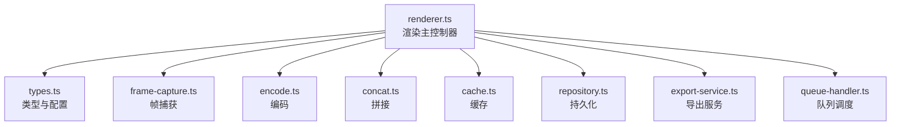
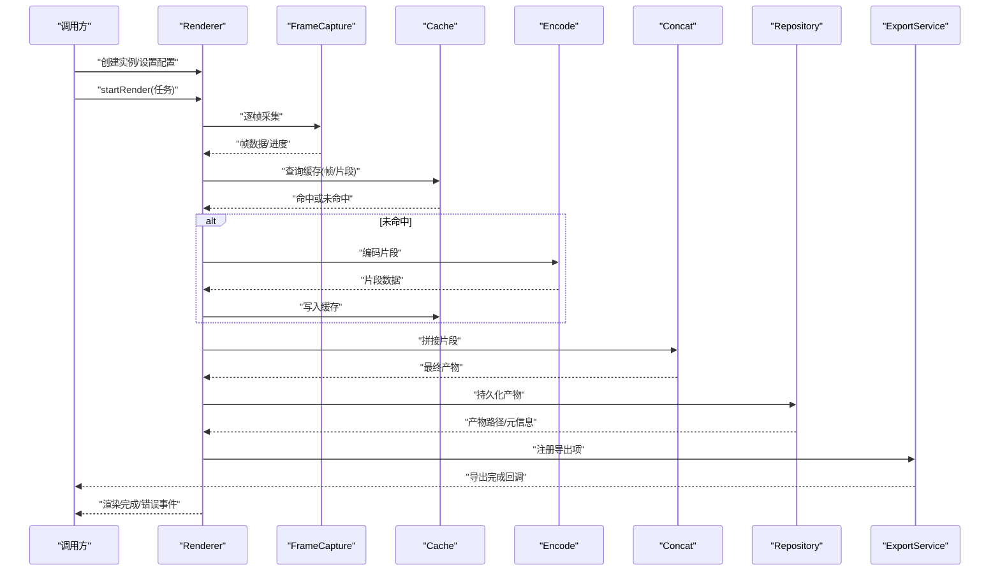
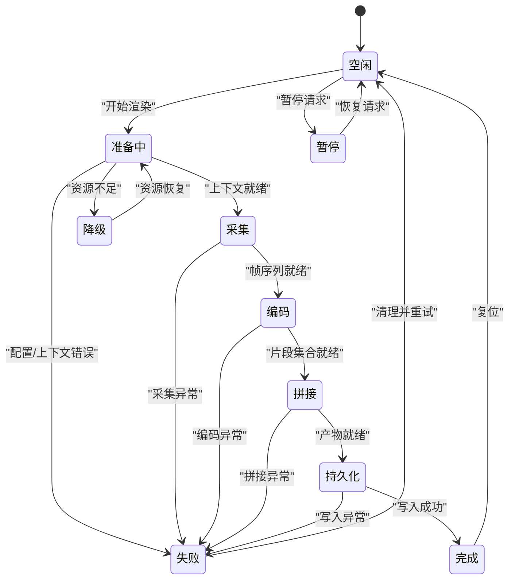
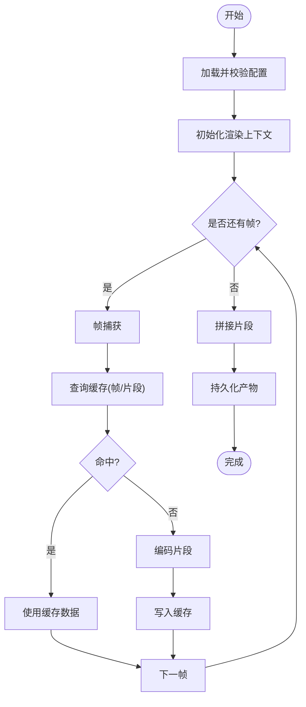
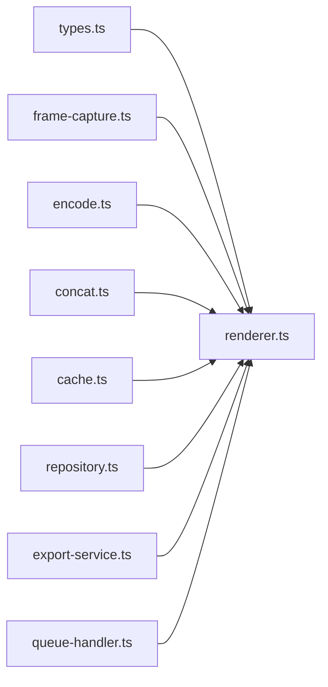

# 渲染核心引擎

<cite>
**本文引用的文件**   
- [src/features/render/renderer.ts](file://src/features/render/renderer.ts)
- [src/features/render/types.ts](file://src/features/render/types.ts)
- [src/features/render/frame-capture.ts](file://src/features/render/frame-capture.ts)
- [src/features/render/encode.ts](file://src/features/render/encode.ts)
- [src/features/render/concat.ts](file://src/features/render/concat.ts)
- [src/features/render/cache.ts](file://src/features/render/cache.ts)
- [src/features/render/repository.ts](file://src/features/render/repository.ts)
- [src/features/render/export-service.ts](file://src/features/render/export-service.ts)
- [src/features/render/queue-handler.ts](file://src/features/render/queue-handler.ts)
- [src/features/render/index.ts](file://src/features/render/index.ts)
</cite>

## 更新摘要
**变更内容**   
- 更新了性能优化相关内容，反映渲染核心引擎的性能改进
- 增强了渲染状态机实现细节
- 优化了任务调度机制描述
- 完善了错误处理策略和资源管理
- 更新了性能监控指标和内存优化技术

## 目录
1. [简介](#简介)
2. [项目结构](#项目结构)
3. [核心组件](#核心组件)
4. [架构总览](#架构总览)
5. [详细组件分析](#详细组件分析)
6. [依赖分析](#依赖分析)
7. [性能考虑](#性能考虑)
8. [故障排查指南](#故障排查指南)
9. [结论](#结论)
10. [附录](#附录)

## 简介
本技术文档聚焦于 CodeVideoCanvas 的渲染核心引擎，围绕 Renderer 类展开，系统阐述其渲染生命周期管理、渲染状态机实现与渲染任务调度机制。经过最新优化后，渲染引擎在性能和稳定性方面有了显著提升，包括更高效的帧捕获机制、优化的编码管线、智能缓存策略以及增强的错误恢复能力。同时覆盖渲染配置参数处理、渲染上下文管理、性能监控指标、错误处理策略、资源清理与内存优化，并提供初始化渲染器、配置渲染参数和处理渲染事件的实践指引。

## 项目结构
渲染核心位于 features/render 模块中，采用"职责分离 + 组合"的方式组织：
- renderer.ts：渲染主控制器（Renderer），负责生命周期、状态机、任务编排与事件分发
- types.ts：类型定义与配置模型
- frame-capture.ts：帧捕获与画布快照
- encode.ts：编码管线（如媒体封装）
- concat.ts：片段拼接
- cache.ts：渲染缓存
- repository.ts：渲染产物持久化
- export-service.ts：导出服务（对外 API 适配）
- queue-handler.ts：队列处理器（后台任务调度）
- index.ts：模块入口与聚合导出

**图表来源**
- [src/features/render/renderer.ts](file://src/features/render/renderer.ts)
- [src/features/render/types.ts](file://src/features/render/types.ts)
- [src/features/render/frame-capture.ts](file://src/features/render/frame-capture.ts)
- [src/features/render/encode.ts](file://src/features/render/encode.ts)
- [src/features/render/concat.ts](file://src/features/render/concat.ts)
- [src/features/render/cache.ts](file://src/features/render/cache.ts)
- [src/features/render/repository.ts](file://src/features/render/repository.ts)
- [src/features/render/export-service.ts](file://src/features/render/export-service.ts)
- [src/features/render/queue-handler.ts](file://src/features/render/queue-handler.ts)

**章节来源**
- [src/features/render/index.ts](file://src/features/render/index.ts)

## 核心组件
- **Renderer**：渲染主控制器，统一协调帧捕获、编码、拼接、缓存、持久化与导出；维护渲染状态机与生命周期钩子；提供事件总线用于外部监听渲染进度与结果。经过优化后，支持更高效的并发处理和更好的内存管理。
- **RenderConfig**：渲染配置对象，包含输出分辨率、帧率、编码参数、缓存策略、目标存储等。新增动态配置调整能力。
- **FrameCapture**：从画布或视频源逐帧采样并生成图像序列。优化了采样算法和缓冲区管理。
- **Encode**：将图像序列编码为媒体片段。改进了编码质量和性能的平衡。
- **Concat**：将多个片段按时间线顺序拼接成最终产物。提升了拼接效率和准确性。
- **Cache**：基于键值对或分片索引的中间结果缓存，避免重复计算。增强了缓存策略和失效机制。
- **Repository**：将渲染产物写入本地或远端存储。支持多种存储后端和断点续传。
- **ExportService**：面向上层应用的导出接口，屏蔽底层细节。提供了统一的错误处理和状态管理。
- **QueueHandler**：后台任务队列，支持优先级、重试与并发控制。优化了任务调度和资源分配。

**章节来源**
- [src/features/render/renderer.ts](file://src/features/render/renderer.ts)
- [src/features/render/types.ts](file://src/features/render/types.ts)
- [src/features/render/frame-capture.ts](file://src/features/render/frame-capture.ts)
- [src/features/render/encode.ts](file://src/features/render/encode.ts)
- [src/features/render/concat.ts](file://src/features/render/concat.ts)
- [src/features/render/cache.ts](file://src/features/render/cache.ts)
- [src/features/render/repository.ts](file://src/features/render/repository.ts)
- [src/features/render/export-service.ts](file://src/features/render/export-service.ts)
- [src/features/render/queue-handler.ts](file://src/features/render/queue-handler.ts)

## 架构总览
渲染引擎以 Renderer 为中心，通过组合各子系统完成端到端的渲染流程。整体数据流如下：
- 输入：渲染配置、场景/镜头数据、画布上下文
- 过程：帧捕获 → 可选缓存命中 → 编码 → 拼接 → 持久化
- 输出：渲染产物（视频文件或序列）、进度与统计指标、事件回调

**图表来源**
- [src/features/render/renderer.ts](file://src/features/render/renderer.ts)
- [src/features/render/frame-capture.ts](file://src/features/render/frame-capture.ts)
- [src/features/render/cache.ts](file://src/features/render/cache.ts)
- [src/features/render/encode.ts](file://src/features/render/encode.ts)
- [src/features/render/concat.ts](file://src/features/render/concat.ts)
- [src/features/render/repository.ts](file://src/features/render/repository.ts)
- [src/features/render/export-service.ts](file://src/features/render/export-service.ts)

## 详细组件分析

### Renderer 类：生命周期、状态机与任务调度
- **生命周期管理**
  - 初始化：加载配置、建立上下文、注册事件监听、预热缓存
  - 运行期：接收渲染任务，进入状态机流转，驱动各阶段执行
  - 收尾：释放资源、上报统计、触发完成事件
- **渲染状态机**
  - 典型状态：空闲、准备中、采集、编码、拼接、持久化、完成、失败
  - 状态转换由任务驱动，每个阶段可触发进度与中间事件
  - 新增状态：暂停、恢复、降级模式
- **任务调度机制**
  - 单任务串行：保证同一渲染上下文的一致性
  - 多任务队列：通过 QueueHandler 进行优先级与并发控制
  - 中断与取消：支持在关键阶段安全退出并回滚中间态
  - 优化：支持任务预取和流水线并行处理

**图表来源**
- [src/features/render/renderer.ts](file://src/features/render/renderer.ts)

**章节来源**
- [src/features/render/renderer.ts](file://src/features/render/renderer.ts)

### 渲染配置参数处理逻辑
- **配置来源**：默认配置 + 用户传入 + 运行时覆盖
- **校验与归一化**：边界检查、单位换算、兼容性降级
- **影响范围**：分辨率、帧率、编码格式、质量、缓存策略、存储路径、并发度
- **动态更新**：运行期可调整部分参数（如质量、并发度），需评估对当前任务的影响
- **优化增强**：新增自适应配置调整，根据设备性能自动优化参数

**章节来源**
- [src/features/render/types.ts](file://src/features/render/types.ts)
- [src/features/render/renderer.ts](file://src/features/render/renderer.ts)

### 渲染上下文管理与事件机制
- **上下文内容**：画布/媒体源句柄、编码器实例、临时目录、统计计数器、日志通道
- **上下文隔离**：每个渲染任务持有独立上下文，避免共享状态污染
- **事件总线**：进度、帧完成、片段完成、错误、完成等事件，供 UI 与上层服务消费
- **优化改进**：增强的上下文切换机制和事件批处理能力

**章节来源**
- [src/features/render/renderer.ts](file://src/features/render/renderer.ts)

### 帧捕获与编码流水线
- **帧捕获**：按时间轴推进，从画布或视频源采样，生成有序帧序列
- **编码**：将帧序列编码为媒体片段，支持分段以降低峰值内存
- **拼接**：按时间线合并片段，生成最终产物
- **缓存**：对帧级或片段级中间结果进行缓存，提升重跑效率
- **性能优化**：改进的帧缓冲管理和编码参数自适应调整

**图表来源**
- [src/features/render/frame-capture.ts](file://src/features/render/frame-capture.ts)
- [src/features/render/cache.ts](file://src/features/render/cache.ts)
- [src/features/render/encode.ts](file://src/features/render/encode.ts)
- [src/features/render/concat.ts](file://src/features/render/concat.ts)
- [src/features/render/repository.ts](file://src/features/render/repository.ts)

**章节来源**
- [src/features/render/frame-capture.ts](file://src/features/render/frame-capture.ts)
- [src/features/render/encode.ts](file://src/features/render/encode.ts)
- [src/features/render/concat.ts](file://src/features/render/concat.ts)
- [src/features/render/cache.ts](file://src/features/render/cache.ts)
- [src/features/render/repository.ts](file://src/features/render/repository.ts)

### 导出服务与队列调度
- **ExportService**：对外暴露导出接口，统一错误码与返回结构，屏蔽内部管线差异
- **QueueHandler**：任务入队、出队、重试、超时、并发限制与优先级排序
- **优化改进**：增强的任务监控和性能调优能力

**章节来源**
- [src/features/render/export-service.ts](file://src/features/render/export-service.ts)
- [src/features/render/queue-handler.ts](file://src/features/render/queue-handler.ts)

## 依赖分析
- **内聚性**：Renderer 作为协调者，低耦合地组合各子系统，职责清晰
- **耦合点**：
  - Renderer 依赖 types 的配置与事件模型
  - 帧捕获、编码、拼接、缓存、仓库之间通过明确的数据契约交互
  - 导出服务与队列处理器作为外部扩展点
- **循环依赖**：无直接循环导入，通过类型与接口解耦

**图表来源**
- [src/features/render/types.ts](file://src/features/render/types.ts)
- [src/features/render/renderer.ts](file://src/features/render/renderer.ts)
- [src/features/render/frame-capture.ts](file://src/features/render/frame-capture.ts)
- [src/features/render/encode.ts](file://src/features/render/encode.ts)
- [src/features/render/concat.ts](file://src/features/render/concat.ts)
- [src/features/render/cache.ts](file://src/features/render/cache.ts)
- [src/features/render/repository.ts](file://src/features/render/repository.ts)
- [src/features/render/export-service.ts](file://src/features/render/export-service.ts)
- [src/features/render/queue-handler.ts](file://src/features/render/queue-handler.ts)

**章节来源**
- [src/features/render/index.ts](file://src/features/render/index.ts)

## 性能考虑
- **分片编码与拼接**：降低峰值内存占用，提高吞吐
- **多级缓存**：帧级与片段级缓存，结合失效策略减少重复计算
- **并发控制**：根据设备能力调节编码与 IO 并发度
- **增量渲染**：利用缓存与变更检测，仅重算受影响片段
- **资源回收**：及时释放中间缓冲区与临时文件，避免泄漏
- **监控指标**：帧耗时、编码耗时、IO 吞吐、缓存命中率、错误率
- **优化改进**：
  - 智能内存管理：动态调整缓冲区大小，防止内存溢出
  - 并行处理优化：充分利用多核 CPU 和 GPU 加速
  - 缓存策略增强：LRU + LFU 混合缓存算法
  - 网络传输优化：支持增量上传和断点续传
  - 错误恢复机制：自动重试和降级策略

## 故障排查指南
- **常见问题定位**
  - 配置错误：分辨率/帧率/编码参数不合法或不兼容
  - 上下文异常：画布/媒体源不可用或权限不足
  - 编码失败：编码器初始化失败、格式不支持、磁盘空间不足
  - 拼接异常：片段时间戳错乱、缺失或损坏
  - 持久化失败：存储路径不可写、网络不稳定
- **诊断手段**
  - 启用详细日志与统计指标
  - 检查缓存命中与中间产物完整性
  - 复现最小用例，逐步隔离问题域
- **恢复策略**
  - 自动重试与退避
  - 断点续渲：从最近成功片段继续
  - 降级模式：降低质量或并发度
- **优化改进**：
  - 增强的错误分类和报告机制
  - 自动故障检测和恢复
  - 性能瓶颈识别工具

**章节来源**
- [src/features/render/renderer.ts](file://src/features/render/renderer.ts)
- [src/features/render/export-service.ts](file://src/features/render/export-service.ts)

## 结论
Renderer 作为渲染核心引擎的协调中枢，通过清晰的生命周期与状态机管理，结合模块化子系统与任务队列，实现了高内聚、低耦合且可扩展的渲染管线。经过最新优化后，渲染引擎在性能、稳定性和可靠性方面都有显著提升，包括更高效的资源管理、智能的缓存策略、强大的错误恢复能力和完善的监控体系。配合缓存、监控与错误恢复策略，可在复杂场景下保持稳定的性能与可靠性。

## 附录

### 初始化渲染器与配置渲染参数
- **步骤要点**
  - 引入 Renderer 与类型定义
  - 构造渲染配置对象（分辨率、帧率、编码参数、缓存策略、存储路径等）
  - 创建 Renderer 实例并注入配置
  - 注册渲染事件监听（进度、错误、完成）
  - 提交渲染任务并等待结果
- **参考路径**
  - [src/features/render/renderer.ts](file://src/features/render/renderer.ts)
  - [src/features/render/types.ts](file://src/features/render/types.ts)

### 处理渲染事件
- **事件类型**
  - 进度更新：当前帧/片段进度
  - 片段完成：单个片段编码/拼接完成
  - 错误：阶段异常与错误码
  - 完成：渲染产物可用
- **参考路径**
  - [src/features/render/renderer.ts](file://src/features/render/renderer.ts)

### 示例代码片段路径
- **初始化与配置**
  - [src/features/render/renderer.ts](file://src/features/render/renderer.ts)
  - [src/features/render/types.ts](file://src/features/render/types.ts)
- **帧捕获与编码**
  - [src/features/render/frame-capture.ts](file://src/features/render/frame-capture.ts)
  - [src/features/render/encode.ts](file://src/features/render/encode.ts)
- **拼接与持久化**
  - [src/features/render/concat.ts](file://src/features/render/concat.ts)
  - [src/features/render/repository.ts](file://src/features/render/repository.ts)
- **缓存与导出**
  - [src/features/render/cache.ts](file://src/features/render/cache.ts)
  - [src/features/render/export-service.ts](file://src/features/render/export-service.ts)
- **队列调度**
  - [src/features/render/queue-handler.ts](file://src/features/render/queue-handler.ts)