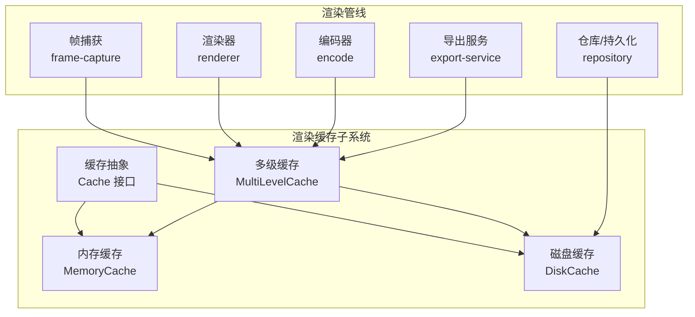
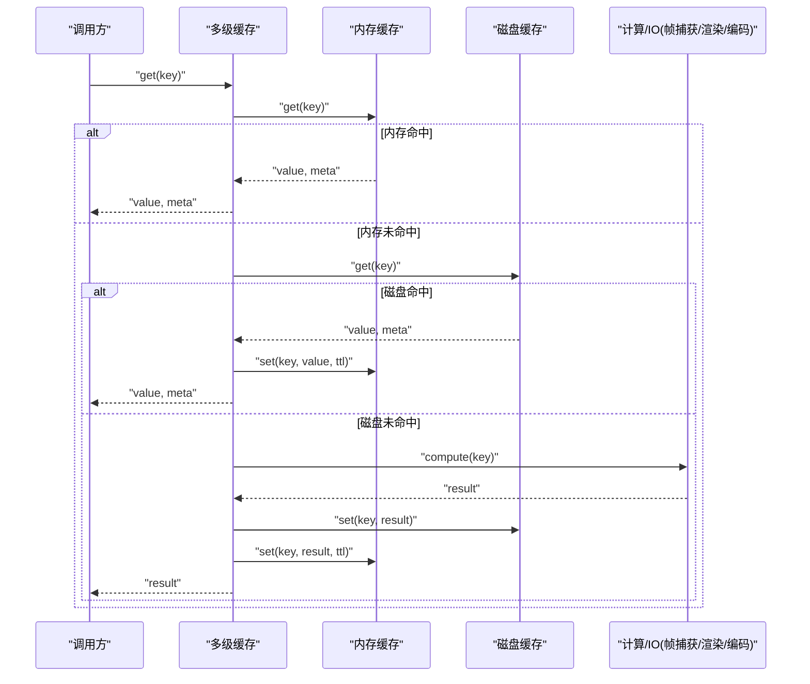
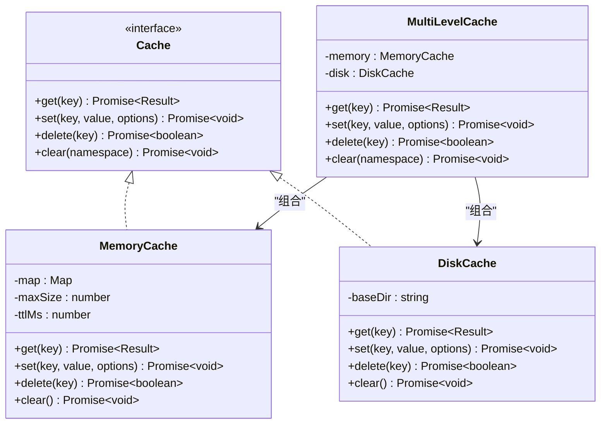
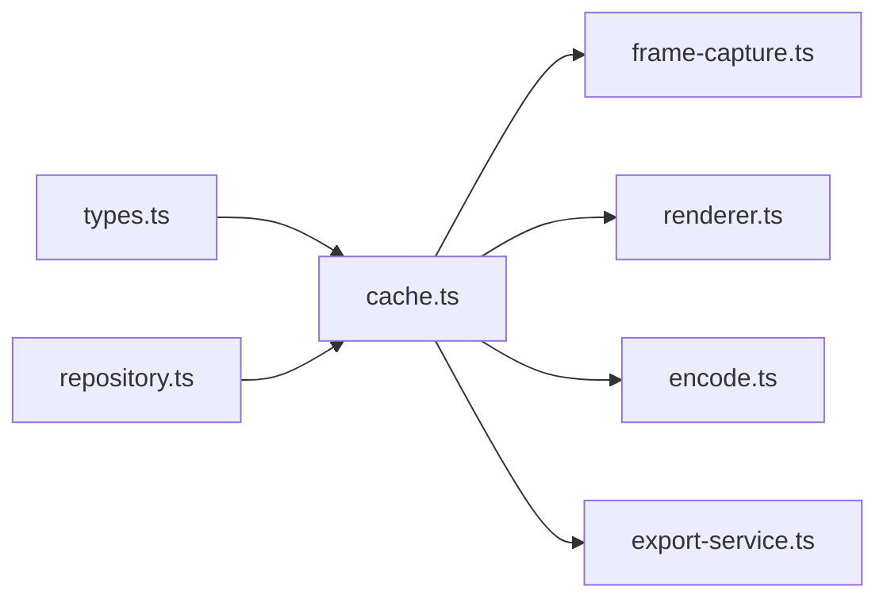

# 渲染缓存系统

<cite>
**本文引用的文件**   
- [src/features/render/cache.ts](file://src/features/render/cache.ts)
- [src/features/render/cache.test.ts](file://src/features/render/cache.test.ts)
- [src/features/render/renderer.ts](file://src/features/render/renderer.ts)
- [src/features/render/repository.ts](file://src/features/render/repository.ts)
- [src/features/render/types.ts](file://src/features/render/types.ts)
- [src/features/render/frame-capture.ts](file://src/features/render/frame-capture.ts)
- [src/features/render/encode.ts](file://src/features/render/encode.ts)
- [src/features/render/export-service.ts](file://src/features/render/export-service.ts)
</cite>

## 目录
1. [简介](#简介)
2. [项目结构](#项目结构)
3. [核心组件](#核心组件)
4. [架构总览](#架构总览)
5. [详细组件分析](#详细组件分析)
6. [依赖关系分析](#依赖关系分析)
7. [性能考虑](#性能考虑)
8. [故障排查指南](#故障排查指南)
9. [结论](#结论)
10. [附录](#附录)

## 简介
本技术文档聚焦 CodeVideoCanvas 的渲染缓存系统，系统性阐述其多级缓存策略、缓存键生成算法与失效机制，覆盖帧数据、渲染结果与中间文件的存储方式；并说明内存管理、磁盘持久化与并发访问控制。同时提供命中率优化、存储空间清理与性能监控指标建议，并通过配置示例、接口使用与性能优化实践帮助读者快速上手与调优。

## 项目结构
渲染缓存相关代码位于 features/render 子模块中，围绕“缓存抽象 + 具体实现 + 渲染管线集成”展开：
- 缓存抽象与实现：定义缓存接口、内存缓存、磁盘缓存及组合的多级缓存策略
- 渲染管线集成：在帧捕获、编码与导出阶段读写缓存，减少重复计算与 I/O
- 类型与工具：统一资源标识、元数据与错误模型，保障跨层一致性

图表来源
- [src/features/render/cache.ts](file://src/features/render/cache.ts)
- [src/features/render/frame-capture.ts](file://src/features/render/frame-capture.ts)
- [src/features/render/renderer.ts](file://src/features/render/renderer.ts)
- [src/features/render/encode.ts](file://src/features/render/encode.ts)
- [src/features/render/export-service.ts](file://src/features/render/export-service.ts)
- [src/features/render/repository.ts](file://src/features/render/repository.ts)

章节来源
- [src/features/render/cache.ts](file://src/features/render/cache.ts)
- [src/features/render/renderer.ts](file://src/features/render/renderer.ts)
- [src/features/render/repository.ts](file://src/features/render/repository.ts)
- [src/features/render/types.ts](file://src/features/render/types.ts)

## 核心组件
- 缓存抽象（Cache）
  - 职责：定义统一的 get/set/delete/clear 等基础操作契约，屏蔽底层差异
  - 关键能力：支持按资源键存取二进制或结构化数据，返回命中状态与元信息
- 内存缓存（MemoryCache）
  - 职责：基于进程内数据结构的高速缓存，适合热路径与小体积数据
  - 特性：LRU 淘汰、容量上限、过期时间、线程安全访问
- 磁盘缓存（DiskCache）
  - 职责：将缓存落盘，提供跨进程/重启后的持久化能力
  - 特性：分片目录、原子写入、校验和、空间回收
- 多级缓存（MultiLevelCache）
  - 职责：组合内存与磁盘两级，优先命中内存，未命中再查磁盘，回写策略可配
  - 特性：分层键空间隔离、统计指标上报、降级与熔断保护

章节来源
- [src/features/render/cache.ts](file://src/features/render/cache.ts)
- [src/features/render/cache.test.ts](file://src/features/render/cache.test.ts)

## 架构总览
渲染缓存贯穿帧捕获、渲染与编码三个阶段，形成“读多写少、热点复用”的整体模式：
- 读取路径：请求先命中内存缓存，未命中则查询磁盘缓存，最终回写上层
- 写入路径：新结果经校验后写入磁盘，并按策略回填内存
- 失效路径：按资源维度或全局触发失效，保证一致性与可控性

图表来源
- [src/features/render/cache.ts](file://src/features/render/cache.ts)
- [src/features/render/frame-capture.ts](file://src/features/render/frame-capture.ts)
- [src/features/render/renderer.ts](file://src/features/render/renderer.ts)
- [src/features/render/encode.ts](file://src/features/render/encode.ts)

## 详细组件分析

### 缓存抽象与多级策略
- 设计要点
  - 通过统一接口解耦上层业务与底层存储
  - 多级缓存以“内存优先、磁盘兜底、异步回填”为原则
  - 支持按命名空间隔离键空间，避免跨模块冲突
- 关键流程
  - 获取：内存→磁盘→计算→回写
  - 设置：按 TTL 与容量策略淘汰
  - 删除：支持单键与批量前缀删除
  - 清空：按命名空间或全局清空

图表来源
- [src/features/render/cache.ts](file://src/features/render/cache.ts)

章节来源
- [src/features/render/cache.ts](file://src/features/render/cache.ts)
- [src/features/render/cache.test.ts](file://src/features/render/cache.test.ts)

### 缓存键生成算法
- 目标
  - 唯一性：同一资源在不同上下文下不冲突
  - 稳定性：相同输入产生相同键，利于命中率
  - 可读性：便于调试与人工定位
- 组成要素
  - 命名空间：区分模块或用途（如 frame、render、encode）
  - 资源指纹：由输入参数序列化哈希得到（分辨率、时长、节点图快照、样式等）
  - 版本戳：随接口或算法变更递增，强制失效旧键
  - 可选后缀：用于细粒度区分（如质量档位、滤镜开关）
- 生成步骤
  - 收集输入参数 → 规范化排序 → 序列化 → 哈希 → 拼接命名空间与版本 → 输出键
- 失效联动
  - 当上游输入或算法版本变化时，键自然不同，旧缓存自动不可用

章节来源
- [src/features/render/types.ts](file://src/features/render/types.ts)
- [src/features/render/cache.ts](file://src/features/render/cache.ts)

### 缓存失效机制
- 粒度
  - 单键失效：针对特定资源更新
  - 命名空间失效：按模块或阶段批量清理
  - 全量清理：运维或诊断场景
- 触发条件
  - 显式调用：用户或任务驱动
  - 隐式失效：TTL 到期、容量超限 LRU 淘汰
  - 版本升级：键版本变化导致旧键不可用
- 一致性
  - 写扩散：更新后主动删除旧键或提升版本号
  - 读扩散：读取失败时回退到冷路径并重建缓存

章节来源
- [src/features/render/cache.ts](file://src/features/render/cache.ts)

### 不同类型资源的缓存策略
- 帧数据
  - 特点：体积大、随机访问、高复用
  - 策略：内存缓存小窗口热帧，磁盘缓存全量帧序列；按时间轴分段存储
- 渲染结果
  - 特点：计算密集、输入稳定
  - 策略：多级缓存，强 TTL；对确定性渲染启用幂等键
- 中间文件
  - 特点：阶段性产物、可重放
  - 策略：磁盘持久化为主，按需加载；提供清理任务释放空间

章节来源
- [src/features/render/frame-capture.ts](file://src/features/render/frame-capture.ts)
- [src/features/render/renderer.ts](file://src/features/render/renderer.ts)
- [src/features/render/encode.ts](file://src/features/render/encode.ts)

### 内存管理与并发访问控制
- 内存管理
  - LRU 淘汰：按最近使用时间驱逐冷数据
  - 容量上限：按字节数或条目数限制，防止 OOM
  - 对象池：对频繁分配的小对象进行复用
- 并发控制
  - 读写锁：读多写少场景下最大化吞吐
  - 去抖合并：短时间内多次写入合并为一次持久化
  - 背压：当磁盘 IO 阻塞时，内存队列限流

章节来源
- [src/features/render/cache.ts](file://src/features/render/cache.ts)

### 磁盘持久化与目录布局
- 目录组织
  - 根目录：按命名空间划分
  - 子目录：按资源指纹前缀分片，避免单目录文件过多
  - 元数据：与数据文件同目录或独立索引表
- 写入策略
  - 原子写入：临时文件完成后再 rename，避免脏数据
  - 校验和：写入后校验，异常自动重试或回滚
- 空间回收
  - 定期扫描：清理过期与孤立文件
  - 阈值触发：达到配额上限时按策略回收

章节来源
- [src/features/render/repository.ts](file://src/features/render/repository.ts)
- [src/features/render/cache.ts](file://src/features/render/cache.ts)

### 与渲染管线的集成点
- 帧捕获
  - 读取：按时间戳与分辨率命中帧缓存
  - 写入：捕获完成后落盘并回填内存
- 渲染器
  - 读取：节点图快照与样式作为键的一部分
  - 写入：渲染结果按质量档位分别缓存
- 编码器
  - 读取：中间片段或关键帧
  - 写入：编码产物按导出任务隔离

章节来源
- [src/features/render/frame-capture.ts](file://src/features/render/frame-capture.ts)
- [src/features/render/renderer.ts](file://src/features/render/renderer.ts)
- [src/features/render/encode.ts](file://src/features/render/encode.ts)
- [src/features/render/export-service.ts](file://src/features/render/export-service.ts)

## 依赖关系分析
- 内部依赖
  - 多级缓存依赖内存与磁盘实现
  - 渲染各阶段依赖多级缓存接口，不感知底层细节
- 外部依赖
  - 文件系统：磁盘缓存与仓库层
  - 日志与指标：用于命中率与延迟统计
- 潜在循环
  - 通过接口解耦，避免渲染层与缓存实现相互引用

图表来源
- [src/features/render/types.ts](file://src/features/render/types.ts)
- [src/features/render/cache.ts](file://src/features/render/cache.ts)
- [src/features/render/frame-capture.ts](file://src/features/render/frame-capture.ts)
- [src/features/render/renderer.ts](file://src/features/render/renderer.ts)
- [src/features/render/encode.ts](file://src/features/render/encode.ts)
- [src/features/render/export-service.ts](file://src/features/render/export-service.ts)
- [src/features/render/repository.ts](file://src/features/render/repository.ts)

章节来源
- [src/features/render/cache.ts](file://src/features/render/cache.ts)
- [src/features/render/repository.ts](file://src/features/render/repository.ts)

## 性能考虑
- 命中率优化
  - 合理设置 TTL：根据资源生命周期调整
  - 预取与预热：启动阶段加载高频资源
  - 键粒度：过粗导致污染，过细降低复用，需权衡
- 存储清理
  - 定时任务：按配额与过期策略清理
  - 增量清理：仅清理受影响命名空间
- 监控指标
  - 命中率、平均延迟、P95/P99 延迟
  - 内存占用、磁盘使用率、淘汰次数
  - 写入失败率与重试次数

[本节为通用指导，无需源码引用]

## 故障排查指南
- 常见问题
  - 缓存未命中：检查键生成是否稳定、命名空间是否正确
  - 内存溢出：确认容量上限与 LRU 策略是否生效
  - 磁盘空间不足：执行清理任务并扩容
  - 并发竞争：确认读写锁与去抖合并逻辑
- 定位手段
  - 开启详细日志：记录 key、命中状态、耗时
  - 导出指标：对比命中率与延迟趋势
  - 复现最小用例：固定输入参数，验证幂等性

章节来源
- [src/features/render/cache.ts](file://src/features/render/cache.ts)
- [src/features/render/cache.test.ts](file://src/features/render/cache.test.ts)

## 结论
CodeVideoCanvas 的渲染缓存系统通过多级缓存、稳定的键生成与完善的失效机制，有效提升了渲染性能与用户体验。配合合理的内存与磁盘管理、并发控制以及监控指标，可在复杂工作流中保持高可用与可扩展性。建议在生产环境持续观测命中率与延迟，结合业务特征动态调优 TTL 与容量策略。

[本节为总结性内容，无需源码引用]

## 附录

### 配置示例（概念性）
- 内存缓存
  - 最大条目数：例如 10000
  - 单条上限：例如 5MB
  - 默认 TTL：例如 60s
- 磁盘缓存
  - 根目录：例如 ./cache/render
  - 单文件上限：例如 200MB
  - 配额上限：例如 10GB
- 多级缓存
  - 回写策略：同步/异步
  - 命名空间隔离：按模块开启
  - 指标上报：开启

[本节为概念性配置说明，无需源码引用]

### 使用接口（概念性）
- 初始化
  - 创建多级缓存实例，注入内存与磁盘实现
- 读取
  - 调用 get(key)，处理命中与未命中分支
- 写入
  - 计算完成后调用 set(key, value, options)
- 失效
  - 调用 delete(key) 或 clear(namespace)

[本节为概念性接口说明，无需源码引用]

### 性能优化清单
- 键设计：确保幂等与稳定性，避免过长键
- 预热：启动阶段预加载热门资源
- 批处理：合并小写入，减少磁盘抖动
- 监控：建立看板，跟踪命中率与延迟

[本节为通用优化建议，无需源码引用]