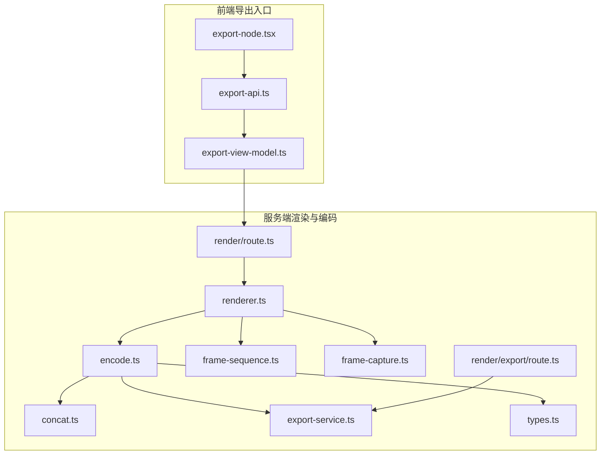
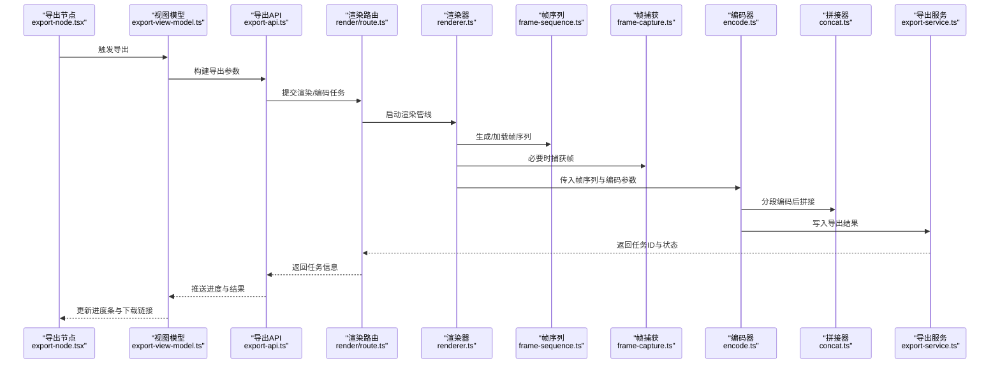
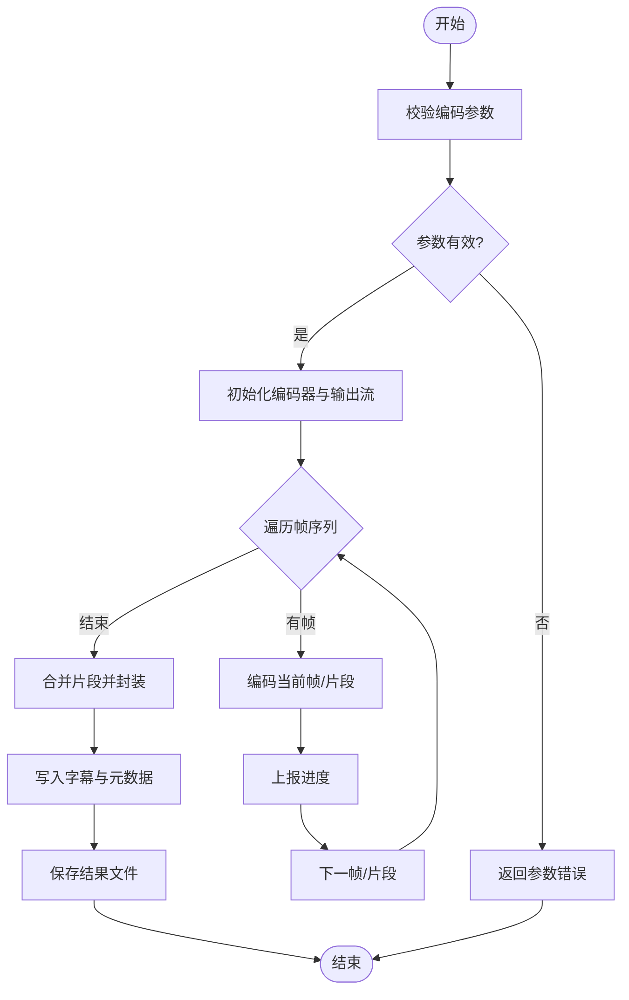
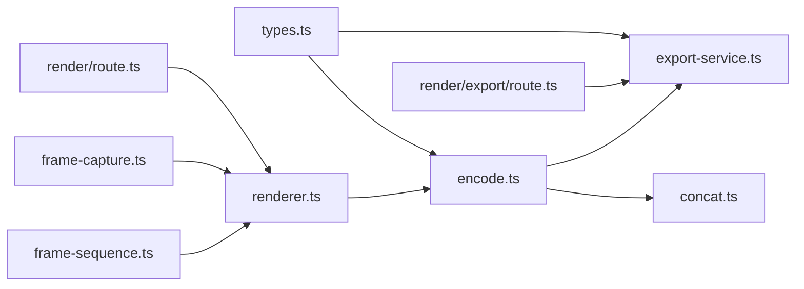

# 视频编码转换

<cite>
**本文引用的文件**   
- [src/features/render/encode.ts](file://src/features/render/encode.ts)
- [src/features/render/encode.test.ts](file://src/features/render/encode.test.ts)
- [src/features/render/frame-sequence.ts](file://src/features/render/frame-sequence.ts)
- [src/features/render/frame-capture.ts](file://src/features/render/frame-capture.ts)
- [src/features/render/export-service.ts](file://src/features/render/export-service.ts)
- [src/features/render/concat.ts](file://src/features/render/concat.ts)
- [src/features/render/renderer.ts](file://src/features/render/renderer.ts)
- [src/features/render/types.ts](file://src/features/render/types.ts)
- [src/app/api/render/route.ts](file://src/app/api/render/route.ts)
- [src/app/api/render/export/route.ts](file://src/app/api/render/export/route.ts)
- [src/app/canvas/export/export-api.ts](file://src/app/canvas/export/export-api.ts)
- [src/app/canvas/export/export-view-model.ts](file://src/app/canvas/export/export-view-model.ts)
- [src/components/ui/node/export-node.tsx](file://src/components/ui/node/export-node.tsx)
</cite>

## 目录
1. [简介](#简介)
2. [项目结构](#项目结构)
3. [核心组件](#核心组件)
4. [架构总览](#架构总览)
5. [详细组件分析](#详细组件分析)
6. [依赖关系分析](#依赖关系分析)
7. [性能考量](#性能考量)
8. [故障排除指南](#故障排除指南)
9. [结论](#结论)
10. [附录](#附录)

## 简介
本技术文档聚焦于 CodeVideoCanvas 的视频编码转换模块，系统性阐述从帧序列到最终视频的完整流程。内容涵盖：
- 编码器工作原理与支持的输出格式（如 MP4、WebM）
- 编码参数配置与质量控制机制
- 帧序列到视频的转换流程（含音频同步、字幕嵌入、元数据添加）
- 缓冲区管理、进度跟踪与错误恢复策略
- 不同编码器的性能对比、最佳实践与故障排除
- 具体示例展示如何配置编码参数、处理编码任务与优化输出质量

## 项目结构
渲染与编码相关代码主要位于 features/render 与 app/api/render 等目录中，前端导出入口在 canvas/export 与 UI 节点 export-node 中。整体采用“渲染管线 + 编码服务 + API 路由”的分层组织方式。

图表来源
- [src/app/canvas/export/export-api.ts](file://src/app/canvas/export/export-api.ts)
- [src/app/canvas/export/export-view-model.ts](file://src/app/canvas/export/export-view-model.ts)
- [src/app/api/render/route.ts](file://src/app/api/render/route.ts)
- [src/app/api/render/export/route.ts](file://src/app/api/render/export/route.ts)
- [src/features/render/renderer.ts](file://src/features/render/renderer.ts)
- [src/features/render/frame-sequence.ts](file://src/features/render/frame-sequence.ts)
- [src/features/render/frame-capture.ts](file://src/features/render/frame-capture.ts)
- [src/features/render/encode.ts](file://src/features/render/encode.ts)
- [src/features/render/concat.ts](file://src/features/render/concat.ts)
- [src/features/render/export-service.ts](file://src/features/render/export-service.ts)
- [src/features/render/types.ts](file://src/features/render/types.ts)

章节来源
- [src/features/render/encode.ts](file://src/features/render/encode.ts)
- [src/features/render/frame-sequence.ts](file://src/features/render/frame-sequence.ts)
- [src/features/render/frame-capture.ts](file://src/features/render/frame-capture.ts)
- [src/features/render/export-service.ts](file://src/features/render/export-service.ts)
- [src/features/render/concat.ts](file://src/features/render/concat.ts)
- [src/features/render/renderer.ts](file://src/features/render/renderer.ts)
- [src/features/render/types.ts](file://src/features/render/types.ts)
- [src/app/api/render/route.ts](file://src/app/api/render/route.ts)
- [src/app/api/render/export/route.ts](file://src/app/api/render/export/route.ts)
- [src/app/canvas/export/export-api.ts](file://src/app/canvas/export/export-api.ts)
- [src/app/canvas/export/export-view-model.ts](file://src/app/canvas/export/export-view-model.ts)
- [src/components/ui/node/export-node.tsx](file://src/components/ui/node/export-node.tsx)

## 核心组件
- 编码服务 encode.ts：负责将帧序列与可选音轨、字幕、元数据组合为最终媒体文件；提供编码器选择、参数校验、进度回调与错误上报。
- 帧序列 frame-sequence.ts：定义帧序列的读取、排序、时间戳对齐与裁剪逻辑。
- 帧捕获 frame-capture.ts：从渲染上下文或画布捕获单帧图像数据，用于离线编码或回退路径。
- 拼接 concat.ts：对分段片段进行合并，支持按时间线顺序与码率自适应拼接。
- 导出服务 export-service.ts：封装导出任务的持久化、状态机与结果落盘。
- 渲染器 renderer.ts：编排渲染阶段，产出帧序列并驱动编码流程。
- 类型 types.ts：统一编码参数、任务状态、进度事件等数据结构。
- API 路由 render/route.ts 与 render/export/route.ts：暴露创建渲染任务、查询进度与获取结果的接口。
- 前端导出入口 export-api.ts、export-view-model.ts、export-node.tsx：提供用户交互与任务调度。

章节来源
- [src/features/render/encode.ts](file://src/features/render/encode.ts)
- [src/features/render/frame-sequence.ts](file://src/features/render/frame-sequence.ts)
- [src/features/render/frame-capture.ts](file://src/features/render/frame-capture.ts)
- [src/features/render/concat.ts](file://src/features/render/concat.ts)
- [src/features/render/export-service.ts](file://src/features/render/export-service.ts)
- [src/features/render/renderer.ts](file://src/features/render/renderer.ts)
- [src/features/render/types.ts](file://src/features/render/types.ts)
- [src/app/api/render/route.ts](file://src/app/api/render/route.ts)
- [src/app/api/render/export/route.ts](file://src/app/api/render/export/route.ts)
- [src/app/canvas/export/export-api.ts](file://src/app/canvas/export/export-api.ts)
- [src/app/canvas/export/export-view-model.ts](file://src/app/canvas/export/export-view-model.ts)
- [src/components/ui/node/export-node.tsx](file://src/components/ui/node/export-node.tsx)

## 架构总览
下图展示了从前端发起导出请求到服务端完成编码输出的端到端流程。

图表来源
- [src/components/ui/node/export-node.tsx](file://src/components/ui/node/export-node.tsx)
- [src/app/canvas/export/export-view-model.ts](file://src/app/canvas/export/export-view-model.ts)
- [src/app/canvas/export/export-api.ts](file://src/app/canvas/export/export-api.ts)
- [src/app/api/render/route.ts](file://src/app/api/render/route.ts)
- [src/features/render/renderer.ts](file://src/features/render/renderer.ts)
- [src/features/render/frame-sequence.ts](file://src/features/render/frame-sequence.ts)
- [src/features/render/frame-capture.ts](file://src/features/render/frame-capture.ts)
- [src/features/render/encode.ts](file://src/features/render/encode.ts)
- [src/features/render/concat.ts](file://src/features/render/concat.ts)
- [src/features/render/export-service.ts](file://src/features/render/export-service.ts)

## 详细组件分析

### 编码器 encode.ts
- 职责
  - 接收帧序列与编码参数，选择目标容器与编码器（如 MP4/H.264、WebM/VP9）。
  - 控制码率、分辨率、帧率、关键帧间隔、音频采样率与声道数等参数。
  - 支持字幕轨道注入与元数据写入（标题、作者、描述、自定义键值）。
  - 提供进度回调（已处理帧数、当前比特率、预估剩余时间）。
  - 实现错误分类与重试策略（网络/IO/编码器异常），支持断点续编（若分段存储可用）。
- 关键流程
  - 参数校验与默认值填充
  - 分片编码（按时间窗口或固定帧数）
  - 片段合并与封装
  - 进度上报与结果落盘
- 质量控制
  - 基于目标码率与峰值码率的动态调整
  - 关键帧密度与 GOP 长度控制
  - 音频重采样与响度归一化（可选）
- 错误恢复
  - 失败片段自动重试与降级（降低分辨率或码率）
  - 中间产物保留以便增量修复

图表来源
- [src/features/render/encode.ts](file://src/features/render/encode.ts)
- [src/features/render/concat.ts](file://src/features/render/concat.ts)
- [src/features/render/export-service.ts](file://src/features/render/export-service.ts)

章节来源
- [src/features/render/encode.ts](file://src/features/render/encode.ts)
- [src/features/render/encode.test.ts](file://src/features/render/encode.test.ts)
- [src/features/render/concat.ts](file://src/features/render/concat.ts)
- [src/features/render/export-service.ts](file://src/features/render/export-service.ts)

### 帧序列 frame-sequence.ts
- 职责
  - 维护有序帧集合，支持按时间戳排序、裁剪、抽帧与插值。
  - 与音频轨道对齐，确保帧时长与音频时长一致。
- 复杂度
  - 排序 O(n log n)，裁剪与抽帧 O(n)。
- 与编码集成
  - 向编码器提供迭代器或切片，避免一次性加载全部帧到内存。

章节来源
- [src/features/render/frame-sequence.ts](file://src/features/render/frame-sequence.ts)

### 帧捕获 frame-capture.ts
- 职责
  - 从渲染上下文或画布捕获单帧像素数据，作为编码输入。
  - 支持格式转换（RGBA/YUV）、缩放与色彩空间校正。
- 使用场景
  - 当无法直接获取离屏帧时，作为回退路径。

章节来源
- [src/features/render/frame-capture.ts](file://src/features/render/frame-capture.ts)

### 拼接 concat.ts
- 职责
  - 将分段编码片段按时间顺序合并，保证无缝衔接。
  - 处理多轨道（视频+音频+字幕）的同步与打包。
- 性能要点
  - 零拷贝合并（若底层库支持）
  - 流式写入减少峰值内存占用

章节来源
- [src/features/render/concat.ts](file://src/features/render/concat.ts)

### 导出服务 export-service.ts
- 职责
  - 管理导出任务生命周期（创建、运行、完成、失败）。
  - 持久化任务状态与进度，供 API 查询。
  - 封装结果文件的访问与清理策略。
- 状态机
  - 排队 → 进行中 → 成功/失败 → 清理

章节来源
- [src/features/render/export-service.ts](file://src/features/render/export-service.ts)

### 渲染器 renderer.ts
- 职责
  - 编排渲染阶段，产出帧序列并调用编码器。
  - 协调音频、字幕与元数据的注入时机。
- 与编码集成
  - 根据任务配置选择编码器与输出格式。

章节来源
- [src/features/render/renderer.ts](file://src/features/render/renderer.ts)

### 类型 types.ts
- 职责
  - 定义编码参数、任务状态、进度事件、错误码等共享类型。
  - 约束前后端与服务端内部的数据契约。

章节来源
- [src/features/render/types.ts](file://src/features/render/types.ts)

### API 路由 render/route.ts 与 render/export/route.ts
- 职责
  - 暴露创建渲染/编码任务的接口，返回任务 ID。
  - 提供进度查询与结果下载接口。
- 安全与限流
  - 鉴权、配额限制与并发控制（由上层网关或中间件保障）。

章节来源
- [src/app/api/render/route.ts](file://src/app/api/render/route.ts)
- [src/app/api/render/export/route.ts](file://src/app/api/render/export/route.ts)

### 前端导出入口 export-api.ts、export-view-model.ts、export-node.tsx
- 职责
  - 收集用户选择的导出选项（格式、分辨率、码率、是否包含字幕等）。
  - 调用后端 API 创建任务并轮询进度。
  - 在 UI 上显示进度条与下载按钮。

章节来源
- [src/app/canvas/export/export-api.ts](file://src/app/canvas/export/export-api.ts)
- [src/app/canvas/export/export-view-model.ts](file://src/app/canvas/export/export-view-model.ts)
- [src/components/ui/node/export-node.tsx](file://src/components/ui/node/export-node.tsx)

## 依赖关系分析
- 耦合与内聚
  - encode.ts 与 concat.ts、export-service.ts 紧密协作，形成“编码-合并-落盘”的内聚单元。
  - renderer.ts 作为编排者，依赖 frame-sequence.ts、frame-capture.ts 与 encode.ts。
- 外部依赖
  - 容器与编码器（H.264/HEVC/VP9/AV1 等）通过底层库或系统工具链接入。
  - 文件系统用于中间片段与最终结果存储。
- 潜在循环依赖
  - 通过类型解耦与接口抽象避免循环引用。

图表来源
- [src/features/render/types.ts](file://src/features/render/types.ts)
- [src/features/render/encode.ts](file://src/features/render/encode.ts)
- [src/features/render/export-service.ts](file://src/features/render/export-service.ts)
- [src/features/render/frame-sequence.ts](file://src/features/render/frame-sequence.ts)
- [src/features/render/frame-capture.ts](file://src/features/render/frame-capture.ts)
- [src/features/render/renderer.ts](file://src/features/render/renderer.ts)
- [src/features/render/concat.ts](file://src/features/render/concat.ts)
- [src/app/api/render/route.ts](file://src/app/api/render/route.ts)
- [src/app/api/render/export/route.ts](file://src/app/api/render/export/route.ts)

章节来源
- [src/features/render/types.ts](file://src/features/render/types.ts)
- [src/features/render/encode.ts](file://src/features/render/encode.ts)
- [src/features/render/export-service.ts](file://src/features/render/export-service.ts)
- [src/features/render/frame-sequence.ts](file://src/features/render/frame-sequence.ts)
- [src/features/render/frame-capture.ts](file://src/features/render/frame-capture.ts)
- [src/features/render/renderer.ts](file://src/features/render/renderer.ts)
- [src/features/render/concat.ts](file://src/features/render/concat.ts)
- [src/app/api/render/route.ts](file://src/app/api/render/route.ts)
- [src/app/api/render/export/route.ts](file://src/app/api/render/export/route.ts)

## 性能考量
- 编码器选择
  - H.264（MP4）：兼容性好，CPU 占用中等，适合通用分发。
  - HEVC（MP4）：压缩率高，CPU/GPU 压力较大，适合高分辨率与长视频。
  - VP9/AV1（WebM）：开源生态友好，压缩效率优于 H.264，但编码耗时更长。
- 关键帧与 GOP
  - 合理设置关键帧间隔可提升随机访问能力与转码效率。
- 码率控制
  - 使用 VBR/CQ 模式平衡体积与质量；对直播或低延迟场景考虑 CBR。
- 音频同步
  - 以音频为基准对齐帧时间戳，避免漂移。
- 缓冲与内存
  - 分片编码与流式写入降低峰值内存；避免一次性加载全量帧。
- I/O 优化
  - 使用 SSD 存放中间片段；并行写入与批量落盘。

[本节为通用指导，不直接分析具体文件]

## 故障排除指南
- 常见问题
  - 参数无效：检查分辨率、帧率、码率范围与容器兼容性。
  - 编码失败：查看编码器日志，尝试降级分辨率或码率。
  - 音视频不同步：确认帧序列时间戳与音频时长对齐。
  - 字幕未显示：验证字幕轨道格式与时序。
  - 进度卡住：检查中间片段是否完整，必要时重启任务。
- 定位步骤
  - 通过任务 ID 查询导出服务状态与最近一次进度。
  - 启用调试日志，记录每段编码的开始/结束时间与错误码。
  - 回放失败片段，复现问题并缩小范围。
- 恢复策略
  - 启用断点续编：仅重新编码失败片段。
  - 自动重试与降级：失败 N 次后自动降低质量并重试。

章节来源
- [src/features/render/encode.ts](file://src/features/render/encode.ts)
- [src/features/render/export-service.ts](file://src/features/render/export-service.ts)
- [src/features/render/encode.test.ts](file://src/features/render/encode.test.ts)

## 结论
CodeVideoCanvas 的视频编码转换模块以清晰的职责划分与可扩展的编码器抽象，实现了从帧序列到多格式视频的可靠转换。通过分片编码、进度上报与错误恢复机制，兼顾了性能与稳定性。建议在生产环境中结合业务需求选择合适的编码器与参数，并建立完善的监控与告警体系。

[本节为总结性内容，不直接分析具体文件]

## 附录

### 配置示例（概念性说明）
- 输出格式
  - MP4（H.264/HEVC）：适用于广泛兼容性与平台分发。
  - WebM（VP9/AV1）：适用于开源生态与高压缩比需求。
- 编码参数
  - 分辨率、帧率、码率（平均/峰值）、关键帧间隔、音频采样率与声道数。
- 质量控制
  - 目标码率与质量等级（CQ/VBR），必要时开启音频响度归一化。
- 字幕与元数据
  - 支持 SRT/ASS 等字幕轨道；可写入标题、作者、描述与自定义键值。

[本节为概念性说明，不直接分析具体文件]

### 最佳实践
- 优先使用分片编码与流式写入以降低内存峰值。
- 针对目标平台选择合适编码器与容器。
- 合理设置关键帧间隔以提升随机访问与转码效率。
- 对长视频启用断点续编与失败重试。
- 建立任务级监控与指标采集（进度、码率、耗时、错误率）。

[本节为通用指导，不直接分析具体文件]