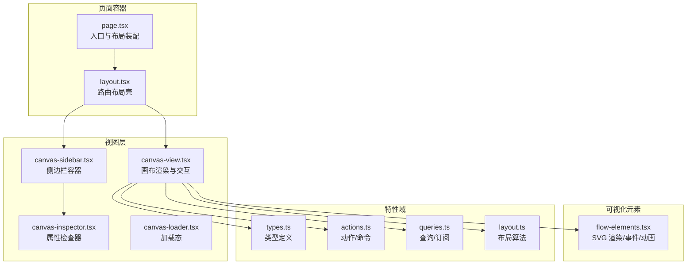
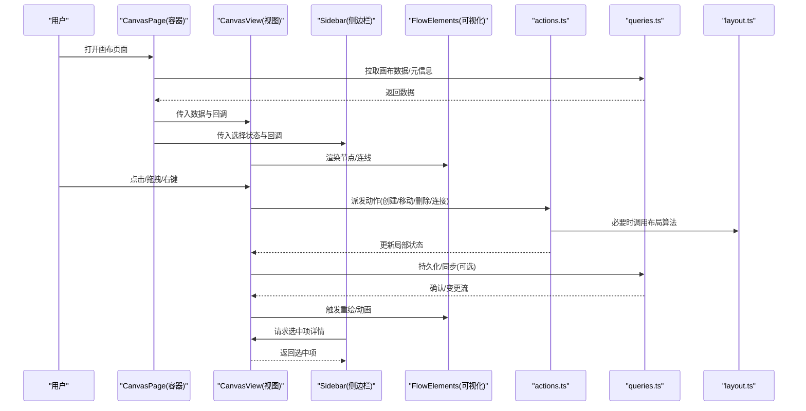
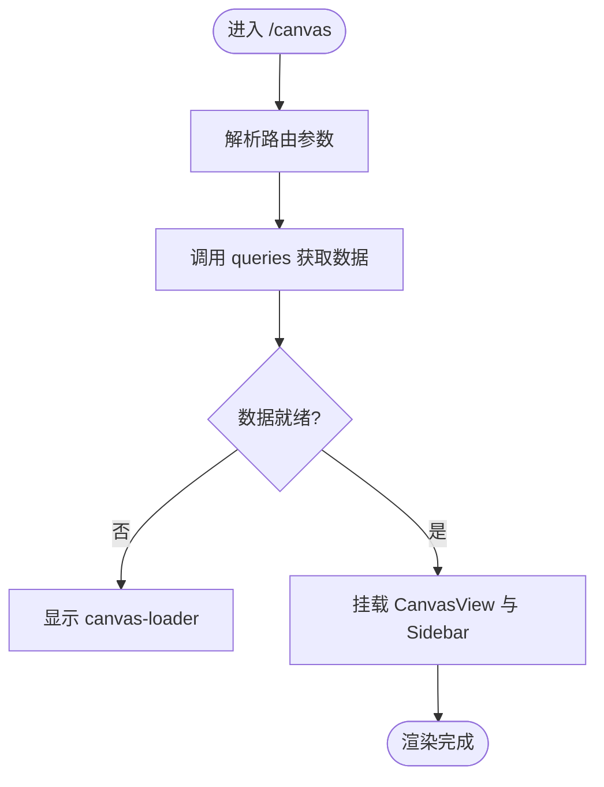
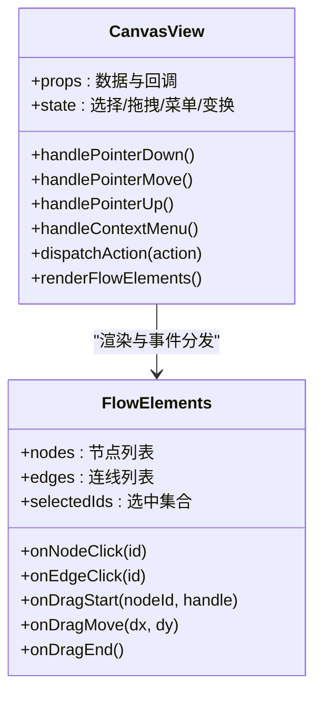
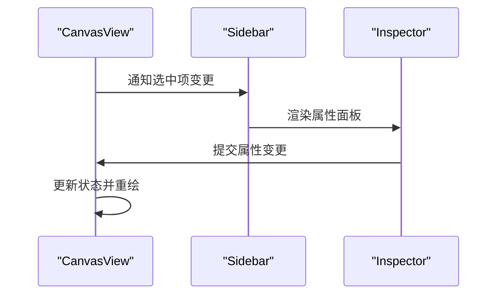
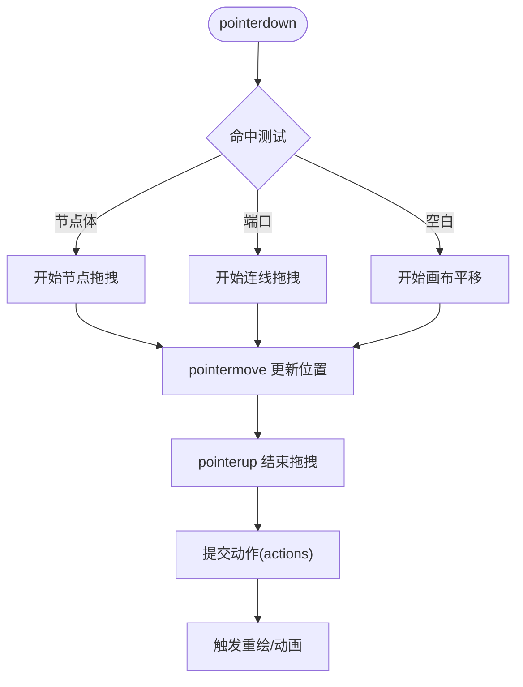
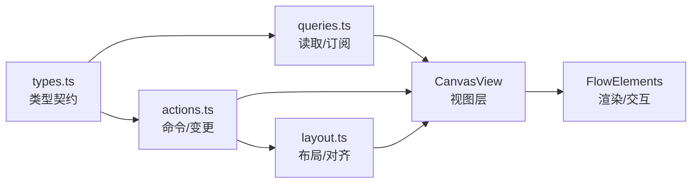
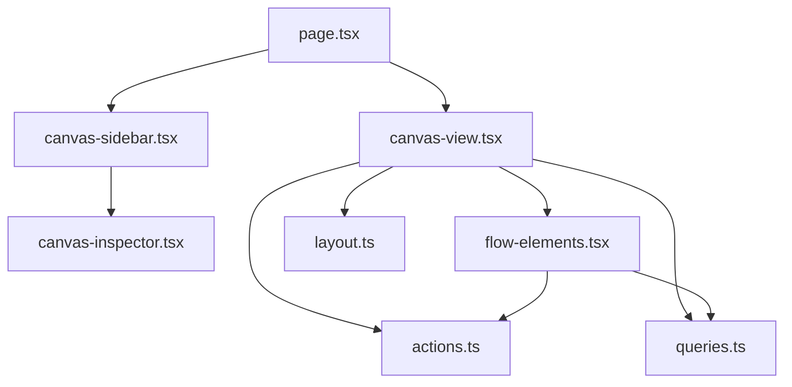

# 集成层

<cite>
**本文引用的文件**   
- [src/app/canvas/page.tsx](file://src/app/canvas/page.tsx)
- [src/app/canvas/layout.tsx](file://src/app/canvas/layout.tsx)
- [src/app/canvas/canvas-view.tsx](file://src/app/canvas/canvas-view.tsx)
- [src/app/canvas/canvas-sidebar.tsx](file://src/app/canvas/canvas-sidebar.tsx)
- [src/app/canvas/flow-elements.tsx](file://src/app/canvas/flow-elements.tsx)
- [src/app/canvas/canvas-inspector.tsx](file://src/app/canvas/canvas-inspector.tsx)
- [src/app/canvas/canvas-loader.tsx](file://src/app/canvas/canvas-loader.tsx)
- [src/app/canvas/canvas-action-api.ts](file://src/app/canvas/canvas-action-api.ts)
- [src/features/canvas/types.ts](file://src/features/canvas/types.ts)
- [src/features/canvas/actions.ts](file://src/features/canvas/actions.ts)
- [src/features/canvas/queries.ts](file://src/features/canvas/queries.ts)
- [src/features/canvas/layout.ts](file://src/features/canvas/layout.ts)
- [src/components/ui/sidebar.tsx](file://src/components/ui/sidebar.tsx)
- [src/components/ui/top-bar.tsx](file://src/components/ui/top-bar.tsx)
</cite>

## 更新摘要
**所做更改**   
- 将文档标题从"UI 集成层"更新为"集成层"
- 简化了文档命名约定，使知识库更加一致
- 保持了相同的内容结构和组织方式

## 目录
1. [简介](#简介)
2. [项目结构](#项目结构)
3. [核心组件](#核心组件)
4. [架构总览](#架构总览)
5. [详细组件分析](#详细组件分析)
6. [依赖关系分析](#依赖关系分析)
7. [性能考虑](#性能考虑)
8. [故障排查指南](#故障排查指南)
9. [结论](#结论)
10. [附录](#附录)

## 简介
本文件面向画布编辑器的 UI 集成层，聚焦页面组件的架构设计与交互模式，覆盖 CanvasPage 主容器、CanvasView 渲染视图与 Sidebar 侧边栏的组合方式；深入解析 FlowElements 可视化元素的实现（SVG 渲染、事件处理、动画效果）；阐述状态同步机制（React 状态与画布数据绑定、实时更新与性能优化）；并给出拖拽交互、选择高亮、上下文菜单等用户交互的实现细节与最佳实践。同时提供组件组合模式与样式定制指南，帮助读者快速理解并扩展该集成层。

## 项目结构
UI 集成层位于应用路由 /canvas 下，采用"页面容器 + 视图 + 侧边栏"的分层组织：
- 页面容器：负责加载、布局与全局状态装配
- 视图层：承载画布渲染与交互
- 侧边栏：承载属性检查器、工具面板等
- 可视化元素：FlowElements 作为可复用节点/连线集合，统一 SVG 渲染与事件分发
- 特性域：features/canvas 提供类型、动作、查询与布局算法

**图表来源**
- [src/app/canvas/page.tsx](file://src/app/canvas/page.tsx)
- [src/app/canvas/layout.tsx](file://src/app/canvas/layout.tsx)
- [src/app/canvas/canvas-view.tsx](file://src/app/canvas/canvas-view.tsx)
- [src/app/canvas/canvas-sidebar.tsx](file://src/app/canvas/canvas-sidebar.tsx)
- [src/app/canvas/canvas-inspector.tsx](file://src/app/canvas/canvas-inspector.tsx)
- [src/app/canvas/canvas-loader.tsx](file://src/app/canvas/canvas-loader.tsx)
- [src/app/canvas/flow-elements.tsx](file://src/app/canvas/flow-elements.tsx)
- [src/features/canvas/types.ts](file://src/features/canvas/types.ts)
- [src/features/canvas/actions.ts](file://src/features/canvas/actions.ts)
- [src/features/canvas/queries.ts](file://src/features/canvas/queries.ts)
- [src/features/canvas/layout.ts](file://src/features/canvas/layout.ts)

**章节来源**
- [src/app/canvas/page.tsx](file://src/app/canvas/page.tsx)
- [src/app/canvas/layout.tsx](file://src/app/canvas/layout.tsx)
- [src/app/canvas/canvas-view.tsx](file://src/app/canvas/canvas-view.tsx)
- [src/app/canvas/canvas-sidebar.tsx](file://src/app/canvas/canvas-sidebar.tsx)
- [src/app/canvas/canvas-inspector.tsx](file://src/app/canvas/canvas-inspector.tsx)
- [src/app/canvas/canvas-loader.tsx](file://src/app/canvas/canvas-loader.tsx)
- [src/app/canvas/flow-elements.tsx](file://src/app/canvas/flow-elements.tsx)
- [src/features/canvas/types.ts](file://src/features/canvas/types.ts)
- [src/features/canvas/actions.ts](file://src/features/canvas/actions.ts)
- [src/features/canvas/queries.ts](file://src/features/canvas/queries.ts)
- [src/features/canvas/layout.ts](file://src/features/canvas/layout.ts)

## 核心组件
- CanvasPage（页面容器）
  - 职责：组装布局、加载数据、注入全局状态、挂载视图与侧边栏
  - 关键点：路由参数解析、错误边界、加载态控制、与特性域 actions/queries 的对接
- CanvasView（画布视图）
  - 职责：渲染 FlowElements、处理缩放/平移、选择与高亮、拖拽、右键菜单、撤销重做
  - 关键点：事件冒泡控制、命中测试、增量更新、动画驱动
- Sidebar（侧边栏容器）
  - 职责：承载 Inspector 与工具面板，与画布选择状态联动
  - 关键点：面板切换、响应式宽度、与画布的双向通信
- FlowElements（可视化元素）
  - 职责：以 SVG 形式绘制节点与连线，封装拖拽、选中、悬停、动画等交互
  - 关键点：SVG 变换矩阵、路径计算、事件代理、动画队列

**章节来源**
- [src/app/canvas/page.tsx](file://src/app/canvas/page.tsx)
- [src/app/canvas/canvas-view.tsx](file://src/app/canvas/canvas-view.tsx)
- [src/app/canvas/canvas-sidebar.tsx](file://src/app/canvas/canvas-sidebar.tsx)
- [src/app/canvas/flow-elements.tsx](file://src/app/canvas/flow-elements.tsx)

## 架构总览
UI 集成层遵循"容器-视图-特性域"分层：
- 容器层（page/layout）负责装配与生命周期
- 视图层（canvas-view/sidebar/inspector/loader）负责 UI 呈现与交互
- 特性域（types/actions/queries/layout）提供领域模型、命令与查询、布局算法
- 可视化层（flow-elements）作为跨视图复用的渲染单元

**图表来源**
- [src/app/canvas/page.tsx](file://src/app/canvas/page.tsx)
- [src/app/canvas/canvas-view.tsx](file://src/app/canvas/canvas-view.tsx)
- [src/app/canvas/canvas-sidebar.tsx](file://src/app/canvas/canvas-sidebar.tsx)
- [src/app/canvas/flow-elements.tsx](file://src/app/canvas/flow-elements.tsx)
- [src/features/canvas/actions.ts](file://src/features/canvas/actions.ts)
- [src/features/canvas/queries.ts](file://src/features/canvas/queries.ts)
- [src/features/canvas/layout.ts](file://src/features/canvas/layout.ts)

## 详细组件分析

### CanvasPage 主容器
- 角色：页面级装配器，负责路由参数解析、数据加载、错误与加载态管理，并将数据与回调注入到 CanvasView 与 Sidebar
- 关键流程：
  - 解析路由 id 或新建场景
  - 通过 queries 获取画布数据与元信息
  - 将 actions 暴露给子组件进行命令式操作
  - 根据加载状态显示 loader 或进入正式布局
- 与特性域的契约：
  - 使用 types 中的数据结构保证类型安全
  - 通过 actions 执行变更，通过 queries 订阅最新状态

**图表来源**
- [src/app/canvas/page.tsx](file://src/app/canvas/page.tsx)
- [src/app/canvas/canvas-loader.tsx](file://src/app/canvas/canvas-loader.tsx)
- [src/features/canvas/queries.ts](file://src/features/canvas/queries.ts)

**章节来源**
- [src/app/canvas/page.tsx](file://src/app/canvas/page.tsx)
- [src/app/canvas/canvas-loader.tsx](file://src/app/canvas/canvas-loader.tsx)
- [src/features/canvas/queries.ts](file://src/features/canvas/queries.ts)

### CanvasView 渲染视图
- 角色：画布的核心交互与渲染容器，承载 FlowElements，处理缩放/平移、选择、拖拽、右键菜单、撤销重做等
- 交互要点：
  - 事件代理：在容器层捕获鼠标/键盘事件，按命中测试分发给具体元素
  - 选择与高亮：维护选中集合，向 FlowElements 传递选中态
  - 拖拽：区分元素内拖拽与画布平移，避免冲突
  - 右键菜单：基于坐标与命中结果弹出上下文菜单
  - 动画：对移动/缩放/过渡使用统一的动画驱动
- 与特性域协作：
  - 通过 actions 提交变更（如新增节点、移动、连线）
  - 通过 layout 计算自动布局或对齐辅助线
  - 通过 queries 同步持久化或与其他视图共享

**图表来源**
- [src/app/canvas/canvas-view.tsx](file://src/app/canvas/canvas-view.tsx)
- [src/app/canvas/flow-elements.tsx](file://src/app/canvas/flow-elements.tsx)

**章节来源**
- [src/app/canvas/canvas-view.tsx](file://src/app/canvas/canvas-view.tsx)
- [src/app/canvas/flow-elements.tsx](file://src/app/canvas/flow-elements.tsx)

### Sidebar 侧边栏
- 角色：承载 Inspector 与工具面板，与画布的选择状态联动，支持面板切换与响应式宽度
- 交互要点：
  - 监听画布选择变化，动态展示对应属性表单
  - 与 CanvasView 双向通信：修改属性触发画布重绘
  - 与 TopBar 协同：提供全局操作入口（导出、设置等）

**图表来源**
- [src/app/canvas/canvas-sidebar.tsx](file://src/app/canvas/canvas-sidebar.tsx)
- [src/app/canvas/canvas-inspector.tsx](file://src/app/canvas/canvas-inspector.tsx)
- [src/components/ui/top-bar.tsx](file://src/components/ui/top-bar.tsx)

**章节来源**
- [src/app/canvas/canvas-sidebar.tsx](file://src/app/canvas/canvas-sidebar.tsx)
- [src/app/canvas/canvas-inspector.tsx](file://src/app/canvas/canvas-inspector.tsx)
- [src/components/ui/top-bar.tsx](file://src/components/ui/top-bar.tsx)

### FlowElements 可视化元素
- 角色：以 SVG 渲染节点与连线，封装拖拽、选中、悬停、动画等交互逻辑
- 渲染要点：
  - 节点：矩形/圆角容器 + 标题 + 内容区域 + 端口（输入/输出）
  - 连线：贝塞尔曲线，带箭头与选中高亮
  - 变换：统一在根组上应用缩放和平移，避免每个元素重复计算
- 事件处理：
  - 命中测试：按包围盒与端口半径判断命中
  - 拖拽：区分节点体与端口，防止误触
  - 右键：在空白处弹出画布菜单，在元素上弹出元素菜单
- 动画：
  - 移动/缩放使用缓动函数，保持帧率稳定
  - 选中/悬停使用轻量过渡，避免阻塞主线程

**图表来源**
- [src/app/canvas/flow-elements.tsx](file://src/app/canvas/flow-elements.tsx)
- [src/features/canvas/actions.ts](file://src/features/canvas/actions.ts)

**章节来源**
- [src/app/canvas/flow-elements.tsx](file://src/app/canvas/flow-elements.tsx)
- [src/features/canvas/actions.ts](file://src/features/canvas/actions.ts)

### 状态同步机制
- 数据源：
  - types.ts 定义节点、连线、画布元信息等核心类型
  - queries.ts 提供读取与订阅能力（如当前画布、选中项、历史栈）
  - actions.ts 提供命令式变更（增删改、撤销重做、批量操作）
- 绑定策略：
  - 容器层集中持有数据与回调，向下透传，减少深层 props 穿透
  - 视图层仅持有必要派生状态（如选择集、拖拽态），通过 actions 提交变更
  - 特性域内部维护不可变数据，确保可预测性与可调试性
- 实时更新：
  - 使用细粒度订阅，仅在相关数据变更时触发重渲染
  - 对高频事件（拖拽/平移）使用节流/防抖与增量更新
- 性能优化：
  - 只更新受影响的节点/连线，避免全量重绘
  - 使用稳定的 key 与引用，减少 React 不必要的 diff
  - 动画与渲染分离，避免阻塞主线程

**图表来源**
- [src/features/canvas/types.ts](file://src/features/canvas/types.ts)
- [src/features/canvas/actions.ts](file://src/features/canvas/actions.ts)
- [src/features/canvas/queries.ts](file://src/features/canvas/queries.ts)
- [src/features/canvas/layout.ts](file://src/features/canvas/layout.ts)
- [src/app/canvas/canvas-view.tsx](file://src/app/canvas/canvas-view.tsx)
- [src/app/canvas/flow-elements.tsx](file://src/app/canvas/flow-elements.tsx)

**章节来源**
- [src/features/canvas/types.ts](file://src/features/canvas/types.ts)
- [src/features/canvas/actions.ts](file://src/features/canvas/actions.ts)
- [src/features/canvas/queries.ts](file://src/features/canvas/queries.ts)
- [src/features/canvas/layout.ts](file://src/features/canvas/layout.ts)
- [src/app/canvas/canvas-view.tsx](file://src/app/canvas/canvas-view.tsx)
- [src/app/canvas/flow-elements.tsx](file://src/app/canvas/flow-elements.tsx)

### 用户交互实现细节
- 拖拽交互
  - 节点拖拽：记录初始偏移，pointermove 累加位移，pointerup 提交移动动作
  - 连线拖拽：从端口出发，实时计算目标端口命中，生成临时连线预览
  - 画布平移：在空白区域按下并移动，更新视图变换矩阵
- 选择与高亮
  - 单选/多选：Shift/Ctrl 配合点击，维护选中集合
  - 框选：按住左键拖动形成矩形区域，计算交集
  - 高亮：为选中元素添加边框/阴影，悬停添加描边
- 上下文菜单
  - 空白区：新增节点、粘贴、全选、清空
  - 元素区：复制、删除、断开连接、属性编辑
  - 菜单定位：基于指针坐标与视口边界计算显示位置
- 撤销/重做
  - 动作序列化：将每次变更序列化为不可变快照或差异
  - 快捷键：Ctrl+Z / Ctrl+Shift+Z 触发回滚/重放
  - 批量操作：合并多次变更为一个事务，减少历史栈膨胀

**章节来源**
- [src/app/canvas/canvas-view.tsx](file://src/app/canvas/canvas-view.tsx)
- [src/app/canvas/flow-elements.tsx](file://src/app/canvas/flow-elements.tsx)
- [src/features/canvas/actions.ts](file://src/features/canvas/actions.ts)

### 组件组合模式与样式定制
- 组合模式
  - 容器-视图分离：CanvasPage 仅负责装配，CanvasView 专注渲染与交互
  - 侧边栏可插拔：通过插槽注入不同面板（Inspector、工具面板）
  - 可视化元素解耦：FlowElements 不感知上层业务，仅消费类型与回调
- 样式定制
  - 主题变量：颜色、圆角、阴影、字号等通过 CSS 变量暴露
  - 节点模板：通过 props 注入节点头部/主体/尾部插槽，支持自定义节点外观
  - 连线样式：支持虚线/实线、颜色、粗细、箭头形状等配置
  - 响应式：侧边栏宽度、网格密度、字体大小随屏幕尺寸自适应

**章节来源**
- [src/app/canvas/canvas-sidebar.tsx](file://src/app/canvas/canvas-sidebar.tsx)
- [src/app/canvas/flow-elements.tsx](file://src/app/canvas/flow-elements.tsx)
- [src/components/ui/sidebar.tsx](file://src/components/ui/sidebar.tsx)
- [src/components/ui/top-bar.tsx](file://src/components/ui/top-bar.tsx)

## 依赖关系分析
- 直接依赖
  - CanvasView 依赖 FlowElements、actions、queries、layout
  - Sidebar 依赖 Inspector、TopBar、CanvasView 的选择状态
  - CanvasPage 依赖 queries、loader、CanvasView、Sidebar
- 间接依赖
  - FlowElements 通过 actions 与特性域耦合，但不直接访问网络或存储
  - 布局算法由 layout.ts 提供，供 actions 与视图按需调用
- 潜在循环
  - 视图与特性域之间通过回调与类型契约解耦，避免直接相互导入
- 外部集成点
  - 可通过 canvas-action-api.ts 将动作映射到后端 API（如需服务端同步）

**图表来源**
- [src/app/canvas/page.tsx](file://src/app/canvas/page.tsx)
- [src/app/canvas/canvas-view.tsx](file://src/app/canvas/canvas-view.tsx)
- [src/app/canvas/canvas-sidebar.tsx](file://src/app/canvas/canvas-sidebar.tsx)
- [src/app/canvas/canvas-inspector.tsx](file://src/app/canvas/canvas-inspector.tsx)
- [src/app/canvas/flow-elements.tsx](file://src/app/canvas/flow-elements.tsx)
- [src/features/canvas/actions.ts](file://src/features/canvas/actions.ts)
- [src/features/canvas/queries.ts](file://src/features/canvas/queries.ts)
- [src/features/canvas/layout.ts](file://src/features/canvas/layout.ts)

**章节来源**
- [src/app/canvas/page.tsx](file://src/app/canvas/page.tsx)
- [src/app/canvas/canvas-view.tsx](file://src/app/canvas/canvas-view.tsx)
- [src/app/canvas/canvas-sidebar.tsx](file://src/app/canvas/canvas-sidebar.tsx)
- [src/app/canvas/canvas-inspector.tsx](file://src/app/canvas/canvas-inspector.tsx)
- [src/app/canvas/flow-elements.tsx](file://src/app/canvas/flow-elements.tsx)
- [src/features/canvas/actions.ts](file://src/features/canvas/actions.ts)
- [src/features/canvas/queries.ts](file://src/features/canvas/queries.ts)
- [src/features/canvas/layout.ts](file://src/features/canvas/layout.ts)

## 性能考虑
- 渲染优化
  - 使用稳定的 key 与引用，减少 React 重渲染
  - 对大量节点启用虚拟化或分片渲染（按需加载可视区域）
  - 连线计算缓存，避免每帧重复计算
- 事件优化
  - pointer 事件统一处理，减少事件监听器数量
  - 拖拽/平移使用 requestAnimationFrame 批处理更新
- 状态优化
  - 将频繁更新的局部状态下沉至组件内部，避免顶层状态风暴
  - 使用不可变数据结构与浅比较，提升 diff 效率
- 动画优化
  - 优先使用 transform 与 opacity 等合成属性
  - 避免在动画中触发布局抖动（reflow）

## 故障排查指南
- 常见问题
  - 拖拽卡顿：检查是否在主线程中进行复杂计算，建议拆分任务或使用 Web Worker
  - 连线错位：确认变换矩阵与坐标系一致，检查端口命中半径
  - 选择异常：核对命中测试逻辑与 z-index 层级
  - 菜单溢出：计算菜单位置时考虑视口边界与滚动偏移
- 调试建议
  - 在 CanvasView 中打印事件链与命中结果
  - 在 actions 中记录动作序列，便于回放与对比
  - 使用浏览器性能面板分析重绘与布局开销

**章节来源**
- [src/app/canvas/canvas-view.tsx](file://src/app/canvas/canvas-view.tsx)
- [src/app/canvas/flow-elements.tsx](file://src/app/canvas/flow-elements.tsx)
- [src/features/canvas/actions.ts](file://src/features/canvas/actions.ts)

## 结论
UI 集成层通过清晰的容器-视图-特性域分层，实现了可扩展、高性能的画布编辑器界面。CanvasPage 负责装配与生命周期，CanvasView 承载核心交互，Sidebar 提供属性与工具面板，FlowElements 则统一了可视化元素的渲染与交互。借助类型契约、动作与查询的解耦设计，系统具备良好的可维护性与可测试性。结合本文提供的交互细节、性能优化与样式定制指南，开发者可以快速扩展新的节点类型、交互行为与主题风格。

## 附录
- 术语
  - 画布：指代整个可缩放/平移的编辑区域
  - 节点：画布上的基本元素，包含输入/输出端口
  - 连线：连接两个端口的有向边
  - 动作：对画布状态的不可变变更
  - 查询：对画布状态的读取与订阅
- 参考文件
  - 类型与动作：见 features/canvas 下的 types.ts、actions.ts、queries.ts、layout.ts
  - 视图与容器：见 app/canvas 下的 page.tsx、layout.tsx、canvas-view.tsx、canvas-sidebar.tsx、canvas-inspector.tsx、canvas-loader.tsx、flow-elements.tsx