# 画布管道反馈系统

<cite>
**本文引用的文件**   
- [pipeline-feedback.ts](file://src/app/(app)/canvas/pipeline-feedback.ts)
- [streaming-log-card.tsx](file://src/app/(app)/canvas/streaming-log-card.tsx)
- [stage-error-dialog.tsx](file://src/app/(app)/canvas/stage-error-dialog.tsx)
- [route.ts](file://src/app/api/director/stream/[nodeId]/route.ts)
- [route.ts](file://src/app/api/director/pipeline/route.ts)
- [route.ts](file://src/app/api/director/stage/route.ts)
- [advance.ts](file://src/features/director/advance.ts)
- [queue-handler.ts](file://src/features/director/queue-handler.ts)
- [stage-runner.ts](file://src/features/director/stage-runner.ts)
- [types.ts](file://src/features/director/types.ts)
- [index.ts](file://src/features/director/index.ts)
- [export-api.ts](file://src/app/(app)/canvas/export/export-api.ts)
- [shot-api.ts](file://src/app/(app)/canvas/shot/[id]/shot-api.ts)
</cite>

## 目录
1. [简介](#简介)
2. [项目结构](#项目结构)
3. [核心组件](#核心组件)
4. [架构总览](#架构总览)
5. [详细组件分析](#详细组件分析)
6. [依赖关系分析](#依赖关系分析)
7. [性能考量](#性能考量)
8. [故障排查指南](#故障排查指南)
9. [结论](#结论)
10. [附录](#附录)

## 简介
本文件面向“画布管道反馈系统”，聚焦于导演（Director）与渲染管线在 Next.js 应用中的端到端反馈链路：前端通过 SSE/流式接口实时接收节点执行日志、阶段状态变更与错误信息，并在 UI 中以卡片和对话框形式呈现。该体系覆盖从 API 路由到特性层（features）的推进逻辑、队列调度、阶段运行器，以及前端的流式消费与展示。

## 项目结构
围绕“画布管道反馈”的关键代码分布在以下位置：
- 应用层（app）：页面级组件与 API 路由，负责请求入口、SSE 流输出与前端展示
- 特性层（features/director）：管道推进、队列处理、阶段运行与类型定义
- 共享工具与导出模块：用于导出与镜头数据交互的 API 封装

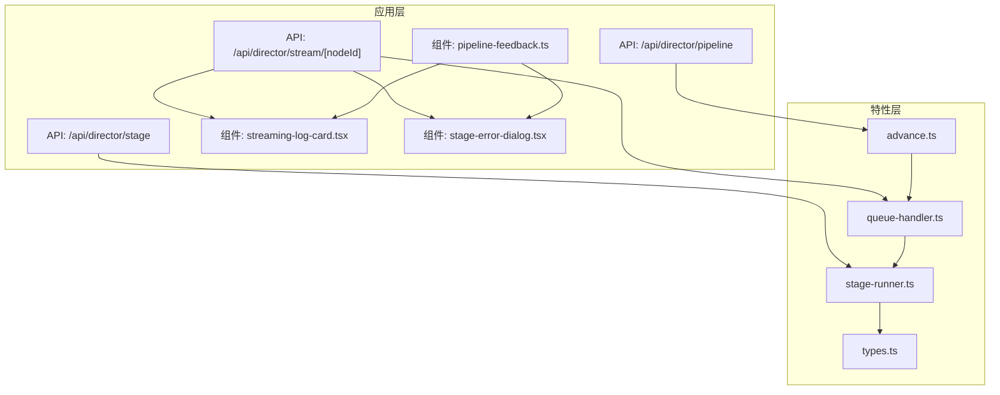

**图表来源** 
- [route.ts](file://src/app/api/director/stream/[nodeId]/route.ts)
- [route.ts](file://src/app/api/director/pipeline/route.ts)
- [route.ts](file://src/app/api/director/stage/route.ts)
- [streaming-log-card.tsx](file://src/app/(app)/canvas/streaming-log-card.tsx)
- [stage-error-dialog.tsx](file://src/app/(app)/canvas/stage-error-dialog.tsx)
- [pipeline-feedback.ts](file://src/app/(app)/canvas/pipeline-feedback.ts)
- [advance.ts](file://src/features/director/advance.ts)
- [queue-handler.ts](file://src/features/director/queue-handler.ts)
- [stage-runner.ts](file://src/features/director/stage-runner.ts)
- [types.ts](file://src/features/director/types.ts)

**章节来源**
- [route.ts](file://src/app/api/director/stream/[nodeId]/route.ts)
- [route.ts](file://src/app/api/director/pipeline/route.ts)
- [route.ts](file://src/app/api/director/stage/route.ts)
- [streaming-log-card.tsx](file://src/app/(app)/canvas/streaming-log-card.tsx)
- [stage-error-dialog.tsx](file://src/app/(app)/canvas/stage-error-dialog.tsx)
- [pipeline-feedback.ts](file://src/app/(app)/canvas/pipeline-feedback.ts)
- [advance.ts](file://src/features/director/advance.ts)
- [queue-handler.ts](file://src/features/director/queue-handler.ts)
- [stage-runner.ts](file://src/features/director/stage-runner.ts)
- [types.ts](file://src/features/director/types.ts)

## 核心组件
- 流式日志卡片：订阅节点 SSE 事件，增量渲染执行日志与进度
- 错误对话框：捕获并展示阶段失败详情与重试入口
- 管道反馈控制器：统一编排事件订阅、状态聚合与 UI 更新
- API 路由：提供节点流式日志、管道推进与阶段控制接口
- 推进器与队列处理器：驱动阶段推进、任务入队与并发控制
- 阶段运行器：执行具体阶段逻辑，产出结果与副作用
- 类型定义：贯穿前后端的统一数据结构契约

**章节来源**
- [streaming-log-card.tsx](file://src/app/(app)/canvas/streaming-log-card.tsx)
- [stage-error-dialog.tsx](file://src/app/(app)/canvas/stage-error-dialog.tsx)
- [pipeline-feedback.ts](file://src/app/(app)/canvas/pipeline-feedback.ts)
- [route.ts](file://src/app/api/director/stream/[nodeId]/route.ts)
- [route.ts](file://src/app/api/director/pipeline/route.ts)
- [route.ts](file://src/app/api/director/stage/route.ts)
- [advance.ts](file://src/features/director/advance.ts)
- [queue-handler.ts](file://src/features/director/queue-handler.ts)
- [stage-runner.ts](file://src/features/director/stage-runner.ts)
- [types.ts](file://src/features/director/types.ts)

## 架构总览
下图展示了从用户操作到前端展示的完整反馈链路，包括 API 路由、特性层推进与运行器、以及前端的流式消费与展示。

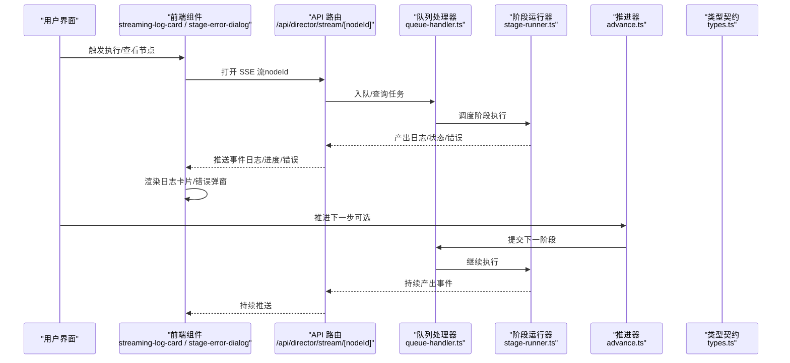

**图表来源** 
- [route.ts](file://src/app/api/director/stream/[nodeId]/route.ts)
- [queue-handler.ts](file://src/features/director/queue-handler.ts)
- [stage-runner.ts](file://src/features/director/stage-runner.ts)
- [advance.ts](file://src/features/director/advance.ts)
- [types.ts](file://src/features/director/types.ts)
- [streaming-log-card.tsx](file://src/app/(app)/canvas/streaming-log-card.tsx)
- [stage-error-dialog.tsx](file://src/app/(app)/canvas/stage-error-dialog.tsx)

## 详细组件分析

### 流式日志卡片（Streaming Log Card）
- 职责：订阅节点 SSE 事件，解析事件类型（日志、进度、完成、错误），增量更新 UI
- 关键行为：连接管理、断线重连、滚动定位、错误高亮、进度条联动
- 复杂度：O(n) 增量渲染；事件去抖与节流策略降低重排开销

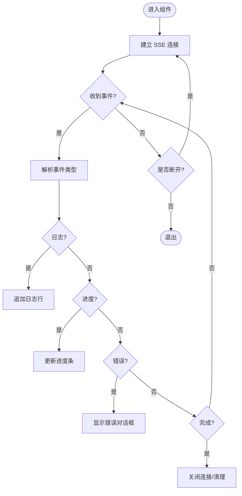

**图表来源** 
- [streaming-log-card.tsx](file://src/app/(app)/canvas/streaming-log-card.tsx)

**章节来源**
- [streaming-log-card.tsx](file://src/app/(app)/canvas/streaming-log-card.tsx)

### 错误对话框（Stage Error Dialog）
- 职责：集中展示阶段失败原因、堆栈摘要与重试入口
- 关键行为：错误聚合、可折叠详情、重试调用、关闭回调
- 交互：与流式日志卡片联动，当检测到错误事件时自动弹出

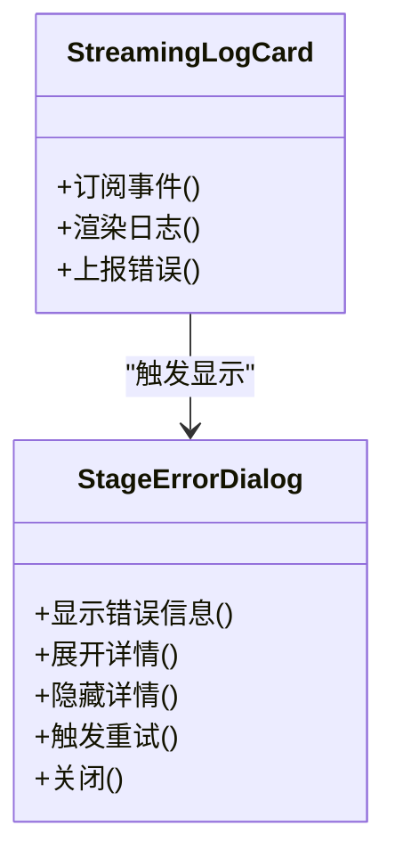

**图表来源** 
- [stage-error-dialog.tsx](file://src/app/(app)/canvas/stage-error-dialog.tsx)
- [streaming-log-card.tsx](file://src/app/(app)/canvas/streaming-log-card.tsx)

**章节来源**
- [stage-error-dialog.tsx](file://src/app/(app)/canvas/stage-error-dialog.tsx)
- [streaming-log-card.tsx](file://src/app/(app)/canvas/streaming-log-card.tsx)

### 管道反馈控制器（Pipeline Feedback）
- 职责：统一管理多个节点的流式订阅、状态聚合、UI 状态同步
- 关键行为：生命周期管理（创建/销毁）、事件分发、错误边界处理
- 扩展点：支持自定义事件处理器与 UI 适配器

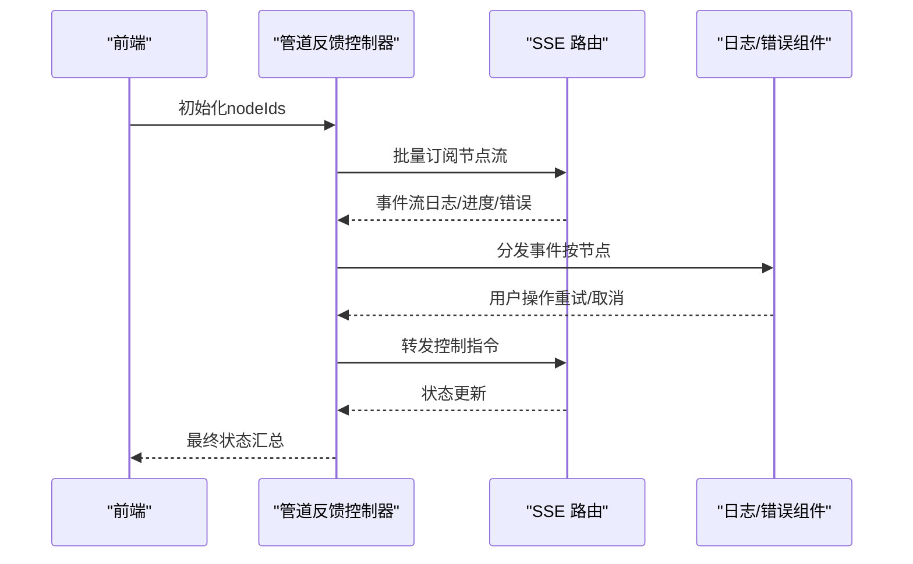

**图表来源** 
- [pipeline-feedback.ts](file://src/app/(app)/canvas/pipeline-feedback.ts)
- [route.ts](file://src/app/api/director/stream/[nodeId]/route.ts)

**章节来源**
- [pipeline-feedback.ts](file://src/app/(app)/canvas/pipeline-feedback.ts)

### API 路由（SSE 流、管道推进、阶段控制）
- /api/director/stream/[nodeId]：为指定节点提供 SSE 事件流，包含日志、进度、完成与错误
- /api/director/pipeline：触发或推进整个管道，返回当前状态快照
- /api/director/stage：对特定阶段进行控制（开始、暂停、重试、终止）

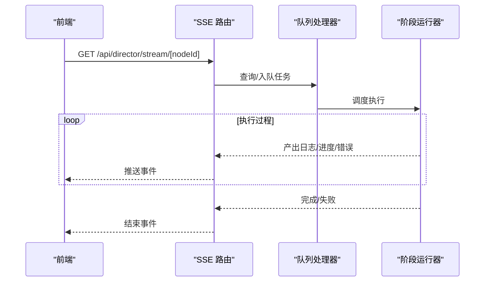

**图表来源** 
- [route.ts](file://src/app/api/director/stream/[nodeId]/route.ts)
- [queue-handler.ts](file://src/features/director/queue-handler.ts)
- [stage-runner.ts](file://src/features/director/stage-runner.ts)

**章节来源**
- [route.ts](file://src/app/api/director/stream/[nodeId]/route.ts)
- [route.ts](file://src/app/api/director/pipeline/route.ts)
- [route.ts](file://src/app/api/director/stage/route.ts)

### 推进器（Advance）
- 职责：根据当前阶段结果决定下一步动作，协调阶段间依赖与条件分支
- 关键行为：状态机推进、前置检查、后置清理、异常回滚

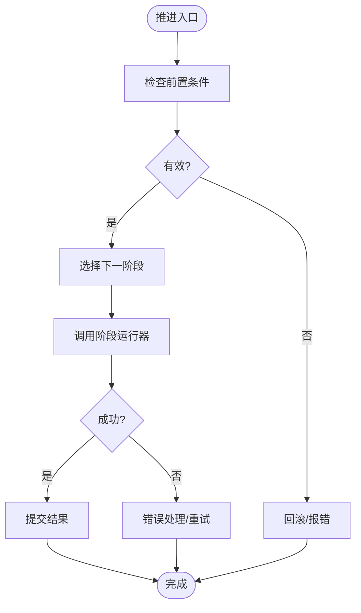

**图表来源** 
- [advance.ts](file://src/features/director/advance.ts)

**章节来源**
- [advance.ts](file://src/features/director/advance.ts)

### 队列处理器（Queue Handler）
- 职责：维护任务队列、并发限制、优先级与重试策略
- 关键行为：入队/出队、背压控制、失败重试、健康检查

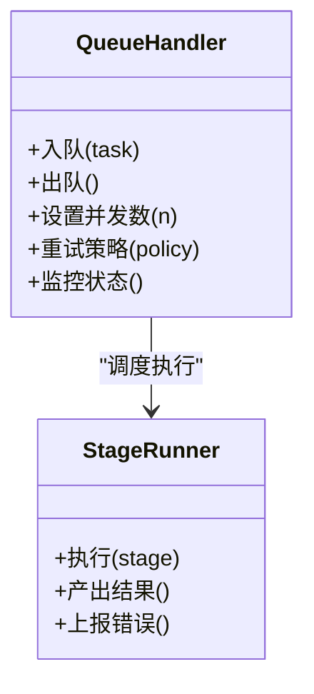

**图表来源** 
- [queue-handler.ts](file://src/features/director/queue-handler.ts)
- [stage-runner.ts](file://src/features/director/stage-runner.ts)

**章节来源**
- [queue-handler.ts](file://src/features/director/queue-handler.ts)

### 阶段运行器（Stage Runner）
- 职责：执行具体阶段逻辑，产生副作用（如生成中间产物、调用外部服务）
- 关键行为：输入校验、执行上下文构建、结果持久化、错误上报

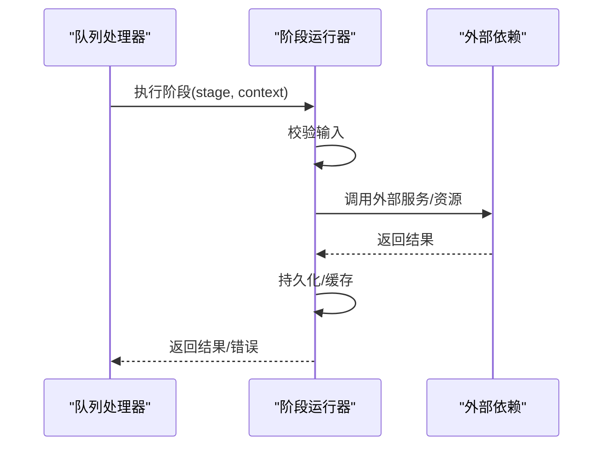

**图表来源** 
- [stage-runner.ts](file://src/features/director/stage-runner.ts)

**章节来源**
- [stage-runner.ts](file://src/features/director/stage-runner.ts)

### 类型契约（Types）
- 职责：统一定义节点、阶段、事件、结果等数据结构，确保前后端一致性
- 关键内容：事件类型枚举、状态码、错误码、字段约束

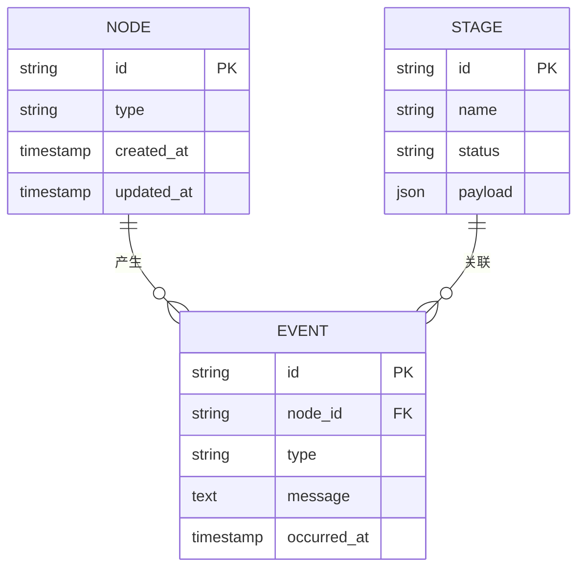

**图表来源** 
- [types.ts](file://src/features/director/types.ts)

**章节来源**
- [types.ts](file://src/features/director/types.ts)

### 概念性概览
下图为不绑定具体文件的流程示意，帮助理解整体反馈机制的设计思想。

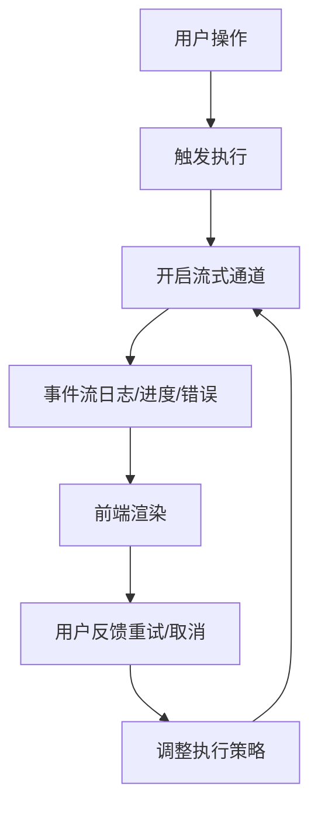

[本图为概念性流程图，不直接映射到具体源码文件]

## 依赖关系分析
- 组件耦合：流式日志卡片与错误对话框由管道反馈控制器统一编排，降低直接耦合
- 外部依赖：API 路由依赖队列处理器与阶段运行器；运行器可能依赖外部服务（存储、模型等）
- 循环依赖：通过类型契约解耦，避免运行时循环引用

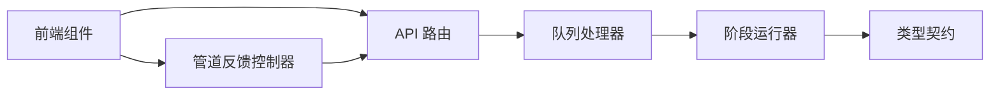

**图表来源** 
- [streaming-log-card.tsx](file://src/app/(app)/canvas/streaming-log-card.tsx)
- [stage-error-dialog.tsx](file://src/app/(app)/canvas/stage-error-dialog.tsx)
- [pipeline-feedback.ts](file://src/app/(app)/canvas/pipeline-feedback.ts)
- [route.ts](file://src/app/api/director/stream/[nodeId]/route.ts)
- [queue-handler.ts](file://src/features/director/queue-handler.ts)
- [stage-runner.ts](file://src/features/director/stage-runner.ts)
- [types.ts](file://src/features/director/types.ts)

**章节来源**
- [index.ts](file://src/features/director/index.ts)
- [types.ts](file://src/features/director/types.ts)

## 性能考量
- 流式渲染：采用增量更新与虚拟滚动减少重排；对高频事件进行去抖/节流
- 并发控制：队列处理器限制并发度，避免资源争用与内存峰值
- 背压处理：当消费者慢时，服务端缓冲与丢弃策略保障稳定性
- 错误恢复：断线重连与幂等重试，保证最终一致性
- 缓存策略：中间结果与缩略图缓存，减少重复计算与 IO

[本节为通用指导，不直接分析具体文件]

## 故障排查指南
- 连接问题：检查 SSE 路由是否正常返回事件流；确认网络与跨域配置
- 事件缺失：核对事件类型与字段命名是否与类型契约一致
- 阶段失败：查看错误对话框详情与日志卡片中的错误片段；必要时启用调试模式
- 队列阻塞：检查队列长度与并发设置；观察健康检查指标
- 重试风暴：确认重试退避策略与最大重试次数，避免雪崩

**章节来源**
- [streaming-log-card.tsx](file://src/app/(app)/canvas/streaming-log-card.tsx)
- [stage-error-dialog.tsx](file://src/app/(app)/canvas/stage-error-dialog.tsx)
- [route.ts](file://src/app/api/director/stream/[nodeId]/route.ts)
- [queue-handler.ts](file://src/features/director/queue-handler.ts)

## 结论
画布管道反馈系统通过清晰的层次划分与统一的类型契约，实现了从后端推进到前端展示的端到端实时反馈。流式日志与错误对话框提升了可观测性与可操作性；队列与阶段运行器保障了执行效率与稳定性。建议在后续迭代中加强监控告警、优化背压策略，并完善错误诊断工具链。

[本节为总结性内容，不直接分析具体文件]

## 附录
- 相关 API 参考：导出与镜头数据交互可通过导出 API 与镜头 API 获取上下文信息
- 最佳实践：保持事件小粒度、避免大对象传输；前端合理拆分组件以提升可维护性

**章节来源**
- [export-api.ts](file://src/app/(app)/canvas/export/export-api.ts)
- [shot-api.ts](file://src/app/(app)/canvas/shot/[id]/shot-api.ts)