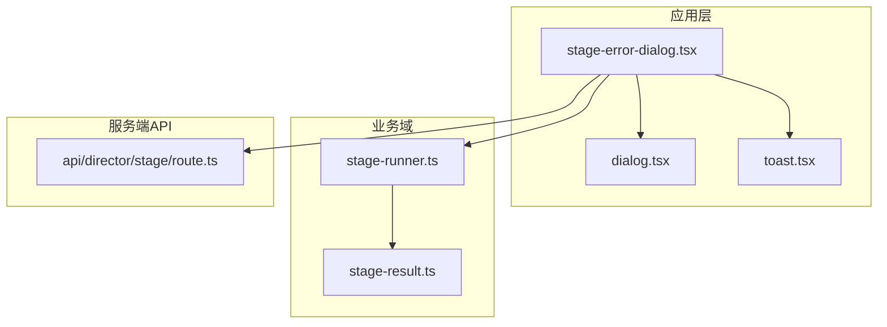
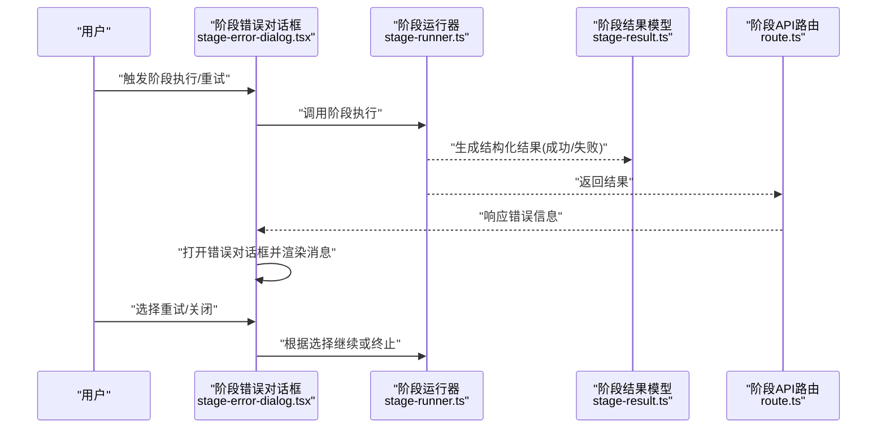
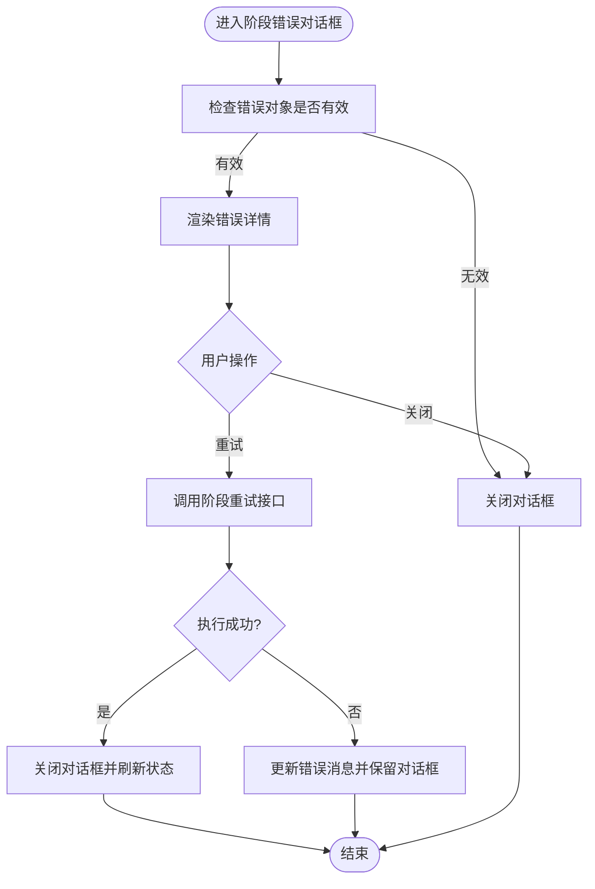
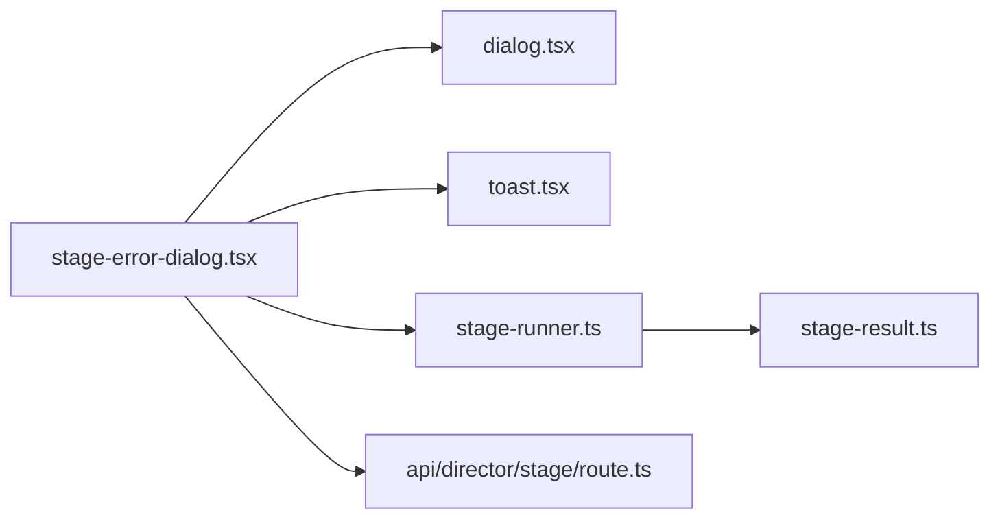

# 阶段错误对话框

<cite>
**本文引用的文件**   
- [stage-error-dialog.tsx](file://src/app/(app)/canvas/stage-error-dialog.tsx)
- [dialog.tsx](file://src/components/ui/dialog.tsx)
- [toast.tsx](file://src/components/ui/toast.tsx)
- [stage-runner.ts](file://src/features/director/stage-runner.ts)
- [stage-result.ts](file://src/features/director/stage-result.ts)
- [route.ts](file://src/app/api/director/stage/route.ts)
</cite>

## 目录
1. [简介](#简介)
2. [项目结构](#项目结构)
3. [核心组件](#核心组件)
4. [架构总览](#架构总览)
5. [详细组件分析](#详细组件分析)
6. [依赖关系分析](#依赖关系分析)
7. [性能考虑](#性能考虑)
8. [故障排查指南](#故障排查指南)
9. [结论](#结论)
10. [附录](#附录)

## 简介
本文件聚焦“阶段错误对话框”这一用户界面与流程控制能力，围绕导演管线中“阶段（Stage）”执行失败时的前端提示、状态回传与错误展示进行系统化说明。文档从系统架构、数据流、处理逻辑、集成点、错误处理与性能特征等维度展开，帮助读者快速理解该功能在整体系统中的位置与作用。

## 项目结构
与“阶段错误对话框”直接相关的代码主要分布在以下位置：
- 应用层页面/弹窗组件：位于 app/(app)/canvas 下的 stage-error-dialog.tsx
- UI 基础组件：components/ui 中的 dialog.tsx、toast.tsx
- 导演管线运行时：features/director 下的 stage-runner.ts、stage-result.ts
- API 路由：app/api/director/stage/route.ts

图表来源
- [stage-error-dialog.tsx](file://src/app/(app)/canvas/stage-error-dialog.tsx)
- [dialog.tsx](file://src/components/ui/dialog.tsx)
- [toast.tsx](file://src/components/ui/toast.tsx)
- [stage-runner.ts](file://src/features/director/stage-runner.ts)
- [stage-result.ts](file://src/features/director/stage-result.ts)
- [route.ts](file://src/app/api/director/stage/route.ts)

章节来源
- [stage-error-dialog.tsx](file://src/app/(app)/canvas/stage-error-dialog.tsx)
- [dialog.tsx](file://src/components/ui/dialog.tsx)
- [toast.tsx](file://src/components/ui/toast.tsx)
- [stage-runner.ts](file://src/features/director/stage-runner.ts)
- [stage-result.ts](file://src/features/director/stage-result.ts)
- [route.ts](file://src/app/api/director/stage/route.ts)

## 核心组件
- 阶段错误对话框（stage-error-dialog.tsx）
  - 职责：在阶段执行失败时弹出错误信息，提供重试或关闭操作；必要时联动全局通知（Toast）。
  - 关键交互：打开/关闭状态管理、错误消息渲染、重试触发、与上层状态同步。
- 对话框基础组件（dialog.tsx）
  - 职责：封装模态框的显示、焦点管理、遮罩与键盘事件。
- 通知组件（toast.tsx）
  - 职责：非阻塞式全局提示，用于辅助反馈错误摘要或操作结果。
- 阶段运行器（stage-runner.ts）
  - 职责：编排阶段执行、捕获异常并生成结构化结果。
- 阶段结果模型（stage-result.ts）
  - 职责：定义阶段执行成功/失败的结构化结果类型，便于前后端一致解析。
- 阶段API路由（route.ts）
  - 职责：接收阶段执行请求，调用运行器，返回统一的结果格式。

章节来源
- [stage-error-dialog.tsx](file://src/app/(app)/canvas/stage-error-dialog.tsx)
- [dialog.tsx](file://src/components/ui/dialog.tsx)
- [toast.tsx](file://src/components/ui/toast.tsx)
- [stage-runner.ts](file://src/features/director/stage-runner.ts)
- [stage-result.ts](file://src/features/director/stage-result.ts)
- [route.ts](file://src/app/api/director/stage/route.ts)

## 架构总览
阶段错误对话框处于“UI层—业务层—服务端”的关键交汇点。当阶段执行失败时，运行器产出结构化错误结果，API 路由将其透传给前端；前端通过对话框组件集中呈现错误详情，并提供重试入口，形成闭环。

图表来源
- [stage-error-dialog.tsx](file://src/app/(app)/canvas/stage-error-dialog.tsx)
- [stage-runner.ts](file://src/features/director/stage-runner.ts)
- [stage-result.ts](file://src/features/director/stable-result.ts)
- [route.ts](file://src/app/api/director/stage/route.ts)

## 详细组件分析

### 阶段错误对话框（stage-error-dialog.tsx）
- 设计要点
  - 与对话框基础组件组合使用，确保可访问性与焦点管理。
  - 支持错误消息的多行渲染与关键信息高亮（如错误码、阶段名）。
  - 提供“重试”和“关闭”两个主操作，避免误触。
  - 可选联动 Toast，对关键错误进行全局提醒。
- 数据绑定
  - 从父级状态获取错误对象（包含阶段标识、错误码、消息、堆栈摘要等）。
  - 将用户操作（重试/关闭）回写至父级状态，驱动后续流程。
- 交互流程
  - 打开：校验错误对象存在性，设置可见性。
  - 重试：触发重新执行阶段，成功后自动关闭并刷新视图。
  - 关闭：仅隐藏对话框，不改变业务状态。

图表来源
- [stage-error-dialog.tsx](file://src/app/(app)/canvas/stage-error-dialog.tsx)

章节来源
- [stage-error-dialog.tsx](file://src/app/(app)/canvas/stage-error-dialog.tsx)

### 对话框基础组件（dialog.tsx）
- 职责边界
  - 负责模态框容器、遮罩层、焦点陷阱、ESC 关闭、点击外部关闭等通用行为。
  - 暴露最小 API：open/close、标题、内容插槽、操作按钮区。
- 可访问性
  - 遵循 ARIA 规范，确保屏幕阅读器可用。
  - 管理 Tab 顺序，防止焦点逃逸。
- 样式与主题
  - 与项目主题系统对齐，支持暗色模式。

章节来源
- [dialog.tsx](file://src/components/ui/dialog.tsx)

### 通知组件（toast.tsx）
- 职责边界
  - 提供轻量、非阻塞的全局提示，适合错误摘要或操作反馈。
  - 支持自动消失、手动关闭、队列管理。
- 使用建议
  - 与阶段错误对话框配合使用，避免重复信息。
  - 重要错误优先使用对话框，次要提示使用 Toast。

章节来源
- [toast.tsx](file://src/components/ui/toast.tsx)

### 阶段运行器（stage-runner.ts）
- 职责边界
  - 编排阶段执行生命周期，捕获异常并转换为结构化结果。
  - 支持重试策略与超时控制。
- 错误处理
  - 将运行时异常映射为统一错误码与消息，便于前端展示。
  - 记录必要上下文（阶段ID、输入摘要），便于问题定位。

章节来源
- [stage-runner.ts](file://src/features/director/stage-runner.ts)

### 阶段结果模型（stage-result.ts）
- 数据结构
  - 成功：包含阶段输出、元数据。
  - 失败：包含错误码、错误消息、阶段标识、时间戳、可选堆栈摘要。
- 一致性
  - 前后端共享同一类型定义，保证序列化/反序列化稳定。

章节来源
- [stage-result.ts](file://src/features/director/stage-result.ts)

### 阶段API路由（route.ts）
- 职责边界
  - 接收阶段执行请求，调用运行器，返回统一结果。
  - 处理鉴权、参数校验、限流等横切关注点。
- 错误透传
  - 将运行器的结构化错误原样返回，确保前端能正确渲染。

章节来源
- [route.ts](file://src/app/api/director/stage/route.ts)

## 依赖关系分析
- 组件耦合
  - stage-error-dialog.tsx 依赖 dialog.tsx 与 toast.tsx，低耦合复用。
  - 与 stage-runner.ts 通过 API 路由解耦，避免直接调用内部实现。
- 数据契约
  - stage-result.ts 作为前后端契约，确保错误信息一致。
- 潜在循环依赖
  - 当前分层清晰，未见循环引用风险。

图表来源
- [stage-error-dialog.tsx](file://src/app/(app)/canvas/stage-error-dialog.tsx)
- [dialog.tsx](file://src/components/ui/dialog.tsx)
- [toast.tsx](file://src/components/ui/toast.tsx)
- [stage-runner.ts](file://src/features/director/stage-runner.ts)
- [stage-result.ts](file://src/features/director/stage-result.ts)
- [route.ts](file://src/app/api/director/stage/route.ts)

章节来源
- [stage-error-dialog.tsx](file://src/app/(app)/canvas/stage-error-dialog.tsx)
- [dialog.tsx](file://src/components/ui/dialog.tsx)
- [toast.tsx](file://src/components/ui/toast.tsx)
- [stage-runner.ts](file://src/features/director/stage-runner.ts)
- [stage-result.ts](file://src/features/director/stage-result.ts)
- [route.ts](file://src/app/api/director/stage/route.ts)

## 性能考虑
- 对话框渲染
  - 仅在需要时挂载，避免常驻开销。
  - 大段错误文本采用懒加载或分页展示。
- 网络请求
  - 重试前加入退避策略，避免雪崩。
  - 合并相同错误的多次提示，减少抖动。
- 内存与焦点
  - 及时释放监听器与定时器。
  - 关闭对话框时恢复焦点到触发元素。

## 故障排查指南
- 常见问题
  - 对话框无法打开：检查错误对象是否为空、权限校验是否通过。
  - 错误消息为空：确认运行器是否正确填充错误字段。
  - 重试无效：检查 API 路由是否返回成功、后端服务是否健康。
- 调试步骤
  - 查看浏览器控制台的网络请求与响应体。
  - 在运行器中增加日志，定位异常发生阶段。
  - 使用断点验证错误对象的字段完整性。
- 恢复措施
  - 清理缓存与临时状态后重试。
  - 降级策略：若持续失败，提示用户稍后再试或切换备用路径。

章节来源
- [stage-error-dialog.tsx](file://src/app/(app)/canvas/stage-error-dialog.tsx)
- [stage-runner.ts](file://src/features/director/stage-runner.ts)
- [route.ts](file://src/app/api/director/stage/route.ts)

## 结论
阶段错误对话框以清晰的职责边界与稳定的数据契约，将“阶段执行失败”的用户体验提升到一致、可控的水平。通过与基础对话框与通知组件的组合，以及运行器与API路由的协作，形成了从错误捕获到用户反馈的完整闭环。建议在后续迭代中进一步完善错误分类、重试策略与可观测性，以提升系统的健壮性与可维护性。

## 附录
- 术语表
  - 阶段（Stage）：导演管线中的一个执行单元。
  - 结构化结果：统一的成功/失败数据模型。
  - 对话框（Dialog）：模态交互容器。
  - 通知（Toast）：轻量全局提示。
- 参考文件
  - [stage-error-dialog.tsx](file://src/app/(app)/canvas/stage-error-dialog.tsx)
  - [dialog.tsx](file://src/components/ui/dialog.tsx)
  - [toast.tsx](file://src/components/ui/toast.tsx)
  - [stage-runner.ts](file://src/features/director/stage-runner.ts)
  - [stage-result.ts](file://src/features/director/stage-result.ts)
  - [route.ts](file://src/app/api/director/stage/route.ts)