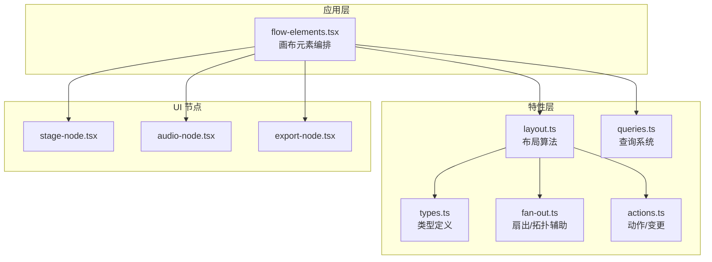
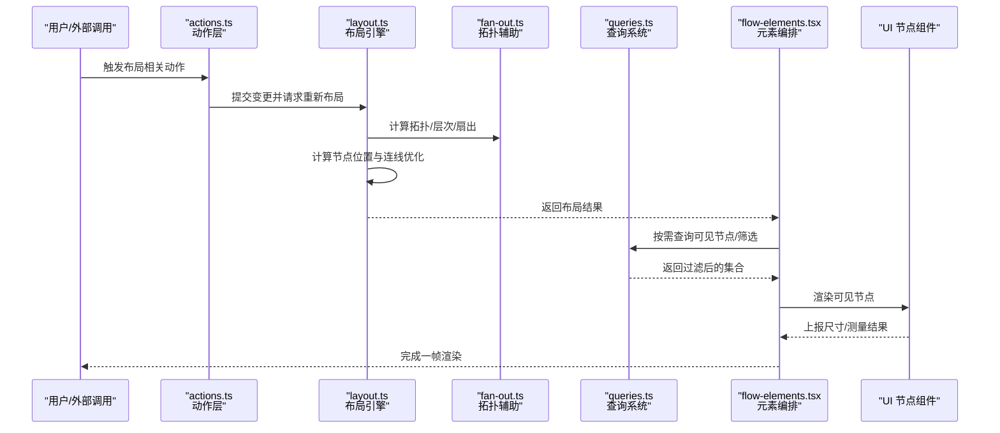
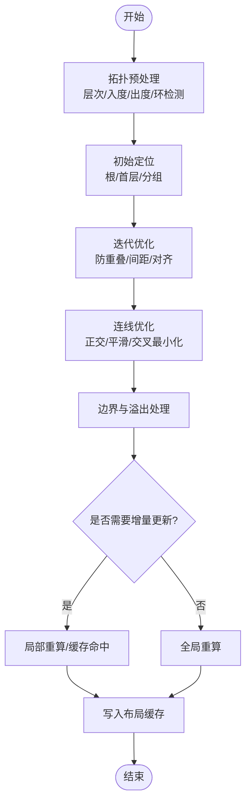
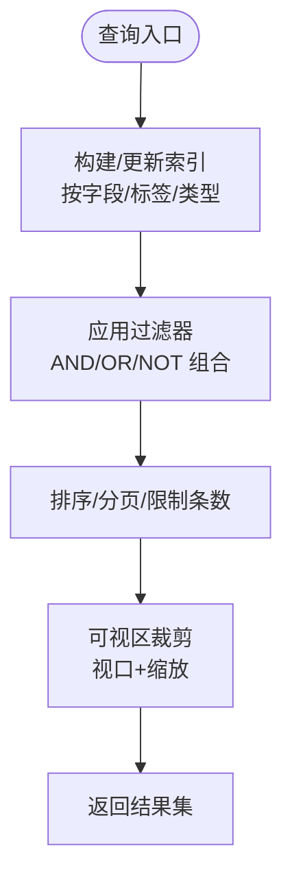
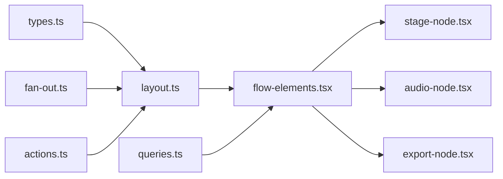

# 布局引擎

<cite>
**本文引用的文件**   
- [src/features/canvas/layout.ts](file://src/features/canvas/layout.ts)
- [src/features/canvas/queries.ts](file://src/features/canvas/queries.ts)
- [src/features/canvas/types.ts](file://src/features/canvas/types.ts)
- [src/features/canvas/fan-out.ts](file://src/features/canvas/fan-out.ts)
- [src/features/canvas/actions.ts](file://src/features/canvas/actions.ts)
- [src/app/canvas/flow-elements.tsx](file://src/app/canvas/flow-elements.tsx)
- [src/components/ui/node/stage-node.tsx](file://src/components/ui/node/stage-node.tsx)
- [src/components/ui/node/audio-node.tsx](file://src/components/ui/node/audio-node.tsx)
- [src/components/ui/node/export-node.tsx](file://src/components/ui/node/export-node.tsx)
</cite>

## 目录
1. [简介](#简介)
2. [项目结构](#项目结构)
3. [核心组件](#核心组件)
4. [架构总览](#架构总览)
5. [详细组件分析](#详细组件分析)
6. [依赖分析](#依赖分析)
7. [性能考虑](#性能考虑)
8. [故障排查指南](#故障排查指南)
9. [结论](#结论)
10. [附录](#附录)

## 简介
本技术文档聚焦于画布编辑器的布局引擎，围绕自动布局算法、响应式适配、查询系统、缓存与增量更新、虚拟滚动等关键主题展开。文档旨在帮助开发者理解节点位置计算、连线优化、空间分配策略的实现原理，并提供可操作的调优建议与排障方法。

## 项目结构
与布局引擎直接相关的代码主要分布在 features/canvas 与 app/canvas 以及 UI 节点组件中：
- features/canvas：布局算法、查询系统、类型定义、动作与扇出逻辑
- app/canvas：画布视图与元素渲染编排
- components/ui/node：具体节点类型的可视化实现（影响尺寸测量与布局）

图表来源
- [src/features/canvas/layout.ts](file://src/features/canvas/layout.ts)
- [src/features/canvas/queries.ts](file://src/features/canvas/queries.ts)
- [src/features/canvas/types.ts](file://src/features/canvas/types.ts)
- [src/features/canvas/fan-out.ts](file://src/features/canvas/fan-out.ts)
- [src/features/canvas/actions.ts](file://src/features/canvas/actions.ts)
- [src/app/canvas/flow-elements.tsx](file://src/app/canvas/flow-elements.tsx)
- [src/components/ui/node/stage-node.tsx](file://src/components/ui/node/stage-node.tsx)
- [src/components/ui/node/audio-node.tsx](file://src/components/ui/node/audio-node.tsx)
- [src/components/ui/node/export-node.tsx](file://src/components/ui/node/export-node.tsx)

章节来源
- [src/features/canvas/layout.ts](file://src/features/canvas/layout.ts)
- [src/features/canvas/queries.ts](file://src/features/canvas/queries.ts)
- [src/features/canvas/types.ts](file://src/features/canvas/types.ts)
- [src/features/canvas/fan-out.ts](file://src/features/canvas/fan-out.ts)
- [src/features/canvas/actions.ts](file://src/features/canvas/actions.ts)
- [src/app/canvas/flow-elements.tsx](file://src/app/canvas/flow-elements.tsx)
- [src/components/ui/node/stage-node.tsx](file://src/components/ui/node/stage-node.tsx)
- [src/components/ui/node/audio-node.tsx](file://src/components/ui/node/audio-node.tsx)
- [src/components/ui/node/export-node.tsx](file://src/components/ui/node/export-node.tsx)

## 核心组件
- 布局算法模块：负责节点坐标计算、层级/流向约束、间距与对齐、边界检测与溢出处理。
- 查询系统：提供基于条件的节点检索、过滤与聚合，支持索引化与增量更新。
- 类型定义：统一节点、边、布局参数、视口状态等数据结构。
- 扇出/拓扑辅助：用于计算入度/出度、层次划分、环检测等。
- 动作系统：封装布局相关变更的原子操作与撤销/重做能力。
- 画布元素编排：将布局结果映射到 React 树，驱动渲染。
- UI 节点：提供真实尺寸测量入口，供布局算法进行自适应。

章节来源
- [src/features/canvas/layout.ts](file://src/features/canvas/layout.ts)
- [src/features/canvas/queries.ts](file://src/features/canvas/queries.ts)
- [src/features/canvas/types.ts](file://src/features/canvas/types.ts)
- [src/features/canvas/fan-out.ts](file://src/features/canvas/fan-out.ts)
- [src/features/canvas/actions.ts](file://src/features/canvas/actions.ts)
- [src/app/canvas/flow-elements.tsx](file://src/app/canvas/flow-elements.tsx)
- [src/components/ui/node/stage-node.tsx](file://src/components/ui/node/stage-node.tsx)
- [src/components/ui/node/audio-node.tsx](file://src/components/ui/node/audio-node.tsx)
- [src/components/ui/node/export-node.tsx](file://src/components/ui/node/export-node.tsx)

## 架构总览
下图展示了从数据变更到布局计算再到渲染的关键路径，以及查询系统与布局系统的交互关系。

图表来源
- [src/features/canvas/actions.ts](file://src/features/canvas/actions.ts)
- [src/features/canvas/layout.ts](file://src/features/canvas/layout.ts)
- [src/features/canvas/fan-out.ts](file://src/features/canvas/fan-out.ts)
- [src/features/canvas/queries.ts](file://src/features/canvas/queries.ts)
- [src/app/canvas/flow-elements.tsx](file://src/app/canvas/flow-elements.tsx)
- [src/components/ui/node/stage-node.tsx](file://src/components/ui/node/stage-node.tsx)
- [src/components/ui/node/audio-node.tsx](file://src/components/ui/node/audio-node.tsx)
- [src/components/ui/node/export-node.tsx](file://src/components/ui/node/export-node.tsx)

## 详细组件分析

### 布局算法（layout.ts）
- 输入：节点集合、边集合、布局配置（网格、间距、方向、对齐）、视口信息（可选）。
- 输出：每个节点的最终位置、尺寸、层级；边的路径优化结果。
- 关键流程：
  - 拓扑预处理：通过 fan-out 模块计算层次、入度/出度、环检测与破环策略。
  - 初始定位：按层次或预设规则放置根节点与首层子节点。
  - 迭代优化：在满足父子连接、避免重叠、保持间距的前提下，进行多次迭代调整。
  - 连线优化：对边进行正交/曲线平滑、交叉最小化、端口选择。
  - 边界与溢出：根据视口或容器边界裁剪/平移，必要时扩展画布。
  - 增量更新：仅对受影响子树或局部区域重算，减少全局重排。
  - 缓存策略：对中间结果（如层次、度量、部分布局）进行缓存，配合失效键管理。

图表来源
- [src/features/canvas/layout.ts](file://src/features/canvas/layout.ts)
- [src/features/canvas/fan-out.ts](file://src/features/canvas/fan-out.ts)

章节来源
- [src/features/canvas/layout.ts](file://src/features/canvas/layout.ts)
- [src/features/canvas/fan-out.ts](file://src/features/canvas/fan-out.ts)

### 查询系统（queries.ts）
- 目标：高效检索节点集合，支持条件匹配、组合过滤、排序与分页。
- 设计要点：
  - 索引化：为常用字段建立倒排索引或位图索引，加速过滤。
  - 惰性求值：仅在需要时构建/更新索引，避免无谓开销。
  - 增量维护：当节点属性变化时，只更新受影响的索引条目。
  - 组合查询：将多个条件转换为交集/并集/差集操作，利用位运算或集合库优化。
  - 可视区裁剪：结合视口与缩放，提前剔除不可见节点，降低后续处理量。

图表来源
- [src/features/canvas/queries.ts](file://src/features/canvas/queries.ts)

章节来源
- [src/features/canvas/queries.ts](file://src/features/canvas/queries.ts)

### 类型定义（types.ts）
- 职责：集中定义节点、边、布局参数、视口状态、查询条件等核心类型。
- 价值：确保布局、查询、渲染各层的数据契约一致，便于缓存键设计与增量更新。

章节来源
- [src/features/canvas/types.ts](file://src/features/canvas/types.ts)

### 扇出/拓扑辅助（fan-out.ts）
- 职责：提供入度/出度统计、层次划分、环检测与破环策略、连通分量分析等。
- 用途：为布局算法提供稳定的拓扑基础，保证布局的可预测性与稳定性。

章节来源
- [src/features/canvas/fan-out.ts](file://src/features/canvas/fan-out.ts)

### 动作系统（actions.ts）
- 职责：封装布局相关变更（新增/删除/移动/重连），提供撤销/重做与批量提交。
- 与布局联动：动作触发后通知布局引擎进行增量或全局重算，并更新缓存。

章节来源
- [src/features/canvas/actions.ts](file://src/features/canvas/actions.ts)

### 画布元素编排（flow-elements.tsx）
- 职责：将布局结果映射到 React 树，组织节点与连线渲染，协调测量与更新。
- 与布局联动：接收布局结果，按需触发查询与可见性判断，驱动 UI 节点渲染。

章节来源
- [src/app/canvas/flow-elements.tsx](file://src/app/canvas/flow-elements.tsx)

### UI 节点组件（stage-node.tsx / audio-node.tsx / export-node.tsx）
- 职责：实现具体节点类型的可视化与交互，暴露尺寸测量接口供布局使用。
- 与布局联动：在首次渲染或内容变化后上报尺寸，参与布局的自适应与再计算。

章节来源
- [src/components/ui/node/stage-node.tsx](file://src/components/ui/node/stage-node.tsx)
- [src/components/ui/node/audio-node.tsx](file://src/components/ui/node/audio-node.tsx)
- [src/components/ui/node/export-node.tsx](file://src/components/ui/node/export-node.tsx)

## 依赖分析
- 内聚与耦合：
  - layout.ts 强依赖 types.ts 与 fan-out.ts，弱依赖 actions.ts 以获取变更事件。
  - queries.ts 依赖 types.ts，并与 flow-elements.tsx 协作完成可视区裁剪。
  - flow-elements.tsx 作为编排层，聚合布局与查询结果，驱动 UI 节点。
- 外部依赖点：
  - UI 节点组件的尺寸测量与交互反馈。
  - 可能的第三方几何/图算法库（若存在）用于连线优化与碰撞检测。

图表来源
- [src/features/canvas/types.ts](file://src/features/canvas/types.ts)
- [src/features/canvas/layout.ts](file://src/features/canvas/layout.ts)
- [src/features/canvas/fan-out.ts](file://src/features/canvas/fan-out.ts)
- [src/features/canvas/actions.ts](file://src/features/canvas/actions.ts)
- [src/features/canvas/queries.ts](file://src/features/canvas/queries.ts)
- [src/app/canvas/flow-elements.tsx](file://src/app/canvas/flow-elements.tsx)
- [src/components/ui/node/stage-node.tsx](file://src/components/ui/node/stage-node.tsx)
- [src/components/ui/node/audio-node.tsx](file://src/components/ui/node/audio-node.tsx)
- [src/components/ui/node/export-node.tsx](file://src/components/ui/node/export-node.tsx)

章节来源
- [src/features/canvas/types.ts](file://src/features/canvas/types.ts)
- [src/features/canvas/layout.ts](file://src/features/canvas/layout.ts)
- [src/features/canvas/fan-out.ts](file://src/features/canvas/fan-out.ts)
- [src/features/canvas/actions.ts](file://src/features/canvas/actions.ts)
- [src/features/canvas/queries.ts](file://src/features/canvas/queries.ts)
- [src/app/canvas/flow-elements.tsx](file://src/app/canvas/flow-elements.tsx)
- [src/components/ui/node/stage-node.tsx](file://src/components/ui/node/stage-node.tsx)
- [src/components/ui/node/audio-node.tsx](file://src/components/ui/node/audio-node.tsx)
- [src/components/ui/node/export-node.tsx](file://src/components/ui/node/export-node.tsx)

## 性能考虑
- 布局算法
  - 优先增量更新：仅重算受影响的子树或局部区域，避免全量重排。
  - 缓存中间结果：层次、度量、部分布局结果应缓存并按失效键清理。
  - 控制迭代次数：设置最大迭代与收敛阈值，防止长时间阻塞主线程。
  - 连线优化降维：采用启发式策略减少交叉与弯曲，避免昂贵的全局优化。
- 查询系统
  - 索引化与位图：为高频过滤字段建立索引，使用位运算加速集合操作。
  - 可视区裁剪：结合视口与缩放，尽早剔除不可见节点，减少后续处理。
  - 惰性加载：按需构建索引与结果集，避免一次性计算所有数据。
- 渲染与测量
  - 批处理测量：合并多次尺寸测量，减少回流与重绘。
  - 虚拟滚动：对大量节点列表采用窗口化渲染，仅绘制可视区域内的节点。
  - 防抖与节流：对频繁的事件（拖拽、缩放、滚动）进行节流，降低布局频率。
- 内存与并发
  - 对象池与复用：复用临时对象与数组，减少 GC 压力。
  - Web Worker：将重型计算（如大规模拓扑分析）移至后台线程。

[本节为通用性能指导，不直接分析具体文件]

## 故障排查指南
- 布局抖动或闪烁
  - 检查是否频繁触发全局重算，确认增量更新是否生效。
  - 验证缓存失效键是否正确，避免不必要的重建。
- 连线交叉严重
  - 调整连线优化策略参数，启用正交路由或交叉最小化。
  - 检查端口选择逻辑，避免固定端口导致的冲突。
- 查询结果不准确或延迟
  - 确认索引是否随数据变更同步更新。
  - 检查可视区裁剪逻辑是否与当前缩放/平移状态一致。
- 大画布卡顿
  - 启用虚拟滚动与懒加载，限制每帧渲染数量。
  - 将重型计算迁移至 Web Worker，主线程仅负责调度与渲染。

章节来源
- [src/features/canvas/layout.ts](file://src/features/canvas/layout.ts)
- [src/features/canvas/queries.ts](file://src/features/canvas/queries.ts)
- [src/app/canvas/flow-elements.tsx](file://src/app/canvas/flow-elements.tsx)

## 结论
本布局引擎通过清晰的模块化设计，将拓扑分析、位置计算、连线优化、查询与渲染解耦，结合缓存与增量更新机制，在保证正确性的同时提升性能。针对大规模画布场景，建议进一步引入虚拟滚动、Web Worker 与更精细的可视区裁剪，以获得更流畅的用户体验。

[本节为总结性内容，不直接分析具体文件]

## 附录
- 术语表
  - 拓扑：节点与边的有向图结构，包含层次、入度/出度等信息。
  - 增量更新：仅对受变更影响的局部区域进行重算，而非全量重排。
  - 可视区裁剪：根据当前视口与缩放，剔除不可见元素以减少计算与渲染。
- 参考实现路径
  - 布局算法入口与核心流程：[src/features/canvas/layout.ts](file://src/features/canvas/layout.ts)
  - 查询系统与索引维护：[src/features/canvas/queries.ts](file://src/features/canvas/queries.ts)
  - 类型契约与数据结构：[src/features/canvas/types.ts](file://src/features/canvas/types.ts)
  - 拓扑辅助与扇出分析：[src/features/canvas/fan-out.ts](file://src/features/canvas/fan-out.ts)
  - 动作与变更管理：[src/features/canvas/actions.ts](file://src/features/canvas/actions.ts)
  - 画布元素编排与渲染：[src/app/canvas/flow-elements.tsx](file://src/app/canvas/flow-elements.tsx)
  - UI 节点与尺寸测量：[src/components/ui/node/stage-node.tsx](file://src/components/ui/node/stage-node.tsx)、[src/components/ui/node/audio-node.tsx](file://src/components/ui/node/audio-node.tsx)、[src/components/ui/node/export-node.tsx](file://src/components/ui/node/export-node.tsx)