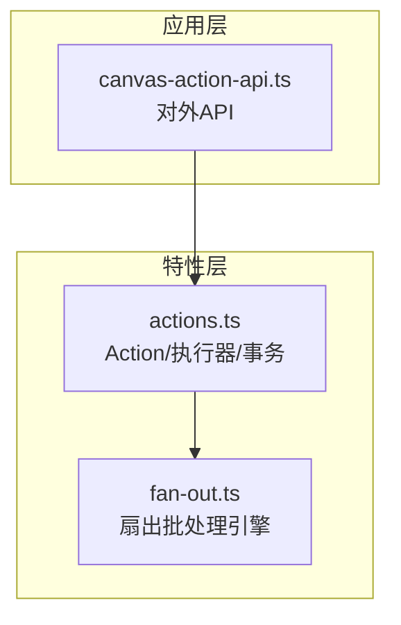
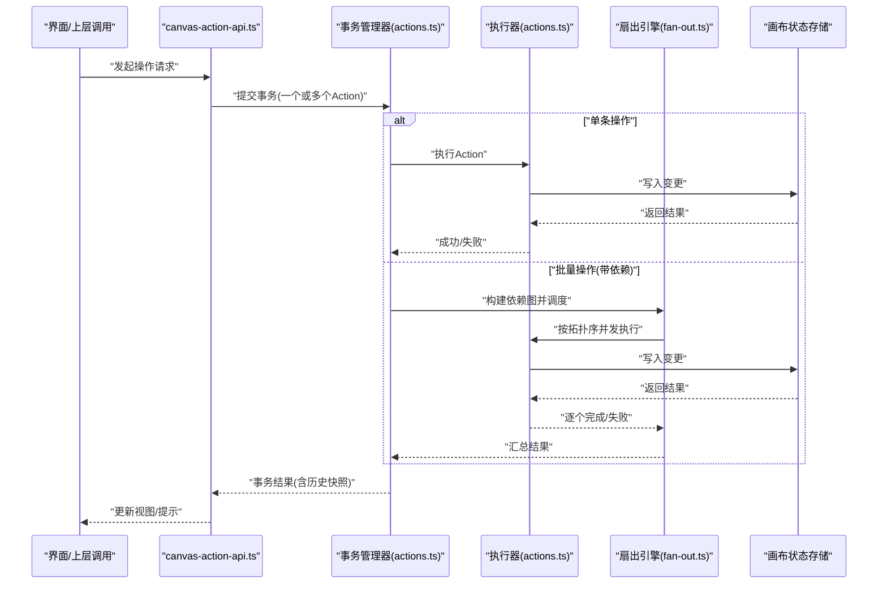
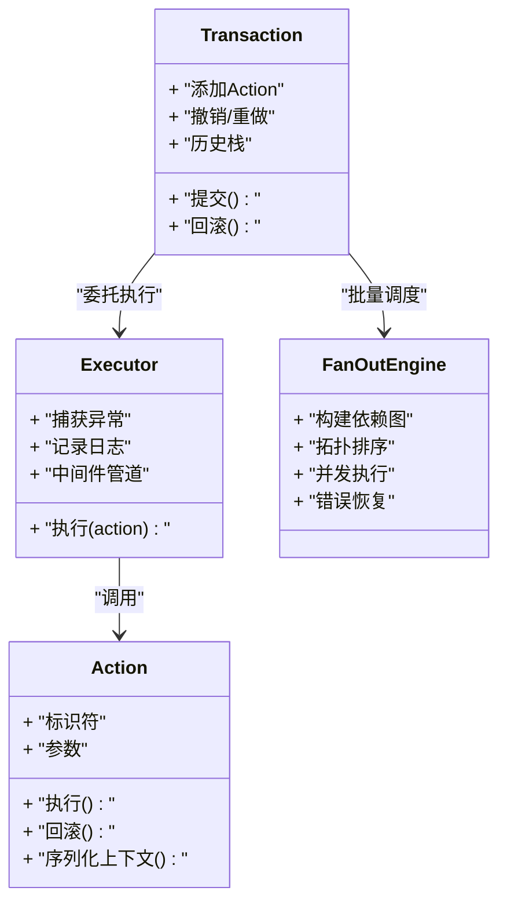
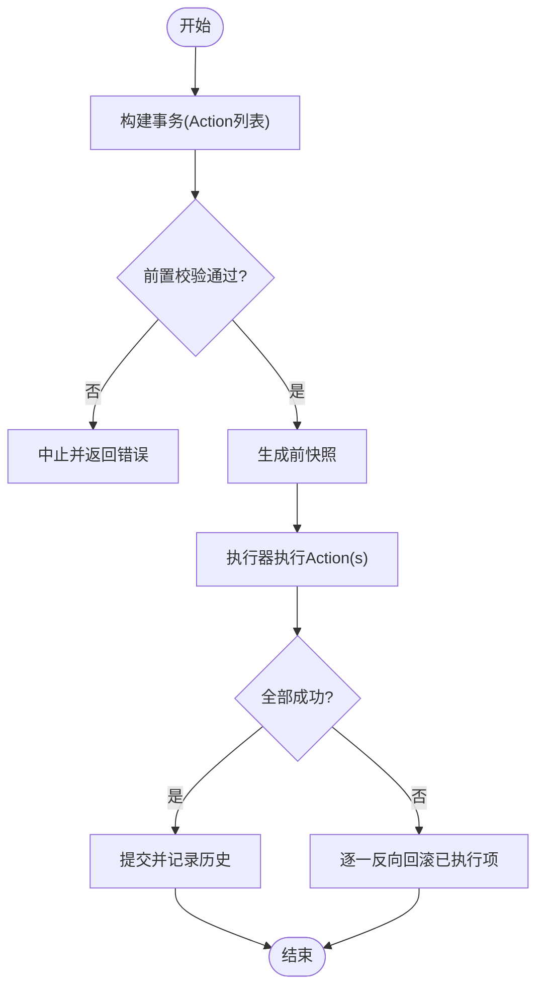
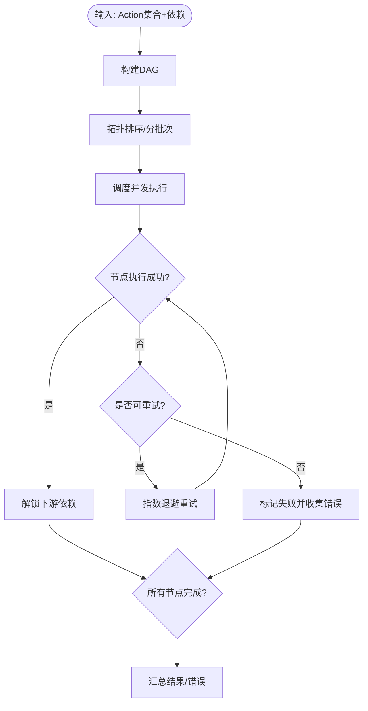
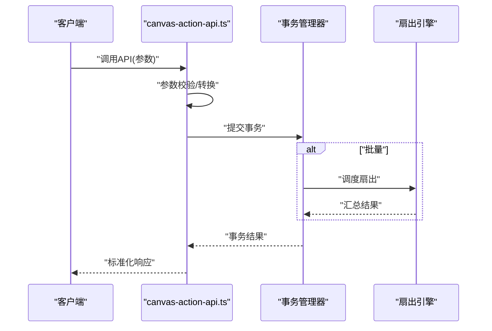
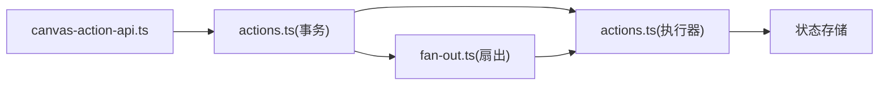

# 操作命令系统

<cite>
**本文引用的文件**   
- [src/features/canvas/actions.ts](file://src/features/canvas/actions.ts)
- [src/features/canvas/fan-out.ts](file://src/features/canvas/fan-out.ts)
- [src/app/canvas/canvas-action-api.ts](file://src/app/canvas/canvas-action-api.ts)
</cite>

## 目录
1. [简介](#简介)
2. [项目结构](#项目结构)
3. [核心组件](#核心组件)
4. [架构总览](#架构总览)
5. [详细组件分析](#详细组件分析)
6. [依赖分析](#依赖分析)
7. [性能考虑](#性能考虑)
8. [故障排查指南](#故障排查指南)
9. [结论](#结论)
10. [附录](#附录)

## 简介
本文件面向画布编辑器的“操作命令系统”，围绕基于命令模式的操作架构进行系统化说明。文档覆盖以下主题：
- Action 接口定义与执行器模式
- 事务处理机制与撤销/重做（Undo/Redo）历史栈管理、状态快照与回滚逻辑
- 扇出算法在批量操作中的应用：依赖解析、执行顺序与错误恢复
- 自定义操作的注册机制、中间件管道与性能优化策略
- 如何创建新操作类型并实现复杂业务逻辑的实践指引

## 项目结构
与操作命令系统直接相关的代码位于 features/canvas 与 app/canvas 两个层次：
- features/canvas/actions.ts：定义操作（Action）抽象、执行器与事务能力，提供撤销/重做所需的基础设施
- features/canvas/fan-out.ts：实现扇出（Fan-out）批处理引擎，支持依赖图解析、并行执行与错误恢复
- app/canvas/canvas-action-api.ts：对外暴露的 API 层，将 UI 或上层调用转换为具体操作执行请求

图表来源
- [src/app/canvas/canvas-action-api.ts](file://src/app/canvas/canvas-action-api.ts)
- [src/features/canvas/actions.ts](file://src/features/canvas/actions.ts)
- [src/features/canvas/fan-out.ts](file://src/features/canvas/fan-out.ts)

章节来源
- [src/features/canvas/actions.ts](file://src/features/canvas/actions.ts)
- [src/features/canvas/fan-out.ts](file://src/features/canvas/fan-out.ts)
- [src/app/canvas/canvas-action-api.ts](file://src/app/canvas/canvas-action-api.ts)

## 核心组件
- 操作（Action）抽象：统一描述一次可撤销/可重做的变更，包含前置校验、执行与回滚语义
- 执行器（Executor）：负责调度单个 Action 的执行，封装副作用与异常处理
- 事务（Transaction）：将多个 Action 组合为原子单元，提供提交与回滚能力，维护撤销/重做历史栈
- 扇出引擎（Fan-out）：对一组存在依赖关系的 Action 进行拓扑排序与并发执行，保证一致性与错误恢复

章节来源
- [src/features/canvas/actions.ts](file://src/features/canvas/actions.ts)
- [src/features/canvas/fan-out.ts](file://src/features/canvas/fan-out.ts)

## 架构总览
整体采用“命令模式 + 执行器 + 事务”的分层设计，UI 通过 API 层发起操作，API 层将其包装为 Action 并提交到事务管理器；事务管理器负责记录历史、维护撤销/重做栈，并在需要时触发回滚。对于批量操作，事务可委托扇出引擎进行依赖解析与并发执行。

图表来源
- [src/app/canvas/canvas-action-api.ts](file://src/app/canvas/canvas-action-api.ts)
- [src/features/canvas/actions.ts](file://src/features/canvas/actions.ts)
- [src/features/canvas/fan-out.ts](file://src/features/canvas/fan-out.ts)

## 详细组件分析

### 操作（Action）与执行器（Executor）
- 职责边界
  - Action：声明式地描述“做什么”和“如何撤销”，不包含调度细节
  - Executor：负责“何时做”、“如何做”以及异常捕获与日志记录
- 关键要点
  - 每个 Action 需提供可序列化的上下文，以便生成状态快照
  - 执行器在执行前后插入钩子，便于中间件注入（如审计、埋点、权限校验）
  - 执行器需保证幂等性，避免重复执行导致的状态不一致

图表来源
- [src/features/canvas/actions.ts](file://src/features/canvas/actions.ts)
- [src/features/canvas/fan-out.ts](file://src/features/canvas/fan-out.ts)

章节来源
- [src/features/canvas/actions.ts](file://src/features/canvas/actions.ts)

### 事务与撤销/重做（Undo/Redo）
- 历史栈管理
  - 使用双栈模型：撤销栈与重做栈
  - 每次提交成功后，将“前快照”与“后快照”推入撤销栈；撤销时将当前状态回退至前一快照并重放后续操作以重建重做栈
- 状态快照
  - 快照粒度应尽可能小，仅包含必要字段，以降低内存占用与序列化开销
  - 快照生成应在执行器中统一封装，确保一致性
- 回滚逻辑
  - 事务级回滚：若任一 Action 失败，则对所有已执行的 Action 依次调用回滚方法
  - 部分失败恢复：结合扇出引擎的错误隔离，允许非依赖分支继续执行

图表来源
- [src/features/canvas/actions.ts](file://src/features/canvas/actions.ts)

章节来源
- [src/features/canvas/actions.ts](file://src/features/canvas/actions.ts)

### 扇出算法（Fan-out）在批量操作中的应用
- 依赖解析
  - 将 Action 集合建模为有向无环图（DAG），边表示依赖关系
  - 使用拓扑排序确定执行批次，同批次内可并发执行
- 执行顺序
  - 优先满足依赖约束，再按优先级或稳定性排序
  - 支持动态扩展：运行时新增节点需重新计算拓扑序
- 错误恢复
  - 失败隔离：单个节点失败不影响其下游未就绪节点的等待
  - 重试策略：对可重试错误实施指数退避与最大重试次数限制
  - 补偿动作：对不可逆副作用提供补偿型 Action 以恢复一致性

图表来源
- [src/features/canvas/fan-out.ts](file://src/features/canvas/fan-out.ts)

章节来源
- [src/features/canvas/fan-out.ts](file://src/features/canvas/fan-out.ts)

### 自定义操作注册机制与中间件管道
- 注册机制
  - 提供统一的注册入口，将“操作类型 -> 执行器实现”映射集中管理
  - 支持版本化与别名，便于演进与兼容
- 中间件管道
  - 在执行器前后插入通用逻辑：鉴权、审计、限流、缓存命中检查、指标上报
  - 中间件可短路执行流程，提前返回结果或抛出错误
- 最佳实践
  - 将副作用最小化，尽量在中间件中完成纯函数式校验
  - 对耗时操作引入异步队列与背压控制

章节来源
- [src/features/canvas/actions.ts](file://src/features/canvas/actions.ts)

### 对外 API 层（canvas-action-api.ts）
- 职责
  - 接收上层调用，将业务参数转换为 Action
  - 选择单条或批量路径，必要时委托扇出引擎
  - 统一错误码与响应格式，屏蔽内部实现细节
- 典型流程
  - 参数校验 -> 构造 Action -> 提交事务 -> 返回结果/错误

图表来源
- [src/app/canvas/canvas-action-api.ts](file://src/app/canvas/canvas-action-api.ts)
- [src/features/canvas/actions.ts](file://src/features/canvas/actions.ts)
- [src/features/canvas/fan-out.ts](file://src/features/canvas/fan-out.ts)

章节来源
- [src/app/canvas/canvas-action-api.ts](file://src/app/canvas/canvas-action-api.ts)

## 依赖分析
- 模块耦合
  - API 层仅依赖事务与扇出引擎的公开接口，保持低耦合
  - 事务对执行器与扇出引擎存在强依赖，但通过接口抽象降低侵入性
- 外部依赖
  - 状态存储：读写画布状态，需保证原子性与一致性
  - 日志/监控：用于追踪执行链路、性能指标与错误定位

图表来源
- [src/app/canvas/canvas-action-api.ts](file://src/app/canvas/canvas-action-api.ts)
- [src/features/canvas/actions.ts](file://src/features/canvas/actions.ts)
- [src/features/canvas/fan-out.ts](file://src/features/canvas/fan-out.ts)

章节来源
- [src/app/canvas/canvas-action-api.ts](file://src/app/canvas/canvas-action-api.ts)
- [src/features/canvas/actions.ts](file://src/features/canvas/actions.ts)
- [src/features/canvas/fan-out.ts](file://src/features/canvas/fan-out.ts)

## 性能考虑
- 快照优化
  - 增量快照：仅记录差异字段，减少序列化与内存占用
  - 延迟快照：仅在需要撤销时生成，避免不必要的开销
- 并发控制
  - 扇出引擎设置最大并发度，防止资源争用
  - 对 I/O 密集型操作使用异步队列与背压
- 中间件裁剪
  - 在生产环境关闭冗余中间件，按需开启审计与监控
- 批处理合并
  - 高频短操作合并为批量事务，减少历史栈膨胀与渲染抖动

[本节为通用指导，不直接分析具体文件]

## 故障排查指南
- 常见问题
  - 撤销/重做失效：检查快照生成时机与内容完整性
  - 死锁或饥饿：确认依赖图无环且拓扑排序正确
  - 部分失败：查看扇出引擎的错误聚合与重试策略
- 诊断手段
  - 启用执行链路日志，记录 Action 标识、参数与耗时
  - 对关键路径增加埋点，观察吞吐与错误率
  - 使用最小复现用例验证依赖图与回滚逻辑

章节来源
- [src/features/canvas/actions.ts](file://src/features/canvas/actions.ts)
- [src/features/canvas/fan-out.ts](file://src/features/canvas/fan-out.ts)

## 结论
本系统通过命令模式、执行器与事务的组合，提供了稳定可靠的撤销/重做能力；借助扇出引擎，批量操作具备高并发与容错优势。配合注册机制与中间件管道，系统具备良好的可扩展性与可观测性。建议在实际落地中重视快照粒度、并发上限与错误恢复策略，以获得更优的性能与稳定性。

[本节为总结性内容，不直接分析具体文件]

## 附录
- 创建新操作类型的步骤
  - 定义 Action 结构与参数
  - 实现执行器：包含执行与回滚逻辑
  - 注册到操作表，配置中间件
  - 在 API 层暴露调用入口
- 实现复杂业务逻辑的建议
  - 将复杂逻辑拆分为多个细粒度 Action，提升可测试性与可维护性
  - 利用扇出引擎表达依赖关系，合理划分并发批次
  - 对不可逆操作提供补偿 Action，确保最终一致性

[本节为概念性指导，不直接分析具体文件]