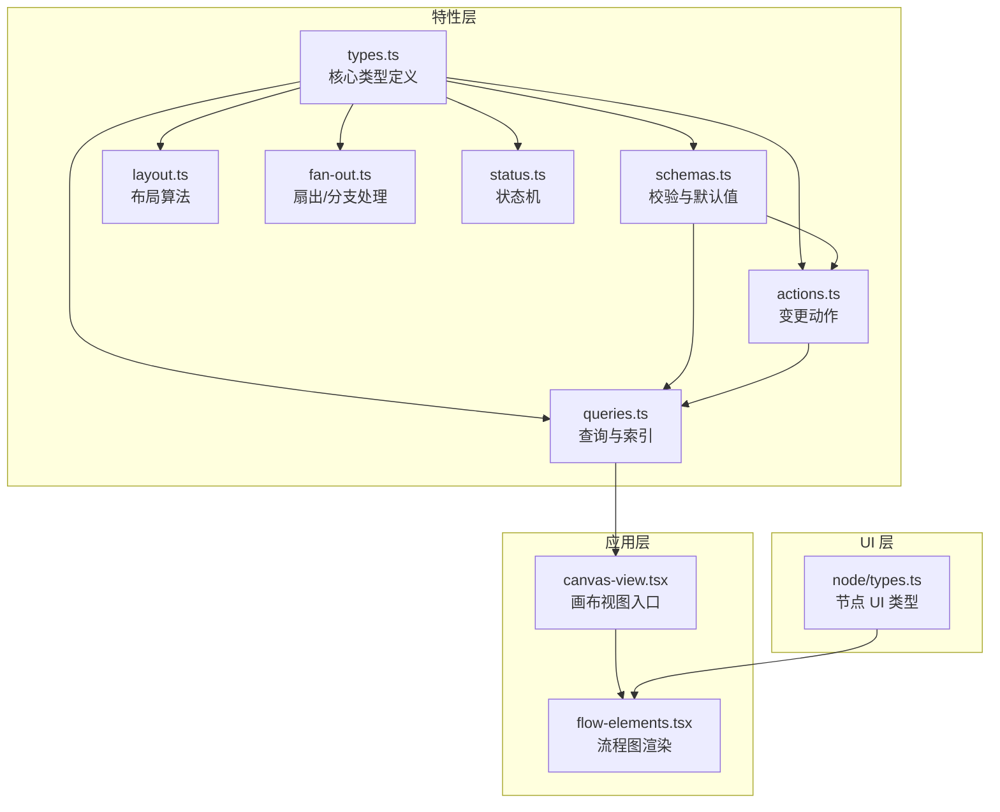
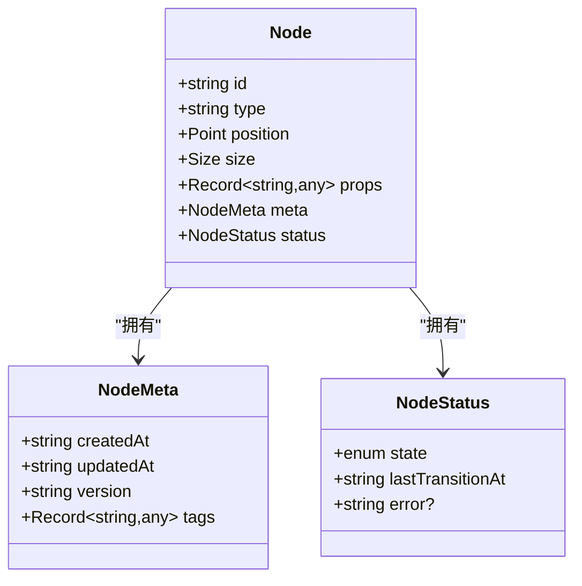
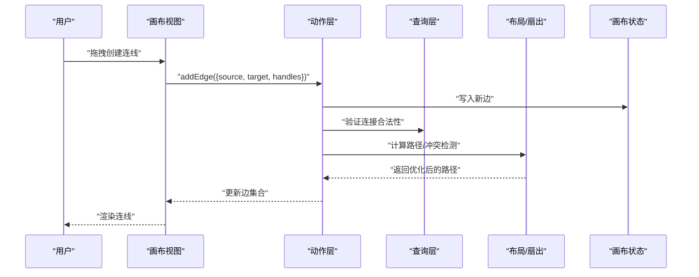
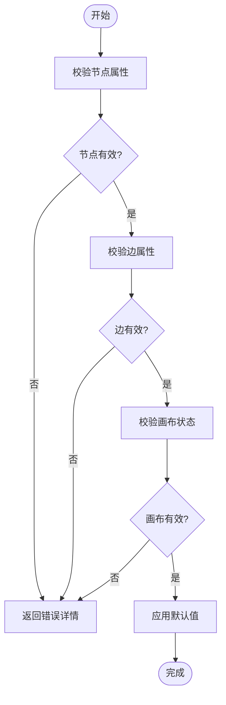
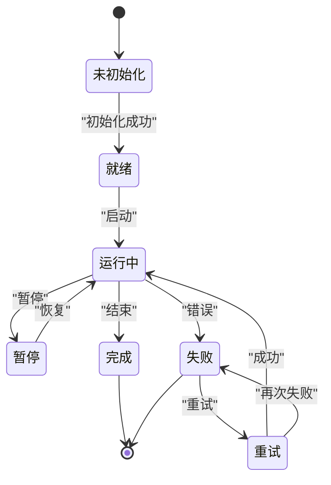
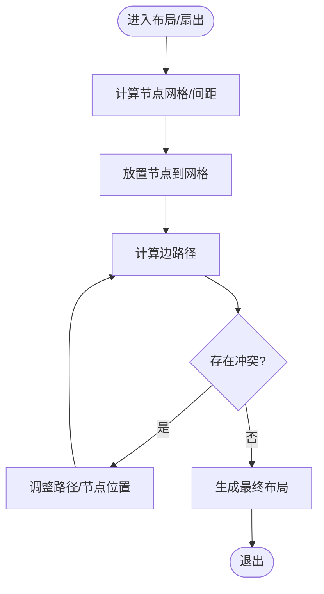
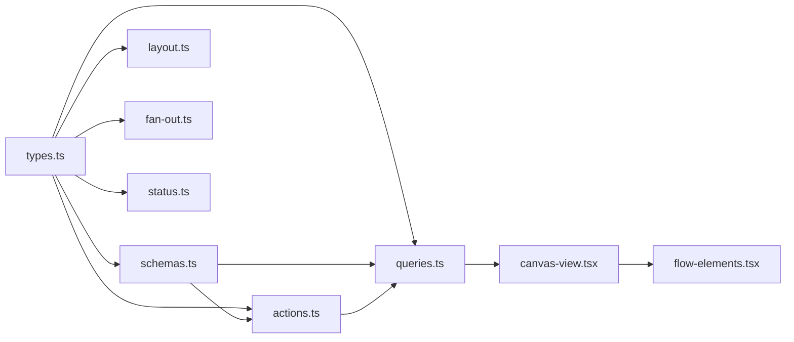

# 数据模型设计

<cite>
**本文引用的文件**   
- [src/features/canvas/types.ts](file://src/features/canvas/types.ts)
- [src/features/canvas/schemas.ts](file://src/features/canvas/schemas.ts)
- [src/features/canvas/actions.ts](file://src/features/canvas/actions.ts)
- [src/features/canvas/queries.ts](file://src/features/canvas/queries.ts)
- [src/features/canvas/layout.ts](file://src/features/canvas/layout.ts)
- [src/features/canvas/fan-out.ts](file://src/features/canvas/fan-out.ts)
- [src/features/canvas/status.ts](file://src/features/canvas/status.ts)
- [src/app/canvas/canvas-view.tsx](file://src/app/canvas/canvas-view.tsx)
- [src/app/canvas/flow-elements.tsx](file://src/app/canvas/flow-elements.tsx)
- [src/components/ui/node/types.ts](file://src/components/ui/node/types.ts)
</cite>

## 目录
1. [简介](#简介)
2. [项目结构](#项目结构)
3. [核心组件](#核心组件)
4. [架构总览](#架构总览)
5. [详细组件分析](#详细组件分析)
6. [依赖关系分析](#依赖关系分析)
7. [性能考量](#性能考量)
8. [故障排查指南](#故障排查指南)
9. [结论](#结论)
10. [附录](#附录)

## 简介
本文件聚焦于画布编辑器的数据模型设计与实现，围绕节点类型系统、连线关系、状态管理、版本控制与持久化策略展开。文档以 TypeScript 接口与校验规则为核心，解释 Node、Edge、CanvasState 等关键概念的职责边界、字段语义、约束与默认值，并给出连接点定位、路径计算与冲突检测的实现思路与流程。同时提供面向开发者的最佳实践与常见问题排查建议。

## 项目结构
画布相关的数据模型与行为主要分布在 features/canvas 与 app/canvas、components/ui/node 三个层次：
- features/canvas：定义核心类型、校验 Schema、查询与动作、布局与扇出算法、状态机与工具函数
- app/canvas：页面级视图与交互入口，消费上述模型与能力
- components/ui/node：节点 UI 的通用类型与展示逻辑

图表来源
- [src/features/canvas/types.ts](file://src/features/canvas/types.ts)
- [src/features/canvas/schemas.ts](file://src/features/canvas/schemas.ts)
- [src/features/canvas/actions.ts](file://src/features/canvas/actions.ts)
- [src/features/canvas/queries.ts](file://src/features/canvas/queries.ts)
- [src/features/canvas/layout.ts](file://src/features/canvas/layout.ts)
- [src/features/canvas/fan-out.ts](file://src/features/canvas/fan-out.ts)
- [src/features/canvas/status.ts](file://src/features/canvas/status.ts)
- [src/app/canvas/canvas-view.tsx](file://src/app/canvas/canvas-view.tsx)
- [src/app/canvas/flow-elements.tsx](file://src/app/canvas/flow-elements.tsx)
- [src/components/ui/node/types.ts](file://src/components/ui/node/types.ts)

章节来源
- [src/features/canvas/types.ts](file://src/features/canvas/types.ts)
- [src/features/canvas/schemas.ts](file://src/features/canvas/schemas.ts)
- [src/features/canvas/actions.ts](file://src/features/canvas/actions.ts)
- [src/features/canvas/queries.ts](file://src/features/canvas/queries.ts)
- [src/features/canvas/layout.ts](file://src/features/canvas/layout.ts)
- [src/features/canvas/fan-out.ts](file://src/features/canvas/fan-out.ts)
- [src/features/canvas/status.ts](file://src/features/canvas/status.ts)
- [src/app/canvas/canvas-view.tsx](file://src/app/canvas/canvas-view.tsx)
- [src/app/canvas/flow-elements.tsx](file://src/app/canvas/flow-elements.tsx)
- [src/components/ui/node/types.ts](file://src/components/ui/node/types.ts)

## 核心组件
本节概述数据模型的关键抽象与职责划分：
- 节点（Node）：表示画布上的可编辑实体，包含标识、类型、位置、尺寸、属性、元数据与状态等
- 边（Edge）：表示节点间的连接关系，包含源/目标节点、连接点、路径与样式等
- 画布状态（CanvasState）：聚合节点集合、边集合、选中态、缩放平移、历史记录与版本信息
- 校验与默认值（Schemas）：基于运行时校验库对节点/边/画布数据进行强约束与默认值填充
- 查询与索引（Queries）：提供按类型、标签、连接关系的快速检索
- 动作（Actions）：封装增删改查与批量操作，保证一致性
- 布局与扇出（Layout/Fan-out）：自动排列与分支扩散算法
- 状态机（Status）：节点生命周期与执行状态管理

章节来源
- [src/features/canvas/types.ts](file://src/features/canvas/types.ts)
- [src/features/canvas/schemas.ts](file://src/features/canvas/schemas.ts)
- [src/features/canvas/queries.ts](file://src/features/canvas/queries.ts)
- [src/features/canvas/actions.ts](file://src/features/canvas/actions.ts)
- [src/features/canvas/layout.ts](file://src/features/canvas/layout.ts)
- [src/features/canvas/fan-out.ts](file://src/features/canvas/fan-out.ts)
- [src/features/canvas/status.ts](file://src/features/canvas/status.ts)

## 架构总览
下图展示了数据模型在系统中的分层与交互方式：类型与校验为基石，动作驱动状态变更，查询提供高效访问，布局与扇出负责可视化编排，状态机保障节点运行期语义。

```mermaid
classDiagram
class Node {
+id : string
+type : string
+position : Point
+size : Size
+props : Record<string, any>
+meta : NodeMeta
+status : NodeStatus
}
class Edge {
+id : string
+sourceNodeId : string
+targetNodeId : string
+sourceHandleId? : string
+targetHandleId? : string
+path : Path
+style : EdgeStyle
}
class CanvasState {
+nodes : Node[]
+edges : Edge[]
+selection : Selection
+viewport : Viewport
+history : History
+version : Version
}
class Schemas {
+validateNode(node)
+validateEdge(edge)
+validateCanvas(state)
}
class Actions {
+addNode()
+updateNode()
+removeNode()
+addEdge()
+updateEdge()
+removeEdge()
}
class Queries {
+getNodesByType()
+getEdgesByNode()
+findConnectedComponents()
}
class Layout {
+autoArrange()
+computeGrid()
}
class FanOut {
+expandBranches()
+resolveConflicts()
}
class Status {
+transition(node, next)
+isTerminal()
}
CanvasState --> Node : "包含"
CanvasState --> Edge : "包含"
Actions --> CanvasState : "修改"
Queries --> CanvasState : "读取"
Schemas --> Node : "校验"
Schemas --> Edge : "校验"
Schemas --> CanvasState : "校验"
Layout --> CanvasState : "重排"
FanOut --> CanvasState : "扩展/冲突"
Status --> Node : "状态机"
```

图表来源
- [src/features/canvas/types.ts](file://src/features/canvas/types.ts)
- [src/features/canvas/schemas.ts](file://src/features/canvas/schemas.ts)
- [src/features/canvas/actions.ts](file://src/features/canvas/actions.ts)
- [src/features/canvas/queries.ts](file://src/features/canvas/queries.ts)
- [src/features/canvas/layout.ts](file://src/features/canvas/layout.ts)
- [src/features/canvas/fan-out.ts](file://src/features/canvas/fan-out.ts)
- [src/features/canvas/status.ts](file://src/features/canvas/status.ts)

## 详细组件分析

### 节点类型系统与接口定义
- 节点类型系统通过统一的 Node 抽象表达所有具体节点，使用 type 字段区分不同业务节点（如镜头、舞台、音频、导出等）。
- 节点属性 props 采用可扩展的键值结构，配合 schemas 进行强类型校验与默认值注入。
- 节点元数据 meta 用于存储非可视化的辅助信息（如创建时间、版本、权限等）。
- 节点状态 status 由状态机驱动，确保状态迁移合法且可追踪。

图表来源
- [src/features/canvas/types.ts](file://src/features/canvas/types.ts)
- [src/components/ui/node/types.ts](file://src/components/ui/node/types.ts)

章节来源
- [src/features/canvas/types.ts](file://src/features/canvas/types.ts)
- [src/components/ui/node/types.ts](file://src/components/ui/node/types.ts)

### 连线关系数据结构与连接点
- 边 Edge 描述两个节点之间的连接，包含源/目标节点 ID、可选的连接点 handle ID、路径与样式。
- 连接点定位通常基于节点的输入/输出端口坐标，结合节点位置与尺寸计算得出。
- 路径计算支持直线、折线或贝塞尔曲线，需考虑遮挡与重叠优化。
- 冲突检测用于避免多条边交叉导致的视觉混乱，必要时自动调整路径或提示用户。

图表来源
- [src/features/canvas/actions.ts](file://src/features/canvas/actions.ts)
- [src/features/canvas/queries.ts](file://src/features/canvas/queries.ts)
- [src/features/canvas/layout.ts](file://src/features/canvas/layout.ts)
- [src/features/canvas/fan-out.ts](file://src/features/canvas/fan-out.ts)
- [src/app/canvas/canvas-view.tsx](file://src/app/canvas/canvas-view.tsx)

章节来源
- [src/features/canvas/types.ts](file://src/features/canvas/types.ts)
- [src/features/canvas/actions.ts](file://src/features/canvas/actions.ts)
- [src/features/canvas/queries.ts](file://src/features/canvas/queries.ts)
- [src/features/canvas/layout.ts](file://src/features/canvas/layout.ts)
- [src/features/canvas/fan-out.ts](file://src/features/canvas/fan-out.ts)
- [src/app/canvas/canvas-view.tsx](file://src/app/canvas/canvas-view.tsx)

### 节点属性验证规则、数据类型约束与默认值
- 校验规则集中在 schemas 模块，针对 Node、Edge、CanvasState 分别定义字段类型、必填项、取值范围与自定义断言。
- 默认值设置确保新增节点/边具备一致的初始状态，减少空指针与异常分支。
- 校验失败时返回结构化错误信息，便于前端提示与回滚。

图表来源
- [src/features/canvas/schemas.ts](file://src/features/canvas/schemas.ts)

章节来源
- [src/features/canvas/schemas.ts](file://src/features/canvas/schemas.ts)

### 节点状态管理与状态机
- 节点状态由状态机管理，定义允许的状态集合与迁移规则。
- 状态迁移需满足前置条件，并在迁移时记录时间与错误信息。
- 终端状态不可再迁移，防止非法流转。

图表来源
- [src/features/canvas/status.ts](file://src/features/canvas/status.ts)

章节来源
- [src/features/canvas/status.ts](file://src/features/canvas/status.ts)

### 布局算法与扇出处理
- 布局算法负责自动排列节点，提升可读性与空间利用率。
- 扇出处理用于分支扩散与冲突解决，避免边交叉与节点重叠。
- 布局与扇出均基于当前画布状态进行计算，并可被动作触发。

图表来源
- [src/features/canvas/layout.ts](file://src/features/canvas/layout.ts)
- [src/features/canvas/fan-out.ts](file://src/features/canvas/fan-out.ts)

章节来源
- [src/features/canvas/layout.ts](file://src/features/canvas/layout.ts)
- [src/features/canvas/fan-out.ts](file://src/features/canvas/fan-out.ts)

### 查询与索引
- 查询层提供按类型、标签、连接关系的高效检索，内部维护索引以提升性能。
- 常用查询包括：按类型获取节点、按节点获取关联边、查找连通分量等。
- 查询结果应保持稳定且幂等，便于缓存与复用。

章节来源
- [src/features/canvas/queries.ts](file://src/features/canvas/queries.ts)

### 动作与一致性
- 动作层封装所有变更操作，确保原子性与一致性。
- 每个动作在执行前进行校验，执行后更新索引与历史。
- 支持撤销/重做，通过历史栈记录变更快照。

章节来源
- [src/features/canvas/actions.ts](file://src/features/canvas/actions.ts)

### 视图与渲染
- 视图层消费画布状态与查询结果，渲染节点与边。
- 流程图渲染根据节点类型选择对应 UI 组件，并响应交互事件。
- 视图不直接修改状态，而是派发动作。

章节来源
- [src/app/canvas/canvas-view.tsx](file://src/app/canvas/canvas-view.tsx)
- [src/app/canvas/flow-elements.tsx](file://src/app/canvas/flow-elements.tsx)

## 依赖关系分析
- 类型与校验为底层依赖，被动作、查询、布局、扇出与状态机共同引用。
- 动作依赖查询与校验，确保变更前后数据一致。
- 视图依赖动作与查询，保持单向数据流。
- 布局与扇出依赖类型与状态，提供可视化层面的增强能力。

图表来源
- [src/features/canvas/types.ts](file://src/features/canvas/types.ts)
- [src/features/canvas/schemas.ts](file://src/features/canvas/schemas.ts)
- [src/features/canvas/actions.ts](file://src/features/canvas/actions.ts)
- [src/features/canvas/queries.ts](file://src/features/canvas/queries.ts)
- [src/features/canvas/layout.ts](file://src/features/canvas/layout.ts)
- [src/features/canvas/fan-out.ts](file://src/features/canvas/fan-out.ts)
- [src/features/canvas/status.ts](file://src/features/canvas/status.ts)
- [src/app/canvas/canvas-view.tsx](file://src/app/canvas/canvas-view.tsx)
- [src/app/canvas/flow-elements.tsx](file://src/app/canvas/flow-elements.tsx)

章节来源
- [src/features/canvas/types.ts](file://src/features/canvas/types.ts)
- [src/features/canvas/schemas.ts](file://src/features/canvas/schemas.ts)
- [src/features/canvas/actions.ts](file://src/features/canvas/actions.ts)
- [src/features/canvas/queries.ts](file://src/features/canvas/queries.ts)
- [src/features/canvas/layout.ts](file://src/features/canvas/layout.ts)
- [src/features/canvas/fan-out.ts](file://src/features/canvas/fan-out.ts)
- [src/features/canvas/status.ts](file://src/features/canvas/status.ts)
- [src/app/canvas/canvas-view.tsx](file://src/app/canvas/canvas-view.tsx)
- [src/app/canvas/flow-elements.tsx](file://src/app/canvas/flow-elements.tsx)

## 性能考量
- 查询层应维护索引，避免全量扫描；对热点查询结果进行缓存。
- 布局与扇出计算复杂度较高，建议在增量更新场景下局部重算。
- 大画布渲染时按需加载节点与边，减少一次性绘制开销。
- 动作合并与批处理可减少状态更新频率，提高交互流畅度。

## 故障排查指南
- 校验失败：检查 schemas 中的字段约束与默认值，确认输入数据是否符合预期。
- 连接冲突：查看 fan-out 与 layout 的路径计算逻辑，必要时调整节点位置或边样式。
- 状态迁移异常：核对状态机的迁移规则与前置条件，确认当前状态是否允许目标迁移。
- 性能问题：分析查询与渲染路径，评估是否需要引入分页、虚拟化或增量更新。

章节来源
- [src/features/canvas/schemas.ts](file://src/features/canvas/schemas.ts)
- [src/features/canvas/layout.ts](file://src/features/canvas/layout.ts)
- [src/features/canvas/fan-out.ts](file://src/features/canvas/fan-out.ts)
- [src/features/canvas/status.ts](file://src/features/canvas/status.ts)

## 结论
本数据模型以类型与校验为基础，通过动作驱动状态变更，查询提供高效访问，布局与扇出增强可视化体验，状态机保障运行期语义。整体设计强调一致性、可扩展性与性能，适合复杂画布编辑场景。后续可在版本控制与持久化方面进一步完善，以满足多端同步与离线协作需求。

## 附录
- 版本控制与数据持久化策略（概念性说明）
  - 版本控制：为每次变更生成版本号与差异快照，支持撤销/重做与回溯对比
  - 持久化：将画布状态序列化为 JSON 或二进制格式，定期落盘并提供增量同步
  - 冲突解决：基于操作转换或最后写入获胜策略，结合用户意图提示

[本节为概念性内容，不涉及具体源码文件]