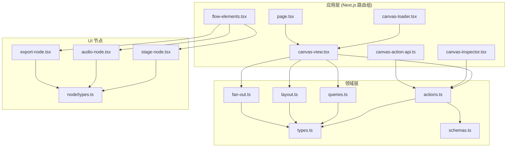
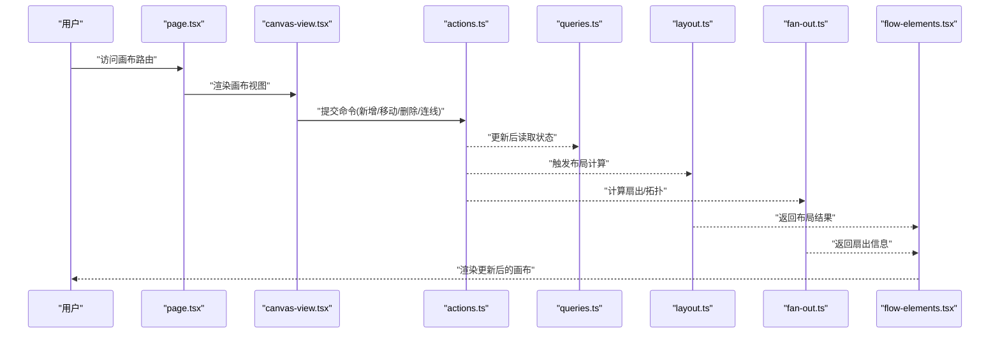
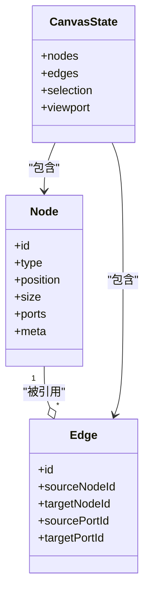
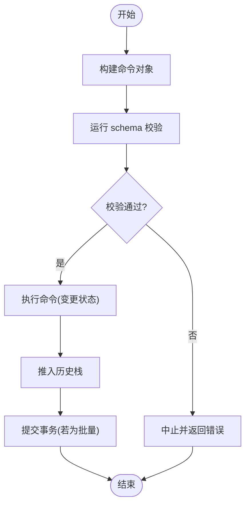
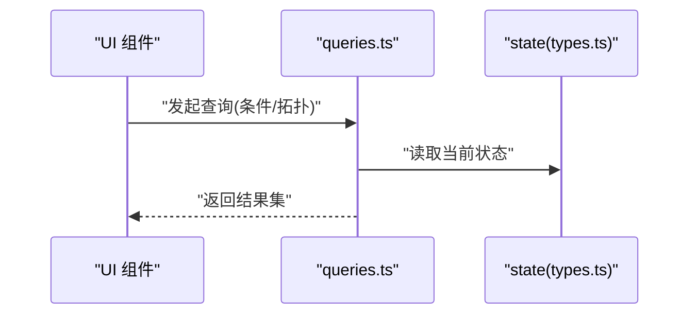
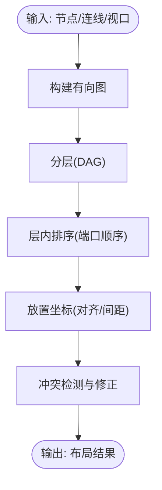
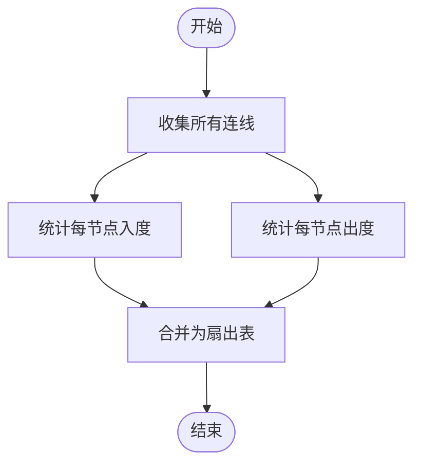
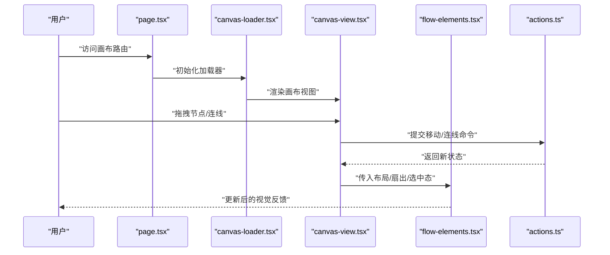
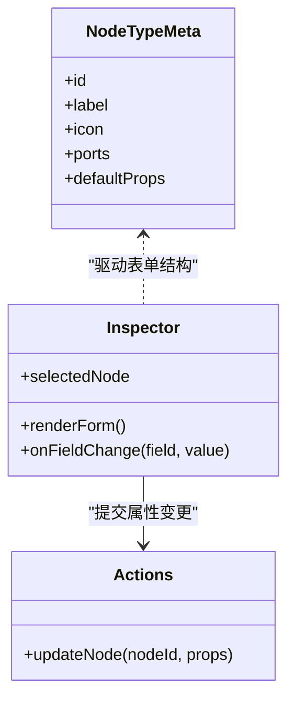
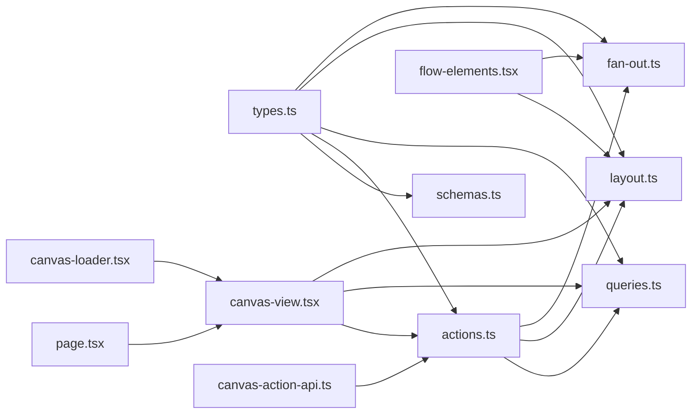

# 画布编辑器设计

<cite>
**本文引用的文件**   
- [src/features/canvas/types.ts](file://src/features/canvas/types.ts)
- [src/features/canvas/schemas.ts](file://src/features/canvas/schemas.ts)
- [src/features/canvas/actions.ts](file://src/features/canvas/actions.ts)
- [src/features/canvas/queries.ts](file://src/features/canvas/queries.ts)
- [src/features/canvas/layout.ts](file://src/features/canvas/layout.ts)
- [src/features/canvas/fan-out.ts](file://src/features/canvas/fan-out.ts)
- [src/app/(app)/canvas/canvas-view.tsx](file://src/app/(app)/canvas/canvas-view.tsx)
- [src/app/(app)/canvas/canvas-inspector.tsx](file://src/app/(app)/canvas/canvas-inspector.tsx)
- [src/app/(app)/canvas/canvas-loader.tsx](file://src/app/(app)/canvas/canvas-loader.tsx)
- [src/app/(app)/canvas/flow-elements.tsx](file://src/app/(app)/canvas/flow-elements.tsx)
- [src/app/(app)/canvas/page.tsx](file://src/app/(app)/canvas/page.tsx)
- [src/app/(app)/canvas/canvas-action-api.ts](file://src/app/(app)/canvas/canvas-action-api.ts)
- [src/components/ui/node/stage-node.tsx](file://src/components/ui/node/stage-node.tsx)
- [src/components/ui/node/audio-node.tsx](file://src/components/ui/node/audio-node.tsx)
- [src/components/ui/node/export-node.tsx](file://src/components/ui/node/export-node.tsx)
- [src/components/ui/node/types.ts](file://src/components/ui/node/types.ts)
</cite>

## 更新摘要
**所做更改**   
- 更新了所有应用层文件路径引用，从 `src/app/canvas/` 迁移到 `src/app/(app)/canvas/`
- 反映了 Next.js 路由组结构的重构，功能保持不变
- 更新了架构图和依赖关系图以反映新的文件组织结构
- 保持了领域层（features/canvas）和 UI 组件层（components/ui/node）的原有路径不变

## 目录
1. [简介](#简介)
2. [项目结构](#项目结构)
3. [核心组件](#核心组件)
4. [架构总览](#架构总览)
5. [详细组件分析](#详细组件分析)
6. [依赖关系分析](#依赖关系分析)
7. [性能考虑](#性能考虑)
8. [故障排查指南](#故障排查指南)
9. [结论](#结论)
10. [附录](#附录)

## 简介
本设计文档面向 CodeVideoCanvas 的画布编辑器，聚焦可视化编辑器的整体架构与关键实现：节点系统的数据模型、连线关系管理、布局算法、命令模式驱动的 CanvasActions（含撤销重做与事务）、查询系统的检索与过滤、以及节点类型扩展机制与属性面板绑定。文档同时提供可操作的示例路径，帮助读者快速创建自定义节点类型并实现交互逻辑。

## 项目结构
画布编辑器经过路由组重构后，位于以下三大区域：
- src/features/canvas：领域层，包含数据模型、动作系统、查询、布局与扇出计算等纯逻辑模块。
- src/app/(app)/canvas：应用层，负责页面装配、视图渲染、侧边栏与检查器等 UI 编排，现已纳入 Next.js 路由组结构。
- src/components/ui/node：具体节点类型的 UI 实现与类型定义。

图表来源
- [src/app/(app)/canvas/canvas-view.tsx](file://src/app/(app)/canvas/canvas-view.tsx)
- [src/app/(app)/canvas/canvas-inspector.tsx](file://src/app/(app)/canvas/canvas-inspector.tsx)
- [src/app/(app)/canvas/canvas-loader.tsx](file://src/app/(app)/canvas/canvas-loader.tsx)
- [src/app/(app)/canvas/flow-elements.tsx](file://src/app/(app)/canvas/flow-elements.tsx)
- [src/app/(app)/canvas/page.tsx](file://src/app/(app)/canvas/page.tsx)
- [src/app/(app)/canvas/canvas-action-api.ts](file://src/app/(app)/canvas/canvas-action-api.ts)
- [src/features/canvas/types.ts](file://src/features/canvas/types.ts)
- [src/features/canvas/schemas.ts](file://src/features/canvas/schemas.ts)
- [src/features/canvas/actions.ts](file://src/features/canvas/actions.ts)
- [src/features/canvas/queries.ts](file://src/features/canvas/queries.ts)
- [src/features/canvas/layout.ts](file://src/features/canvas/layout.ts)
- [src/features/canvas/fan-out.ts](file://src/features/canvas/fan-out.ts)
- [src/components/ui/node/stage-node.tsx](file://src/components/ui/node/stage-node.tsx)
- [src/components/ui/node/audio-node.tsx](file://src/components/ui/node/audio-node.tsx)
- [src/components/ui/node/export-node.tsx](file://src/components/ui/node/export-node.tsx)
- [src/components/ui/node/types.ts](file://src/components/ui/node/types.ts)

章节来源
- [src/app/(app)/canvas/canvas-view.tsx](file://src/app/(app)/canvas/canvas-view.tsx)
- [src/app/(app)/canvas/canvas-inspector.tsx](file://src/app/(app)/canvas/canvas-inspector.tsx)
- [src/app/(app)/canvas/canvas-loader.tsx](file://src/app/(app)/canvas/canvas-loader.tsx)
- [src/app/(app)/canvas/flow-elements.tsx](file://src/app/(app)/canvas/flow-elements.tsx)
- [src/app/(app)/canvas/page.tsx](file://src/app/(app)/canvas/page.tsx)
- [src/app/(app)/canvas/canvas-action-api.ts](file://src/app/(app)/canvas/canvas-action-api.ts)
- [src/features/canvas/types.ts](file://src/features/canvas/types.ts)
- [src/features/canvas/schemas.ts](file://src/features/canvas/schemas.ts)
- [src/features/canvas/actions.ts](file://src/features/canvas/actions.ts)
- [src/features/canvas/queries.ts](file://src/features/canvas/queries.ts)
- [src/features/canvas/layout.ts](file://src/features/canvas/layout.ts)
- [src/features/canvas/fan-out.ts](file://src/features/canvas/fan-out.ts)
- [src/components/ui/node/stage-node.tsx](file://src/components/ui/node/stage-node.tsx)
- [src/components/ui/node/audio-node.tsx](file://src/components/ui/node/audio-node.tsx)
- [src/components/ui/node/export-node.tsx](file://src/components/ui/node/export-node.tsx)
- [src/components/ui/node/types.ts](file://src/components/ui/node/types.ts)

## 核心组件
- 数据模型与校验
  - types.ts：定义节点、连线、画布状态等核心数据结构。
  - schemas.ts：基于运行时校验的字段约束与默认值，确保数据一致性。
- 操作与事务
  - actions.ts：以命令模式封装所有画布变更，支持批量事务、撤销/重做栈。
- 查询与过滤
  - queries.ts：提供对节点集合、连线拓扑、筛选条件的便捷查询接口。
- 布局引擎
  - layout.ts：根据节点类型与连接关系自动计算位置与层级，支持响应式适配。
- 扇出计算
  - fan-out.ts：统计节点的输入/输出分支，辅助布局与连线绘制。
- 视图与交互
  - canvas-view.tsx：主画布容器，集成拖拽、缩放、选择与事件分发。
  - flow-elements.tsx：连线与节点元素渲染器。
  - canvas-inspector.tsx：属性检查器，驱动属性面板与命令执行。
  - canvas-loader.tsx：画布加载器，处理异步数据加载与错误边界。
  - page.tsx：路由入口页面，组装画布应用组件。
  - canvas-action-api.ts：画布操作 API 接口，处理服务端通信。
- 节点类型
  - node/types.ts：节点 UI 通用类型与元信息。
  - stage-node.tsx / audio-node.tsx / export-node.tsx：内置节点的具体实现。

章节来源
- [src/features/canvas/types.ts](file://src/features/canvas/types.ts)
- [src/features/canvas/schemas.ts](file://src/features/canvas/schemas.ts)
- [src/features/canvas/actions.ts](file://src/features/canvas/actions.ts)
- [src/features/canvas/queries.ts](file://src/features/canvas/queries.ts)
- [src/features/canvas/layout.ts](file://src/features/canvas/layout.ts)
- [src/features/canvas/fan-out.ts](file://src/features/canvas/fan-out.ts)
- [src/app/(app)/canvas/canvas-view.tsx](file://src/app/(app)/canvas/canvas-view.tsx)
- [src/app/(app)/canvas/flow-elements.tsx](file://src/app/(app)/canvas/flow-elements.tsx)
- [src/app/(app)/canvas/canvas-inspector.tsx](file://src/app/(app)/canvas/canvas-inspector.tsx)
- [src/app/(app)/canvas/canvas-loader.tsx](file://src/app/(app)/canvas/canvas-loader.tsx)
- [src/app/(app)/canvas/page.tsx](file://src/app/(app)/canvas/page.tsx)
- [src/app/(app)/canvas/canvas-action-api.ts](file://src/app/(app)/canvas/canvas-action-api.ts)
- [src/components/ui/node/types.ts](file://src/components/ui/node/types.ts)
- [src/components/ui/node/stage-node.tsx](file://src/components/ui/node/stage-node.tsx)
- [src/components/ui/node/audio-node.tsx](file://src/components/ui/node/audio-node.tsx)
- [src/components/ui/node/export-node.tsx](file://src/components/ui/node/export-node.tsx)

## 架构总览
画布编辑器采用"领域-应用-UI"分层，现已适配 Next.js 路由组结构：
- 领域层（features/canvas）：纯函数与不可变数据为主，保证可测试性与可组合性。
- 应用层（app/(app)/canvas）：将领域能力组装为页面与交互流程，通过路由组统一管理。
- UI 层（components/ui/node）：按节点类型拆分，遵循统一类型契约。

图表来源
- [src/app/(app)/canvas/page.tsx](file://src/app/(app)/canvas/page.tsx)
- [src/app/(app)/canvas/canvas-view.tsx](file://src/app/(app)/canvas/canvas-view.tsx)
- [src/features/canvas/actions.ts](file://src/features/canvas/actions.ts)
- [src/features/canvas/queries.ts](file://src/features/canvas/queries.ts)
- [src/features/canvas/layout.ts](file://src/features/canvas/layout.ts)
- [src/features/canvas/fan-out.ts](file://src/features/canvas/fan-out.ts)
- [src/app/(app)/canvas/flow-elements.tsx](file://src/app/(app)/canvas/flow-elements.tsx)

## 详细组件分析

### 数据模型与校验（types.ts + schemas.ts）
- types.ts 定义节点、端口、连线、画布状态等核心类型，明确键名、可选字段与枚举值，便于后续序列化与校验。
- schemas.ts 提供运行时校验规则，包括必填字段、取值范围、关联完整性等，用于在动作执行前后进行数据验证。

图表来源
- [src/features/canvas/types.ts](file://src/features/canvas/types.ts)
- [src/features/canvas/schemas.ts](file://src/features/canvas/schemas.ts)

章节来源
- [src/features/canvas/types.ts](file://src/features/canvas/types.ts)
- [src/features/canvas/schemas.ts](file://src/features/canvas/schemas.ts)

### 命令模式与撤销重做（actions.ts）
- 命令封装：每个画布变更（如添加节点、移动节点、建立连线、删除节点等）都封装为独立命令对象，包含执行与回滚方法。
- 事务处理：支持批量命令打包为一个事务，保证原子性；失败时整体回滚。
- 撤销/重做：维护历史栈，记录每次事务快照或增量差异，支持向前/向后导航。
- 副作用隔离：尽量保持命令无副作用，I/O 与网络请求通过外部适配器注入。

图表来源
- [src/features/canvas/actions.ts](file://src/features/canvas/actions.ts)
- [src/features/canvas/schemas.ts](file://src/features/canvas/schemas.ts)

章节来源
- [src/features/canvas/actions.ts](file://src/features/canvas/actions.ts)
- [src/features/canvas/schemas.ts](file://src/features/canvas/schemas.ts)

### 查询与过滤（queries.ts）
- 基础查询：按 ID、类型、标签等条件检索节点与连线。
- 拓扑查询：获取某节点的直接前驱/后继、连通分量、环检测等。
- 过滤与聚合：支持多条件组合、分页与排序，便于属性面板与搜索框联动。
- 缓存策略：对热点查询结果进行短期缓存，减少重复计算。

图表来源
- [src/features/canvas/queries.ts](file://src/features/canvas/queries.ts)
- [src/features/canvas/types.ts](file://src/features/canvas/types.ts)

章节来源
- [src/features/canvas/queries.ts](file://src/features/canvas/queries.ts)
- [src/features/canvas/types.ts](file://src/features/canvas/types.ts)

### 布局引擎（layout.ts）
- 计算目标：根据节点类型、尺寸、连接关系与视口大小，计算节点坐标与层级。
- 算法要点：
  - 层次化布局：依据有向无环图（DAG）分层，避免交叉。
  - 对齐与间距：同层节点等距排列，跨层对齐端口。
  - 冲突解决：重叠检测与最小位移策略。
- 响应式适配：监听视口变化，按比例缩放与重新排布。

图表来源
- [src/features/canvas/layout.ts](file://src/features/canvas/layout.ts)
- [src/features/canvas/types.ts](file://src/features/canvas/types.ts)

章节来源
- [src/features/canvas/layout.ts](file://src/features/canvas/layout.ts)
- [src/features/canvas/types.ts](file://src/features/canvas/types.ts)

### 扇出计算（fan-out.ts）
- 目的：统计每个节点的输入/输出分支数量，辅助连线绘制与布局优化。
- 使用场景：
  - 连线密度评估，提示潜在拥挤区域。
  - 布局时优先展开高扇出节点，提升可读性。

图表来源
- [src/features/canvas/fan-out.ts](file://src/features/canvas/fan-out.ts)
- [src/features/canvas/types.ts](file://src/features/canvas/types.ts)

章节来源
- [src/features/canvas/fan-out.ts](file://src/features/canvas/fan-out.ts)
- [src/features/canvas/types.ts](file://src/features/canvas/types.ts)

### 视图与交互（canvas-view.tsx + flow-elements.tsx）
- canvas-view.tsx：
  - 管理画布状态订阅与派发，处理拖拽、缩放、平移、选择与键盘快捷键。
  - 将用户操作转换为 actions 中的命令，交由领域层处理。
- flow-elements.tsx：
  - 渲染连线与节点元素，接收布局与扇出信息，处理悬停、选中、拖拽连线等交互。
- canvas-loader.tsx：
  - 处理画布数据的异步加载，提供加载状态与错误边界。
- page.tsx：
  - Next.js 路由入口，组装画布应用组件并提供初始数据。

图表来源
- [src/app/(app)/canvas/page.tsx](file://src/app/(app)/canvas/page.tsx)
- [src/app/(app)/canvas/canvas-loader.tsx](file://src/app/(app)/canvas/canvas-loader.tsx)
- [src/app/(app)/canvas/canvas-view.tsx](file://src/app/(app)/canvas/canvas-view.tsx)
- [src/app/(app)/canvas/flow-elements.tsx](file://src/app/(app)/canvas/flow-elements.tsx)
- [src/features/canvas/actions.ts](file://src/features/canvas/actions.ts)

章节来源
- [src/app/(app)/canvas/page.tsx](file://src/app/(app)/canvas/page.tsx)
- [src/app/(app)/canvas/canvas-loader.tsx](file://src/app/(app)/canvas/canvas-loader.tsx)
- [src/app/(app)/canvas/canvas-view.tsx](file://src/app/(app)/canvas/canvas-view.tsx)
- [src/app/(app)/canvas/flow-elements.tsx](file://src/app/(app)/canvas/flow-elements.tsx)
- [src/features/canvas/actions.ts](file://src/features/canvas/actions.ts)

### 节点类型扩展机制与属性面板（node/types.ts + inspector）
- 节点类型注册：
  - 在 node/types.ts 中声明节点元信息（名称、图标、端口定义、默认属性）。
  - 在对应节点组件中实现渲染与交互逻辑（如 stage-node.tsx、audio-node.tsx、export-node.tsx）。
- 属性面板绑定：
  - canvas-inspector.tsx 根据选中节点的类型与属性，动态生成表单控件。
  - 表单变更通过 actions 提交命令，触发撤销/重做与布局刷新。
- 数据验证：
  - 利用 schemas.ts 的校验规则，在提交前拦截非法输入，给出友好提示。

图表来源
- [src/components/ui/node/types.ts](file://src/components/ui/node/types.ts)
- [src/app/(app)/canvas/canvas-inspector.tsx](file://src/app/(app)/canvas/canvas-inspector.tsx)
- [src/features/canvas/actions.ts](file://src/features/canvas/actions.ts)

章节来源
- [src/components/ui/node/types.ts](file://src/components/ui/node/types.ts)
- [src/app/(app)/canvas/canvas-inspector.tsx](file://src/app/(app)/canvas/canvas-inspector.tsx)
- [src/features/canvas/actions.ts](file://src/features/canvas/actions.ts)

### 内置节点示例（stage/audio/export）
- stage-node.tsx：舞台节点，展示场景预览与基本控制。
- audio-node.tsx：音频节点，提供音轨、音量、淡入淡出等属性。
- export-node.tsx：导出节点，配置分辨率、编码参数与输出路径。

章节来源
- [src/components/ui/node/stage-node.tsx](file://src/components/ui/node/stage-node.tsx)
- [src/components/ui/node/audio-node.tsx](file://src/components/ui/node/audio-node.tsx)
- [src/components/ui/node/export-node.tsx](file://src/components/ui/node/export-node.tsx)

### 自定义节点类型与交互实现步骤
- 步骤概览：
  1. 在 node/types.ts 中注册新的节点类型元信息（ID、端口、默认属性）。
  2. 新建节点组件（例如 my-node.tsx），实现渲染与交互逻辑。
  3. 在 inspector 中为该节点类型绑定属性表单。
  4. 在 actions.ts 中补充必要的命令（如更新自定义属性）。
  5. 在 schemas.ts 中添加对应的校验规则。
  6. 在 layout.ts 与 fan-out.ts 中按需调整布局与扇出计算逻辑。
- 参考路径（不包含代码内容）：
  - 节点类型元信息：[src/components/ui/node/types.ts](file://src/components/ui/node/types.ts)
  - 节点组件示例：[src/components/ui/node/stage-node.tsx](file://src/components/ui/node/stage-node.tsx)
  - 属性面板绑定：[src/app/(app)/canvas/canvas-inspector.tsx](file://src/app/(app)/canvas/canvas-inspector.tsx)
  - 命令与撤销重做：[src/features/canvas/actions.ts](file://src/features/canvas/actions.ts)
  - 数据校验规则：[src/features/canvas/schemas.ts](file://src/features/canvas/schemas.ts)
  - 布局与扇出：[src/features/canvas/layout.ts](file://src/features/canvas/layout.ts), [src/features/canvas/fan-out.ts](file://src/features/canvas/fan-out.ts)

章节来源
- [src/components/ui/node/types.ts](file://src/components/ui/node/types.ts)
- [src/components/ui/node/stage-node.tsx](file://src/components/ui/node/stage-node.tsx)
- [src/app/(app)/canvas/canvas-inspector.tsx](file://src/app/(app)/canvas/canvas-inspector.tsx)
- [src/features/canvas/actions.ts](file://src/features/canvas/actions.ts)
- [src/features/canvas/schemas.ts](file://src/features/canvas/schemas.ts)
- [src/features/canvas/layout.ts](file://src/features/canvas/layout.ts)
- [src/features/canvas/fan-out.ts](file://src/features/canvas/fan-out.ts)

## 依赖关系分析
- 低耦合：领域层（types/schemas/actions/queries/layout/fan-out）不依赖 UI 层，便于单元测试与复用。
- 单向依赖：UI 层依赖领域层，领域层内部按职责划分，避免循环依赖。
- 可扩展点：
  - 节点类型扩展：通过 node/types.ts 与组件解耦。
  - 命令扩展：在 actions.ts 中新增命令即可接入撤销/重做。
  - 查询扩展：在 queries.ts 中增加过滤与聚合逻辑。
- 路由组优化：应用层文件现在位于 app/(app)/canvas/ 路由组中，提供更好的路由组织与管理。

图表来源
- [src/features/canvas/types.ts](file://src/features/canvas/types.ts)
- [src/features/canvas/schemas.ts](file://src/features/canvas/schemas.ts)
- [src/features/canvas/actions.ts](file://src/features/canvas/actions.ts)
- [src/features/canvas/queries.ts](file://src/features/canvas/queries.ts)
- [src/features/canvas/layout.ts](file://src/features/canvas/layout.ts)
- [src/features/canvas/fan-out.ts](file://src/features/canvas/fan-out.ts)
- [src/app/(app)/canvas/page.tsx](file://src/app/(app)/canvas/page.tsx)
- [src/app/(app)/canvas/canvas-view.tsx](file://src/app/(app)/canvas/canvas-view.tsx)
- [src/app/(app)/canvas/canvas-loader.tsx](file://src/app/(app)/canvas/canvas-loader.tsx)
- [src/app/(app)/canvas/flow-elements.tsx](file://src/app/(app)/canvas/flow-elements.tsx)
- [src/app/(app)/canvas/canvas-action-api.ts](file://src/app/(app)/canvas/canvas-action-api.ts)

章节来源
- [src/features/canvas/types.ts](file://src/features/canvas/types.ts)
- [src/features/canvas/schemas.ts](file://src/features/canvas/schemas.ts)
- [src/features/canvas/actions.ts](file://src/features/canvas/actions.ts)
- [src/features/canvas/queries.ts](file://src/features/canvas/queries.ts)
- [src/features/canvas/layout.ts](file://src/features/canvas/layout.ts)
- [src/features/canvas/fan-out.ts](file://src/features/canvas/fan-out.ts)
- [src/app/(app)/canvas/page.tsx](file://src/app/(app)/canvas/page.tsx)
- [src/app/(app)/canvas/canvas-view.tsx](file://src/app/(app)/canvas/canvas-view.tsx)
- [src/app/(app)/canvas/canvas-loader.tsx](file://src/app/(app)/canvas/canvas-loader.tsx)
- [src/app/(app)/canvas/flow-elements.tsx](file://src/app/(app)/canvas/flow-elements.tsx)
- [src/app/(app)/canvas/canvas-action-api.ts](file://src/app/(app)/canvas/canvas-action-api.ts)

## 性能考虑
- 状态更新节流：在频繁拖拽与缩放时，对布局与渲染进行节流或防抖，降低重绘开销。
- 增量计算：仅对受影响的子图进行布局与扇出重算，避免全量重排。
- 虚拟滚动：当节点数量较大时，结合视口裁剪，只渲染可见区域。
- 查询缓存：对常用查询结果进行短期缓存，命中时直接返回。
- 事务批量化：将多次小改动合并为一次事务，减少历史栈压力与重绘次数。
- 路由组优化：通过 Next.js 路由组结构，提高应用启动性能与代码分割效率。

## 故障排查指南
- 常见错误定位：
  - 校验失败：检查 schemas.ts 的规则是否与节点属性一致。
  - 连线无效：确认 source/target 端口存在且类型匹配。
  - 布局异常：查看 fan-out.ts 的扇出统计是否正确，必要时调整布局权重。
  - 路由问题：确认文件是否已正确移动到 app/(app)/canvas/ 目录下。
- 调试建议：
  - 在 actions.ts 的命令执行前后打印状态快照，对比差异。
  - 在 queries.ts 的关键分支加入日志，确认过滤条件是否符合预期。
  - 在 layout.ts 的输出阶段记录布局结果，便于可视化比对。
  - 检查路由组结构是否正确配置，确保页面能正常访问。

章节来源
- [src/features/canvas/schemas.ts](file://src/features/canvas/schemas.ts)
- [src/features/canvas/actions.ts](file://src/features/canvas/actions.ts)
- [src/features/canvas/queries.ts](file://src/features/canvas/queries.ts)
- [src/features/canvas/fan-out.ts](file://src/features/canvas/fan-out.ts)
- [src/features/canvas/layout.ts](file://src/features/canvas/layout.ts)

## 结论
本设计文档梳理了 CodeVideoCanvas 画布编辑器的核心架构与关键实现，涵盖数据模型、命令模式与撤销重做、查询与过滤、布局与扇出计算、节点类型扩展与属性面板绑定。通过清晰的领域-应用-UI 分层与可扩展的注册机制，系统具备良好的可维护性与演进空间。路由组重构后，应用层文件现位于 app/(app)/canvas/ 目录下，提供了更好的路由组织与管理。建议在后续迭代中持续完善性能优化与自动化测试覆盖，以提升用户体验与开发效率。

## 附录
- 术语说明：
  - 节点：画布上的功能单元，具有输入/输出端口与属性。
  - 连线：连接两个端口的有向边，表达数据流或控制流。
  - 事务：一组命令的原子执行单元，支持整体回滚。
  - 扇出：节点的输出分支数量，反映其下游依赖规模。
  - 路由组：Next.js 的路由组织方式，用于分组和管理相关页面。
- 参考路径汇总：
  - 数据模型与校验：[src/features/canvas/types.ts](file://src/features/canvas/types.ts), [src/features/canvas/schemas.ts](file://src/features/canvas/schemas.ts)
  - 命令与撤销重做：[src/features/canvas/actions.ts](file://src/features/canvas/actions.ts)
  - 查询与过滤：[src/features/canvas/queries.ts](file://src/features/canvas/queries.ts)
  - 布局与扇出：[src/features/canvas/layout.ts](file://src/features/canvas/layout.ts), [src/features/canvas/fan-out.ts](file://src/features/canvas/fan-out.ts)
  - 视图与交互：[src/app/(app)/canvas/canvas-view.tsx](file://src/app/(app)/canvas/canvas-view.tsx), [src/app/(app)/canvas/flow-elements.tsx](file://src/app/(app)/canvas/flow-elements.tsx)
  - 路由与加载：[src/app/(app)/canvas/page.tsx](file://src/app/(app)/canvas/page.tsx), [src/app/(app)/canvas/canvas-loader.tsx](file://src/app/(app)/canvas/canvas-loader.tsx)
  - API 接口：[src/app/(app)/canvas/canvas-action-api.ts](file://src/app/(app)/canvas/canvas-action-api.ts)
  - 节点类型与属性面板：[src/components/ui/node/types.ts](file://src/components/ui/node/types.ts), [src/app/(app)/canvas/canvas-inspector.tsx](file://src/app/(app)/canvas/canvas-inspector.tsx)