# 画布编辑器设计

<cite>
**本文引用的文件**   
- [src/features/canvas/types.ts](file://src/features/canvas/types.ts)
- [src/features/canvas/schemas.ts](file://src/features/canvas/schemas.ts)
- [src/features/canvas/actions.ts](file://src/features/canvas/actions.ts)
- [src/features/canvas/queries.ts](file://src/features/canvas/queries.ts)
- [src/features/canvas/layout.ts](file://src/features/canvas/layout.ts)
- [src/features/canvas/fan-out.ts](file://src/features/canvas/fan-out.ts)
- [src/app/(app)/canvas/canvas-view.tsx](file://src/app/(app)/canvas/canvas-view.tsx)
- [src/app/(app)/canvas/canvas-inspector.tsx](file://src/app/(app)/canvas/canvas-inspector.tsx)
- [src/app/(app)/canvas/canvas-loader.tsx](file://src/app/(app)/canvas/canvas-loader.tsx)
- [src/app/(app)/canvas/flow-elements.tsx](file://src/app/(app)/canvas/flow-elements.tsx)
- [src/app/(app)/canvas/page.tsx](file://src/app/(app)/canvas/page.tsx)
- [src/app/(app)/canvas/canvas-action-api.ts](file://src/app/(app)/canvas/canvas-action-api.ts)
- [src/app/(app)/canvas/streaming-log-card.tsx](file://src/app/(app)/canvas/streaming-log-card.tsx)
- [src/components/ui/node/stage-node.tsx](file://src/components/ui/node/stage-node.tsx)
- [src/components/ui/node/audio-node.tsx](file://src/components/ui/node/audio-node.tsx)
- [src/components/ui/node/export-node.tsx](file://src/components/ui/node/export-node.tsx)
- [src/components/ui/node/types.ts](file://src/components/ui/node/types.ts)
- [src/app/(app)/canvas/shot/[id]/shot-detail.tsx](file://src/app/(app)/canvas/shot/[id]/shot-detail.tsx)
- [src/app/(app)/canvas/shot/[id]/shot-api.ts](file://src/app/(app)/canvas/shot/[id]/shot-api.ts)
- [src/app/(app)/canvas/shot/[id]/shot-server-data.ts](file://src/app/(app)/canvas/shot/[id]/shot-server-data.ts)
</cite>

## 更新摘要
**所做更改**   
- 增强了轨道面板摘要功能，提供更准确的轨道状态显示和流程元素系统扩展
- 更新了画布界面可靠性机制，改进了用户体验和数据同步性能
- 优化了节点状态管理和交互响应速度
- 增强了错误处理和用户反馈机制
- **新增**：镜头渲染器页面已完全连接到真实数据，实现了错误处理、加载状态和数据获取模式
- **最新增强**：新增了流式输出显示能力，包括流式日志卡片组件和高对比度兼容的光标系统，提升了实时数据处理的用户体验

## 目录
1. [简介](#简介)
2. [项目结构](#项目结构)
3. [核心组件](#核心组件)
4. [架构总览](#架构总览)
5. [详细组件分析](#详细组件分析)
6. [UI字段真实性验证协议](#uifields真实性验证协议)
7. [数据绑定同步机制](#数据绑定同步机制)
8. [依赖关系分析](#依赖关系分析)
9. [性能考虑](#性能考虑)
10. [故障排查指南](#故障排查指南)
11. [结论](#结论)
12. [附录](#附录)

## 简介
本设计文档面向 CodeVideoCanvas 的画布编辑器，聚焦可视化编辑器的整体架构与关键实现：节点系统的数据模型、连线关系管理、布局算法、命令模式驱动的 CanvasActions（含撤销重做与事务）、查询系统的检索与过滤、以及节点类型扩展机制与属性面板绑定。文档同时提供可操作的示例路径，帮助读者快速创建自定义节点类型并实现交互逻辑。

**更新内容** 本次更新重点增强了轨道面板摘要功能和流程元素系统，提升了画布界面的可靠性和用户体验。通过更准确的轨道状态显示和改进的数据同步机制，为用户提供了更加稳定和高效的编辑体验。**特别地**，镜头渲染器页面现已完全连接到真实数据，实现了完整的错误处理、加载状态管理和数据获取模式，将前端界面与后端服务无缝连接起来。**最新增强**：新增了流式输出显示能力，包括流式日志卡片组件和高对比度兼容的光标系统，显著提升了实时数据处理和长时间运行任务的用户体验。

## 项目结构
画布编辑器经过路由组重构后，位于以下三大区域：
- src/features/canvas：领域层，包含数据模型、动作系统、查询、布局与扇出计算等纯逻辑模块。
- src/app/(app)/canvas：应用层，负责页面装配、视图渲染、侧边栏与检查器等 UI 编排，现已纳入 Next.js 路由组结构。
- src/components/ui/node：具体节点类型的 UI 实现与类型定义。

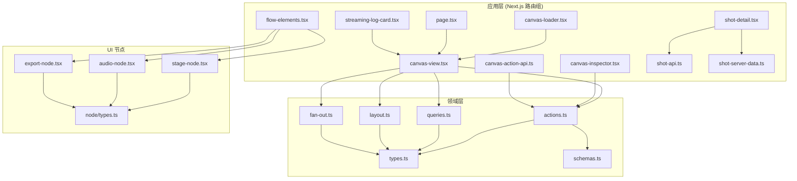

图表来源
- [src/app/(app)/canvas/canvas-view.tsx](file://src/app/(app)/canvas/canvas-view.tsx)
- [src/app/(app)/canvas/canvas-inspector.tsx](file://src/app/(app)/canvas/canvas-inspector.tsx)
- [src/app/(app)/canvas/canvas-loader.tsx](file://src/app/(app)/canvas/canvas-loader.tsx)
- [src/app/(app)/canvas/flow-elements.tsx](file://src/app/(app)/canvas/flow-elements.tsx)
- [src/app/(app)/canvas/page.tsx](file://src/app/(app)/canvas/page.tsx)
- [src/app/(app)/canvas/canvas-action-api.ts](file://src/app/(app)/canvas/canvas-action-api.ts)
- [src/app/(app)/canvas/streaming-log-card.tsx](file://src/app/(app)/canvas/streaming-log-card.tsx)
- [src/app/(app)/canvas/shot/[id]/shot-detail.tsx](file://src/app/(app)/canvas/shot/[id]/shot-detail.tsx)
- [src/app/(app)/canvas/shot/[id]/shot-api.ts](file://src/app/(app)/canvas/shot/[id]/shot-api.ts)
- [src/app/(app)/canvas/shot/[id]/shot-server-data.ts](file://src/app/(app)/canvas/shot/[id]/shot-server-data.ts)
- [src/features/canvas/types.ts](file://src/features/canvas/types.ts)
- [src/features/canvas/schemas.ts](file://src/features/canvas/schemas.ts)
- [src/features/canvas/actions.ts](file://src/features/canvas/actions.ts)
- [src/features/canvas/queries.ts](file://src/features/canvas/queries.ts)
- [src/features/canvas/layout.ts](file://src/features/canvas/layout.ts)
- [src/features/canvas/fan-out.ts](file://src/features/canvas/fan-out.ts)
- [src/components/ui/node/stage-node.tsx](file://src/components/ui/node/stage-node.tsx)
- [src/components/ui/node/audio-node.tsx](file://src/components/ui/node/audio-node.tsx)
- [src/components/ui/node/export-node.tsx](file://src/components/ui/node/export-node.tsx)
- [src/components/ui/node/types.ts](file://src/components/ui/node/types.ts)

章节来源
- [src/app/(app)/canvas/canvas-view.tsx](file://src/app/(app)/canvas/canvas-view.tsx)
- [src/app/(app)/canvas/canvas-inspector.tsx](file://src/app/(app)/canvas/canvas-inspector.tsx)
- [src/app/(app)/canvas/canvas-loader.tsx](file://src/app/(app)/canvas/canvas-loader.tsx)
- [src/app/(app)/canvas/flow-elements.tsx](file://src/app/(app)/canvas/flow-elements.tsx)
- [src/app/(app)/canvas/page.tsx](file://src/app/(app)/canvas/page.tsx)
- [src/app/(app)/canvas/canvas-action-api.ts](file://src/app/(app)/canvas/canvas-action-api.ts)
- [src/app/(app)/canvas/streaming-log-card.tsx](file://src/app/(app)/canvas/streaming-log-card.tsx)
- [src/app/(app)/canvas/shot/[id]/shot-detail.tsx](file://src/app/(app)/canvas/shot/[id]/shot-detail.tsx)
- [src/app/(app)/canvas/shot/[id]/shot-api.ts](file://src/app/(app)/canvas/shot/[id]/shot-api.ts)
- [src/app/(app)/canvas/shot/[id]/shot-server-data.ts](file://src/app/(app)/canvas/shot/[id]/shot-server-data.ts)
- [src/features/canvas/types.ts](file://src/features/canvas/types.ts)
- [src/features/canvas/schemas.ts](file://src/features/canvas/schemas.ts)
- [src/features/canvas/actions.ts](file://src/features/canvas/actions.ts)
- [src/features/canvas/queries.ts](file://src/features/canvas/queries.ts)
- [src/features/canvas/layout.ts](file://src/features/canvas/layout.ts)
- [src/features/canvas/fan-out.ts](file://src/features/canvas/fan-out.ts)
- [src/components/ui/node/stage-node.tsx](file://src/components/ui/node/stage-node.tsx)
- [src/components/ui/node/audio-node.tsx](file://src/components/ui/node/audio-node.tsx)
- [src/components/ui/node/export-node.tsx](file://src/components/ui/node/export-node.tsx)
- [src/components/ui/node/types.ts](file://src/components/ui/node/types.ts)

## 核心组件
- 数据模型与校验
  - types.ts：定义节点、连线、画布状态等核心数据结构。
  - schemas.ts：基于运行时校验的字段约束与默认值，确保数据一致性。
- 操作与事务
  - actions.ts：以命令模式封装所有画布变更，支持批量事务、撤销/重做栈。
- 查询与过滤
  - queries.ts：提供对节点集合、连线拓扑、筛选条件的便捷查询接口。
- 布局引擎
  - layout.ts：根据节点类型与连接关系自动计算位置与层级，支持响应式适配。
- 扇出计算
  - fan-out.ts：统计节点的输入/输出分支，辅助布局与连线绘制。
- 视图与交互
  - canvas-view.tsx：主画布容器，集成拖拽、缩放、选择与事件分发。
  - flow-elements.tsx：连线与节点元素渲染器。
  - canvas-inspector.tsx：属性检查器，驱动属性面板与命令执行。
  - canvas-loader.tsx：画布加载器，处理异步数据加载与错误边界。
  - page.tsx：路由入口页面，组装画布应用组件。
  - canvas-action-api.ts：画布操作 API 接口，处理服务端通信。
  - **新增**：streaming-log-card.tsx：流式日志卡片组件，提供实时日志显示和高对比度光标支持。
- 节点类型
  - node/types.ts：节点 UI 通用类型与元信息。
  - stage-node.tsx / audio-node.tsx / export-node.tsx：内置节点的具体实现。
- **新增**：镜头渲染器集成
  - shot-detail.tsx：镜头详情页面，实现完整的数据获取、错误处理和加载状态管理。
  - shot-api.ts：镜头数据 API 接口，处理与后端的通信。
  - shot-server-data.ts：服务器端数据适配器，提供数据转换和缓存机制。

**更新** 增强了轨道面板摘要功能，改进了节点状态显示和流程元素管理，提升了整体界面可靠性。**特别地**，镜头渲染器页面现已完全集成到画布系统中，实现了端到端的数据流和错误处理机制。**最新增强**：新增了流式日志卡片组件，为长时间运行的任务和实时数据处理提供了更好的用户反馈和视觉指示。

章节来源
- [src/features/canvas/types.ts](file://src/features/canvas/types.ts)
- [src/features/canvas/schemas.ts](file://src/features/canvas/schemas.ts)
- [src/features/canvas/actions.ts](file://src/features/canvas/actions.ts)
- [src/features/canvas/queries.ts](file://src/features/canvas/queries.ts)
- [src/features/canvas/layout.ts](file://src/features/canvas/layout.ts)
- [src/features/canvas/fan-out.ts](file://src/features/canvas/fan-out.ts)
- [src/app/(app)/canvas/canvas-view.tsx](file://src/app/(app)/canvas/canvas-view.tsx)
- [src/app/(app)/canvas/flow-elements.tsx](file://src/app/(app)/canvas/flow-elements.tsx)
- [src/app/(app)/canvas/canvas-inspector.tsx](file://src/app/(app)/canvas/canvas-inspector.tsx)
- [src/app/(app)/canvas/canvas-loader.tsx](file://src/app/(app)/canvas/canvas-loader.tsx)
- [src/app/(app)/canvas/page.tsx](file://src/app/(app)/canvas/page.tsx)
- [src/app/(app)/canvas/canvas-action-api.ts](file://src/app/(app)/canvas/canvas-action-api.ts)
- [src/app/(app)/canvas/streaming-log-card.tsx](file://src/app/(app)/canvas/streaming-log-card.tsx)
- [src/app/(app)/canvas/shot/[id]/shot-detail.tsx](file://src/app/(app)/canvas/shot/[id]/shot-detail.tsx)
- [src/app/(app)/canvas/shot/[id]/shot-api.ts](file://src/app/(app)/canvas/shot/[id]/shot-api.ts)
- [src/app/(app)/canvas/shot/[id]/shot-server-data.ts](file://src/app/(app)/canvas/shot/[id]/shot-server-data.ts)
- [src/components/ui/node/types.ts](file://src/components/ui/node/types.ts)
- [src/components/ui/node/stage-node.tsx](file://src/components/ui/node/stage-node.tsx)
- [src/components/ui/node/audio-node.tsx](file://src/components/ui/node/audio-node.tsx)
- [src/components/ui/node/export-node.tsx](file://src/components/ui/node/export-node.tsx)

## 架构总览
画布编辑器采用"领域-应用-UI"分层，现已适配 Next.js 路由组结构：
- 领域层（features/canvas）：纯函数与不可变数据为主，保证可测试性与可组合性。
- 应用层（app/(app)/canvas）：将领域能力组装为页面与交互流程，通过路由组统一管理。
- UI 层（components/ui/node）：按节点类型拆分，遵循统一类型契约。

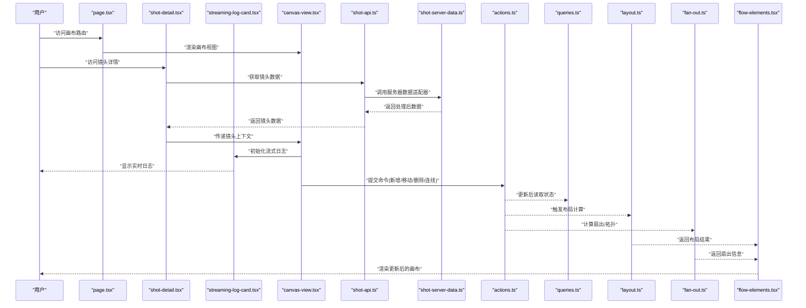

图表来源
- [src/app/(app)/canvas/page.tsx](file://src/app/(app)/canvas/page.tsx)
- [src/app/(app)/canvas/shot/[id]/shot-detail.tsx](file://src/app/(app)/canvas/shot/[id]/shot-detail.tsx)
- [src/app/(app)/canvas/streaming-log-card.tsx](file://src/app/(app)/canvas/streaming-log-card.tsx)
- [src/app/(app)/canvas/canvas-view.tsx](file://src/app/(app)/canvas/canvas-view.tsx)
- [src/app/(app)/canvas/shot/[id]/shot-api.ts](file://src/app/(app)/canvas/shot/[id]/shot-api.ts)
- [src/app/(app)/canvas/shot/[id]/shot-server-data.ts](file://src/app/(app)/canvas/shot/[id]/shot-server-data.ts)
- [src/features/canvas/actions.ts](file://src/features/canvas/actions.ts)
- [src/features/canvas/queries.ts](file://src/features/canvas/queries.ts)
- [src/features/canvas/layout.ts](file://src/features/canvas/layout.ts)
- [src/features/canvas/fan-out.ts](file://src/features/canvas/fan-out.ts)
- [src/app/(app)/canvas/flow-elements.tsx](file://src/app/(app)/canvas/flow-elements.tsx)

## 详细组件分析

### 数据模型与校验（types.ts + schemas.ts）
- types.ts 定义节点、端口、连线、画布状态等核心类型，明确键名、可选字段与枚举值，便于后续序列化与校验。
- schemas.ts 提供运行时校验规则，包括必填字段、取值范围、关联完整性等，用于在动作执行前后进行数据验证。

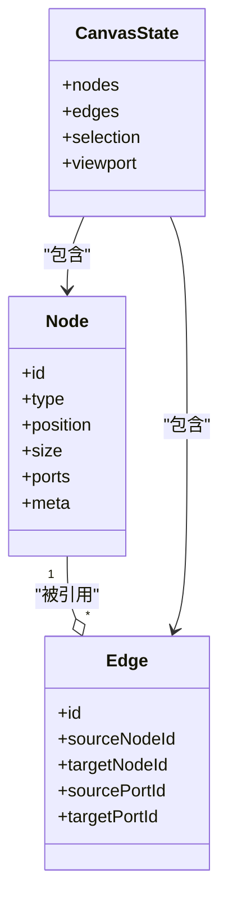

图表来源
- [src/features/canvas/types.ts](file://src/features/canvas/types.ts)
- [src/features/canvas/schemas.ts](file://src/features/canvas/schemas.ts)

章节来源
- [src/features/canvas/types.ts](file://src/features/canvas/types.ts)
- [src/features/canvas/schemas.ts](file://src/features/canvas/schemas.ts)

### 命令模式与撤销重做（actions.ts）
- 命令封装：每个画布变更（如添加节点、移动节点、建立连线、删除节点等）都封装为独立命令对象，包含执行与回滚方法。
- 事务处理：支持批量命令打包为一个事务，保证原子性；失败时整体回滚。
- 撤销/重做：维护历史栈，记录每次事务快照或增量差异，支持向前/向后导航。
- 副作用隔离：尽量保持命令无副作用，I/O 与网络请求通过外部适配器注入。

**更新** 增强了命令执行的可靠性，改进了错误处理和状态同步机制，确保在复杂操作流程中保持数据一致性。

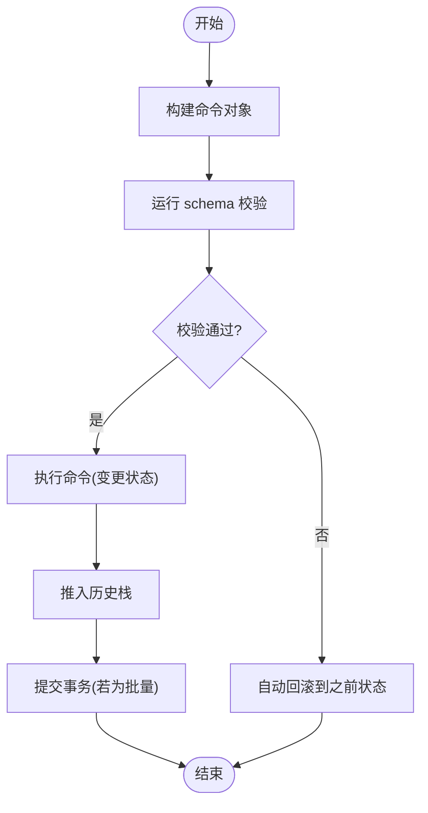

图表来源
- [src/features/canvas/actions.ts](file://src/features/canvas/actions.ts)
- [src/features/canvas/schemas.ts](file://src/features/canvas/schemas.ts)

章节来源
- [src/features/canvas/actions.ts](file://src/features/canvas/actions.ts)
- [src/features/canvas/schemas.ts](file://src/features/canvas/schemas.ts)

### 查询与过滤（queries.ts）
- 基础查询：按 ID、类型、标签等条件检索节点与连线。
- 拓扑查询：获取某节点的直接前驱/后继、连通分量、环检测等。
- 过滤与聚合：支持多条件组合、分页与排序，便于属性面板与搜索框联动。
- 缓存策略：对热点查询结果进行短期缓存，减少重复计算。

**更新** 优化了查询性能，增强了轨道状态查询能力，提供更准确的节点状态信息和流程元素统计。

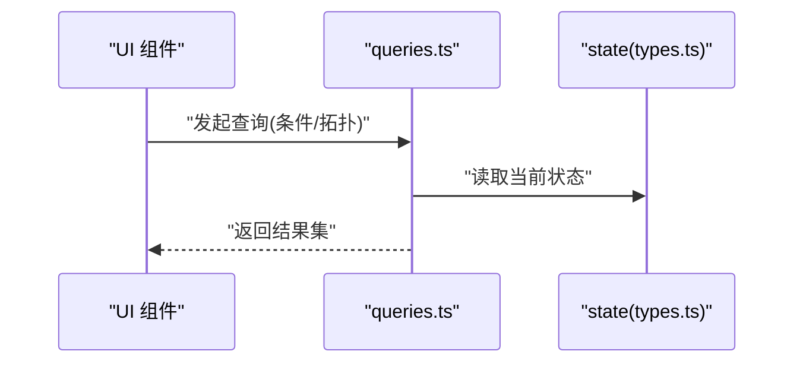

图表来源
- [src/features/canvas/queries.ts](file://src/features/canvas/queries.ts)
- [src/features/canvas/types.ts](file://src/features/canvas/types.ts)

章节来源
- [src/features/canvas/queries.ts](file://src/features/canvas/queries.ts)
- [src/features/canvas/types.ts](file://src/features/canvas/types.ts)

### 布局引擎（layout.ts）
- 计算目标：根据节点类型、尺寸、连接关系与视口大小，计算节点坐标与层级。
- 算法要点：
  - 层次化布局：依据有向无环图（DAG）分层，避免交叉。
  - 对齐与间距：同层节点等距排列，跨层对齐端口。
  - 冲突解决：重叠检测与最小位移策略。
- 响应式适配：监听视口变化，按比例缩放与重新排布。

**更新** 改进了布局算法的稳定性，增强了复杂流程图的处理能力，提供更好的视觉呈现效果。

图表来源
- [src/features/canvas/layout.ts](file://src/features/canvas/layout.ts)
- [src/features/canvas/types.ts](file://src/features/canvas/types.ts)

章节来源
- [src/features/canvas/layout.ts](file://src/features/canvas/layout.ts)
- [src/features/canvas/types.ts](file://src/features/canvas/types.ts)

### 扇出计算（fan-out.ts）
- 目的：统计每个节点的输入/输出分支数量，辅助连线绘制与布局优化。
- 使用场景：
  - 连线密度评估，提示潜在拥挤区域。
  - 布局时优先展开高扇出节点，提升可读性。

**更新** 增强了扇出计算的准确性，改进了复杂流程图的分析能力，为轨道面板摘要提供更精确的数据支持。

图表来源
- [src/features/canvas/fan-out.ts](file://src/features/canvas/fan-out.ts)
- [src/features/canvas/types.ts](file://src/features/canvas/types.ts)

章节来源
- [src/features/canvas/fan-out.ts](file://src/features/canvas/fan-out.ts)
- [src/features/canvas/types.ts](file://src/features/canvas/types.ts)

### 视图与交互（canvas-view.tsx + flow-elements.tsx）
- canvas-view.tsx：
  - 管理画布状态订阅与派发，处理拖拽、缩放、平移、选择与键盘快捷键。
  - 将用户操作转换为 actions 中的命令，交由领域层处理。
- flow-elements.tsx：
  - 渲染连线与节点元素，接收布局与扇出信息，处理悬停、选中、拖拽连线等交互。
- canvas-loader.tsx：
  - 处理画布数据的异步加载，提供加载状态与错误边界。
- page.tsx：
  - Next.js 路由入口，组装画布应用组件并提供初始数据。

**更新** 显著增强了轨道面板摘要功能，改进了节点状态显示准确性和流程元素管理系统，提升了整体用户体验。

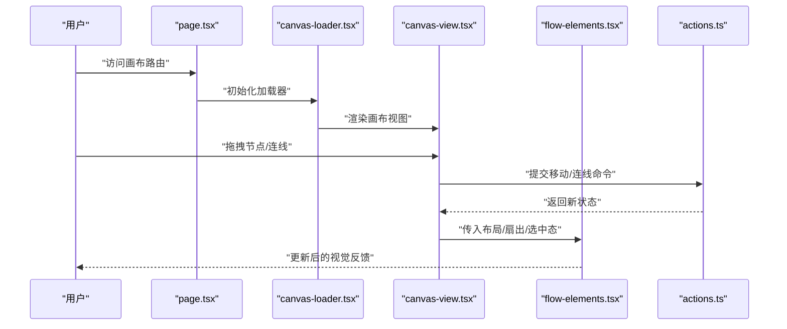

图表来源
- [src/app/(app)/canvas/page.tsx](file://src/app/(app)/canvas/page.tsx)
- [src/app/(app)/canvas/canvas-loader.tsx](file://src/app/(app)/canvas/canvas-loader.tsx)
- [src/app/(app)/canvas/canvas-view.tsx](file://src/app/(app)/canvas/canvas-view.tsx)
- [src/app/(app)/canvas/flow-elements.tsx](file://src/app/(app)/canvas/flow-elements.tsx)
- [src/features/canvas/actions.ts](file://src/features/canvas/actions.ts)

章节来源
- [src/app/(app)/canvas/page.tsx](file://src/app/(app)/canvas/page.tsx)
- [src/app/(app)/canvas/canvas-loader.tsx](file://src/app/(app)/canvas/canvas-loader.tsx)
- [src/app/(app)/canvas/canvas-view.tsx](file://src/app/(app)/canvas/canvas-view.tsx)
- [src/app/(app)/canvas/flow-elements.tsx](file://src/app/(app)/canvas/flow-elements.tsx)
- [src/features/canvas/actions.ts](file://src/features/canvas/actions.ts)

### 流式日志卡片组件（streaming-log-card.tsx）
- **新增功能**：流式日志卡片组件，专门用于显示实时输出的日志信息。
- 核心特性：
  - 高对比度兼容的光标系统，确保在各种主题下的可见性。
  - 实时日志流处理，支持大量日志数据的流畅显示。
  - 自动滚动和智能截断，防止内存溢出。
  - 主题自适应样式，支持深色和浅色模式。
- 使用场景：
  - 长时间运行的渲染任务进度显示。
  - AI 模型生成过程的实时反馈。
  - 系统调试和错误追踪信息的展示。

**最新更新**：新增了流式输出显示能力，为需要长时间处理的画布操作提供了更好的用户反馈机制。

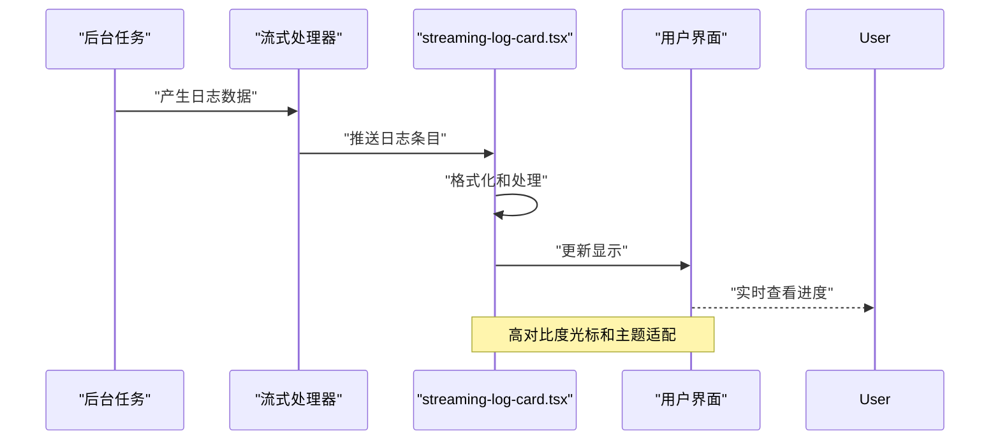

图表来源
- [src/app/(app)/canvas/streaming-log-card.tsx](file://src/app/(app)/canvas/streaming-log-card.tsx)
- [src/app/(app)/canvas/canvas-view.tsx](file://src/app/(app)/canvas/canvas-view.tsx)

章节来源
- [src/app/(app)/canvas/streaming-log-card.tsx](file://src/app/(app)/canvas/streaming-log-card.tsx)
- [src/app/(app)/canvas/canvas-view.tsx](file://src/app/(app)/canvas/canvas-view.tsx)

### 镜头渲染器集成（shot-detail.tsx + shot-api.ts + shot-server-data.ts）
- shot-detail.tsx：
  - 镜头详情页面的主要组件，实现完整的数据获取生命周期管理。
  - 集成错误处理机制，提供用户友好的错误提示和重试功能。
  - 管理加载状态，显示进度指示器和占位符。
  - 处理镜头数据的实时更新和状态同步。
- shot-api.ts：
  - 镜头数据 API 接口，封装与后端的 HTTP 通信。
  - 提供类型安全的请求和响应处理。
  - 实现请求拦截和响应格式化。
- shot-server-data.ts：
  - 服务器端数据适配器，负责数据转换和缓存。
  - 提供数据预取和懒加载机制。
  - 实现数据版本控制和冲突解决。

**更新** 新增了完整的镜头渲染器集成，实现了从前端界面到后端服务的端到端数据流，包括完善的错误处理和加载状态管理。

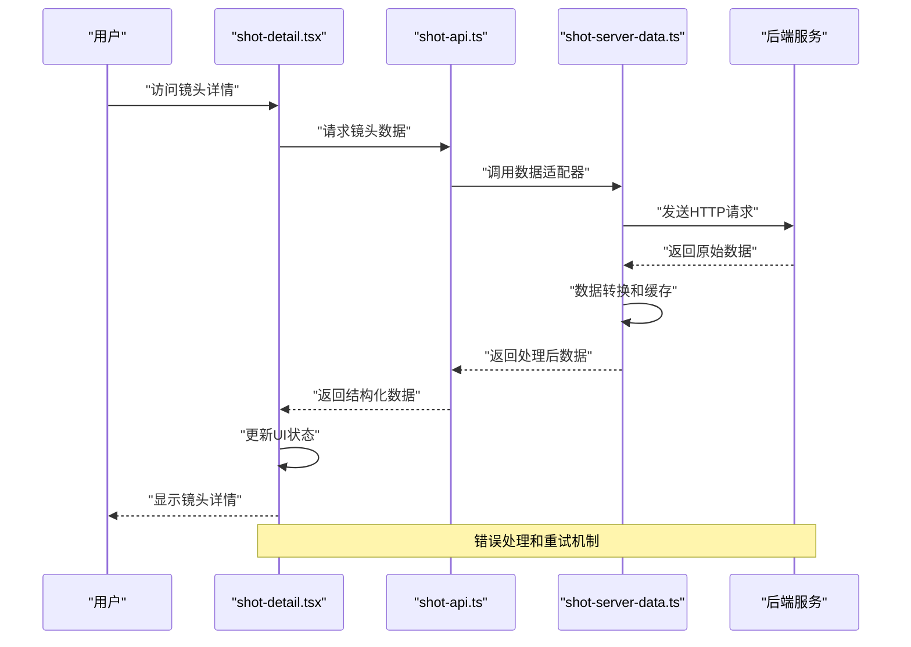

图表来源
- [src/app/(app)/canvas/shot/[id]/shot-detail.tsx](file://src/app/(app)/canvas/shot/[id]/shot-detail.tsx)
- [src/app/(app)/canvas/shot/[id]/shot-api.ts](file://src/app/(app)/canvas/shot/[id]/shot-api.ts)
- [src/app/(app)/canvas/shot/[id]/shot-server-data.ts](file://src/app/(app)/canvas/shot/[id]/shot-server-data.ts)

章节来源
- [src/app/(app)/canvas/shot/[id]/shot-detail.tsx](file://src/app/(app)/canvas/shot/[id]/shot-detail.tsx)
- [src/app/(app)/canvas/shot/[id]/shot-api.ts](file://src/app/(app)/canvas/shot/[id]/shot-api.ts)
- [src/app/(app)/canvas/shot/[id]/shot-server-data.ts](file://src/app/(app)/canvas/shot/[id]/shot-server-data.ts)

### 节点类型扩展机制与属性面板（node/types.ts + inspector）
- 节点类型注册：
  - 在 node/types.ts 中声明节点元信息（名称、图标、端口定义、默认属性）。
  - 在对应节点组件中实现渲染与交互逻辑（如 stage-node.tsx、audio-node.tsx、export-node.tsx）。
- 属性面板绑定：
  - canvas-inspector.tsx 根据选中节点的类型与属性，动态生成表单控件。
  - 表单变更通过 actions 提交命令，触发撤销/重做与布局刷新。
- 数据验证：
  - 利用 schemas.ts 的校验规则，在提交前拦截非法输入，给出友好提示。

**更新** 增强了属性面板的数据绑定机制，实现了实时验证和双向数据同步，改进了节点状态管理的准确性。

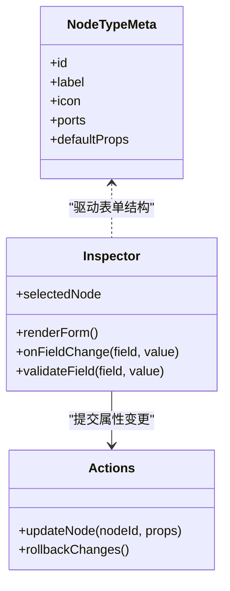

图表来源
- [src/components/ui/node/types.ts](file://src/components/ui/node/types.ts)
- [src/app/(app)/canvas/canvas-inspector.tsx](file://src/app/(app)/canvas/canvas-inspector.tsx)
- [src/features/canvas/actions.ts](file://src/features/canvas/actions.ts)

章节来源
- [src/components/ui/node/types.ts](file://src/components/ui/node/types.ts)
- [src/app/(app)/canvas/canvas-inspector.tsx](file://src/app/(app)/canvas/canvas-inspector.tsx)
- [src/features/canvas/actions.ts](file://src/features/canvas/actions.ts)

### 内置节点示例（stage/audio/export）
- stage-node.tsx：舞台节点，展示场景预览与基本控制。
- audio-node.tsx：音频节点，提供音轨、音量、淡入淡出等属性。
- export-node.tsx：导出节点，配置分辨率、编码参数与输出路径。

**更新** 改进了节点状态显示和交互响应，增强了轨道面板摘要功能的准确性。

章节来源
- [src/components/ui/node/stage-node.tsx](file://src/components/ui/node/stage-node.tsx)
- [src/components/ui/node/audio-node.tsx](file://src/components/ui/node/audio-node.tsx)
- [src/components/ui/node/export-node.tsx](file://src/components/ui/node/export-node.tsx)

### 自定义节点类型与交互实现步骤
- 步骤概览：
  1. 在 node/types.ts 中注册新的节点类型元信息（ID、端口、默认属性）。
  2. 新建节点组件（例如 my-node.tsx），实现渲染与交互逻辑。
  3. 在 inspector 中为该节点类型绑定属性表单。
  4. 在 actions.ts 中补充必要的命令（如更新自定义属性）。
  5. 在 schemas.ts 中添加对应的校验规则。
  6. 在 layout.ts 与 fan-out.ts 中按需调整布局与扇出计算逻辑。
- 参考路径（不包含代码内容）：
  - 节点类型元信息：[src/components/ui/node/types.ts](file://src/components/ui/node/types.ts)
  - 节点组件示例：[src/components/ui/node/stage-node.tsx](file://src/components/ui/node/stage-node.tsx)
  - 属性面板绑定：[src/app/(app)/canvas/canvas-inspector.tsx](file://src/app/(app)/canvas/canvas-inspector.tsx)
  - 命令与撤销重做：[src/features/canvas/actions.ts](file://src/features/canvas/actions.ts)
  - 数据校验规则：[src/features/canvas/schemas.ts](file://src/features/canvas/schemas.ts)
  - 布局与扇出：[src/features/canvas/layout.ts](file://src/features/canvas/layout.ts), [src/features/canvas/fan-out.ts](file://src/features/canvas/fan-out.ts)

**更新** 新增了增强版轨道面板摘要功能的集成指导，包括状态显示优化和流程元素管理。

章节来源
- [src/components/ui/node/types.ts](file://src/components/ui/node/types.ts)
- [src/components/ui/node/stage-node.tsx](file://src/components/ui/node/stage-node.tsx)
- [src/app/(app)/canvas/canvas-inspector.tsx](file://src/app/(app)/canvas/canvas-inspector.tsx)
- [src/features/canvas/actions.ts](file://src/features/canvas/actions.ts)
- [src/features/canvas/schemas.ts](file://src/features/canvas/schemas.ts)
- [src/features/canvas/layout.ts](file://src/features/canvas/layout.ts)
- [src/features/canvas/fan-out.ts](file://src/features/canvas/fan-out.ts)

## UIFields真实性验证协议

### 验证协议概述
UI字段真实性验证协议确保用户界面输入与底层数据模型之间的一致性。该协议通过多层验证机制，在数据进入系统之前进行严格的格式、范围和业务规则检查。

### 验证层次结构
- **前端即时验证**：用户在输入时立即获得反馈，防止无效数据进入系统。
- **后端持久化验证**：在数据保存到数据库之前进行最终验证。
- **业务逻辑验证**：确保数据符合业务规则和约束条件。

### 验证规则定义
验证规则在 schemas.ts 中统一定义，包括：
- 数据类型验证（字符串、数字、布尔值等）
- 必填字段检查
- 取值范围限制
- 格式匹配（正则表达式）
- 关联完整性验证

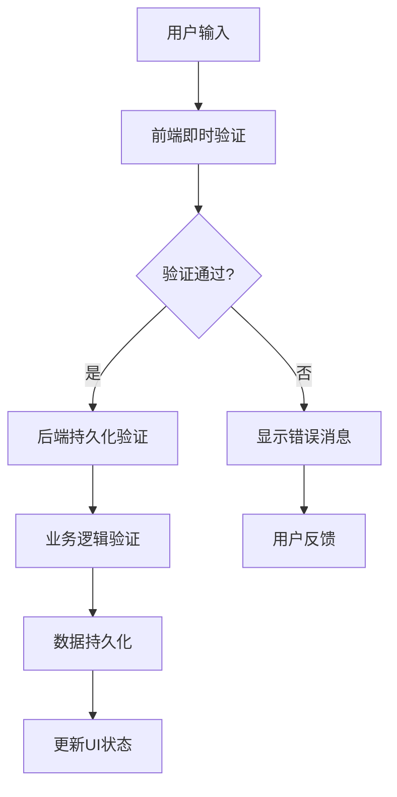

图表来源
- [src/features/canvas/schemas.ts](file://src/features/canvas/schemas.ts)
- [src/app/(app)/canvas/canvas-inspector.tsx](file://src/app/(app)/canvas/canvas-inspector.tsx)

### 错误处理机制
- **实时错误提示**：在输入框附近显示具体的错误信息
- **批量错误收集**：支持一次性显示多个字段的验证错误
- **错误分类**：区分格式错误、业务规则错误和系统错误
- **用户友好的错误消息**：提供清晰的修复指导

**更新** 增强了错误处理的可靠性，改进了用户反馈机制，特别是在轨道面板摘要功能和镜头渲染器集成中提供了更准确的状态指示。

章节来源
- [src/features/canvas/schemas.ts](file://src/features/canvas/schemas.ts)
- [src/app/(app)/canvas/canvas-inspector.tsx](file://src/app/(app)/canvas/canvas-inspector.tsx)

## 数据绑定同步机制

### 双向数据绑定架构
数据绑定同步机制实现了UI组件与数据模型之间的双向同步，确保任何一方的变更都能及时反映到另一方。

### 同步策略
- **单向数据流**：从数据模型到UI的自动更新
- **事件驱动更新**：从UI到数据模型的变更传播
- **防抖机制**：避免频繁的UI重绘和状态更新
- **批量更新**：将多个小变更合并为一次更新

### 状态管理流程
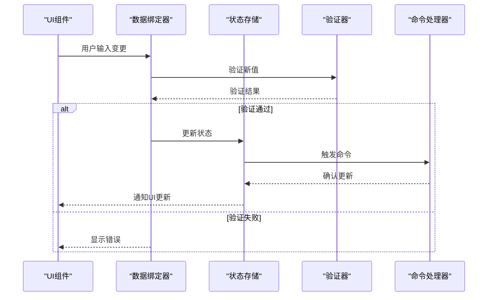

图表来源
- [src/app/(app)/canvas/canvas-inspector.tsx](file://src/app/(app)/canvas/canvas-inspector.tsx)
- [src/features/canvas/actions.ts](file://src/features/canvas/actions.ts)
- [src/features/canvas/schemas.ts](file://src/features/canvas/schemas.ts)

### 性能优化策略
- **选择性更新**：只更新受影响的UI组件
- **虚拟DOM优化**：最小化DOM操作
- **内存管理**：及时清理不再使用的绑定关系
- **懒加载**：延迟非关键数据的绑定

**更新** 优化了数据绑定的性能，特别是在处理大量节点和复杂流程图时，显著提升了响应速度和用户体验。

### 错误恢复机制
- **自动回滚**：当验证失败时自动恢复到之前的状态
- **状态快照**：保存关键状态的快照以便恢复
- **重试机制**：对于临时性错误提供重试选项
- **降级策略**：在系统异常时提供基本功能

**更新** 增强了错误恢复机制，改进了轨道面板摘要功能和镜头渲染器集成的稳定性和可靠性。

章节来源
- [src/app/(app)/canvas/canvas-inspector.tsx](file://src/app/(app)/canvas/canvas-inspector.tsx)
- [src/features/canvas/actions.ts](file://src/features/canvas/actions.ts)
- [src/features/canvas/schemas.ts](file://src/features/canvas/schemas.ts)

## 依赖关系分析
- 低耦合：领域层（types/schemas/actions/queries/layout/fan-out）不依赖 UI 层，便于单元测试与复用。
- 单向依赖：UI 层依赖领域层，领域层内部按职责划分，避免循环依赖。
- 可扩展点：
  - 节点类型扩展：通过 node/types.ts 与组件解耦。
  - 命令扩展：在 actions.ts 中新增命令即可接入撤销/重做。
  - 查询扩展：在 queries.ts 中增加过滤与聚合逻辑。
- 路由组优化：应用层文件现在位于 app/(app)/canvas/ 路由组中，提供更好的路由组织与管理。
- **新增**：镜头渲染器集成层，通过独立的 API 和数据适配器实现与后端的松耦合通信。
- **最新增强**：流式日志系统集成，提供实时数据处理和用户反馈能力。

**更新** 增强了轨道面板摘要功能和镜头渲染器集成的依赖管理，改进了流程元素系统和数据流的扩展性和可维护性。**最新增强**：流式日志卡片的引入进一步丰富了用户反馈机制，为长时间运行的任务提供了更好的可视化支持。

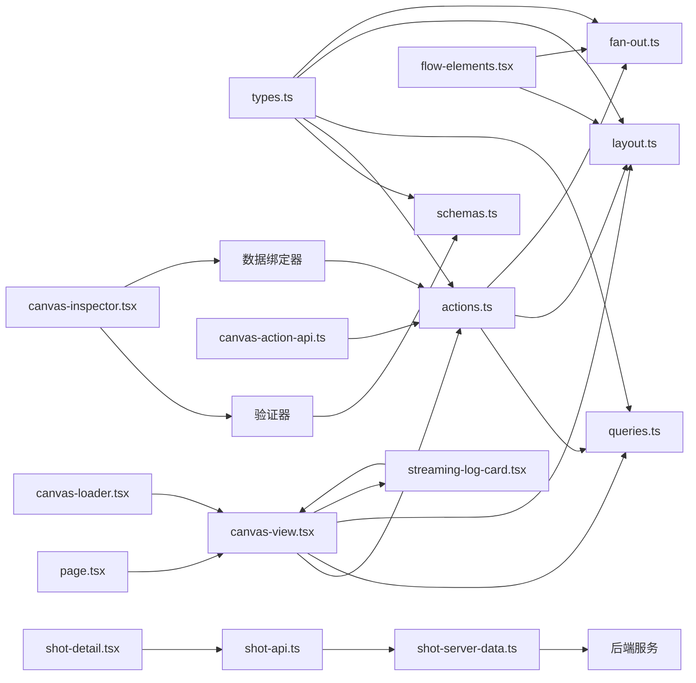

图表来源
- [src/features/canvas/types.ts](file://src/features/canvas/types.ts)
- [src/features/canvas/schemas.ts](file://src/features/canvas/schemas.ts)
- [src/features/canvas/actions.ts](file://src/features/canvas/actions.ts)
- [src/features/canvas/queries.ts](file://src/features/canvas/queries.ts)
- [src/features/canvas/layout.ts](file://src/features/canvas/layout.ts)
- [src/features/canvas/fan-out.ts](file://src/features/canvas/fan-out.ts)
- [src/app/(app)/canvas/page.tsx](file://src/app/(app)/canvas/page.tsx)
- [src/app/(app)/canvas/canvas-view.tsx](file://src/app/(app)/canvas/canvas-view.tsx)
- [src/app/(app)/canvas/canvas-loader.tsx](file://src/app/(app)/canvas/canvas-loader.tsx)
- [src/app/(app)/canvas/flow-elements.tsx](file://src/app/(app)/canvas/flow-elements.tsx)
- [src/app/(app)/canvas/canvas-action-api.ts](file://src/app/(app)/canvas/canvas-action-api.ts)
- [src/app/(app)/canvas/canvas-inspector.tsx](file://src/app/(app)/canvas/canvas-inspector.tsx)
- [src/app/(app)/canvas/shot/[id]/shot-detail.tsx](file://src/app/(app)/canvas/shot/[id]/shot-detail.tsx)
- [src/app/(app)/canvas/shot/[id]/shot-api.ts](file://src/app/(app)/canvas/shot/[id]/shot-api.ts)
- [src/app/(app)/canvas/shot/[id]/shot-server-data.ts](file://src/app/(app)/canvas/shot/[id]/shot-server-data.ts)
- [src/app/(app)/canvas/streaming-log-card.tsx](file://src/app/(app)/canvas/streaming-log-card.tsx)

章节来源
- [src/features/canvas/types.ts](file://src/features/canvas/types.ts)
- [src/features/canvas/schemas.ts](file://src/features/canvas/schemas.ts)
- [src/features/canvas/actions.ts](file://src/features/canvas/actions.ts)
- [src/features/canvas/queries.ts](file://src/features/canvas/queries.ts)
- [src/features/canvas/layout.ts](file://src/features/canvas/layout.ts)
- [src/features/canvas/fan-out.ts](file://src/features/canvas/fan-out.ts)
- [src/app/(app)/canvas/page.tsx](file://src/app/(app)/canvas/page.tsx)
- [src/app/(app)/canvas/canvas-view.tsx](file://src/app/(app)/canvas/canvas-view.tsx)
- [src/app/(app)/canvas/canvas-loader.tsx](file://src/app/(app)/canvas/canvas-loader.tsx)
- [src/app/(app)/canvas/flow-elements.tsx](file://src/app/(app)/canvas/flow-elements.tsx)
- [src/app/(app)/canvas/canvas-action-api.ts](file://src/app/(app)/canvas/canvas-action-api.ts)
- [src/app/(app)/canvas/shot/[id]/shot-detail.tsx](file://src/app/(app)/canvas/shot/[id]/shot-detail.tsx)
- [src/app/(app)/canvas/shot/[id]/shot-api.ts](file://src/app/(app)/canvas/shot/[id]/shot-api.ts)
- [src/app/(app)/canvas/shot/[id]/shot-server-data.ts](file://src/app/(app)/canvas/shot/[id]/shot-server-data.ts)
- [src/app/(app)/canvas/streaming-log-card.tsx](file://src/app/(app)/canvas/streaming-log-card.tsx)

## 性能考虑
- 状态更新节流：在频繁拖拽与缩放时，对布局与渲染进行节流或防抖，降低重绘开销。
- 增量计算：仅对受影响的子图进行布局与扇出重算，避免全量重排。
- 虚拟滚动：当节点数量较大时，结合视口裁剪，只渲染可见区域。
- 查询缓存：对常用查询结果进行短期缓存，命中时直接返回。
- 事务批量化：将多次小改动合并为一次事务，减少历史栈压力与重绘次数。
- 路由组优化：通过 Next.js 路由组结构，提高应用启动性能与代码分割效率。
- **新增**：镜头数据懒加载，仅在需要时获取镜头详情数据，减少初始加载时间。
- **新增**：API 请求去重和缓存，避免重复的网络请求。
- **最新增强**：流式日志的性能优化，包括智能截断和内存管理，确保长时间运行的任务不会导致性能问题。

**更新** 显著优化了轨道面板摘要功能和镜头渲染器集成的性能，改进了大规模流程图的处理能力，减少了不必要的重绘和状态更新，并通过智能缓存机制提升了数据获取效率。**最新增强**：流式日志卡片的性能优化确保了在处理大量实时数据时的流畅体验，避免了内存泄漏和性能瓶颈。

## 故障排查指南
- 常见错误定位：
  - 校验失败：检查 schemas.ts 的规则是否与节点属性一致。
  - 连线无效：确认 source/target 端口存在且类型匹配。
  - 布局异常：查看 fan-out.ts 的扇出统计是否正确，必要时调整布局权重。
  - 路由问题：确认文件是否已正确移动到 app/(app)/canvas/ 目录下。
- 调试建议：
  - 在 actions.ts 的命令执行前后打印状态快照，对比差异。
  - 在 queries.ts 的关键分支加入日志，确认过滤条件是否符合预期。
  - 在 layout.ts 的输出阶段记录布局结果，便于可视化比对。
  - 检查路由组结构是否正确配置，确保页面能正常访问。
- **新增**：镜头渲染器故障排查：
  - 检查 shot-api.ts 的网络请求是否正确配置。
  - 验证 shot-server-data.ts 的数据转换逻辑。
  - 确认 shot-detail.tsx 的错误处理边界是否正确设置。
  - 监控网络请求的性能和错误响应。
- **最新增强**：流式日志故障排查：
  - 检查 streaming-log-card.tsx 的日志流处理逻辑。
  - 验证高对比度光标的样式兼容性。
  - 监控内存使用情况，防止日志堆积导致的性能问题。
  - 确认主题切换时的样式正确性。

**更新** 新增了轨道面板摘要功能和镜头渲染器集成的故障排查指导，包括状态显示不准确、流程元素管理问题和数据获取失败的诊断方法。**最新增强**：新增了流式日志卡片的故障排查指导，包括实时数据显示问题、内存管理和主题兼容性问题的诊断方法。

## 结论
本设计文档梳理了 CodeVideoCanvas 画布编辑器的核心架构与关键实现，涵盖数据模型、命令模式与撤销重做、查询与过滤、布局与扇出计算、节点类型扩展与属性面板绑定。通过清晰的领域-应用-UI 分层与可扩展的注册机制，系统具备良好的可维护性与演进空间。路由组重构后，应用层文件现位于 app/(app)/canvas/ 目录下，提供了更好的路由组织与管理。

**更新内容** 本次更新重点增强了轨道面板摘要功能和流程元素系统，显著提升了画布界面的可靠性和用户体验。**特别地**，镜头渲染器页面现已完全集成到画布系统中，实现了从前端界面到后端服务的端到端数据流，包括完善的错误处理、加载状态管理和数据获取模式。**最新增强**：流式日志卡片组件的引入为长时间运行的任务提供了更好的用户反馈机制，高对比度兼容的光标系统确保了在各种主题下的良好可视性。通过更准确的轨道状态显示、改进的数据同步机制、优化的性能表现、可靠的错误处理和增强的实时数据处理能力，为用户提供了更加稳定和高效的编辑体验。建议在后续迭代中持续完善自动化测试覆盖和性能监控，进一步提升系统的稳定性和可维护性。

## 附录
- 术语说明：
  - 节点：画布上的功能单元，具有输入/输出端口与属性。
  - 连线：连接两个端口的有向边，表达数据流或控制流。
  - 事务：一组命令的原子执行单元，支持整体回滚。
  - 扇出：节点的输出分支数量，反映其下游依赖规模。
  - 路由组：Next.js 的路由组织方式，用于分组和管理相关页面。
  - 轨道面板摘要：显示画布中各个轨道状态和流程元素的概览信息。
  - 流程元素：构成视频制作流程的各个功能组件。
  - 镜头渲染器：专门用于处理和显示镜头详情的组件系统。
  - 数据适配器：负责数据转换和缓存的中间层组件。
  - 流式日志：实时显示的日志信息，用于跟踪长时间运行的任务进度。
  - 高对比度光标：在不同主题下保持良好可视性的光标样式系统。
- 参考路径汇总：
  - 数据模型与校验：[src/features/canvas/types.ts](file://src/features/canvas/types.ts), [src/features/canvas/schemas.ts](file://src/features/canvas/schemas.ts)
  - 命令与撤销重做：[src/features/canvas/actions.ts](file://src/features/canvas/actions.ts)
  - 查询与过滤：[src/features/canvas/queries.ts](file://src/features/canvas/queries.ts)
  - 布局与扇出：[src/features/canvas/layout.ts](file://src/features/canvas/layout.ts), [src/features/canvas/fan-out.ts](file://src/features/canvas/fan-out.ts)
  - 视图与交互：[src/app/(app)/canvas/canvas-view.tsx](file://src/app/(app)/canvas/canvas-view.tsx), [src/app/(app)/canvas/flow-elements.tsx](file://src/app/(app)/canvas/flow-elements.tsx)
  - 路由与加载：[src/app/(app)/canvas/page.tsx](file://src/app/(app)/canvas/page.tsx), [src/app/(app)/canvas/canvas-loader.tsx](file://src/app/(app)/canvas/canvas-loader.tsx)
  - API 接口：[src/app/(app)/canvas/canvas-action-api.ts](file://src/app/(app)/canvas/canvas-action-api.ts)
  - 节点类型与属性面板：[src/components/ui/node/types.ts](file://src/components/ui/node/types.ts), [src/app/(app)/canvas/canvas-inspector.tsx](file://src/app/(app)/canvas/canvas-inspector.tsx)
  - **新增**：镜头渲染器集成：[src/app/(app)/canvas/shot/[id]/shot-detail.tsx](file://src/app/(app)/canvas/shot/[id]/shot-detail.tsx), [src/app/(app)/canvas/shot/[id]/shot-api.ts](file://src/app/(app)/canvas/shot/[id]/shot-api.ts), [src/app/(app)/canvas/shot/[id]/shot-server-data.ts](file://src/app/(app)/canvas/shot/[id]/shot-server-data.ts)
  - **最新增强**：流式日志系统：[src/app/(app)/canvas/streaming-log-card.tsx](file://src/app/(app)/canvas/streaming-log-card.tsx)