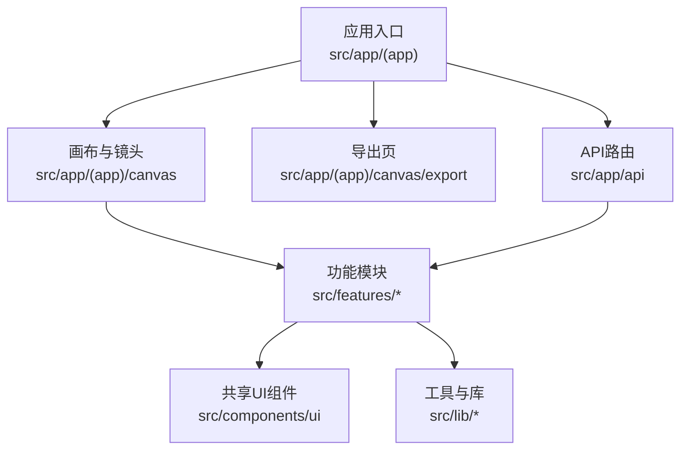
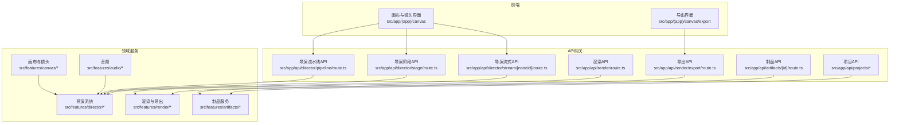
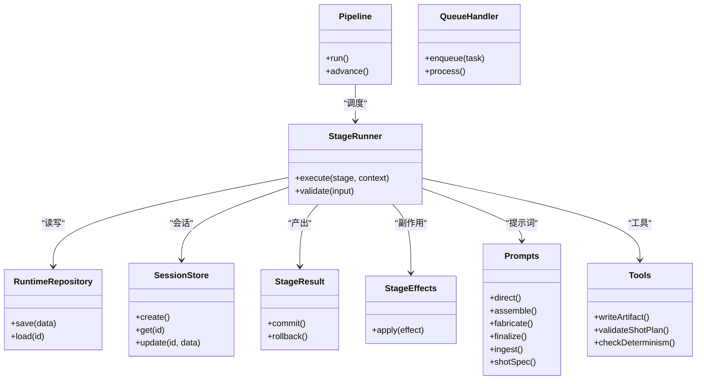
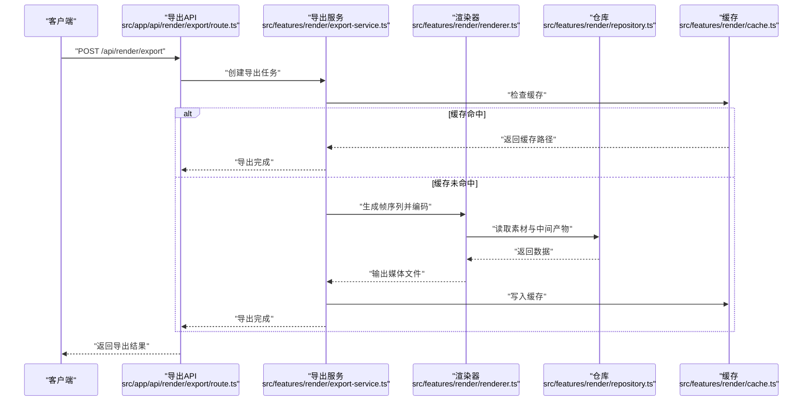
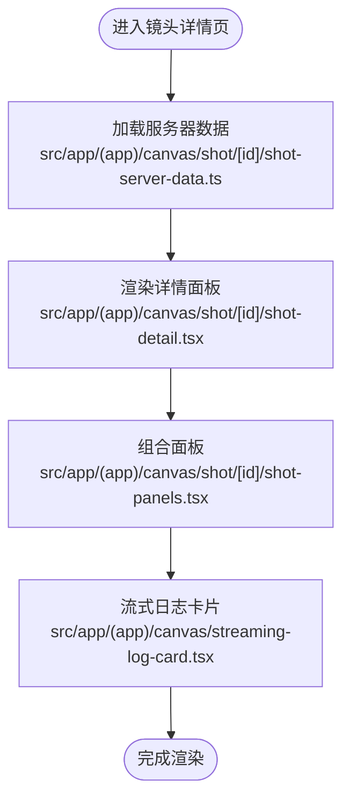
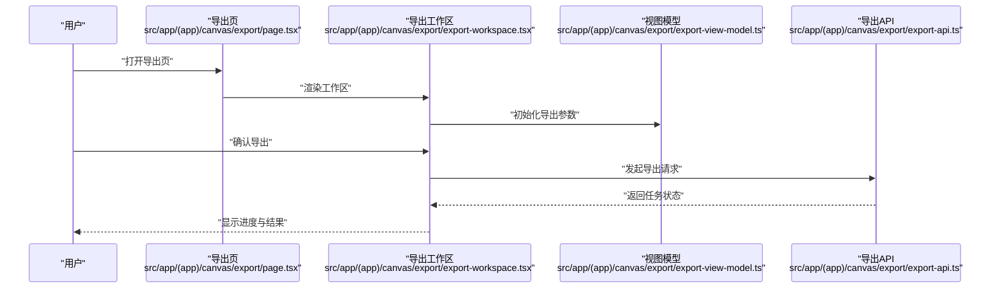
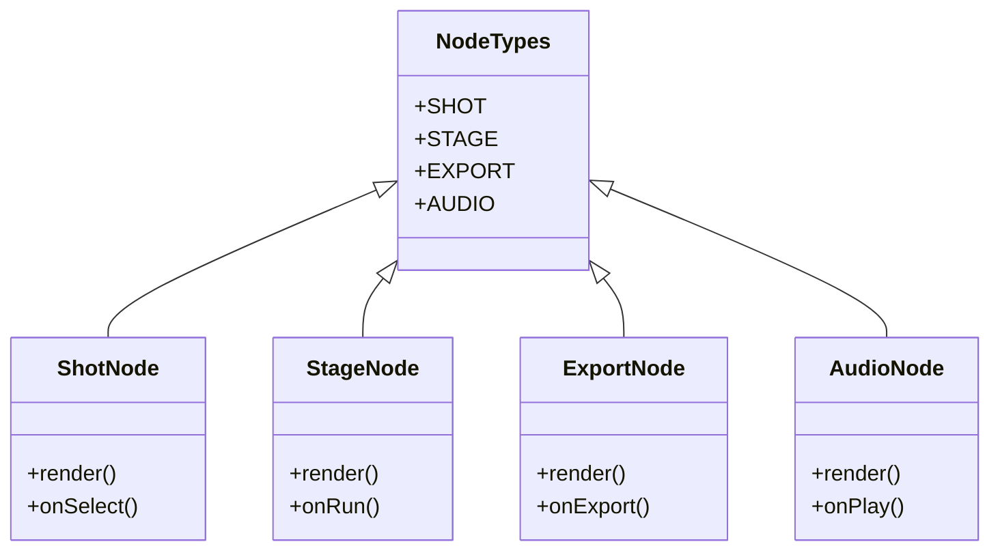
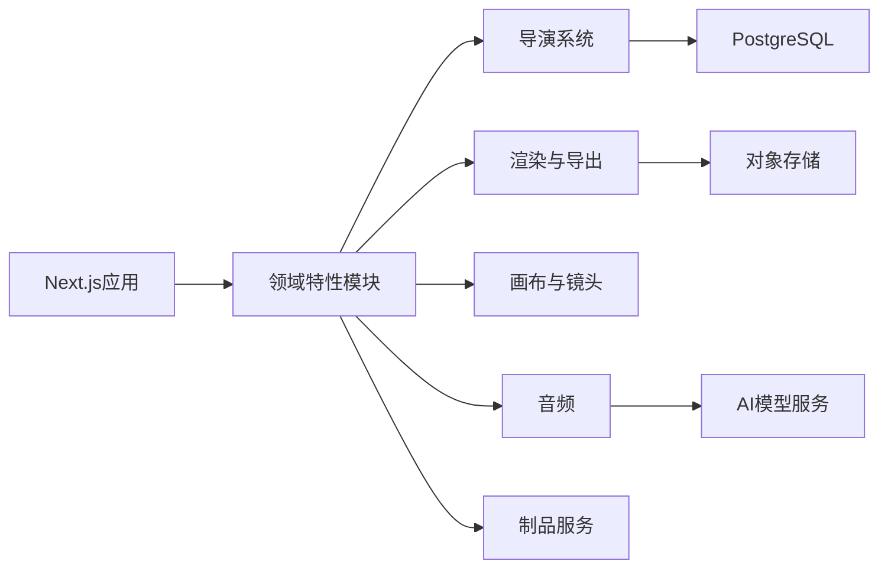

# V3产品规范

<cite>
**本文引用的文件**   
- [README.md](file://README.md)
- [AGENTS.md](file://AGENTS.md)
- [package.json](file://package.json)
- [next.config.ts](file://next.config.ts)
- [drizzle.config.ts](file://drizzle.config.ts)
- [tsconfig.json](file://tsconfig.json)
- [vitest.config.ts](file://vitest.config.ts)
- [specs/2026-07-24-refactor-v3-product-spec.md](file://docs/specs/2026-07-24-refactor-v3-product-spec.md)
- [specs/2026-07-24-refactor-v3-architecture-spec.md](file://docs/specs/2026-07-24-refactor-v3-architecture-spec.md)
- [specs/2026-07-24-refactor-v3-task-breakdown.md](file://docs/specs/2026-07-24-refactor-v3-task-breakdown.md)
- [plans/2026-07-24-refactor-blueprint-00-master-index.md](file://docs/plans/2026-07-24-refactor-blueprint-00-master-index.md)
- [plans/2026-07-24-refactor-blueprint-02-target-architecture.md](file://docs/plans/2026-07-24-refactor-blueprint-02-target-architecture.md)
- [plans/2026-07-24-refactor-blueprint-03-tracks.md](file://docs/plans/2026-07-24-refactor-blueprint-03-tracks.md)
- [plans/2026-07-24-refactor-blueprint-04-purpleink-alignment.md](file://docs/plans/2026-07-24-refactor-blueprint-04-purpleink-alignment.md)
- [adr/0001-postgres-local-cloud-ready.md](file://docs/adr/0001-postgres-local-cloud-ready.md)
- [adr/0002-trigger-execution-boundary.md](file://docs/adr/0002-trigger-execution-boundary.md)
- [adr/0003-pi-agent-runtime.md](file://docs/adr/0003-pi-agent-runtime.md)
- [adr/0004-video-compiler-hyperframes.md](file://docs/adr/0004-video-编译器超帧.md)
- [issues/refactor-v3/README.md](file://docs/issues/refactor-v3/README.md)
- [issues/refactor-v3/issue-n0-baseline-and-bleeding-fixes.md](file://docs/issues/refactor-v3/issue-n0-baseline-and-bleeding-fixes.md)
- [issues/refactor-v3/issue-n3-pi-agent-runtime.md](file://docs/issues/refactor-v3/issue-n3-pi-agent-runtime.md)
- [issues/refactor-v3/issue-n4-artifact-compiler-hyperframes.md](file://docs/issues/refactor-v3/issue-n4-artifact-compiler-hyperframes.md)
- [issues/refactor-v3/issue-n5-compose-closure.md](file://docs/issues/refactor-v3/issue-n5-compose-closure.md)
- [issues/refactor-v3/issue-n6-ui-truth-and-governance.md](file://docs/issues/refactor-v3/issue-n6-ui-truth-and-governance.md)
- [issues/refactor-v3/issue-n7-e2e-and-cutover.md](file://docs/issues/refactor-v3/issue-n7-e2e-and-cutover.md)
- [src/app/(app)/canvas/page.tsx](file://src/app/(app)/canvas/page.tsx)
- [src/app/(app)/canvas/canvas-view.tsx](file://src/app/(app)/canvas/canvas-view.tsx)
- [src/app/(app)/canvas/flow-elements.tsx](file://src/app/(app)/canvas/flow-elements.tsx)
- [src/app/(app)/canvas/export/page.tsx](file://src/app/(app)/canvas/export/page.tsx)
- [src/app/(app)/canvas/export/export-workspace.tsx](file://src/app/(app)/canvas/export/export-workspace.tsx)
- [src/app/(app)/canvas/export/export-api.ts](file://src/app/(app)/canvas/export/export-api.ts)
- [src/app/(app)/canvas/export/export-view-model.ts](file://src/app/(app)/canvas/export/export-view-model.ts)
- [src/app/(app)/canvas/shot/[id]/page.tsx](file://src/app/(app)/canvas/shot/[id]/page.tsx)
- [src/app/(app)/canvas/shot/[id]/shot-detail.tsx](file://src/app/(app)/canvas/shot/[id]/shot-detail.tsx)
- [src/app/(app)/canvas/shot/[id]/shot-panels.tsx](file://src/app/(app)/canvas/shot/[id]/shot-panels.tsx)
- [src/app/(app)/canvas/shot/[id]/shot-server-data.ts](file://src/app/(app)/canvas/shot/[id]/shot-server-data.ts)
- [src/app/(app)/canvas/canvas-action-api.ts](file://src/app/(app)/canvas/canvas-action-api.ts)
- [src/app/(app)/canvas/canvas-inspector.tsx](file://src/app/(app)/canvas/canvas-inspector.tsx)
- [src/app/(app)/canvas/streaming-log-card.tsx](file://src/app/(app)/canvas/streaming-log-card.tsx)
- [src/app/api/director/pipeline/route.ts](file://src/app/api/director/pipeline/route.ts)
- [src/app/api/director/stage/route.ts](file://src/app/api/director/stage/route.ts)
- [src/app/api/director/stream/[nodeId]/route.ts](file://src/app/api/director/stream/[nodeId]/route.ts)
- [src/app/api/render/route.ts](file://src/app/api/render/route.ts)
- [src/app/api/render/export/route.ts](file://src/app/api/render/export/route.ts)
- [src/app/api/artifacts/[id]/route.ts](file://src/app/api/artifacts/[id]/route.ts)
- [src/app/api/projects/route.ts](file://src/app/api/projects/route.ts)
- [src/app/api/projects/[id]/route.ts](file://src/app/api/projects/[id]/route.ts)
- [src/features/director/index.ts](file://src/features/director/index.ts)
- [src/features/director/types.ts](file://src/features/director/types.ts)
- [src/features/director/pipeline.ts](file://src/features/director/pipeline.ts)
- [src/features/director/stage-runner.ts](file://src/features/director/stage-runner.ts)
- [src/features/director/runtime-repository.ts](file://src/features/director/runtime-repository.ts)
- [src/features/director/session-store.ts](file://src/features/director/session-store.ts)
- [src/features/director/queue-handler.ts](file://src/features/director/queue-handler.ts)
- [src/features/director/stage-result.ts](file://src/features/director/stage-result.ts)
- [src/features/director/stage-effects.ts](file://src/features/director/stage-effects.ts)
- [src/features/director/stage-prompt.ts](file://src/features/director/stage-prompt.ts)
- [src/features/director/advance.ts](file://src/features/director/advance.ts)
- [src/features/director/fabricate.ts](file://src/features/director/fabricate.ts)
- [src/features/director/pi-session.ts](file://src/features/director/pi-session.ts)
- [src/features/director/prompts/direct.ts](file://src/features/director/prompts/direct.ts)
- [src/features/director/prompts/assemble.ts](file://src/features/director/prompts/assemble.ts)
- [src/features/director/prompts/fabricate.ts](file://src/features/director/prompts/fabricate.ts)
- [src/features/director/prompts/finalize.ts](file://src/features/director/prompts/fabricate.ts)
- [src/features/director/prompts/ingest.ts](file://src/features/director/prompts/ingest.ts)
- [src/features/director/prompts/shot-spec.ts](file://src/features/director/prompts/shot-spec.ts)
- [src/features/director/schemas/shot-plan.ts](file://src/features/director/schemas/shot-plan.ts)
- [src/features/director/schemas/ingest.ts](file://src/features/director/schemas/ingest.ts)
- [src/features/director/tools/write-artifact.ts](file://src/features/director/tools/write-artifact.ts)
- [src/features/director/tools/validate-shot-plan.ts](file://src/features/director/tools/validate-shot-plan.ts)
- [src/features/director/tools/check-determinism.ts](file://src/features/director/tools/check-determinism.ts)
- [src/features/render/renderer.ts](file://src/features/render/renderer.ts)
- [src/features/render/export-service.ts](file://src/features/render/export-service.ts)
- [src/features/render/repository.ts](file://src/features/render/repository.ts)
- [src/features/render/cache.ts](file://src/features/render/cache.ts)
- [src/features/render/concat.ts](file://src/features/render/concat.ts)
- [src/features/render/encode.ts](file://src/features/render/encode.ts)
- [src/features/render/frame-sequence.ts](file://src/features/render/frame-sequence.ts)
- [src/features/render/thumbnail.ts](file://src/features/render/thumbnail.ts)
- [src/features/render/qa-check.ts](file://src/features/render/qa-check.ts)
- [src/features/render/vision-qa.ts](file://src/features/render/vision-qa.ts)
- [src/features/audio/index.ts](file://src/features/audio/index.ts)
- [src/features/audio/types.ts](file://src/features/audio/types.ts)
- [src/features/audio/voiceover.ts](file://src/features/audio/voiceover.ts)
- [src/features/audio/subtitle.ts](file://src/features/audio/subtitle.ts)
- [src/features/audio/sfx.ts](file://src/features/audio/sfx.ts)
- [src/features/audio/score.ts](file://src/features/audio/score.ts)
- [src/features/audio/stepfun-audio-client.ts](file://src/features/audio/stepfun-audio-client.ts)
- [src/features/artifacts/service.ts](file://src/features/artifacts/service.ts)
- [src/features/canvas/actions.ts](file://src/features/canvas/actions.ts)
- [src/features/canvas/layout.ts](file://src/features/canvas/layout.ts)
- [src/features/canvas/queries.ts](file://src/features/canvas/queries.ts)
- [src/features/canvas/status.ts](file://src/features/canvas/status.ts)
- [src/features/canvas/fan-out.ts](file://src/features/canvas/fan-out.ts)
- [src/features/canvas/export-settings.ts](file://src/features/canvas/export-settings.ts)
- [src/features/navigation/app-shell.tsx](file://src/features/navigation/app-shell.tsx)
- [src/features/navigation/app-sidebar.tsx](file://src/features/navigation/app-sidebar.tsx)
- [src/features/navigation/nav-context.tsx](file://src/features/navigation/nav-context.tsx)
- [src/components/ui/node/shot-node.tsx](file://src/components/ui/node/shot-node.tsx)
- [src/components/ui/node/stage-node.tsx](file://src/components/ui/node/stage-node.tsx)
- [src/components/ui/node/export-node.tsx](file://src/components/ui/node/export-node.tsx)
- [src/components/ui/node/audio-node.tsx](file://src/components/ui/node/audio-node.tsx)
- [src/components/ui/node/types.ts](file://src/components/ui/node/types.ts)
</cite>

## 目录
1. [引言](#引言)
2. [项目结构](#项目结构)
3. [核心组件](#核心组件)
4. [架构总览](#架构总览)
5. [详细组件分析](#详细组件分析)
6. [依赖分析](#依赖分析)
7. [性能考虑](#性能考虑)
8. [故障排查指南](#故障排查指南)
9. [结论](#结论)
10. [附录](#附录)

## 引言
本V3产品规范基于仓库中的规格、蓝图与实现，系统化阐述CodeVideoCanvas V3的目标、范围、能力边界与演进路线。重点覆盖：
- 导演式AI工作流（Director）与阶段化执行边界
- 视频编译与超帧（Hyperframes）产物模型
- 画布、镜头、导出与渲染管线的一体化体验
- 本地优先、云就绪的数据库与存储策略
- UI数据真实性与治理（UI Truth & Governance）
- E2E与切换策略（Cutover）保障质量

本规范面向产品、研发与测试团队，提供从概念到实现的连贯视图，帮助在重构与交付过程中保持目标一致与可验证性。

## 项目结构
V3采用Next.js应用组织方式，结合按特性划分的模块（features）、共享UI组件（components）、服务端API路由（app/api）以及文档与规范（docs）。关键目录职责：
- src/app：页面路由、服务端组件与API路由
- src/features：按领域划分的功能模块（director、render、audio、artifacts、canvas、navigation等）
- src/components：通用UI与节点可视化组件
- docs：ADR、设计、计划、问题清单与V3规格
- scripts：部署、开发、设置与探索脚本

图表来源
- [src/app/(app)/canvas/page.tsx](file://src/app/(app)/canvas/page.tsx)
- [src/app/(app)/canvas/export/page.tsx](file://src/app/(app)/canvas/export/page.tsx)
- [src/app/api/director/pipeline/route.ts](file://src/app/api/director/pipeline/route.ts)
- [src/features/director/index.ts](file://src/features/director/index.ts)

章节来源
- [README.md](file://README.md)
- [package.json](file://package.json)
- [next.config.ts](file://next.config.ts)
- [tsconfig.json](file://tsconfig.json)

## 核心组件
- 导演系统（Director）：以阶段化流水线驱动AI生成与编排，包含会话管理、队列处理、阶段运行器、结果提交与提示词模板。
- 渲染与导出（Render & Export）：帧序列、编码、拼接、缩略图、QA检查与导出服务。
- 画布与镜头（Canvas & Shot）：画布布局、动作、查询、状态、扇出逻辑与镜头详情面板。
- 音频（Audio）：配音、字幕、音效、配乐与外部客户端集成。
- 制品（Artifacts）：统一制品访问与服务封装。
- 导航（Navigation）：应用外壳、侧边栏与导航上下文。

章节来源
- [src/features/director/index.ts](file://src/features/director/index.ts)
- [src/features/render/renderer.ts](file://src/features/render/renderer.ts)
- [src/features/canvas/actions.ts](file://src/features/canvas/actions.ts)
- [src/features/audio/index.ts](file://src/features/audio/index.ts)
- [src/features/artifacts/service.ts](file://src/features/artifacts/service.ts)
- [src/features/navigation/app-shell.tsx](file://src/features/navigation/app-shell.tsx)

## 架构总览
V3整体采用“前端应用 + 服务端API + 领域特性模块”的分层架构。前端负责交互与可视化，API路由作为网关调用领域服务，领域服务通过仓库与外部适配器完成业务逻辑。

图表来源
- [src/app/(app)/canvas/page.tsx](file://src/app/(app)/canvas/page.tsx)
- [src/app/(app)/canvas/export/page.tsx](file://src/app/(app)/canvas/export/page.tsx)
- [src/app/api/director/pipeline/route.ts](file://src/app/api/director/pipeline/route.ts)
- [src/app/api/director/stage/route.ts](file://src/app/api/director/stage/route.ts)
- [src/app/api/director/stream/[nodeId]/route.ts](file://src/app/api/director/stream/[nodeId]/route.ts)
- [src/app/api/render/route.ts](file://src/app/api/render/route.ts)
- [src/app/api/render/export/route.ts](file://src/app/api/render/export/route.ts)
- [src/app/api/artifacts/[id]/route.ts](file://src/app/api/artifacts/[id]/route.ts)
- [src/app/api/projects/route.ts](file://src/app/api/projects/route.ts)
- [src/features/director/index.ts](file://src/features/director/index.ts)
- [src/features/render/renderer.ts](file://src/features/render/renderer.ts)
- [src/features/canvas/actions.ts](file://src/features/canvas/actions.ts)
- [src/features/audio/index.ts](file://src/features/audio/index.ts)
- [src/features/artifacts/service.ts](file://src/features/artifacts/service.ts)

## 详细组件分析

### 导演系统（Director）
- 职责：定义阶段化流水线、调度执行、维护会话与状态、生成与校验分镜方案、写入制品、推进阶段。
- 关键模块：
  - 流水线与阶段运行器：编排阶段顺序与依赖
  - 会话存储与运行时仓库：持久化会话与运行时数据
  - 队列处理器：并发控制与重试
  - 阶段结果与效果：结构化输出与副作用
  - 提示词与工具：Prompt模板与辅助工具（校验、确定性检查、制品写入）

图表来源
- [src/features/director/pipeline.ts](file://src/features/director/pipeline.ts)
- [src/features/director/stage-runner.ts](file://src/features/director/stage-runner.ts)
- [src/features/director/runtime-repository.ts](file://src/features/director/runtime-repository.ts)
- [src/features/director/session-store.ts](file://src/features/director/session-store.ts)
- [src/features/director/queue-handler.ts](file://src/features/director/queue-handler.ts)
- [src/features/director/stage-result.ts](file://src/features/director/stage-result.ts)
- [src/features/director/stage-effects.ts](file://src/features/director/stage-effects.ts)
- [src/features/director/prompts/direct.ts](file://src/features/director/prompts/direct.ts)
- [src/features/director/prompts/assemble.ts](file://src/features/director/prompts/assemble.ts)
- [src/features/director/prompts/fabricate.ts](file://src/features/director/prompts/fabricate.ts)
- [src/features/director/prompts/finalize.ts](file://src/features/director/prompts/fabricate.ts)
- [src/features/director/prompts/ingest.ts](file://src/features/director/prompts/ingest.ts)
- [src/features/director/prompts/shot-spec.ts](file://src/features/director/prompts/shot-spec.ts)
- [src/features/director/tools/write-artifact.ts](file://src/features/director/tools/write-artifact.ts)
- [src/features/director/tools/validate-shot-plan.ts](file://src/features/director/tools/validate-shot-plan.ts)
- [src/features/director/tools/check-determinism.ts](file://src/features/director/tools/check-determinism.ts)

章节来源
- [src/features/director/index.ts](file://src/features/director/index.ts)
- [src/features/director/types.ts](file://src/features/director/types.ts)
- [src/features/director/pipeline.ts](file://src/features/director/pipeline.ts)
- [src/features/director/stage-runner.ts](file://src/features/director/stage-runner.ts)
- [src/features/director/runtime-repository.ts](file://src/features/director/runtime-repository.ts)
- [src/features/director/session-store.ts](file://src/features/director/session-store.ts)
- [src/features/director/queue-handler.ts](file://src/features/director/queue-handler.ts)
- [src/features/director/stage-result.ts](file://src/features/director/stage-result.ts)
- [src/features/director/stage-effects.ts](file://src/features/director/stage-effects.ts)
- [src/features/director/stage-prompt.ts](file://src/features/director/stage-prompt.ts)
- [src/features/director/advance.ts](file://src/features/director/advance.ts)
- [src/features/director/fabricate.ts](file://src/features/director/fabricate.ts)
- [src/features/director/pi-session.ts](file://src/features/director/pi-session.ts)

### 渲染与导出（Render & Export）
- 职责：帧序列管理、编码、拼接、缩略图生成、视觉QA与导出服务；对外暴露渲染与导出API。
- 关键模块：
  - 渲染器：组合帧序列与编码参数
  - 导出服务：任务编排与结果落盘
  - 仓库与缓存：数据存取与缓存命中
  - QA检查：视觉与一致性校验

图表来源
- [src/app/api/render/export/route.ts](file://src/app/api/render/export/route.ts)
- [src/features/render/export-service.ts](file://src/features/render/export-service.ts)
- [src/features/render/renderer.ts](file://src/features/render/renderer.ts)
- [src/features/render/repository.ts](file://src/features/render/repository.ts)
- [src/features/render/cache.ts](file://src/features/render/cache.ts)

章节来源
- [src/app/api/render/route.ts](file://src/app/api/render/route.ts)
- [src/app/api/render/export/route.ts](file://src/app/api/render/export/route.ts)
- [src/features/render/renderer.ts](file://src/features/render/renderer.ts)
- [src/features/render/export-service.ts](file://src/features/render/export-service.ts)
- [src/features/render/repository.ts](file://src/features/render/repository.ts)
- [src/features/render/cache.ts](file://src/features/render/cache.ts)
- [src/features/render/concat.ts](file://src/features/render/concat.ts)
- [src/features/render/encode.ts](file://src/features/render/encode.ts)
- [src/features/render/frame-sequence.ts](file://src/features/render/frame-sequence.ts)
- [src/features/render/thumbnail.ts](file://src/features/render/thumbnail.ts)
- [src/features/render/qa-check.ts](file://src/features/render/qa-check.ts)
- [src/features/render/vision-qa.ts](file://src/features/render/vision-qa.ts)

### 画布与镜头（Canvas & Shot）
- 职责：画布布局、动作编排、查询与状态同步；镜头详情与面板展示；流式日志卡片。
- 关键模块：
  - 动作与查询：变更与读取画布数据
  - 布局与状态：布局算法与状态机
  - 镜头详情：服务器数据加载与面板组合

图表来源
- [src/app/(app)/canvas/shot/[id]/page.tsx](file://src/app/(app)/canvas/shot/[id]/page.tsx)
- [src/app/(app)/canvas/shot/[id]/shot-detail.tsx](file://src/app/(app)/canvas/shot/[id]/shot-detail.tsx)
- [src/app/(app)/canvas/shot/[id]/shot-panels.tsx](file://src/app/(app)/canvas/shot/[id]/shot-panels.tsx)
- [src/app/(app)/canvas/shot/[id]/shot-server-data.ts](file://src/app/(app)/canvas/shot/[id]/shot-server-data.ts)
- [src/app/(app)/canvas/streaming-log-card.tsx](file://src/app/(app)/canvas/streaming-log-card.tsx)

章节来源
- [src/app/(app)/canvas/page.tsx](file://src/app/(app)/canvas/page.tsx)
- [src/app/(app)/canvas/canvas-view.tsx](file://src/app/(app)/canvas/canvas-view.tsx)
- [src/app/(app)/canvas/flow-elements.tsx](file://src/app/(app)/canvas/flow-elements.tsx)
- [src/app/(app)/canvas/canvas-action-api.ts](file://src/app/(app)/canvas/canvas-action-api.ts)
- [src/app/(app)/canvas/canvas-inspector.tsx](file://src/app/(app)/canvas/canvas-inspector.tsx)
- [src/features/canvas/actions.ts](file://src/features/canvas/actions.ts)
- [src/features/canvas/layout.ts](file://src/features/canvas/layout.ts)
- [src/features/canvas/queries.ts](file://src/features/canvas/queries.ts)
- [src/features/canvas/status.ts](file://src/features/canvas/status.ts)
- [src/features/canvas/fan-out.ts](file://src/features/canvas/fan-out.ts)

### 导出工作区（Export Workspace）
- 职责：导出配置、视图模型与API交互，支撑用户选择导出参数与查看进度。
- 关键模块：
  - 导出工作区页面与组件
  - 导出API与视图模型

图表来源
- [src/app/(app)/canvas/export/page.tsx](file://src/app/(app)/canvas/export/page.tsx)
- [src/app/(app)/canvas/export/export-workspace.tsx](file://src/app/(app)/canvas/export/export-workspace.tsx)
- [src/app/(app)/canvas/export/export-view-model.ts](file://src/app/(app)/canvas/export/export-view-model.ts)
- [src/app/(app)/canvas/export/export-api.ts](file://src/app/(app)/canvas/export/export-api.ts)

章节来源
- [src/app/(app)/canvas/export/page.tsx](file://src/app/(app)/canvas/export/page.tsx)
- [src/app/(app)/canvas/export/export-workspace.tsx](file://src/app/(app)/canvas/export/export-workspace.tsx)
- [src/app/(app)/canvas/export/export-view-model.ts](file://src/app/(app)/canvas/export/export-view-model.ts)
- [src/app/(app)/canvas/export/export-api.ts](file://src/app/(app)/canvas/export/export-api.ts)

### 节点可视化（Node Components）
- 职责：为画布中的不同节点类型提供可视化与交互能力，包括镜头、阶段、导出与音频节点。
- 关键模块：
  - 节点类型定义与颜色映射
  - 各节点组件实现

图表来源
- [src/components/ui/node/types.ts](file://src/components/ui/node/types.ts)
- [src/components/ui/node/shot-node.tsx](file://src/components/ui/node/shot-node.tsx)
- [src/components/ui/node/stage-node.tsx](file://src/components/ui/node/stage-node.tsx)
- [src/components/ui/node/export-node.tsx](file://src/components/ui/node/export-node.tsx)
- [src/components/ui/node/audio-node.tsx](file://src/components/ui/node/audio-node.tsx)

章节来源
- [src/components/ui/node/types.ts](file://src/components/ui/node/types.ts)
- [src/components/ui/node/shot-node.tsx](file://src/components/ui/node/shot-node.tsx)
- [src/components/ui/node/stage-node.tsx](file://src/components/ui/node/stage-node.tsx)
- [src/components/ui/node/export-node.tsx](file://src/components/ui/node/export-node.tsx)
- [src/components/ui/node/audio-node.tsx](file://src/components/ui/node/audio-node.tsx)

## 依赖分析
- 前端依赖：Next.js应用结构与React组件体系，通过app路由组织页面与API。
- 领域依赖：导演系统与渲染模块强耦合于制品与仓库抽象；音频模块依赖外部客户端。
- 外部依赖：PostgreSQL（本地与云就绪）、对象存储（用于制品与缓存）、AI模型服务（通过适配器）。

图表来源
- [package.json](file://package.json)
- [next.config.ts](file://next.config.ts)
- [drizzle.config.ts](file://drizzle.config.ts)
- [src/features/director/index.ts](file://src/features/director/index.ts)
- [src/features/render/renderer.ts](file://src/features/render/renderer.ts)
- [src/features/canvas/actions.ts](file://src/features/canvas/actions.ts)
- [src/features/audio/index.ts](file://src/features/audio/index.ts)
- [src/features/artifacts/service.ts](file://src/features/artifacts/service.ts)

章节来源
- [package.json](file://package.json)
- [next.config.ts](file://next.config.ts)
- [drizzle.config.ts](file://drizzle.config.ts)
- [tsconfig.json](file://tsconfig.json)

## 性能考虑
- 缓存策略：渲染与导出过程使用缓存减少重复计算与I/O开销。
- 并发控制：队列处理器限制并发度，避免资源争用与过载。
- 流式输出：导演阶段流式日志提升用户体验与调试效率。
- 帧序列优化：合理拆分与复用帧序列，降低内存占用。
- 编码参数调优：根据目标平台与质量需求调整编码参数。

[本节为通用指导，不直接分析具体文件]

## 故障排查指南
- 导演阶段失败：检查阶段输入校验、提示词模板与工具调用；查看阶段结果与副作用日志。
- 渲染异常：确认素材可用性、缓存命中情况与编码参数；检查QA检查结果。
- 导出超时：评估队列负载与并发配置；检查存储可用性与网络延迟。
- 画布状态不一致：核对动作与查询的一致性；检查状态机转换与扇出逻辑。
- 流式日志中断：检查SSE连接与会话状态；确认后端推送是否正常。

章节来源
- [src/features/director/stage-runner.ts](file://src/features/director/stage-runner.ts)
- [src/features/director/stage-result.ts](file://src/features/director/stage-result.ts)
- [src/features/render/qa-check.ts](file://src/features/render/qa-check.ts)
- [src/features/render/cache.ts](file://src/features/render/cache.ts)
- [src/app/(app)/canvas/streaming-log-card.tsx](file://src/app/(app)/canvas/streaming-log-card.tsx)

## 结论
V3以导演式AI工作流为核心，结合画布、镜头、导出与渲染一体化体验，构建可演进、可验证的视频创作平台。通过本地优先、云就绪的架构设计与严格的执行边界，确保系统在扩展性与稳定性上的平衡。后续迭代应聚焦于：
- 强化制品模型与超帧编译能力
- 完善UI数据真实性与治理机制
- 提升E2E覆盖率与切换策略的可控性
- 持续优化渲染与导出性能

[本节为总结性内容，不直接分析具体文件]

## 附录
- 规格与蓝图：详见docs/specs与docs/plans下的V3相关文档
- ADR决策记录：见docs/adr下的架构决策
- 问题清单：见docs/issues/refactor-v3下的任务分解与跟踪

章节来源
- [docs/specs/2026-07-24-refactor-v3-product-spec.md](file://docs/specs/2026-07-24-refactor-v3-product-spec.md)
- [docs/specs/2026-07-24-refactor-v3-architecture-spec.md](file://docs/specs/2026-07-24-refactor-v3-architecture-spec.md)
- [docs/specs/2026-07-24-refactor-v3-task-breakdown.md](file://docs/specs/2026-07-24-refactor-v3-task-breakdown.md)
- [docs/plans/2026-07-24-refactor-blueprint-00-master-index.md](file://docs/plans/2026-07-24-refactor-blueprint-00-master-index.md)
- [docs/plans/2026-07-24-refactor-blueprint-02-target-architecture.md](file://docs/plans/2026-07-24-refactor-blueprint-02-target-architecture.md)
- [docs/plans/2026-07-24-refactor-blueprint-03-tracks.md](file://docs/plans/2026-07-24-refactor-blueprint-03-tracks.md)
- [docs/plans/2026-07-24-refactor-blueprint-04-purpleink-alignment.md](file://docs/plans/2026-07-24-refactor-blueprint-04-purpleink-alignment.md)
- [docs/adr/0001-postgres-local-cloud-ready.md](file://docs/adr/0001-postgres-local-cloud-ready.md)
- [docs/adr/0002-trigger-execution-boundary.md](file://docs/adr/0002-trigger-execution-boundary.md)
- [docs/adr/0003-pi-agent-runtime.md](file://docs/adr/0003-pi-agent-runtime.md)
- [docs/adr/0004-video-编译器超帧.md](file://docs/adr/0004-video-编译器超帧.md)
- [docs/issues/refactor-v3/README.md](file://docs/issues/refactor-v3/README.md)
- [docs/issues/refactor-v3/issue-n0-baseline-and-bleeding-fixes.md](file://docs/issues/refactor-v3/issue-n0-baseline-and-bleeding-fixes.md)
- [docs/issues/refactor-v3/issue-n3-pi-agent-runtime.md](file://docs/issues/refactor-v3/issue-n3-pi-agent-runtime.md)
- [docs/issues/refactor-v3/issue-n4-artifact-compiler-hyperframes.md](file://docs/issues/refactor-v3/issue-n4-artifact-compiler-hyperframes.md)
- [docs/issues/refactor-v3/issue-n5-compose-closure.md](file://docs/issues/refactor-v3/issue-n5-compose-closure.md)
- [docs/issues/refactor-v3/issue-n6-ui-truth-and-governance.md](file://docs/issues/refactor-v3/issue-n6-ui-truth-and-governance.md)
- [docs/issues/refactor-v3/issue-n7-e2e-and-cutover.md](file://docs/issues/refactor-v3/issue-n7-e2e-and-cutover.md)