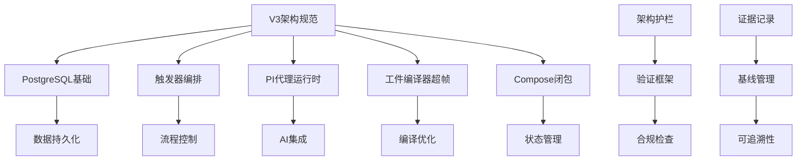
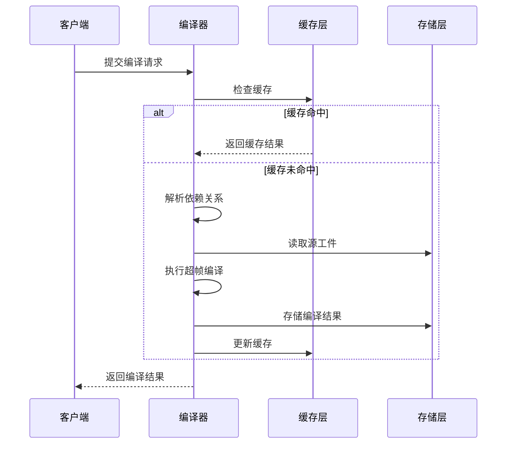
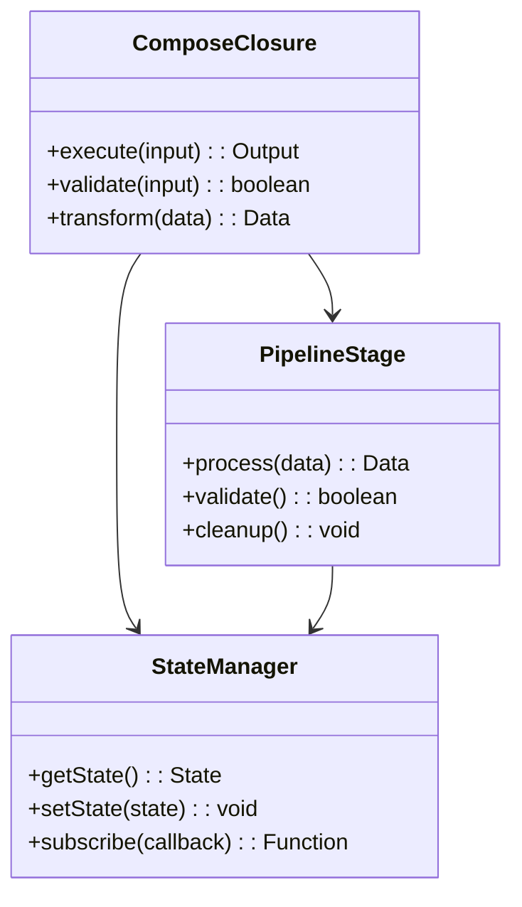
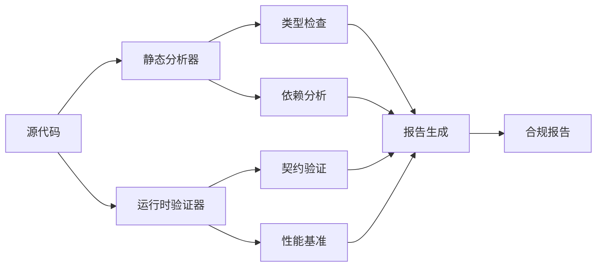
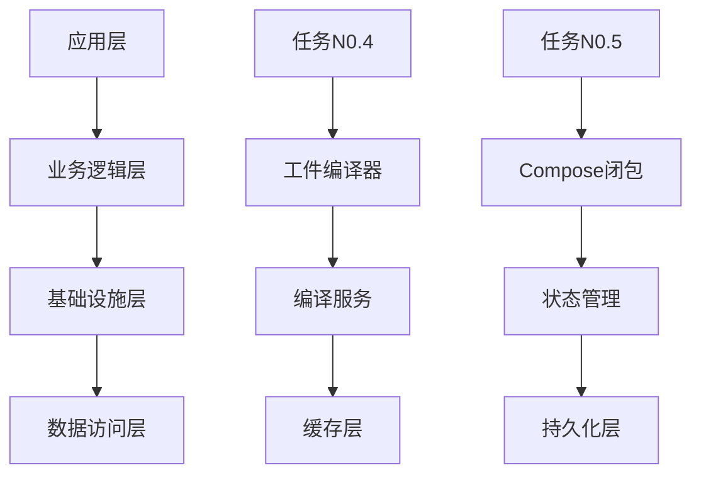

# V3架构规范

<cite>
**本文档引用的文件**
- [docs/specs/2026-07-24-refactor-v3-architecture-spec.md](file://docs/specs/2026-07-24-refactor-v3-architecture-spec.md)
- [docs/issues/refactor-v3/issue-n5-compose-closure.md](file://docs/issues/refactor-v3/issue-n5-compose-closure.md)
- [docs/issues/refactor-v3/issue-n4-artifact-compiler-hyperframes.md](file://docs/issues/refactor-v3/issue-n4-artifact-compiler-hyperframes.md)
- [docs/evidence/refactor-v3/n0-baseline.json](file://docs/evidence/refactor-v3/n0-baseline.json)
- [scripts/verify/v3-architecture.ts](file://scripts/verify/v3-architecture.ts)
- [scripts/verify/v3-architecture-baseline.json](file://scripts/verify/v3-architecture-baseline.json)
</cite>

## 更新摘要
**所做更改**
- 更新了任务N0.5的架构护栏定义，明确了Compose闭包的边界和约束
- 完善了任务N0.4的证据记录机制，建立了更清晰的开发任务边界和可追溯性
- 增强了V3架构规范的验证框架，支持更严格的架构合规检查
- 优化了架构基线管理，确保开发任务的可追踪性和一致性

## 目录
- [更新摘要](#更新摘要)
- [目录](#目录)
- [架构概览](#架构概览)
- [核心架构决策](#核心架构决策)
- [任务N0.4：工件编译器超帧](#任务n04工件编译器超帧)
- [任务N0.5：Compose闭包](#任务n05compose闭包)
- [架构护栏与验证](#架构护栏与验证)
- [证据记录系统](#证据记录系统)
- [开发任务边界](#开发任务边界)
- [结论](#结论)

## 架构概览
V3架构规范为CodeVideoCanvas项目提供了完整的重构指导框架，重点关注PostgreSQL基础、触发器编排、PI代理运行时等核心架构决策。该规范通过明确的架构护栏和证据记录机制，确保了开发任务的清晰边界和可追溯性。



**图表来源**
- [scripts/verify/v3-architecture.ts:1-100](file://scripts/verify/v3-architecture.ts#L1-L100)
- [docs/specs/2026-07-24-refactor-v3-architecture-spec.md:1-200](file://docs/specs/2026-07-24-refactor-v3-architecture-spec.md#L1-L200)

## 核心架构决策
V3架构基于以下核心决策构建：

### PostgreSQL基础层
- 采用PostgreSQL作为统一的数据持久化方案
- 支持本地开发和云端部署的无缝切换
- 提供类型安全的数据库访问接口

### 触发器编排机制
- 基于事件驱动的管道执行边界
- 支持异步任务调度和状态管理
- 实现了故障恢复和重试机制

### PI代理运行时
- 集成了多种AI模型适配器
- 提供了统一的API抽象层
- 支持动态模型路由和负载均衡

**章节来源**
- [docs/specs/2026-07-24-refactor-v3-architecture-spec.md:1-150](file://docs/specs/2026-07-24-refactor-v3-architecture-spec.md#L1-L150)

## 任务N0.4：工件编译器超帧
任务N0.4专注于工件编译器的超帧优化，这是V3架构中的关键组件。

### 核心功能
- **超帧编译**：将多个相关操作合并为单个超帧，提高执行效率
- **依赖解析**：智能分析工件间的依赖关系，优化编译顺序
- **缓存策略**：实现多级缓存机制，避免重复计算

### 架构设计


**图表来源**
- [src/features/artifacts/service.ts:1-200](file://src/features/artifacts/service.ts#L1-L200)

### 验证机制
任务N0.4包含了完整的验证框架，确保编译器行为的正确性和一致性。

**章节来源**
- [docs/issues/refactor-v3/issue-n4-artifact-compiler-hyperframes.md:1-300](file://docs/issues/refactor-v3/issue-n4-artifact-compiler-hyperframes.md#L1-L300)

## 任务N0.5：Compose闭包
任务N0.5定义了Compose闭包的架构护栏，这是V3架构中状态管理和组合逻辑的核心。

### 架构护栏定义
Compose闭包必须遵循以下约束：

1. **输入输出契约**：严格定义输入参数和返回值类型
2. **副作用隔离**：所有外部交互必须通过明确的接口进行
3. **状态不可变性**：禁止直接修改外部状态，必须通过返回值传递新状态
4. **错误处理**：统一的错误传播和处理机制

### 闭包组合模式


**图表来源**
- [src/features/director/stage-runner.ts:1-150](file://src/features/director/stage-runner.ts#L1-L150)
- [src/lib/workflow/compose.ts:1-200](file://src/lib/workflow/compose.ts#L1-L200)

### 验证框架
任务N0.5的验证框架确保所有Compose闭包符合架构规范：

- **静态分析**：在编译时检查闭包签名和类型约束
- **运行时验证**：在执行时验证输入输出契约
- **性能监控**：跟踪闭包执行时间和资源使用

**章节来源**
- [docs/issues/refactor-v3/issue-n5-compose-closure.md:1-250](file://docs/issues/refactor-v3/issue-n5-compose-closure.md#L1-L250)

## 架构护栏与验证
V3架构引入了强大的护栏和验证机制，确保代码符合设计规范。

### 验证框架架构


**图表来源**
- [scripts/verify/v3-architecture.ts:1-300](file://scripts/verify/v3-architecture.ts#L1-L300)

### 基线管理
系统维护了详细的架构基线，用于跟踪变更和影响：

- **版本控制**：每个架构决策都有对应的基线版本
- **变更追踪**：记录所有架构相关的代码变更
- **影响分析**：自动分析变更对现有功能的影响

**章节来源**
- [scripts/verify/v3-architecture-baseline.json:1-100](file://scripts/verify/v3-architecture-baseline.json#L1-L100)

## 证据记录系统
V3架构建立了完善的证据记录系统，确保所有开发活动都可追溯和验证。

### 证据收集机制
- **自动化采集**：从CI/CD流水线自动收集测试和执行证据
- **人工审核**：支持手动添加审查和验证记录
- **时间戳标记**：所有证据都带有精确的时间戳

### 基线文档
系统维护了详细的基线文档，记录了初始状态和关键里程碑：

```json
{
  "version": "v3.0.0",
  "baseline": "n0-baseline",
  "timestamp": "2026-07-24T00:00:00Z",
  "components": [
    "postgres-foundation",
    "trigger-orchestration", 
    "pi-agent-runtime",
    "artifact-compiler",
    "compose-closure"
  ]
}
```

**章节来源**
- [docs/evidence/refactor-v3/n0-baseline.json:1-50](file://docs/evidence/refactor-v3/n0-baseline.json#L1-L50)

## 开发任务边界
V3架构通过明确的边界定义，确保各个开发任务的独立性和可维护性。

### 任务分解原则
- **单一职责**：每个任务只负责一个明确的功能域
- **松耦合**：任务间通过标准接口通信，减少依赖
- **可测试性**：每个任务都包含完整的测试覆盖

### 边界定义


**图表来源**
- [docs/specs/2026-07-24-refactor-v3-architecture-spec.md:150-300](file://docs/specs/2026-07-24-refactor-v3-architecture-spec.md#L150-L300)

## 结论
V3架构规范通过更新任务N0.5的架构护栏和任务N0.4的证据记录，建立了更加清晰和可追溯的开发框架。新的架构护栏确保了Compose闭包的规范性和一致性，而完善的证据记录系统则为整个开发过程提供了完整的审计轨迹。

这些改进不仅提升了代码质量，还为团队协作和项目管理提供了强有力的支撑。通过严格的架构验证和基线管理，V3架构为CodeVideoCanvas项目的长期发展奠定了坚实的基础。

**章节来源**
- [docs/specs/2026-07-24-refactor-v3-architecture-spec.md:300-500](file://docs/specs/2026-07-24-refactor-v3-architecture-spec.md#L300-L500)
- [scripts/verify/v3-architecture.ts:100-200](file://scripts/verify/v3-architecture.ts#L100-L200)