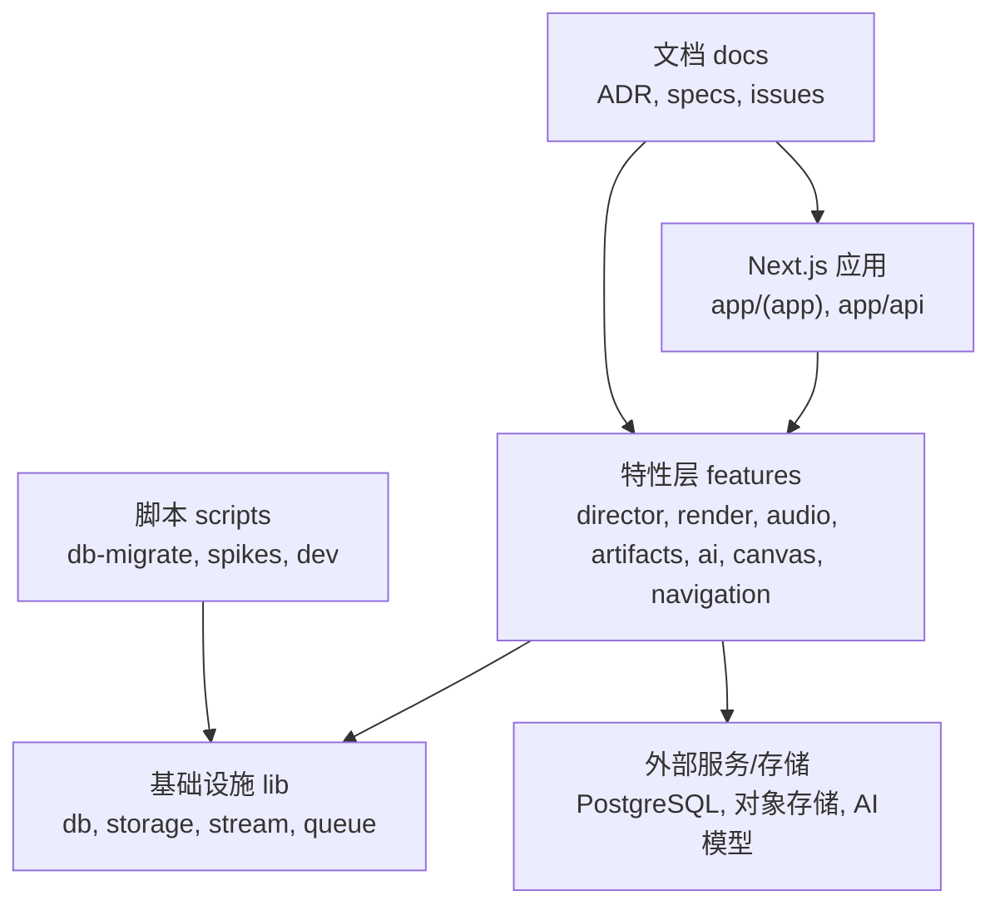
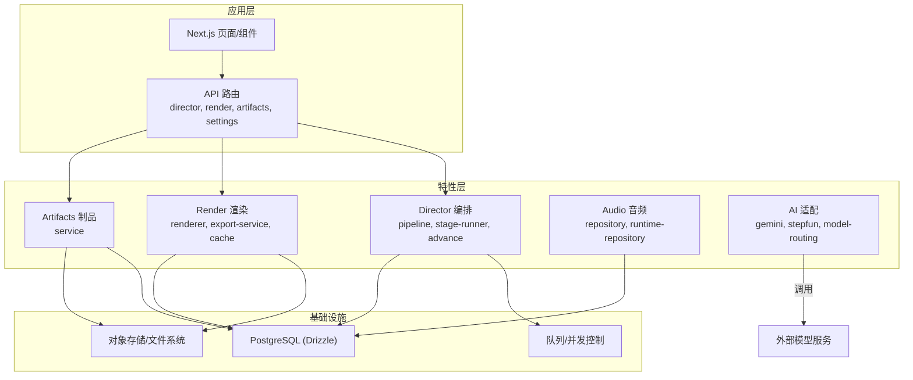
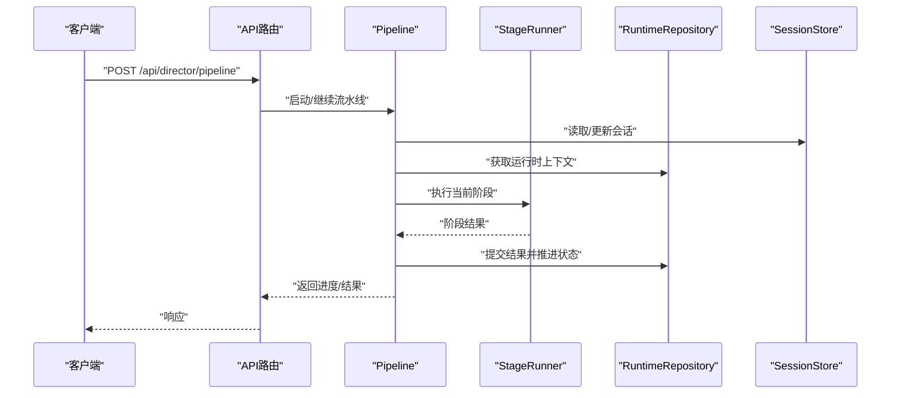
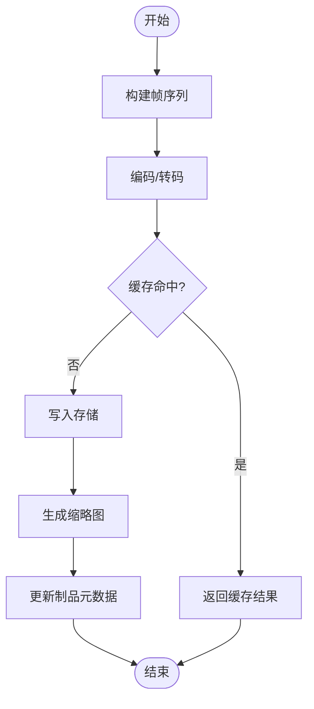
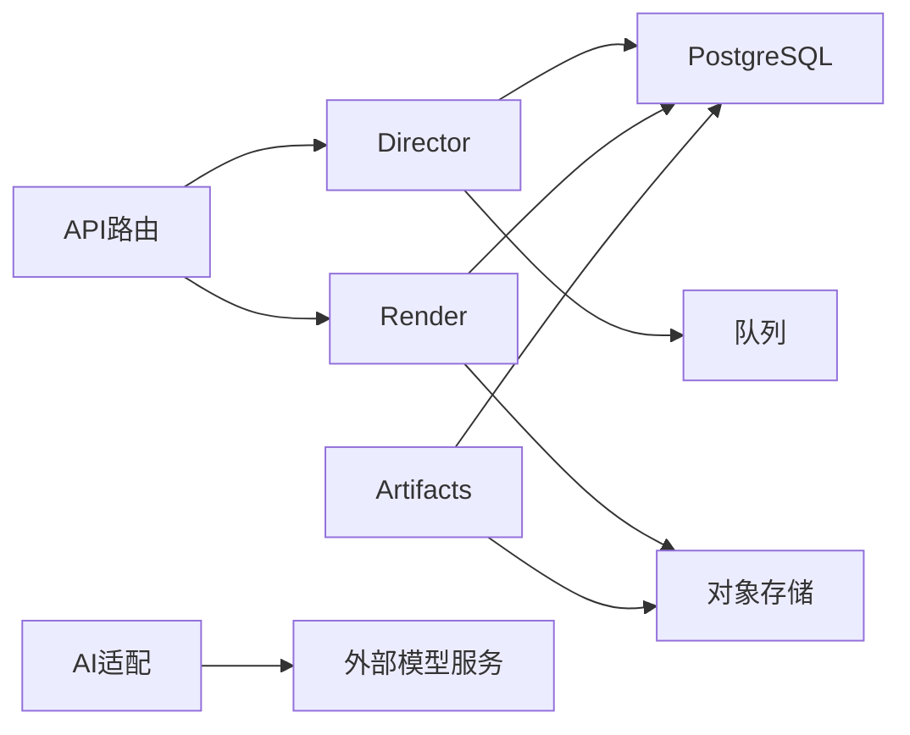

# 重构v3基础设施

<cite>
**本文引用的文件**   
- [README.md](file://README.md)
- [AGENTS.md](file://AGENTS.md)
- [package.json](file://package.json)
- [drizzle.config.ts](file://drizzle.config.ts)
- [next.config.ts](file://next.config.ts)
- [vitest.config.ts](file://vitest.config.ts)
- [specs/2026-07-24-refactor-v3-architecture-spec.md](file://docs/specs/2026-07-24-refactor-v3-architecture-spec.md)
- [specs/2026-07-24-refactor-v3-product-spec.md](file://docs/specs/2026-07-24-refactor-v3-product-spec.md)
- [specs/2026-07-24-refactor-v3-task-breakdown.md](file://docs/specs/2026-07-24-refactor-v3-task-breakdown.md)
- [issues/refactor-v3/README.md](file://docs/issues/refactor-v3/README.md)
- [issues/refactor-v3/issue-n0-baseline-and-bleeding-fixes.md](file://docs/issues/refactor-v3/issue-n0-baseline-and-bleeding-fixes.md)
- [issues/refactor-v3/issue-n1-postgres-foundation-and-spikes.md](file://docs/issues/refactor-v3/issue-n1-postgres-foundation-and-spikes.md)
- [issues/refactor-v3/issue-n2-trigger-orchestration.md](file://docs/issues/refactor-v3/issue-n2-trigger-orchestration.md)
- [issues/refactor-v3/issue-n3-pi-agent-runtime.md](file://docs/issues/refactor-v3/issue-n3-pi-agent-runtime.md)
- [issues/refactor-v3/issue-n4-artifact-compiler-hyperframes.md](file://docs/issues/refactor-v3/issue-n4-artifact-compiler-hyperframes.md)
- [issues/refactor-v3/issue-n5-compose-closure.md](file://docs/issues/refactor-v3/issue-n5-compose-closure.md)
- [issues/refactor-v3/issue-n6-ui-truth-and-governance.md](file://docs/issues/refactor-v3/issue-n6-ui-truth-and-governance.md)
- [issues/refactor-v3/issue-n7-e2e-and-cutover.md](file://docs/issues/refactor-v3/issue-n7-e2e-and-cutover.md)
- [adr/0001-postgres-local-cloud-ready.md](file://docs/adr/0001-postgres-local-cloud-ready.md)
- [adr/0002-trigger-execution-boundary.md](file://docs/adr/0002-trigger-execution边界.md)
- [adr/0003-pi-agent-runtime.md](file://docs/adr/0003-pi-agent-runtime.md)
- [adr/0004-video-compiler-hyperframes.md](file://docs/adr/0004-video-compiler-hyperframes.md)
- [src/app/api/director/pipeline/route.ts](file://src/app/api/director/pipeline/route.ts)
- [src/app/api/director/stage/route.ts](file://src/app/api/director/stage/route.ts)
- [src/app/api/director/stream/[nodeId]/route.ts](file://src/app/api/director/stream/[nodeId]/route.ts)
- [src/app/api/render/route.ts](file://src/app/api/render/route.ts)
- [src/app/api/artifacts/[id]/route.ts](file://src/app/api/artifacts/[id]/route.ts)
- [src/features/director/index.ts](file://src/features/director/index.ts)
- [src/features/director/pipeline.ts](file://src/features/director/pipeline.ts)
- [src/features/director/stage-runner.ts](file://src/features/director/stage-runner.ts)
- [src/features/director/runtime-repository.ts](file://src/features/director/runtime-repository.ts)
- [src/features/director/session-store.ts](file://src/features/director/session-store.ts)
- [src/features/director/queue-handler.ts](file://src/features/director/queue-handler.ts)
- [src/features/director/advance.ts](file://src/features/director/advance.ts)
- [src/features/director/stage-result.ts](file://src/features/director/stage-result.ts)
- [src/features/director/stage-effects.ts](file://src/features/director/stage-effects.ts)
- [src/features/director/stage-prompt.ts](file://src/features/director/stage-prompt.ts)
- [src/features/director/pi-session.ts](file://src/features/director/pi-session.ts)
- [src/features/render/renderer.ts](file://src/features/render/renderer.ts)
- [src/features/render/export-service.ts](file://src/features/render/export-service.ts)
- [src/features/render/repository.ts](file://src/features/render/repository.ts)
- [src/features/render/cache.ts](file://src/features/render/cache.ts)
- [src/lib/db/index.ts](file://src/lib/db/index.ts)
- [scripts/setup/db-migrate.ts](file://scripts/setup/db-migrate.ts)
</cite>

## 目录
1. [简介](#简介)
2. [项目结构](#项目结构)
3. [核心组件](#核心组件)
4. [架构总览](#架构总览)
5. [详细组件分析](#详细组件分析)
6. [依赖关系分析](#依赖关系分析)
7. [性能考量](#性能考量)
8. [故障排查指南](#故障排查指南)
9. [结论](#结论)
10. [附录](#附录)

## 简介
本文件面向“重构v3基础设施”的目标，系统性梳理CodeVideoCanvas在Next.js应用层、导演编排（Director）、渲染管线、数据持久化与测试体系等方面的现状与演进方向。文档基于仓库中的规范、ADR与任务分解，结合现有API路由与特性模块的实现，给出分层职责、数据流与控制流说明，并提供可操作的排障与优化建议。

## 项目结构
- 应用层：Next.js App Router组织页面与API路由，按功能域划分到app/(app)、app/api等路径。
- 特性层：features下按领域拆分（director、render、audio、artifacts、ai、canvas、navigation等），强调高内聚低耦合。
- 基础设施：lib提供通用能力（db、storage、stream、queue等），scripts提供部署与数据库迁移工具。
- 文档：docs包含ADR、设计、规范、问题清单与计划，指导重构目标与验收标准。

**图表来源** 
- [next.config.ts](file://next.config.ts)
- [package.json](file://package.json)

**章节来源**
- [README.md](file://README.md)
- [package.json](file://package.json)

## 核心组件
- 导演编排（Director）：负责阶段式流水线推进、会话状态管理、队列处理与结果提交。
- 渲染管线（Render）：封装帧序列、编码、导出、缓存与缩略图生成，提供对外API。
- 数据持久化（DB）：通过Drizzle配置与迁移脚本对接PostgreSQL，支撑本地与云端一致的数据访问。
- API路由：暴露导演、渲染、制品、设置等接口，作为前端与后端能力的统一入口。

**章节来源**
- [src/features/director/index.ts](file://src/features/director/index.ts)
- [src/features/render/index.ts](file://src/features/render/index.ts)
- [drizzle.config.ts](file://drizzle.config.ts)
- [src/app/api/director/pipeline/route.ts](file://src/app/api/director/pipeline/route.ts)
- [src/app/api/render/route.ts](file://src/app/api/render/route.ts)

## 架构总览
v3基础设施以“事件驱动+阶段编排”为核心，将AI生成、视频编译、导出与UI状态治理解耦，形成清晰的边界与可观测性。

**图表来源** 
- [src/app/api/director/pipeline/route.ts](file://src/app/api/director/pipeline/route.ts)
- [src/app/api/render/route.ts](file://src/app/api/render/route.ts)
- [src/features/director/pipeline.ts](file://src/features/director/pipeline.ts)
- [src/features/render/renderer.ts](file://src/features/render/renderer.ts)
- [drizzle.config.ts](file://drizzle.config.ts)

## 详细组件分析

### 导演编排（Director）
- 职责：维护会话与运行时上下文，解析阶段定义，调度执行器，处理副作用与结果合并，推进流水线。
- 关键流程：接收请求→校验输入→加载会话→选择阶段→执行阶段→提交结果→推进下一步。
- 错误处理：阶段失败回滚或重试，异常上报与日志记录，状态一致性保障。

**图表来源** 
- [src/app/api/director/pipeline/route.ts](file://src/app/api/director/pipeline/route.ts)
- [src/features/director/pipeline.ts](file://src/features/director/pipeline.ts)
- [src/features/director/stage-runner.ts](file://src/features/director/stage-runner.ts)
- [src/features/director/runtime-repository.ts](file://src/features/director/runtime-repository.ts)
- [src/features/director/session-store.ts](file://src/features/director/session-store.ts)

**章节来源**
- [src/features/director/pipeline.ts](file://src/features/director/pipeline.ts)
- [src/features/director/stage-runner.ts](file://src/features/director/stage-runner.ts)
- [src/features/director/advance.ts](file://src/features/director/advance.ts)
- [src/features/director/queue-handler.ts](file://src/features/director/queue-handler.ts)
- [src/features/director/stage-result.ts](file://src/features/director/stage-result.ts)
- [src/features/director/stage-effects.ts](file://src/features/director/stage-effects.ts)
- [src/features/director/stage-prompt.ts](file://src/features/director/stage-prompt.ts)
- [src/features/director/pi-session.ts](file://src/features/director/pi-session.ts)

### 渲染管线（Render）
- 职责：帧序列管理、编码导出、缓存策略、缩略图生成与QA检查。
- 关键流程：构建帧序列→编码→写入存储→生成缩略图→更新制品元数据。
- 错误处理：编码失败重试、缓存失效清理、IO异常恢复。

**图表来源** 
- [src/features/render/renderer.ts](file://src/features/render/renderer.ts)
- [src/features/render/export-service.ts](file://src/features/render/export-service.ts)
- [src/features/render/cache.ts](file://src/features/render/cache.ts)
- [src/features/render/repository.ts](file://src/features/render/repository.ts)

**章节来源**
- [src/features/render/renderer.ts](file://src/features/render/renderer.ts)
- [src/features/render/export-service.ts](file://src/features/render/export-service.ts)
- [src/features/render/cache.ts](file://src/features/render/cache.ts)
- [src/features/render/repository.ts](file://src/features/render/repository.ts)

### 制品与存储（Artifacts & Storage）
- 职责：制品生命周期管理、元数据持久化、与对象存储的适配器抽象。
- 关键点：幂等写入、版本化、跨环境一致性。

**章节来源**
- [src/features/artifacts/service.ts](file://src/features/artifacts/service.ts)
- [src/app/api/artifacts/[id]/route.ts](file://src/app/api/artifacts/[id]/route.ts)

### 数据库与迁移（DB & Migration）
- 职责：使用Drizzle进行类型安全的ORM操作，提供本地与云端一致的数据库访问；脚本执行迁移。
- 关键点：连接池、事务、索引优化、迁移回滚策略。

**章节来源**
- [drizzle.config.ts](file://drizzle.config.ts)
- [scripts/setup/db-migrate.ts](file://scripts/setup/db-migrate.ts)
- [src/lib/db/index.ts](file://src/lib/db/index.ts)

## 依赖关系分析
- 应用层依赖特性层API，特性层依赖基础设施（DB、存储、队列）。
- Director与Render之间通过制品与运行时状态解耦，避免紧耦合。
- AI适配与模型服务通过适配器模式隔离，便于扩展与替换。

**图表来源** 
- [src/app/api/director/pipeline/route.ts](file://src/app/api/director/pipeline/route.ts)
- [src/app/api/render/route.ts](file://src/app/api/render/route.ts)
- [src/features/director/runtime-repository.ts](file://src/features/director/runtime-repository.ts)
- [src/features/render/repository.ts](file://src/features/render/repository.ts)

**章节来源**
- [package.json](file://package.json)
- [next.config.ts](file://next.config.ts)

## 性能考量
- 并发与限流：队列处理器需限制并发度，避免资源争用与下游服务过载。
- 缓存策略：渲染缓存应区分粒度（帧级、片段级、成品级），提高命中率。
- I/O优化：大文件分块读写、异步I/O、压缩传输。
- 数据库：合理索引、分页查询、连接池调优。

[本节为通用指导，不直接分析具体文件]

## 故障排查指南
- 导演编排失败：检查阶段执行日志、会话状态一致性、队列积压情况。
- 渲染失败：查看编码日志、缓存失效原因、存储权限与配额。
- 数据库问题：确认连接配置、迁移状态、事务锁与慢查询。
- 外部服务：验证模型服务可用性、密钥配置与速率限制。

**章节来源**
- [src/features/director/queue-handler.ts](file://src/features/director/queue-handler.ts)
- [src/features/render/renderer.ts](file://src/features/render/renderer.ts)
- [scripts/setup/db-migrate.ts](file://scripts/setup/db-migrate.ts)

## 结论
v3基础设施重构以清晰的分层与边界为基础，强化导演编排与渲染管线的可观测性与可扩展性，配合稳定的数据持久化与测试体系，为后续AI能力集成与产品迭代提供坚实基础。建议优先完成基线修复、数据库基础与触发编排，再逐步推进PI代理运行时、超帧编译器与UI治理，最终通过E2E与切换策略确保平滑过渡。

[本节为总结性内容，不直接分析具体文件]

## 附录
- 规范与决策：参考docs/specs与docs/adr下的架构与产品规范、技术决策记录。
- 任务分解：依据docs/issues/refactor-v3下的问题清单逐项推进。
- 测试策略：使用Vitest进行单元与集成测试，覆盖关键路径与边界条件。

**章节来源**
- [specs/2026-07-24-refactor-v3-architecture-spec.md](file://docs/specs/2026-07-24-refactor-v3-architecture-spec.md)
- [specs/2026-07-24-refactor-v3-product-spec.md](file://docs/specs/2026-07-24-refactor-v3-product-spec.md)
- [specs/2026-07-24-refactor-v3-task-breakdown.md](file://docs/specs/2026-07-24-refactor-v3-task-breakdown.md)
- [issues/refactor-v3/README.md](file://docs/issues/refactor-v3/README.md)
- [vitest.config.ts](file://vitest.config.ts)