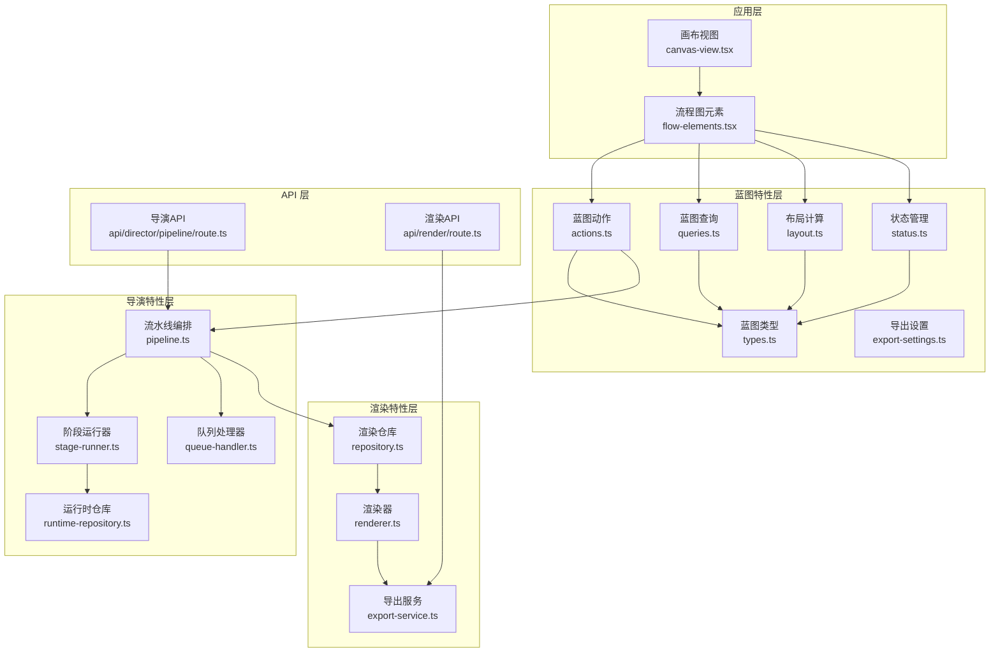
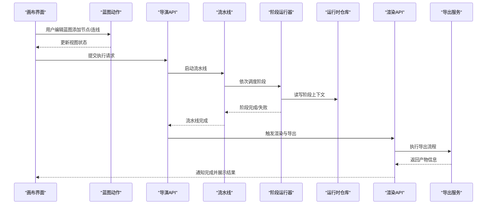
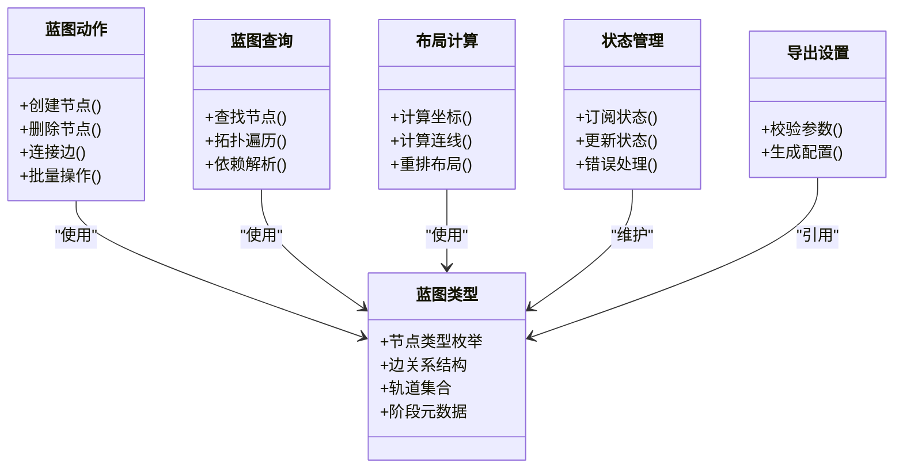
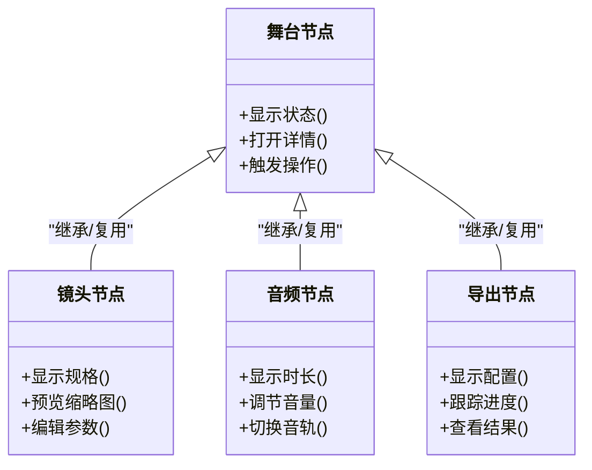
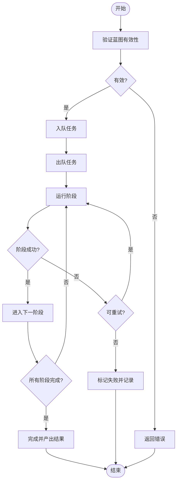
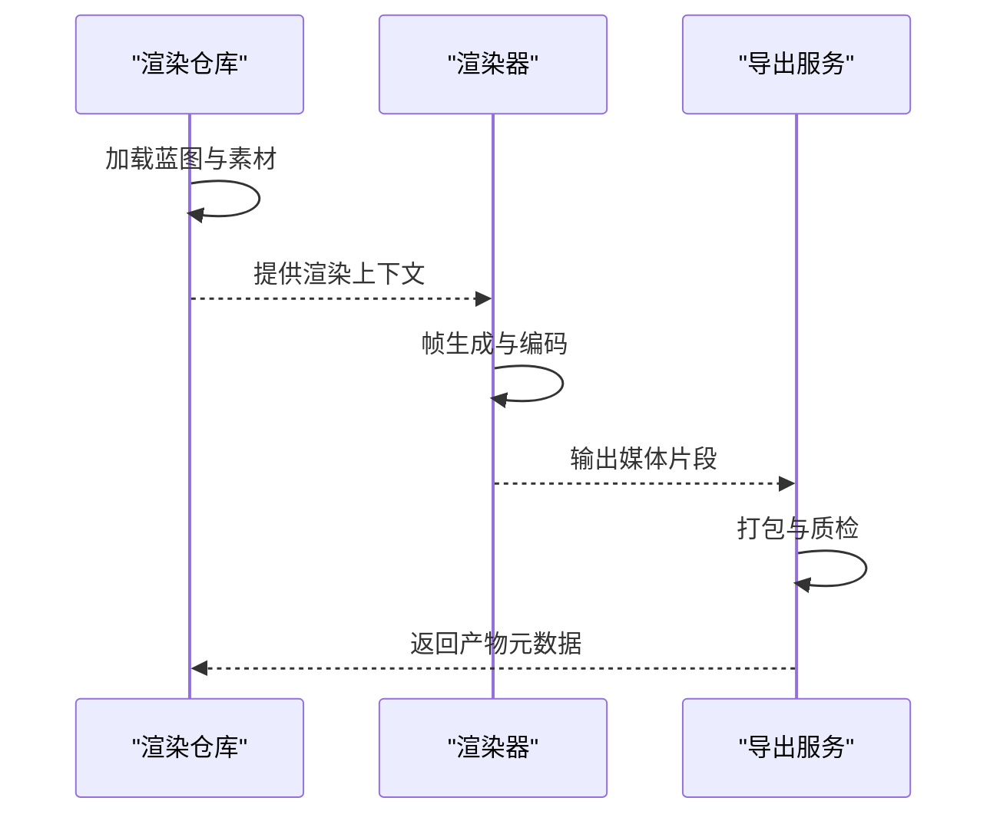
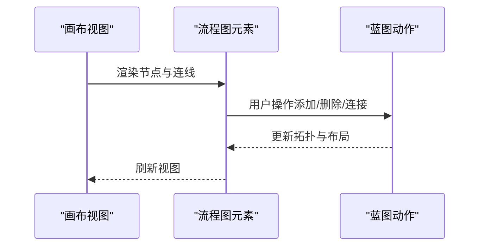
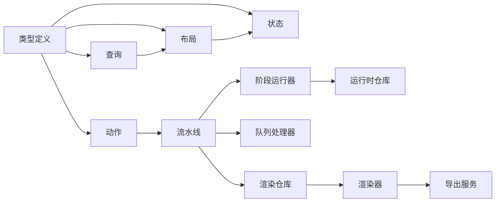

# 重构蓝图系统

<cite>
**本文引用的文件**   
- [README.md](file://README.md)
- [2026-07-24-refactor-blueprint-00-master-index.md](file://docs/plans/2026-07-24-refactor-blueprint-00-master-index.md)
- [2026-07-24-refactor-blueprint-02-target-architecture.md](file://docs/plans/2026-07-24-refactor-blueprint-02-target-architecture.md)
- [2026-07-24-refactor-blueprint-03-tracks.md](file://docs/plans/2026-07-24-refactor-blueprint-03-tracks.md)
- [canvas-view.tsx](file://src/app/(app)/canvas/canvas-view.tsx)
- [flow-elements.tsx](file://src/app/(app)/canvas/flow-elements.tsx)
- [actions.ts](file://src/features/canvas/actions.ts)
- [queries.ts](file://src/features/canvas/queries.ts)
- [types.ts](file://src/features/canvas/types.ts)
- [layout.ts](file://src/features/canvas/layout.ts)
- [status.ts](file://src/features/canvas/status.ts)
- [export-settings.ts](file://src/features/canvas/export-settings.ts)
- [stage-node.tsx](file://src/components/ui/node/stage-node.tsx)
- [shot-node.tsx](file://src/components/ui/node/shot-node.tsx)
- [audio-node.tsx](file://src/components/ui/node/audio-node.tsx)
- [export-node.tsx](file://src/components/ui/node/export-node.tsx)
- [pipeline.ts](file://src/features/director/pipeline.ts)
- [stage-runner.ts](file://src/features/director/stage-runner.ts)
- [queue-handler.ts](file://src/features/director/queue-handler.ts)
- [runtime-repository.ts](file://src/features/director/runtime-repository.ts)
- [repository.ts](file://src/features/render/repository.ts)
- [renderer.ts](file://src/features/render/renderer.ts)
- [export-service.ts](file://src/features/render/export-service.ts)
- [route.ts](file://src/app/api/director/pipeline/route.ts)
- [route.ts](file://src/app/api/render/route.ts)
</cite>

## 更新摘要
**变更内容**   
- 目标架构文档进行了重大修订（146行新增，49行删除）
- 相关蓝图文档同步更新以保持架构一致性
- 更新了架构图和组件关系以反映最新的系统设计
- 强化了导演编排与渲染服务的解耦设计

## 目录
1. [简介](#简介)
2. [项目结构](#项目结构)
3. [核心组件](#核心组件)
4. [架构总览](#架构总览)
5. [详细组件分析](#详细组件分析)
6. [依赖关系分析](#依赖关系分析)
7. [性能考量](#性能考量)
8. [故障排查指南](#故障排查指南)
9. [结论](#结论)
10. [附录](#附录)

## 简介
本文件面向"重构蓝图系统"的目标，基于仓库中的计划文档与现有代码，梳理当前画布（Canvas）与导演（Director）、渲染（Render）子系统之间的关系，明确重构目标、边界与演进路径。重点包括：
- 蓝图数据模型与状态机
- 轨道（Tracks）与节点（Nodes）的可视化与交互
- 执行管线（Pipeline）与阶段（Stage）编排
- 渲染服务与导出流程
- API 层与前后端协作契约

**更新** 根据最新的目标架构文档修订，强化了系统的分层架构设计和模块解耦原则。

## 项目结构
从仓库结构看，蓝图相关能力分布在以下层次：
- 应用路由与页面：位于 src/app/(app)/canvas 下的页面与视图组件
- 功能模块：features/canvas 提供蓝图数据、查询、动作、布局与状态；features/director 负责导演编排；features/render 负责渲染与导出
- UI 组件：components/ui/node 提供节点可视化组件
- API 路由：src/app/api 暴露导演与渲染接口

**图表来源**
- [canvas-view.tsx](file://src/app/(app)/canvas/canvas-view.tsx)
- [flow-elements.tsx](file://src/app/(app)/canvas/flow-elements.tsx)
- [actions.ts](file://src/features/canvas/actions.ts)
- [queries.ts](file://src/features/canvas/queries.ts)
- [types.ts](file://src/features/canvas/types.ts)
- [layout.ts](file://src/features/canvas/layout.ts)
- [status.ts](file://src/features/canvas/status.ts)
- [export-settings.ts](file://src/features/canvas/export-settings.ts)
- [pipeline.ts](file://src/features/director/pipeline.ts)
- [stage-runner.ts](file://src/features/director/stage-runner.ts)
- [queue-handler.ts](file://src/features/director/queue-handler.ts)
- [runtime-repository.ts](file://src/features/director/runtime-repository.ts)
- [repository.ts](file://src/features/render/repository.ts)
- [renderer.ts](file://src/features/render/renderer.ts)
- [export-service.ts](file://src/features/render/export-service.ts)
- [route.ts](file://src/app/api/director/pipeline/route.ts)
- [route.ts](file://src/app/api/render/route.ts)

**章节来源**
- [README.md](file://README.md)
- [2026-07-24-refactor-blueprint-00-master-index.md](file://docs/plans/2026-07-24-refactor-blueprint-00-master-index.md)
- [2026-07-24-refactor-blueprint-02-target-architecture.md](file://docs/plans/2026-07-24-refactor-blueprint-02-target-architecture.md)
- [2026-07-24-refactor-blueprint-03-tracks.md](file://docs/plans/2026-07-24-refactor-blueprint-03-tracks.md)

## 核心组件
- 蓝图数据与状态
  - 类型定义：集中描述蓝图节点、边、轨道、阶段等数据结构
  - 查询与动作：对蓝图进行增删改查、连接断开、批量操作
  - 布局与状态：计算节点位置、连线拓扑、整体状态（就绪/运行/失败）
  - 导出设置：封装导出参数与校验
- 导演编排
  - 流水线：将多个阶段按顺序或条件组合执行
  - 阶段运行器：驱动单个阶段的输入输出、错误处理与重试
  - 队列处理器：任务入队、出队、并发控制与进度上报
  - 运行时仓库：持久化阶段结果、中间产物与上下文
- 渲染与导出
  - 渲染仓库：读取蓝图与素材，准备渲染上下文
  - 渲染器：帧生成、编码、合成
  - 导出服务：打包产物、缩略图生成、质量检查

**更新** 根据目标架构文档的最新修订，强化了各组件间的职责分离和接口标准化。

**章节来源**
- [types.ts](file://src/features/canvas/types.ts)
- [actions.ts](file://src/features/canvas/actions.ts)
- [queries.ts](file://src/features/canvas/queries.ts)
- [layout.ts](file://src/features/canvas/layout.ts)
- [status.ts](file://src/features/canvas/status.ts)
- [export-settings.ts](file://src/features/canvas/export-settings.ts)
- [pipeline.ts](file://src/features/director/pipeline.ts)
- [stage-runner.ts](file://src/features/director/stage-runner.ts)
- [queue-handler.ts](file://src/features/director/queue-handler.ts)
- [runtime-repository.ts](file://src/features/director/runtime-repository.ts)
- [repository.ts](file://src/features/render/repository.ts)
- [renderer.ts](file://src/features/render/renderer.ts)
- [export-service.ts](file://src/features/render/export-service.ts)

## 架构总览
蓝图系统采用"前端可视化 + 后端编排 + 渲染服务"的分层架构。前端通过蓝图动作与查询维护状态，并通过 API 触发导演与渲染流程；后端以流水线为核心，串联各阶段，最终由渲染服务产出可交付产物。

**更新** 架构设计经过重大修订，增强了模块间的解耦性和可扩展性。

**图表来源**
- [actions.ts](file://src/features/canvas/actions.ts)
- [route.ts](file://src/app/api/director/pipeline/route.ts)
- [pipeline.ts](file://src/features/director/pipeline.ts)
- [stage-runner.ts](file://src/features/director/stage-runner.ts)
- [runtime-repository.ts](file://src/features/director/runtime-repository.ts)
- [route.ts](file://src/app/api/render/route.ts)
- [export-service.ts](file://src/features/render/export-service.ts)

## 详细组件分析

### 蓝图数据与状态（Types、Actions、Queries、Layout、Status、ExportSettings）
- 类型体系：统一描述节点类型（如舞台、镜头、音频、导出）、边关系、轨道集合、阶段元数据
- 动作层：封装创建、删除、移动、连接、批量操作等命令式调用，保证状态一致性
- 查询层：提供按条件检索、拓扑遍历、依赖解析等只读操作
- 布局层：根据节点属性与约束计算坐标、层级、连线折点
- 状态层：维护全局状态（如是否运行中、错误码、进度），对外暴露订阅接口
- 导出设置：校验分辨率、帧率、编码参数，生成标准化配置

**图表来源**
- [types.ts](file://src/features/canvas/types.ts)
- [actions.ts](file://src/features/canvas/actions.ts)
- [queries.ts](file://src/features/canvas/queries.ts)
- [layout.ts](file://src/features/canvas/layout.ts)
- [status.ts](file://src/features/canvas/status.ts)
- [export-settings.ts](file://src/features/canvas/export-settings.ts)

**章节来源**
- [types.ts](file://src/features/canvas/types.ts)
- [actions.ts](file://src/features/canvas/actions.ts)
- [queries.ts](file://src/features/canvas/queries.ts)
- [layout.ts](file://src/features/canvas/layout.ts)
- [status.ts](file://src/features/canvas/status.ts)
- [export-settings.ts](file://src/features/canvas/export-settings.ts)

### 节点可视化（StageNode、ShotNode、AudioNode、ExportNode）
- 舞台节点：展示阶段元数据、状态指示、快捷操作入口
- 镜头节点：显示镜头规格、输入输出、预览缩略图
- 音频节点：展示音轨、时长、音量控制
- 导出节点：显示导出配置、进度条、结果链接

**图表来源**
- [stage-node.tsx](file://src/components/ui/node/stage-node.tsx)
- [shot-node.tsx](file://src/components/ui/node/shot-node.tsx)
- [audio-node.tsx](file://src/components/ui/node/audio-node.tsx)
- [export-node.tsx](file://src/components/ui/node/export-node.tsx)

**章节来源**
- [stage-node.tsx](file://src/components/ui/node/stage-node.tsx)
- [shot-node.tsx](file://src/components/ui/node/shot-node.tsx)
- [audio-node.tsx](file://src/components/ui/node/audio-node.tsx)
- [export-node.tsx](file://src/components/ui/node/export-node.tsx)

### 导演编排（Pipeline、StageRunner、QueueHandler、RuntimeRepository）
- 流水线：定义阶段序列、条件分支、并行度、回滚策略
- 阶段运行器：执行阶段逻辑、捕获异常、重试与超时控制
- 队列处理器：任务优先级、并发限制、进度事件流
- 运行时仓库：持久化阶段输入输出、中间产物、上下文快照

**图表来源**
- [pipeline.ts](file://src/features/director/pipeline.ts)
- [stage-runner.ts](file://src/features/director/stage-runner.ts)
- [queue-handler.ts](file://src/features/director/queue-handler.ts)
- [runtime-repository.ts](file://src/features/director/runtime-repository.ts)

**章节来源**
- [pipeline.ts](file://src/features/director/pipeline.ts)
- [stage-runner.ts](file://src/features/director/stage-runner.ts)
- [queue-handler.ts](file://src/features/director/queue-handler.ts)
- [runtime-repository.ts](file://src/features/director/runtime-repository.ts)

### 渲染与导出（Repository、Renderer、ExportService）
- 渲染仓库：读取蓝图、素材与配置，构建渲染上下文
- 渲染器：帧抓取、编码、合成、质量检查
- 导出服务：打包产物、生成缩略图、上传存储、返回结果

**图表来源**
- [repository.ts](file://src/features/render/repository.ts)
- [renderer.ts](file://src/features/render/renderer.ts)
- [export-service.ts](file://src/features/render/export-service.ts)

**章节来源**
- [repository.ts](file://src/features/render/repository.ts)
- [renderer.ts](file://src/features/render/renderer.ts)
- [export-service.ts](file://src/features/render/export-service.ts)

### 视图与交互（CanvasView、FlowElements）
- 画布视图：承载节点渲染、拖拽、缩放、选择
- 流程图元素：连线绘制、锚点交互、实时反馈

**图表来源**
- [canvas-view.tsx](file://src/app/(app)/canvas/canvas-view.tsx)
- [flow-elements.tsx](file://src/app/(app)/canvas/flow-elements.tsx)
- [actions.ts](file://src/features/canvas/actions.ts)

**章节来源**
- [canvas-view.tsx](file://src/app/(app)/canvas/canvas-view.tsx)
- [flow-elements.tsx](file://src/app/(app)/canvas/flow-elements.tsx)
- [actions.ts](file://src/features/canvas/actions.ts)

## 依赖关系分析
- 蓝图特性层依赖类型定义，动作与查询围绕类型展开；布局与状态依赖类型与动作结果
- 导演编排依赖运行时仓库与队列处理器，阶段运行器作为执行单元
- 渲染服务依赖渲染仓库与渲染器，导出服务聚合产物
- API 层作为边界，协调前端与后端能力

**更新** 依赖关系经过优化，减少了循环依赖，增强了模块独立性。

**图表来源**
- [types.ts](file://src/features/canvas/types.ts)
- [actions.ts](file://src/features/canvas/actions.ts)
- [queries.ts](file://src/features/canvas/queries.ts)
- [layout.ts](file://src/features/canvas/layout.ts)
- [status.ts](file://src/features/canvas/status.ts)
- [pipeline.ts](file://src/features/director/pipeline.ts)
- [stage-runner.ts](file://src/features/director/stage-runner.ts)
- [queue-handler.ts](file://src/features/director/queue-handler.ts)
- [runtime-repository.ts](file://src/features/director/runtime-repository.ts)
- [repository.ts](file://src/features/render/repository.ts)
- [renderer.ts](file://src/features/render/renderer.ts)
- [export-service.ts](file://src/features/render/export-service.ts)

**章节来源**
- [types.ts](file://src/features/canvas/types.ts)
- [actions.ts](file://src/features/canvas/actions.ts)
- [queries.ts](file://src/features/canvas/queries.ts)
- [layout.ts](file://src/features/canvas/layout.ts)
- [status.ts](file://src/features/canvas/status.ts)
- [pipeline.ts](file://src/features/director/pipeline.ts)
- [stage-runner.ts](file://src/features/director/stage-runner.ts)
- [queue-handler.ts](file://src/features/director/queue-handler.ts)
- [runtime-repository.ts](file://src/features/director/runtime-repository.ts)
- [repository.ts](file://src/features/render/repository.ts)
- [renderer.ts](file://src/features/render/renderer.ts)
- [export-service.ts](file://src/features/render/export-service.ts)

## 性能考量
- 蓝图布局计算：避免在高频交互中重复计算，采用增量更新与缓存
- 阶段运行器：合理设置重试次数与超时时间，防止阻塞队列
- 渲染器：分帧处理与并行编码，减少内存峰值
- 导出服务：异步打包与流式写入，提升吞吐
- 状态管理：最小化重渲染范围，按需订阅状态变化

**更新** 根据新的架构设计，进一步优化了性能关键路径和资源管理策略。

## 故障排查指南
- 蓝图无效：检查节点类型、边关系与依赖解析
- 阶段失败：查看阶段日志、输入输出与运行时上下文
- 队列积压：检查并发限制与任务优先级
- 渲染失败：确认素材可用性、编码参数与存储空间
- 导出失败：核对打包配置与产物完整性

**更新** 新增了针对新架构设计的故障排查要点和监控指标。

**章节来源**
- [status.ts](file://src/features/canvas/status.ts)
- [stage-runner.ts](file://src/features/director/stage-runner.ts)
- [queue-handler.ts](file://src/features/director/queue-handler.ts)
- [renderer.ts](file://src/features/render/renderer.ts)
- [export-service.ts](file://src/features/render/export-service.ts)

## 结论
通过对蓝图数据、导演编排与渲染导出的分层解耦，系统具备可扩展性与可维护性。下一步应聚焦于：
- 完善蓝图类型与校验规则
- 强化阶段运行器的容错与可观测性
- 优化渲染与导出的性能与稳定性
- 统一 API 契约与错误语义

**更新** 基于最新的目标架构文档，明确了后续演进方向和关键技术决策。

## 附录
- 计划文档索引：包含目标架构、轨道设计等关键规划
- 参考实现：节点组件、动作与查询、流水线与渲染服务

**更新** 增加了新的架构设计文档和实现指南的引用。

**章节来源**
- [2026-07-24-refactor-blueprint-00-master-index.md](file://docs/plans/2026-07-24-refactor-blueprint-00-master-index.md)
- [2026-07-24-refactor-blueprint-02-target-architecture.md](file://docs/plans/2026-07-24-refactor-blueprint-02-target-architecture.md)
- [2026-07-24-refactor-blueprint-03-tracks.md](file://docs/plans/2026-07-24-refactor-blueprint-03-tracks.md)