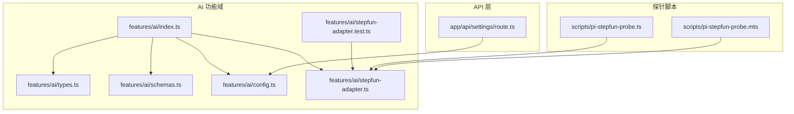
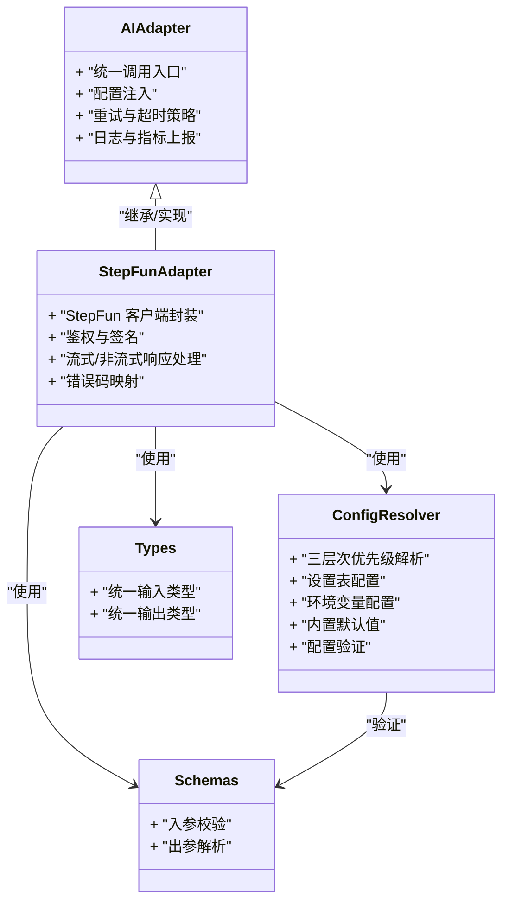
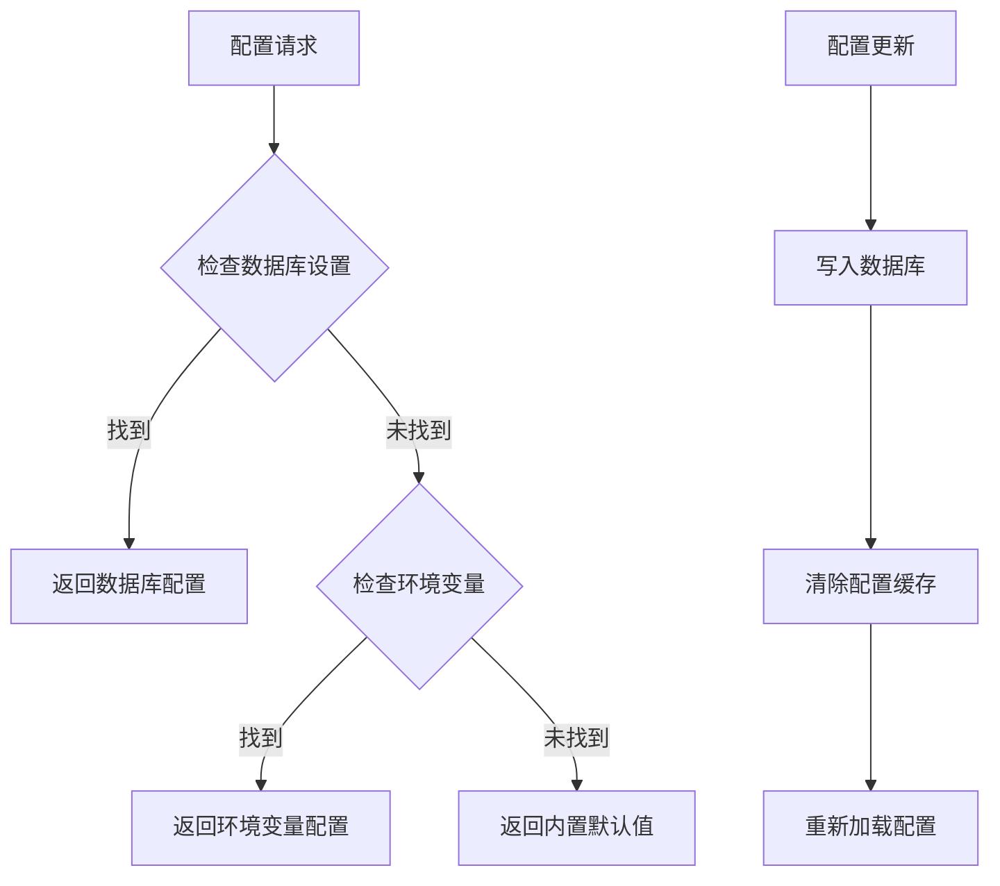
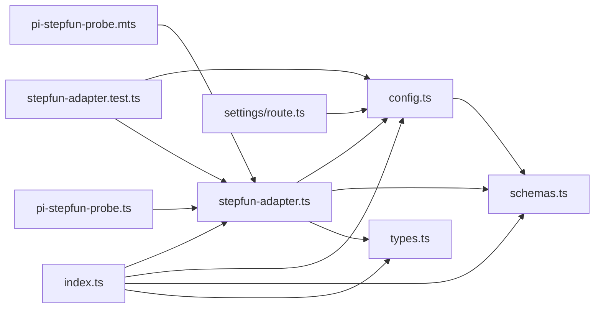

# AI 服务集成

<cite>
**本文引用的文件**   
- [src/features/ai/index.ts](file://src/features/ai/index.ts)
- [src/features/ai/types.ts](file://src/features/ai/types.ts)
- [src/features/ai/schemas.ts](file://src/features/ai/schemas.ts)
- [src/features/ai/config.ts](file://src/features/ai/config.ts)
- [src/features/ai/stepfun-adapter.ts](file://src/features/ai/stepfun-adapter.ts)
- [src/features/ai/stepfun-adapter.test.ts](file://src/features/ai/stepfun-adapter.test.ts)
- [src/app/api/settings/route.ts](file://src/app/api/settings/route.ts)
- [scripts/pi-stepfun-probe.mts](file://scripts/pi-stepfun-probe.mts)
- [scripts/pi-stepfun-probe.ts](file://scripts/pi-stepfun-probe.ts)
</cite>

## 更新摘要
**所做更改**   
- 新增集中式配置解析器章节，详细说明三层次优先级系统（设置表 > 环境变量 > 内置默认值）
- 更新配置管理架构，引入 config.ts 文件的统一配置解析逻辑
- 扩展 Settings API 文档，说明六字段契约和源标签功能
- 增强配置注入与依赖注入模式的说明
- 更新适配器初始化流程，包含新的配置加载机制

## 目录
1. [简介](#简介)
2. [项目结构](#项目结构)
3. [核心组件](#核心组件)
4. [架构总览](#架构总览)
5. [详细组件分析](#详细组件分析)
6. [配置管理系统](#配置管理系统)
7. [依赖关系分析](#依赖关系分析)
8. [性能与可靠性](#性能与可靠性)
9. [故障排查指南](#故障排查指南)
10. [结论](#结论)
11. [附录：扩展新 AI 提供商指南](#附录扩展新-ai-提供商指南)

## 简介
本文件面向 CodeVideoCanvas 的 AI 服务集成，重点阐述适配器模式在统一多厂商 AI 能力中的实现方式，并围绕 StepFun AI 服务的接入进行深度解析。文档涵盖以下主题：
- 适配器模式的设计思路与统一接口抽象
- StepFunAdapter 的具体实现逻辑与数据模型
- 请求/响应数据模型定义与校验策略
- **新增** 集中式配置管理系统与三层次优先级解析
- 调用示例、异步响应处理、错误重试与超时控制
- 提示词工程最佳实践、响应解析策略与安全性考虑
- 扩展新的 AI 服务提供商的完整步骤与测试方法

## 项目结构
AI 相关代码集中在 features/ai 模块中，并通过 scripts 下的探针脚本用于快速验证 StepFun 连通性。新增的 config.ts 文件提供统一的配置解析能力。



图表来源
- [src/features/ai/index.ts](file://src/features/ai/index.ts)
- [src/features/ai/types.ts](file://src/features/ai/types.ts)
- [src/features/ai/schemas.ts](file://src/features/ai/schemas.ts)
- [src/features/ai/config.ts](file://src/features/ai/config.ts)
- [src/features/ai/stepfun-adapter.ts](file://src/features/ai/stepfun-adapter.ts)
- [src/features/ai/stepfun-adapter.test.ts](file://src/features/ai/stepfun-adapter.test.ts)
- [src/app/api/settings/route.ts](file://src/app/api/settings/route.ts)
- [scripts/pi-stepfun-probe.ts](file://scripts/pi-stepfun-probe.ts)
- [scripts/pi-stepfun-probe.mts](file://scripts/pi-stepfun-probe.mts)

章节来源
- [src/features/ai/index.ts](file://src/features/ai/index.ts)
- [src/features/ai/types.ts](file://src/features/ai/types.ts)
- [src/features/ai/schemas.ts](file://src/features/ai/schemas.ts)
- [src/features/ai/config.ts](file://src/features/ai/config.ts)
- [src/features/ai/stepfun-adapter.ts](file://src/features/ai/stepfun-adapter.ts)
- [src/features/ai/stepfun-adapter.test.ts](file://src/features/ai/stepfun-adapter.test.ts)
- [src/app/api/settings/route.ts](file://src/app/api/settings/route.ts)
- [scripts/pi-stepfun-probe.ts](file://scripts/pi-stepfun-probe.ts)
- [scripts/pi-stepfun-probe.mts](file://scripts/pi-stepfun-probe.mts)

## 核心组件
- 统一类型与契约：通过 types.ts 定义跨适配器的通用输入输出类型，确保上层业务无需感知具体厂商差异。
- 数据模型与校验：schemas.ts 使用运行时校验（如 zod）对入参与出参进行强约束，提升健壮性与可维护性。
- **新增** 集中式配置解析器：config.ts 实现三层次优先级配置系统，支持设置表、环境变量和内置默认值的统一管理。
- 适配器抽象与实现：index.ts 导出统一入口；stepfun-adapter.ts 提供 StepFun 的具体实现，遵循统一接口。
- 测试与探针：stepfun-adapter.test.ts 覆盖关键路径；探针脚本用于端到端连通性验证。

章节来源
- [src/features/ai/types.ts](file://src/features/ai/types.ts)
- [src/features/ai/schemas.ts](file://src/features/ai/schemas.ts)
- [src/features/ai/config.ts](file://src/features/ai/config.ts)
- [src/features/ai/index.ts](file://src/features/ai/index.ts)
- [src/features/ai/stepfun-adapter.ts](file://src/features/ai/stepfun-adapter.ts)
- [src/features/ai/stepfun-adapter.test.ts](file://src/features/ai/stepfun-adapter.test.ts)

## 架构总览
整体采用"适配器模式"将不同 AI 供应商的能力收敛到统一接口，上层仅依赖抽象类型与契约，屏蔽底层差异。StepFun 作为首个实现，后续可按相同范式扩展其他厂商。新增的配置管理系统提供了灵活的配置注入机制。



图表来源
- [src/features/ai/types.ts](file://src/features/ai/types.ts)
- [src/features/ai/schemas.ts](file://src/features/ai/schemas.ts)
- [src/features/ai/config.ts](file://src/features/ai/config.ts)
- [src/features/ai/stepfun-adapter.ts](file://src/features/ai/stepfun-adapter.ts)

## 详细组件分析

### 统一类型与数据模型（types.ts / schemas.ts）
- 设计目标
  - 为所有 AI 适配器提供一致的输入/输出契约，避免上层耦合具体厂商 API。
  - 通过 schema 在运行时完成参数校验与结构化解析，降低异常分支复杂度。
- 关键要点
  - 输入模型：包含提示词、上下文、可选参数（如温度、最大长度等）。
  - 输出模型：包含文本结果、元信息、错误码与诊断字段。
  - 校验策略：严格模式优先，失败时返回明确的结构化错误，便于重试与降级。
- 建议
  - 新增字段时同步更新 schema，保持前后端一致。
  - 对敏感字段（如密钥）禁止进入日志与追踪。

章节来源
- [src/features/ai/types.ts](file://src/features/ai/types.ts)
- [src/features/ai/schemas.ts](file://src/features/ai/schemas.ts)

### 集中式配置解析器（config.ts）
- **新增** 三层次优先级系统
  - 最高优先级：数据库设置表配置（用户自定义设置）
  - 中等优先级：环境变量配置（部署环境配置）
  - 最低优先级：内置默认值（系统默认配置）
- 核心功能
  - 配置合并：按优先级顺序合并多层配置
  - 类型验证：确保配置项符合预期类型和格式
  - 缓存机制：避免重复解析带来的性能开销
  - 热重载：支持运行时配置更新
- 配置项管理
  - 统一的配置键命名规范
  - 配置项分组与命名空间
  - 敏感配置的加密存储
- 使用场景
  - 适配器初始化时的配置注入
  - 运行时动态配置调整
  - 多环境配置管理

章节来源
- [src/features/ai/config.ts](file://src/features/ai/config.ts)

### StepFun 适配器实现（stepfun-adapter.ts）
- 职责边界
  - 负责与 StepFun 服务端通信，包括鉴权、请求构造、响应解析与错误映射。
  - 暴露与统一接口一致的调用方法，支持同步与异步（流式）两种模式。
- 关键流程
  - 初始化：加载配置（如 API Key、Base URL、超时、重试次数）。
  - 构建请求：根据统一输入模型转换为 StepFun 所需格式。
  - 发送请求：支持普通 HTTP 或 SSE/流式通道。
  - 解析响应：按 schema 解析并转换为统一输出模型。
  - 错误处理：将 StepFun 错误码映射为内部错误类型，附带重试建议。
- **已更新** 密钥验证策略改进
  - 原方案：使用 `models.list()` 端点进行密钥有效性验证
  - 新方案：改用 `chat.completions.create()` 探测调用进行验证
  - 改进原因：解决了有效 API 密钥被错误拒绝的问题，提高了密钥验证的准确性
  - 验证流程：发送轻量级聊天补全请求，检查响应状态而非模型列表获取
- 注意事项
  - 幂等键：对可重试操作生成稳定幂等键，避免重复提交。
  - 限流与退避：结合指数退避与抖动，避免雪崩。
  - 资源释放：流式响应需确保连接关闭与内存回收。

章节来源
- [src/features/ai/stepfun-adapter.ts](file://src/features/ai/stepfun-adapter.ts)

### 统一入口与装配（index.ts）
- 作用
  - 聚合导出统一类型、schema、配置解析器与适配器实例，供上层模块按需引入。
  - 提供工厂或单例获取方式，便于注入配置与中间件（如日志、埋点）。
- 使用建议
  - 在应用启动阶段完成配置注入与预热。
  - 对外只暴露最小必要 API，隐藏实现细节。
  - 支持配置的热重载和动态更新。

章节来源
- [src/features/ai/index.ts](file://src/features/ai/index.ts)

### Settings API 扩展（route.ts）
- **新增** 六字段契约支持
  - 配置键名（key）：唯一标识符
  - 配置值（value）：实际配置内容
  - 配置类型（type）：数据类型定义
  - 是否必填（required）：配置强制性
  - 描述信息（description）：配置用途说明
  - 创建时间（createdAt）：记录创建时间戳
- 源标签功能
  - 标识配置来源（database、environment、default）
  - 支持配置溯源和审计
  - 便于调试和问题定位
- API 端点
  - GET /api/settings：获取所有配置
  - PUT /api/settings：更新配置
  - POST /api/settings：新增配置
  - DELETE /api/settings/:id：删除配置

章节来源
- [src/app/api/settings/route.ts](file://src/app/api/settings/route.ts)

### 测试与探针（stepfun-adapter.test.ts / pi-stepfun-probe.*）
- 单元测试
  - 覆盖正常路径、错误路径、超时与重试场景。
  - 使用 mock 隔离外部依赖，保证确定性。
  - **已更新** 包含新的密钥验证策略测试用例，验证 chat.completions.create() 探测调用。
  - **新增** 配置解析器测试用例，验证三层次优先级逻辑。
- 探针脚本
  - 提供最小化的端到端连通性检查，便于 CI 与部署后自检。
  - 支持 TS 与 MTS 双入口，兼容不同运行环境。
  - **已更新** 探针脚本已适配新的密钥验证机制。

章节来源
- [src/features/ai/stepfun-adapter.test.ts](file://src/features/ai/stepfun-adapter.test.ts)
- [scripts/pi-stepfun-probe.ts](file://scripts/pi-stepfun-probe.ts)
- [scripts/pi-stepfun-probe.mts](file://scripts/pi-stepfun-probe.mts)

## 配置管理系统
**新增** 本节详细介绍新的集中式配置管理系统。

### 三层次优先级架构


图表来源
- [src/features/ai/config.ts](file://src/features/ai/config.ts)

### 配置解析流程
1. **配置收集**：从三个来源收集配置项
2. **优先级排序**：按设置表 > 环境变量 > 内置默认值排序
3. **冲突解决**：高优先级配置覆盖低优先级配置
4. **类型验证**：确保配置项符合预期类型
5. **缓存存储**：将解析后的配置缓存到内存
6. **事件通知**：触发配置变更事件

### 配置项示例
```typescript
interface AIConfig {
  apiKey: string;           // API 密钥
  baseUrl: string;          // 基础 URL
  timeout: number;          // 超时时间（毫秒）
  retryAttempts: number;    // 重试次数
  model: string;            // 模型名称
  temperature: number;      // 温度参数
}
```

章节来源
- [src/features/ai/config.ts](file://src/features/ai/config.ts)
- [src/app/api/settings/route.ts](file://src/app/api/settings/route.ts)

## 依赖关系分析
- 模块内依赖
  - index.ts 依赖 types.ts、schemas.ts、config.ts 与 stepfun-adapter.ts。
  - stepfun-adapter.ts 依赖 types.ts、schemas.ts 与 config.ts。
  - config.ts 依赖 schemas.ts 进行配置验证。
  - 测试与探针依赖 stepfun-adapter.ts 与 config.ts。
- 外部依赖
  - StepFun SDK 或 HTTP 客户端（由适配器内部封装）。
  - 校验库（如 zod）用于 schema 校验。
  - 数据库客户端（用于设置表配置读取）。
- 潜在风险
  - 若适配器直接引用上层业务类型，可能导致循环依赖，应通过 types.ts 解耦。
  - 第三方 SDK 升级可能破坏契约，需在测试中覆盖兼容性用例。
  - 配置解析器需要处理各种异常情况，确保系统稳定性。



图表来源
- [src/features/ai/index.ts](file://src/features/ai/index.ts)
- [src/features/ai/types.ts](file://src/features/ai/types.ts)
- [src/features/ai/schemas.ts](file://src/features/ai/schemas.ts)
- [src/features/ai/config.ts](file://src/features/ai/config.ts)
- [src/features/ai/stepfun-adapter.ts](file://src/features/ai/stepfun-adapter.ts)
- [src/features/ai/stepfun-adapter.test.ts](file://src/features/ai/stepfun-adapter.test.ts)
- [src/app/api/settings/route.ts](file://src/app/api/settings/route.ts)
- [scripts/pi-stepfun-probe.ts](file://scripts/pi-stepfun-probe.ts)
- [scripts/pi-stepfun-probe.mts](file://scripts/pi-stepfun-probe.mts)

## 性能与可靠性
- 超时控制
  - 为网络 I/O 设置合理超时，避免长尾请求拖垮系统。
  - 区分"首字节延迟"和"总耗时"，分别监控。
- 重试与退避
  - 仅对幂等且可恢复的错误进行重试。
  - 使用指数退避+随机抖动，限制最大重试次数与总时长。
- 并发与背压
  - 对高并发场景增加队列与令牌桶限流，保护下游服务。
  - 流式响应优先，减少大对象驻留内存。
- 缓存与去重
  - 对相同输入（含幂等键）的结果做短期缓存，降低重复调用成本。
  - **新增** 配置解析结果缓存，避免重复解析带来的性能损耗。
- 观测性
  - 记录关键指标：QPS、P95/P99 延迟、错误率、重试率、超时率。
  - 对慢请求采样打点，定位瓶颈。
  - **新增** 配置变更监控和审计日志。

[本节为通用指导，不直接分析具体文件]

## 故障排查指南
- 常见问题
  - 鉴权失败：检查密钥、签名算法与时间戳。
  - **已更新** 密钥验证失败：确认使用的是 chat.completions.create() 探测调用而非 models.list() 端点。
  - **新增** 配置加载失败：检查三层次优先级配置是否正确设置。
  - 超时：确认网络链路、远端服务状态与超时阈值。
  - 限流：观察 429 错误，调整重试间隔与并发度。
  - 解析失败：核对 schema 版本与上游变更。
- 定位手段
  - 启用调试日志（脱敏），关注请求 ID 与错误堆栈。
  - 使用探针脚本复现问题，缩小范围。
  - 对比成功与失败请求的差异（参数、头部、负载大小）。
  - **新增** 检查配置解析日志，确认配置来源和优先级。
- 恢复策略
  - 自动重试（带退避）、熔断与降级（返回默认内容或占位符）。
  - 告警通知与人工介入流程。
  - **新增** 配置回滚机制，支持快速恢复到上一个稳定版本。

章节来源
- [src/features/ai/stepfun-adapter.test.ts](file://src/features/ai/stepfun-adapter.test.ts)
- [scripts/pi-stepfun-probe.ts](file://scripts/pi-stepfun-probe.ts)
- [scripts/pi-stepfun-probe.mts](file://scripts/pi-stepfun-probe.mts)
- [src/features/ai/config.ts](file://src/features/ai/config.ts)

## 结论
通过适配器模式，CodeVideoCanvas 实现了与 StepFun AI 服务的平滑集成，并以统一接口屏蔽了厂商差异。配合严格的类型与 schema 校验、完善的测试与探针，系统在可扩展性、稳定性与可观测性方面具备良好基础。密钥验证策略的改进进一步提升了系统的可靠性和用户体验。**新增的集中式配置管理系统**提供了灵活的配置注入机制，支持三层次优先级和热重载功能，为系统的可维护性和灵活性提供了坚实基础。后续可按相同范式快速接入更多 AI 提供商。

[本节为总结性内容，不直接分析具体文件]

## 附录：扩展新 AI 提供商指南
- 步骤概览
  1. 在 types.ts 中补充必要的输入/输出字段（如需）。
  2. 在 schemas.ts 中新增对应 schema 与校验规则。
  3. **新增** 在 config.ts 中注册新的配置项和默认值。
  4. 新建适配器实现类，遵循统一接口约定。
  5. 在 index.ts 中注册并提供工厂方法。
  6. 编写单元测试与探针用例，覆盖正常、异常与边界场景。
- 关键实现要点
  - 鉴权与签名：遵循目标厂商规范，安全存储密钥。
  - **已更新** 密钥验证：参考 StepFun 适配器的改进方案，使用实际的 API 调用进行验证而非元数据查询。
  - **新增** 配置管理：在配置系统中注册新提供商的配置项，设置合理的默认值和验证规则。
  - 请求构造：将统一输入模型映射为目标 API 所需格式。
  - 响应解析：严格按 schema 解析，失败时抛出结构化错误。
  - 错误映射：将厂商错误码映射为内部错误类型，便于统一处理。
  - 重试与超时：复用统一的策略与中间件。
- 测试建议
  - Mock 网络层，断言请求结构与响应转换。
  - 使用探针脚本在预发环境进行真实连通性验证。
  - 回归测试覆盖 schema 变更带来的影响。
  - **已更新** 包含密钥验证策略的测试用例，确保验证逻辑的正确性。
  - **新增** 配置解析测试，验证三层次优先级逻辑的正确性。

章节来源
- [src/features/ai/types.ts](file://src/features/ai/types.ts)
- [src/features/ai/schemas.ts](file://src/features/ai/schemas.ts)
- [src/features/ai/config.ts](file://src/features/ai/config.ts)
- [src/features/ai/index.ts](file://src/features/ai/index.ts)
- [src/features/ai/stepfun-adapter.ts](file://src/features/ai/stepfun-adapter.ts)
- [src/features/ai/stepfun-adapter.test.ts](file://src/features/ai/stepfun-adapter.test.ts)
- [scripts/pi-stepfun-probe.ts](file://scripts/pi-stepfun-probe.ts)
- [scripts/pi-stepfun-probe.mts](file://scripts/pi-stepfun-probe.mts)