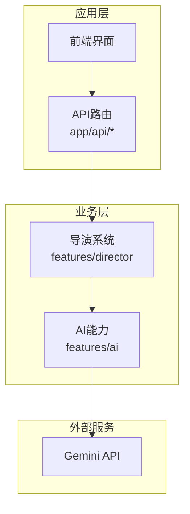
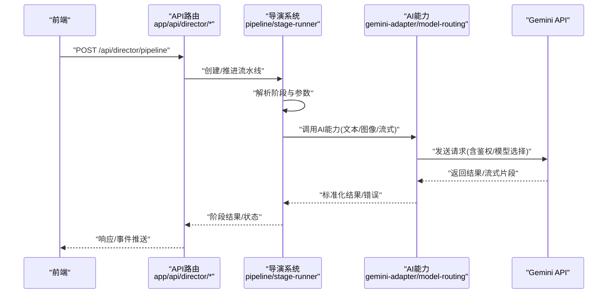
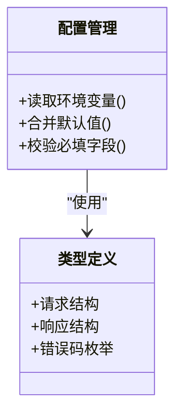
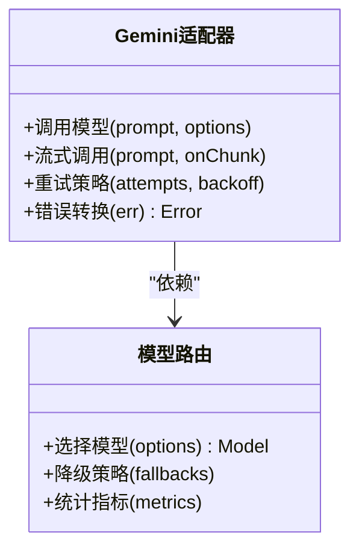
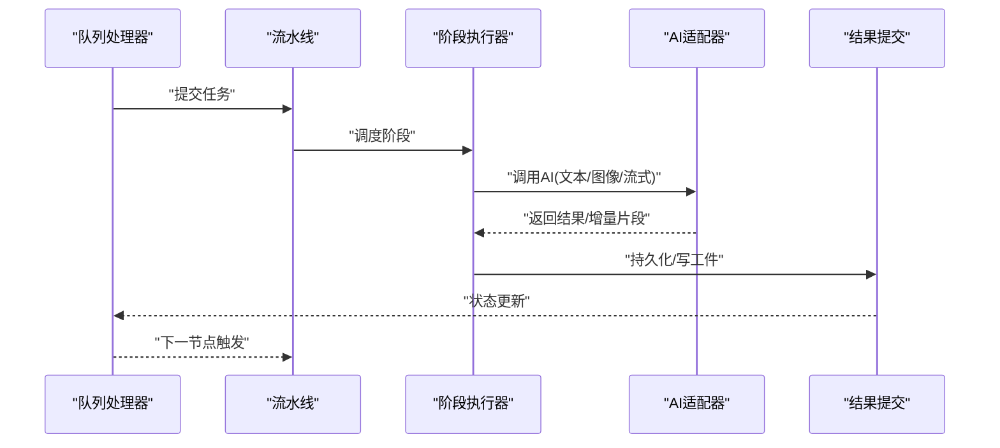
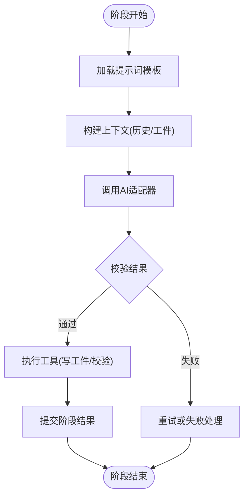
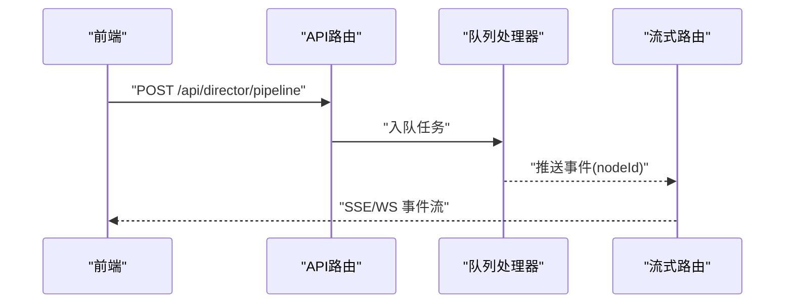
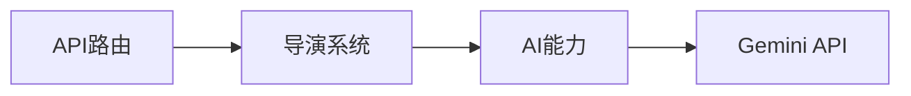

# Gemini AI集成

<cite>
**本文引用的文件**   
- [src/features/ai/gemini-adapter.ts](file://src/features/ai/gemini-adapter.ts)
- [src/features/ai/gemini-config.ts](file://src/features/ai/gemini-config.ts)
- [src/features/ai/model-routing.ts](file://src/features/ai/model-routing.ts)
- [src/features/ai/config.ts](file://src/features/ai/config.ts)
- [src/features/ai/types.ts](file://src/features/ai/types.ts)
- [src/features/ai/index.ts](file://src/features/ai/index.ts)
- [src/app/api/director/pipeline/route.ts](file://src/app/api/director/pipeline/route.ts)
- [src/app/api/director/stage/route.ts](file://src/app/api/director/stage/route.ts)
- [src/app/api/director/stream/[nodeId]/route.ts](file://src/app/api/director/stream/[nodeId]/route.ts)
- [src/features/director/pipeline.ts](file://src/features/director/pipeline.ts)
- [src/features/director/stage-runner.ts](file://src/features/director/stage-runner.ts)
- [src/features/director/pi-session.ts](file://src/features/director/pi-session.ts)
- [src/features/director/queue-handler.ts](file://src/features/director/queue-handler.ts)
- [src/features/director/runtime-repository.ts](file://src/features/director/runtime-repository.ts)
- [src/features/director/session-store.ts](file://src/features/director/session-store.ts)
- [src/features/director/stage-effects.ts](file://src/features/director/stage-effects.ts)
- [src/features/director/stage-result.ts](file://src/features/director/stage-result.ts)
- [src/features/director/stage-prompt.ts](file://src/features/director/stage-prompt.ts)
- [src/features/director/tools/write-artifact.ts](file://src/features/director/tools/write-artifact.ts)
- [src/features/director/tools/validate-shot-plan.ts](file://src/features/director/tools/validate-shot-plan.ts)
- [src/features/director/prompts/direct.ts](file://src/features/director/prompts/direct.ts)
- [src/features/director/prompts/fabricate.ts](file://src/features/director/prompts/fabricate.ts)
- [src/features/director/prompts/assemble.ts](file://src/features/director/prompts/assemble.ts)
- [src/features/director/prompts/finalize.ts](file://src/features/director/prompts/finalize.ts)
- [src/features/director/prompts/ingest.ts](file://src/features/director/prompts/ingest.ts)
- [src/features/director/prompts/shot-spec.ts](file://src/features/director/prompts/shot-spec.ts)
</cite>

## 目录
1. [简介](#简介)
2. [项目结构](#项目结构)
3. [核心组件](#核心组件)
4. [架构总览](#架构总览)
5. [详细组件分析](#详细组件分析)
6. [依赖关系分析](#依赖关系分析)
7. [性能考量](#性能考量)
8. [故障排查指南](#故障排查指南)
9. [结论](#结论)
10. [附录](#附录)

## 简介
本文件聚焦于项目中与Gemini AI集成的设计与实现，涵盖配置、适配器、模型路由以及导演管线（Director Pipeline）中的调用流程。文档面向不同技术背景的读者，提供从高层架构到代码级细节的分层说明，并辅以可视化图示帮助理解数据流与控制流。

## 项目结构
Gemini相关能力集中在 features/ai 模块中，并通过 app/api 下的服务端路由暴露给前端；导演管线位于 features/director，负责编排AI阶段、工具与结果处理。整体采用“功能域分层 + API路由”的组织方式：
- features/ai：AI能力抽象与具体实现（配置、适配器、路由、类型定义）
- app/api：Next.js API路由，作为外部入口
- features/director：导演系统，编排阶段、会话、队列、运行时存储等

[本图为概念性结构图，不直接映射具体源码文件]

## 核心组件
- 配置与校验
  - gemini-config：加载与校验Gemini相关配置（如密钥、模型名、区域等）
  - config：通用AI配置聚合与默认值管理
  - types：统一类型定义（请求/响应、错误、回调等）
- 适配器与路由
  - gemini-adapter：封装对Gemini的HTTP/SDK调用，处理鉴权、重试、流式输出等
  - model-routing：根据策略选择具体模型或端点，支持多模型切换与降级
- 集成入口
  - index：对外导出统一的AI能力接口，供上层使用

**章节来源**
- [src/features/ai/gemini-config.ts](file://src/features/ai/gemini-config.ts)
- [src/features/ai/config.ts](file://src/features/ai/config.ts)
- [src/features/ai/types.ts](file://src/features/ai/types.ts)
- [src/features/ai/gemini-adapter.ts](file://src/features/ai/gemini-adapter.ts)
- [src/features/ai/model-routing.ts](file://src/features/ai/model-routing.ts)
- [src/features/ai/index.ts](file://src/features/ai/index.ts)

## 架构总览
Gemini集成在系统中的位置如下：
- 前端通过 app/api 路由发起请求
- 路由进入 features/director 的流水线/阶段处理器
- 导演系统根据阶段需求调用 features/ai 的适配器
- 适配器通过 model-routing 选择模型，最终与Gemini交互

**图表来源**
- [src/app/api/director/pipeline/route.ts](file://src/app/api/director/pipeline/route.ts)
- [src/app/api/director/stage/route.ts](file://src/app/api/director/stage/route.ts)
- [src/app/api/director/stream/[nodeId]/route.ts](file://src/app/api/director/stream/[nodeId]/route.ts)
- [src/features/director/pipeline.ts](file://src/features/director/pipeline.ts)
- [src/features/director/stage-runner.ts](file://src/features/director/stage-runner.ts)
- [src/features/ai/gemini-adapter.ts](file://src/features/ai/gemini-adapter.ts)
- [src/features/ai/model-routing.ts](file://src/features/ai/model-routing.ts)

## 详细组件分析

### 配置与类型（config, gemini-config, types）
- 职责
  - 集中管理Gemini相关环境变量与默认值
  - 提供强类型约束，确保请求/响应结构一致
  - 暴露配置校验与合并逻辑，便于测试与多环境部署
- 关键点
  - 敏感信息（如API Key）应通过安全渠道注入
  - 配置变更需触发必要的缓存失效或连接重建
  - 类型定义需覆盖异常分支（超时、限流、格式错误）

**图表来源**
- [src/features/ai/config.ts](file://src/features/ai/config.ts)
- [src/features/ai/gemini-config.ts](file://src/features/ai/gemini-config.ts)
- [src/features/ai/types.ts](file://src/features/ai/types.ts)

**章节来源**
- [src/features/ai/config.ts](file://src/features/ai/config.ts)
- [src/features/ai/gemini-config.ts](file://src/features/ai/gemini-config.ts)
- [src/features/ai/types.ts](file://src/features/ai/types.ts)

### 适配器与模型路由（gemini-adapter, model-routing）
- 职责
  - 封装对Gemini的具体调用（REST/SDK），包括鉴权、重试、超时、流式处理
  - 根据策略选择模型（按成本、延迟、能力维度），支持回退与A/B
- 关键点
  - 适配器需屏蔽底层差异，向上提供统一接口
  - 路由策略可配置化，支持动态更新
  - 流式输出需保证顺序与完整性

**图表来源**
- [src/features/ai/gemini-adapter.ts](file://src/features/ai/gemini-adapter.ts)
- [src/features/ai/model-routing.ts](file://src/features/ai/model-routing.ts)

**章节来源**
- [src/features/ai/gemini-adapter.ts](file://src/features/ai/gemini-adapter.ts)
- [src/features/ai/model-routing.ts](file://src/features/ai/model-routing.ts)

### 导演系统与AI集成（pipeline, stage-runner, pi-session, queue-handler）
- 职责
  - pipeline：编排阶段序列，维护上下文与状态
  - stage-runner：执行单个阶段，处理输入/输出、工具调用、副作用
  - pi-session：管理AI会话上下文（消息历史、工具绑定）
  - queue-handler：任务入队、并发控制、重试与取消
- 关键点
  - 阶段间数据契约需严格校验
  - 工具（如write-artifact、validate-shot-plan）需幂等与安全
  - 流式进度通过 stream 路由推送至前端

**图表来源**
- [src/features/director/pipeline.ts](file://src/features/director/pipeline.ts)
- [src/features/director/stage-runner.ts](file://src/features/director/stage-runner.ts)
- [src/features/director/pi-session.ts](file://src/features/director/pi-session.ts)
- [src/features/director/queue-handler.ts](file://src/features/director/queue-handler.ts)
- [src/features/director/runtime-repository.ts](file://src/features/director/runtime-repository.ts)
- [src/features/director/session-store.ts](file://src/features/director/session-store.ts)
- [src/features/director/stage-effects.ts](file://src/features/director/stage-effects.ts)
- [src/features/director/stage-result.ts](file://src/features/director/stage-result.ts)

**章节来源**
- [src/features/director/pipeline.ts](file://src/features/director/pipeline.ts)
- [src/features/director/stage-runner.ts](file://src/features/director/stage-runner.ts)
- [src/features/director/pi-session.ts](file://src/features/director/pi-session.ts)
- [src/features/director/queue-handler.ts](file://src/features/director/queue-handler.ts)
- [src/features/director/runtime-repository.ts](file://src/features/director/runtime-repository.ts)
- [src/features/director/session-store.ts](file://src/features/director/session-store.ts)
- [src/features/director/stage-effects.ts](file://src/features/director/stage-effects.ts)
- [src/features/director/stage-result.ts](file://src/features/director/stage-result.ts)

### 提示词与工具（prompts, tools）
- 提示词
  - direct/fabricate/assemble/finalize/ingest/shot-spec：分阶段的提示模板与约束
- 工具
  - write-artifact：将中间产物写入存储
  - validate-shot-plan：校验分镜计划一致性
- 关键点
  - 提示词需版本化管理，避免破坏性变更
  - 工具需具备幂等性与审计日志

**图表来源**
- [src/features/director/prompts/direct.ts](file://src/features/director/prompts/direct.ts)
- [src/features/director/prompts/fabricate.ts](file://src/features/director/prompts/fabricate.ts)
- [src/features/director/prompts/assemble.ts](file://src/features/director/prompts/assemble.ts)
- [src/features/director/prompts/finalize.ts](file://src/features/director/prompts/finalize.ts)
- [src/features/director/prompts/ingest.ts](file://src/features/director/prompts/ingest.ts)
- [src/features/director/prompts/shot-spec.ts](file://src/features/director/prompts/shot-spec.ts)
- [src/features/director/tools/write-artifact.ts](file://src/features/director/tools/write-artifact.ts)
- [src/features/director/tools/validate-shot-plan.ts](file://src/features/director/tools/validate-shot-plan.ts)

**章节来源**
- [src/features/director/prompts/direct.ts](file://src/features/director/prompts/direct.ts)
- [src/features/director/prompts/fabricate.ts](file://src/features/director/prompts/fabricate.ts)
- [src/features/director/prompts/assemble.ts](file://src/features/director/prompts/assemble.ts)
- [src/features/director/prompts/finalize.ts](file://src/features/director/prompts/finalize.ts)
- [src/features/director/prompts/ingest.ts](file://src/features/director/prompts/ingest.ts)
- [src/features/director/prompts/shot-spec.ts](file://src/features/director/prompts/shot-spec.ts)
- [src/features/director/tools/write-artifact.ts](file://src/features/director/tools/write-artifact.ts)
- [src/features/director/tools/validate-shot-plan.ts](file://src/features/director/tools/validate-shot-plan.ts)

### API路由与流式推送（app/api/director/*）
- 职责
  - 接收前端请求，校验参数，委派给导演系统
  - 提供流式事件通道，实时反馈阶段进度
- 关键点
  - 路由需做输入校验与权限检查
  - 流式传输需处理断线重连与背压

**图表来源**
- [src/app/api/director/pipeline/route.ts](file://src/app/api/director/pipeline/route.ts)
- [src/app/api/director/stage/route.ts](file://src/app/api/director/stage/route.ts)
- [src/app/api/director/stream/[nodeId]/route.ts](file://src/app/api/director/stream/[nodeId]/route.ts)

**章节来源**
- [src/app/api/director/pipeline/route.ts](file://src/app/api/director/pipeline/route.ts)
- [src/app/api/director/stage/route.ts](file://src/app/api/director/stage/route.ts)
- [src/app/api/director/stream/[nodeId]/route.ts](file://src/app/api/director/stream/[nodeId]/route.ts)

## 依赖关系分析
- 内聚与耦合
  - features/ai 高内聚，对外仅暴露稳定接口
  - features/director 依赖 features/ai，但不感知底层实现细节
- 外部依赖
  - Gemini API：网络稳定性、限流策略、计费模型
- 潜在循环依赖
  - 通过类型与接口解耦，避免直接导入实现

**图表来源**
- [src/app/api/director/pipeline/route.ts](file://src/app/api/director/pipeline/route.ts)
- [src/features/director/pipeline.ts](file://src/features/director/pipeline.ts)
- [src/features/ai/gemini-adapter.ts](file://src/features/ai/gemini-adapter.ts)

**章节来源**
- [src/app/api/director/pipeline/route.ts](file://src/app/api/director/pipeline/route.ts)
- [src/features/director/pipeline.ts](file://src/features/director/pipeline.ts)
- [src/features/ai/gemini-adapter.ts](file://src/features/ai/gemini-adapter.ts)

## 性能考量
- 流式处理：优先使用流式API减少首字节延迟
- 重试与退避：指数退避+抖动，避免雪崩
- 缓存与会话：复用上下文，减少重复计算
- 资源限制：并发度、超时、内存上限需可配置
- 监控与指标：调用次数、时延、错误率、配额使用

[本节为通用指导，无需特定文件引用]

## 故障排查指南
- 常见问题
  - 鉴权失败：检查密钥、区域、权限范围
  - 模型不可用：确认模型名称、配额、地区可用性
  - 流式中断：检查网络、代理、后端超时设置
  - 结果不一致：核对提示词版本、随机种子、工具幂等性
- 定位步骤
  - 查看API路由日志与入参校验结果
  - 检查队列状态与重试计数
  - 追踪AI适配器调用链路与错误码
  - 验证阶段结果与工件写入是否成功

**章节来源**
- [src/app/api/director/pipeline/route.ts](file://src/app/api/director/pipeline/route.ts)
- [src/features/director/queue-handler.ts](file://src/features/director/queue-handler.ts)
- [src/features/ai/gemini-adapter.ts](file://src/features/ai/gemini-adapter.ts)
- [src/features/director/stage-result.ts](file://src/features/director/stage-result.ts)

## 结论
本项目通过清晰的模块化设计将Gemini AI能力与导演管线解耦，提供了可扩展、可观测、可配置的集成方案。建议在生产环境中完善监控告警、限流熔断与灰度发布机制，以保障稳定性与成本可控。

[本节为总结性内容，无需特定文件引用]

## 附录
- 术语表
  - 流水线：由多个阶段组成的端到端处理流程
  - 阶段：流水线中的一个原子步骤，包含输入、处理与输出
  - 工件：阶段产生的中间或最终产物
  - 会话：与AI模型的上下文对话状态
- 最佳实践
  - 配置与代码分离，敏感信息不入仓
  - 提示词版本化与回归测试
  - 工具幂等与审计日志
  - 错误分类与用户友好提示

[本节为补充信息，无需特定文件引用]