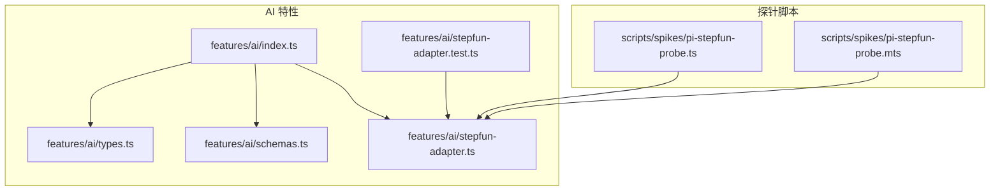
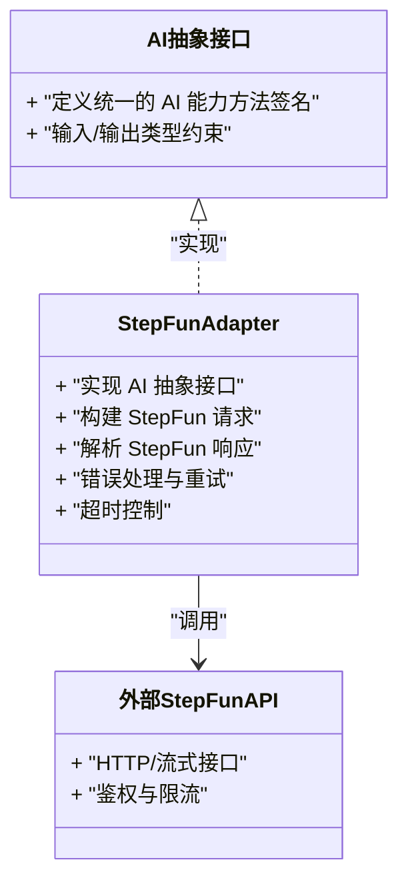
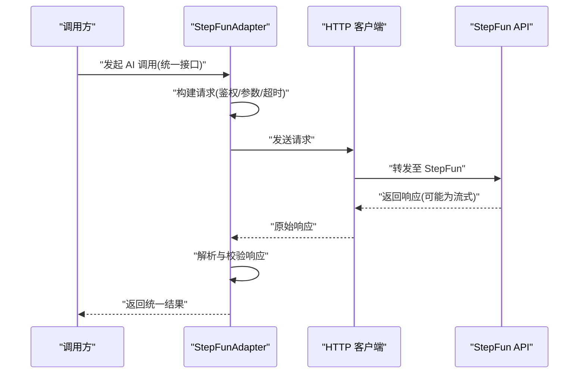
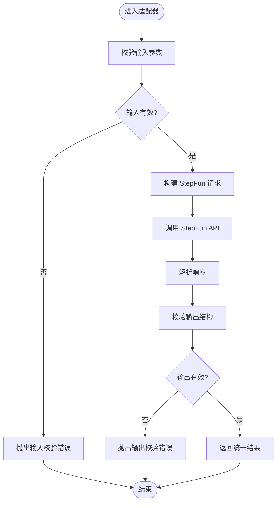
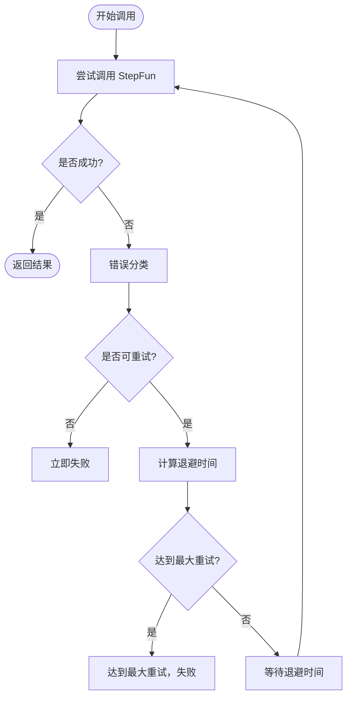
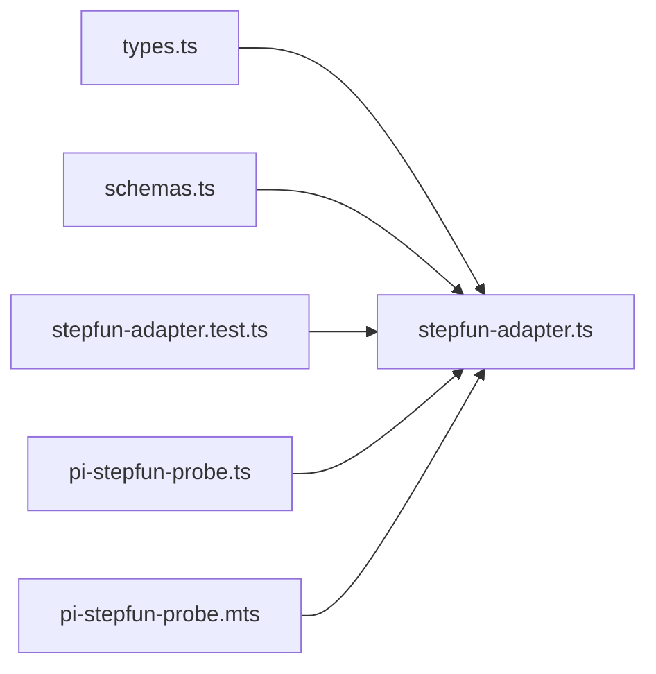

# AI 服务集成

<cite>
**本文引用的文件**   
- [src/features/ai/index.ts](file://src/features/ai/index.ts)
- [src/features/ai/types.ts](file://src/features/ai/types.ts)
- [src/features/ai/schemas.ts](file://src/features/ai/schemas.ts)
- [src/features/ai/stepfun-adapter.ts](file://src/features/ai/stepfun-adapter.ts)
- [src/features/ai/stepfun-adapter.test.ts](file://src/features/ai/stepfun-adapter.test.ts)
- [scripts/spikes/pi-stepfun-probe.mts](file://scripts/spikes/pi-stepfun-probe.mts)
- [scripts/spikes/pi-stepfun-probe.ts](file://scripts/spikes/pi-stepfun-probe.ts)
</cite>

## 目录
1. [简介](#简介)
2. [项目结构](#项目结构)
3. [核心组件](#核心组件)
4. [架构总览](#架构总览)
5. [详细组件分析](#详细组件分析)
6. [依赖关系分析](#依赖关系分析)
7. [性能与成本优化](#性能与成本优化)
8. [故障排查指南](#故障排查指南)
9. [结论](#结论)
10. [附录：示例与最佳实践](#附录示例与最佳实践)

## 简介
本文件面向导演系统的 AI 服务集成模块，重点说明 StepFunAdapter 的适配器模式实现、AI 数据类型定义与校验规则、请求构建与响应解析流程、错误处理与重试策略、超时控制机制，并提供调用示例、异步响应处理与自定义适配器的扩展方法。文档同时给出性能优化与成本控制建议，帮助在保障稳定性的前提下提升吞吐并降低调用成本。

## 项目结构
AI 相关代码集中在 features/ai 目录，包含类型定义、Schema 校验、StepFun 适配器及其测试；spikes 目录下提供用于探测 StepFun 能力的脚本样例。

图表来源
- [src/features/ai/index.ts](file://src/features/ai/index.ts)
- [src/features/ai/types.ts](file://src/features/ai/types.ts)
- [src/features/ai/schemas.ts](file://src/features/ai/schemas.ts)
- [src/features/ai/stepfun-adapter.ts](file://src/features/ai/stepfun-adapter.ts)
- [src/features/ai/stepfun-adapter.test.ts](file://src/features/ai/stepfun-adapter.test.ts)
- [scripts/spikes/pi-stepfun-probe.ts](file://scripts/spikes/pi-stepfun-probe.ts)
- [scripts/spikes/pi-stepfun-probe.mts](file://scripts/spikes/pi-stepfun-probe.mts)

章节来源
- [src/features/ai/index.ts](file://src/features/ai/index.ts)
- [src/features/ai/types.ts](file://src/features/ai/types.ts)
- [src/features/ai/schemas.ts](file://src/features/ai/schemas.ts)
- [src/features/ai/stepfun-adapter.ts](file://src/features/ai/stepfun-adapter.ts)
- [src/features/ai/stepfun-adapter.test.ts](file://src/features/ai/stepfun-adapter.test.ts)
- [scripts/spikes/pi-stepfun-probe.ts](file://scripts/spikes/pi-stepfun-probe.ts)
- [scripts/spikes/pi-stepfun-probe.mts](file://scripts/spikes/pi-stepfun-probe.mts)

## 核心组件
- 抽象接口与类型：统一 AI 能力抽象（如文本生成、图像生成等），定义输入输出类型与可选参数，便于多厂商替换。
- Schema 校验：基于运行时校验约束 AI 数据结构，确保入参与出参符合预期，减少下游错误。
- StepFun 适配器：将 StepFun API 的请求与响应映射到抽象接口，封装网络层、序列化、错误转换与重试逻辑。
- 探针脚本：用于快速验证 StepFun 连通性与基本能力，辅助定位问题。

章节来源
- [src/features/ai/types.ts](file://src/features/ai/types.ts)
- [src/features/ai/schemas.ts](file://src/features/ai/schemas.ts)
- [src/features/ai/stepfun-adapter.ts](file://src/features/ai/stepfun-adapter.ts)
- [scripts/spikes/pi-stepfun-probe.ts](file://scripts/spikes/pi-stepfun-probe.ts)
- [scripts/spikes/pi-stepfun-probe.mts](file://scripts/spikes/pi-stepfun-probe.mts)

## 架构总览
StepFunAdapter 作为适配器，位于上层业务与 StepFun 具体实现之间，屏蔽差异、统一契约。

图表来源
- [src/features/ai/types.ts](file://src/features/ai/types.ts)
- [src/features/ai/stepfun-adapter.ts](file://src/features/ai/stepfun-adapter.ts)

## 详细组件分析

### StepFunAdapter 适配器模式实现
- 职责边界
  - 对外暴露与 AI 抽象接口一致的调用方法，使上层无需关心底层厂商差异。
  - 负责将通用请求转换为 StepFun 所需的格式，并将 StepFun 响应解析为内部统一模型。
- 关键流程
  - 请求构建：组装鉴权头、请求体、分页/并发等参数。
  - 网络调用：支持同步与异步（流式）两种模式。
  - 响应解析：对返回数据进行结构化解析与校验。
  - 错误处理：区分可重试与不可重试错误，进行指数退避或立即失败。
  - 超时控制：设置连接与读取超时，避免长时间阻塞。
- 设计要点
  - 通过配置对象注入超时、重试次数、退避策略等。
  - 使用中间件式拦截器思路（若实现）记录日志、埋点与指标。

图表来源
- [src/features/ai/stepfun-adapter.ts](file://src/features/ai/stepfun-adapter.ts)

章节来源
- [src/features/ai/stepfun-adapter.ts](file://src/features/ai/stepfun-adapter.ts)

### AI 数据类型定义与校验规则（schemas）
- 数据模型
  - 定义 AI 输入/输出的核心字段、枚举值、必填项与长度限制。
  - 为不同能力（如文本生成、图像生成）提供独立的结构约束。
- 校验策略
  - 在适配器入口对入参进行强校验，失败即短路返回。
  - 在解析响应后再次校验，确保下游消费安全。
- 典型约束
  - 字符串字段的最小/最大长度、正则匹配。
  - 数值字段的范围限制。
  - 数组/对象嵌套结构的递归校验。

图表来源
- [src/features/ai/schemas.ts](file://src/features/ai/schemas.ts)
- [src/features/ai/stepfun-adapter.ts](file://src/features/ai/stepfun-adapter.ts)

章节来源
- [src/features/ai/schemas.ts](file://src/features/ai/schemas.ts)
- [src/features/ai/stepfun-adapter.ts](file://src/features/ai/stepfun-adapter.ts)

### 错误处理、重试机制与超时控制
- 错误分类
  - 网络错误：连接失败、DNS 解析异常等。
  - 协议错误：状态码非成功、响应体不合法。
  - 业务错误：StepFun 返回的错误码与消息。
- 重试策略
  - 仅对幂等且可恢复的错误进行重试。
  - 采用指数退避与抖动，避免雪崩。
  - 设置最大重试次数与单次重试间隔上限。
- 超时控制
  - 连接超时：防止握手阶段长期挂起。
  - 读取超时：防止服务端无响应导致资源占用。
  - 流式场景：设置首字节超时与整体超时。

图表来源
- [src/features/ai/stepfun-adapter.ts](file://src/features/ai/stepfun-adapter.ts)

章节来源
- [src/features/ai/stepfun-adapter.ts](file://src/features/ai/stepfun-adapter.ts)

### 调用示例与异步响应处理
- 同步调用
  - 直接调用适配器提供的统一方法，获取结构化结果。
- 异步/流式调用
  - 适用于大模型长文本或视频生成等场景，逐步消费增量内容。
  - 需要处理流式事件、错误中断与收尾清理。
- 探针脚本
  - spikes 目录下的脚本可用于快速验证 StepFun 连通性与基础能力，辅助定位问题。

章节来源
- [src/features/ai/stepfun-adapter.ts](file://src/features/ai/stepfun-adapter.ts)
- [scripts/spikes/pi-stepfun-probe.ts](file://scripts/spikes/pi-stepfun-probe.ts)
- [scripts/spikes/pi-stepfun-probe.mts](file://scripts/spikes/pi-stepfun-probe.mts)

### 自定义 AI 适配器
- 步骤
  - 实现与 StepFunAdapter 相同的抽象接口。
  - 遵循相同的数据结构与校验规则，复用 schemas 与类型定义。
  - 实现自身的请求构建、响应解析、错误处理与重试策略。
- 注意事项
  - 保持幂等性约定一致。
  - 明确超时与重试语义，避免与上游期望不一致。
  - 做好日志与指标埋点，便于观测与排障。

章节来源
- [src/features/ai/types.ts](file://src/features/ai/types.ts)
- [src/features/ai/schemas.ts](file://src/features/ai/schemas.ts)
- [src/features/ai/stepfun-adapter.ts](file://src/features/ai/stepfun-adapter.ts)

## 依赖关系分析
- 内部依赖
  - StepFunAdapter 依赖 types 与 schemas，保证类型安全与数据一致性。
  - 测试用例覆盖适配器的主要路径与异常分支。
- 外部依赖
  - 依赖 StepFun 的 HTTP/流式接口，需关注鉴权、限流与计费策略。

图表来源
- [src/features/ai/types.ts](file://src/features/ai/types.ts)
- [src/features/ai/schemas.ts](file://src/features/ai/schemas.ts)
- [src/features/ai/stepfun-adapter.ts](file://src/features/ai/stepfun-adapter.ts)
- [src/features/ai/stepfun-adapter.test.ts](file://src/features/ai/stepfun-adapter.test.ts)
- [scripts/spikes/pi-stepfun-probe.ts](file://scripts/spikes/pi-stepfun-probe.ts)
- [scripts/spikes/pi-stepfun-probe.mts](file://scripts/spikes/pi-stepfun-probe.mts)

章节来源
- [src/features/ai/types.ts](file://src/features/ai/types.ts)
- [src/features/ai/schemas.ts](file://src/features/ai/schemas.ts)
- [src/features/ai/stepfun-adapter.ts](file://src/features/ai/stepfun-adapter.ts)
- [src/features/ai/stepfun-adapter.test.ts](file://src/features/ai/stepfun-adapter.test.ts)
- [scripts/spikes/pi-stepfun-probe.ts](file://scripts/spikes/pi-stepfun-probe.ts)
- [scripts/spikes/pi-stepfun-probe.mts](file://scripts/spikes/pi-stepfun-probe.mts)

## 性能与成本优化
- 并发与批处理
  - 合理设置并发度，避免触发远端限流。
  - 对短文本等场景进行批量合并，提高吞吐。
- 缓存与去重
  - 对相同输入进行缓存，减少重复调用。
  - 使用内容指纹或规范化输入降低缓存失效率。
- 流式优先
  - 长文本/视频生成优先使用流式接口，降低首字节延迟。
- 超时与重试调优
  - 根据业务 SLA 调整超时阈值与重试次数。
  - 对非幂等操作禁用自动重试。
- 成本控制
  - 选择合适模型与分辨率，避免过度配置。
  - 监控 Token/时长消耗，设置预算告警。
  - 对高频热点内容进行预渲染或缓存。

[本节为通用指导，不涉及具体文件分析]

## 故障排查指南
- 常见问题
  - 鉴权失败：检查密钥、权限与作用域。
  - 限流/配额不足：观察状态码与错误信息，适当降速或扩容。
  - 超时：区分连接超时与读取超时，调整阈值或优化网络。
  - 响应结构异常：核对 schema 约束与版本兼容性。
- 诊断手段
  - 启用详细日志与链路追踪。
  - 使用探针脚本复现与隔离问题。
  - 对比历史成功请求，定位变更点。

章节来源
- [src/features/ai/stepfun-adapter.ts](file://src/features/ai/stepfun-adapter.ts)
- [scripts/spikes/pi-stepfun-probe.ts](file://scripts/spikes/pi-stepfun-probe.ts)
- [scripts/spikes/pi-stepfun-probe.mts](file://scripts/spikes/pi-stepfun-probe.mts)

## 结论
通过适配器模式统一 AI 能力抽象，结合严格的类型与 Schema 校验、完善的错误处理与重试策略、合理的超时控制，StepFunAdapter 能够在复杂业务场景中提供稳定、可扩展的 AI 集成能力。配合性能与成本优化策略，可在保障用户体验的同时有效控制资源消耗。

[本节为总结性内容，不涉及具体文件分析]

## 附录：示例与最佳实践
- 调用示例
  - 同步调用：参考适配器统一方法的调用方式。
  - 异步/流式调用：按流式事件处理范式消费增量结果。
- 最佳实践
  - 始终对输入进行强校验，尽早失败。
  - 为关键路径添加日志与指标埋点。
  - 对幂等操作才启用自动重试。
  - 使用探针脚本进行回归与冒烟测试。

章节来源
- [src/features/ai/stepfun-adapter.ts](file://src/features/ai/stepfun-adapter.ts)
- [src/features/ai/stepfun-adapter.test.ts](file://src/features/ai/stepfun-adapter.test.ts)
- [scripts/spikes/pi-stepfun-probe.ts](file://scripts/spikes/pi-stepfun-probe.ts)
- [scripts/spikes/pi-stepfun-probe.mts](file://scripts/spikes/pi-stepfun-probe.mts)