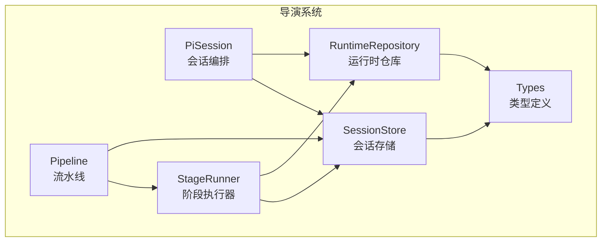
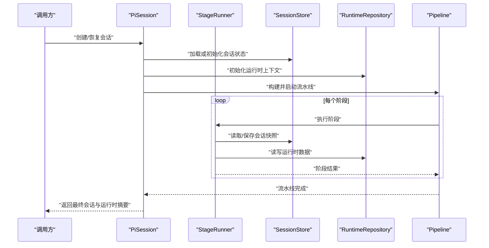
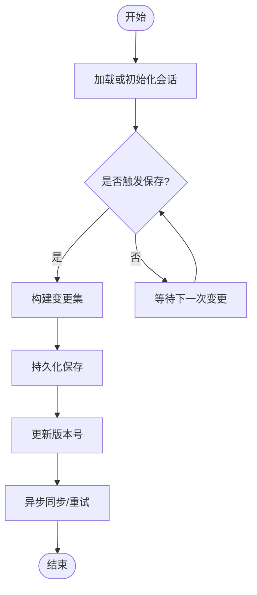
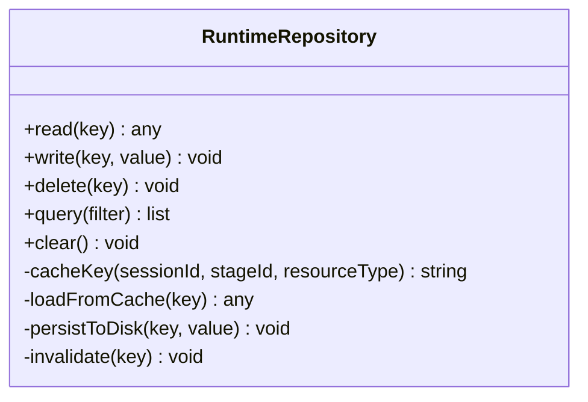
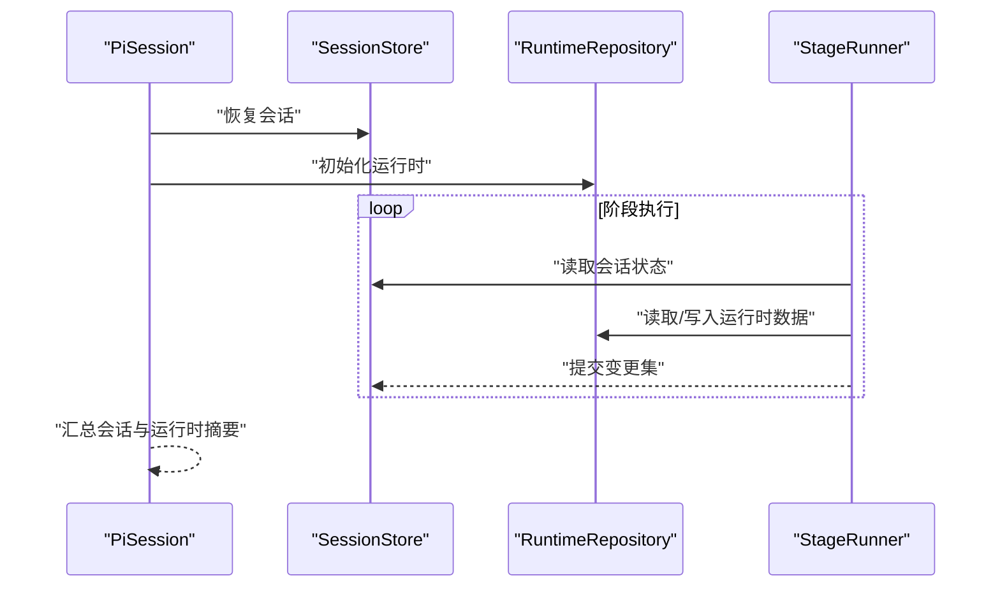
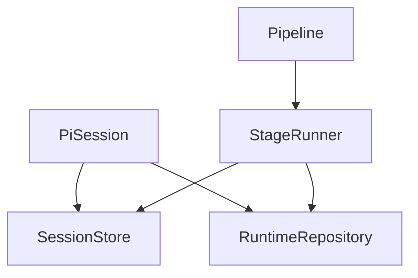

# 会话管理

<cite>
**本文引用的文件**   
- [session-store.ts](file://src/features/director/session-store.ts)
- [runtime-repository.ts](file://src/features/director/runtime-repository.ts)
- [pi-session.ts](file://src/features/director/pi-session.ts)
- [stage-runner.ts](file://src/features/director/stage-runner.ts)
- [pipeline.ts](file://src/features/director/pipeline.ts)
- [types.ts](file://src/features/director/types.ts)
</cite>

## 目录
1. [简介](#简介)
2. [项目结构](#项目结构)
3. [核心组件](#核心组件)
4. [架构总览](#架构总览)
5. [详细组件分析](#详细组件分析)
6. [依赖关系分析](#依赖关系分析)
7. [性能考虑](#性能考虑)
8. [故障排查指南](#故障排查指南)
9. [结论](#结论)
10. [附录](#附录)

## 简介
本文件面向导演系统的“会话管理”模块，聚焦以下目标：
- 深入解释 SessionStore 的会话持久化策略（保存、恢复、同步）
- 详细说明 RuntimeRepository 的运行时数据管理模式（存储结构、访问接口、缓存策略）
- 阐述会话与运行时的关系及数据流转过程
- 提供可操作的示例路径，展示如何管理导演会话、查询运行时状态、实现会话版本控制
- 给出最佳实践与性能优化建议

## 项目结构
与会话管理相关的核心代码位于 features/director 目录下，关键文件如下：
- session-store.ts：会话存储与持久化
- runtime-repository.ts：运行时数据仓库
- pi-session.ts：会话生命周期与编排
- stage-runner.ts：阶段执行器（驱动会话推进）
- pipeline.ts：流水线编排（串联阶段与状态）
- types.ts：类型定义与数据结构

图表来源
- [session-store.ts:1-200](file://src/features/director/session-store.ts#L1-L200)
- [runtime-repository.ts:1-200](file://src/features/director/runtime-repository.ts#L1-L200)
- [pi-session.ts:1-200](file://src/features/director/pi-session.ts#L1-L200)
- [stage-runner.ts:1-200](file://src/features/director/stage-runner.ts#L1-L200)
- [pipeline.ts:1-200](file://src/features/director/pipeline.ts#L1-L200)
- [types.ts:1-200](file://src/features/director/types.ts#L1-L200)

章节来源
- [session-store.ts:1-200](file://src/features/director/session-store.ts#L1-L200)
- [runtime-repository.ts:1-200](file://src/features/director/runtime-repository.ts#L1-L200)
- [pi-session.ts:1-200](file://src/features/director/pi-session.ts#L1-L200)
- [stage-runner.ts:1-200](file://src/features/director/stage-runner.ts#L1-L200)
- [pipeline.ts:1-200](file://src/features/director/pipeline.ts#L1-L200)
- [types.ts:1-200](file://src/features/director/types.ts#L1-L200)

## 核心组件
- SessionStore：负责导演会话的状态持久化、快照、增量更新与恢复。对外暴露创建、加载、保存、回滚、列表等能力。
- RuntimeRepository：负责运行时数据的读写、缓存与一致性维护，为会话与阶段执行提供运行时上下文。
- PiSession：会话编排入口，协调 StageRunner 与 Pipeline，驱动会话从初始化到完成的全生命周期。
- StageRunner：按阶段顺序执行任务，读取/写入 SessionStore 与 RuntimeRepository，保证幂等与错误恢复。
- Pipeline：将多个阶段组合成可复用的流程，支持重试、超时与结果聚合。
- Types：统一的数据模型与枚举，确保各层对会话与运行时结构的理解一致。

章节来源
- [session-store.ts:1-200](file://src/features/director/session-store.ts#L1-L200)
- [runtime-repository.ts:1-200](file://src/features/director/runtime-repository.ts#L1-L200)
- [pi-session.ts:1-200](file://src/features/director/pi-session.ts#L1-L200)
- [stage-runner.ts:1-200](file://src/features/director/stage-runner.ts#L1-L200)
- [pipeline.ts:1-200](file://src/features/director/pipeline.ts#L1-L200)
- [types.ts:1-200](file://src/features/director/types.ts#L1-L200)

## 架构总览
下图展示了会话管理与运行时之间的交互关系与数据流向。

图表来源
- [pi-session.ts:1-200](file://src/features/director/pi-session.ts#L1-L200)
- [stage-runner.ts:1-200](file://src/features/director/stage-runner.ts#L1-L200)
- [session-store.ts:1-200](file://src/features/director/session-store.ts#L1-L200)
- [runtime-repository.ts:1-200](file://src/features/director/runtime-repository.ts#L1-L200)
- [pipeline.ts:1-200](file://src/features/director/pipeline.ts#L1-L200)

## 详细组件分析

### SessionStore：会话持久化策略
- 职责
  - 会话创建与初始化：生成唯一会话标识、初始状态与元信息
  - 持久化保存：将当前会话状态落盘或写入后端存储
  - 恢复与回滚：基于快照或版本号恢复会话至指定状态
  - 增量同步：在长时运行中，以最小变更集进行增量保存
  - 版本控制：记录每次变更的版本号，支持历史回溯与对比
- 关键概念
  - 会话快照：包含完整状态的序列化对象
  - 变更集：仅包含差异字段的最小更新单元
  - 版本号：单调递增或时间戳+序列的组合，用于排序与冲突解决
- 典型操作
  - 保存会话：触发保存流程，必要时合并变更集并生成新版本
  - 恢复会话：根据会话ID与版本号定位快照并重建内存状态
  - 同步机制：后台异步持久化，失败重试与幂等写入
- 错误处理
  - 网络/IO异常：重试与降级策略
  - 版本冲突：合并策略或提示用户选择基线版本
  - 数据损坏：校验和检查与自动修复或回退

图表来源
- [session-store.ts:1-200](file://src/features/director/session-store.ts#L1-L200)

章节来源
- [session-store.ts:1-200](file://src/features/director/session-store.ts#L1-L200)

### RuntimeRepository：运行时数据管理模式
- 职责
  - 运行时上下文：维护阶段执行所需的临时数据、中间产物与统计指标
  - 存储结构：分层组织（如输入、中间态、输出、日志、指标）
  - 访问接口：统一的读/写/删除/查询方法，支持批量与分页
  - 缓存策略：内存缓存 + 磁盘/远端缓存，命中优先与失效策略
- 关键概念
  - 键空间：按会话ID、阶段ID、资源类型划分命名空间
  - 缓存层级：L1 内存、L2 本地磁盘、L3 远端存储
  - 一致性：读写路径保证最终一致，必要时强一致点（如提交前）
- 典型操作
  - 写入运行时数据：先入缓存，再异步落盘
  - 读取运行时数据：优先命中缓存，未命中则回源并回填缓存
  - 清理与回收：按会话生命周期或过期策略清理无用数据
- 错误处理
  - 缓存不一致：回源校验与强制刷新
  - 容量限制：淘汰策略与告警
  - 并发冲突：锁或乐观锁机制

图表来源
- [runtime-repository.ts:1-200](file://src/features/director/runtime-repository.ts#L1-L200)

章节来源
- [runtime-repository.ts:1-200](file://src/features/director/runtime-repository.ts#L1-L200)

### 会话与运行时的关系与数据流转
- 关系说明
  - 会话是高层业务状态，描述导演任务的进度、配置与结果
  - 运行时是底层执行状态，包含中间产物、日志与指标
  - 两者通过 PiSession 与 StageRunner 协同：会话驱动阶段，阶段读写运行时
- 数据流转
  - 初始化：PiSession 从 SessionStore 恢复会话，同时初始化 RuntimeRepository
  - 执行：StageRunner 在每个阶段读取会话状态，按需写入运行时数据
  - 提交：阶段完成后，将变更集合并到会话并持久化；运行时数据按策略缓存与落盘
  - 完成：汇总会话与运行时摘要，供上层查询与导出

图表来源
- [pi-session.ts:1-200](file://src/features/director/pi-session.ts#L1-L200)
- [stage-runner.ts:1-200](file://src/features/director/stage-runner.ts#L1-L200)
- [session-store.ts:1-200](file://src/features/director/session-store.ts#L1-L200)
- [runtime-repository.ts:1-200](file://src/features/director/runtime-repository.ts#L1-L200)

章节来源
- [pi-session.ts:1-200](file://src/features/director/pi-session.ts#L1-L200)
- [stage-runner.ts:1-200](file://src/features/director/stage-runner.ts#L1-L200)
- [session-store.ts:1-200](file://src/features/director/session-store.ts#L1-L200)
- [runtime-repository.ts:1-200](file://src/features/director/runtime-repository.ts#L1-L200)

### 使用示例与最佳实践

- 管理导演会话
  - 创建会话：参考 [session-store.ts:1-200](file://src/features/director/session-store.ts#L1-L200) 中的创建与初始化流程
  - 恢复会话：参考 [session-store.ts:1-200](file://src/features/director/session-store.ts#L1-L200) 中的加载与快照恢复
  - 会话版本控制：参考 [session-store.ts:1-200](file://src/features/director/session-store.ts#L1-L200) 中的版本号与变更集合并逻辑

- 查询运行时状态
  - 读取运行时数据：参考 [runtime-repository.ts:1-200](file://src/features/director/runtime-repository.ts#L1-L200) 中的 read/query 接口
  - 写入运行时数据：参考 [runtime-repository.ts:1-200](file://src/features/director/runtime-repository.ts#L1-L200) 中的 write/persist 流程
  - 缓存命中与失效：参考 [runtime-repository.ts:1-200](file://src/features/director/runtime-repository.ts#L1-L200) 中的缓存策略与 invalidate

- 会话版本控制示例路径
  - 版本生成与合并：参考 [session-store.ts:1-200](file://src/features/director/session-store.ts#L1-L200)
  - 回滚到指定版本：参考 [session-store.ts:1-200](file://src/features/director/session-store.ts#L1-L200)
  - 版本对比与审计：参考 [session-store.ts:1-200](file://src/features/director/session-store.ts#L1-L200)

章节来源
- [session-store.ts:1-200](file://src/features/director/session-store.ts#L1-L200)
- [runtime-repository.ts:1-200](file://src/features/director/runtime-repository.ts#L1-L200)

## 依赖关系分析
- 组件耦合
  - PiSession 依赖 SessionStore 与 RuntimeRepository，作为编排中心
  - StageRunner 依赖 SessionStore 与 RuntimeRepository，作为执行单元
  - Pipeline 依赖 StageRunner，形成阶段链
- 外部依赖
  - 存储层：可能涉及本地文件系统或远端对象存储（由具体实现决定）
  - 缓存层：内存缓存与磁盘缓存
- 潜在循环依赖
  - 应避免 SessionStore 直接依赖 StageRunner 或 Pipeline，保持单向依赖

图表来源
- [pi-session.ts:1-200](file://src/features/director/pi-session.ts#L1-L200)
- [stage-runner.ts:1-200](file://src/features/director/stage-runner.ts#L1-L200)
- [pipeline.ts:1-200](file://src/features/director/pipeline.ts#L1-L200)
- [session-store.ts:1-200](file://src/features/director/session-store.ts#L1-L200)
- [runtime-repository.ts:1-200](file://src/features/director/runtime-repository.ts#L1-L200)

章节来源
- [pi-session.ts:1-200](file://src/features/director/pi-session.ts#L1-L200)
- [stage-runner.ts:1-200](file://src/features/director/stage-runner.ts#L1-L200)
- [pipeline.ts:1-200](file://src/features/director/pipeline.ts#L1-L200)
- [session-store.ts:1-200](file://src/features/director/session-store.ts#L1-L200)
- [runtime-repository.ts:1-200](file://src/features/director/runtime-repository.ts#L1-L200)

## 性能考虑
- 会话持久化
  - 增量保存：优先使用变更集而非全量快照，减少 IO 压力
  - 异步落盘：非阻塞保存，避免阻塞主线程
  - 压缩与分片：大对象压缩与分片存储，提升传输与检索效率
- 运行时缓存
  - 多级缓存：L1 内存、L2 磁盘、L3 远端，合理设置 TTL 与淘汰策略
  - 预取与预热：常见运行时数据在阶段开始前预加载
  - 缓存一致性：写入后及时失效相关缓存键，避免脏读
- 并发与锁
  - 会话写入：采用乐观锁或分段锁，降低冲突概率
  - 运行时写入：按资源粒度加锁，避免全局锁瓶颈
- 监控与度量
  - 记录保存耗时、缓存命中率、错误率与重试次数
  - 设置阈值告警，便于快速定位性能问题

[本节为通用指导，不直接分析具体文件]

## 故障排查指南
- 常见问题
  - 会话无法恢复：检查版本号是否存在、快照是否损坏、校验和是否匹配
  - 运行时数据缺失：确认缓存键是否正确、缓存是否被提前失效、回源是否成功
  - 版本冲突：查看合并策略是否生效，必要时手动选择基线版本
- 诊断步骤
  - 启用详细日志：记录会话保存/恢复、运行时读写的关键路径
  - 回放与对比：对比不同版本的会话快照，定位变更引入的问题
  - 隔离测试：单独运行阶段，验证 StageRunner 与 Repository 的行为
- 恢复策略
  - 回滚到上一个稳定版本
  - 清空运行时缓存并重新计算
  - 重建会话并从最近一次成功快照继续

章节来源
- [session-store.ts:1-200](file://src/features/director/session-store.ts#L1-L200)
- [runtime-repository.ts:1-200](file://src/features/director/runtime-repository.ts#L1-L200)

## 结论
- SessionStore 提供了可靠的会话持久化与版本控制能力，适合长时运行的导演任务
- RuntimeRepository 通过分层缓存与一致的读写接口，保障运行时数据的高效访问
- PiSession 与 StageRunner 协作良好，形成清晰的编排与执行边界
- 建议在生产环境完善监控、告警与自动化恢复机制，进一步提升稳定性与性能

[本节为总结性内容，不直接分析具体文件]

## 附录
- 术语表
  - 会话：导演任务的高层状态与配置
  - 运行时：阶段执行过程中的中间数据与指标
  - 变更集：最小化的状态更新单元
  - 版本号：用于排序与冲突解决的标识
- 相关文件索引
  - [session-store.ts](file://src/features/director/session-store.ts)
  - [runtime-repository.ts](file://src/features/director/runtime-repository.ts)
  - [pi-session.ts](file://src/features/director/pi-session.ts)
  - [stage-runner.ts](file://src/features/director/stage-runner.ts)
  - [pipeline.ts](file://src/features/director/pipeline.ts)
  - [types.ts](file://src/features/director/types.ts)