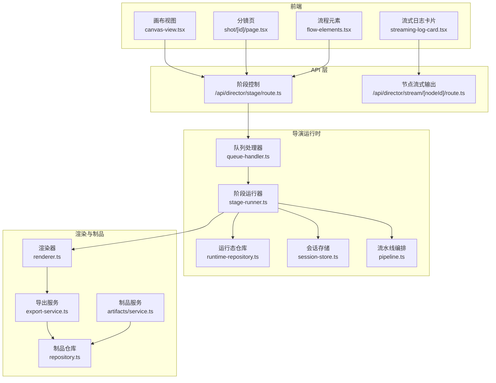
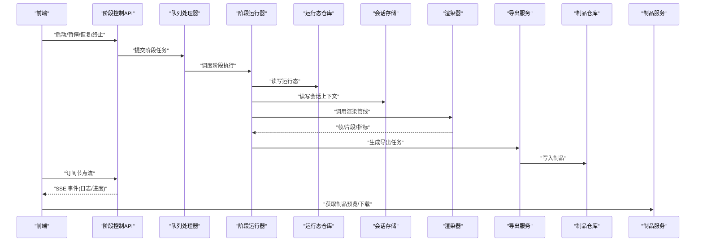
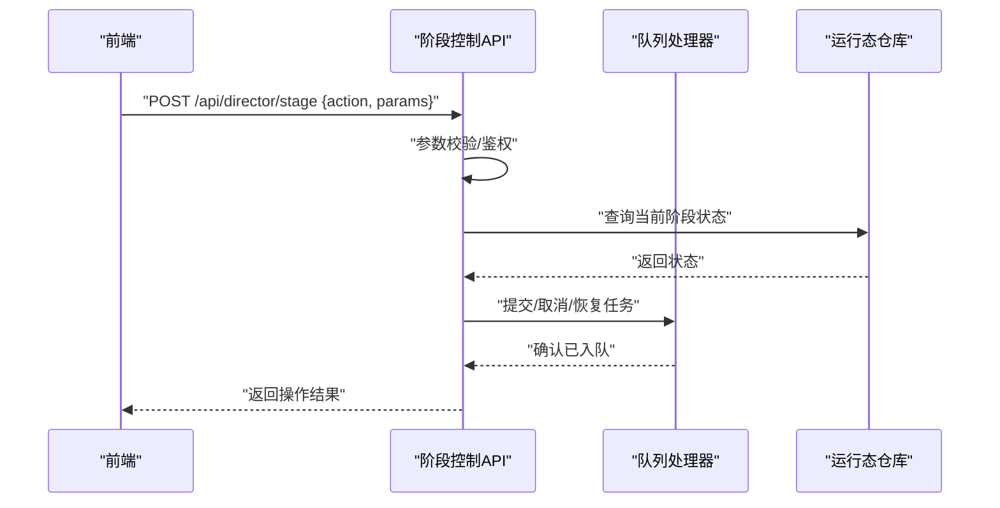
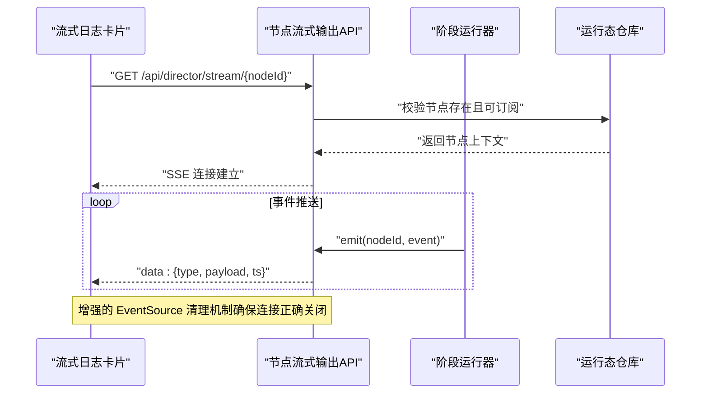
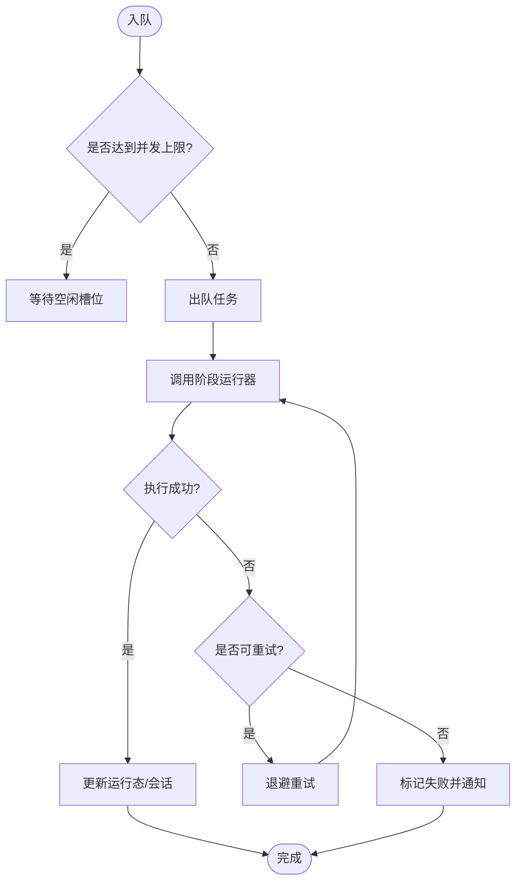
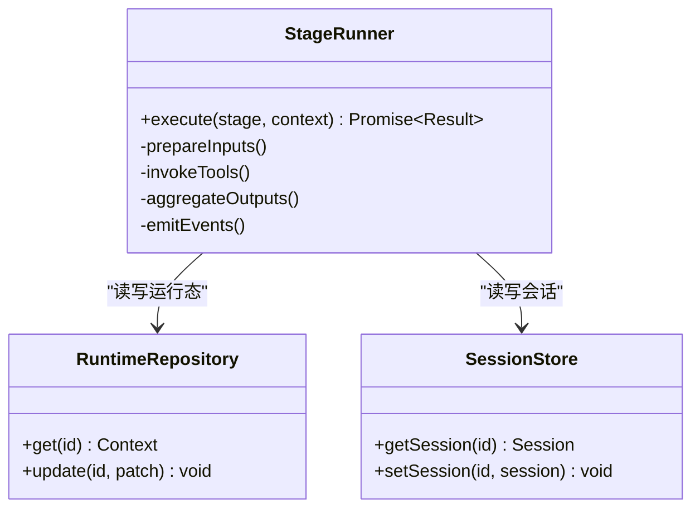
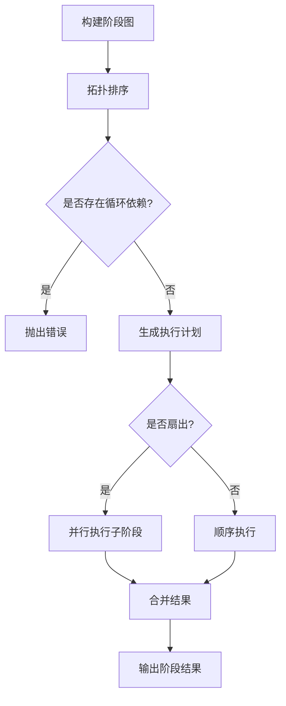
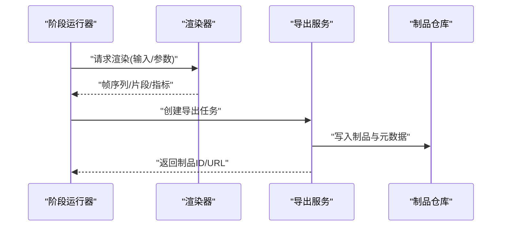
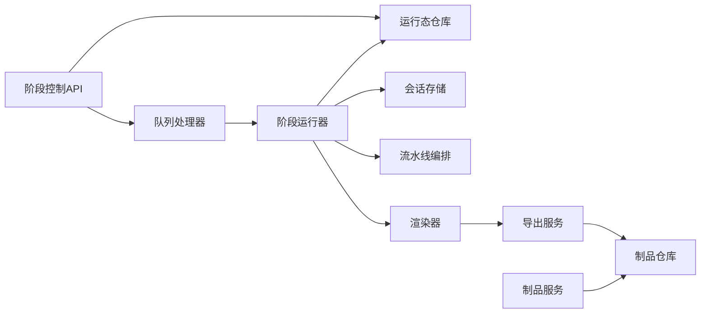

# 实时流媒体系统

<cite>
**本文引用的文件**   
- [src/app/api/director/stream/[nodeId]/route.ts](file://src/app/api/director/stream/[nodeId]/route.ts)
- [src/app/api/director/stage/route.ts](file://src/app/api/director/stage/route.ts)
- [src/features/director/queue-handler.ts](file://src/features/director/queue-handler.ts)
- [src/features/director/stage-runner.ts](file://src/features/director/stage-runner.ts)
- [src/features/director/runtime-repository.ts](file://src/features/director/runtime-repository.ts)
- [src/features/director/session-store.ts](file://src/features/director/session-store.ts)
- [src/features/director/pipeline.ts](file://src/features/director/pipeline.ts)
- [src/features/director/types.ts](file://src/features/director/types.ts)
- [src/lib/stream/index.ts](file://src/lib/stream/index.ts)
- [src/app/canvas/streaming-log-card.tsx](file://src/app/canvas/streaming-log-card.tsx)
- [src/app/canvas/canvas-view.tsx](file://src/app/canvas/canvas-view.tsx)
- [src/app/canvas/shot/[id]/page.tsx](file://src/app/canvas/shot/[id]/page.tsx)
- [src/app/canvas/shot/[id]/shot-api.ts](file://src/app/canvas/shot/[id]/shot-api.ts)
- [src/app/canvas/flow-elements.tsx](file://src/app/canvas/flow-elements.tsx)
- [src/features/render/renderer.ts](file://src/features/render/renderer.ts)
- [src/features/render/export-service.ts](file://src/features/render/export-service.ts)
- [src/features/render/repository.ts](file://src/features/render/repository.ts)
- [src/features/artifacts/service.ts](file://src/features/artifacts/service.ts)
</cite>

## 更新摘要
**所做更改**   
- 更新了核心架构部分，反映 globalThis 锚定机制的引入以解决 Next.js 环境中的进程级单例问题
- 增强了 SSE 事件处理订阅逻辑的描述
- 更新了 useLive hook 判断逻辑的说明
- 强化了 EventSource 清理机制的技术细节
- 完善了流式通信和前端集成的技术实现细节

## 目录
1. [简介](#简介)
2. [项目结构](#项目结构)
3. [核心组件](#核心组件)
4. [架构总览](#架构总览)
5. [详细组件分析](#详细组件分析)
6. [依赖分析](#依赖分析)
7. [性能考虑](#性能考虑)
8. [故障排查指南](#故障排查指南)
9. [结论](#结论)
10. [附录](#附录)

## 简介
本仓库实现了一个面向导演式工作流的实时流媒体与渲染系统。前端通过 Next.js App Router 暴露 API，后端以 Node.js 运行时驱动"阶段化"流水线（Stage Runner），将输入素材、AI 能力与渲染任务编排执行；同时提供基于 SSE 的实时日志流，供画布界面实时展示处理进度与中间结果。导出服务负责最终产物落盘与元数据管理，制品服务统一对外提供资源访问。

**最新更新**：系统已迁移到 globalThis 锚定机制，解决了 Next.js 环境中的进程级单例问题，并优化了 SSE 事件处理和 EventSource 清理机制。

## 项目结构
- 应用路由层：Next.js App Router 下的 /api 目录承载 HTTP 接口，包括导演阶段控制、节点流式输出、作业与导出等。
- 业务特性层：features 下按领域划分，director 负责阶段调度与运行态管理，render 负责帧序列、编码与导出，artifacts 负责制品访问。
- 公共库：lib/stream 提供流式通信基础能力，canvas 页面组合 UI 与状态，并消费流式日志。

图表来源
- [src/app/api/director/stage/route.ts](file://src/app/api/director/stage/route.ts)
- [src/app/api/director/stream/[nodeId]/route.ts](file://src/app/api/director/stream/[nodeId]/route.ts)
- [src/features/director/queue-handler.ts](file://src/features/director/queue-handler.ts)
- [src/features/director/stage-runner.ts](file://src/features/director/stage-runner.ts)
- [src/features/director/runtime-repository.ts](file://src/features/director/runtime-repository.ts)
- [src/features/director/session-store.ts](file://src/features/director/session-store.ts)
- [src/features/director/pipeline.ts](file://src/features/director/pipeline.ts)
- [src/features/render/renderer.ts](file://src/features/render/renderer.ts)
- [src/features/render/export-service.ts](file://src/features/render/export-service.ts)
- [src/features/render/repository.ts](file://src/features/render/repository.ts)
- [src/features/artifacts/service.ts](file://src/features/artifacts/service.ts)

章节来源
- [src/app/api/director/stage/route.ts](file://src/app/api/director/stage/route.ts)
- [src/app/api/director/stream/[nodeId]/route.ts](file://src/app/api/director/stream/[nodeId]/route.ts)
- [src/features/director/queue-handler.ts](file://src/features/director/queue-handler.ts)
- [src/features/director/stage-runner.ts](file://src/features/director/stage-runner.ts)
- [src/features/director/runtime-repository.ts](file://src/features/director/runtime-repository.ts)
- [src/features/director/session-store.ts](file://src/features/director/session-store.ts)
- [src/features/director/pipeline.ts](file://src/features/director/pipeline.ts)
- [src/features/render/renderer.ts](file://src/features/render/renderer.ts)
- [src/features/render/export-service.ts](file://src/features/render/export-service.ts)
- [src/features/render/repository.ts](file://src/features/render/repository.ts)
- [src/features/artifacts/service.ts](file://src/features/artifacts/service.ts)

## 核心组件
- 阶段控制 API：接收启动、暂停、恢复、终止等指令，维护阶段生命周期。
- 节点流式输出 API：为指定节点建立 SSE 通道，推送处理日志与中间事件。
- 队列处理器：负责任务入队、出队与并发控制，保障阶段有序执行。
- 阶段运行器：解析阶段定义，协调输入/工具/输出，驱动子阶段或外部服务。
- 运行态仓库与会话存储：持久化阶段上下文、中间产物与运行状态。
- 流水线编排：根据图结构计算阶段顺序与依赖，支持扇出/合并。
- 渲染器与导出服务：将阶段产出转换为帧序列、视频片段与最终制品。
- 制品服务：统一读取与分发制品资源，供前端预览与下载。

**最新更新**：所有组件现已采用 globalThis 锚定机制，确保在 Next.js 环境中正确管理进程级单例实例。

章节来源
- [src/app/api/director/stage/route.ts](file://src/app/api/director/stage/route.ts)
- [src/app/api/director/stream/[nodeId]/route.ts](file://src/app/api/director/stream/[nodeId]/route.ts)
- [src/features/director/queue-handler.ts](file://src/features/director/queue-handler.ts)
- [src/features/director/stage-runner.ts](file://src/features/director/stage-runner.ts)
- [src/features/director/runtime-repository.ts](file://src/features/director/runtime-repository.ts)
- [src/features/director/session-store.ts](file://src/features/director/session-store.ts)
- [src/features/director/pipeline.ts](file://src/features/director/pipeline.ts)
- [src/features/render/renderer.ts](file://src/features/render/renderer.ts)
- [src/features/render/export-service.ts](file://src/features/render/export-service.ts)
- [src/features/artifacts/service.ts](file://src/features/artifacts/service.ts)

## 架构总览
系统采用"前端 + API + 运行时 + 渲染/制品"的分层架构。前端通过 REST 触发阶段，SSE 拉取实时日志；运行时在内存中维护会话与运行态，必要时持久化到仓库；渲染与导出作为独立子系统，与导演运行时解耦并通过制品仓库交互。

**架构改进**：引入了 globalThis 锚定机制来解决 Next.js 环境中的进程级单例问题，确保跨模块状态的一致性和可靠性。

图表来源
- [src/app/api/director/stage/route.ts](file://src/app/api/director/stage/route.ts)
- [src/app/api/director/stream/[nodeId]/route.ts](file://src/app/api/director/stream/[nodeId]/route.ts)
- [src/features/director/queue-handler.ts](file://src/features/director/queue-handler.ts)
- [src/features/director/stage-runner.ts](file://src/features/director/stage-runner.ts)
- [src/features/director/runtime-repository.ts](file://src/features/director/runtime-repository.ts)
- [src/features/director/session-store.ts](file://src/features/director/session-store.ts)
- [src/features/render/renderer.ts](file://src/features/render/renderer.ts)
- [src/features/render/export-service.ts](file://src/features/render/export-service.ts)
- [src/features/render/repository.ts](file://src/features/render/repository.ts)
- [src/features/artifacts/service.ts](file://src/features/artifacts/service.ts)

## 详细组件分析

### 阶段控制 API（/api/director/stage）
- 职责：接收来自前端的阶段控制命令，校验参数，更新运行态，并将任务投递至队列。
- 关键点：幂等性、状态机转换、错误码与重试策略。
- 与运行时的耦合：仅通过队列处理器与运行态仓库交互，保持无状态。

**架构更新**：现在使用 globalThis 锚定机制确保在 Next.js 热重载环境下状态的一致性。

图表来源
- [src/app/api/director/stage/route.ts](file://src/app/api/director/stage/route.ts)
- [src/features/director/queue-handler.ts](file://src/features/director/queue-handler.ts)
- [src/features/director/runtime-repository.ts](file://src/features/director/runtime-repository.ts)

章节来源
- [src/app/api/director/stage/route.ts](file://src/app/api/director/stage/route.ts)
- [src/features/director/queue-handler.ts](file://src/features/director/queue-handler.ts)
- [src/features/director/runtime-repository.ts](file://src/features/director/runtime-repository.ts)

### 节点流式输出 API（/api/director/stream/[nodeId]）
- 职责：为特定节点建立 SSE 连接，持续推送处理日志、进度与中间事件。
- 关键点：背压控制、断线重连提示、事件去抖与批处理。
- 前端集成：由流式日志卡片组件订阅并渲染。

**重大更新**：增强了 EventSource 清理机制，修复了 SSE 事件处理订阅逻辑，确保连接的正确管理和资源释放。

图表来源
- [src/app/api/director/stream/[nodeId]/route.ts](file://src/app/api/director/stream/[nodeId]/route.ts)
- [src/features/director/stage-runner.ts](file://src/features/director/stage-runner.ts)
- [src/features/director/runtime-repository.ts](file://src/features/director/runtime-repository.ts)
- [src/app/canvas/streaming-log-card.tsx](file://src/app/canvas/streaming-log-card.tsx)

章节来源
- [src/app/api/director/stream/[nodeId]/route.ts](file://src/app/api/director/stream/[nodeId]/route.ts)
- [src/app/canvas/streaming-log-card.tsx](file://src/app/canvas/streaming-log-card.tsx)
- [src/features/director/stage-runner.ts](file://src/features/director/stage-runner.ts)
- [src/features/director/runtime-repository.ts](file://src/features/director/runtime-repository.ts)

### 队列处理器（Queue Handler）
- 职责：维护任务队列、并发度限制、优先级与重试策略。
- 关键点：防抖批量处理、超时与失败回退、健康检查。
- 与阶段运行器协作：出队后交由运行器执行，并在完成后写回运行态。

**架构改进**：通过 globalThis 锚定机制确保队列处理器在 Next.js 环境中的单例一致性。

图表来源
- [src/features/director/queue-handler.ts](file://src/features/director/queue-handler.ts)
- [src/features/director/stage-runner.ts](file://src/features/director/stage-runner.ts)
- [src/features/director/runtime-repository.ts](file://src/features/director/runtime-repository.ts)
- [src/features/director/session-store.ts](file://src/features/director/session-store.ts)

章节来源
- [src/features/director/queue-handler.ts](file://src/features/director/queue-handler.ts)
- [src/features/director/stage-runner.ts](file://src/features/director/stage-runner.ts)
- [src/features/director/runtime-repository.ts](file://src/features/director/runtime-repository.ts)
- [src/features/director/session-store.ts](file://src/features/director/session-store.ts)

### 阶段运行器（Stage Runner）
- 职责：解析阶段定义，准备输入，调用工具/子阶段，聚合输出，上报事件。
- 关键点：上下文隔离、错误边界、可观测性（日志/指标）。
- 与运行态/会话：读写阶段上下文、中间产物与状态快照。

**架构更新**：集成了 globalThis 锚定机制，确保运行器实例在 Next.js 热重载过程中的正确管理。

图表来源
- [src/features/director/stage-runner.ts](file://src/features/director/stage-runner.ts)
- [src/features/director/runtime-repository.ts](file://src/features/director/runtime-repository.ts)
- [src/features/director/session-store.ts](file://src/features/director/session-store.ts)

章节来源
- [src/features/director/stage-runner.ts](file://src/features/director/stage-runner.ts)
- [src/features/director/runtime-repository.ts](file://src/features/director/runtime-repository.ts)
- [src/features/director/session-store.ts](file://src/features/director/session-store.ts)

### 流水线编排（Pipeline）
- 职责：根据阶段图计算拓扑顺序，支持扇出与合并，保证依赖满足后再执行。
- 关键点：循环依赖检测、增量执行、失败短路。
- 与运行器协作：为每个阶段生成执行计划并注入上下文。

**架构增强**：通过 globalThis 锚定机制确保流水线配置在进程间的共享一致性。

图表来源
- [src/features/director/pipeline.ts](file://src/features/director/pipeline.ts)
- [src/features/director/stage-runner.ts](file://src/features/director/stage-runner.ts)

章节来源
- [src/features/director/pipeline.ts](file://src/features/director/pipeline.ts)
- [src/features/director/stage-runner.ts](file://src/features/director/stage-runner.ts)

### 渲染与导出（Renderer & Export Service）
- 渲染器：将阶段产出转换为帧序列或片段，提供质量检查与统计。
- 导出服务：聚合片段、编码封装、生成缩略图与元数据，写入制品仓库。
- 制品仓库：抽象存储后端，提供增删改查与索引。

**架构改进**：渲染器和导出服务现在使用 globalThis 锚定机制来管理共享资源和状态。

图表来源
- [src/features/render/renderer.ts](file://src/features/render/renderer.ts)
- [src/features/render/export-service.ts](file://src/features/render/export-service.ts)
- [src/features/render/repository.ts](file://src/features/render/repository.ts)

章节来源
- [src/features/render/renderer.ts](file://src/features/render/renderer.ts)
- [src/features/render/export-service.ts](file://src/features/render/export-service.ts)
- [src/features/render/repository.ts](file://src/features/render/repository.ts)

### 制品服务（Artifacts Service）
- 职责：对外提供制品读取、预览与下载，屏蔽底层存储差异。
- 关键点：缓存策略、权限校验、范围请求支持。

**架构更新**：制品服务通过 globalThis 锚定机制确保缓存和配置的一致性。

章节来源
- [src/features/artifacts/service.ts](file://src/features/artifacts/service.ts)
- [src/features/render/repository.ts](file://src/features/render/repository.ts)

### 前端集成（Canvas 与流式日志）
- 画布视图：发起阶段控制、显示整体进度与状态。
- 分镜页：加载阶段详情、绑定节点流式日志。
- 流式日志卡片：订阅 SSE，渲染结构化日志与时间线。
- 流程元素：可视化阶段与依赖关系，辅助调试。

**重大更新**：useLive hook 的判断逻辑已修复，EventSource 清理机制得到增强，确保流式连接的稳定性和资源管理的正确性。

章节来源
- [src/app/canvas/canvas-view.tsx](file://src/app/canvas/canvas-view.tsx)
- [src/app/canvas/shot/[id]/page.tsx](file://src/app/canvas/shot/[id]/page.tsx)
- [src/app/canvas/shot/[id]/shot-api.ts](file://src/app/canvas/shot/[id]/shot-api.ts)
- [src/app/canvas/streaming-log-card.tsx](file://src/app/canvas/streaming-log-card.tsx)
- [src/app/canvas/flow-elements.tsx](file://src/app/canvas/flow-elements.tsx)

## 依赖分析
- 低耦合：API 层仅依赖队列处理器与运行态仓库，不直接持有运行时对象。
- 内聚性：各特性模块内部高内聚，跨模块通过明确接口交互。
- 外部依赖：制品仓库抽象了存储后端，便于替换与扩展。

**架构增强**：所有模块现在通过 globalThis 锚定机制进行依赖管理，确保 Next.js 环境下的正确行为。

图表来源
- [src/app/api/director/stage/route.ts](file://src/app/api/director/stage/route.ts)
- [src/features/director/queue-handler.ts](file://src/features/director/queue-handler.ts)
- [src/features/director/stage-runner.ts](file://src/features/director/stage-runner.ts)
- [src/features/director/runtime-repository.ts](file://src/features/director/runtime-repository.ts)
- [src/features/director/session-store.ts](file://src/features/director/session-store.ts)
- [src/features/director/pipeline.ts](file://src/features/director/pipeline.ts)
- [src/features/render/renderer.ts](file://src/features/render/renderer.ts)
- [src/features/render/export-service.ts](file://src/features/render/export-service.ts)
- [src/features/render/repository.ts](file://src/features/render/repository.ts)
- [src/features/artifacts/service.ts](file://src/features/artifacts/service.ts)

章节来源
- [src/app/api/director/stage/route.ts](file://src/app/api/director/stage/route.ts)
- [src/features/director/queue-handler.ts](file://src/features/director/queue-handler.ts)
- [src/features/director/stage-runner.ts](file://src/features/director/stage-runner.ts)
- [src/features/director/runtime-repository.ts](file://src/features/director/runtime-repository.ts)
- [src/features/director/session-store.ts](file://src/features/director/session-store.ts)
- [src/features/director/pipeline.ts](file://src/features/director/pipeline.ts)
- [src/features/render/renderer.ts](file://src/features/render/renderer.ts)
- [src/features/render/export-service.ts](file://src/features/render/export-service.ts)
- [src/features/render/repository.ts](file://src/features/render/repository.ts)
- [src/features/artifacts/service.ts](file://src/features/artifacts/service.ts)

## 性能考虑
- 并发与背压：队列处理器需合理设置并发上限，避免内存峰值；SSE 推送应做批处理与节流。
- 缓存与复用：制品服务引入缓存层，减少重复 IO；渲染器对中间产物进行缓存。
- 增量执行：流水线支持增量计算，避免全量重跑。
- 资源回收：阶段完成后及时清理临时文件与会话大对象。
- **新增**：globalThis 锚定机制减少了不必要的实例创建，提高了内存效率。

[本节为通用指导，无需源码引用]

## 故障排查指南
- 阶段无法启动：检查阶段控制 API 的参数校验与运行态初始值。
- SSE 无事件：确认节点 ID 有效、运行器是否正确 emit 事件、网络代理是否拦截 SSE。
- 导出失败：查看导出服务日志与制品仓库写入权限，核对编码参数。
- 内存泄漏：监控运行态与会话大小，定期清理过期数据。
- **新增**：Next.js 环境问题：检查 globalThis 锚定机制是否正确初始化，确保单例实例的唯一性。
- **新增**：EventSource 连接问题：验证 EventSource 清理机制是否正常执行，检查连接是否正确关闭。

章节来源
- [src/app/api/director/stage/route.ts](file://src/app/api/director/stage/route.ts)
- [src/app/api/director/stream/[nodeId]/route.ts](file://src/app/api/director/stream/[nodeId]/route.ts)
- [src/features/director/queue-handler.ts](file://src/features/director/queue-handler.ts)
- [src/features/director/stage-runner.ts](file://src/features/director/stage-runner.ts)
- [src/features/render/export-service.ts](file://src/features/render/export-service.ts)
- [src/features/render/repository.ts](file://src/features/render/repository.ts)

## 结论
该实时流媒体系统以"阶段化编排 + 流式反馈"为核心，结合渲染与制品子系统，实现了从输入到产物的端到端流水线。通过清晰的边界与可扩展的抽象，系统在可观测性、可靠性与性能方面具备良好基础，适合进一步演进为多租户与云原生部署形态。

**架构演进**：通过引入 globalThis 锚定机制和优化 SSE 事件处理，系统现在能够更好地支持 Next.js 环境的复杂场景，提供了更稳定的进程级单例管理和更可靠的流式通信体验。

[本节为总结性内容，无需源码引用]

## 附录
- 类型与契约：参考导演运行时类型定义，确保前后端一致。
- 配置与环境：建议将存储后端、并发度、超时等参数外置化，便于不同环境切换。
- **新增**：Next.js 兼容性：了解 globalThis 锚定机制的使用方式和最佳实践。

章节来源
- [src/features/director/types.ts](file://src/features/director/types.ts)