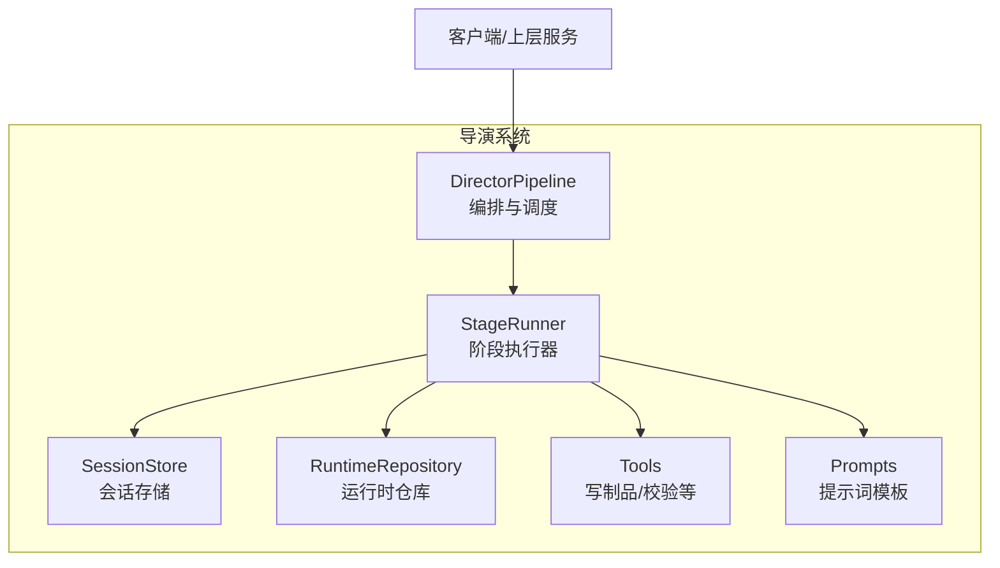
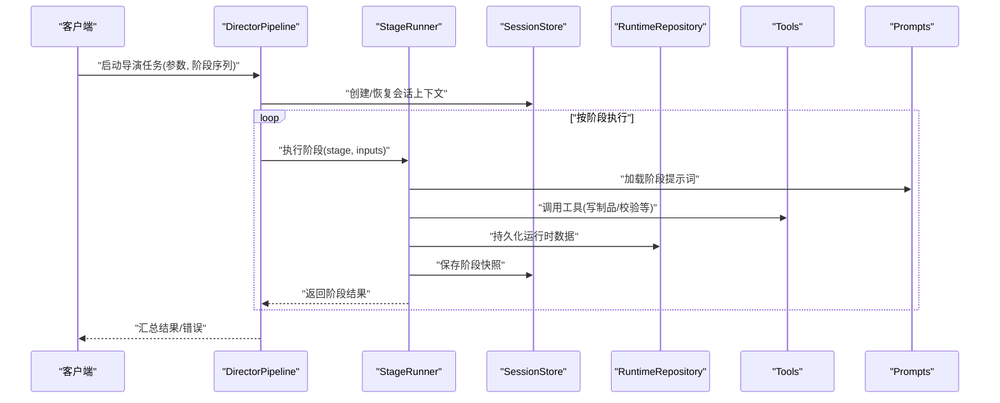
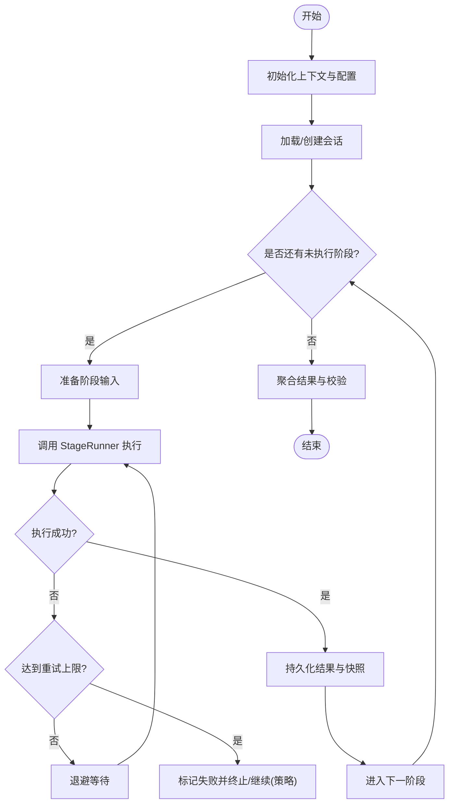
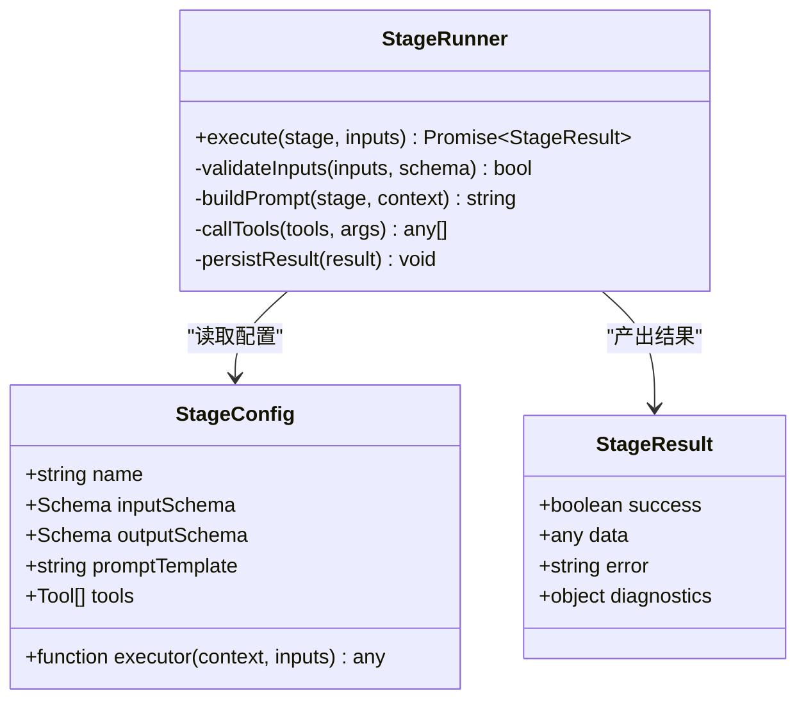
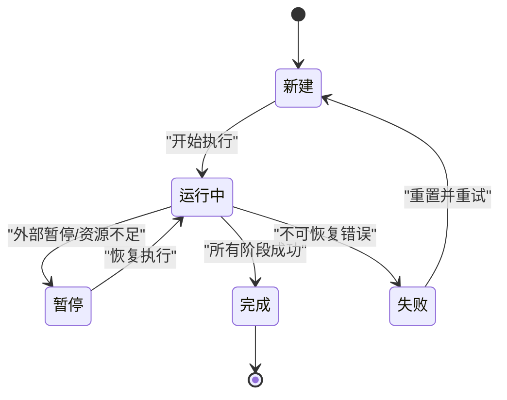
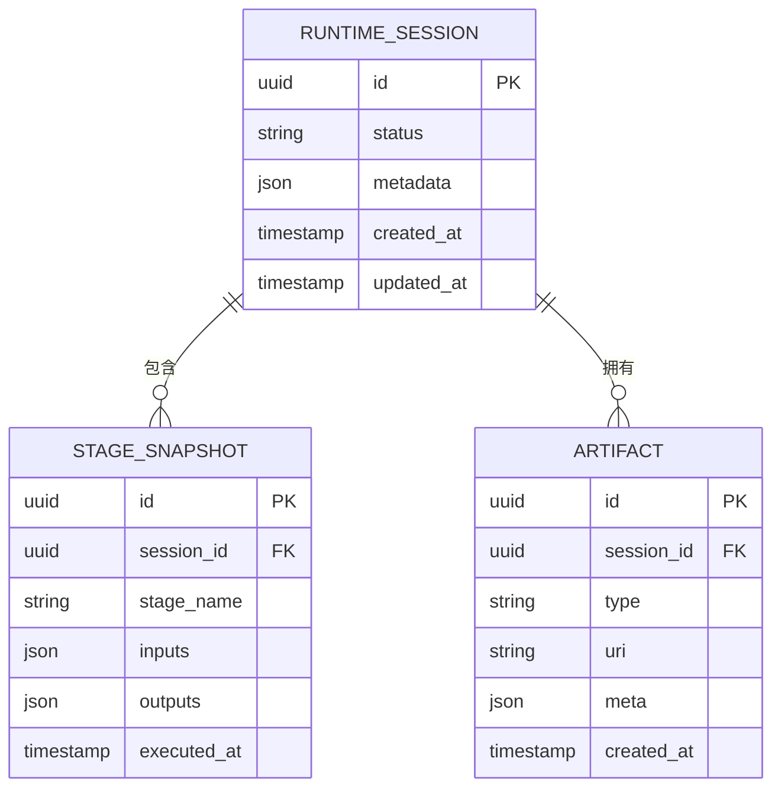
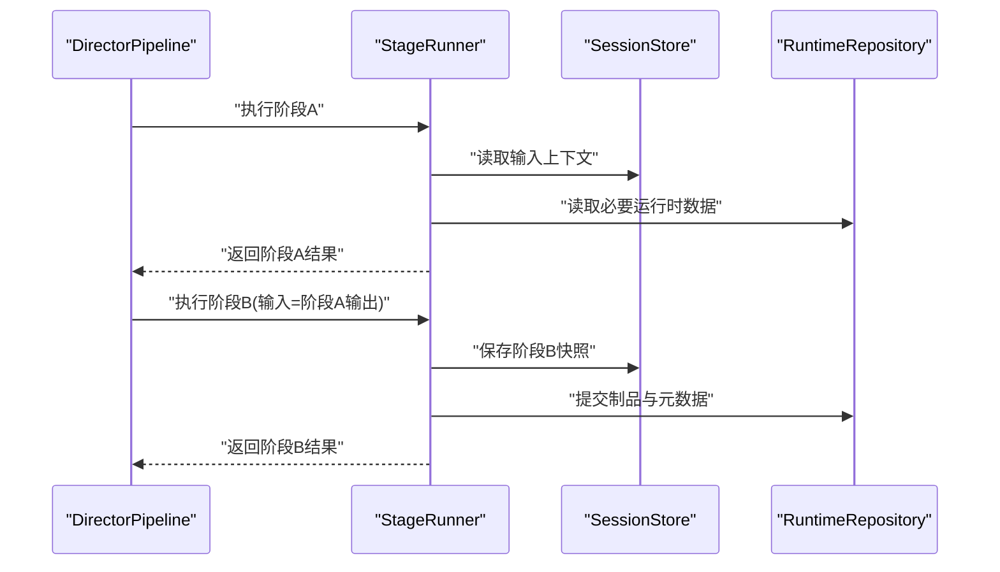
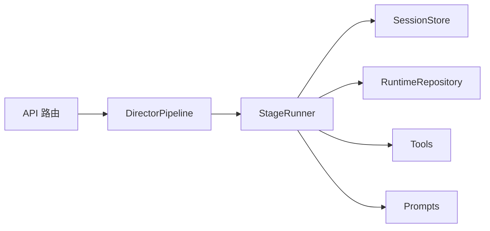

# 导演系统

<cite>
**本文引用的文件**   
- [src/features/director/pipeline.ts](file://src/features/director/pipeline.ts)
- [src/features/director/stage-runner.ts](file://src/features/director/stage-runner.ts)
- [src/features/director/session-store.ts](file://src/features/director/session-store.ts)
- [src/features/director/runtime-repository.ts](file://src/features/director/runtime-repository.ts)
- [src/features/director/types.ts](file://src/features/director/types.ts)
- [src/features/director/index.ts](file://src/features/director/index.ts)
- [src/features/director/stage-result.ts](file://src/features/director/stage-result.ts)
- [src/features/director/stage-prompt.ts](file://src/features/director/stage-prompt.ts)
- [src/features/director/tools/write-artifact.ts](file://src/features/director/tools/write-artifact.ts)
- [src/features/director/tools/validate-shot-plan.ts](file://src/features/director/tools/validate-shot-plan.ts)
- [src/features/director/prompts/direct.ts](file://src/features/director/prompts/direct.ts)
- [src/features/director/prompts/fabricate.ts](file://src/features/director/prompts/fabricate.ts)
- [src/features/director/prompts/assemble.ts](file://src/features/director/prompts/assemble.ts)
- [src/features/director/prompts/finalize.ts](file://src/features/director/prompts/finalize.ts)
- [src/features/director/prompts/ingest.ts](file://src/features/director/prompts/ingest.ts)
- [src/features/director/prompts/shot-spec.ts](file://src/features/director/prompts/shot-spec.ts)
- [src/app/api/director/stage/route.ts](file://src/app/api/director/stage/route.ts)
</cite>

## 目录
1. [简介](#简介)
2. [项目结构](#项目结构)
3. [核心组件](#核心组件)
4. [架构总览](#架构总览)
5. [详细组件分析](#详细组件分析)
6. [依赖关系分析](#依赖关系分析)
7. [性能考量](#性能考量)
8. [故障排查指南](#故障排查指南)
9. [结论](#结论)
10. [附录：API 参考与最佳实践](#附录api-参考与最佳实践)

## 简介
本文件为 CodeVideoCanvas 的“导演系统”提供系统化、可操作的文档。内容覆盖导演工作流编排原理、阶段执行器实现、会话管理机制与结果提交流程，重点解析 DirectorPipeline 类的工作流程、StageRunner 的阶段处理逻辑、SessionStore 的状态持久化策略以及 RuntimeRepository 的数据管理模式。同时给出如何定义新制作阶段、配置工作流参数、处理阶段间数据传递的具体示例路径，并总结错误处理机制、重试策略与性能优化方案，最后提供完整的 API 参考与使用最佳实践。

## 项目结构
导演系统位于 features/director 模块中，围绕“流水线编排 + 阶段执行 + 会话状态 + 运行时数据”四大职责组织代码：
- 编排层：DirectorPipeline 负责阶段顺序、输入输出装配、异常与重试控制。
- 执行层：StageRunner 负责单个阶段的执行、工具调用、结果封装与提交。
- 状态层：SessionStore 负责会话上下文与中间结果的持久化与恢复。
- 数据层：RuntimeRepository 负责运行时数据的读写、版本与一致性管理。
- 扩展点：stage-runner、tools、prompts、schemas 等用于新增阶段与能力。

图表来源
- [src/features/director/pipeline.ts](file://src/features/director/pipeline.ts)
- [src/features/director/stage-runner.ts](file://src/features/director/stage-runner.ts)
- [src/features/director/session-store.ts](file://src/features/director/session-store.ts)
- [src/features/director/runtime-repository.ts](file://src/features/director/runtime-repository.ts)

章节来源
- [src/features/director/index.ts](file://src/features/director/index.ts)
- [src/features/director/types.ts](file://src/features/director/types.ts)

## 核心组件
- DirectorPipeline（流水线）
  - 职责：定义阶段序列、阶段间数据装配、全局配置注入、错误与重试策略、最终结果聚合。
  - 关键行为：按序触发 StageRunner；维护会话上下文；在失败时根据策略回滚或继续；汇总各阶段产物。
- StageRunner（阶段执行器）
  - 职责：加载阶段配置与提示词、准备输入、调用工具、生成阶段结果、提交到仓库与会话存储。
  - 关键行为：参数校验、幂等性检查、工具调用封装、结果验证、错误分类与上报。
- SessionStore（会话存储）
  - 职责：会话生命周期管理、中间态快照、增量更新与恢复、并发安全。
  - 关键行为：序列化/反序列化、版本控制、脏标记与落盘策略。
- RuntimeRepository（运行时仓库）
  - 职责：运行时实体（镜头计划、制品、渲染元数据等）的增删改查、事务与一致性、缓存与索引。
  - 关键行为：读写分离、批量写入、冲突检测与合并。

章节来源
- [src/features/director/pipeline.ts](file://src/features/director/pipeline.ts)
- [src/features/director/stage-runner.ts](file://src/features/director/stage-runner.ts)
- [src/features/director/session-store.ts](file://src/features/director/session-store.ts)
- [src/features/director/runtime-repository.ts](file://src/features/director/runtime-repository.ts)

## 架构总览
导演系统采用“编排-执行-状态-数据”分层架构，通过清晰的接口契约解耦。DirectorPipeline 作为入口协调 StageRunner 执行具体阶段；StageRunner 借助 SessionStore 和 RuntimeRepository 完成状态与数据的读写；Tools 与 Prompts 提供可扩展的能力与提示词模板。

图表来源
- [src/features/director/pipeline.ts](file://src/features/director/pipeline.ts)
- [src/features/director/stage-runner.ts](file://src/features/director/stage-runner.ts)
- [src/features/director/session-store.ts](file://src/features/director/session-store.ts)
- [src/features/director/runtime-repository.ts](file://src/features/director/runtime-repository.ts)
- [src/features/director/tools/write-artifact.ts](file://src/features/director/tools/write-artifact.ts)
- [src/features/director/prompts/direct.ts](file://src/features/director/prompts/direct.ts)

## 详细组件分析

### DirectorPipeline 工作流程
- 初始化：接收工作流参数（阶段列表、重试策略、超时、并行度等），构建执行上下文。
- 阶段编排：按顺序或 DAG 拓扑遍历阶段，组装每个阶段的输入（来自上一阶段输出或全局上下文）。
- 执行调度：委托 StageRunner 执行阶段，捕获异常并记录诊断信息。
- 结果聚合：收集各阶段产物，进行最终校验与导出。
- 错误与重试：支持按阶段粒度重试、退避策略与熔断开关。

图表来源
- [src/features/director/pipeline.ts](file://src/features/director/pipeline.ts)
- [src/features/director/stage-runner.ts](file://src/features/director/stage-runner.ts)
- [src/features/director/session-store.ts](file://src/features/director/session-store.ts)

章节来源
- [src/features/director/pipeline.ts](file://src/features/director/pipeline.ts)

### StageRunner 的阶段处理逻辑
- 阶段注册：阶段需声明名称、输入/输出 schema、提示词模板、工具集与执行函数。
- 输入校验：基于 schema 对输入进行类型与约束校验，失败快速返回。
- 提示词装配：将上下文与变量注入提示词模板，生成模型请求。
- 工具调用：在执行过程中按需调用写制品、校验等工具，确保副作用可控。
- 结果封装：统一封装阶段结果（成功/失败、产物、诊断信息），供流水线聚合。
- 幂等与重试：支持幂等键与重试策略，避免重复计算与抖动放大。

图表来源
- [src/features/director/stage-runner.ts](file://src/features/director/stage-runner.ts)
- [src/features/director/stage-result.ts](file://src/features/director/stage-result.ts)

章节来源
- [src/features/director/stage-runner.ts](file://src/features/director/stage-runner.ts)
- [src/features/director/stage-result.ts](file://src/features/director/stage-result.ts)

### SessionStore 的状态持久化策略
- 会话模型：包含会话 ID、阶段进度、中间产物、错误日志、时间戳与版本号。
- 持久化策略：增量快照 + 全量备份；支持断点续跑与崩溃恢复。
- 并发控制：读写锁与乐观锁，防止竞态条件与覆盖写。
- 清理策略：过期会话回收、大对象外置存储、压缩归档。

图表来源
- [src/features/director/session-store.ts](file://src/features/director/session-store.ts)

章节来源
- [src/features/director/session-store.ts](file://src/features/director/session-store.ts)

### RuntimeRepository 的数据管理模式
- 数据模型：镜头计划、制品清单、渲染元数据、审计日志等。
- 操作模式：CRUD、批量写入、事务边界、冲突检测与合并。
- 缓存与索引：热点数据缓存、查询索引优化、延迟加载。
- 一致性：读写一致性与最终一致性策略，跨阶段数据可见性保证。

图表来源
- [src/features/director/runtime-repository.ts](file://src/features/director/runtime-repository.ts)

章节来源
- [src/features/director/runtime-repository.ts](file://src/features/director/runtime-repository.ts)

### 阶段间数据传递与结果提交流程
- 数据传递：通过 SessionStore 的上下文与 StageResult 的产物字段进行传递；上游输出自动注入下游输入。
- 结果提交：StageRunner 在成功后调用 RuntimeRepository 持久化产物，并在 SessionStore 中记录阶段快照。
- 校验与回滚：可选的强校验阶段，失败时可触发回滚或补偿动作。

图表来源
- [src/features/director/stage-runner.ts](file://src/features/director/stage-runner.ts)
- [src/features/director/session-store.ts](file://src/features/director/session-store.ts)
- [src/features/director/runtime-repository.ts](file://src/features/director/runtime-repository.ts)

章节来源
- [src/features/director/stage-runner.ts](file://src/features/director/stage-runner.ts)
- [src/features/director/session-store.ts](file://src/features/director/session-store.ts)
- [src/features/director/runtime-repository.ts](file://src/features/director/runtime-repository.ts)

### 如何定义新的制作阶段
- 步骤概览：
  - 定义阶段配置：名称、输入/输出 schema、提示词模板、工具集、执行函数。
  - 注册阶段：在流水线配置中声明阶段顺序与依赖。
  - 实现执行函数：读取输入、调用工具、生成结果、抛出明确错误。
  - 编写测试：覆盖正常路径、边界条件与错误分支。
- 参考路径：
  - 阶段执行器与结果封装：[src/features/director/stage-runner.ts](file://src/features/director/stage-runner.ts)、[src/features/director/stage-result.ts](file://src/features/director/stage-result.ts)
  - 提示词模板示例：[src/features/director/prompts/direct.ts](file://src/features/director/prompts/direct.ts)、[src/features/director/prompts/fabricate.ts](file://src/features/director/prompts/fabricate.ts)、[src/features/director/prompts/assemble.ts](file://src/features/director/prompts/assemble.ts)、[src/features/director/prompts/finalize.ts](file://src/features/director/prompts/finalize.ts)、[src/features/director/prompts/ingest.ts](file://src/features/director/prompts/ingest.ts)、[src/features/director/prompts/shot-spec.ts](file://src/features/director/prompts/shot-spec.ts)
  - 工具示例：[src/features/director/tools/write-artifact.ts](file://src/features/director/tools/write-artifact.ts)、[src/features/director/tools/validate-shot-plan.ts](file://src/features/director/tools/validate-shot-plan.ts)

章节来源
- [src/features/director/stage-runner.ts](file://src/features/director/stage-runner.ts)
- [src/features/director/stage-result.ts](file://src/features/director/stage-result.ts)
- [src/features/director/prompts/direct.ts](file://src/features/director/prompts/direct.ts)
- [src/features/director/prompts/fabricate.ts](file://src/features/director/prompts/fabricate.ts)
- [src/features/director/prompts/assemble.ts](file://src/features/director/prompts/assemble.ts)
- [src/features/director/prompts/finalize.ts](file://src/features/director/prompts/finalize.ts)
- [src/features/director/prompts/ingest.ts](file://src/features/director/prompts/ingest.ts)
- [src/features/director/prompts/shot-spec.ts](file://src/features/director/prompts/shot-spec.ts)
- [src/features/director/tools/write-artifact.ts](file://src/features/director/tools/write-artifact.ts)
- [src/features/director/tools/validate-shot-plan.ts](file://src/features/director/tools/validate-shot-plan.ts)

### 配置工作流参数与处理阶段间数据传递
- 工作流参数：阶段序列、重试次数、退避策略、超时、并行度、错误策略（fail-fast/continue-on-error）。
- 数据传递：通过 SessionStore 的上下文对象在各阶段间共享；StageResult 的产物字段作为显式数据通道。
- 参考路径：
  - 流水线编排与参数：[src/features/director/pipeline.ts](file://src/features/director/pipeline.ts)
  - 会话上下文与快照：[src/features/director/session-store.ts](file://src/features/director/session-store.ts)
  - 运行时数据读写：[src/features/director/runtime-repository.ts](file://src/features/director/runtime-repository.ts)

章节来源
- [src/features/director/pipeline.ts](file://src/features/director/pipeline.ts)
- [src/features/director/session-store.ts](file://src/features/director/session-store.ts)
- [src/features/director/runtime-repository.ts](file://src/features/director/runtime-repository.ts)

## 依赖关系分析
- 内聚与耦合：DirectorPipeline 仅依赖 StageRunner 抽象；StageRunner 依赖 SessionStore 与 RuntimeRepository 的接口；Tools 与 Prompts 作为横向能力被复用。
- 外部依赖：HTTP API 路由暴露导演能力；数据库与对象存储由 Repository 抽象隔离。
- 循环依赖：通过接口与事件总线避免循环引用。

图表来源
- [src/features/director/pipeline.ts](file://src/features/director/pipeline.ts)
- [src/features/director/stage-runner.ts](file://src/features/director/stage-runner.ts)
- [src/features/director/session-store.ts](file://src/features/director/session-store.ts)
- [src/features/director/runtime-repository.ts](file://src/features/director/runtime-repository.ts)
- [src/app/api/director/stage/route.ts](file://src/app/api/director/stage/route.ts)

章节来源
- [src/app/api/director/stage/route.ts](file://src/app/api/director/stage/route.ts)

## 性能考量
- 阶段级并行：对无依赖阶段启用并行执行，提升吞吐。
- 增量快照：SessionStore 仅持久化变更片段，减少 IO 压力。
- 结果缓存：相同输入幂等键命中缓存，跳过重复计算。
- 批处理写入：RuntimeRepository 批量写入降低事务开销。
- 资源限流：限制外部工具调用速率，避免雪崩。
- 内存管理：大对象外置存储，避免堆溢出。

## 故障排查指南
- 常见错误分类：
  - 输入校验失败：检查 schema 与输入值。
  - 工具调用失败：查看工具日志与网络状态。
  - 持久化失败：检查存储可用性与权限。
  - 会话损坏：尝试从最近快照恢复。
- 诊断信息：
  - 阶段执行日志、错误堆栈、耗时统计、重试计数。
- 恢复策略：
  - 断点续跑、回滚到上一个稳定快照、降级执行路径。

章节来源
- [src/features/director/stage-runner.ts](file://src/features/director/stage-runner.ts)
- [src/features/director/session-store.ts](file://src/features/director/session-store.ts)
- [src/features/director/runtime-repository.ts](file://src/features/director/runtime-repository.ts)

## 结论
导演系统以清晰的编排-执行-状态-数据分层，提供了可扩展、可观测、可恢复的制作流水线。通过 StageRunner 的标准化执行模型、SessionStore 的稳健持久化与 RuntimeRepository 的一致数据管理，能够支撑复杂的多阶段视频制作流程。建议在生产环境中启用幂等键、增量快照与批处理写入，并结合监控与告警保障稳定性。

## 附录：API 参考与最佳实践
- API 端点
  - 导演阶段执行：POST /api/director/stage
  - 请求体：包含阶段名、输入参数、会话 ID、幂等键等
  - 响应体：阶段结果、诊断信息与错误码
- 使用最佳实践
  - 为每个阶段定义明确的输入/输出 schema，避免隐式依赖。
  - 使用幂等键确保重试安全，避免重复副作用。
  - 合理设置重试退避与熔断阈值，保护下游服务。
  - 将大对象与中间产物外置存储，保持会话轻量。
  - 对关键阶段增加校验与审计日志，便于回溯。
- 扩展新阶段
  - 参考现有提示词与工具实现，遵循 StageRunner 的执行约定。
  - 编写单元测试覆盖正常与异常路径，确保回归安全。

章节来源
- [src/app/api/director/stage/route.ts](file://src/app/api/director/stage/route.ts)
- [src/features/director/stage-runner.ts](file://src/features/director/stage-runner.ts)
- [src/features/director/session-store.ts](file://src/features/director/session-store.ts)
- [src/features/director/runtime-repository.ts](file://src/features/director/runtime-repository.ts)