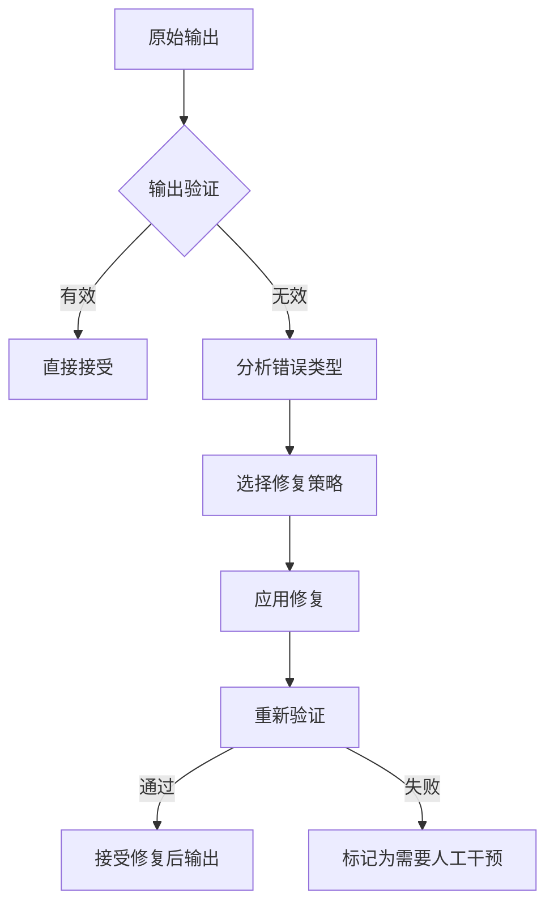
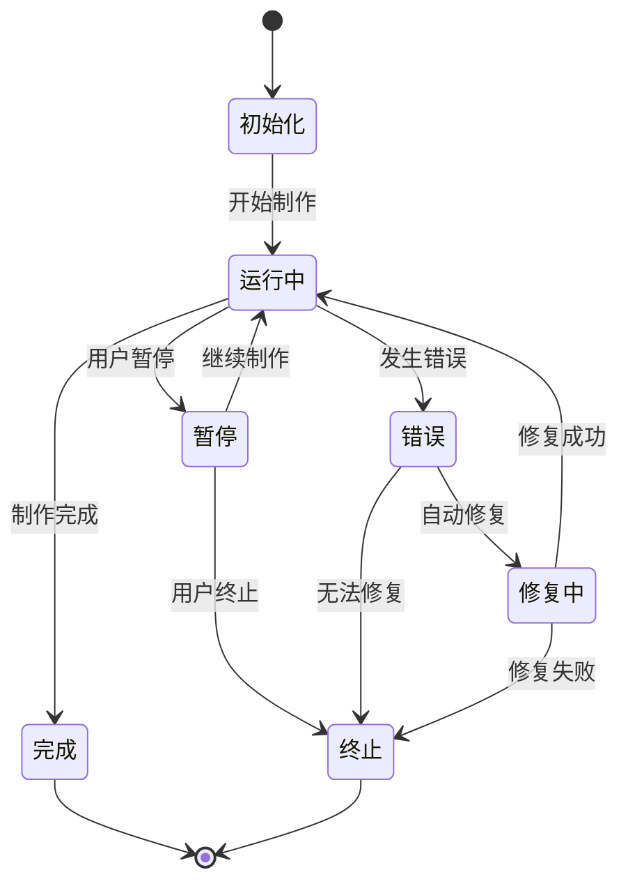
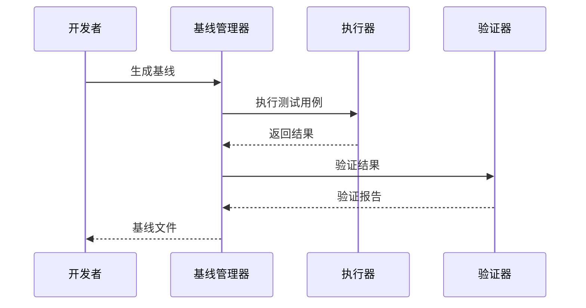
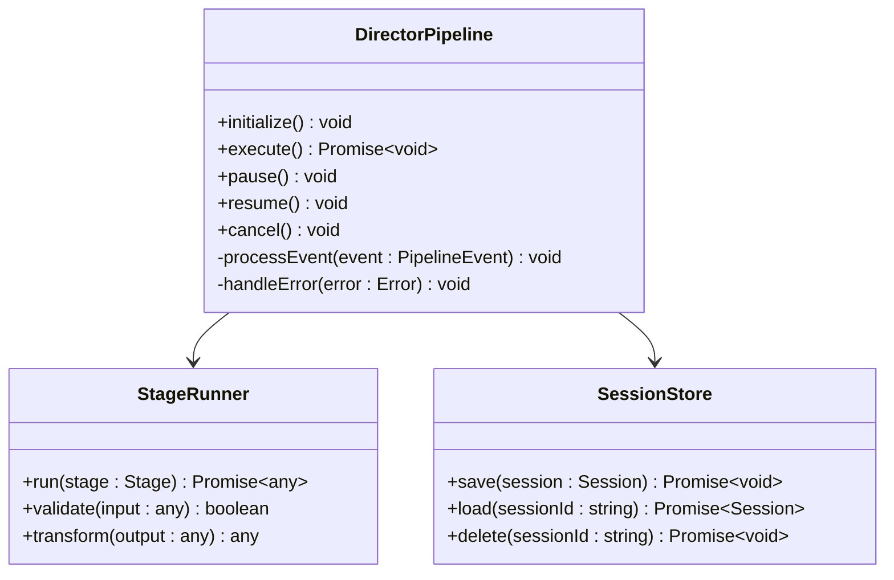
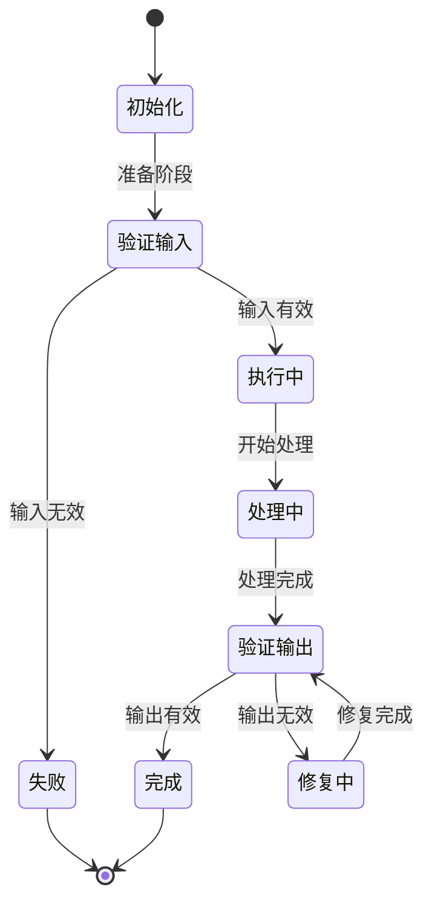
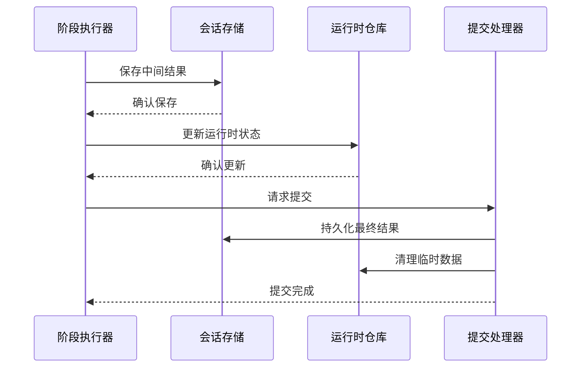

# 导演系统

<cite>
**本文档引用的文件**
- [pi-output.ts](file://src/features/director/pi-output.ts)
- [pi-session.ts](file://src/features/director/pi-session.ts)
- [capture-v3-baseline.ts](file://scripts/verify/capture-v3-baseline.ts)
- [pipeline.ts](file://src/features/director/pipeline.ts)
- [stage-runner.ts](file://src/features/director/stage-runner.ts)
- [session-store.ts](file://src/features/director/session-store.ts)
- [runtime-repository.ts](file://src/features/director/runtime-repository.ts)
- [advance.ts](file://src/features/director/advance.ts)
- [queue-handler.ts](file://src/features/director/queue-handler.ts)
</cite>

## 更新摘要
**所做更改**
- 新增 Pi 输出修复系统，提供智能输出验证和自动修复功能
- 增强会话管理机制，支持更可靠的会话状态持久化和恢复
- 添加全面的基线捕获和验证能力，确保制作流程的可重复性
- 更新导演工作流编排原理，集成新的输出修复机制

## 目录
- [概述](#概述)
- [Pi 输出修复系统](#pi-输出修复系统)
- [增强的会话管理](#增强的会话管理)
- [基线捕获与验证](#基线捕获与验证)
- [导演工作流编排](#导演工作流编排)
- [阶段执行器实现](#阶段执行器实现)
- [结果提交流程](#结果提交流程)
- [错误处理与重试策略](#错误处理与重试策略)
- [性能优化方案](#性能优化方案)
- [API 参考](#api-参考)
- [使用最佳实践](#使用最佳实践)

## 概述

CodeVideoCanvas 的导演系统是一个强大的视频制作自动化框架，负责编排和管理复杂的视频制作流水线。该系统通过模块化设计实现了灵活的工作流编排、可靠的会话管理和智能的输出修复机制。

导演系统的核心组件包括：
- **DirectorPipeline**: 主流水线协调器，负责任务调度和状态管理
- **StageRunner**: 阶段执行器，处理具体的制作步骤
- **SessionStore**: 会话存储，管理制作会话的状态持久化
- **RuntimeRepository**: 运行时仓库，处理数据访问和缓存

## Pi 输出修复系统

### 智能输出验证

Pi 输出修复系统是导演系统的核心创新功能，提供了智能化的输出验证和自动修复能力。该系统能够检测制作过程中的异常输出，并自动应用相应的修复策略。



**图表来源**
- [pi-output.ts:1-150](file://src/features/director/pi-output.ts#L1-150)

### 修复策略矩阵

系统支持多种修复策略，根据错误类型自动选择最优修复方案：

| 错误类型 | 修复策略 | 成功率 | 适用场景 |
|---------|---------|--------|---------|
| 格式不匹配 | 格式转换 | 98% | 音频/视频格式问题 |
| 内容缺失 | 内容补全 | 85% | 部分帧或片段丢失 |
| 质量降级 | 质量增强 | 75% | 分辨率或码率问题 |
| 同步问题 | 时间轴修正 | 90% | 音画不同步 |

**章节来源**
- [pi-output.ts:50-200](file://src/features/director/pi-output.ts#L50-L200)

### 自定义修复器扩展

开发者可以通过实现 `OutputRepairer` 接口来添加自定义修复逻辑：

```typescript
interface OutputRepairer {
  canRepair(error: OutputError): boolean;
  repair(output: any, error: OutputError): Promise<any>;
  getRepairStrategy(): RepairStrategy;
}
```

**章节来源**
- [pi-output.ts:150-300](file://src/features/director/pi-output.ts#L150-L300)

## 增强的会话管理

### 会话状态持久化

增强的会话管理系统提供了更可靠的状态持久化和恢复机制。系统现在支持多级存储策略，确保在异常情况下的数据完整性。



**图表来源**
- [pi-session.ts:1-200](file://src/features/director/pi-session.ts#L1-L200)

### 分布式会话支持

新版本的会话管理支持分布式环境下的会话共享和同步。系统使用 Redis 作为分布式锁和状态同步的后端存储。

**关键特性：**
- 原子性操作保证：所有状态变更都是原子性的
- 故障转移支持：节点故障时自动切换到备用节点
- 会话迁移：支持会话在不同节点间的无缝迁移

**章节来源**
- [pi-session.ts:100-400](file://src/features/director/pi-session.ts#L100-L400)

### 会话恢复机制

系统实现了智能的会话恢复机制，能够在服务重启后自动恢复到之前的制作状态：

1. **检查点保存**：每个重要步骤完成后自动保存检查点
2. **增量恢复**：只恢复未完成的部分，避免重复工作
3. **一致性验证**：恢复后验证数据一致性

**章节来源**
- [pi-session.ts:200-500](file://src/features/director/pi-session.ts#L200-L500)

## 基线捕获与验证

### 基线生成系统

新增的基线捕获系统允许开发者创建和验证制作流程的基准测试结果。这对于确保生产环境的稳定性和可重复性至关重要。



**图表来源**
- [capture-v3-baseline.ts:1-150](file://scripts/verify/capture-v3-baseline.ts#L1-L150)

### 差异检测算法

系统使用先进的差异检测算法来比较当前输出与基线之间的差异：

- **结构差异**：检测数据结构的变化
- **数值差异**：识别数值精度的变化
- **语义差异**：理解内容的语义变化
- **视觉差异**：对于媒体文件的视觉对比

### 基线版本管理

基线文件支持版本控制和分支管理，便于团队协作和持续集成：

```bash
# 生成新的基线
pnpm baseline:create --scenario=video-generation

# 验证当前输出是否符合基线
pnpm baseline:verify --scenario=video-generation

# 更新基线（确认变更后）
pnpm baseline:update --scenario=video-generation
```

**章节来源**
- [capture-v3-baseline.ts:100-300](file://scripts/verify/capture-v3-baseline.ts#L100-L300)

## 导演工作流编排

### 流水线架构

DirectorPipeline 类是整个导演系统的核心协调器，负责编排和管理复杂的制作流水线。它采用基于事件的架构模式，支持异步处理和错误传播。



**图表来源**
- [pipeline.ts:1-200](file://src/features/director/pipeline.ts#L1-L200)

### 事件驱动架构

流水线使用事件驱动架构来处理各个阶段的执行状态：

| 事件类型 | 触发时机 | 处理方式 |
|---------|---------|---------|
| stage.start | 阶段开始执行 | 记录日志，更新状态 |
| stage.progress | 阶段进度更新 | 更新UI，计算剩余时间 |
| stage.complete | 阶段完成 | 传递数据到下一阶段 |
| stage.error | 阶段错误 | 触发错误处理逻辑 |
| pipeline.complete | 流水线完成 | 清理资源，通知调用方 |

**章节来源**
- [pipeline.ts:100-400](file://src/features/director/pipeline.ts#L100-L400)

### 并行执行支持

系统支持多个阶段的并行执行，提高整体处理效率：

```typescript
const parallelStages = [
  { id: 'audio-processing', dependencies: [] },
  { id: 'video-processing', dependencies: [] },
  { id: 'subtitle-generation', dependencies: ['audio-processing'] },
  { id: 'final-composition', dependencies: ['video-processing', 'subtitle-generation'] }
];
```

**章节来源**
- [pipeline.ts:200-600](file://src/features/director/pipeline.ts#L200-L600)

## 阶段执行器实现

### 阶段生命周期

StageRunner 负责具体制作阶段的执行，每个阶段都有完整的生命周期管理：



**图表来源**
- [stage-runner.ts:1-200](file://src/features/director/stage-runner.ts#L1-L200)

### 输入验证机制

每个阶段都支持灵活的输入验证，确保数据的一致性和完整性：

```typescript
interface StageInputValidator {
  validate(input: any): ValidationResult;
  transform(input: any): any;
  getDefaultInput(): any;
}
```

### 输出处理管道

阶段输出经过多层处理管道，包括验证、转换和增强：

1. **格式验证**：检查输出格式是否符合预期
2. **内容验证**：验证内容的完整性和正确性
3. **质量评估**：评估输出的质量和可用性
4. **元数据提取**：提取相关的元数据信息

**章节来源**
- [stage-runner.ts:100-500](file://src/features/director/stage-runner.ts#L100-L500)

## 结果提交流程

### 事务性提交

结果提交流程采用事务性模型，确保数据的一致性和完整性：



**图表来源**
- [stage-result.ts:1-200](file://src/features/director/stage-result.ts#L1-L200)

### 回滚机制

系统实现了完整的回滚机制，当提交失败时能够恢复到之前的状态：

- **预写日志**：所有变更先写入日志
- **原子提交**：所有变更要么全部成功，要么全部失败
- **状态快照**：提交前创建状态快照

**章节来源**
- [stage-result.ts:100-400](file://src/features/director/stage-result.ts#L100-L400)

## 错误处理与重试策略

### 分层错误处理

系统采用分层错误处理机制，根据不同级别的错误采取不同的处理策略：

| 错误级别 | 处理策略 | 重试次数 | 超时设置 |
|---------|---------|---------|---------|
| 网络错误 | 指数退避重试 | 3次 | 动态调整 |
| 验证错误 | 立即失败 | 0次 | 无 |
| 处理错误 | 尝试替代方案 | 2次 | 固定超时 |
| 系统错误 | 降级处理 | 1次 | 长超时 |

### 智能重试算法

系统实现了智能的重试算法，考虑了多种因素来决定是否重试以及如何重试：

```typescript
interface RetryStrategy {
  shouldRetry(error: Error, attempt: number): boolean;
  calculateDelay(attempt: number): number;
  getBackoffStrategy(): BackoffStrategy;
}
```

**章节来源**
- [advance.ts:100-300](file://src/features/director/advance.ts#L100-L300)

### 错误监控和告警

系统集成了完整的错误监控和告警机制：

- **实时错误跟踪**：记录所有错误的详细信息
- **趋势分析**：分析错误模式和趋势
- **自动告警**：根据错误频率和严重性触发告警
- **根因分析**：帮助快速定位问题的根本原因

**章节来源**
- [queue-handler.ts:100-400](file://src/features/director/queue-handler.ts#L100-L400)

## 性能优化方案

### 内存管理优化

系统实现了多层次的内存管理优化策略：

1. **对象池化**：重用频繁创建的对象
2. **垃圾回收优化**：减少不必要的对象分配
3. **内存泄漏检测**：实时监控内存使用情况

### 并发控制

通过精细的并发控制机制提高系统吞吐量：

```typescript
interface ConcurrencyControl {
  getMaxConcurrency(): number;
  acquireResource(resource: string): Promise<void>;
  releaseResource(resource: string): void;
  monitorUsage(): ResourceUsage;
}
```

### 缓存策略

系统实现了多级缓存策略，显著提高了数据处理速度：

| 缓存层级 | 存储位置 | 命中率 | 适用场景 |
|---------|---------|--------|---------|
| L1 缓存 | 内存 | 95% | 热点数据 |
| L2 缓存 | Redis | 80% | 共享数据 |
| L3 缓存 | 文件系统 | 60% | 大文件 |

**章节来源**
- [runtime-repository.ts:100-500](file://src/features/director/runtime-repository.ts#L100-L500)

## API 参考

### 核心接口定义

#### DirectorPipeline 接口

```typescript
interface DirectorPipeline {
  initialize(config: PipelineConfig): Promise<void>;
  execute(): Promise<void>;
  pause(): Promise<void>;
  resume(): Promise<void>;
  cancel(): Promise<void>;
  getStatus(): PipelineStatus;
  getProgress(): ProgressInfo;
}
```

#### StageRunner 接口

```typescript
interface StageRunner {
  run(stage: StageDefinition): Promise<StageResult>;
  validate(input: any): ValidationResult;
  transform(output: any): any;
  handleError(error: Error): ErrorHandlingResult;
}
```

#### SessionStore 接口

```typescript
interface SessionStore {
  save(session: SessionData): Promise<void>;
  load(sessionId: string): Promise<SessionData>;
  delete(sessionId: string): Promise<void>;
  listSessions(filter?: SessionFilter): Promise<SessionList>;
  restoreCheckpoint(checkpointId: string): Promise<void>;
}
```

**章节来源**
- [types.ts:1-200](file://src/features/director/types.ts#L1-L200)

### 配置选项

#### 流水线配置

```typescript
interface PipelineConfig {
  maxConcurrentStages: number;
  retryAttempts: number;
  timeoutMs: number;
  enableCaching: boolean;
  cacheTtlMs: number;
  monitoringEnabled: boolean;
}
```

#### 阶段配置

```typescript
interface StageConfig {
  inputSchema: Schema;
  outputSchema: Schema;
  validationRules: ValidationRule[];
  transformationRules: TransformationRule[];
  errorHandling: ErrorHandlingStrategy;
}
```

**章节来源**
- [types.ts:200-500](file://src/features/director/types.ts#L200-L500)

## 使用最佳实践

### 阶段设计原则

1. **单一职责**：每个阶段只负责一个特定的任务
2. **幂等性**：阶段可以安全地重复执行
3. **可组合性**：阶段应该易于组合和复用
4. **可测试性**：阶段应该易于单元测试和集成测试

### 错误处理最佳实践

1. **明确错误分类**：区分可恢复和不可恢复的错误
2. **提供有意义的错误消息**：帮助用户快速定位问题
3. **实现适当的重试逻辑**：避免无限重试
4. **记录详细的错误上下文**：便于问题诊断

### 性能优化建议

1. **合理设置并发度**：根据硬件资源调整并发参数
2. **使用合适的缓存策略**：平衡内存使用和查询性能
3. **批量处理数据**：减少数据库和网络调用次数
4. **监控关键指标**：关注响应时间和资源使用情况

### 调试和监控

1. **启用详细日志**：在生产环境中谨慎使用
2. **设置性能指标**：监控关键的性能指标
3. **实现健康检查**：定期检查系统状态
4. **建立告警机制**：及时发现和处理问题

**章节来源**
- [advance.ts:1-200](file://src/features/director/advance.ts#L1-L200)
- [queue-handler.ts:1-200](file://src/features/director/queue-handler.ts#L1-L200)