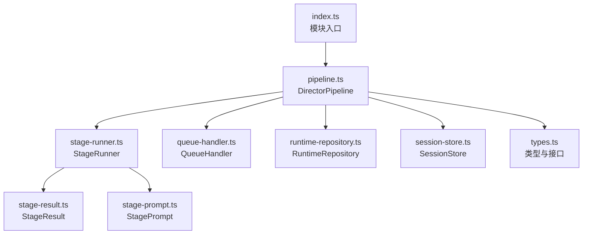
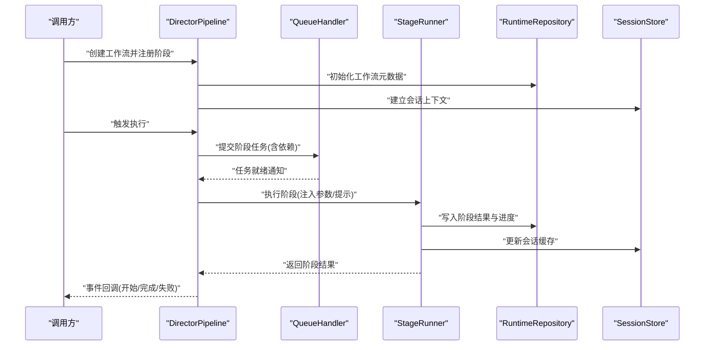
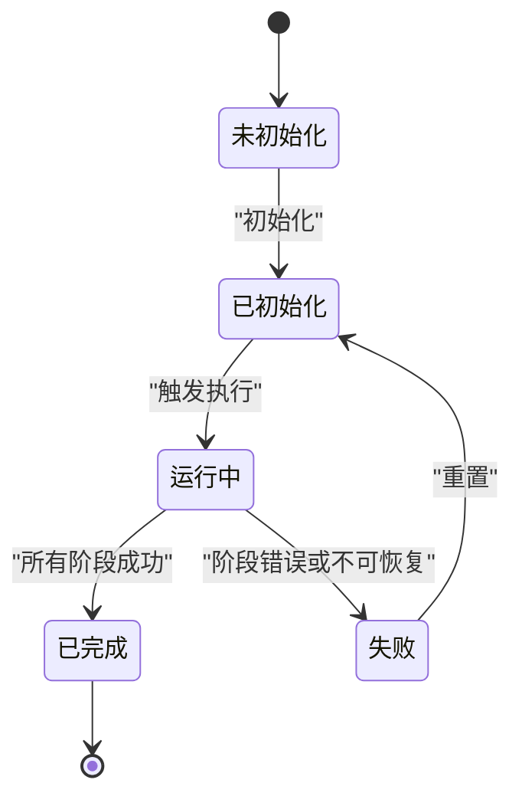
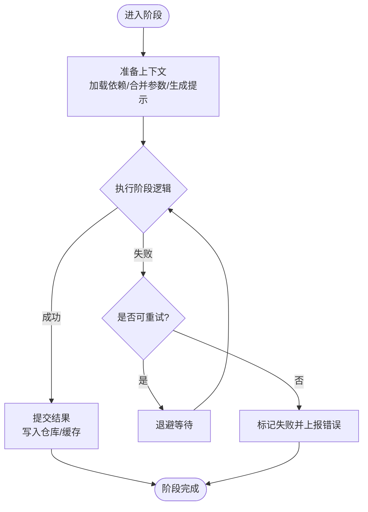
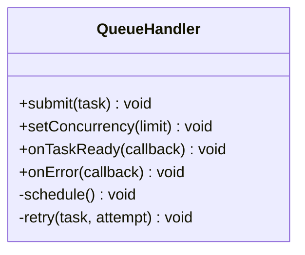
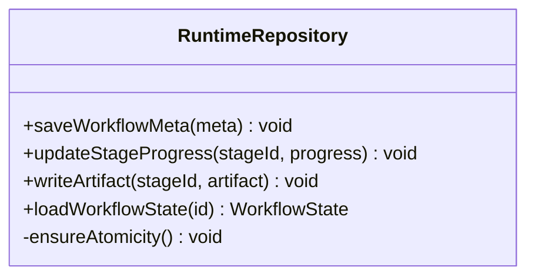
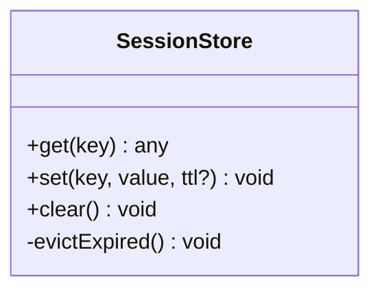
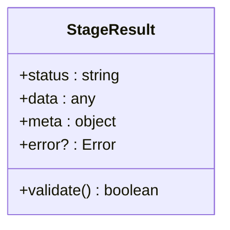
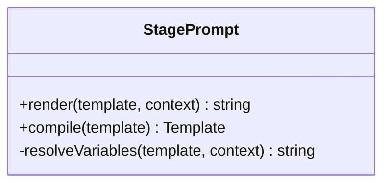
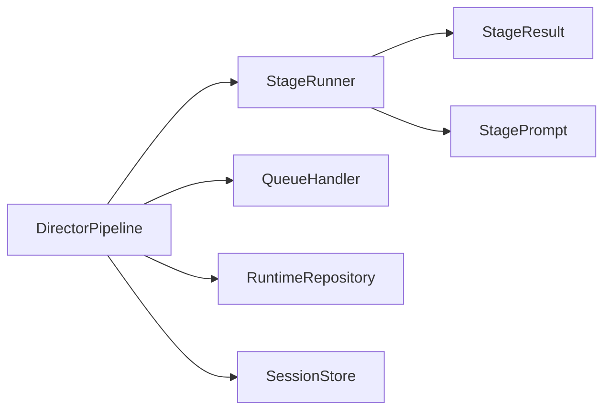

# 工作流编排引擎

<cite>
**本文引用的文件**   
- [pipeline.ts](file://src/features/director/pipeline.ts)
- [stage-runner.ts](file://src/features/director/stage-runner.ts)
- [queue-handler.ts](file://src/features/director/queue-handler.ts)
- [runtime-repository.ts](file://src/features/director/runtime-repository.ts)
- [session-store.ts](file://src/features/director/session-store.ts)
- [stage-result.ts](file://src/features/director/stage-result.ts)
- [stage-prompt.ts](file://src/features/director/stage-prompt.ts)
- [types.ts](file://src/features/director/types.ts)
- [index.ts](file://src/features/director/index.ts)
</cite>

## 目录
1. [简介](#简介)
2. [项目结构](#项目结构)
3. [核心组件](#核心组件)
4. [架构总览](#架构总览)
5. [详细组件分析](#详细组件分析)
6. [依赖关系分析](#依赖关系分析)
7. [性能考量](#性能考量)
8. [故障排查指南](#故障排查指南)
9. [结论](#结论)
10. [附录](#附录)

## 简介
本文件面向导演系统的工作流编排引擎，围绕 DirectorPipeline 类的设计与实现进行系统化说明。文档涵盖：
- 工作流的定义、阶段注册机制、执行顺序控制与依赖管理
- 工作流生命周期（初始化到完成）的状态转换
- 自定义工作流创建、阶段参数配置与工作流事件处理
- 错误处理策略、重试机制与性能监控方案
- 完整的设计模式与最佳实践

## 项目结构
导演系统的工作流编排相关代码集中在 features/director 目录下，核心文件包括：
- pipeline.ts：DirectorPipeline 主类，负责工作流定义、阶段注册、调度与执行
- stage-runner.ts：阶段运行器，封装单个阶段的执行上下文与结果提交
- queue-handler.ts：队列处理器，提供并发控制与任务调度
- runtime-repository.ts：运行时仓库，持久化工作流状态与中间产物
- session-store.ts：会话存储，维护会话级数据与缓存
- stage-result.ts：阶段结果模型与校验
- stage-prompt.ts：阶段提示模板与生成逻辑
- types.ts：类型定义与接口契约
- index.ts：模块导出入口

图表来源
- [pipeline.ts](file://src/features/director/pipeline.ts)
- [stage-runner.ts](file://src/features/director/stage-runner.ts)
- [queue-handler.ts](file://src/features/director/queue-handler.ts)
- [runtime-repository.ts](file://src/features/director/runtime-repository.ts)
- [session-store.ts](file://src/features/director/session-store.ts)
- [stage-result.ts](file://src/features/director/stage-result.ts)
- [stage-prompt.ts](file://src/features/director/stage-prompt.ts)
- [types.ts](file://src/features/director/types.ts)
- [index.ts](file://src/features/director/index.ts)

章节来源
- [pipeline.ts](file://src/features/director/pipeline.ts)
- [stage-runner.ts](file://src/features/director/stage-runner.ts)
- [queue-handler.ts](file://src/features/director/queue-handler.ts)
- [runtime-repository.ts](file://src/features/director/runtime-repository.ts)
- [session-store.ts](file://src/features/director/session-store.ts)
- [stage-result.ts](file://src/features/director/stage-result.ts)
- [stage-prompt.ts](file://src/features/director/stage-prompt.ts)
- [types.ts](file://src/features/director/types.ts)
- [index.ts](file://src/features/director/index.ts)

## 核心组件
- DirectorPipeline：工作流编排的核心，提供阶段注册、依赖声明、执行顺序控制、事件分发与生命周期管理。
- StageRunner：封装单阶段执行上下文，负责参数注入、提示生成、调用外部服务、结果写入与错误上报。
- QueueHandler：基于队列的并发控制与任务调度，支持限流、重试与退避策略。
- RuntimeRepository：持久化工作流状态、阶段进度与中间产物，支持断点续跑。
- SessionStore：会话级缓存与临时数据共享，避免重复计算与IO。
- StageResult：阶段输出数据结构与校验规则，确保下游阶段输入一致性。
- StagePrompt：阶段提示模板管理与动态填充，保证可复现性与可控性。
- Types：统一类型定义，约束各组件间的数据契约。

章节来源
- [pipeline.ts](file://src/features/director/pipeline.ts)
- [stage-runner.ts](file://src/features/director/stage-runner.ts)
- [queue-handler.ts](file://src/features/director/queue-handler.ts)
- [runtime-repository.ts](file://src/features/director/runtime-repository.ts)
- [session-store.ts](file://src/features/director/session-store.ts)
- [stage-result.ts](file://src/features/director/stage-result.ts)
- [stage-prompt.ts](file://src/features/director/stage-prompt.ts)
- [types.ts](file://src/features/director/types.ts)

## 架构总览
DirectorPipeline 作为编排中心，协调阶段运行器、队列处理器、运行时仓库与会话存储，形成“定义—调度—执行—持久化—事件”闭环。

图表来源
- [pipeline.ts](file://src/features/director/pipeline.ts)
- [queue-handler.ts](file://src/features/director/queue-handler.ts)
- [stage-runner.ts](file://src/features/director/stage-runner.ts)
- [runtime-repository.ts](file://src/features/director/runtime-repository.ts)
- [session-store.ts](file://src/features/director/session-store.ts)

## 详细组件分析

### DirectorPipeline 设计与工作流程
- 工作流定义
  - 通过 API 注册阶段，声明阶段名称、依赖列表、执行函数与可选参数。
  - 支持拓扑排序与依赖解析，确保无环图与正确执行顺序。
- 阶段注册机制
  - 提供集中式注册表，按阶段名索引；支持覆盖检查与版本兼容。
  - 阶段参数可通过默认值与运行时覆盖组合注入。
- 执行顺序控制
  - 基于依赖图的拓扑排序生成执行序列；对并行阶段进行分组调度。
  - 支持条件跳过（如上游失败或缓存命中）。
- 依赖管理
  - 显式声明阶段间依赖；在运行时校验依赖是否满足。
  - 支持跨阶段数据传递（通过运行时仓库与会话存储）。
- 生命周期管理
  - 状态机：未初始化 → 已初始化 → 运行中 → 已完成/失败。
  - 关键事件：onWorkflowStart、onStageStart、onStageComplete、onWorkflowComplete、onError。
- 事件处理
  - 提供订阅/发布机制，允许外部监听工作流与阶段事件。
  - 事件携带上下文（阶段名、参数、结果、错误信息）。

图表来源
- [pipeline.ts](file://src/features/director/pipeline.ts)

章节来源
- [pipeline.ts](file://src/features/director/pipeline.ts)

### StageRunner 阶段运行器
- 职责
  - 封装阶段执行上下文，注入参数与提示，调用外部服务，写入结果。
  - 负责错误捕获、重试与回滚（如部分写入）。
- 执行流程
  - 准备阶段：加载依赖数据、合并参数、生成提示。
  - 执行阶段：调用业务逻辑或服务，记录耗时与指标。
  - 提交阶段：写入运行时仓库与会话缓存，触发完成事件。
- 结果模型
  - 使用 StageResult 规范输出结构，包含状态、数据、元信息与错误详情。

图表来源
- [stage-runner.ts](file://src/features/director/stage-runner.ts)
- [stage-result.ts](file://src/features/director/stage-result.ts)
- [stage-prompt.ts](file://src/features/director/stage-prompt.ts)

章节来源
- [stage-runner.ts](file://src/features/director/stage-runner.ts)
- [stage-result.ts](file://src/features/director/stage-result.ts)
- [stage-prompt.ts](file://src/features/director/stage-prompt.ts)

### QueueHandler 队列处理器
- 并发控制
  - 基于令牌桶或固定大小队列限制并发度，防止资源耗尽。
- 任务调度
  - 根据优先级与依赖就绪情况调度任务；支持延迟与批处理。
- 重试与退避
  - 指数退避与抖动策略，避免雪崩效应。
- 监控与度量
  - 记录队列长度、等待时间、吞吐率与错误率。

图表来源
- [queue-handler.ts](file://src/features/director/queue-handler.ts)

章节来源
- [queue-handler.ts](file://src/features/director/queue-handler.ts)

### RuntimeRepository 运行时仓库
- 功能
  - 持久化工作流元数据、阶段进度与中间产物。
  - 支持查询、更新与快照，便于断点续跑与审计。
- 设计要点
  - 原子写入与事务保障，避免部分更新导致不一致。
  - 读写分离与缓存层，提升性能。

图表来源
- [runtime-repository.ts](file://src/features/director/runtime-repository.ts)

章节来源
- [runtime-repository.ts](file://src/features/director/runtime-repository.ts)

### SessionStore 会话存储
- 功能
  - 维护会话级缓存与临时数据，减少重复计算与 IO。
  - 提供键值存取与过期策略。
- 使用场景
  - 缓存阶段输入预处理结果、提示模板编译结果等。

图表来源
- [session-store.ts](file://src/features/director/session-store.ts)

章节来源
- [session-store.ts](file://src/features/director/session-store.ts)

### StageResult 阶段结果
- 结构
  - 包含状态码、数据载荷、元信息（耗时、ID、版本）与错误详情。
- 校验
  - 提供结构化校验，确保下游阶段输入符合预期。

图表来源
- [stage-result.ts](file://src/features/director/stage-result.ts)

章节来源
- [stage-result.ts](file://src/features/director/stage-result.ts)

### StagePrompt 阶段提示
- 功能
  - 管理阶段提示模板，支持变量替换与条件分支。
  - 提供可复现的提示生成，便于调试与回归测试。
- 集成
  - 在 StageRunner 准备阶段被调用，注入上下文数据。

图表来源
- [stage-prompt.ts](file://src/features/director/stage-prompt.ts)

章节来源
- [stage-prompt.ts](file://src/features/director/stage-prompt.ts)

### Types 类型与接口
- 内容
  - 定义工作流、阶段、结果、事件等核心类型。
  - 约束各组件间的契约，确保类型安全与可维护性。

章节来源
- [types.ts](file://src/features/director/types.ts)

### Index 模块入口
- 作用
  - 统一导出 DirectorPipeline 及相关工具，简化上层引用。

章节来源
- [index.ts](file://src/features/director/index.ts)

## 依赖关系分析
- 耦合与内聚
  - DirectorPipeline 高内聚于编排逻辑，低耦合于具体阶段实现。
  - StageRunner 与 StagePrompt、StageResult 紧密协作，形成清晰边界。
- 直接依赖
  - Pipeline → StageRunner、QueueHandler、RuntimeRepository、SessionStore
  - StageRunner → StageResult、StagePrompt、RuntimeRepository、SessionStore
- 间接依赖
  - 通过类型定义与事件契约解耦，降低循环依赖风险。

图表来源
- [pipeline.ts](file://src/features/director/pipeline.ts)
- [stage-runner.ts](file://src/features/director/stage-runner.ts)
- [queue-handler.ts](file://src/features/director/queue-handler.ts)
- [runtime-repository.ts](file://src/features/director/runtime-repository.ts)
- [session-store.ts](file://src/features/director/session-store.ts)
- [stage-result.ts](file://src/features/director/stage-result.ts)
- [stage-prompt.ts](file://src/features/director/stage-prompt.ts)

章节来源
- [pipeline.ts](file://src/features/director/pipeline.ts)
- [stage-runner.ts](file://src/features/director/stage-runner.ts)
- [queue-handler.ts](file://src/features/director/queue-handler.ts)
- [runtime-repository.ts](file://src/features/director/runtime-repository.ts)
- [session-store.ts](file://src/features/director/session-store.ts)
- [stage-result.ts](file://src/features/director/stage-result.ts)
- [stage-prompt.ts](file://src/features/director/stage-prompt.ts)

## 性能考量
- 并发与限流
  - 合理设置队列并发度，避免资源争用；结合 CPU/IO 特性调整阈值。
- 缓存与去重
  - 利用 SessionStore 缓存中间结果，减少重复计算；为幂等操作启用去重键。
- 异步与批处理
  - 将独立阶段并行执行；对批量数据采用分片与批处理策略。
- 监控与度量
  - 采集阶段耗时、错误率、队列积压与吞吐指标，用于容量规划与调优。
- 内存与GC
  - 避免大对象长期驻留；及时释放不再使用的上下文与缓存条目。

[本节为通用指导，不直接分析具体文件]

## 故障排查指南
- 常见问题
  - 依赖未满足：检查阶段依赖声明与上游结果完整性。
  - 阶段失败：查看 StageResult.error 与日志上下文，定位外部服务异常。
  - 队列阻塞：监控队列长度与等待时间，调整并发度或优化阶段耗时。
  - 缓存不一致：清理会话缓存并重新执行，确认幂等性与键冲突。
- 诊断步骤
  - 启用详细日志与追踪 ID，关联请求链路。
  - 使用运行时仓库查询阶段进度与中间产物，验证数据一致性。
  - 回放提示模板与输入数据，复现问题并回归测试。
- 恢复策略
  - 对可重试错误应用指数退避；对不可恢复错误快速失败并通知。
  - 支持断点续跑，从最近成功阶段继续执行。

章节来源
- [stage-runner.ts](file://src/features/director/stage-runner.ts)
- [stage-result.ts](file://src/features/director/stage-result.ts)
- [queue-handler.ts](file://src/features/director/queue-handler.ts)
- [runtime-repository.ts](file://src/features/director/runtime-repository.ts)

## 结论
DirectorPipeline 以清晰的编排模型与健壮的执行框架为核心，结合 StageRunner、QueueHandler、RuntimeRepository 与 SessionStore，构建了可扩展、可观测、可恢复的工作流编排引擎。通过严格的类型契约、事件驱动与生命周期管理，系统能够灵活应对复杂的多阶段任务，并提供良好的性能与稳定性保障。

[本节为总结性内容，不直接分析具体文件]

## 附录
- 自定义工作流示例路径
  - 参考 pipeline.ts 中的注册与执行 API，定义阶段、声明依赖、注入参数并订阅事件。
- 阶段参数配置示例路径
  - 参考 stage-runner.ts 的参数合并与提示渲染逻辑，了解默认值与运行时覆盖机制。
- 事件处理示例路径
  - 参考 pipeline.ts 的事件订阅与回调，监听工作流与阶段生命周期事件。
- 错误处理与重试示例路径
  - 参考 stage-runner.ts 的错误捕获与重试策略，以及 queue-handler.ts 的退避实现。
- 性能监控示例路径
  - 参考 queue-handler.ts 与 stage-runner.ts 的度量采集点，结合外部监控系统接入。

章节来源
- [pipeline.ts](file://src/features/director/pipeline.ts)
- [stage-runner.ts](file://src/features/director/stage-runner.ts)
- [queue-handler.ts](file://src/features/director/queue-handler.ts)
- [runtime-repository.ts](file://src/features/director/runtime-repository.ts)
- [session-store.ts](file://src/features/director/session-store.ts)
- [stage-result.ts](file://src/features/director/stage-result.ts)
- [stage-prompt.ts](file://src/features/director/stage-prompt.ts)
- [types.ts](file://src/features/director/types.ts)
- [index.ts](file://src/features/director/index.ts)