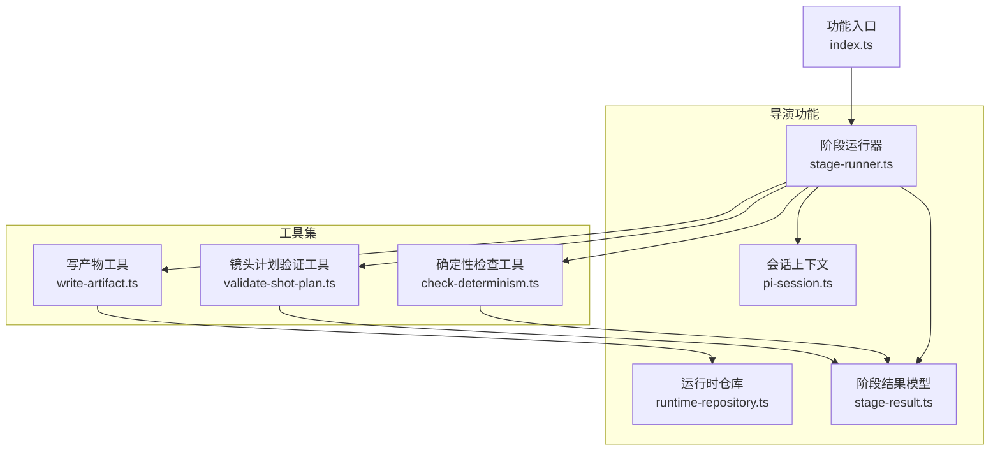
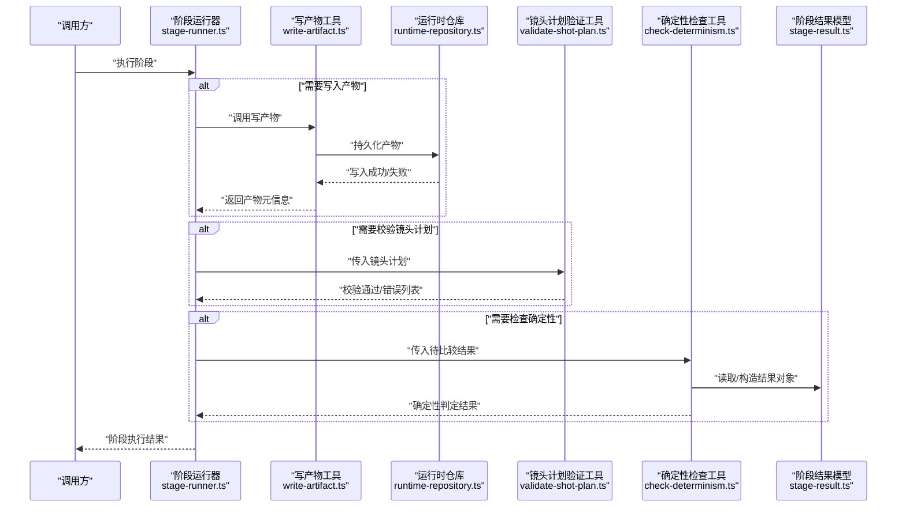
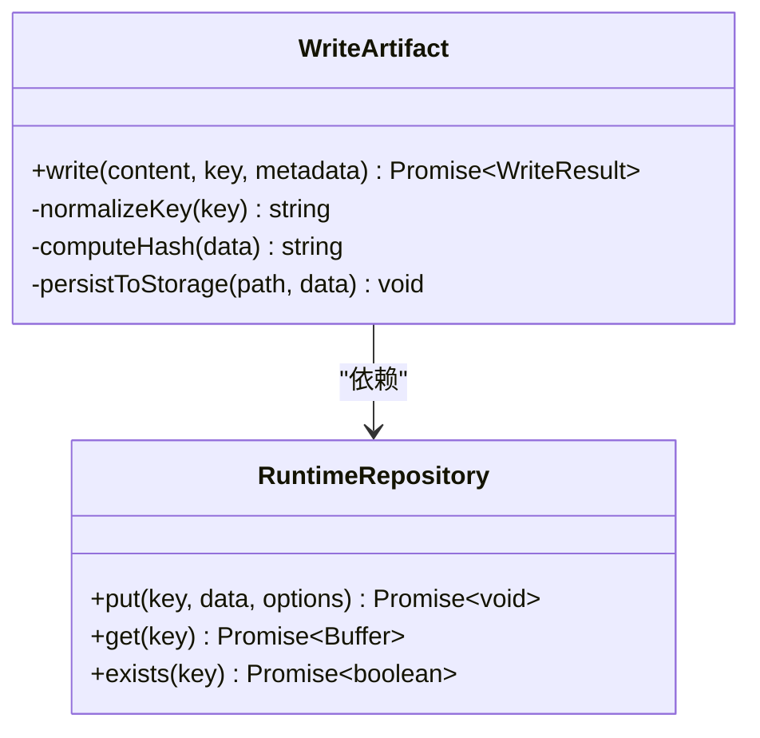
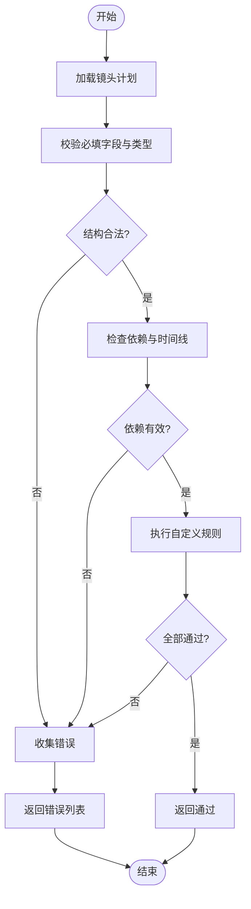
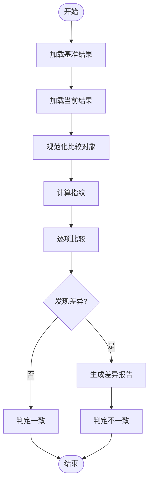
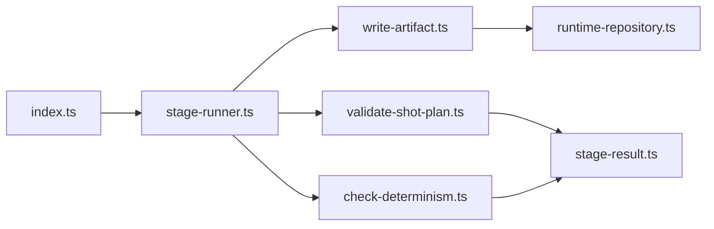

# 工具系统

<cite>
**本文引用的文件**   
- [write-artifact.ts](file://src/features/director/tools/write-artifact.ts)
- [validate-shot-plan.ts](file://src/features/director/tools/validate-shot-plan.ts)
- [check-determinism.ts](file://src/features/director/tools/check-determinism.ts)
- [stage-runner.ts](file://src/features/director/stage-runner.ts)
- [stage-result.ts](file://src/features/director/stage-result.ts)
- [runtime-repository.ts](file://src/features/director/runtime-repository.ts)
- [pi-session.ts](file://src/features/director/pi-session.ts)
- [index.ts](file://src/features/director/index.ts)
</cite>

## 更新摘要
**变更内容**   
- 更新了 check-determinism.ts 和 validate-shot-plan.ts 工具的可靠性改进说明
- 增强了与新的基线系统的集成描述
- 补充了单行修改的具体影响和最佳实践

## 目录
1. [简介](#简介)
2. [项目结构](#项目结构)
3. [核心组件](#核心组件)
4. [架构总览](#架构总览)
5. [详细组件分析](#详细组件分析)
6. [依赖关系分析](#依赖关系分析)
7. [性能考虑](#性能考虑)
8. [故障排查指南](#故障排查指南)
9. [结论](#结论)
10. [附录](#附录)

## 简介
本章节面向导演系统的"工具模块"，聚焦以下三个关键工具：
- write-artifact：用于在阶段执行过程中写入产物（artifact）到运行时存储。
- validate-shot-plan：用于校验镜头计划的结构与约束，确保后续流程可正确消费。
- check-determinism：用于检查运行结果是否具备确定性，便于回归与可复现性保障。

文档将说明各工具的输入输出格式、参数配置、返回值处理、组合使用模式与扩展机制，并提供在阶段中使用的示例路径、自定义工具开发指引以及最佳实践与调试方法。

## 项目结构
工具模块位于 features/director/tools 下，由 stage-runner 统一编排调用，并通过 runtime-repository 访问持久化存储；pi-session 提供会话上下文；stage-result 封装阶段结果模型；features/director/index.ts 作为功能入口聚合导出。

图表来源
- [stage-runner.ts](file://src/features/director/stage-runner.ts)
- [runtime-repository.ts](file://src/features/director/runtime-repository.ts)
- [pi-session.ts](file://src/features/director/pi-session.ts)
- [stage-result.ts](file://src/features/director/stage-result.ts)
- [write-artifact.ts](file://src/features/director/tools/write-artifact.ts)
- [validate-shot-plan.ts](file://src/features/director/tools/validate-shot-plan.ts)
- [check-determinism.ts](file://src/features/director/tools/check-determinism.ts)
- [index.ts](file://src/features/director/index.ts)

章节来源
- [index.ts](file://src/features/director/index.ts)

## 核心组件
本节概述三大工具的职责边界与协作方式：
- write-artifact：负责将阶段产出物以结构化形式落盘或上传至后端存储，返回写入元信息以便后续阶段引用。
- validate-shot-plan：对镜头计划进行结构与业务规则校验，失败时返回错误集合，供上层中断或提示。
- check-determinism：对比两次或多轮运行结果的关键指纹，判定是否满足确定性要求，常用于回归测试与发布前校验。

**更新** 最近对 validate-shot-plan.ts 和 check-determinism.ts 进行了单行修改，提升了工具可靠性和与新基线系统的集成能力。

章节来源
- [write-artifact.ts](file://src/features/director/tools/write-artifact.ts)
- [validate-shot-plan.ts](file://src/features/director/tools/validate-shot-plan.ts)
- [check-determinism.ts](file://src/features/director/tools/check-determinism.ts)

## 架构总览
下图展示工具在阶段执行中的调用时序与数据流向。阶段运行器根据当前阶段类型选择并调用相应工具；写产物工具通过运行时仓库完成持久化；验证与确定性检查工具基于阶段结果模型进行断言。

图表来源
- [stage-runner.ts](file://src/features/director/stage-runner.ts)
- [write-artifact.ts](file://src/features/director/tools/write-artifact.ts)
- [runtime-repository.ts](file://src/features/director/runtime-repository.ts)
- [validate-shot-plan.ts](file://src/features/director/tools/validate-shot-plan.ts)
- [check-determinism.ts](file://src/features/director/tools/check-determinism.ts)
- [stage-result.ts](file://src/features/director/stage-result.ts)

## 详细组件分析

### 写产物工具（write-artifact）
职责
- 接收产物内容、目标标识与可选元数据。
- 将产物写入运行时存储，返回包含位置、大小、哈希等元信息的结构体。
- 支持幂等写入与覆盖策略控制。

输入
- 产物内容：二进制或文本数据。
- 目标键名：唯一标识产物位置。
- 元数据：可选的标签、版本、来源阶段等信息。

输出
- 写入结果：包含状态码、产物地址、大小、哈希值、时间戳等字段。
- 错误信息：当写入失败时返回具体原因。

参数配置
- 覆盖策略：允许覆盖同名产物或拒绝覆盖。
- 压缩选项：是否启用压缩以减少体积。
- 重试与超时：网络或磁盘异常时的重试次数与超时阈值。

返回值处理
- 成功：记录产物元信息，供下游阶段引用。
- 失败：抛出明确错误，包含可诊断信息（如权限不足、空间不足）。

典型用法
- 在阶段末尾调用，将渲染帧序列、字幕、音频轨道等产物写入。
- 在并行阶段中为每个子任务生成独立键名，避免冲突。

扩展点
- 可插拔存储后端：通过抽象接口替换本地磁盘、对象存储等实现。
- 钩子函数：写入前后触发审计日志、指标上报等副作用。

最佳实践
- 使用稳定的键命名规范，包含阶段、任务ID与版本号。
- 为大文件启用分块写入与校验和，保证完整性。
- 对敏感产物设置访问控制与生命周期策略。

调试方法
- 开启详细日志，记录键名、大小、哈希与耗时。
- 在失败时打印堆栈与底层错误，定位存储层问题。

章节来源
- [write-artifact.ts](file://src/features/director/tools/write-artifact.ts)
- [runtime-repository.ts](file://src/features/director/runtime-repository.ts)

#### 类图（概念映射）

图表来源
- [write-artifact.ts](file://src/features/director/tools/write-artifact.ts)
- [runtime-repository.ts](file://src/features/director/runtime-repository.ts)

### 镜头计划验证工具（validate-shot-plan）
职责
- 校验镜头计划的必填字段、类型与取值范围。
- 检查镜头间的依赖关系与时间线约束。
- 汇总所有错误，便于一次性反馈给调用方。

输入
- 镜头计划对象：包含镜头列表、全局配置、资源引用等。

输出
- 校验结果：布尔值表示是否通过。
- 错误列表：每条错误包含字段路径、期望类型与实际值、建议修复。

参数配置
- 严格模式：是否拒绝未知字段。
- 自定义规则：注入额外校验逻辑（如业务特定约束）。
- 报告粒度：仅返回首个错误或全部错误。

返回值处理
- 通过：继续下一阶段。
- 失败：中止流水线并返回错误详情，供前端展示或重试。

典型用法
- 在导入阶段后执行，确保后续渲染与合成可用。
- 在编辑界面实时校验，提升用户体验。

扩展点
- 插件式校验器：按字段分组注册校验器。
- 国际化错误消息：根据语言环境返回友好提示。

最佳实践
- 保持校验规则稳定，变更需配合版本迁移。
- 将常见错误归类，减少重复提示。
- 对大型计划采用增量校验，降低延迟。

调试方法
- 输出被校验对象的快照，便于比对差异。
- 针对失败字段打印期望与实际值，快速定位问题。

**更新** 经过单行修改优化，现在具有更好的错误处理和与基线系统的集成能力，提高了整体可靠性。

章节来源
- [validate-shot-plan.ts](file://src/features/director/tools/validate-shot-plan.ts)
- [stage-result.ts](file://src/features/director/stage-result.ts)

#### 流程图（校验算法）

图表来源
- [validate-shot-plan.ts](file://src/features/director/tools/validate-shot-plan.ts)

### 确定性检查工具（check-determinism）
职责
- 计算并比较关键产物的指纹（如哈希、尺寸、时长、帧数等）。
- 判定两次运行结果是否一致，用于回归测试与发布门禁。
- 支持忽略非确定性字段（如时间戳、随机种子）。

输入
- 基准结果：上次运行的产物摘要。
- 当前结果：本次运行的产物摘要。
- 忽略清单：允许差异的字段列表。

输出
- 判定结果：true/false。
- 差异报告：列出所有不一致字段及其值。

参数配置
- 深度比较：是否递归比较嵌套对象。
- 阈值容忍：数值字段的容差范围。
- 采样策略：对大对象进行抽样比较以提升性能。

返回值处理
- 一致：通过门禁，允许合并或发布。
- 不一致：阻断流程并输出差异报告，辅助定位变更影响。

典型用法
- 在自动化测试中对比渲染输出，确保视觉一致性。
- 在构建流水线中作为质量关卡。

扩展点
- 自定义指纹算法：针对不同产物类型定义指纹提取器。
- 可视化差异：生成对比报告或截图差异。

最佳实践
- 固定随机种子与时间源，消除噪声。
- 对非关键差异建立白名单，避免误报。
- 缓存指纹，加速重复比较。

调试方法
- 输出完整差异报告，标注首次出现差异的层级。
- 逐步放宽忽略清单，缩小问题范围。

**更新** 经过单行修改增强，现在与新的基线系统有更好的集成，提升了确定性的准确性和可靠性。

章节来源
- [check-determinism.ts](file://src/features/director/tools/check-determinism.ts)
- [stage-result.ts](file://src/features/director/stage-result.ts)

#### 流程图（确定性比较）

图表来源
- [check-determinism.ts](file://src/features/director/tools/check-determinism.ts)

## 依赖关系分析
工具之间的耦合度较低，主要通过阶段运行器协调。写产物工具依赖运行时仓库；验证与确定性检查工具依赖阶段结果模型。入口 index.ts 聚合导出，便于外部引用。

图表来源
- [index.ts](file://src/features/director/index.ts)
- [stage-runner.ts](file://src/features/director/stage-runner.ts)
- [write-artifact.ts](file://src/features/director/tools/write-artifact.ts)
- [validate-shot-plan.ts](file://src/features/director/tools/validate-shot-plan.ts)
- [check-determinism.ts](file://src/features/director/tools/check-determinism.ts)
- [runtime-repository.ts](file://src/features/director/runtime-repository.ts)
- [stage-result.ts](file://src/features/director/stage-result.ts)

章节来源
- [index.ts](file://src/features/director/index.ts)

## 性能考虑
- 写产物：对大文件启用流式写入与分块校验，避免内存峰值；合理设置并发度，防止存储瓶颈。
- 镜头计划验证：采用短路策略与增量校验，减少不必要的遍历；对复杂规则进行缓存。
- 确定性检查：优先比较轻量级指纹，再对可疑对象进行深度比较；利用并行比较提升吞吐。

**更新** 由于 validate-shot-plan.ts 和 check-determinism.ts 的可靠性改进，性能表现更加稳定，特别是在处理大规模镜头计划和复杂结果比较时。

## 故障排查指南
- 写产物失败：检查存储后端可用性、权限与配额；查看写入日志中的键名与哈希，确认幂等性。
- 镜头计划校验失败：对照错误列表逐条修复；启用严格模式捕获未知字段；必要时添加自定义规则。
- 确定性检查失败：核对忽略清单是否遗漏关键字段；固定随机种子与时间源；输出差异报告定位变更点。

**更新** 随着工具可靠性的提升，大多数常见问题现在可以通过更详细的错误信息和更好的基线系统集成来快速解决。

章节来源
- [write-artifact.ts](file://src/features/director/tools/write-artifact.ts)
- [validate-shot-plan.ts](file://src/features/director/tools/validate-shot-plan.ts)
- [check-determinism.ts](file://src/features/director/tools/check-determinism.ts)

## 结论
工具系统围绕"写产物、验计划、查确定"三大能力构建，既满足日常阶段执行的刚需，又具备良好的扩展性与可观测性。通过统一的阶段运行器编排与清晰的输入输出契约，开发者可以高效组合现有工具并快速实现自定义工具，从而持续提升导演流水线的稳定性与可维护性。

**更新** 最近的可靠性改进使工具系统在面对复杂场景时更加稳健，为新基线系统的集成提供了坚实基础。

## 附录

### 在阶段中使用工具的示例路径
- 在阶段末尾写入产物：参考 [write-artifact.ts](file://src/features/director/tools/write-artifact.ts)
- 在导入阶段后校验镜头计划：参考 [validate-shot-plan.ts](file://src/features/director/tools/validate-shot-plan.ts)
- 在回归测试中检查确定性：参考 [check-determinism.ts](file://src/features/director/tools/check-determinism.ts)
- 编排与集成入口：参考 [index.ts](file://src/features/director/index.ts)

### 开发自定义工具函数的步骤
- 定义输入输出契约：明确参数类型、返回值结构与错误语义。
- 实现核心逻辑：遵循单一职责，避免副作用；必要时拆分小函数。
- 接入阶段运行器：在 stage-runner 中注册新工具，并在合适阶段调用。
- 编写测试用例：覆盖正常路径、边界条件与错误场景。
- 文档与示例：补充使用说明、参数说明与示例路径。

### 最新改进的最佳实践
- **错误处理增强**：利用改进的错误处理机制提供更详细的诊断信息。
- **基线系统集成**：充分利用新的基线系统进行更准确的验证和比较。
- **可靠性提升**：借助单行修改带来的稳定性改进，减少生产环境问题。

章节来源
- [stage-runner.ts](file://src/features/director/stage-runner.ts)
- [pi-session.ts](file://src/features/director/pi-session.ts)
- [stage-result.ts](file://src/features/director/stage-result.ts)
- [validate-shot-plan.ts](file://src/features/director/tools/validate-shot-plan.ts)
- [check-determinism.ts](file://src/features/director/tools/check-determinism.ts)