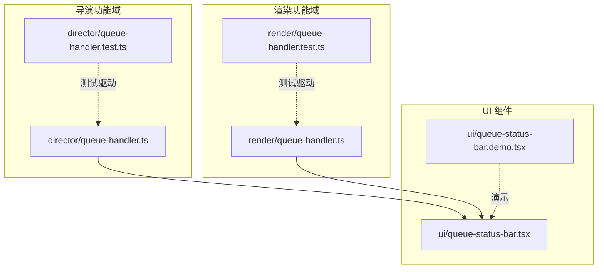
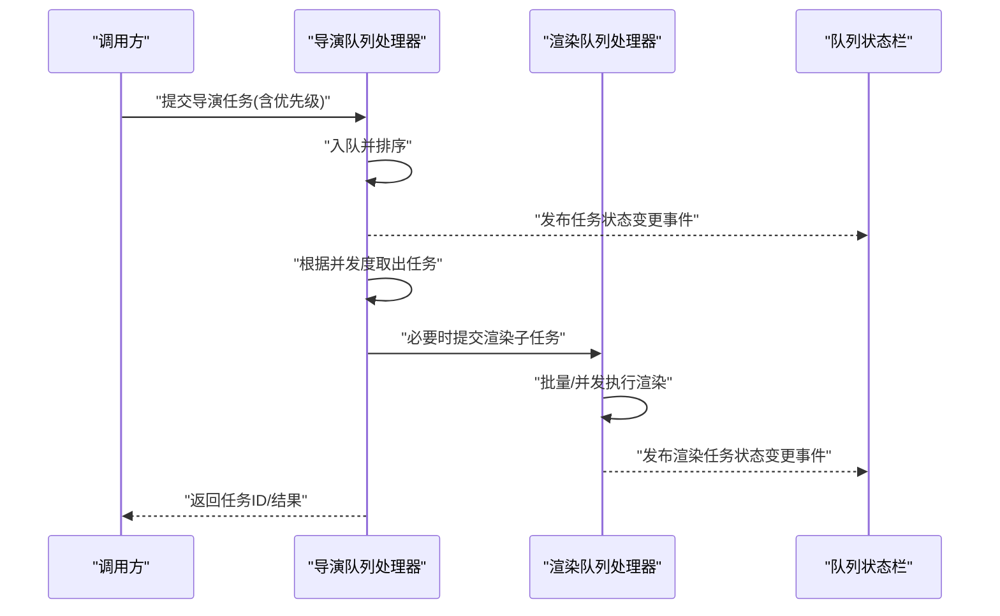
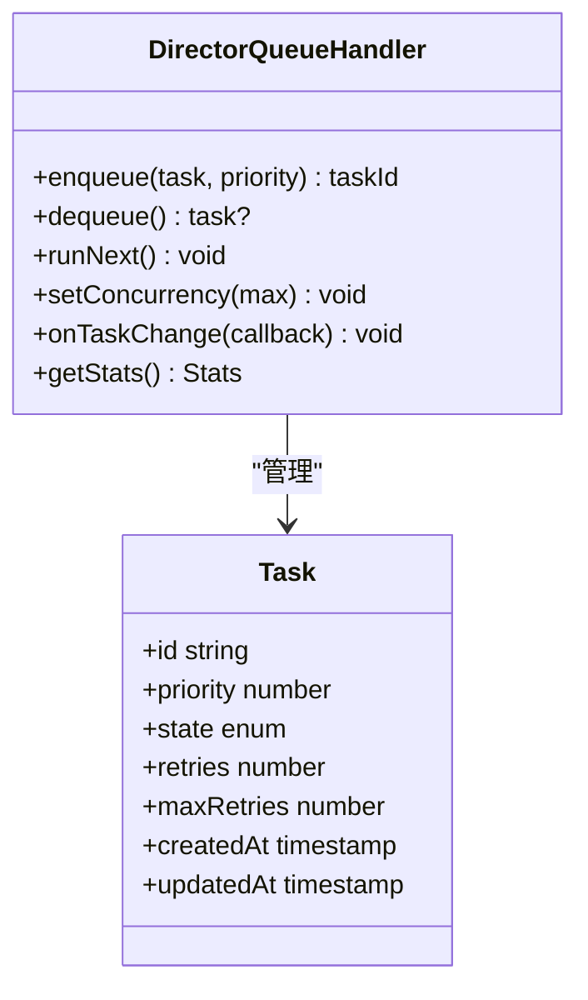
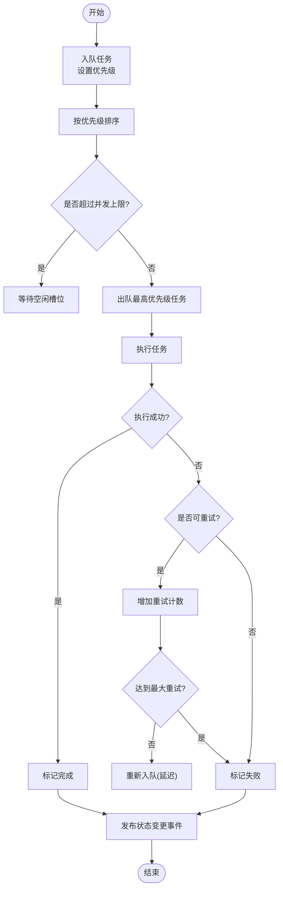
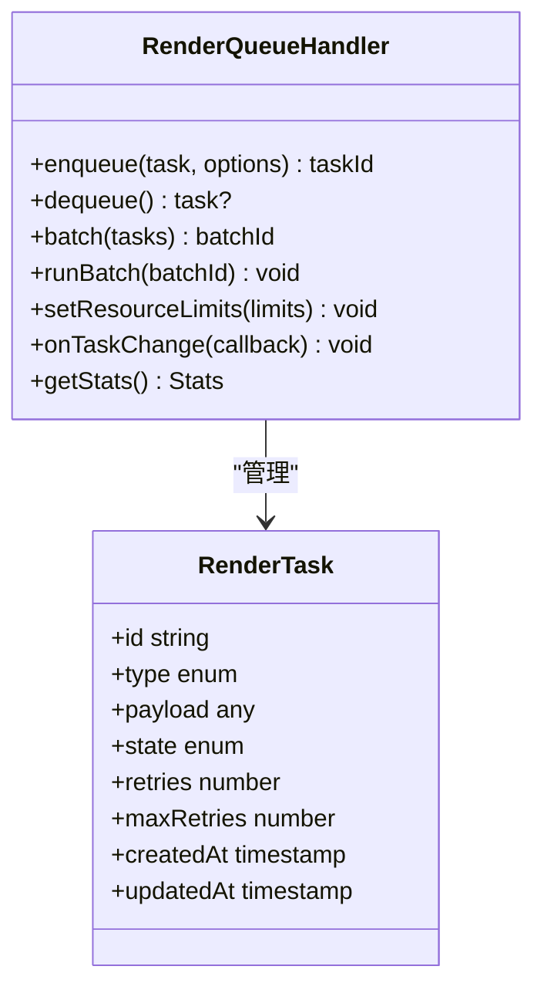
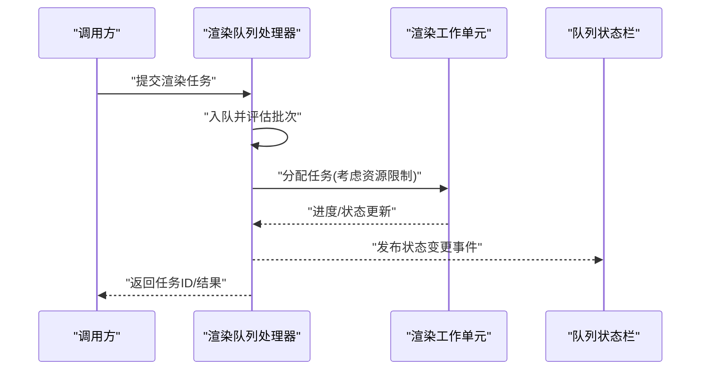
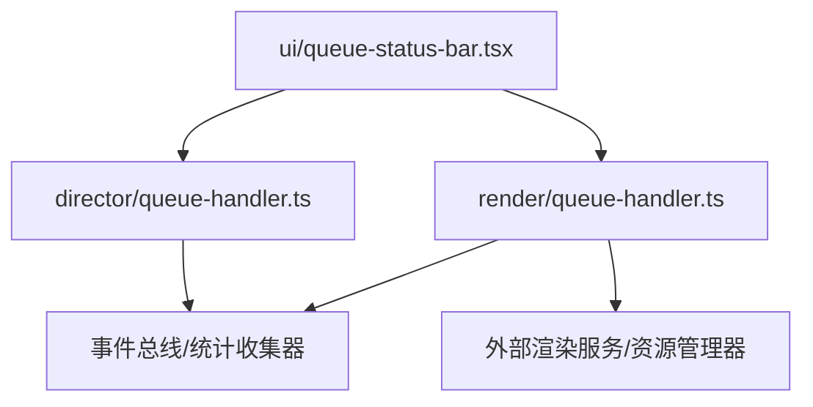

# 队列处理

<cite>
**本文引用的文件**   
- [src/features/director/queue-handler.ts](file://src/features/director/queue-handler.ts)
- [src/features/director/queue-handler.test.ts](file://src/features/director/queue-handler.test.ts)
- [src/features/render/queue-handler.ts](file://src/features/render/queue-handler.ts)
- [src/features/render/queue-handler.test.ts](file://src/features/render/queue-handler.test.ts)
- [src/components/ui/queue-status-bar.tsx](file://src/components/ui/queue-status-bar.tsx)
- [src/components/ui/queue-status-bar.demo.tsx](file://src/components/ui/queue-status-bar.demo.tsx)
</cite>

## 目录
1. [简介](#简介)
2. [项目结构](#项目结构)
3. [核心组件](#核心组件)
4. [架构总览](#架构总览)
5. [详细组件分析](#详细组件分析)
6. [依赖分析](#依赖分析)
7. [性能考虑](#性能考虑)
8. [故障排查指南](#故障排查指南)
9. [结论](#结论)
10. [附录](#附录)

## 简介
本文件面向导演系统的“队列处理模块”，聚焦于 QueueHandler 的任务调度机制，包括任务入队、出队、优先级管理、并发控制、生命周期管理、错误重试与失败处理，以及批量处理、负载均衡与资源限制等优化策略。文档同时提供扩展方法与故障排查指南，帮助读者快速上手并安全地扩展系统能力。

## 项目结构
与队列处理相关的代码主要分布在以下位置：
- 导演功能域（Director）的队列处理器：用于编排导演阶段任务的执行与状态流转
- 渲染功能域（Render）的队列处理器：用于渲染相关任务的排队与执行
- UI 层队列状态展示组件：用于在界面中展示队列运行状态



图表来源
- [src/features/director/queue-handler.ts](file://src/features/director/queue-handler.ts)
- [src/features/render/queue-handler.ts](file://src/features/render/queue-handler.ts)
- [src/components/ui/queue-status-bar.tsx](file://src/components/ui/queue-status-bar.tsx)
- [src/components/ui/queue-status-bar.demo.tsx](file://src/components/ui/queue-status-bar.demo.tsx)

章节来源
- [src/features/director/queue-handler.ts](file://src/features/director/queue-handler.ts)
- [src/features/render/queue-handler.ts](file://src/features/render/queue-handler.ts)
- [src/components/ui/queue-status-bar.tsx](file://src/components/ui/queue-status-bar.tsx)
- [src/components/ui/queue-status-bar.demo.tsx](file://src/components/ui/queue-status-bar.demo.tsx)

## 核心组件
- 导演队列处理器（Director QueueHandler）
  - 职责：负责导演阶段任务的入队、出队、优先级排序、并发度控制、任务生命周期管理与错误重试
  - 关键能力：
    - 任务入队：支持按优先级插入
    - 任务出队：基于优先级选择下一个可执行任务
    - 并发控制：限制同时运行的任务数量
    - 生命周期：创建、就绪、运行、完成、失败、重试等状态转换
    - 错误处理：捕获异常、记录日志、触发重试或失败回调
- 渲染队列处理器（Render QueueHandler）
  - 职责：负责渲染相关任务的排队与执行，通常与外部渲染器或服务交互
  - 关键能力：
    - 任务入队/出队：与导演队列类似，但更关注 I/O 密集型的渲染任务
    - 资源限制：限制并发渲染实例、内存占用等
    - 批量处理：将多个渲染任务合并为批次以提升吞吐
- UI 队列状态栏（Queue Status Bar）
  - 职责：展示当前队列长度、正在执行的任务数、最近任务状态等
  - 关键能力：
    - 订阅队列事件：监听任务状态变更
    - 实时刷新：以最小开销更新 UI

章节来源
- [src/features/director/queue-handler.ts](file://src/features/director/queue-handler.ts)
- [src/features/render/queue-handler.ts](file://src/features/render/queue-handler.ts)
- [src/components/ui/queue-status-bar.tsx](file://src/components/ui/queue-status-bar.tsx)

## 架构总览
下图展示了导演系统与渲染系统中队列处理器的整体关系，以及 UI 如何消费队列状态。



图表来源
- [src/features/director/queue-handler.ts](file://src/features/director/queue-handler.ts)
- [src/features/render/queue-handler.ts](file://src/features/render/queue-handler.ts)
- [src/components/ui/queue-status-bar.tsx](file://src/components/ui/queue-status-bar.tsx)

## 详细组件分析

### 导演队列处理器（Director QueueHandler）
- 任务模型与生命周期
  - 典型状态：待处理、运行中、已完成、失败、重试中
  - 状态转换由处理器内部协调，确保幂等与一致性
- 优先级管理
  - 入队时携带优先级；出队时优先选择高优先级任务
  - 当优先级相同时，可按时间戳或稳定性规则进行次级排序
- 并发控制
  - 通过最大并发数限制同时运行的任务
  - 空闲槽位自动拉取下一个任务，避免饥饿
- 错误重试与失败处理
  - 对可重试错误采用指数退避或固定间隔重试
  - 达到最大重试次数后标记失败并触发失败回调
- 监控与可观测性
  - 暴露队列长度、活跃任务数、平均等待时间等指标
  - 向 UI 推送状态变更事件



图表来源
- [src/features/director/queue-handler.ts](file://src/features/director/queue-handler.ts)



图表来源
- [src/features/director/queue-handler.ts](file://src/features/director/queue-handler.ts)

章节来源
- [src/features/director/queue-handler.ts](file://src/features/director/queue-handler.ts)
- [src/features/director/queue-handler.test.ts](file://src/features/director/queue-handler.test.ts)

### 渲染队列处理器（Render QueueHandler）
- 任务模型与生命周期
  - 典型状态：待处理、运行中、已完成、失败、重试中
  - 与外部渲染服务交互时，需处理网络超时、资源不足等异常
- 批量处理
  - 将多个渲染任务聚合为批次，减少上下文切换与 I/O 开销
  - 批次大小受配置约束，兼顾吞吐与延迟
- 负载均衡与资源限制
  - 根据可用 GPU/CPU 资源动态调整并发度
  - 防止单个任务长期占用资源导致其他任务饥饿
- 错误重试与失败处理
  - 针对瞬时错误（如网络抖动）进行有限次重试
  - 对于不可恢复错误，立即失败并通知上层



图表来源
- [src/features/render/queue-handler.ts](file://src/features/render/queue-handler.ts)



图表来源
- [src/features/render/queue-handler.ts](file://src/features/render/queue-handler.ts)
- [src/components/ui/queue-status-bar.tsx](file://src/components/ui/queue-status-bar.tsx)

章节来源
- [src/features/render/queue-handler.ts](file://src/features/render/queue-handler.ts)
- [src/features/render/queue-handler.test.ts](file://src/features/render/queue-handler.test.ts)

### UI 队列状态栏（Queue Status Bar）
- 职责
  - 订阅队列处理器的事件，展示队列长度、活跃任务数、最近任务状态
- 设计要点
  - 使用最小化更新策略，避免频繁重绘
  - 支持主题与国际化扩展

```mermaid
classDiagram
class QueueStatusBar {
+props : { queueStats, onRefresh }
+render() JSX
+subscribe(handler) void
+unsubscribe(handler) void
}
QueueStatusBar --> DirectorQueueHandler : "订阅状态"
QueueStatusBar --> RenderQueueHandler : "订阅状态"
```

图表来源
- [src/components/ui/queue-status-bar.tsx](file://src/components/ui/queue-status-bar.tsx)

章节来源
- [src/components/ui/queue-status-bar.tsx](file://src/components/ui/queue-status-bar.tsx)
- [src/components/ui/queue-status-bar.demo.tsx](file://src/components/ui/queue-status-bar.demo.tsx)

## 依赖分析
- 内部依赖
  - 导演队列处理器与渲染队列处理器均可能共享通用的队列基础设施（如事件总线、统计收集器），以降低耦合
  - UI 组件仅依赖队列处理器提供的只读接口与事件流，保持低耦合
- 外部依赖
  - 渲染队列处理器可能与外部渲染服务或硬件资源管理器交互
  - 错误处理与重试逻辑可能依赖统一的错误分类与日志记录工具



图表来源
- [src/features/director/queue-handler.ts](file://src/features/director/queue-handler.ts)
- [src/features/render/queue-handler.ts](file://src/features/render/queue-handler.ts)
- [src/components/ui/queue-status-bar.tsx](file://src/components/ui/queue-status-bar.tsx)

章节来源
- [src/features/director/queue-handler.ts](file://src/features/director/queue-handler.ts)
- [src/features/render/queue-handler.ts](file://src/features/render/queue-handler.ts)
- [src/components/ui/queue-status-bar.tsx](file://src/components/ui/queue-status-bar.tsx)

## 性能考虑
- 批量处理
  - 将多个小任务合并为批次，降低调度与 I/O 开销
  - 批次大小应结合任务粒度与目标延迟进行调优
- 负载均衡
  - 依据资源可用性动态调整并发度，避免热点节点过载
  - 引入公平调度策略，防止长任务导致短任务饥饿
- 资源限制
  - 限制 CPU/GPU/内存使用，保障系统稳定性
  - 对长时间运行的任务实施抢占或分片执行
- 监控与告警
  - 采集队列长度、平均等待时间、成功率、重试率等指标
  - 设定阈值告警，及时发现性能退化

[本节为通用指导，不直接分析具体文件]

## 故障排查指南
- 常见问题
  - 任务堆积：检查并发度配置与下游处理能力
  - 频繁重试：确认错误类型是否为瞬时错误，调整重试策略
  - 资源耗尽：查看资源限制与负载分布，适当扩容或限流
- 定位步骤
  - 查看队列统计与事件日志，确认任务状态流转
  - 核对任务优先级与入队顺序，验证是否存在优先级倒置
  - 检查外部服务健康状态与响应时间
- 修复建议
  - 调整并发度与批次大小
  - 优化错误分类与重试策略
  - 引入熔断与降级机制，保护系统稳定

章节来源
- [src/features/director/queue-handler.test.ts](file://src/features/director/queue-handler.test.ts)
- [src/features/render/queue-handler.test.ts](file://src/features/render/queue-handler.test.ts)

## 结论
导演系统的队列处理模块通过清晰的职责划分与良好的扩展点，实现了高效、稳定的任务调度。导演队列处理器与渲染队列处理器分别聚焦业务编排与 I/O 密集型任务，配合 UI 状态栏提供可观测性与用户体验。通过批量处理、负载均衡与资源限制等优化手段，系统在吞吐与延迟之间取得良好平衡。建议在生产环境中持续监控关键指标，并根据实际负载动态调优参数。

[本节为总结性内容，不直接分析具体文件]

## 附录

### 使用示例（路径指引）
- 添加新任务
  - 导演任务入队：参考 [src/features/director/queue-handler.ts](file://src/features/director/queue-handler.ts)
  - 渲染任务入队：参考 [src/features/render/queue-handler.ts](file://src/features/render/queue-handler.ts)
- 配置队列参数
  - 并发度与资源限制：参考 [src/features/render/queue-handler.ts](file://src/features/render/queue-handler.ts)
  - 优先级与重试策略：参考 [src/features/director/queue-handler.ts](file://src/features/director/queue-handler.ts)
- 监控队列状态
  - 订阅状态变更与展示：参考 [src/components/ui/queue-status-bar.tsx](file://src/components/ui/queue-status-bar.tsx)
  - 演示用法：参考 [src/components/ui/queue-status-bar.demo.tsx](file://src/components/ui/queue-status-bar.demo.tsx)

章节来源
- [src/features/director/queue-handler.ts](file://src/features/director/queue-handler.ts)
- [src/features/render/queue-handler.ts](file://src/features/render/queue-handler.ts)
- [src/components/ui/queue-status-bar.tsx](file://src/components/ui/queue-status-bar.tsx)
- [src/components/ui/queue-status-bar.demo.tsx](file://src/components/ui/queue-status-bar.demo.tsx)