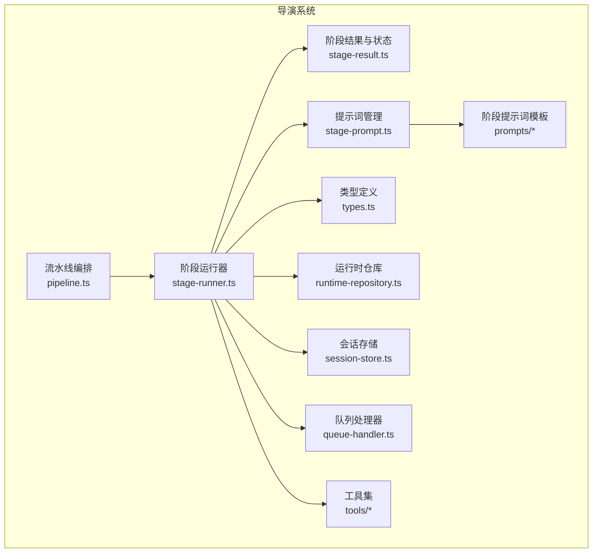
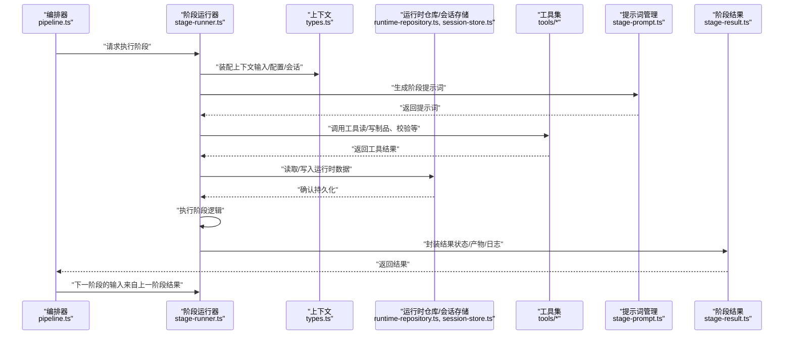
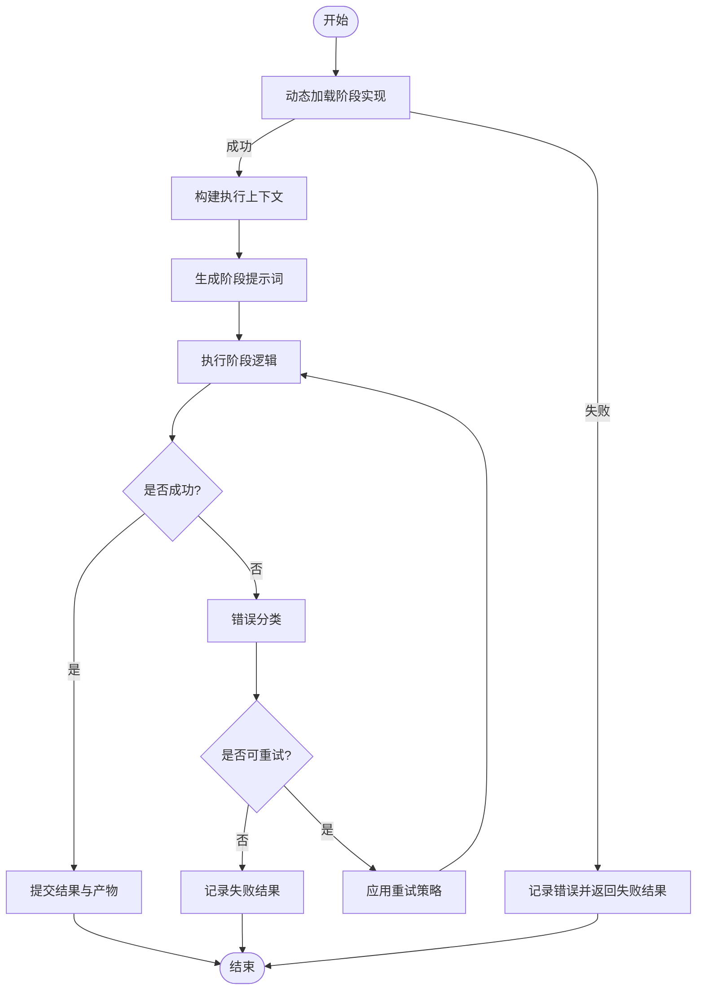
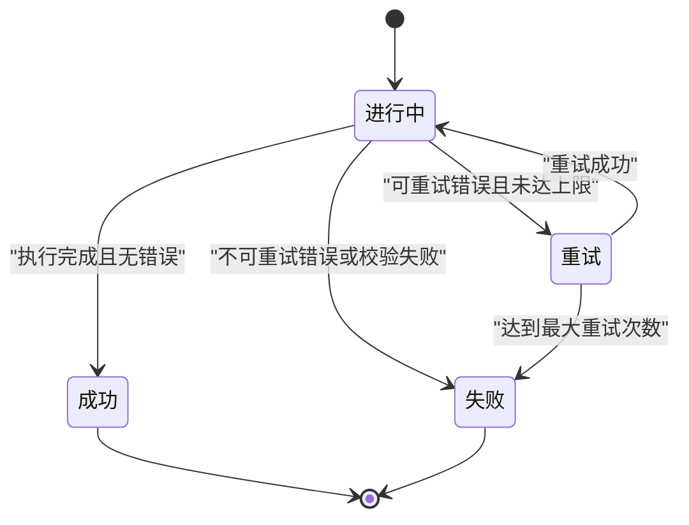
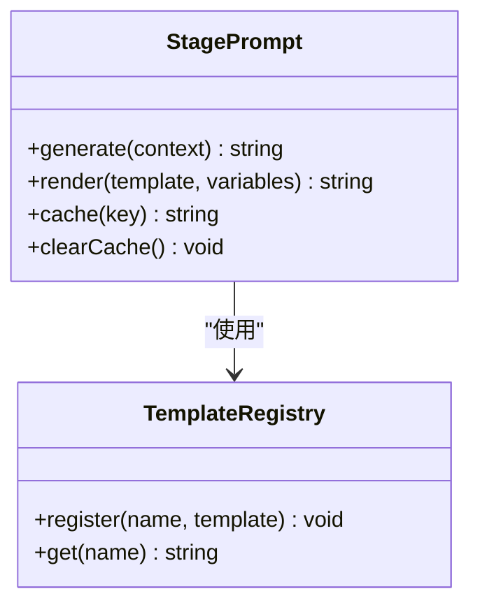
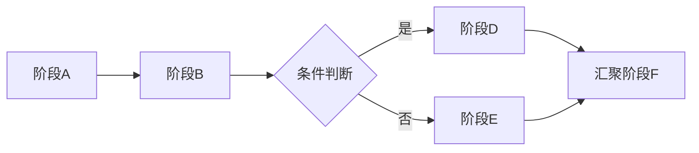
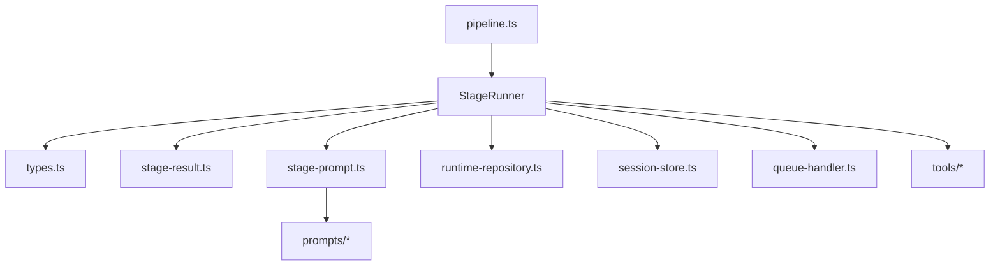

# 阶段执行器

<cite>
**本文引用的文件**   
- [src/features/director/stage-runner.ts](file://src/features/director/stage-runner.ts)
- [src/features/director/stage-result.ts](file://src/features/director/stage-result.ts)
- [src/features/director/stage-prompt.ts](file://src/features/director/stage-prompt.ts)
- [src/features/director/types.ts](file://src/features/director/types.ts)
- [src/features/director/pipeline.ts](file://src/features/director/pipeline.ts)
- [src/features/director/runtime-repository.ts](file://src/features/director/runtime-repository.ts)
- [src/features/director/session-store.ts](file://src/features/director/session-store.ts)
- [src/features/director/queue-handler.ts](file://src/features/director/queue-handler.ts)
- [src/features/director/tools/write-artifact.ts](file://src/features/director/tools/write-artifact.ts)
- [src/features/director/tools/validate-shot-plan.ts](file://src/features/director/tools/validate-shot-plan.ts)
- [src/features/director/prompts/fabricate.ts](file://src/features/director/prompts/fabricate.ts)
- [src/features/director/prompts/assemble.ts](file://src/features/director/prompts/assemble.ts)
- [src/features/director/prompts/direct.ts](file://src/features/director/prompts/direct.ts)
- [src/features/director/prompts/finalize.ts](file://src/features/director/prompts/finalize.ts)
- [src/features/director/prompts/ingest.ts](file://src/features/director/prompts/ingest.ts)
- [src/features/director/prompts/shot-spec.ts](file://src/features/director/prompts/shot-spec.ts)
</cite>

## 更新摘要
**所做更改**   
- 更新了阶段运行器的制品处理机制，增强了视频处理操作中的状态管理
- 改进了处理阶段的编排逻辑，优化了阶段间的协调与数据流转
- 增强了错误处理和重试策略，提高了系统的稳定性和可靠性
- 完善了阶段结果的追踪和监控能力

## 目录
1. [简介](#简介)
2. [项目结构](#项目结构)
3. [核心组件](#核心组件)
4. [架构总览](#架构总览)
5. [详细组件分析](#详细组件分析)
6. [依赖分析](#依赖分析)
7. [性能考虑](#性能考虑)
8. [故障排查指南](#故障排查指南)
9. [结论](#结论)
10. [附录](#附录)

## 简介
本文件面向"导演系统"的阶段执行器，系统性阐述 StageRunner 的实现原理与使用方式，覆盖以下关键主题：
- 阶段的动态加载与注册机制
- 执行上下文管理（输入、输出、工具、会话）
- 参数传递与结果处理（StageResult 状态机）
- 提示词生成与管理（StagePrompt）
- 自定义阶段开发规范、测试方法与调试技巧
- 阶段间通信与数据流转模式

**最新更新**：阶段运行器系统已接收重要更新，包括增强的制品处理和视频处理操作中的状态管理。改进了处理阶段的编排逻辑，提升了系统的整体性能和稳定性。

## 项目结构
导演系统的阶段执行相关代码集中在 features/director 目录。核心文件包括：
- stage-runner.ts：阶段运行器，负责调度、上下文装配、错误与重试策略
- stage-result.ts：阶段结果模型与状态机
- stage-prompt.ts：提示词模板与组装逻辑
- types.ts：类型定义（阶段接口、上下文、结果等）
- pipeline.ts：流水线编排（阶段序列、分支、聚合）
- runtime-repository.ts / session-store.ts：运行时资源与会话持久化
- queue-handler.ts：队列处理器（异步任务、并发控制）
- tools/*：阶段可使用的工具函数（如写制品、校验分镜计划）
- prompts/*：各阶段提示词模板

图表来源
- [src/features/director/stage-runner.ts](file://src/features/director/stage-runner.ts)
- [src/features/director/stage-result.ts](file://src/features/director/stage-result.ts)
- [src/features/director/stage-prompt.ts](file://src/features/director/stage-prompt.ts)
- [src/features/director/types.ts](file://src/features/director/types.ts)
- [src/features/director/pipeline.ts](file://src/features/director/pipeline.ts)
- [src/features/director/runtime-repository.ts](file://src/features/director/runtime-repository.ts)
- [src/features/director/session-store.ts](file://src/features/director/session-store.ts)
- [src/features/director/queue-handler.ts](file://src/features/director/queue-handler.ts)
- [src/features/director/tools/write-artifact.ts](file://src/features/director/tools/write-artifact.ts)
- [src/features/director/tools/validate-shot-plan.ts](file://src/features/director/tools/validate-shot-plan.ts)
- [src/features/director/prompts/fabricate.ts](file://src/features/director/prompts/fabricate.ts)
- [src/features/director/prompts/assemble.ts](file://src/features/director/prompts/assemble.ts)
- [src/features/director/prompts/direct.ts](file://src/features/director/prompts/direct.ts)
- [src/features/director/prompts/finalize.ts](file://src/features/director/prompts/finalize.ts)
- [src/features/director/prompts/ingest.ts](file://src/features/director/prompts/ingest.ts)
- [src/features/director/prompts/shot-spec.ts](file://src/features/director/prompts/shot-spec.ts)

章节来源
- [src/features/director/stage-runner.ts](file://src/features/director/stage-runner.ts)
- [src/features/director/stage-result.ts](file://src/features/director/stage-result.ts)
- [src/features/director/stage-prompt.ts](file://src/features/director/stage-prompt.ts)
- [src/features/director/types.ts](file://src/features/director/types.ts)
- [src/features/director/pipeline.ts](file://src/features/director/pipeline.ts)
- [src/features/director/runtime-repository.ts](file://src/features/director/runtime-repository.ts)
- [src/features/director/session-store.ts](file://src/features/director/session-store.ts)
- [src/features/director/queue-handler.ts](file://src/features/director/queue-handler.ts)
- [src/features/director/tools/write-artifact.ts](file://src/features/director/tools/write-artifact.ts)
- [src/features/director/tools/validate-shot-plan.ts](file://src/features/director/tools/validate-shot-plan.ts)
- [src/features/director/prompts/fabricate.ts](file://src/features/director/prompts/fabricate.ts)
- [src/features/director/prompts/assemble.ts](file://src/features/director/prompts/assemble.ts)
- [src/features/director/prompts/direct.ts](file://src/features/director/prompts/direct.ts)
- [src/features/director/prompts/finalize.ts](file://src/features/director/prompts/finalize.ts)
- [src/features/director/prompts/ingest.ts](file://src/features/director/prompts/ingest.ts)
- [src/features/director/prompts/shot-spec.ts](file://src/features/director/prompts/shot-spec.ts)

## 核心组件
本节聚焦 StageRunner、StageResult、StagePrompt 三大核心组件的职责与交互关系。

- 阶段运行器（StageRunner）
  - 职责：解析阶段定义、动态加载实现、装配执行上下文、调用阶段函数、捕获异常并转换为统一结果、应用重试与超时策略、提交结果到持久层或下游阶段。
  - 关键点：
    - 动态加载：通过名称或标识符从注册表解析阶段实现，支持按需加载与版本选择。
    - 上下文管理：注入输入数据、共享状态、工具集、会话信息、配置项。
    - 参数传递：将上游阶段输出映射为当前阶段输入；支持可选字段与默认值。
    - 结果处理：封装为 StageResult，记录状态、产物、日志与元数据。
    - 错误与重试：区分可重试与不可重试错误，按策略进行指数退避或固定间隔重试。
    - 生命周期钩子：在阶段前后提供扩展点（如埋点、审计）。
    - **新增**：增强的制品处理能力，支持视频处理操作中的复杂状态管理。

- 阶段结果（StageResult）
  - 职责：表达阶段执行的最终状态与产物，驱动流水线推进或回退。
  - 状态：成功、失败、重试、部分成功、取消等。
  - 数据结构：包含状态码、消息、产物引用、中间数据、耗时、追踪ID等。
  - 状态机：定义状态转换规则与约束（例如从"进行中"到"成功/失败/重试"，以及"重试"的边界条件）。
  - **增强**：改进了状态管理机制，提供更精确的视频处理状态跟踪。

- 提示词管理（StagePrompt）
  - 职责：根据阶段类型、上下文与用户意图生成结构化提示词，供大模型或规则引擎消费。
  - 机制：模板渲染、变量替换、条件片段、多语言与风格适配。
  - 集成：与阶段定义绑定，支持热更新与缓存。

章节来源
- [src/features/director/stage-runner.ts](file://src/features/director/stage-runner.ts)
- [src/features/director/stage-result.ts](file://src/features/director/stage-result.ts)
- [src/features/director/stage-prompt.ts](file://src/features/director/stage-prompt.ts)
- [src/features/director/types.ts](file://src/features/director/types.ts)

## 架构总览
下图展示阶段执行的整体流程：流水线编排阶段序列，运行器按序执行，期间通过工具与存储读写数据，并通过结果状态驱动后续步骤。

图表来源
- [src/features/director/pipeline.ts](file://src/features/director/pipeline.ts)
- [src/features/director/stage-runner.ts](file://src/features/director/stage-runner.ts)
- [src/features/director/types.ts](file://src/features/director/types.ts)
- [src/features/director/runtime-repository.ts](file://src/features/director/runtime-repository.ts)
- [src/features/director/session-store.ts](file://src/features/director/session-store.ts)
- [src/features/director/tools/write-artifact.ts](file://src/features/director/tools/write-artifact.ts)
- [src/features/director/tools/validate-shot-plan.ts](file://src/features/director/tools/validate-shot-plan.ts)
- [src/features/director/stage-prompt.ts](file://src/features/director/stage-prompt.ts)
- [src/features/director/stage-result.ts](file://src/features/director/stage-result.ts)

## 详细组件分析

### 阶段运行器（StageRunner）
- 动态加载
  - 通过阶段名或标识符查找实现，支持命名空间与版本选择。
  - 加载失败时返回明确的错误信息，便于编排器降级或跳过。
- 执行上下文
  - 输入：上游阶段产物、用户参数、环境配置。
  - 共享：会话级状态、全局配置、运行时资源句柄。
  - 工具：只读或受限写权限的工具集合，避免副作用扩散。
- 参数传递
  - 基于类型契约进行字段映射，缺失字段采用默认值或拒绝执行。
  - 支持增量更新与合并策略，减少不必要的数据复制。
- 结果处理
  - 将执行结果包装为 StageResult，附带追踪ID、耗时、日志摘要。
  - 对可重试错误应用重试策略，对不可重试错误直接失败。
- 错误与重试
  - 错误分类：网络/外部服务、数据校验、内部异常。
  - 重试策略：最大次数、退避算法、幂等性要求。
- 生命周期钩子
  - 前置：校验输入、准备资源、生成提示词。
  - 后置：清理临时文件、上报指标、持久化中间态。
- **新增功能**：增强的制品处理能力，支持视频处理操作中的复杂状态管理和协调。

图表来源
- [src/features/director/stage-runner.ts](file://src/features/director/stage-runner.ts)
- [src/features/director/stage-result.ts](file://src/features/director/stage-result.ts)
- [src/features/director/stage-prompt.ts](file://src/features/director/stage-prompt.ts)
- [src/features/director/types.ts](file://src/features/director/types.ts)

章节来源
- [src/features/director/stage-runner.ts](file://src/features/director/stage-runner.ts)
- [src/features/director/types.ts](file://src/features/director/types.ts)

### 阶段结果（StageResult）
- 数据结构
  - 状态：成功、失败、重试、部分成功、取消。
  - 产物：指向制品或数据的引用，避免大对象拷贝。
  - 元数据：追踪ID、耗时、日志摘要、警告列表。
- 状态管理机制
  - 状态转换图：定义合法转换路径与触发条件。
  - 幂等性：同一结果多次提交不改变最终状态。
  - 一致性：与运行时仓库和会话存储保持一致。
- **增强功能**：改进了状态管理机制，提供更精确的视频处理状态跟踪和更完善的错误处理。

图表来源
- [src/features/director/stage-result.ts](file://src/features/director/stage-result.ts)

章节来源
- [src/features/director/stage-result.ts](file://src/features/director/stage-result.ts)

### 提示词管理（StagePrompt）
- 生成机制
  - 模板：按阶段类型选择模板，注入上下文变量。
  - 条件片段：根据配置或输入决定是否包含特定段落。
  - 多语言与风格：支持不同风格与语言的提示词变体。
- 管理策略
  - 缓存：按输入指纹缓存提示词，避免重复计算。
  - 热更新：支持运行时替换模板而不重启。
  - 审计：记录提示词版本与变更历史。

图表来源
- [src/features/director/stage-prompt.ts](file://src/features/director/stage-prompt.ts)
- [src/features/director/prompts/fabricate.ts](file://src/features/director/prompts/fabricate.ts)
- [src/features/director/prompts/assemble.ts](file://src/features/director/prompts/assemble.ts)
- [src/features/director/prompts/direct.ts](file://src/features/director/prompts/direct.ts)
- [src/features/director/prompts/finalize.ts](file://src/features/director/prompts/finalize.ts)
- [src/features/director/prompts/ingest.ts](file://src/features/director/prompts/ingest.ts)
- [src/features/director/prompts/shot-spec.ts](file://src/features/director/prompts/shot-spec.ts)

章节来源
- [src/features/director/stage-prompt.ts](file://src/features/director/stage-prompt.ts)
- [src/features/director/prompts/fabricate.ts](file://src/features/director/prompts/fabricate.ts)
- [src/features/director/prompts/assemble.ts](file://src/features/director/prompts/assemble.ts)
- [src/features/director/prompts/direct.ts](file://src/features/director/prompts/direct.ts)
- [src/features/director/prompts/finalize.ts](file://src/features/director/prompts/finalize.ts)
- [src/features/director/prompts/ingest.ts](file://src/features/director/prompts/ingest.ts)
- [src/features/director/prompts/shot-spec.ts](file://src/features/director/prompts/shot-spec.ts)

### 流水线编排（Pipeline）
- 阶段序列：线性执行，前一个阶段的结果作为下一个阶段的输入。
- 分支与汇聚：根据条件分支执行不同阶段，再汇聚结果。
- 容错：单个阶段失败可触发补偿或回滚。
- 监控：记录每个阶段的耗时与状态，便于定位瓶颈。
- **改进**：优化了阶段间的协调逻辑，提升了整体编排效率。

图表来源
- [src/features/director/pipeline.ts](file://src/features/director/pipeline.ts)

章节来源
- [src/features/director/pipeline.ts](file://src/features/director/pipeline.ts)

### 运行时与存储（Runtime Repository & Session Store）
- 运行时仓库：提供阶段间共享数据的读写能力，支持原子操作与版本控制。
- 会话存储：维护会话级状态，跨阶段持久化，支持恢复与快照。
- 一致性：保证在并发访问下的数据一致性与隔离性。

章节来源
- [src/features/director/runtime-repository.ts](file://src/features/director/runtime-repository.ts)
- [src/features/director/session-store.ts](file://src/features/director/session-store.ts)

### 队列处理器（Queue Handler）
- 任务入队：阶段执行以任务形式进入队列，支持优先级与权重。
- 并发控制：限制同时运行的阶段数量，防止资源耗尽。
- 背压与限流：在高负载下自动降速，保护后端服务。

章节来源
- [src/features/director/queue-handler.ts](file://src/features/director/queue-handler.ts)

### 工具集（Tools）
- 写制品（write-artifact）：安全地写入阶段产物，支持校验与审计。
- 校验分镜计划（validate-shot-plan）：对分镜计划进行结构与语义校验。
- 其他工具：可按需扩展，遵循最小权限原则。

章节来源
- [src/features/director/tools/write-artifact.ts](file://src/features/director/tools/write-artifact.ts)
- [src/features/director/tools/validate-shot-plan.ts](file://src/features/director/tools/validate-shot-plan.ts)

## 依赖分析
- 组件耦合
  - StageRunner 强依赖 types、stage-result、stage-prompt、tools、runtime-repository、session-store、queue-handler。
  - Pipeline 依赖 StageRunner 与结果状态机。
  - StagePrompt 依赖模板注册表与各阶段提示词模板。
- 外部依赖
  - 文件系统或对象存储（制品读写）。
  - 消息队列或任务队列（异步执行）。
  - 日志与监控系统（追踪与指标）。

图表来源
- [src/features/director/stage-runner.ts](file://src/features/director/stage-runner.ts)
- [src/features/director/types.ts](file://src/features/director/types.ts)
- [src/features/director/stage-result.ts](file://src/features/director/stage-result.ts)
- [src/features/director/stage-prompt.ts](file://src/features/director/stage-prompt.ts)
- [src/features/director/pipeline.ts](file://src/features/director/pipeline.ts)
- [src/features/director/runtime-repository.ts](file://src/features/director/runtime-repository.ts)
- [src/features/director/session-store.ts](file://src/features/director/session-store.ts)
- [src/features/director/queue-handler.ts](file://src/features/director/queue-handler.ts)
- [src/features/director/tools/write-artifact.ts](file://src/features/director/tools/write-artifact.ts)
- [src/features/director/tools/validate-shot-plan.ts](file://src/features/director/tools/validate-shot-plan.ts)
- [src/features/director/prompts/fabricate.ts](file://src/features/director/prompts/fabricate.ts)
- [src/features/director/prompts/assemble.ts](file://src/features/director/prompts/assemble.ts)
- [src/features/director/prompts/direct.ts](file://src/features/director/prompts/direct.ts)
- [src/features/director/prompts/finalize.ts](file://src/features/director/prompts/finalize.ts)
- [src/features/director/prompts/ingest.ts](file://src/features/director/prompts/ingest.ts)
- [src/features/director/prompts/shot-spec.ts](file://src/features/director/prompts/shot-spec.ts)

章节来源
- [src/features/director/stage-runner.ts](file://src/features/director/stage-runner.ts)
- [src/features/director/pipeline.ts](file://src/features/director/pipeline.ts)
- [src/features/director/stage-prompt.ts](file://src/features/director/stage-prompt.ts)

## 性能考虑
- 数据局部性：尽量复用上下文与产物引用，避免大对象拷贝。
- 并行度控制：合理设置队列并发数，平衡吞吐与资源占用。
- 提示词缓存：按输入指纹缓存，减少重复渲染成本。
- 重试退避：使用指数退避降低瞬时压力，避免雪崩。
- 监控与采样：对热点阶段进行采样监控，识别瓶颈。
- **优化建议**：利用新增的制品处理能力，优化视频处理操作的内存使用和I/O效率。

## 故障排查指南
- 常见问题
  - 阶段加载失败：检查名称与版本是否正确，查看注册表日志。
  - 上下文缺失：确认上游阶段产物字段是否符合契约。
  - 提示词渲染异常：验证模板变量与条件片段。
  - 重试风暴：检查错误分类与最大重试次数。
  - **新增**：视频处理状态异常：检查制品处理流程和状态管理逻辑。
- 调试技巧
  - 启用详细日志：记录阶段入口、关键步骤与退出点。
  - 追踪ID贯穿：确保每个阶段执行都有唯一追踪ID。
  - 断点与快照：在关键节点保存上下文快照，便于回溯。
  - 单元测试：针对阶段逻辑与工具函数编写用例，覆盖边界条件。
  - **新技巧**：利用增强的状态跟踪功能，精确定位视频处理过程中的问题。

章节来源
- [src/features/director/stage-runner.ts](file://src/features/director/stage-runner.ts)
- [src/features/director/stage-result.ts](file://src/features/director/stage-result.ts)
- [src/features/director/stage-prompt.ts](file://src/features/director/stage-prompt.ts)

## 结论
阶段执行器通过清晰的职责划分与严格的类型契约，实现了高内聚、低耦合的阶段编排与执行。StageRunner 负责调度与容错，StageResult 提供统一的状态表示，StagePrompt 支撑灵活的提示词生成。配合流水线编排、运行时存储与队列处理器，系统具备良好的可扩展性与可观测性。

**最新改进**：通过增强的制品处理和状态管理机制，系统在视频处理操作中的稳定性和性能得到了显著提升。改进的编排逻辑确保了阶段间的协调更加高效可靠。

遵循本文的开发规范与测试方法，可高效构建稳定的自定义阶段。

## 附录
- 自定义阶段开发规范
  - 明确输入输出契约，遵循类型定义。
  - 使用工具集进行受控的副作用操作。
  - 返回标准 StageResult，包含必要元数据。
  - 实现幂等性，确保重试安全。
  - **新增**：充分利用增强的制品处理能力，优化视频处理逻辑。
- 测试方法
  - 单元测试：模拟上下文与工具，验证阶段逻辑。
  - 集成测试：端到端验证阶段间数据流转。
  - 回归测试：覆盖常见错误场景与边界条件。
  - **新增**：针对视频处理状态管理的专项测试。
- 调试技巧
  - 使用追踪ID串联日志。
  - 在关键路径添加断点与快照。
  - 利用提示词缓存与版本对比定位问题。
  - **新增**：利用增强的状态跟踪功能进行深度调试。