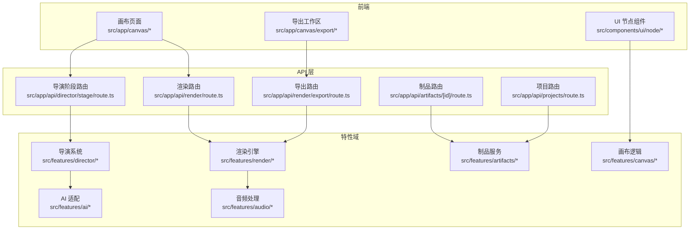
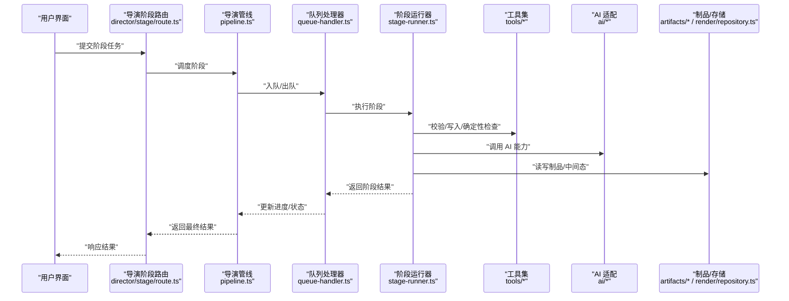
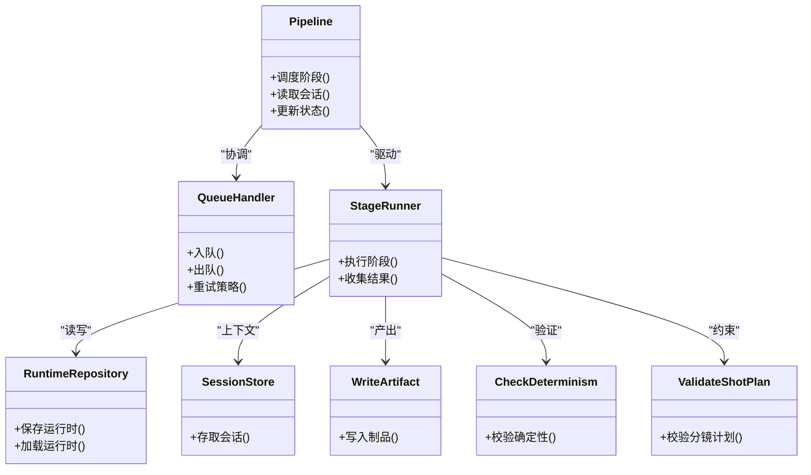
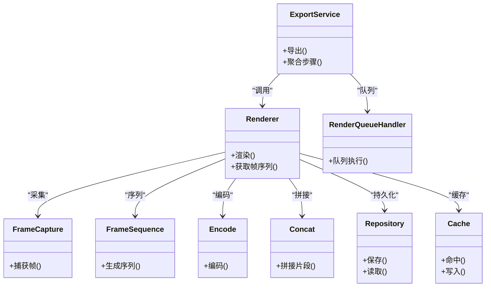
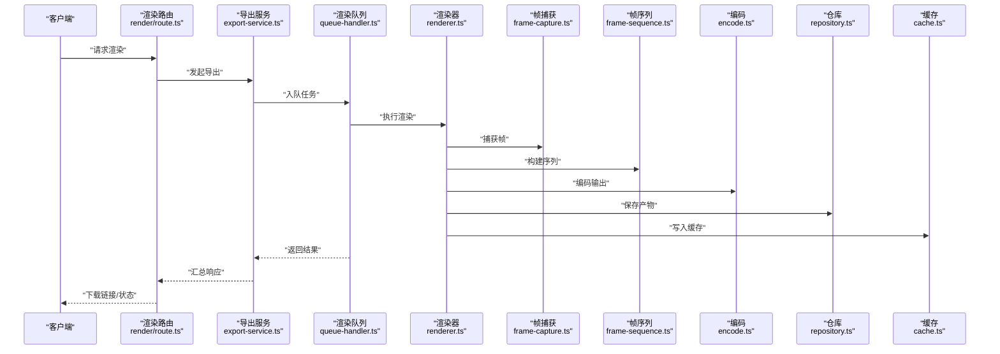
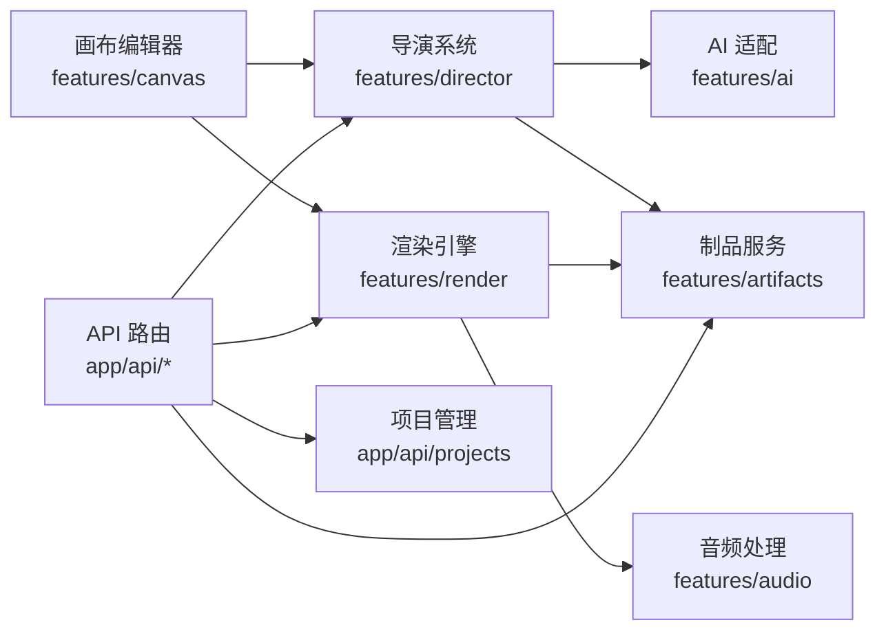

# 核心功能模块

<cite>
**本文引用的文件**   
- [src/app/api/director/stage/route.ts](file://src/app/api/director/stage/route.ts)
- [src/features/director/pipeline.ts](file://src/features/director/pipeline.ts)
- [src/features/director/queue-handler.ts](file://src/features/director/queue-handler.ts)
- [src/features/director/runtime-repository.ts](file://src/features/director/runtime-repository.ts)
- [src/features/director/session-store.ts](file://src/features/director/session-store.ts)
- [src/features/director/stage-runner.ts](file://src/features/director/stage-runner.ts)
- [src/features/director/stage-result.ts](file://src/features/director/stage-result.ts)
- [src/features/director/tools/write-artifact.ts](file://src/features/director/tools/write-artifact.ts)
- [src/features/director/tools/check-determinism.ts](file://src/features/director/tools/check-determinism.ts)
- [src/features/director/tools/validate-shot-plan.ts](file://src/features/director/tools/validate-shot-plan.ts)
- [src/features/director/prompts/direct.ts](file://src/features/director/prompts/direct.ts)
- [src/features/director/prompts/fabricate.ts](file://src/features/director/prompts/fabricate.ts)
- [src/features/director/prompts/assemble.ts](file://src/features/director/prompts/assemble.ts)
- [src/features/director/prompts/finalize.ts](file://src/features/director/prompts/finalize.ts)
- [src/features/director/prompts/ingest.ts](file://src/features/director/prompts/ingest.ts)
- [src/features/director/prompts/shot-spec.ts](file://src/features/director/prompts/shot-spec.ts)
- [src/features/director/schemas/shot-plan.ts](file://src/features/director/schemas/shot-plan.ts)
- [src/features/director/schemas/ingest.ts](file://src/features/director/schemas/ingest.ts)
- [src/features/render/renderer.ts](file://src/features/render/renderer.ts)
- [src/features/render/export-service.ts](file://src/features/render/export-service.ts)
- [src/features/render/repository.ts](file://src/features/render/repository.ts)
- [src/features/render/cache.ts](file://src/features/render/cache.ts)
- [src/features/render/encode.ts](file://src/features/render/encode.ts)
- [src/features/render/frame-capture.ts](file://src/features/render/frame-capture.ts)
- [src/features/render/frame-sequence.ts](file://src/features/render/frame-sequence.ts)
- [src/features/render/concat.ts](file://src/features/render/concat.ts)
- [src/features/render/queue-handler.ts](file://src/features/render/queue-handler.ts)
- [src/app/api/render/route.ts](file://src/app/api/render/route.ts)
- [src/app/api/render/export/route.ts](file://src/app/api/render/export/route.ts)
- [src/features/ai/index.ts](file://src/features/ai/index.ts)
- [src/features/ai/types.ts](file://src/features/ai/types.ts)
- [src/features/ai/schemas.ts](file://src/features/ai/schemas.ts)
- [src/features/ai/stepfun-adapter.ts](file://src/features/ai/stepfun-adapter.ts)
- [src/app/canvas/canvas-view.tsx](file://src/app/canvas/canvas-view.tsx)
- [src/app/canvas/canvas-sidebar.tsx](file://src/app/canvas/canvas-sidebar.tsx)
- [src/app/canvas/canvas-inspector.tsx](file://src/app/canvas/canvas-inspector.tsx)
- [src/app/canvas/layout.tsx](file://src/app/canvas/layout.tsx)
- [src/app/canvas/page.tsx](file://src/app/canvas/page.tsx)
- [src/app/canvas/flow-elements.tsx](file://src/app/canvas/flow-elements.tsx)
- [src/app/canvas/canvas-action-api.ts](file://src/app/canvas/canvas-action-api.ts)
- [src/app/canvas/shot/[id]/page.tsx](file://src/app/canvas/shot/[id]/page.tsx)
- [src/app/canvas/shot/[id]/shot-detail.tsx](file://src/app/canvas/shot/[id]/shot-detail.tsx)
- [src/app/canvas/shot/[id]/shot-api.ts](file://src/app/canvas/shot/[id]/shot-api.ts)
- [src/app/canvas/export/export-api.ts](file://src/app/canvas/export/export-api.ts)
- [src/app/canvas/export/export-workspace.tsx](file://src/app/canvas/export/export-workspace.tsx)
- [src/app/canvas/export/export-view-model.ts](file://src/app/canvas/export/export-view-model.ts)
- [src/features/canvas/actions.ts](file://src/features/canvas/actions.ts)
- [src/features/canvas/queries.ts](file://src/features/canvas/queries.ts)
- [src/features/canvas/layout.ts](file://src/features/canvas/layout.ts)
- [src/features/canvas/status.ts](file://src/features/canvas/status.ts)
- [src/features/canvas/types.ts](file://src/features/canvas/types.ts)
- [src/components/ui/node/stage-node.tsx](file://src/components/ui/node/stage-node.tsx)
- [src/components/ui/node/audio-node.tsx](file://src/components/ui/node/audio-node.tsx)
- [src/components/ui/node/export-node.tsx](file://src/components/ui/node/export-node.tsx)
- [src/components/ui/node/shot-node.tsx](file://src/components/ui/node/shot-node.tsx)
- [src/components/ui/node/types.ts](file://src/components/ui/node/types.ts)
- [src/features/audio/index.ts](file://src/features/audio/index.ts)
- [src/features/audio/score.ts](file://src/features/audio/score.ts)
- [src/features/audio/sfx.ts](file://src/features/audio/sfx.ts)
- [src/features/audio/subtitle.ts](file://src/features/audio/subtitle.ts)
- [src/features/audio/voiceover.ts](file://src/features/audio/voiceover.ts)
- [src/features/audio/types.ts](file://src/features/audio/types.ts)
- [src/app/api/artifacts/[id]/route.ts](file://src/app/api/artifacts/[id]/route.ts)
- [src/features/artifacts/service.ts](file://src/features/artifacts/service.ts)
- [src/app/api/projects/route.ts](file://src/app/api/projects/route.ts)
- [src/app/_components/new-project-dialog.tsx](file://src/app/_components/new-project-dialog.tsx)
- [src/app/_components/new-project-api.ts](file://src/app/_components/new-project-api.ts)
</cite>

## 目录
1. [简介](#简介)
2. [项目结构](#项目结构)
3. [核心组件](#核心组件)
4. [架构总览](#架构总览)
5. [详细组件分析](#详细组件分析)
6. [依赖关系分析](#依赖关系分析)
7. [性能考虑](#性能考虑)
8. [故障排查指南](#故障排查指南)
9. [结论](#结论)
10. [附录](#附录)

## 简介
本文件面向 CodeVideoCanvas 的核心功能模块，系统性梳理导演系统、渲染引擎、AI 服务集成、画布编辑器、项目管理与音频处理等关键域的实现原理、接口定义、配置选项和使用模式。文档同时提供模块间协作方式、错误处理策略与性能优化建议，帮助读者快速理解并高效使用该系统。

## 项目结构
CodeVideoCanvas 采用 Next.js 应用形态，前后端同仓：
- 前端页面与交互位于 src/app 下，按路由组织；通用 UI 组件位于 src/components/ui；业务特性以 features 划分。
- 后端 API 通过 Next.js Route Handlers 暴露，位于 src/app/api。
- 核心能力集中在 src/features 中，包括 director（导演）、render（渲染）、ai（AI 适配）、canvas（画布）、audio（音频）、artifacts（制品）等。

图表来源
- [src/app/api/director/stage/route.ts](file://src/app/api/director/stage/route.ts)
- [src/app/api/render/route.ts](file://src/app/api/render/route.ts)
- [src/app/api/render/export/route.ts](file://src/app/api/render/export/route.ts)
- [src/app/api/artifacts/[id]/route.ts](file://src/app/api/artifacts/[id]/route.ts)
- [src/app/api/projects/route.ts](file://src/app/api/projects/route.ts)
- [src/features/director/pipeline.ts](file://src/features/director/pipeline.ts)
- [src/features/render/renderer.ts](file://src/features/render/renderer.ts)
- [src/features/ai/index.ts](file://src/features/ai/index.ts)
- [src/features/canvas/actions.ts](file://src/features/canvas/actions.ts)
- [src/features/audio/index.ts](file://src/features/audio/index.ts)
- [src/features/artifacts/service.ts](file://src/features/artifacts/service.ts)

章节来源
- [src/app/canvas/page.tsx](file://src/app/canvas/page.tsx)
- [src/app/canvas/layout.tsx](file://src/app/canvas/layout.tsx)
- [src/app/canvas/canvas-view.tsx](file://src/app/canvas/canvas-view.tsx)
- [src/app/canvas/canvas-sidebar.tsx](file://src/app/canvas/canvas-sidebar.tsx)
- [src/app/canvas/canvas-inspector.tsx](file://src/app/canvas/canvas-inspector.tsx)
- [src/app/canvas/flow-elements.tsx](file://src/app/canvas/flow-elements.tsx)
- [src/app/canvas/export/export-workspace.tsx](file://src/app/canvas/export/export-workspace.tsx)
- [src/app/canvas/export/export-api.ts](file://src/app/canvas/export/export-api.ts)
- [src/app/canvas/export/export-view-model.ts](file://src/app/canvas/export/export-view-model.ts)
- [src/app/canvas/shot/[id]/page.tsx](file://src/app/canvas/shot/[id]/page.tsx)
- [src/app/canvas/shot/[id]/shot-detail.tsx](file://src/app/canvas/shot/[id]/shot-detail.tsx)
- [src/app/canvas/shot/[id]/shot-api.ts](file://src/app/canvas/shot/[id]/shot-api.ts)
- [src/app/canvas/canvas-action-api.ts](file://src/app/canvas/canvas-action-api.ts)

## 核心组件
本节概述各业务域的职责与对外接口要点，便于快速定位实现位置与调用方式。

- 导演系统
  - 职责：编排多阶段流水线（摄入、分镜计划、制作、组装、收尾），管理会话与运行时状态，持久化产物与结果。
  - 关键入口：阶段路由、队列处理器、运行器、工具集（校验、确定性检查、写入制品）。
  - 参考路径：[src/features/director/pipeline.ts](file://src/features/director/pipeline.ts)、[src/features/director/queue-handler.ts](file://src/features/director/queue-handler.ts)、[src/features/director/stage-runner.ts](file://src/features/director/stage-runner.ts)。

- 渲染引擎
  - 职责：帧捕获、序列合成、编码与导出，提供缓存与仓库抽象，支持队列执行。
  - 关键入口：渲染器、导出服务、仓库、编码器、帧序列与拼接。
  - 参考路径：[src/features/render/renderer.ts](file://src/features/render/renderer.ts)、[src/features/render/export-service.ts](file://src/features/render/export-service.ts)、[src/features/render/repository.ts](file://src/features/render/repository.ts)。

- AI 服务集成
  - 职责：统一 AI 能力接入（如 StepFun 适配器），类型与 Schema 定义，供导演系统与提示词生成使用。
  - 参考路径：[src/features/ai/index.ts](file://src/features/ai/index.ts)、[src/features/ai/stepfun-adapter.ts](file://src/features/ai/stepfun-adapter.ts)、[src/features/ai/types.ts](file://src/features/ai/types.ts)。

- 画布编辑器
  - 职责：可视化编辑舞台、镜头、音频与导出节点，维护动作与查询、布局与状态机。
  - 参考路径：[src/features/canvas/actions.ts](file://src/features/canvas/actions.ts)、[src/features/canvas/queries.ts](file://src/features/canvas/queries.ts)、[src/features/canvas/layout.ts](file://src/features/canvas/layout.ts)、[src/features/canvas/status.ts](file://src/features/canvas/status.ts)。

- 项目管理
  - 职责：创建与管理项目元数据，提供新建项目对话框与 API。
  - 参考路径：[src/app/api/projects/route.ts](file://src/app/api/projects/route.ts)、[src/app/_components/new-project-dialog.tsx](file://src/app/_components/new-project-dialog.tsx)、[src/app/_components/new-project-api.ts](file://src/app/_components/new-project-api.ts)。

- 音频处理
  - 职责：配音、音效、字幕与评分等音频相关能力。
  - 参考路径：[src/features/audio/index.ts](file://src/features/audio/index.ts)、[src/features/audio/voiceover.ts](file://src/features/audio/voiceover.ts)、[src/features/audio/sfx.ts](file://src/features/audio/sfx.ts)、[src/features/audio/subtitle.ts](file://src/features/audio/subtitle.ts)、[src/features/audio/score.ts](file://src/features/audio/score.ts)。

章节来源
- [src/features/director/pipeline.ts](file://src/features/director/pipeline.ts)
- [src/features/director/queue-handler.ts](file://src/features/director/queue-handler.ts)
- [src/features/director/stage-runner.ts](file://src/features/director/stage-runner.ts)
- [src/features/render/renderer.ts](file://src/features/render/renderer.ts)
- [src/features/render/export-service.ts](file://src/features/render/export-service.ts)
- [src/features/render/repository.ts](file://src/features/render/repository.ts)
- [src/features/ai/index.ts](file://src/features/ai/index.ts)
- [src/features/ai/stepfun-adapter.ts](file://src/features/ai/stepfun-adapter.ts)
- [src/features/canvas/actions.ts](file://src/features/canvas/actions.ts)
- [src/features/canvas/queries.ts](file://src/features/canvas/queries.ts)
- [src/features/canvas/layout.ts](file://src/features/canvas/layout.ts)
- [src/features/canvas/status.ts](file://src/features/canvas/status.ts)
- [src/app/api/projects/route.ts](file://src/app/api/projects/route.ts)
- [src/app/_components/new-project-dialog.tsx](file://src/app/_components/new-project-dialog.tsx)
- [src/app/_components/new-project-api.ts](file://src/app/_components/new-project-api.ts)
- [src/features/audio/index.ts](file://src/features/audio/index.ts)

## 架构总览
整体采用“前端页面 + API 路由 + 特性域”的分层架构。前端通过 API 路由触发后端特性域处理，特性域内部再组合工具与外部服务（如 AI 适配器、存储仓库）。

图表来源
- [src/app/api/director/stage/route.ts](file://src/app/api/director/stage/route.ts)
- [src/features/director/pipeline.ts](file://src/features/director/pipeline.ts)
- [src/features/director/queue-handler.ts](file://src/features/director/queue-handler.ts)
- [src/features/director/stage-runner.ts](file://src/features/director/stage-runner.ts)
- [src/features/director/tools/write-artifact.ts](file://src/features/director/tools/write-artifact.ts)
- [src/features/director/tools/check-determinism.ts](file://src/features/director/tools/check-determinism.ts)
- [src/features/director/tools/validate-shot-plan.ts](file://src/features/director/tools/validate-shot-plan.ts)
- [src/features/ai/index.ts](file://src/features/ai/index.ts)
- [src/features/artifacts/service.ts](file://src/features/artifacts/service.ts)
- [src/features/render/repository.ts](file://src/features/render/repository.ts)

## 详细组件分析

### 导演系统
- 职责与边界
  - 将复杂视频生产流程拆分为多个阶段，每个阶段具备输入输出契约、幂等性与可观测性。
  - 负责会话上下文、运行时仓库、阶段执行与结果持久化。
- 关键类与关系

图表来源
- [src/features/director/pipeline.ts](file://src/features/director/pipeline.ts)
- [src/features/director/queue-handler.ts](file://src/features/director/queue-handler.ts)
- [src/features/director/stage-runner.ts](file://src/features/director/stage-runner.ts)
- [src/features/director/runtime-repository.ts](file://src/features/director/runtime-repository.ts)
- [src/features/director/session-store.ts](file://src/features/director/session-store.ts)
- [src/features/director/tools/write-artifact.ts](file://src/features/director/tools/write-artifact.ts)
- [src/features/director/tools/check-determinism.ts](file://src/features/director/tools/check-determinism.ts)
- [src/features/director/tools/validate-shot-plan.ts](file://src/features/director/tools/validate-shot-plan.ts)

- 阶段提示词与模型
  - 提示词模板覆盖摄入、分镜计划、制作、组装、收尾等阶段，确保稳定一致的模型行为。
  - 参考路径：
    - [src/features/director/prompts/ingest.ts](file://src/features/director/prompts/ingest.ts)
    - [src/features/director/prompts/shot-spec.ts](file://src/features/director/prompts/shot-spec.ts)
    - [src/features/director/prompts/direct.ts](file://src/features/director/prompts/direct.ts)
    - [src/features/director/prompts/fabricate.ts](file://src/features/director/prompts/fabricate.ts)
    - [src/features/director/prompts/assemble.ts](file://src/features/director/prompts/assemble.ts)
    - [src/features/director/prompts/finalize.ts](file://src/features/director/prompts/finalize.ts)

- 数据结构与校验
  - 分镜计划与摄入数据的 Schema 定义用于强约束输入输出，提升稳定性。
  - 参考路径：
    - [src/features/director/schemas/shot-plan.ts](file://src/features/director/schemas/shot-plan.ts)
    - [src/features/director/schemas/ingest.ts](file://src/features/director/schemas/ingest.ts)

- 使用模式
  - 通过 API 路由触发阶段执行，内部由队列处理器进行并发控制与重试，阶段运行器组合工具与 AI 能力完成具体任务。
  - 参考路径：
    - [src/app/api/director/stage/route.ts](file://src/app/api/director/stage/route.ts)
    - [src/features/director/stage-result.ts](file://src/features/director/stage-result.ts)

章节来源
- [src/features/director/pipeline.ts](file://src/features/director/pipeline.ts)
- [src/features/director/queue-handler.ts](file://src/features/director/queue-handler.ts)
- [src/features/director/stage-runner.ts](file://src/features/director/stage-runner.ts)
- [src/features/director/runtime-repository.ts](file://src/features/director/runtime-repository.ts)
- [src/features/director/session-store.ts](file://src/features/director/session-store.ts)
- [src/features/director/stage-result.ts](file://src/features/director/stage-result.ts)
- [src/features/director/tools/write-artifact.ts](file://src/features/director/tools/write-artifact.ts)
- [src/features/director/tools/check-determinism.ts](file://src/features/director/tools/check-determinism.ts)
- [src/features/director/tools/validate-shot-plan.ts](file://src/features/director/tools/validate-shot-plan.ts)
- [src/features/director/prompts/ingest.ts](file://src/features/director/prompts/ingest.ts)
- [src/features/director/prompts/shot-spec.ts](file://src/features/director/prompts/shot-spec.ts)
- [src/features/director/prompts/direct.ts](file://src/features/director/prompts/direct.ts)
- [src/features/director/prompts/fabricate.ts](file://src/features/director/prompts/fabricate.ts)
- [src/features/director/prompts/assemble.ts](file://src/features/director/prompts/assemble.ts)
- [src/features/director/prompts/finalize.ts](file://src/features/director/prompts/finalize.ts)
- [src/features/director/schemas/shot-plan.ts](file://src/features/director/schemas/shot-plan.ts)
- [src/features/director/schemas/ingest.ts](file://src/features/director/schemas/ingest.ts)
- [src/app/api/director/stage/route.ts](file://src/app/api/director/stage/route.ts)

### 渲染引擎
- 职责与边界
  - 负责从画布或运行时数据生成帧序列、合并片段、编码输出，并提供缓存与仓库抽象。
- 关键类与关系

图表来源
- [src/features/render/renderer.ts](file://src/features/render/renderer.ts)
- [src/features/render/export-service.ts](file://src/features/render/export-service.ts)
- [src/features/render/repository.ts](file://src/features/render/repository.ts)
- [src/features/render/cache.ts](file://src/features/render/cache.ts)
- [src/features/render/encode.ts](file://src/features/render/encode.ts)
- [src/features/render/frame-capture.ts](file://src/features/render/frame-capture.ts)
- [src/features/render/frame-sequence.ts](file://src/features/render/frame-sequence.ts)
- [src/features/render/concat.ts](file://src/features/render/concat.ts)
- [src/features/render/queue-handler.ts](file://src/features/render/queue-handler.ts)

- 渲染流程时序

图表来源
- [src/app/api/render/route.ts](file://src/app/api/render/route.ts)
- [src/features/render/export-service.ts](file://src/features/render/export-service.ts)
- [src/features/render/queue-handler.ts](file://src/features/render/queue-handler.ts)
- [src/features/render/renderer.ts](file://src/features/render/renderer.ts)
- [src/features/render/frame-capture.ts](file://src/features/render/frame-capture.ts)
- [src/features/render/frame-sequence.ts](file://src/features/render/frame-sequence.ts)
- [src/features/render/encode.ts](file://src/features/render/encode.ts)
- [src/features/render/repository.ts](file://src/features/render/repository.ts)
- [src/features/render/cache.ts](file://src/features/render/cache.ts)

章节来源
- [src/features/render/renderer.ts](file://src/features/render/renderer.ts)
- [src/features/render/export-service.ts](file://src/features/render/export-service.ts)
- [src/features/render/repository.ts](file://src/features/render/repository.ts)
- [src/features/render/cache.ts](file://src/features/render/cache.ts)
- [src/features/render/encode.ts](file://src/features/render/encode.ts)
- [src/features/render/frame-capture.ts](file://src/features/render/frame-capture.ts)
- [src/features/render/frame-sequence.ts](file://src/features/render/frame-sequence.ts)
- [src/features/render/concat.ts](file://src/features/render/concat.ts)
- [src/features/render/queue-handler.ts](file://src/features/render/queue-handler.ts)
- [src/app/api/render/route.ts](file://src/app/api/render/route.ts)
- [src/app/api/render/export/route.ts](file://src/app/api/render/export/route.ts)

### AI 服务集成
- 职责与边界
  - 封装外部 AI 能力（例如 StepFun），提供统一的类型与 Schema，供导演系统与其他模块复用。
- 关键文件
  - 索引与类型：[src/features/ai/index.ts](file://src/features/ai/index.ts)、[src/features/ai/types.ts](file://src/features/ai/types.ts)
  - 适配器实现：[src/features/ai/stepfun-adapter.ts](file://src/features/ai/stepfun-adapter.ts)
  - 数据校验：[src/features/ai/schemas.ts](file://src/features/ai/schemas.ts)

- 使用模式
  - 在导演阶段中通过适配器调用 AI 能力，结合提示词模板与 Schema 校验，保证输入输出的稳定性。
  - 参考路径：
    - [src/features/director/prompts/direct.ts](file://src/features/director/prompts/direct.ts)
    - [src/features/director/prompts/fabricate.ts](file://src/features/director/prompts/fabricate.ts)

章节来源
- [src/features/ai/index.ts](file://src/features/ai/index.ts)
- [src/features/ai/types.ts](file://src/features/ai/types.ts)
- [src/features/ai/schemas.ts](file://src/features/ai/schemas.ts)
- [src/features/ai/stepfun-adapter.ts](file://src/features/ai/stepfun-adapter.ts)
- [src/features/director/prompts/direct.ts](file://src/features/director/prompts/direct.ts)
- [src/features/director/prompts/fabricate.ts](file://src/features/director/prompts/fabricate.ts)

### 画布编辑器
- 职责与边界
  - 提供舞台、镜头、音频与导出节点的可视化编辑能力，维护动作与查询、布局与状态机。
- 关键文件
  - 页面与布局：[src/app/canvas/page.tsx](file://src/app/canvas/page.tsx)、[src/app/canvas/layout.tsx](file://src/app/canvas/layout.tsx)
  - 视图与侧边栏：[src/app/canvas/canvas-view.tsx](file://src/app/canvas/canvas-view.tsx)、[src/app/canvas/canvas-sidebar.tsx](file://src/app/canvas/canvas-sidebar.tsx)
  - 检查器与动作 API：[src/app/canvas/canvas-inspector.tsx](file://src/app/canvas/canvas-inspector.tsx)、[src/app/canvas/canvas-action-api.ts](file://src/app/canvas/canvas-action-api.ts)
  - 流式元素：[src/app/canvas/flow-elements.tsx](file://src/app/canvas/flow-elements.tsx)
  - 单镜头详情：[src/app/canvas/shot/[id]/page.tsx](file://src/app/canvas/shot/[id]/page.tsx)、[src/app/canvas/shot/[id]/shot-detail.tsx](file://src/app/canvas/shot/[id]/shot-detail.tsx)、[src/app/canvas/shot/[id]/shot-api.ts](file://src/app/canvas/shot/[id]/shot-api.ts)
  - 导出工作区：[src/app/canvas/export/export-workspace.tsx](file://src/app/canvas/export/export-workspace.tsx)、[src/app/canvas/export/export-api.ts](file://src/app/canvas/export/export-api.ts)、[src/app/canvas/export/export-view-model.ts](file://src/app/canvas/export/export-view-model.ts)
  - 特性逻辑：[src/features/canvas/actions.ts](file://src/features/canvas/actions.ts)、[src/features/canvas/queries.ts](file://src/features/canvas/queries.ts)、[src/features/canvas/layout.ts](file://src/features/canvas/layout.ts)、[src/features/canvas/status.ts](file://src/features/canvas/status.ts)、[src/features/canvas/types.ts](file://src/features/canvas/types.ts)
  - UI 节点组件：[src/components/ui/node/stage-node.tsx](file://src/components/ui/node/stage-node.tsx)、[src/components/ui/node/audio-node.tsx](file://src/components/ui/node/audio-node.tsx)、[src/components/ui/node/export-node.tsx](file://src/components/ui/node/export-node.tsx)、[src/components/ui/node/shot-node.tsx](file://src/components/ui/node/shot-node.tsx)、[src/components/ui/node/types.ts](file://src/components/ui/node/types.ts)

- 使用模式
  - 用户在画布中添加/编辑节点，动作层更新状态，查询层同步视图；导出工作区聚合渲染与制品信息。
  - 参考路径：
    - [src/app/canvas/canvas-action-api.ts](file://src/app/canvas/canvas-action-api.ts)
    - [src/features/canvas/actions.ts](file://src/features/canvas/actions.ts)
    - [src/features/canvas/queries.ts](file://src/features/canvas/queries.ts)

章节来源
- [src/app/canvas/page.tsx](file://src/app/canvas/page.tsx)
- [src/app/canvas/layout.tsx](file://src/app/canvas/layout.tsx)
- [src/app/canvas/canvas-view.tsx](file://src/app/canvas/canvas-view.tsx)
- [src/app/canvas/canvas-sidebar.tsx](file://src/app/canvas/canvas-sidebar.tsx)
- [src/app/canvas/canvas-inspector.tsx](file://src/app/canvas/canvas-inspector.tsx)
- [src/app/canvas/flow-elements.tsx](file://src/app/canvas/flow-elements.tsx)
- [src/app/canvas/shot/[id]/page.tsx](file://src/app/canvas/shot/[id]/page.tsx)
- [src/app/canvas/shot/[id]/shot-detail.tsx](file://src/app/canvas/shot/[id]/shot-detail.tsx)
- [src/app/canvas/shot/[id]/shot-api.ts](file://src/app/canvas/shot/[id]/shot-api.ts)
- [src/app/canvas/export/export-workspace.tsx](file://src/app/canvas/export/export-workspace.tsx)
- [src/app/canvas/export/export-api.ts](file://src/app/canvas/export/export-api.ts)
- [src/app/canvas/export/export-view-model.ts](file://src/app/canvas/export/export-view-model.ts)
- [src/app/canvas/canvas-action-api.ts](file://src/app/canvas/canvas-action-api.ts)
- [src/features/canvas/actions.ts](file://src/features/canvas/actions.ts)
- [src/features/canvas/queries.ts](file://src/features/canvas/queries.ts)
- [src/features/canvas/layout.ts](file://src/features/canvas/layout.ts)
- [src/features/canvas/status.ts](file://src/features/canvas/status.ts)
- [src/features/canvas/types.ts](file://src/features/canvas/types.ts)
- [src/components/ui/node/stage-node.tsx](file://src/components/ui/node/stage-node.tsx)
- [src/components/ui/node/audio-node.tsx](file://src/components/ui/node/audio-node.tsx)
- [src/components/ui/node/export-node.tsx](file://src/components/ui/node/export-node.tsx)
- [src/components/ui/node/shot-node.tsx](file://src/components/ui/node/shot-node.tsx)
- [src/components/ui/node/types.ts](file://src/components/ui/node/types.ts)

### 项目管理
- 职责与边界
  - 提供项目创建与管理能力，包含新建项目对话框与 API 路由。
- 关键文件
  - 路由：[src/app/api/projects/route.ts](file://src/app/api/projects/route.ts)
  - 对话框：[src/app/_components/new-project-dialog.tsx](file://src/app/_components/new-project-dialog.tsx)
  - 新建项目 API：[src/app/_components/new-project-api.ts](file://src/app/_components/new-project-api.ts)

- 使用模式
  - 用户通过对话框填写项目信息，调用新建项目 API 完成初始化，后续通过项目路由进行增删改查。
  - 参考路径：
    - [src/app/_components/new-project-dialog.tsx](file://src/app/_components/new-project-dialog.tsx)
    - [src/app/_components/new-project-api.ts](file://src/app/_components/new-project-api.ts)
    - [src/app/api/projects/route.ts](file://src/app/api/projects/route.ts)

章节来源
- [src/app/api/projects/route.ts](file://src/app/api/projects/route.ts)
- [src/app/_components/new-project-dialog.tsx](file://src/app/_components/new-project-dialog.tsx)
- [src/app/_components/new-project-api.ts](file://src/app/_components/new-project-api.ts)

### 音频处理
- 职责与边界
  - 提供配音、音效、字幕与评分等音频处理能力，供导演与渲染环节使用。
- 关键文件
  - 索引与类型：[src/features/audio/index.ts](file://src/features/audio/index.ts)、[src/features/audio/types.ts](file://src/features/audio/types.ts)
  - 能力实现：[src/features/audio/voiceover.ts](file://src/features/audio/voiceover.ts)、[src/features/audio/sfx.ts](file://src/features/audio/sfx.ts)、[src/features/audio/subtitle.ts](file://src/features/audio/subtitle.ts)、[src/features/audio/score.ts](file://src/features/audio/score.ts)

- 使用模式
  - 在导演阶段或渲染过程中按需调用音频能力，生成配音、添加音效与字幕，并进行质量评分。
  - 参考路径：
    - [src/features/audio/voiceover.ts](file://src/features/audio/voiceover.ts)
    - [src/features/audio/sfx.ts](file://src/features/audio/sfx.ts)
    - [src/features/audio/subtitle.ts](file://src/features/audio/subtitle.ts)
    - [src/features/audio/score.ts](file://src/features/audio/score.ts)

章节来源
- [src/features/audio/index.ts](file://src/features/audio/index.ts)
- [src/features/audio/types.ts](file://src/features/audio/types.ts)
- [src/features/audio/voiceover.ts](file://src/features/audio/voiceover.ts)
- [src/features/audio/sfx.ts](file://src/features/audio/sfx.ts)
- [src/features/audio/subtitle.ts](file://src/features/audio/subtitle.ts)
- [src/features/audio/score.ts](file://src/features/audio/score.ts)

### 制品服务
- 职责与边界
  - 统一管理中间产物与最终产物的读写，为导演与渲染提供稳定的制品访问。
- 关键文件
  - 路由：[src/app/api/artifacts/[id]/route.ts](file://src/app/api/artifacts/[id]/route.ts)
  - 服务：[src/features/artifacts/service.ts](file://src/features/artifacts/service.ts)

- 使用模式
  - 通过制品 ID 获取或上传产物，供导出与回放使用。
  - 参考路径：
    - [src/app/api/artifacts/[id]/route.ts](file://src/app/api/artifacts/[id]/route.ts)
    - [src/features/artifacts/service.ts](file://src/features/artifacts/service.ts)

章节来源
- [src/app/api/artifacts/[id]/route.ts](file://src/app/api/artifacts/[id]/route.ts)
- [src/features/artifacts/service.ts](file://src/features/artifacts/service.ts)

## 依赖关系分析
- 耦合与内聚
  - 导演系统对 AI 适配与制品/存储存在较强依赖，但通过工具集与 Schema 降低耦合度。
  - 渲染引擎对帧捕获、序列与编码模块内聚良好，并通过仓库与缓存抽象解耦外部存储。
- 直接/间接依赖
  - 前端页面依赖 API 路由，API 路由依赖特性域；特性域内部再组合工具与外部服务。
- 潜在循环依赖
  - 当前结构以特性域为边界，未见明显循环导入；建议在新增跨域能力时保持单向依赖。
- 外部依赖与集成点
  - AI 适配器对接外部模型服务；制品与仓库对接持久化存储；音频能力可能依赖外部语音/字幕服务。

图表来源
- [src/features/canvas/actions.ts](file://src/features/canvas/actions.ts)
- [src/features/director/pipeline.ts](file://src/features/director/pipeline.ts)
- [src/features/render/renderer.ts](file://src/features/render/renderer.ts)
- [src/features/ai/index.ts](file://src/features/ai/index.ts)
- [src/features/artifacts/service.ts](file://src/features/artifacts/service.ts)
- [src/features/audio/index.ts](file://src/features/audio/index.ts)
- [src/app/api/projects/route.ts](file://src/app/api/projects/route.ts)

章节来源
- [src/features/canvas/actions.ts](file://src/features/canvas/actions.ts)
- [src/features/director/pipeline.ts](file://src/features/director/pipeline.ts)
- [src/features/render/renderer.ts](file://src/features/render/renderer.ts)
- [src/features/ai/index.ts](file://src/features/ai/index.ts)
- [src/features/artifacts/service.ts](file://src/features/artifacts/service.ts)
- [src/features/audio/index.ts](file://src/features/audio/index.ts)
- [src/app/api/projects/route.ts](file://src/app/api/projects/route.ts)

## 性能考虑
- 渲染缓存
  - 利用缓存避免重复计算与编码，提高导出效率。
  - 参考路径：[src/features/render/cache.ts](file://src/features/render/cache.ts)
- 队列与并发
  - 渲染与导演均提供队列处理器，合理设置并发与重试策略，避免资源争用。
  - 参考路径：
    - [src/features/render/queue-handler.ts](file://src/features/render/queue-handler.ts)
    - [src/features/director/queue-handler.ts](file://src/features/director/queue-handler.ts)
- 帧级优化
  - 帧捕获与序列生成应尽量避免不必要的重绘与拷贝，必要时使用增量更新。
  - 参考路径：
    - [src/features/render/frame-capture.ts](file://src/features/render/frame-capture.ts)
    - [src/features/render/frame-sequence.ts](file://src/features/render/frame-sequence.ts)
- 编码与拼接
  - 选择合适的编码参数与分段策略，减少内存峰值与 I/O 压力。
  - 参考路径：
    - [src/features/render/encode.ts](file://src/features/render/encode.ts)
    - [src/features/render/concat.ts](file://src/features/render/concat.ts)

## 故障排查指南
- 导演阶段失败
  - 检查阶段运行器日志与阶段结果记录，确认工具校验与确定性检查是否通过。
  - 参考路径：
    - [src/features/director/stage-runner.ts](file://src/features/director/stage-runner.ts)
    - [src/features/director/stage-result.ts](file://src/features/director/stage-result.ts)
    - [src/features/director/tools/check-determinism.ts](file://src/features/director/tools/check-determinism.ts)
    - [src/features/director/tools/validate-shot-plan.ts](file://src/features/director/tools/validate-shot-plan.ts)
- 渲染异常
  - 核查帧捕获与序列生成是否正确，确认编码与拼接步骤的输入输出格式。
  - 参考路径：
    - [src/features/render/frame-capture.ts](file://src/features/render/frame-capture.ts)
    - [src/features/render/frame-sequence.ts](file://src/features/render/frame-sequence.ts)
    - [src/features/render/encode.ts](file://src/features/render/encode.ts)
    - [src/features/render/concat.ts](file://src/features/render/concat.ts)
- 制品访问问题
  - 检查制品路由与服务实现，确认 ID 映射与权限。
  - 参考路径：
    - [src/app/api/artifacts/[id]/route.ts](file://src/app/api/artifacts/[id]/route.ts)
    - [src/features/artifacts/service.ts](file://src/features/artifacts/service.ts)
- AI 调用失败
  - 核对适配器实现与 Schema 校验，确认提示词模板与输入数据符合预期。
  - 参考路径：
    - [src/features/ai/stepfun-adapter.ts](file://src/features/ai/stepfun-adapter.ts)
    - [src/features/ai/schemas.ts](file://src/features/ai/schemas.ts)
    - [src/features/director/prompts/direct.ts](file://src/features/director/prompts/direct.ts)

章节来源
- [src/features/director/stage-runner.ts](file://src/features/director/stage-runner.ts)
- [src/features/director/stage-result.ts](file://src/features/director/stage-result.ts)
- [src/features/director/tools/check-determinism.ts](file://src/features/director/tools/check-determinism.ts)
- [src/features/director/tools/validate-shot-plan.ts](file://src/features/director/tools/validate-shot-plan.ts)
- [src/features/render/frame-capture.ts](file://src/features/render/frame-capture.ts)
- [src/features/render/frame-sequence.ts](file://src/features/render/frame-sequence.ts)
- [src/features/render/encode.ts](file://src/features/render/encode.ts)
- [src/features/render/concat.ts](file://src/features/render/concat.ts)
- [src/app/api/artifacts/[id]/route.ts](file://src/app/api/artifacts/[id]/route.ts)
- [src/features/artifacts/service.ts](file://src/features/artifacts/service.ts)
- [src/features/ai/stepfun-adapter.ts](file://src/features/ai/stepfun-adapter.ts)
- [src/features/ai/schemas.ts](file://src/features/ai/schemas.ts)
- [src/features/director/prompts/direct.ts](file://src/features/director/prompts/direct.ts)

## 结论
CodeVideoCanvas 通过清晰的领域分层与模块化设计，将导演系统、渲染引擎、AI 集成、画布编辑器、项目管理与音频处理有机整合。借助队列、缓存与制品抽象，系统在可扩展性与稳定性方面具备良好的基础。建议在实际使用中遵循 Schema 约束、合理使用缓存与队列，并结合错误处理与监控手段保障生产环境可靠性。

## 附录
- 最佳实践
  - 在导演阶段严格使用 Schema 校验与确定性检查，确保可复现。
  - 渲染过程优先命中缓存，减少重复计算。
  - 对长耗时任务使用队列处理器，配合重试与退避策略。
  - 制品访问统一通过制品服务，避免直连存储。
- 参考路径
  - [src/features/director/schemas/shot-plan.ts](file://src/features/director/schemas/shot-plan.ts)
  - [src/features/director/schemas/ingest.ts](file://src/features/director/schemas/ingest.ts)
  - [src/features/render/cache.ts](file://src/features/render/cache.ts)
  - [src/features/render/queue-handler.ts](file://src/features/render/queue-handler.ts)
  - [src/features/director/queue-handler.ts](file://src/features/director/queue-handler.ts)
  - [src/features/artifacts/service.ts](file://src/features/artifacts/service.ts)